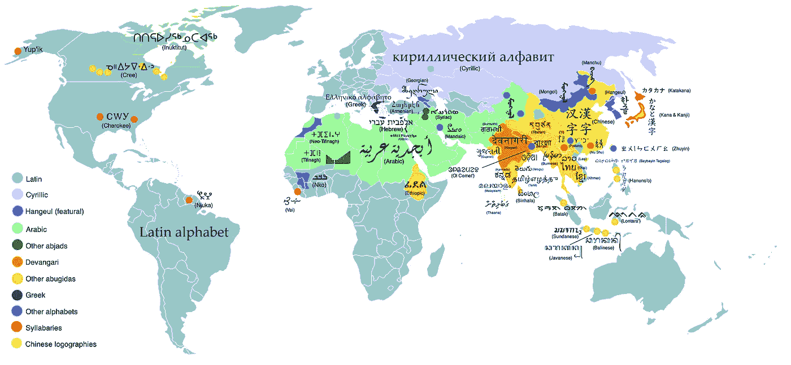
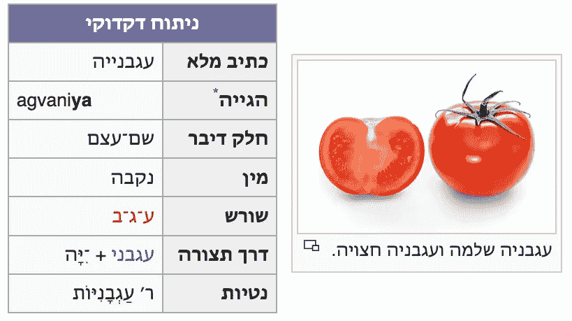
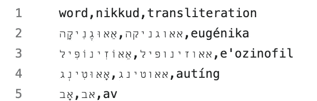
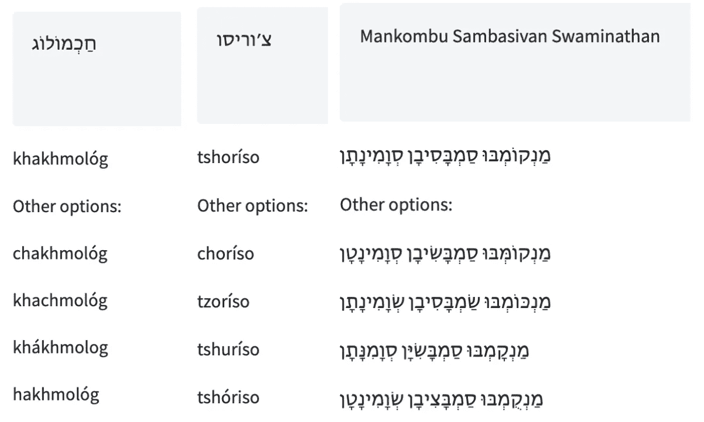
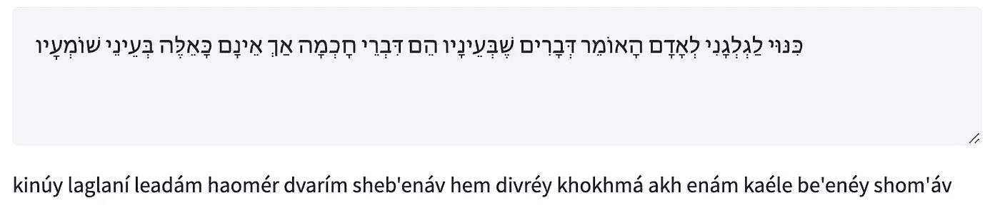

# TaatikNet: 序列到序列学习用于希伯来文音译

> 原文：[`towardsdatascience.com/taatiknet-sequence-to-sequence-learning-for-hebrew-transliteration-4c9175a90c23?source=collection_archive---------5-----------------------#2023-06-28`](https://towardsdatascience.com/taatiknet-sequence-to-sequence-learning-for-hebrew-transliteration-4c9175a90c23?source=collection_archive---------5-----------------------#2023-06-28)

## 一个简单的示例，展示了字符级别的 seq2seq 学习应用于复杂任务：在希伯来文文本和拉丁文音译之间的转换

[](https://medium.com/@morrisalper?source=post_page-----4c9175a90c23--------------------------------)[](https://towardsdatascience.com/?source=post_page-----4c9175a90c23--------------------------------) [莫里斯·阿尔珀](https://medium.com/@morrisalper?source=post_page-----4c9175a90c23--------------------------------)

·

[关注](https://medium.com/m/signin?actionUrl=https%3A%2F%2Fmedium.com%2F_%2Fsubscribe%2Fuser%2F3d69bf87dbed&operation=register&redirect=https%3A%2F%2Ftowardsdatascience.com%2Ftaatiknet-sequence-to-sequence-learning-for-hebrew-transliteration-4c9175a90c23&user=Morris+Alper&userId=3d69bf87dbed&source=post_page-3d69bf87dbed----4c9175a90c23---------------------post_header-----------) 发表在 [Towards Data Science](https://towardsdatascience.com/?source=post_page-----4c9175a90c23--------------------------------) ·10 分钟阅读·2023 年 6 月 28 日[](https://medium.com/m/signin?actionUrl=https%3A%2F%2Fmedium.com%2F_%2Fvote%2Ftowards-data-science%2F4c9175a90c23&operation=register&redirect=https%3A%2F%2Ftowardsdatascience.com%2Ftaatiknet-sequence-to-sequence-learning-for-hebrew-transliteration-4c9175a90c23&user=Morris+Alper&userId=3d69bf87dbed&source=-----4c9175a90c23---------------------clap_footer-----------)

--

[](https://medium.com/m/signin?actionUrl=https%3A%2F%2Fmedium.com%2F_%2Fbookmark%2Fp%2F4c9175a90c23&operation=register&redirect=https%3A%2F%2Ftowardsdatascience.com%2Ftaatiknet-sequence-to-sequence-learning-for-hebrew-transliteration-4c9175a90c23&source=-----4c9175a90c23---------------------bookmark_footer-----------)

我们如何利用深度学习在不被“困惑”的情况下进行字符串转换？（[图片](https://commons.wikimedia.org/wiki/File:Boggle_%282041108449%29.jpg) by Andrew Malone, [CC BY 2.0](https://creativecommons.org/licenses/by/2.0/deed.en)）

*本文描述了 TaatikNet 以及如何轻松实现 seq2seq 模型。有关代码和文档，请参见* [*TaatikNet GitHub 仓库*](https://github.com/morrisalp/taatiknet)*。要查看交互式演示，请参见* [*TaatikNet 在 HF Spaces 上*](https://huggingface.co/spaces/malper/taatiknet)*。*

# 介绍

许多自然语言处理中的有趣任务涉及在不同风格、语言或格式的文本之间转换：

+   **机器翻译**（例如，从英语到德语）

+   **文本摘要** **和释义**（例如，将长文本缩短为短文本）

+   **拼写纠正**

+   **抽象问题回答**（输入：上下文和问题，输出：答案文本）

这些任务统称为**序列到序列（Seq2seq）学习**。在所有这些任务中，输入和期望的输出都是字符串，这些字符串可能具有不同的长度，并且通常彼此之间没有一一对应关系。

假设你有一个配对示例的数据集（例如，句子及其翻译的列表，拼写错误和修正文本的多个示例等）。如今，只要数据足够多，使得模型能够学习到对新输入的泛化，训练神经网络变得相当容易。让我们看看如何使用 PyTorch 和 Hugging Face transformers 库以最小的努力训练 seq2seq 模型。

我们将重点关注一个特别有趣的用例：学习**在希伯来文本和拉丁音译之间转换**。我们将在下文中概述这一任务，但这里提出的想法和代码对超出这一特定案例的应用也是有用的——本教程对**任何希望从示例数据集中执行 seq2seq 学习的人**都应该有帮助。

# 我们的任务：希伯来音译

为了展示具有趣味性和相当新颖的应用案例，我们将其应用于**音译**。一般来说，音译是指在不同书写系统之间转换。虽然英语使用拉丁字母书写（“ABC…”），但世界上的语言使用许多不同的书写系统，如下所示：



世界上的一些书写系统。（[图片](https://commons.wikimedia.org/wiki/File:World_alphabets_%26_writing_systems.svg) by Nickshanks, [CC-BY-SA-3](https://creativecommons.org/licenses/by-sa/3.0/))

如果我们想使用拉丁字母来书写一个原本用不同书写系统书写的语言中的单词怎么办？这一挑战通过许多书写犹太节日汉 ukkah 名称的方式得到体现。目前的介绍在[维基百科文章](https://en.wikipedia.org/wiki/Hanukkah)中读取如下：

> **Hanukkah** ([/ˈhɑːnəkə/](https://en.wikipedia.org/wiki/Help:IPA/English); [希伯来语](https://en.wikipedia.org/wiki/Hebrew_language): חֲנֻכָּה‎, [现代希伯来语](https://en.wikipedia.org/wiki/Modern_Hebrew): Ḥanukka, [提比留语](https://en.wikipedia.org/wiki/Tiberian_vocalization): Ḥănukkā) 是一个[犹太节日](https://en.wikipedia.org/wiki/Jewish_holidays)，纪念[耶路撒冷](https://en.wikipedia.org/wiki/Jerusalem)的恢复以及[第二圣殿](https://en.wikipedia.org/wiki/Second_Temple)的重新奉献，发生在公元前 2 世纪的[马加比起义](https://en.wikipedia.org/wiki/Maccabean_Revolt)之初，对抗[塞琉古帝国](https://en.wikipedia.org/wiki/Seleucid_Empire)。

希伯来词汇חֲנֻכָּה‎的拉丁字母音译可以是*Hanukkah*、*Chanukah*、*Chanukkah*、*Ḥanukka*或许多其他变体。在希伯来语以及许多其他书写系统中，存在各种约定和模糊性，使得音译复杂，而不是简单的一对一字符映射。

在希伯来语的情况下，可以使用复杂的规则将带有 nikkud（元音符号）的文本音译成拉丁字符，尽管也存在各种边缘情况，使得这看似复杂。此外，尝试将没有元音符号的文本音译或执行反向映射（例如*Chanukah* → חֲנֻכָּה）要困难得多，因为可能的有效输出非常多。

幸运的是，借助于对现有数据应用深度学习，我们可以用极少的代码在解决这个问题上取得很大进展。让我们看看如何**训练一个 seq2seq 模型——TaatikNet——使其能够自主学习如何在希伯来文文本和拉丁音译之间转换**。我们注意到这是一个**字符级任务**，因为它涉及到对希伯来文本和音译中不同字符之间关系的推理。我们将进一步讨论这一点的重要性。

顺便提一下，你可能听说过我们的 UNIKUD 模型，它用于给无标记的希伯来文文本添加元音符号。这些任务之间有一些相似之处，但主要的区别在于 UNIKUD 执行的是字符级分类，即对每个字符，我们学习是否在其旁边插入一个或多个元音符号。相比之下，在我们的情况下，由于音译的复杂性，输入和输出文本的长度或顺序可能不完全对应，因此我们在这里使用 seq2seq 学习（而不仅仅是按字符分类）。

# 数据收集

与大多数机器学习任务一样，我们很幸运能够收集到大量模型输入和期望输出的例子，以便我们可以使用**监督学习**对其进行训练。

对于许多与单词和短语相关的任务，一个很好的资源是[Wiktionary](https://www.wiktionary.org/)及其多语言对照——可以将其想象为维基百科与词典的结合。特别是，[希伯来语 Wiktionary (ויקימילון)](https://he.wiktionary.org/)包含了结构化的语法信息条目，如下所示：



来自希伯来语 Wiktionary 文章[עגבניה](https://he.wiktionary.org/wiki/%D7%A2%D7%92%D7%91%D7%A0%D7%99%D7%94)（西红柿）的语法信息。

特别是，这包括拉丁音译（*agvani****ya***，其中粗体表示重音）。连同包含 nikkud（元音字符）的章节标题，这为我们提供了训练模型所需的（自由许可）数据。

为了创建数据集，我们使用 Wikimedia REST API 抓取这些条目（[示例见此](https://gist.github.com/morrisalp/8fb89b43d79e2ea2190b18441e83d5eb)）。请注意，Wiktionary 条目的原始文本具有宽松的衍生作品许可（CC 和 GNU 许可，[详情见此](https://en.wiktionary.org/wiki/Wiktionary:Copyrights)），并要求共享相同许可（TaatikNet 许可[见此](https://github.com/morrisalp/taatiknet/blob/main/LICENSE)）；通常情况下，如果你执行数据抓取，请确保使用具有宽松许可的数据，适当抓取，并使用正确的衍生作品许可。

我们对这些数据执行各种预处理步骤，包括：

+   去除 Wiki 标记和元数据

+   用尖音符号代替粗体表示重音（例如 *agvani****ya*** → *agvaniyá)*。

+   [Unicode NFC 规范化](https://unicode.org/reports/tr15/) 用于统一相同出现的字形，例如 בּ（U+05D1 希伯来字母 Bet + U+05BC 希伯来点 Dagesh 或 Mapiq）和 בּ（U+FB31 希伯来字母 Bet 带 Dagesh）。你可以通过将它们粘贴到[Show Unicode Character 工具](https://qaz.wtf/u/show.cgi)中自行比较。我们还统一了类似的标点符号，如希伯来语 geresh（׳）和撇号（‘）。

+   将多词表达拆分为单个词。

数据抓取和预处理后，我们得到近 15k 对单词-音译对（[csv 文件见此](https://github.com/morrisalp/taatiknet/blob/main/data/he_transliterations.csv)）。以下是几个示例：



我们数据集中的几个项目示例。请注意，带有 nikkud（元音点）的希伯来语在第二列，但由于从右到左的文本渲染问题，它首先出现。

音译绝非一致或无误；例如，重音标记不一致且经常错误标记，且使用了各种拼写规则（例如 ח 可能对应于 *h, kh,* 或 *ch*）。我们不会尝试清理这些，而是将其直接输入模型，让模型自行理解。

# 训练

现在我们有了数据集，让我们进入项目的“核心”——在我们的数据上训练 seq2seq 模型。我们将最终模型命名为 **TaatikNet**，取自希伯来语单词 תעתיק *taatik*，意为“音译”。我们将在这里高层次地描述 TaatikNet 的训练，但强烈建议你阅读[注释过的训练笔记本](https://github.com/morrisalp/taatiknet/blob/main/training.ipynb)。训练代码本身非常简短且具有指导性。

要在自然语言处理（NLP）任务上实现最先进的结果，一种常见的方法是使用预训练的变换器神经网络，并通过继续在任务特定数据集上进行微调来应用迁移学习。对于 seq2seq 任务，最自然的基模型选择是一个[编码器-解码器（enc-dec）模型](https://huggingface.co/docs/transformers/model_doc/encoder-decoder)。像 T5 和 BART 这样的常见 enc-dec 模型非常适合常见的 seq2seq 任务，如文本摘要，但由于它们对文本进行标记化（将其拆分为子词标记，大致是词或词块），因此不太适合我们的任务，因为我们需要在单个字符级别上进行推理。为此，我们使用无标记化的 ByT5 enc-dec 模型（[论文](https://arxiv.org/abs/2105.13626)，[HF 模型页面](https://huggingface.co/docs/transformers/model_doc/byt5)），该模型在单个字节级别上进行计算（大致为字符，但请参阅[Joel Spolsky 对 Unicode 和字符集的优秀文章](https://www.joelonsoftware.com/2003/10/08/the-absolute-minimum-every-software-developer-absolutely-positively-must-know-about-unicode-and-character-sets-no-excuses/)以更好地理解 Unicode 字形如何映射到字节）。

我们首先创建一个 PyTorch Dataset 对象来封装我们的训练数据。我们可以简单地将数据集 CSV 文件中的数据包装起来而不做任何修改，但我们添加了一些随机增强，使模型的训练过程更加有趣：

```py
def __getitem__(self, idx):
  row = self.df.iloc[idx]
  out = {}
  if np.random.random() < 0.5:
      out['input'] = row.word if np.random.random() < 0.2 else row.nikkud
      out['target'] = row.transliteration
  else:
      out['input'] = randomly_remove_accent(row.transliteration, 0.5)
      out['target'] = row.nikkud
  return out
```

这种增强方法教会 TaatikNet 接受希伯来文字或拉丁文字作为输入，并计算相应的匹配输出。我们还会随机丢弃元音符号或重音，以训练模型对其缺失具有鲁棒性。一般来说，随机增强是一种很好的技巧，当你希望网络学会处理各种类型的输入，而不必事先计算数据集中所有可能的输入和输出时。

我们使用一行代码通过 Hugging Face pipeline API 加载基础模型：

```py
pipe = pipeline("text2text-generation", model='google/byt5-small', device_map='auto')
```

在处理数据整合和设置超参数（如训练轮次、批量大小、学习率）后，我们在数据集上训练模型，并在每轮训练后打印出选定的结果。训练循环是标准的 PyTorch，除了 `evaluate(…)` 函数外，该函数在其他地方定义，并打印出模型在各种输入上的当前预测：

```py
for i in trange(epochs):
  pipe.model.train()
  for B in tqdm(dl):
    optimizer.zero_grad()
    loss = pipe.model(**B).loss
    losses.append(loss.item())
    loss.backward()
    optimizer.step()
  evaluate(i + 1)
```

比较早期轮次和训练结束时的一些结果：

```py
Epoch 0 before training: kokoro => okoroo-oroa-oroa-oroa-oroa-oroa-oroa-oroa-oroa-oroa-oroa-oroa-oroa-oroa-oroa-oroa-oroa-oroa-oroa-o
Epoch 0 before training: יִשְׂרָאֵל => אלאלאלאלאלאלאלאלאלאלאלאלאלאלאלאלאלאלאלאלאלאלאלאלא
Epoch 0 before training: ajiliti => ajabiliti siti siti siti siti siti siti siti siti siti siti siti siti siti siti siti siti siti sit

Epoch 1: kokoro => מְשִׁית
Epoch 1: יִשְׂרָאֵל => mará
Epoch 1: ajiliti => מְשִׁית

Epoch 2: kokoro => כּוֹקוֹרְבּוֹרוֹר
Epoch 2: יִשְׂרָאֵל => yishishál
Epoch 2: ajiliti => אַדִּיטִי

Epoch 5: kokoro => קוֹקוֹרוֹ
Epoch 5: יִשְׂרָאֵל => yisraél
Epoch 5: ajiliti => אֲגִילִיטִי

Epoch 10 after training: kokoro => קוֹקוֹרוֹ
Epoch 10 after training: יִשְׂרָאֵל => yisraél
Epoch 10 after training: ajiliti => אָגִ'ילִיטִי
```

在训练之前，模型输出的是无意义的字符，这在预期之中。在训练过程中，我们看到模型首先学会如何构造有效的希伯来语和音译，但花费更长时间来学习它们之间的联系。它也需要更长时间来学习诸如ג׳（*gimel* + *geresh*）对应于 *j* 的稀有项目。

一个警告：我们没有尝试优化训练过程；超参数的选择相当随意，也没有为严格评估预留验证集或测试集。此目的仅为提供一个 seq2seq 训练的简单示例和音译学习的概念验证；然而，超参数调优和严格评估将是未来工作的一个有前途的方向，结合下文限制部分提到的要点。

# 结果

下面显示了一些示例，演示了希伯来文本（有或没有元音）与拉丁音译之间的双向转换。你可以在[HF Spaces 上的互动演示](https://huggingface.co/spaces/malper/taatiknet)中尝试自己使用 TaatikNet。注意，它使用束搜索（5 束）进行解码，推理是对每个单词单独进行的。



TaatikNet 的输入和输出示例见[互动演示](https://huggingface.co/spaces/malper/taatiknet)。使用束搜索解码（5 束）生成多个输出。



更长文本的示例输出。推理是对每个单词单独进行的。注意挑战性案例如שבעיניו（最后的 yud 不发音）、חוכמה（kamatz gadol）、כאלה（倒数第二个音节重音）的成功音译。

# 限制与进一步方向

为了简化，我们将 TaatikNet 实现为一个最小的 seq2seq 模型，没有进行广泛的调优。然而，如果你对改进希伯来文文本与音译之间的转换结果感兴趣，有许多有前景的未来工作方向：

+   TaatikNet 仅尝试根据字母或声音对应关系猜测适当的拼写（无论是希伯来文还是拉丁音译）。然而，根据上下文，你可能希望将音译转换为有效的希伯来文本（例如 *zot dugma* → זאת דוגמא，而不是拼写错误的 *זות דוגמע*）。实现这一点的可能方法包括检索增强生成（访问词典）或在希伯来语句子及其拉丁音译的配对上进行训练，以学习上下文提示。

+   形式不寻常的输入可能会导致 TaatikNet 的解码陷入循环，例如 *drapapap* → דְּרַפָּפָּאפָּאפָּאפָּאפָּאפָּאפָּאפָּאפָּאפָּאפָּאפָּאפָּאפָּאפָּאפָּאפָּאפָּאפָּאפָּאפָּאפָּאפָּאפָּ. 这可能通过训练中的数据增强、更丰富的训练数据或在训练或解码中使用循环一致性来解决。

+   TaatikNet 可能无法处理其训练数据中一些相当稀有的惯例。例如，它常常无法正确处理ז׳（*zayin+geresh*），这表示稀有的外来音*zh*。这可能表明过拟合，或者在训练时使用样本权重以强调困难示例可能会有所帮助。

+   seq2seq 训练的便利性是以解释性和鲁棒性为代价的——我们可能希望确切了解 TaatikNet 如何做出决策，并确保这些决策的一致性。一个有趣的可能扩展是将其知识提炼成一组基于规则的条件（例如，如果在上下文 Y 中看到字符 X，则写 Z）。最近的代码预训练 LLM 可能对这个有所帮助。

+   我们没有处理[“完整拼写”和“缺陷拼写”（כתיב מלא / חסר）](https://en.wikipedia.org/wiki/Ktiv_hasar_niqqud)，即希伯来词在有无元音符号的情况下拼写略有不同。理想情况下，模型应在无元音的“完整”拼写和有元音的“缺陷”拼写上进行训练。请参阅 UNIKUD 了解处理这些拼写的一种方法。

如果你尝试这些或其他想法并发现它们带来了改进，我非常乐意听到你的反馈，并在此处给你致谢——可以通过本文下方的联系信息与我联系。

# 结论

我们已经看到，用监督学习训练一个 seq2seq 模型是相当简单的——教它从大量配对示例中进行归纳。在我们的案例中，我们使用了一个字符级模型（TaatikNet，从基础 ByT5 模型微调而来），但几乎可以使用相同的过程和代码来处理更标准的 seq2seq 任务，如机器翻译。

我希望你从本教程中学到的东西与我整理它时学到的一样多！如有任何问题、意见或建议，请随时与我联系；我的联系信息可以在下面链接的我的网站上找到。

**莫里斯·阿尔珀，硕士** 是特拉维夫大学的博士生，研究多模态学习（NLP、计算机视觉及其他模态）。有关更多信息和联系信息，请访问他的网页：[`morrisalp.github.io/`](https://morrisalp.github.io/)
