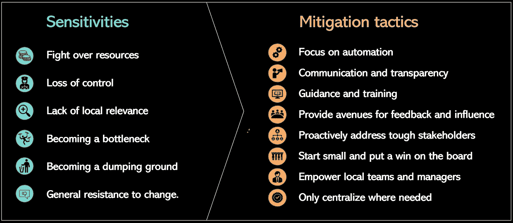

# 处理集中数据管理中的敏感性问题

> 原文：[`towardsdatascience.com/tackling-sensitivities-in-centralized-data-management-c1050a4310b7?source=collection_archive---------12-----------------------#2023-07-24`](https://towardsdatascience.com/tackling-sensitivities-in-centralized-data-management-c1050a4310b7?source=collection_archive---------12-----------------------#2023-07-24)

## *战斗中的经验教训*

 [Willem Koenders](https://medium.com/@willemkoenders?source=post_page-----c1050a4310b7--------------------------------)

·

[关注](https://medium.com/m/signin?actionUrl=https%3A%2F%2Fmedium.com%2F_%2Fsubscribe%2Fuser%2Fa754b81446b6&operation=register&redirect=https%3A%2F%2Ftowardsdatascience.com%2Ftackling-sensitivities-in-centralized-data-management-c1050a4310b7&user=Willem+Koenders&userId=a754b81446b6&source=post_page-a754b81446b6----c1050a4310b7---------------------post_header-----------) 发表在 [Towards Data Science](https://towardsdatascience.com/?source=post_page-----c1050a4310b7--------------------------------) ·8 分钟阅读·2023 年 7 月 24 日 

--

图片由 [Jehyun Sung](https://unsplash.com/@jaysung) 提供，通过 [Unsplash](https://unsplash.com/) 获取。

大多数规模和年龄相当的组织如今已经启动了提升数据处理和管理方式的举措。任何结构性提升数据管理能力的尝试都将需要一定程度的集中化，即便只是为了发现组织内的现状实践。一个普遍的趋势是任命首席数据官，[一项调查发现](https://www.wavestone.us/insights/data-and-analytics-leadership-annual-executive-survey-2023/) 超过 80%的财富 1000 强组织现在都报告说已经设立了首席数据官。

任何变革都可能引发反应，尤其是那些定义新责任、改变权威并需要资金的组织变革可能会敏感，因此处理起来可能棘手。我花了十多年时间陪伴新兴的首席数据官走过他们的旅程。我有许多经验教训可以分享。接下来的文章中，我们将回顾启动中央数据团队时的典型挑战以及应对这些风险的实际措施。

# 启动中央数据团队及相关敏感问题

创建一个初步的中央团队并集中责任可以通过多种方式完成。这可能包括启动首席数据办公室、成立数据（治理）委员会、改进中央驱动的政策和标准，以及提供中央资源以执行特定的数据治理流程。

随着中央数据团队获得权威，其他团队必须让出这部分权力——这可能带来敏感问题。以下是一些最常见的挑战：

+   **资源争夺战**。中央团队需要人员和预算来运作。有时，这可能意味着从其他团队的预算或人员中挪用资源，这可能引发这些团队领导的反应。

+   **控制权丧失**。曾经对某些任务有自由支配权的团队可能不喜欢中央团队接管这些任务，或对如何执行这些任务提供标准。

+   **缺乏地方相关性**。如果中央团队与地方（或业务特定）的需求、操作和细节过于脱节，他们可能做出不能产生预期业务影响的决策，并且地方专长可能会丧失。

+   **成为瓶颈**。如果中央团队的人员配置和管理不当，可能会成为组织中的瓶颈或摩擦点，从而成为挫败感和怨恨的源头。

+   **成为倾卸点**。中央团队可能成为一个倾卸点，接手其他人不愿意承担的任务和责任，而这些任务和责任只产生有限的价值。

+   **对变革的普遍抵触**。团队和个人可能会对变革产生抵触，尤其是当影响未知或理解不充分时，且如果他们觉得自己无法达到新的期望。

让我们回顾一些与这些挑战相关的真实案例，我曾亲身目睹。在第一个案例中，该组织是一家全球前 100 的保险公司，拥有超过 5 万名员工，策略非常激进。新任首席数据官有“完成任务”的历史，这也是他被任命的部分原因。他的计划是定义一系列被归类为“数据治理活动”的活动。然后，手握描述的他，识别出整个组织中已经执行这些活动的人，最初是以评估当前状态的名义进行的。在最终被识别出的人中，有时数据治理占据了他们整个工作的内容，有时只是其中的一小部分。例如，有人可能在市场营销流程中从事数据质量工作。

一旦完成了对这些人员的分析，提出了将这些人员的大部分转移到中央团队的建议。当然，这导致了业务和职能团队的即时反抗，这些人员原本就位于这些团队中。他们曾通过参与成熟度评估展现了善意，却看到他们的团队成员，往往是各自操作中至关重要的部分，被重新分配。新的首席数据官很快发现自己陷入了敌对的局面，并且在第一年剩下的时间里几乎没有取得任何成果。

另一个案例来自一家全球银行，其中全球首席数据与分析官（“CDAO”）启动了一个转型项目，以创建一个经过整理的数据湖。CDAO 担心创建一个数据沼泽，因此她坚持严格的认证过程。该项目的承诺很强 — 团队可以提交请求，将数据上传到数据湖中，由 CDAO 领导的中央团队负责数据的摄取、标记和质量控制，以及访问权限的提供，使得业务和职能团队可以专注于数据分析和建立分析模型。然而，需求很快超过了容量，数据进入数据湖的平均处理时间超过了 1 个月，业务团队也因此变得沮丧，因为中央数据团队成了瓶颈。尽管有良好的意图，但需要进行一次重大重置（在情况如上所述恶化时，我的团队帮助分析了可以自动化数据治理过程的工具）。

上述例子来源于我的个人经验，但对于那些感兴趣的人，[《数据驱动企业与 DataOps》](https://www.oreilly.com/library/view/creating-a-data-driven/9781492049227/)由 Ashish Thusoo 和 Joydeep Sen Sarma 编写，提供了一些出色的阅读材料和附加案例研究。

# 减轻策略

图片由作者提供。

组织可以采取各种措施来管理与集中数据管理相关的敏感问题。以下是我个人的一些偏爱方法：

+   **关注自动化**。通过采用自动化优先的思维方式，可以减少手动工作和成本，从而缩减对大团队的需求。设计中的数据治理，将治理原则嵌入数据系统设计中，可以促进一致性和效率。

+   **沟通和透明度**。关于集中化的原因和预期结果的清晰及时沟通可以培养信任，并鼓励利益相关者的支持。

+   **指导和培训**。任何新的或更新的流程或政策都应配备适用的教育材料和社交化流程，以明确其实施方式。

+   **提供反馈和影响的途径**。数据委员会或治理论坛可以确保利益相关者不仅仅是数据治理指南的接受者，而是旅程中积极且受重视的合作伙伴。

+   **主动应对棘手的利益相关者**。识别可能有特定关注点或异议的利益相关者，并主动应对，尽可能包括一对一的会议，并明确管理各自的需求和要求。

+   **从小处开始，取得初步胜利**。从一个理解明确、涉及相对“友好”人员且有明确业务案例的范围开始。这可以产生初步的动力，为以后处理更复杂的问题奠定基础。

+   **赋权于本地团队和管理者**。智能数据治理不是将所有工作集中化，而是使现有角色和人员能够以一致的方式更好地履行职责。跨功能和跨区域的团队可能是一个选择。

+   **仅在需要时集中化**。确保标准化或集中化数据治理的努力基于积极的业务案例。在不确定时避免集中化。

让我们回顾一下我个人观察的一些额外案例。首先，为了避免资源上的激烈争夺，一家大型区域零售商采用了有针对性的、基于用例的方法，分析了基于约 25 个数据角色的资源需求和缺口。这些角色包括数据所有者、数据管理员、数据建模师、数据科学家、数据工程师、系统所有者、流程所有者、领域数据管理员、数据架构师等。下一步是与业务和职能团队讨论这些角色，识别他们已经拥有的角色和面临的挑战，例如在拥有正确的专业知识和技术方面。当识别出共同的痛点和机会领域，中央团队能够有效地提升业务和职能团队时，这会得到立即欢迎。完成业务案例以获得初步的、尽管规模较小的团队的资金是快速而简单的。

与我曾合作过的另一位首席数据官一起，我们在她推出新的数据治理操作模型的同时，开展了数据素养和文化推广活动。新的操作模型引入了许多员工不熟悉的新术语和责任，我们认为这可能会引起混淆和焦虑。除了其他举措外，我们还组织了一场“问我任何问题”的会议，组织中的任何人——总计超过 25,000 名员工——都可以匿名提交问题，问题会被实时回答。除了许多实际问题外，还提出了很多敏感问题，比如“这些新责任对我的薪酬有何影响？”，“这是三年来的第 3 个新操作模型——我们真的需要另一个吗？”，以及“我的团队领导认为这是胡说八道——我该怎么办？”随后匿名收集的反馈和轶事评论表明，这种透明的方法缓解了个人的担忧，并鼓励了那些受到重新定义的责任影响的员工的认可。

最后的一个例子，也许是我最喜欢的案例研究，是经过改造的首席数据办公室采纳了自动化优先的思维模式。为新实施的云原生数据平台创建了一个参考架构，其中包括几个基础设施：数据产品方法、严格的互操作标准和数据管理中心。这意味着任何转移到平台上的内容*从定义上*都是自动管理的。即，只有符合数据产品标准的内容才被允许存储在平台上，从而确保了（产品和数据）所有权的定义。互操作标准、平台内部的共同存储模式以及数据管理中心（包括数据目录）的结合实现了几乎完全自动化的元数据管理。尽管这需要大量的前期投资来打好基础，但避免了中央数据平台团队需要大量分析师和工程师来操作平台及其数据产品的情况。

# 展望未来

集中管理数据并非一项简单的任务；它充满了复杂性和敏感性。然而，通过有效的沟通、利益相关者参与、重点培训和经过深思熟虑的方法，仅在有明确业务案例的情况下进行集中，这些挑战可以得到有效管理。如果你有任何见解或经验要分享，请在评论中告诉我们。

# 参考文献

+   [*首席数据官的三个被低估的成功因素*](https://medium.com/zs-associates/three-underappreciated-success-factors-of-chief-data-officers-100fcca254ee)，Medium。

+   [*首席数据官创造并展示价值的 8 种策略*](https://hbr.org/2023/01/8-strategies-for-chief-data-officers-to-create-and-demonstrate-value)，HBR。

+   [*三次首席数据官的五个教训*](https://data.world/resources/webinar/five-lessons-chief-data-officer/)，Data World。

+   [*创建以数据驱动的企业与 DataOps*](https://www.oreilly.com/library/view/creating-a-data-driven/9781492049227/)，Ashish Thusoo 和 Joydeep Sen Sarma。
