# Taipy：构建用户友好的生产就绪数据科学应用程序的工具

> 原文：[`towardsdatascience.com/taipy-a-tool-for-building-user-friendly-production-ready-data-scientists-applications-80de97aaf7dd`](https://towardsdatascience.com/taipy-a-tool-for-building-user-friendly-production-ready-data-scientists-applications-80de97aaf7dd)

## 一种简单、快速且高效的方式来构建全栈数据应用程序

[](https://zoumanakeita.medium.com/?source=post_page-----80de97aaf7dd--------------------------------)[](https://towardsdatascience.com/?source=post_page-----80de97aaf7dd--------------------------------) [Zoumana Keita](https://zoumanakeita.medium.com/?source=post_page-----80de97aaf7dd--------------------------------)

·发布在 [Towards Data Science](https://towardsdatascience.com/?source=post_page-----80de97aaf7dd--------------------------------) ·14 分钟阅读·2023 年 7 月 6 日

--


图片由 [Campaign Creators](https://unsplash.com/@campaign_creators) 提供，来源于 [Unsplash](https://unsplash.com/photos/pypeCEaJeZY)

# 介绍

作为数据科学家，你可能希望创建数据可视化的仪表板，展示数据，甚至实现商业应用来协助利益相关者做出可操作的决策。

多种工具和技术可以用于执行这些任务，无论是开源还是专有软件。然而，这些可能由于以下原因而不理想：

+   一些开源技术需要陡峭的学习曲线和聘请具备相应专长的人员。因此，组织可能面临新员工的入职时间增加、培训成本更高以及寻找合格候选人的潜在挑战。

+   其他开源解决方案非常适合原型设计，但无法扩展到生产就绪的应用程序。

+   同样，专有工具也带来了自己的挑战，包括更高的许可费用、有限的自定义和企业难以切换到其他解决方案。

> *如果有一个不仅是开源的，而且易于学习并能够扩展为完整应用程序的工具，那该多好啊？*

这就是 Taipy 发挥作用的地方🎉

本文将解释 Taipy 是什么，并展示它可以解决的一些商业案例，然后再深入探讨其关键特性。此外，它还将说明创建完整 Web 应用程序的所有步骤。

# Taipy 是什么，为什么你应该关心它？

这是一个开源的、100% Python 库，只需要基本的 Python 编程知识即可使用。它允许数据科学家、机器学习工程师以及任何其他 Python 程序员迅速将他们的数据和机器学习模型转化为功能齐全的 Web 应用程序。

在当今迅速变化的环境中，对强大、灵活且高效工具的需求变得至关重要，以下是一些使 Taipy 成为独特平台的特性：

+   它不仅仅为试点项目设计，还可以扩展到工业化项目。

+   Taipy 的简单性与强大的功能相结合，使得具有最低编程背景的 Python 开发者可以在短时间内构建强大的解决方案。

+   高度的可定制性使用户能够快速修改和调整 Taipy 的功能以满足他们的需求，这提供了许多开源工具无法提供的个性化体验。

+   Taipy 提供的同步和异步调用允许同时执行多个任务，从而提高了整体性能。

+   Taipy 应用程序可以通过 Python 脚本或 Jupyter Notebooks 开发。

+   借助 Taipy 的管道版本控制功能，用户可以有效地管理不同的项目版本。

[Taipy studio](https://docs.taipy.io/en/release-2.1/manuals/studio/) 扩展可以安装到 Visual Studio Code 中，从而显著加快 Taipy 应用程序的开发速度。

# Taipy 的关键特性

尽管 Taipy 对于前端或后端开发非常出色，但当涉及到开发具有前端和后端组件的完整 Web 应用程序时，其真正的潜力才会显现。

让我们仔细看看它们的主要功能：

## Taipy 前端功能

+   创建用户界面只需具备基本的 Python 编程知识。

+   Taipy 旨在用户友好，使用户界面的创建简单直观。

+   不需要网页设计知识，消除了所有 CSS 和 HTML 的先决条件。

+   它利用增强的 Markdown 语法来帮助用户创建他们想要的网页。

## Taipy 后端功能

+   Taipy 支持创建强大的管道以处理不同的场景。

+   它使得有向无环图（DAGs）的建模变得简单明了。

+   数据缓存功能提升了 Taipy 应用程序的整体性能。

+   管道执行的注册。

+   管道版本控制。

+   用户可以通过 Taipy 的 KPI 追踪工具跟踪和评估他们应用程序的性能。

+   内置的管道和相关数据的可视化。

# 开始使用 Taipy

现在你对 Taipy 有了更好的了解，让我们深入探讨一个端到端的实现。

核心[Taipy 文档](https://docs.taipy.io/en/latest/)和[社区贡献](https://www.taipy.io/community-contributions/)包含相关信息，本文绝不会取代它们，但可以作为了解 Taipy 在实际场景中的一种替代起点。

为了更好地说明我们的案例，我们将使用[健康相关数据泄露](https://ocrportal.hhs.gov/ocr/breach/breach_report.jsf)，这些数据由美国卫生与公众服务部民权办公室维护。它提供了关于 500 多名个人的未加密受保护健康信息泄露的报告信息。

本节将分为两个部分：

+   使用 Taipy 构建一个图形界面，以帮助最终用户对不同类型的漏洞有一个整体概述，从而做出可操作的决策。

+   开发一个 Taipy 后端框架，以与分类机器学习模型互动，以预测给定信息的漏洞类型。

## 快速安装

使用 Taipy 需要 Python 3.8 或更高版本。使用 Anaconda Python 发行版（conda）和 Visual Studio Code IDE 安装 Taipy，如下所示：

创建名为**taipy-env**的虚拟环境并安装 Python 3.8

```py
conda create –-name taipy-env python=3.8
```

激活之前创建的环境

```py
conda activate taipy-env
```

以下命令将在虚拟环境中安装 taipy 库

```py
pip install taipy
```

## 运行 Taipy 应用程序

+   创建一个 Python 脚本文件<taipy_app.py>

+   输入以下代码，然后保存文件：

```py
from taipy import Gui

analytics_choice = ["Breach types distribution",
                 "Breach by State",
                 "Top 10 Risky States",
                 "Covered Entity Type",
                 ""]

choice = ""

my_app_page = """
# Security Breach Analytics Dashboard

## Breach Analysis
Please choose from the list below to start your analysis

<|{choice}|selector|lov={analytics_choice}|dropdown|>

Your choice: <|{choice}|text|>
"""

if __name__ == '__main__':
 Gui(page=my_app_page).run(host="0.0.0.0", port=9696)
```

在 conda 控制台中，从 taipy_app.py 中输入以下命令：

```py
python taipy_app.py
```

上述代码的成功执行会生成此 URL，并自动打开一个浏览器窗口：


访问应用程序的 URL

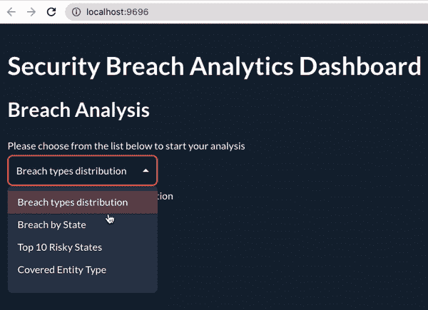

作者提供的图片

太棒了！

现在，让我们深入了解之前的代码。

+   导入用于创建仪表盘的 Gui 模块。

+   `analytics_choice`是可能选择的列表。

+   然后，变量`choice`将保存来自`analytics_choice`的值，这些变量的插值使用<|…|>语法完成。

+   my_page 包含以下 markdown 格式的信息：

+   **安全漏洞分析仪表盘**的 H1 级别用单个“#”符号表示。

+   **漏洞分析**的 H2 级别用双“#”符号表示，后跟简单的文本“请选择…分析”

+   我们使用原始的`analytics_choice`和 choice 变量创建一个下拉列表。

+   显示用户做出的选择。

最后，通过指定 my_app_page 以及端口和主机来运行应用程序。不指定服务器端口将使用默认端口（5000）。对于这个特定的示例，应用程序在**9696**端口打开，网址为[**http://localhost:9696**](http://localhost:9696)

# 从头开始创建一个 Taipy 仪表盘

通过实现一个完整的仪表盘，将我们的 Taipy 知识提升到一个新的水平。仪表盘的主要部分将利用 Taipy 的以下视觉元素：

+   从选项列表中进行选择，使用 **选择器**。

+   使用 **按钮** 通过点击按钮触发操作。

+   在**表格**中显示原始数据。

使用 **图表** 显示图形结果。

所有这些可视化元素都是通过引入以下 Markdown 语法创建的：

<|{variable}|visual_element_name|param1=param1|param2=param2|…|>

最终仪表板将如下所示，最终的源代码将在文章末尾提供。

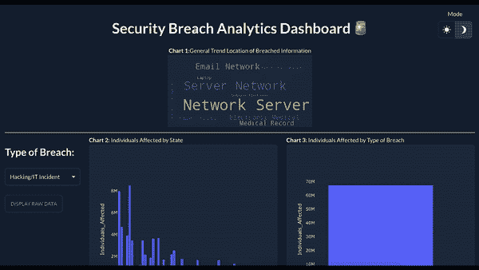

使用 Taipy GUI 创建的最终仪表板（作者提供的图像）

为了进行逐步演示，将在单独的文件中提供每个组件的示例，并使用以下命令运行每个文件：

`python file_name.py`

## 选择器

这些选项允许用户从下拉列表中选择，这与我们在“运行 Taipy 应用程序”部分中实现的功能相对应。

## 按钮和表格

用户界面中的按钮在被点击或按下时会启动特定的功能。***on_action*** 函数会在按钮被按下时触发。

表格用于组织数据，提供三种显示模式：分页、***allow_all_rows***、***unpaginated*** 和 ***auto_loading***。 [官方文档](https://www.taipy.io/tips/using-tables/) 提供了关于这些模式的更多信息。

创建一个新文件 `button.py`，并包含以下代码：

```py
from taipy import Gui
import pandas as pd

breach_data = pd.read_csv("data/breach_report_data.csv")

def toggle_table_dialog(state):
 state.show_table_dialog = not state.show_table_dialog

show_table_dialog = False

my_app_page = """
<center> Security Breach Analytics Dashboard</center>
------------------------------
<br/>

<center> Click the Button below to display data </center>

<br/>

<center><|Display Raw Data|button|on_action=toggle_table_dialog|></center>
<|{show_table_dialog}|dialog|on_action=toggle_table_dialog|width=90vw|labels=Cancel|
<center><|{breach_data}|table|width=fit-content|height=65vh|></center>
|>
"""
```

我们首先将违约数据加载到 Pandas 数据框中。然后，选择“显示原始数据”将所有数据以表格格式展示，如下所示：

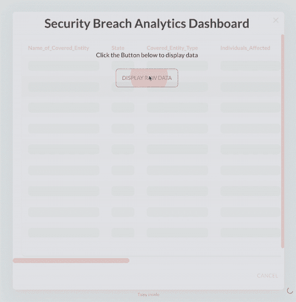

使用 Taipy 创建的按钮结果（作者提供的图像）

## 图表

通过更好地理解上述组件，我们可以将它们结合起来创建图表，基于全面的 plotly.js 图形库。否则，[Taipy 的文档](https://docs.taipy.io/en/latest/manuals/gui/viselements/chart/) 提供了很好的示例作为起点。与前一部分类似，创建一个 `charts.py` 文件并包含以下代码：

创建一个条形图，其中 State 位于 `x 轴`，Proportion 位于 `y 轴`。

```py
# import libraries here

my_app_page = """
<center> Security Breach Analytics Dashboard</center>
------------------------------
<center> Graph 3: Top 10 Most Affected States</center>
<br/>
<|{breach_df}|chart|type=bar|x=State|y=Individuals_Affected|>
"""

# Put the '__main__' section here
```

最终结果是这个动态图表，显示了按 State 受影响的个人数量，似乎加利福尼亚州受影响最严重。

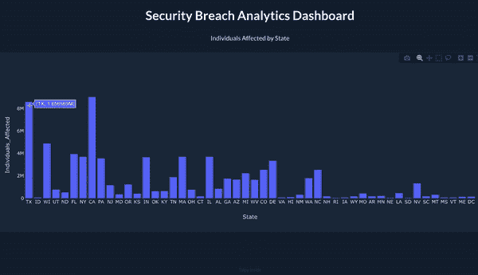

使用 Taipy 的图表（作者提供的图像）

## 显示图像

在 Taipy GUI 中显示图像也很简单，可以使用 `image` 属性实现。以下代码展示了由 `generate_word_cloud` 生成的词云。图像的宽度为 2400 像素，高度为 1000 像素。当用户的鼠标悬停在图像上时，将显示 `hover_text` 属性的值：在这种特定情况下为 **“违约地点的词云”**。

```py
<|{breach_location_image}|image|width="2400px"|height="1000px"|hover_text="Word cloud of Breach Location"|>
```


违约信息的位置词云（作者提供的图像）

此外，辅助函数`generate_word_cloud`的定义如下：

```py
from wordcloud import WordCloud
from PIL import Image
from io import BytesIO

def generate_word_cloud(data, column_name):

  # Join all the location information into one long string
 text = ' '.join(data[str(column_name)])

 wordcloud = WordCloud(
     background_color="#1E3043"
 )

 # Generate the word cloud
 my_wordcloud = wordcloud.generate(text)

 image = my_wordcloud.to_image()
 my_buffer = BytesIO()
 image.save(my_buffer, format = 'PNG')

 return my_buffer.getvalue()
```

## 回调函数

目标是拥有一个基于用户选择动态更新的 GUI。通过使用 Taipy 的回调函数实现，这些函数会自动触发局部命名空间中的任何`on_change`函数作为全局回调函数。实现如下：

```py
def update_Type_of_Breach(state, var_name, var_value):
 if var_name == "Type_of_Breach":
         state.df = breach_df[breach_df.Type_of_Breach == var_value]
```

## 布局

多个图表可以提供有价值的商业洞察，但将它们垂直展示一个接一个可能不是最有效的方法。

相反，我们可以创建一个布局，将组件组织成一个规则网格，放置在`layout.start`和`layout.end`块之间。每个组件都在`part.start`和`part.end`块内创建。

以下基本语法创建了一个 2 列网格，根元素的字体大小为 1.8：

```py
<|layout.start|columns= 1 2|gap=1.8rem|
 <optional_id|part|>
  <|{first content}|>
|optional_id>

…

 <
  <|{second content}|>
>

>
```

理解布局后，我们可以创建最终的仪表板，其中包含五个主要图表：

+   图表 1 展示了与漏洞信息位置相关的词云。

+   图表 2 显示了按州受影响的人员数量。

+   图表 3 确定了按漏洞类型受影响的总人数。

+   图表 4 展示了每年受影响的总人数。

+   图表 5 显示了每个覆盖实体的受影响人数。

```py
# Preprocessing of the DateTime column
breach_df['Breach_Submission_Date'] = pd.to_datetime(breach_df['Breach_Submission_Date'])
breach_df["Year"] = breach_df["Breach_Submission_Date"].dt.year

markdown = """
<|toggle|theme|>

# <center>Security Breach Analytics Dashboard 🚨</center>

<center>**Chart 1:**General Trend Location of Breached Information </center>

<center><|{breach_location_image}|image|width=2400px|height=1000px|hover_text=Word cloud of Breach Location|></center>

------------------------------
<|layout|columns=2 5 5|gap=1.5rem|

<column_1|
### Type of Breach:
<|{breach_type}|selector|lov={breach_types}|dropdown|width=100%|>

------------------------------

<|Display Raw Data|button|on_action=toggle_table_dialog|>

<|{show_table_dialog}|dialog|on_action=toggle_table_dialog|width=90vw|labels=Cancel|
<center><|{breach_df}|table|width=fit-content|height=65vh|></center>
|>
|column_1>

<column_2|
**Chart 2:** Individuals Affected by State
<|{df}|chart|type=bar|x=State|y=Individuals_Affected|>

**Chart 4:** Individuals Affected by Year
<|{df}|chart|type=bar|x=Year|y=Individuals_Affected|>
|column_2>

<column_3|
**Chart 3:** Individuals Affected by Type of Breach
<|{df}|chart|type=bar|x=Type_of_Breach|y=Individuals_Affected|>

**Chart 5:** Individuals Affected per Covered Entity Type
<|{df}|chart|type=bar|x=Covered_Entity_Type|y=Individuals_Affected|>
|column_3>

|>
"""

if __name__ == "__main__":
 gui = Gui(page=markdown)
 gui.run(dark_mode=False, host="0.0.0.0", port=9696)
```

在配置仪表板之前，从`Breach_Submission`列创建一个新的`Year`列，然后将其用作图表 4 中的 x 轴。

运行所有代码应生成上面展示的第一个仪表板。

# Taipy 后端运作情况

在下一节中，你将使用 Taipy 的后端功能轻松高效地创建、管理和执行数据管道，以训练一个随机森林分类器，从而确定给定数据的漏洞类型。

本节分为两个主要部分。首先，你将使用 Taipy Studio 构建完整的工作流图形表示。然后，编写相应的 Python 代码。

## Taipy Studio

Taipy Studio 是 Visual Studio Code 的一个扩展，安装方法如下：


Taipy 安装过程（图像由作者提供）

安装完成后重启 VSCode，然后点击左下角的 Taipy 图标将显示 Taipy Studio 界面。这将显示四个主要标签，如配置文件、数据笔记、任务、管道和场景。

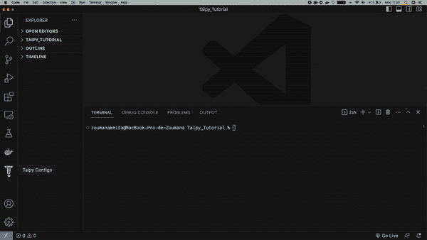

Taipy Studio 界面（图像由作者提供）

所有这些标签都可以用来实现我们的端到端管道目标，第一步是创建一个配置文件（**taipy_config.toml**），该文件将包含所有这些标签，这些标签由选择“Taipy: Show View”图标后右上角的 4 个图标表示。

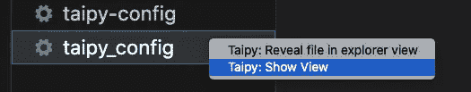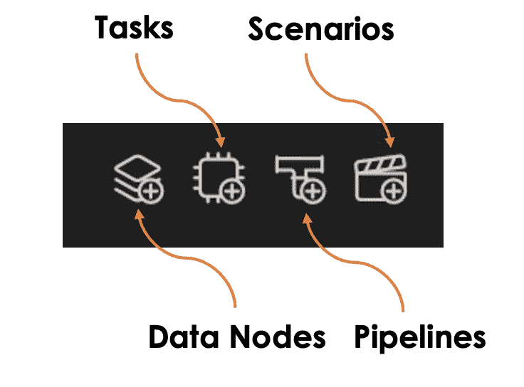

Taipy Studio 组件（图像由作者提供）

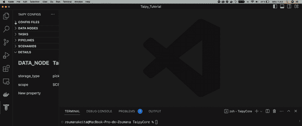

Taipy 标签说明

以下是将要实现的主要函数，并附有对每个先前选项卡的简要说明。

+   `filter_columns` 函数负责从数据中选择相关列并生成 Pandas 数据框。

+   `preprocess_columns` 用于执行特征工程。

+   `encode_features` 负责以正确的格式对相关特征进行编码。

+   `split_data` 是将数据拆分为训练集和测试集的函数。

+   `train_model` 用于训练模型。

+   `show_performance` 是展示模型性能的最后阶段。

## 场景和管道

这是设置管道时要做的第一件事。一个场景由一个或多个管道组成。它作为执行的注册表。让我们创建一个名为 DATA_BREACH_SCENARIO 的场景，然后创建一个名为 DATA_BREACH_PIPELINE 的管道，如下所示：


从场景到管道（作者提供的图像）

## 任务

一个任务指的是一个可以执行的 Python 函数，总共会实现六个任务，从 `filter_columns` 到 `show_performance`。

管道的输出连接到每个任务的输入，如下所示：


从管道到任务

下一步是在 Taipy Studio 中配置这些任务，通过将每个 Python 函数连接到相应的任务。但是在此之前，我们需要在 `data_breach_tasks.py` 文件中创建这些函数的签名，如下所示：

```py
import pandas as pd
from sklearn.preprocessing import LabelEncoder
from sklearn.model_selection import train_test_split
from sklearn.ensemble import RandomForestClassifier
from sklearn.metrics import (
 confusion_matrix,
 accuracy_score,
 precision_score,
 recall_score,
 f1_score
)

def filter_columns(df, list_columns_to_skip):

 filtered_df = df.drop(list_columns_to_skip, axis=1)
 return filtered_df

def preprocess_columns(df):

 df['Breach_Submission_Date'] = pd.to_datetime(data['Breach_Submission_Date'])
 df['Breach_Submission_Month'] = df['Breach_Submission_Date'].dt.month
 df['Breach_Submission_Year'] = df['Breach_Submission_Date'].dt.year
 df.drop("Breach_Submission_Date", axis=1, inplace=True)

 return df

def encode_features(df):

 list_columns_to_encode = ['State','Location_of_Breached_Information',
                                'Business_Associate_Present', 
                                'Covered_Entity_Type']
 le = LabelEncoder()

 for col in list_columns_to_encode:
     df[col] = le.fit_transform(df[col])

 X = df.drop('Type_of_Breach', axis=1)
 y = le.fit_transform(df['Type_of_Breach'])

 return {"X": X, "y": y}

def split_data(features_target_dict):
 X_train, X_test, y_train, y_test =    
                       train_test_split(features_target_dict["X"],                   
                                        features_target_dict["y"],
                                        test_size=0.3, 
                                        random_state=42)

 return {
     "X_train": X_train, "X_test": X_test,
     "y_train": y_train, "y_test": y_test
 }

def train_model(train_test_dictionary):

 classifier = RandomForestClassifier()

 classifier.fit(train_test_dictionary["X_train"],
                train_test_dictionary["y_train"])

 predictions = classifier.predict(train_test_dictionary["X_test"],
                                  train_test_dictionary["y_test"])

 return predictions

def show_performance(train_test_dictionary, predictions):

 y_test = train_test_dictionary["y_test"]

 accuracy = accuracy_score(y_test, predictions)
 precision = precision_score(y_test, predictions)
 recall = recall_score(y_test, predictions)
 f1score = f1_score(y_test, predictions)

 return pd.DataFrame({
     "Metrics": ['accuracy', 'precision', 'recall', 'f1_score'],
     "Values": [accuracy, precision, recall, f1score]
 })
```

接下来，我们按照以下 3 个步骤将每个任务链接到相应的 Python。下面的插图是针对 `filter_columns` 任务的，但必须对每个任务执行。

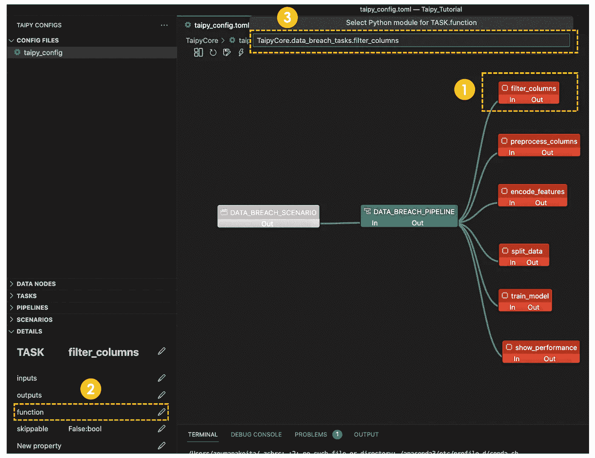

将任务链接到脚本的 3 个主要步骤（作者提供的图像）

## 数据节点

数据节点不包含实际数据，而是包含读取和写入这些数据所需的所有信息。它们可以是对任何数据类型的引用，例如文本、CSV、JSON 等。

例如，`filter_columns` 函数包含：

+   一个输入节点 (**filtering_node**)，其类型为 .CSV 文件，以及

+   一个输出节点 (**filtered_df**)：也以 .CSV 文件的形式存储。这然后作为 preprocess_columns 函数的输入。

交互节点定义如下，显示了存储类型从 pickle 修改为 .csv：

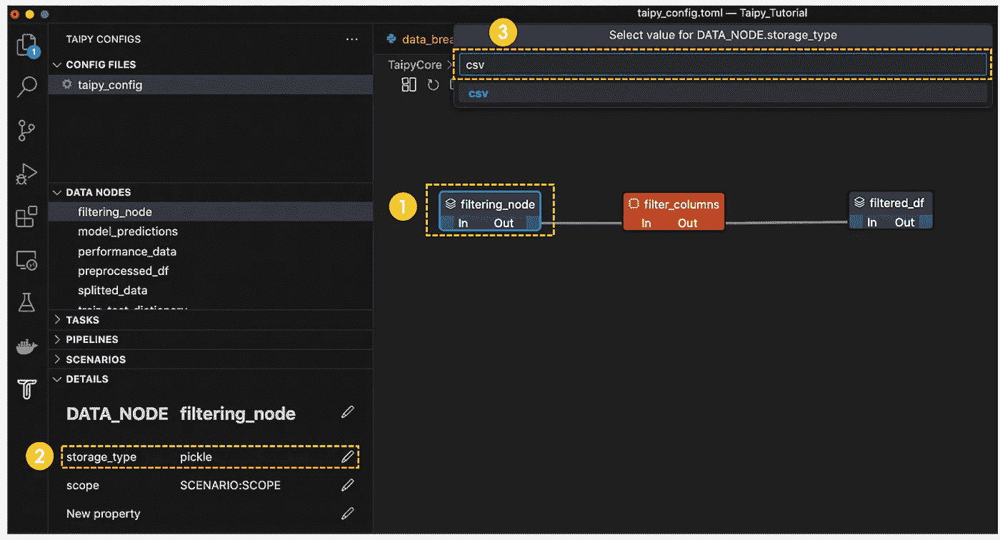

过滤节点输入类型的定义（作者提供的图像）

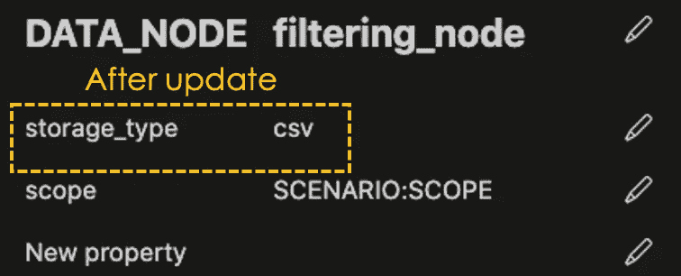

更新后的过滤节点的输入类型（作者提供的图像）

下一步是定义原始输入数据集的路径。这是通过数据节点中的“新属性”属性完成的。然后，按 Enter 并提供 .CSV 文件的路径。

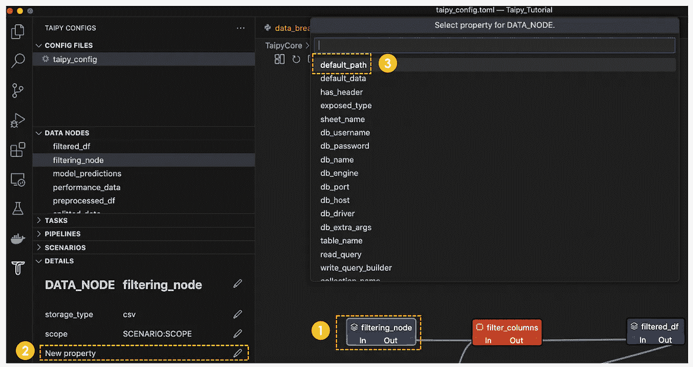

过滤节点属性的定义（作者提供的图像）

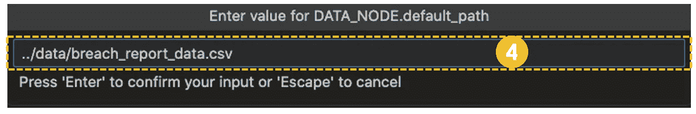

过滤节点路径的定义（图片来源于作者）

对于所有需要.csv 文件的输入，重复相同的过程，最终图示在指定所有数据节点及其关系后将如下所示。

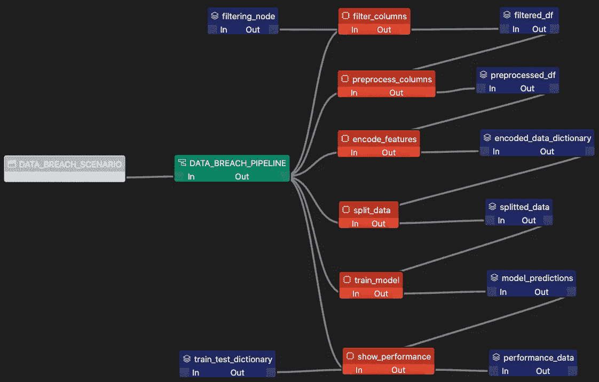

指定所有数据节点及其关系后的工作流程状态（图片来源于作者）

在配置管道后，整个图示的.toml 脚本格式会生成在**taipy_config.toml**文件中，其样式如下面的动画所示。

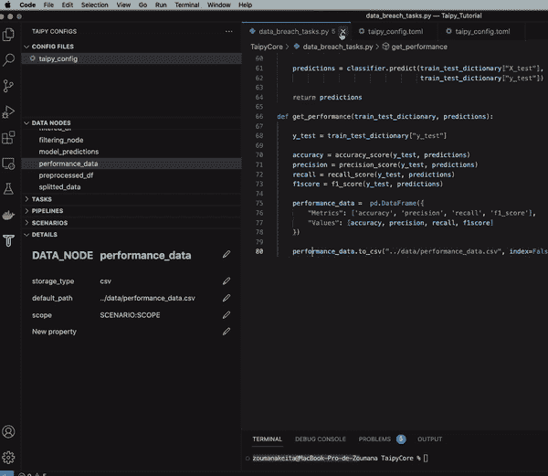

taipy_config.toml 文件的内容

然后，可以在任何 Python 脚本中加载这个.toml 文件来执行管道。我们来创建一个名为`run_pipeline.py`的文件。

```py
from taipy import Core, create_scenario
from taipy.core.config import Config

config_file_name = "./taipy_config.toml"
scenario_name = "DATA_BREACH_SCENARIO"

Config.load(config_file_name)
scenario_config = Config.scenarios[scenario_name]

if __name__ == "__main__":

 Core().run()

 pipeline_scenario = create_scenario(scenario_config)
 pipeline_scenario.submit() # This executes the scenario

 model_metrics = pipeline_scenario.performance_data.read()

 print(model_metrics)
```

我们首先导入相关模块，然后定义配置文件及触发场景的名称。

然后，使用 submit()函数执行管道。

最后，我们检索模型的性能并打印结果，如下所示：

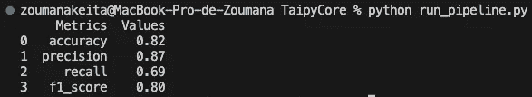

run_pipeline.py 的结果（图片来源于作者）

这个数据框可以进一步整合到初始仪表盘中，以图形化的方式展示数值。

# **结论**

本文提供了对 Taipy 的全面概述，并展示了如何将前端和后端与任何数据和机器学习模型结合起来，创建完全功能的 Web 应用程序。

此外，随着新版本的发布，Taipy 提供了核心可视化元素，允许前端和后端之间的无缝集成，使用户能够轻松创建强大的业务对象，这些集成功能可以从[官方网站](https://www.taipy.io/)获取。

如果你还在犹豫是否使用 Taipy，是时候尝试一下，以节省时间、精力，最重要的是金钱。最后，这些[绝妙的教程](https://www.taipy.io/tutorials/)可以帮助你进一步学习并提升技能。
