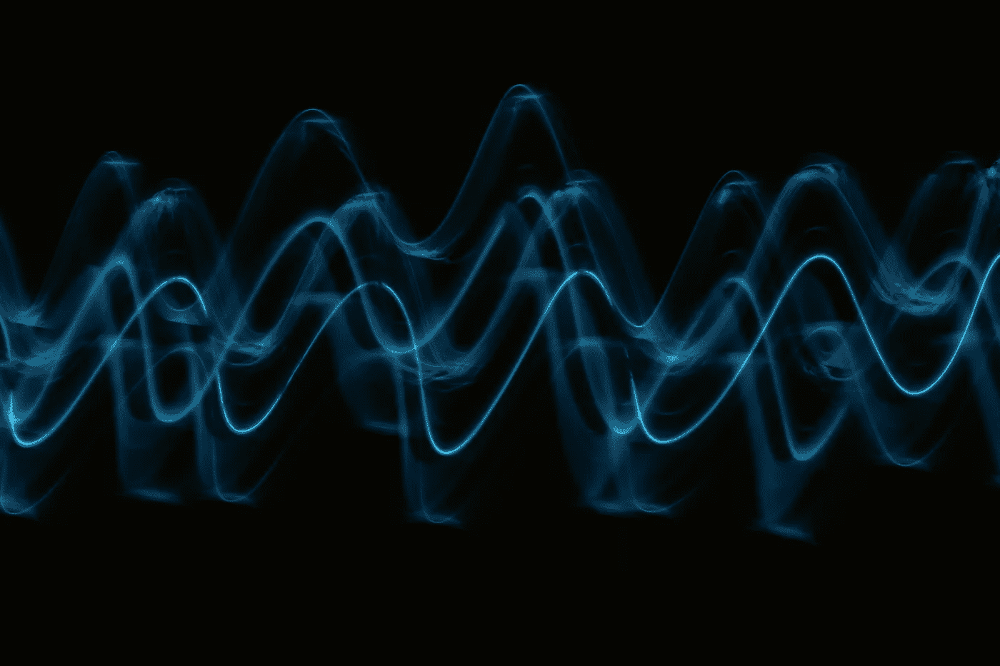
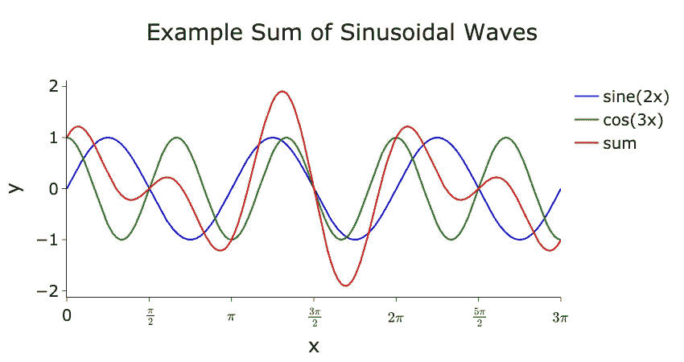
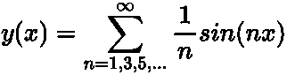
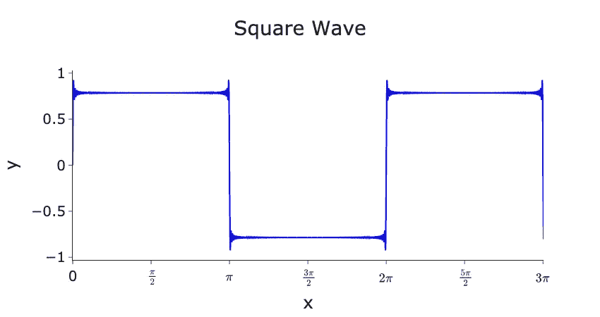
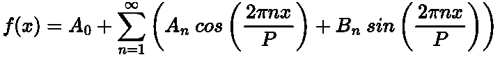
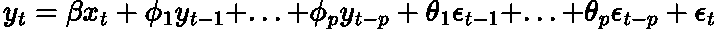
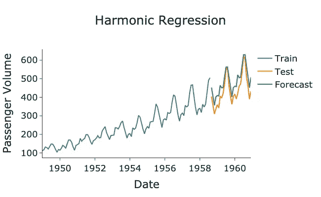

# 什么是时间序列预测中的谐波回归？

> 原文：[`towardsdatascience.com/take-your-forecasting-to-the-next-level-with-harmonic-regression-5a8515f63295`](https://towardsdatascience.com/take-your-forecasting-to-the-next-level-with-harmonic-regression-5a8515f63295)

## 揭示傅里叶级数与时间序列之间的迷人关系

 [Egor Howell](https://medium.com/@egorhowell?source=post_page-----5a8515f63295--------------------------------)

·发表于[Towards Data Science](https://towardsdatascience.com/?source=post_page-----5a8515f63295--------------------------------) ·阅读时间 6 分钟·2023 年 3 月 29 日

--



图片来自于[Pawel Czerwinski](https://unsplash.com/@pawel_czerwinski?utm_source=medium&utm_medium=referral)在[Unsplash](https://unsplash.com/?utm_source=medium&utm_medium=referral)

# 背景与问题

当我们想要对时间序列中的[***季节性***](https://medium.com/towards-data-science/seasonality-of-time-series-5b45b4809acd)进行建模时，我们通常会使用[***SARIMA***](https://medium.com/towards-artificial-intelligence/how-to-forecast-with-sarima-d4b4c98fca7b)模型。这个模型通过在特定滞后索引处找到[***自回归量***](https://medium.com/towards-data-science/how-to-forecast-time-series-using-autoregression-1d45db71683)和[***移动平均***](https://medium.com/towards-data-science/how-to-forecast-with-moving-average-models-6f3c9cbba60d)来添加季节性组件到[***ARIMA***](https://medium.com/towards-data-science/how-to-forecast-with-arima-96b3d4db111a)模型中。例如，具有年度季节性的月度数据将适配自回归量和移动平均于***12***的倍数。你可以在我之前的文章中阅读更多关于这个过程的信息：

[## 如何使用 SARIMA 进行预测](https://pub.towardsai.net/how-to-forecast-with-sarima-d4b4c98fca7b?source=post_page-----5a8515f63295--------------------------------)

### 深入探讨 SARIMA 模型及其应用

[pub.towardsai.net](https://pub.towardsai.net/how-to-forecast-with-sarima-d4b4c98fca7b?source=post_page-----5a8515f63295--------------------------------)

然而，如果我们有一个年季节性为***365.25 天***的日数据集怎么办？或者有一个季节性为***52.14***的周数据集呢？

不幸的是，SARIMA 无法处理这种 *非整数* 的数据，并且由于需要在 ***365*** 个数据点中寻找模式，计算上也 [*有困难*](https://otexts.com/fpp2/dhr.html)。

*那么，我们该怎么办？*

使用 [***傅里叶级数***](https://en.wikipedia.org/wiki/Fourier_series) 来拯救局面！

补充视频。

# 什么是傅里叶级数？

## 直觉

傅里叶级数是数学中最有趣的发现之一，它指出 [这个](https://mathworld.wolfram.com/FourierSeries.html)：

> 任何周期函数都可以分解为正弦和余弦波的总和

这是一个非常简单的陈述，但其含义非常重要。

例如，下图展示了 ***sin(2x)*** 和 ***cos(3x)*** 及其对应的总和：



作者在 Python 中生成的图。

注意到 ***sin(2x)*** 和 ***cos(3x)*** 的函数非常均匀和简单，但它们的总和（红线）却产生了更复杂的模式。这就是傅里叶级数的核心思想。

我们甚至可以使用傅里叶级数通过将不同 *奇数* 频率和幅度的正弦波 ([***谐波***](https://electronics.stackexchange.com/questions/32310/what-exactly-are-harmonics-and-how-do-they-appear)) 相加来构造一个 [***方波***](https://en.wikipedia.org/wiki/Square_wave)：



作者在 LaTeX 中的方程。



作者在 Python 中生成的图。

令人惊讶的是，我们从光滑的正弦函数中生成了一条尖锐而直的图。这展示了傅里叶级数构造任何周期函数的真正力量。

用于生成这些图的代码可以在我的 GitHub 上找到：

[](https://github.com/egorhowell/Medium-Articles/blob/main/Time%20Series/Time%20Series%20Tools/fourier_series.py?source=post_page-----5a8515f63295--------------------------------) [## Medium-Articles/fourier_series.py 在 egorhowell/Medium-Articles 主分支]

### 我在我的中等博客/文章中使用的代码。通过创建账户来贡献于 egorhowell/Medium-Articles 的开发...

github.com](https://github.com/egorhowell/Medium-Articles/blob/main/Time%20Series/Time%20Series%20Tools/fourier_series.py?source=post_page-----5a8515f63295--------------------------------)

## 理论

如上所述，傅里叶级数指出任何周期函数都可以分解为正弦和余弦波的总和。从数学角度来看，这是写作的：



作者在 LaTeX 中的方程。

其中：

+   ***A_0:*** *给定周期函数的平均值*

+   ***A_n:*** *余弦分量的系数*

+   ***B_n:*** *正弦分量的系数*

+   ***n:*** *阶数，即正弦或余弦波的频率，这被称为‘*[***谐波***](https://electronics.stackexchange.com/questions/32310/what-exactly-are-harmonics-and-how-do-they-appear)*’*

+   ***P:*** *函数的周期*

周期***P***和阶数***n***是事先已知的。然而，需要计算系数（***A_0, A_n, B_n***）来确定哪些正弦和余弦分量的组合产生给定的周期函数。这些通常通过积分推导得出（有关示例请参见[*这里*](https://www.mathsisfun.com/calculus/fourier-series.html)），但幸运的是，大多数 Python 数据科学包为我们完成了这个过程！

## 预测链接

你是否在想傅里叶级数如何适用于时间序列预测？好吧，请记住**傅里叶级数处理周期函数，而我们经常发现时间序列中包含某些周期性结构（通常是季节性）**。因此，我们可以使用傅里叶级数来建模我们时间序列数据中的任何复杂季节性模式！

**使用傅里叶级数建模季节性的优点是：**

+   *任何季节长度*

+   *建模多个季节模式*

+   *傅里叶季节性的敏感性可以通过正弦和余弦分量的阶数和振幅进行调节*

+   *当季节性周期* [*大于~200*](https://otexts.com/fpp2/dhr.html) *时计算效率高*

许多这些优势**无法**通过 SARIMA 模型实现，因为它仅接受整数季节性、单一季节，并且当[季节周期超过~200](https://otexts.com/fpp2/dhr.html)时，往往会耗尽内存。

**使用傅里叶级数建模季节性的缺点是：**

+   *假设季节性模式和周期保持不变*

现在的问题是，我们如何将其添加到我们的模型中？

# ARIMAX 与外生特征

## 直觉

对于 ARIMA 模型，我们可以添加**额外的外部特征**来帮助预测。这些特征被称为 [***外生特征***](https://en.wikipedia.org/wiki/Exogenous_and_endogenous_variables)，使得 ARIMA 模型变成一个 [***ARIMAX***](https://365datascience.com/tutorials/python-tutorials/arimax/) 模型。例如，我们可以在预测房屋价值时使用当前的利率作为外生特征。

你可以将 ARIMAX 模型看作是常规的***线性回归***加上[***自回归量***](https://medium.com/towards-data-science/how-to-forecast-time-series-using-autoregression-1d45db71683)和[***移动平均***](https://medium.com/towards-data-science/how-to-forecast-with-moving-average-models-6f3c9cbba60d)组件（[***内生变量***](https://timeseriesreasoning.com/contents/exogenous-and-endogenous-variables/)）。关键是让傅里叶级数成为这些外生特征之一，或者像线性回归中常描述的那样成为[***解释变量***](https://www.statisticshowto.com/probability-and-statistics/types-of-variables/explanatory-variable/)。

由于我们处理的是时间序列，外生特征需要像自回归量和移动平均一样具有时间索引。它们也需要在预测时已知。例如，如果我们想预测 5 月的房价，我们需要知道 5 月的利率，如果我们希望将其作为外生特征。

## 理论

[数学上](https://robjhyndman.com/hyndsight/arimax/)，外生特征以以下方式添加到经典 ARIMA 模型中：



作者用 LaTeX 给出的方程。

+   ***y:*** *不同时间步长的时间序列/滞后*

+   ***x:*** *外生特征*

+   ***β:*** *外生特征的系数*

+   ***ϕ:*** *自回归组件（滞后）的系数* *自回归组件（滞后）*

+   ***p:*** *自回归组件的数量*

+   ***ε:*** *预测* [*误差项*](https://en.wikipedia.org/wiki/White_noise)*，* *移动平均组件*

+   ***θ:*** *滞后预测误差的系数*

+   ***q:*** *滞后误差组件的数量*

## 傅里叶级数特征

将傅里叶级数作为外生量添加到 ARIMA 模型中相对简单，因为系数/幅度***β***是为我们推导的，我们只需要提供相应的正弦和余弦项。在伪代码中，这等同于：

```py
# Sine component
sin(2*pi*frequency*time_index/period)

# Cosine component
cos(2*pi*frequency*time_index/period)
```

例如，假设我们有每月数据并且有年度季节性，我们想要 5 月的傅里叶分量。在伪代码中，这将是：

```py
# Sine component
sin(2*pi*frequency*5/12)

# Cosine component
cos(2*pi*frequency*5/12)
```

> 五月是第 5 个月，一年有 12 个月。

然而，我们仍然需要推导频率（阶数）值。这通常通过[传递大量正弦和余弦组件](https://robjhyndman.com/hyndsight/longseasonality/)的阶数来找到，并让模型找出最有用的阶数。在下面的 Python 示例中，我们将演示这个过程。

# Python 实现

我们将使用谐波回归和 ARIMAX 进行一些实际的预测！我们将使用[来自 Kaggle 的美国航空公司乘客数据集](https://www.kaggle.com/datasets/ashfakyeafi/air-passenger-data-for-time-series-analysis)。

> 数据 [来自 Kaggle](https://www.kaggle.com/datasets/ashfakyeafi/air-passenger-data-for-time-series-analysis) 采用 CC0 许可证。

作者总结。



由作者在 Python 中生成的图。

正如我们所看到的，傅里叶级数已经很好地捕捉到了季节性！

> 注意：在上面的代码中，我们使用了 Box-Cox 变换以使方差平稳。你可以在[这里](https://medium.com/towards-data-science/box-cox-transform-for-time-series-cc45f26082c6)了解更多关于这个过程的内容。

# 总结与思考

当你的时间序列的季节性是非整数的、有众多模式或非常长（>50 点）时，最好使用傅里叶级数来建模这一季节性组件。这可以通过将傅里叶级数作为外生特征添加到常规 ARIMA 模型中，将其转化为 ARIMAX 来实现。这些外生特征是辅助预测时间序列的外部协变量。

完整代码可以在我的 GitHub 上找到：

[## GitHub - egorhowell/Medium-Articles: 代码我在我的 Medium 博客/文章中使用。](https://github.com/egorhowell/Medium-Articles?source=post_page-----5a8515f63295--------------------------------)

### 你目前无法执行该操作。你在另一个标签或窗口中登录了。你在另一个标签或窗口中注销了…

[github.com](https://github.com/egorhowell/Medium-Articles?source=post_page-----5a8515f63295--------------------------------)

# 还有别的事情！

我有一个免费的时事通讯，[**Dishing the Data**](https://dishingthedata.substack.com/)，在其中我每周分享成为更好数据科学家的技巧。没有“无关紧要的内容”或“点击诱饵”，只有来自实践数据科学家的纯粹可操作的见解。

[## Dishing The Data | Egor Howell | Substack](https://newsletter.egorhowell.com/?source=post_page-----5a8515f63295--------------------------------)

### 如何成为更好的数据科学家。点击阅读《Dishing The Data》，由 Egor Howell 撰写的 Substack 出版物，包含…

[newsletter.egorhowell.com](https://newsletter.egorhowell.com/?source=post_page-----5a8515f63295--------------------------------)

# 连接我！

+   [**YouTube**](https://www.youtube.com/@egorhowell)

+   [**LinkedIn**](https://www.linkedin.com/in/egor-howell-092a721b3/)

+   [**Twitter**](https://twitter.com/EgorHowell)

+   [**GitHub**](https://github.com/egorhowell)

# 参考文献和进一步阅读

+   *预测：原则与实践：* [`otexts.com/fpp2/`](https://otexts.com/fpp3/arima.html)
