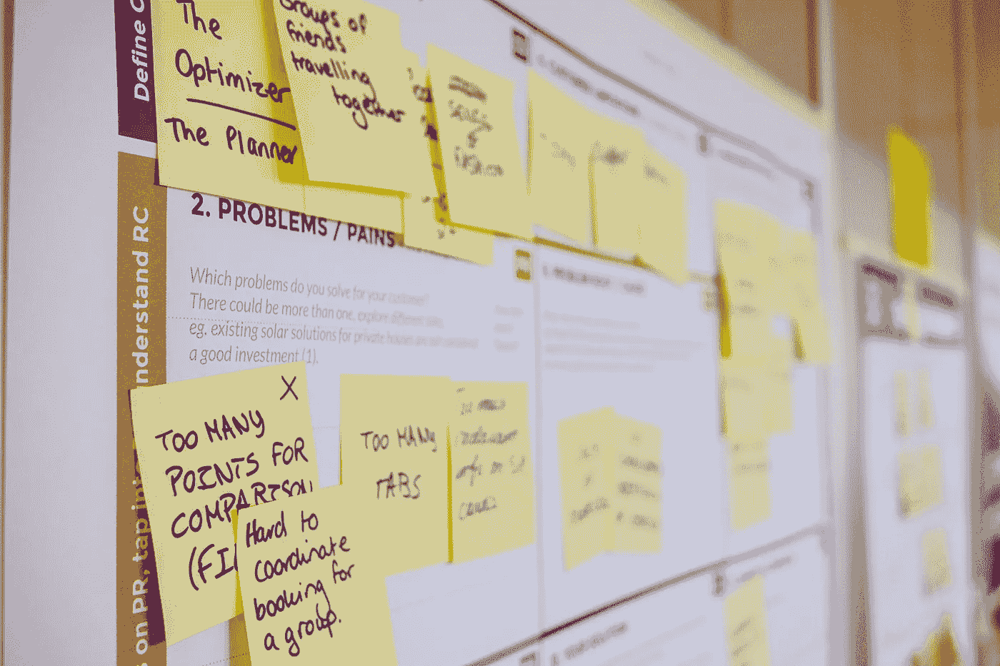
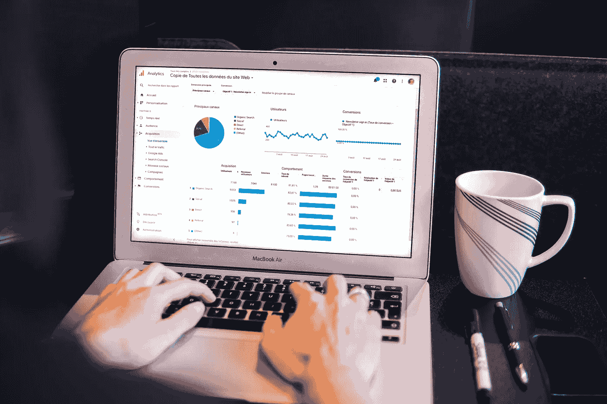

# TDSP：当敏捷遇上数据科学

> 原文：[`towardsdatascience.com/tdsp-when-agile-meets-data-science-15ccb5bf8f87`](https://towardsdatascience.com/tdsp-when-agile-meets-data-science-15ccb5bf8f87)

## 实用指南：将敏捷原则应用于数据科学项目

 [Amol Mavuduru](https://amolmavuduru.medium.com/?source=post_page-----15ccb5bf8f87--------------------------------)

·发表于 [Towards Data Science](https://towardsdatascience.com/?source=post_page-----15ccb5bf8f87--------------------------------) ·7 分钟阅读·2023 年 1 月 23 日

--

由 [Daria Nepriakhina 🇺🇦](https://unsplash.com/@epicantus?utm_source=unsplash&utm_medium=referral&utm_content=creditCopyText) 拍摄于 [Unsplash](https://unsplash.com/s/photos/agile?utm_source=unsplash&utm_medium=referral&utm_content=creditCopyText)

如果你参加过软件开发/项目管理课程或培训，你可能听说过敏捷。敏捷是一套关注适应性规划、早期交付、持续改进和灵活响应需求变化的软件开发实践。

尽管敏捷在软件开发中非常流行，但这些实践带来的灵活性在数据科学项目中同样，甚至更为有效。事实上，微软在 2016 年发布了一个迭代的数据科学框架，专门将敏捷原则应用于数据科学项目。

**在这篇文章中，我将解释微软的团队数据科学流程（TDSP）如何用于将敏捷原则应用于数据科学项目。**

# 引言——敏捷原则

在介绍 TDSP 之前，我们应当讨论敏捷的指导原则，这些原则最初由敏捷宣言的作者提出。

1.  个人与互动胜于过程和工具。

1.  工作软件胜于全面文档。

1.  客户协作胜于合同谈判。

1.  响应变化胜于遵循计划。

整个敏捷框架中的实践，如每日立会和迭代增量开发，都是基于这些价值观。这些实践旨在适应变化，并迅速交付可工作的解决方案。

# 什么是 TDSP？

TDSP 是一种将敏捷原则应用于高效交付数据科学解决方案的方法论。TDSP 的核心概念是**数据科学生命周期**，类似于敏捷中的*软件开发生命周期*。数据科学生命周期包括在数据科学项目中反复进行的五个生命周期步骤：

+   **业务理解**

+   **数据获取与理解**

+   **建模**

+   **部署**

+   **利益相关者/客户接受**

这些步骤可以通过下面的工作流图进行可视化。

数据科学工作流。图片由作者提供，灵感来源于[Microsoft Azure](https://docs.microsoft.com/en-us/azure/machine-learning/team-data-science-process/overview)。

在这种方法论中，每个数据科学项目都从定义业务问题和理解业务需求开始。这导致了数据获取和理解步骤，这是进行任何模型开发工作的先决条件。一旦我们有了一个表现良好的模型，就可以将其部署到生产环境中，或以仪表板或报告的形式展示结果。

如果在任何时候我们对结果不满意或面临变化的需求，我们可以返回到之前的步骤，因为这种方法论专注于迭代开发。每个步骤将在后续部分中详细解释。

## 业务理解

照片由[Medienstürmer](https://unsplash.com/@medienstuermer?utm_source=unsplash&utm_medium=referral&utm_content=creditCopyText)提供，来源于[Unsplash](https://unsplash.com/photos/aWf7mjwwJJo?utm_source=unsplash&utm_medium=referral&utm_content=creditCopyText)

这一阶段的核心是确定项目的业务需求和识别解决相关机器学习问题所需的数据。此阶段有两个主要任务：

1.  **定义目标：** 我们需要与客户/利益相关者合作，以确定我们试图解决的业务问题。

1.  **识别数据来源**：一旦我们知道了要解决的问题，我们需要识别为解决该问题所需的数据来源。

这些步骤是每个实际数据科学项目的基础。明确的目标和数据来源在数据分析和模型开发之前就应确定。

## 数据获取与理解

照片由[Myriam Jessier](https://unsplash.com/@mjessier?utm_source=unsplash&utm_medium=referral&utm_content=creditCopyText)提供，来源于[Unsplash](https://unsplash.com/photos/eveI7MOcSmw?utm_source=unsplash&utm_medium=referral&utm_content=creditCopyText)

在制定业务问题并确定数据来源之后，下一步最自然的步骤是获取和探索数据。TDSP 的这一阶段包括三个主要任务：

1.  **获取数据：** 我们需要将数据引入用于分析的环境中。如果我们在本地工作，这个任务可能只是将文件上传到 Jupyter 的工作目录。

1.  **探索数据：** 这一步通常被称为探索性数据分析（EDA），包括预处理和理解数据中的属性和模式，并确定数据是否适合模型开发。

1.  **建立数据管道：** 这一步涉及构建一个处理新数据的过程。数据管道可以是基于批处理的、实时的或这两者的混合。

尽管所有这些步骤可能由数据科学家执行，但第三步甚至可能是第一步可能需要由数据工程师执行。这个阶段突显了数据科学团队中除数据科学外的其他技能的重要性。数据科学家在进行 EDA 时，数据工程师可能在设置数据管道，这样我们可以更快地完成这个阶段。

## 建模

照片由 [Kevin Ku](https://unsplash.com/@ikukevk?utm_source=unsplash&utm_medium=referral&utm_content=creditCopyText) 提供，来自 [Unsplash](https://unsplash.com/photos/w7ZyuGYNpRQ?utm_source=unsplash&utm_medium=referral&utm_content=creditCopyText)

建模阶段，可能是大多数数据科学家最兴奋的阶段，依赖于前两个阶段的成功完成。我们的模型质量最终受到数据质量以及对数据理解的限制。一旦我们有了数据管道和经过探索的高质量数据，我们就准备开始建模阶段，该阶段有三个关键步骤：

1.  **特征工程：** 这一步是从原始数据中创建数据特征以用于模型训练的过程。特征工程通过对数据的良好理解来增强，这使我们能够提取甚至创建新的特征以供模型使用。

1.  **模型训练：** 一旦我们有了一组特征和目标变量，我们可以训练模型来预测目标变量。在这一阶段，我们将数据分为训练集、验证集和测试集。

1.  **模型评估：** 在训练每个模型后，我们需要通过回答以下问题来评估这些模型：1）模型在验证/测试集上的指标是什么？2）模型是否解决了业务问题并符合问题的限制？3）这个模型是否适合生产环境？

这一阶段的步骤是迭代的。我们可以训练一个模型，发现结果不令人满意，然后返回到特征工程和模型训练阶段，打造更好的特征并尝试不同的建模方法。在这个阶段训练和评估多个模型并不是不寻常的，事实上，这是预期中的事情。

## 部署

照片由 [Kevin Ku](https://unsplash.com/@ikukevk?utm_source=unsplash&utm_medium=referral&utm_content=creditCopyText) 提供，来源于 [Unsplash](https://unsplash.com/photos/w7ZyuGYNpRQ?utm_source=unsplash&utm_medium=referral&utm_content=creditCopyText)

这个阶段将我们的模型转变为实际可用并产生业务结果的东西。这个阶段的唯一步骤是**通过将数据管道和模型集成到生产或类似生产的环境中来使我们的模型具备操作性**。有许多方法可以部署模型，但我们选择的路线将取决于业务用例。考虑以下部署选项：

1.  **通过 API 公开模型，以便其他应用程序可以使用。**

1.  **创建一个微服务或容器化应用程序来运行模型。**

1.  **将模型集成到一个具有仪表板的 Web 应用程序中，仪表板显示预测结果。**

1.  **创建一个批处理过程来运行模型并将预测写入一个可以使用的数据源。**

一旦这个阶段完成，相关利益方和/或客户应该能够观察到模型产生的结果。例如，一个投入生产的产品推荐系统应该能够为在线购物的客户生成推荐。

## 客户接受

照片由 [Rock Staar](https://unsplash.com/@rockstaar_?utm_source=unsplash&utm_medium=referral&utm_content=creditCopyText) 提供，来源于 [Unsplash](https://unsplash.com/photos/NzIV4vOBA7s?utm_source=unsplash&utm_medium=referral&utm_content=creditCopyText)

在这个最终阶段，我们的目标是确认数据管道、模型和生产部署满足客户的需求，并解决第一阶段中提到的业务问题。这个阶段有两个步骤：

1.  **系统验证：** 确认数据管道、模型和部署满足业务用例，并满足客户需求。

1.  **项目移交：** 将项目转交给负责生产管理的团队。

请注意，这个过程是迭代的，因此如果数据管道、模型或系统验证步骤中的部署有问题，我们可能需要返回到前一个步骤来修复问题。

# 为什么 TDSP 适用于数据科学

以下是 TDSP 在数据科学项目中效果良好的原因：

1.  TDSP 捕捉了大多数数据科学项目中的基本步骤和依赖关系。

1.  数据科学是一个迭代的过程，我们经常在项目的不同阶段发现新信息。

1.  TDSP 设计用于包含多个角色的数据科学团队，这些角色包括纯机器学习之外的技能，如数据工程和软件工程。

1.  TDSP 从业务需求和数据开始，然后进入模型开发。

1.  TDSP 允许数据科学团队适应不断变化的需求以及数据分析、建模和部署步骤中的意外结果。

# 总结

尽管敏捷原则通常应用于软件开发，但我们也可以认为这些原则在数据科学项目中更为重要。微软的团队数据科学过程（TDSP）是一个将敏捷原则应用于数据科学的框架，围绕五步数据科学生命周期进行设计。TDSP 设计良好，能够反映大多数数据科学项目的阶段，并允许数据科学团队使用迭代方法适应变化。

# 加入我的邮件列表

加入我的 [邮件列表](https://mailchi.mp/e8dd82679724/amols-data-science-blog) 以获取有关我数据科学内容的更新。你还可以在 [注册](https://mailchi.mp/e8dd82679724/amols-data-science-blog) 时免费获得我的 **解决机器学习问题的逐步指南**！你也可以通过 [Twitter](https://twitter.com/amolmavuduru1) 关注我以获取内容更新。

同时，你也可以考虑 [加入 Medium 社区](https://amolmavuduru.medium.com/membership)，阅读来自其他成千上万位作者的文章。

# 来源

1.  微软 Azure 团队，[什么是团队数据科学过程？](https://docs.microsoft.com/en-us/azure/machine-learning/team-data-science-process/overview)，（2020），团队数据科学过程文档。
