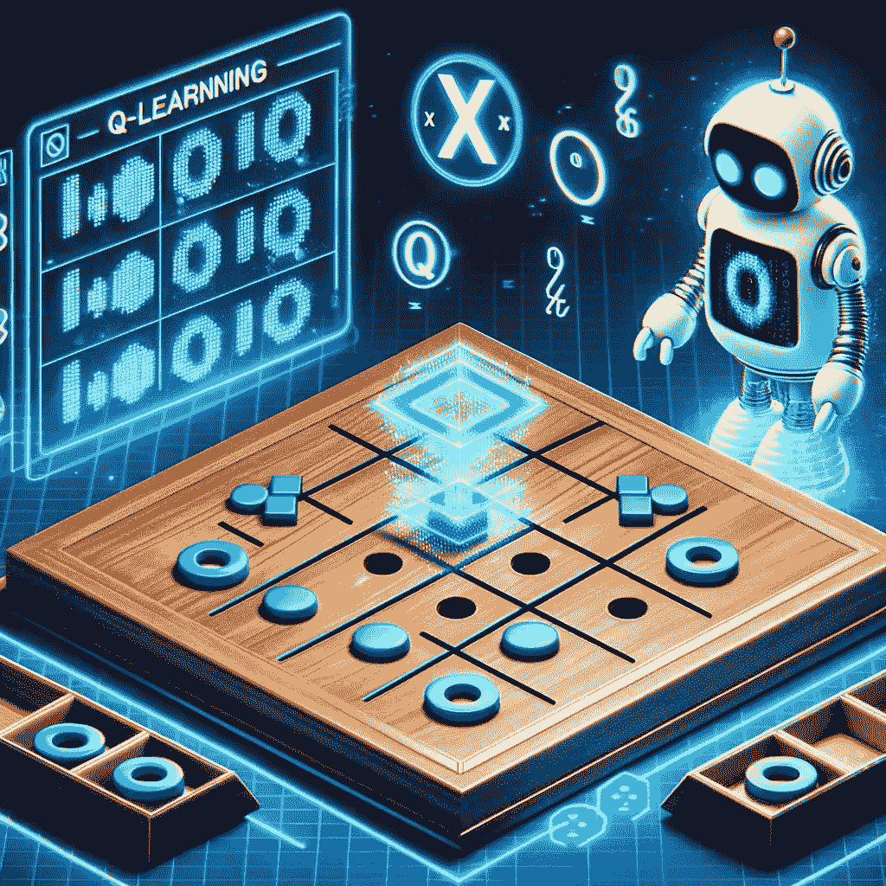

# 教授 AI 玩桌面游戏

> 原文：[`towardsdatascience.com/teaching-ai-to-play-board-games-77e5d1749dd9?source=collection_archive---------8-----------------------#2023-12-12`](https://towardsdatascience.com/teaching-ai-to-play-board-games-77e5d1749dd9?source=collection_archive---------8-----------------------#2023-12-12)

## 从零开始使用强化学习教计算机玩井字棋

 [Heiko Hotz](https://heiko-hotz.medium.com/?source=post_page-----77e5d1749dd9--------------------------------)

·

[关注](https://medium.com/m/signin?actionUrl=https%3A%2F%2Fmedium.com%2F_%2Fsubscribe%2Fuser%2F993c21f1b30f&operation=register&redirect=https%3A%2F%2Ftowardsdatascience.com%2Fteaching-ai-to-play-board-games-77e5d1749dd9&user=Heiko+Hotz&userId=993c21f1b30f&source=post_page-993c21f1b30f----77e5d1749dd9---------------------post_header-----------) 发表在 [Towards Data Science](https://towardsdatascience.com/?source=post_page-----77e5d1749dd9--------------------------------) ·18 分钟阅读·2023 年 12 月 12 日

--

图片由作者提供（由 ChatGPT 创建）

# 这是什么内容？

看起来 AI 领域的每个人目前都在磨练他们的强化学习（RL）技能，特别是在 Q-learning 方面，这一切都源于最近关于 OpenAI 新 AI 模型的传闻，[*Q**](https://en.wikipedia.org/wiki/OpenAI#Q*)，我也加入了这个行列。然而，与其对 *Q** 进行猜测或回顾旧论文和 Q-learning 示例，不如利用我对桌面游戏的热情来介绍一下 Q-learning 🤓

在这篇博客文章中，我将从头开始创建一个简单的程序，以教导模型如何玩井字棋（TTT）。我将避免使用任何 RL 库，如 [*Gym*](https://github.com/openai/gym) 或 [*Stable Baselines*](https://github.com/DLR-RM/stable-baselines3)；所有的代码都用原生 Python 手工编写，脚本仅有 100 行。如果你对如何指导 AI 玩游戏感到好奇，请继续阅读。

你可以在 GitHub 上找到所有的代码，链接为 [`github.com/marshmellow77/tictactoe-q`](https://github.com/marshmellow77/tictactoe-q)。

# 为什么这很重要？

教导 AI 玩井字棋（TTT）可能看起来并不那么重要。然而，它确实提供了一个（希望）清晰且易于理解的 Q 学习和 RL 介绍，这在生成式 AI（GenAI）领域可能是重要的，因为……
