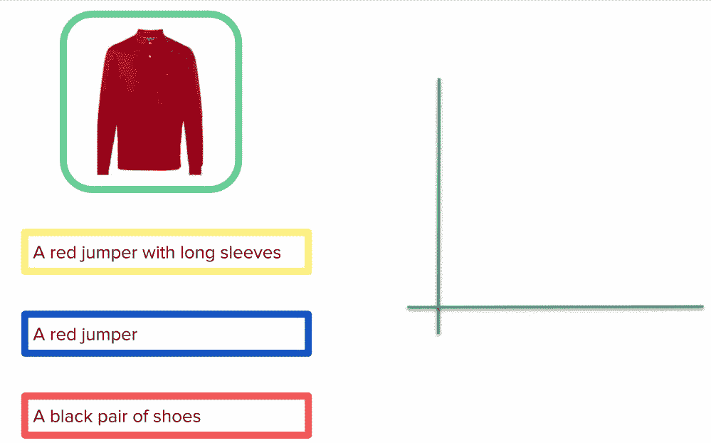
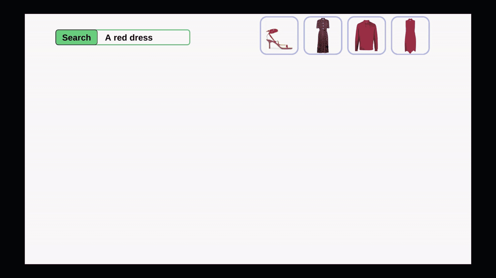
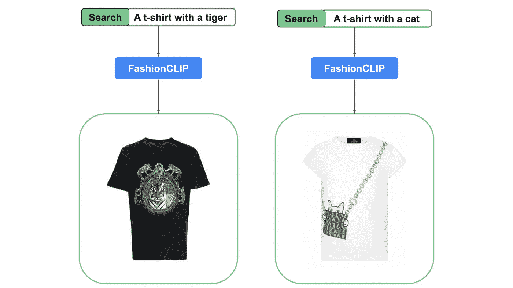
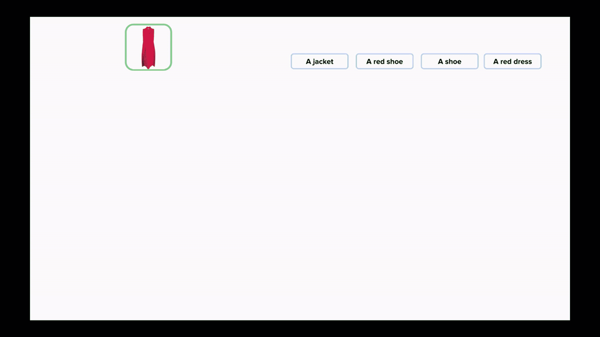
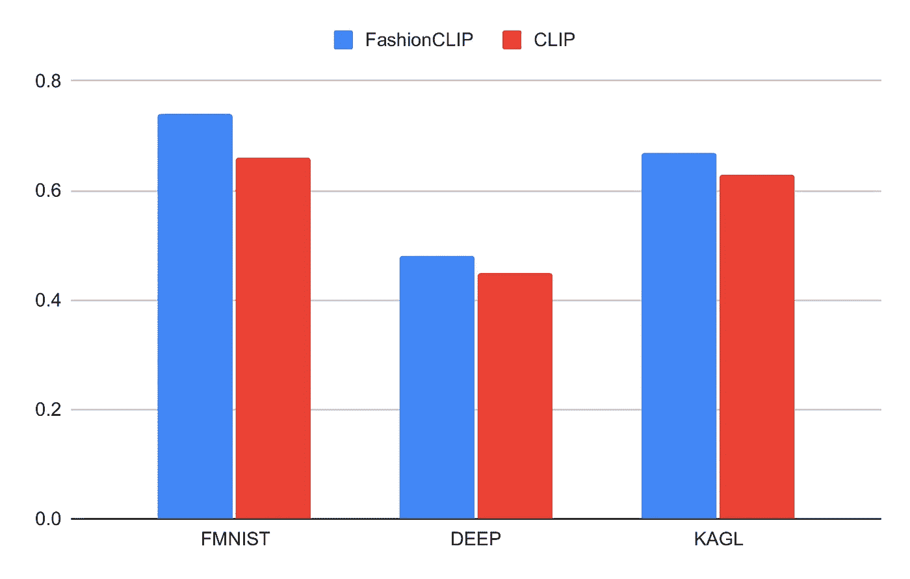
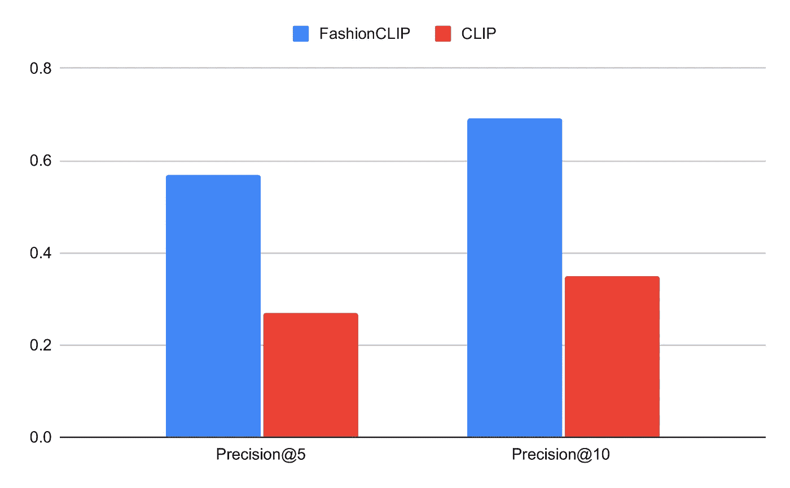
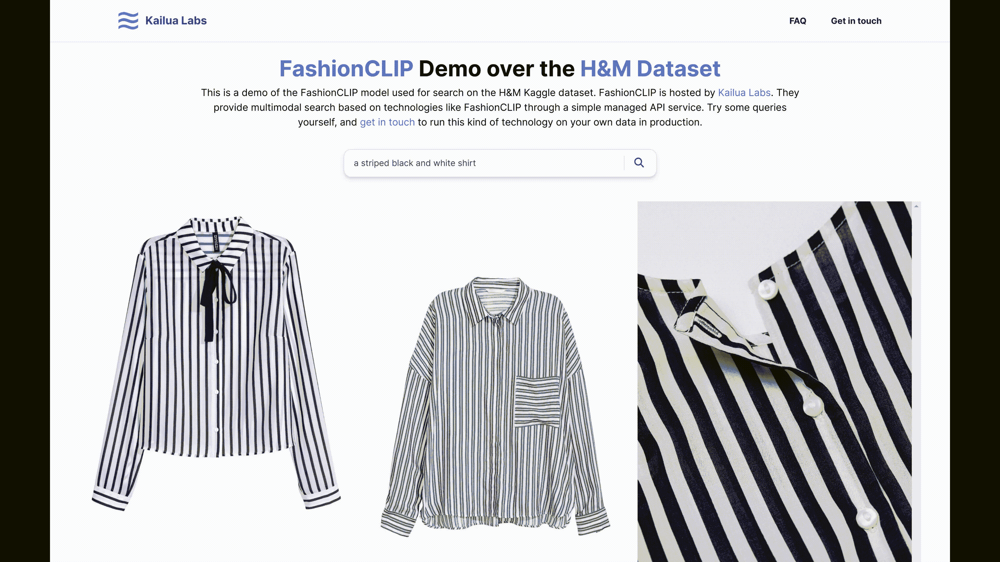
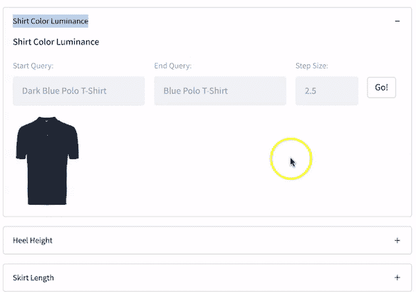

# 教学 CLIP 时尚

> 原文：[`towardsdatascience.com/teaching-clip-some-fashion-3005ac3fdcc3?source=collection_archive---------3-----------------------#2023-03-07`](https://towardsdatascience.com/teaching-clip-some-fashion-3005ac3fdcc3?source=collection_archive---------3-----------------------#2023-03-07)

## 训练 FashionCLIP，一个专门用于时尚的 CLIP 模型

[](https://fede-bianchi.medium.com/?source=post_page-----3005ac3fdcc3--------------------------------)[](https://towardsdatascience.com/?source=post_page-----3005ac3fdcc3--------------------------------) [Federico Bianchi](https://fede-bianchi.medium.com/?source=post_page-----3005ac3fdcc3--------------------------------)

·

[关注](https://medium.com/m/signin?actionUrl=https%3A%2F%2Fmedium.com%2F_%2Fsubscribe%2Fuser%2F2aff872fe60e&operation=register&redirect=https%3A%2F%2Ftowardsdatascience.com%2Fteaching-clip-some-fashion-3005ac3fdcc3&user=Federico+Bianchi&userId=2aff872fe60e&source=post_page-2aff872fe60e----3005ac3fdcc3---------------------post_header-----------) 发表在 [Towards Data Science](https://towardsdatascience.com/?source=post_page-----3005ac3fdcc3--------------------------------) ·10 分钟阅读·2023 年 3 月 7 日[](https://medium.com/m/signin?actionUrl=https%3A%2F%2Fmedium.com%2F_%2Fvote%2Ftowards-data-science%2F3005ac3fdcc3&operation=register&redirect=https%3A%2F%2Ftowardsdatascience.com%2Fteaching-clip-some-fashion-3005ac3fdcc3&user=Federico+Bianchi&userId=2aff872fe60e&source=-----3005ac3fdcc3---------------------clap_footer-----------)

--

[](https://medium.com/m/signin?actionUrl=https%3A%2F%2Fmedium.com%2F_%2Fbookmark%2Fp%2F3005ac3fdcc3&operation=register&redirect=https%3A%2F%2Ftowardsdatascience.com%2Fteaching-clip-some-fashion-3005ac3fdcc3&source=-----3005ac3fdcc3---------------------bookmark_footer-----------)

图片由 [Domenico Loia](https://unsplash.com/@domenicoloia?utm_source=unsplash&utm_medium=referral&utm_content=creditCopyText) 提供，发布在 [Unsplash](https://unsplash.com/photos/hGV2TfOh0ns) 上。

这是一篇简短的博客文章，描述了 [FashionCLIP](https://doi.org/10.1038/s41598-022-23052-9)。如果你是数据科学家，你可能需要处理图像和文本。然而，你的数据将非常特定于你的领域，标准模型可能效果不佳。本文解释了如何在**领域特定**的环境中使用**领域特定**的视觉和语言模型，以及为何使用这些模型可能是创建搜索引擎或（零样本）分类器的一个有前景的方式。

FashionCLIP 是一种用于时尚行业的新视觉和语言模型，支持从业者解决两个任务：

+   **分类**：产品图像的零样本分类；

+   **搜索**：根据查询高效检索产品。

尽管 FashionCLIP 是许多人努力工作的结果，这篇博客文章主要是我在构建过程中获得的惊人经验的总结和个人观点，并不一定代表所有其他作者及其组织的观点。

## 模型

我们目前以两种不同的格式发布模型：

+   [我们的内部封装](https://github.com/patrickjohncyh/fashion-clip)

+   [HuggingFace 权重](https://huggingface.co/patrickjohncyh/fashion-clip)

我们还有一个 [colab 教程](https://colab.research.google.com/drive/1Z1hAxBnWjF76bEi9KQ6CMBBEmI_FVDrW?usp=sharing) 介绍了使用 FashionCLIP 可以做的大部分事情。

# 介绍

时尚是可以从 AI 产品中受益最多的行业之一。实际上，由于领域的性质、不同的目录和客户特定的数据集，通常很难构建可以无缝应用于不同问题的解决方案。

想象一下在一家大型时尚公司工作的两位数据科学家：Mary 和 Luis。他们必须应对不断变化的系统，其操作需要持续的关注：

+   Mary 正在构建一个 ***产品分类器*** 以帮助大规模分类：她的模型接收一个产品并从一系列类别中选择一个（鞋子、连衣裙等）；

+   Luis 正在研究 ***产品匹配*** 以改善搜索体验：他的模型接受一种支持的语言中的查询（例如，“一件红色连衣裙”），并返回匹配该查询的产品列表。

正如每个从业者所知道的，任何新的生产模型都会带来复杂的生命周期和某种程度的脆弱依赖：

+   随着库存的增长和类别的变化，Mary 的模型需要不断重新训练；

+   Luis 的模型依赖于产品元数据的质量。

**同一公司，不同用例，不同模型。**

**如果有另一种方法呢？**

今天我们尝试向前迈出一步，展示如何构建一个用于时尚数据的通用模型。我们描述了 FashionCLIP，它是著名的 [CLIP](https://openai.com/blog/clip/) 模型的微调版本，专门处理时尚数据。我们最近的关于 [FashionCLIP](https://doi.org/10.1038/s41598-022-23052-9) 的论文已在《自然科学报告》中发布。

> Chia, P.J., Attanasio, G., Bianchi, F. *等* **一般时尚概念的对比语言与视觉学习**。*Sci Rep* **12**, 18958 (2022)。 [`doi.org/10.1038/s41598-022-23052-9`](https://doi.org/10.1038/s41598-022-23052-9)

FashionCLIP 的诞生源于与[*Farfetch*](https://www.farfetch.com/)的合作，这是一家在纽约证券交易所上市的巨大（且真实的）奢侈品电商。FashionCLIP 是与来自业界（Coveo、Farfetch）和学术界（斯坦福、博科尼、比科卡）的人们共同完成的工作。模型权重可以在线获得，格式为[HuggingFace](https://huggingface.co/patrickjohncyh/fashion-clip)。使用示例可以在[Patrick 的 repo](https://github.com/patrickjohncyh/fashion-clip/blob/master/fashion_clip_api_demo.ipynb)中找到。

我们将首先介绍用例，并解释一些模型的更深入细节。最后，我们将分享我们用来训练模型的代码以及如何获取权重。

# FashionCLIP: 故事

FashionCLIP 是一个通用模型，用于将时尚产品的图像及其描述嵌入到同一个向量空间中：每个图像和每个产品将由一个单独的稠密向量表示。

为什么我们要把它们放在同一个向量空间中？ **这样它们才能进行比较。** 这个原则是像 CLIP 这样的模型成功的关键。

FashionCLIP 源自原始的 CLIP。这个想法非常简单。如果你：

+   大量带有标题的图像；

+   一个图像编码器（这可以是 CNN 或 ViT）；

+   一个文本编码器（这可以是基于 transformers 的语言模型）。

你可以训练一个模型（使用对比损失）来使图像的嵌入接近其标题嵌入，并远离不相关的标题。在 GIF 中，你展示了一个二维的例子。这个概念可以推广到 N 维。



FashionCLIP 将描述和图像嵌入到同一个向量空间中。这对于零-shot 分类和图像检索非常有用。*图片由作者使用 Farfetch 目录提供。*

最终结果是一个**多模态空间**，允许你在视觉和文本交互之间移动，使用新的图像和新的文本描述：如果你有一些文本，你可以检索到*对应的图像*（如产品搜索）；如果你有一些图像，你可以*排序*标题基于语义相似性（如分类）。

要微调 CLIP，你需要一个好的数据集。我们与 Farfetch 合作，使用高质量的图像和标题来训练 CLIP。这个数据集（即将公开发布）包含了超过 80 万的样本。

我们训练模型几个周期，并检查在多个基准上的表现，包括零-shot 分类、探测和检索。在查看结果之前，让我们深入了解一下现在有了训练好的 FashionCLIP 后我们可以做什么。

我们不会深入探讨 CLIP 本身。如果你想了解更多关于 CLIP 的内容，我这里有一篇专门的博客文章：

[](/how-to-train-your-clip-45a451dcd303?source=post_page-----3005ac3fdcc3--------------------------------) [## 如何训练你的 CLIP]

### 介绍 CLIP 以及我们如何在 HuggingFace 社区周期间为意大利语言微调它。

towardsdatascience.com

FashionCLIP 可以处理的两个关键任务是：

+   图像检索

+   零-shot 分类

## 检索：从文本到图像

我们首先从文本到图像：我们使用 FashionCLIP 文本编码器对搜索查询（“一件红色连衣裙”）进行编码，并通过简单的点积检索最接近的图像向量。**点积的值越大，文本和图像之间的相似度越高**。在下面的 GIF 中，搜索以 4 个产品图像为例进行。



*对于检索，我们可以在目标目录上预先计算图像嵌入。在运行时，我们编码查询并通过简单的点积对图像进行排名。图片由作者使用 Farfetch 目录提供。*

虽然“红色连衣裙”是一个简单的查询，[搜索引擎](https://www.farfetch.com/shopping/women/search/items.aspx?q=red+dress&skipsl=1)可能不需要额外的输入，但稍微模糊一些的查询，如“浅红色连衣裙”与“深红色连衣裙”则变得有趣，其中“浅”和“深”是同一颜色的修饰词：


*FashionCLIP 有助于消歧义几何特征。图片由作者使用 Farfetch 目录提供。*

更有趣的是 FashionCLIP 捕捉到*衣物中代表的物品*的能力。产品描述通常未能明确提及具象图案，FashionCLIP 能够识别印刷的物品，即使是类似卡通的形状，如下面 T 恤上挂着的*猫*：



*FashionCLIP 识别印刷在 T 恤上的具象物品。图片由作者使用 Farfetch 目录提供。*

虽然我们尚未详细评估这一能力，但我们相信这可能来自原始 CLIP 所具备的“知识”，在微调过程中部分保留。

当然，信息在描述中（例如，品牌通常在描述中提及）比 FashionCLIP 可能捕获的任何语义细微差别编码得更好。然而，它在增强标准学习排名信号而没有行为数据方面的能力可能大大改善搜索体验，特别是在冷启动场景下。

## 分类：从图像到文本

我们现在从图像到文本进行分类：我们使用 FashionCLIP 的图像编码器对要分类的时尚物品图像进行编码，并通过点积检索最接近的标签向量：



*对于零-shot 分类，我们计算查询项的图像嵌入和目标标签的文本嵌入。图片由作者使用 Farfetch 目录提供。*

CLIP-like 模型的技巧在于将标签视为语义上有意义的标签，而不是类别变量。

换句话说，当我们“分类”时，我们在问“这些文本中哪个是这个图像的最佳标题？”。

得益于 CLIP 的预训练和自然语言的无限可能性，我们现在拥有一个不局限于*任何特定标签、类别或属性*的分类器：当然，首要应用可能是在 Farfetch 目录中的新产品上使用该分类器，我们还可以在具有不同标签或用途的其他数据集上重复使用相同的模型，例如：

+   如果供应商没有将鞋子分类为“高跟鞋”与“平底鞋”，我们可以添加该属性；

+   如果商品管理员在目录中创建新的视图——例如，将项目匹配到*风格*——我们可以根据新的维度（“优雅”、“街头风”等）对现有产品进行分类。

CLIP 的泛化能力当然是以*某些精度*为代价的：也就是说，如果我们以监督方式训练一个新的分类器来解决上述用例，它们都会比 FashionCLIP 更好。像往常一样，真实世界的机器学习没有一刀切的方案，模型之间的权衡可以根据用例的重要性、训练时间、标注成本等不同方式进行评估。

## **性能**

我们在两个不同任务和多个数据集上将 FashionCLIP 与 CLIP 进行比较。有关设置的更多细节请参阅论文，本节的范围只是为了展示在时尚相关任务中使用 FashionCLIP 替代 CLIP 时性能的提升。

对于零样本分类，我们使用了三个不同的数据集（KAGL、DEEP 和 FMNIST），这些数据集应作为分布外数据集（我们知道从其他实验中我们在领域内数据上表现比 CLIP 好得多，但这是预期中的）。



不同数据集上的加权宏 F1 分数（领域外数据）。FashionCLIP 在这些数据集上显示出相对于 CLIP 的显著提升。

Zero-shot 结果确认我们的模型表现如预期！

对于图像检索，我们使用了在训练时遗漏的原始数据集的一部分。需要注意的是，这显然使我们相对于 CLIP 有优势，因为这个数据集对于我们来说是领域内的。然而，这仍然是一个有趣的实验。以下结果确认我们的模型表现最佳：



在我们内部测试集上的前 5 和前 10 精度（领域内数据）。FashionCLIP 的检索性能明显更好。

## Torch 实现和 HuggingFace 权重

由于 Patrick 的工作，FashionCLIP 使用起来非常简单。你只需加载模型并使用简单的方法进行零样本分类，所有这些都可以用 Python 完成！

```py
fclip = [...load FCLIP ...]

test_captions = [
    "nike sneakers", "adidas sneakers", "nike blue sneakers", 
    "converse", "nike", "library", "the flag of italy",
    "pizza", "a gucci dress"
]
test_img_path = 'images/16790484.jpg'

fclip.zero_shot_classification([test_img_path], test_captions)
```

你还可以进行图像检索！

```py
candidates = fclip.retrieval(['shoes'])
print(candidates)
```

# 告别

## 漫长旅程的总结

构建 FashionCLIP 是一段长时间且有趣的冒险，涉及到来自地球上一些最酷地方的老朋友和新朋友。结果总是更美好，当你和朋友一起获得它们时。此外，我们中的一些人已经合作多年，实际上从未在现实生活中见过面！

从更务实的角度来看，我们希望 FashionCLIP 能为快速迭代内部和外部时尚用例的公司开辟前所未有的机会：例如，虽然你可能会最终构建一个专注的风格分类器，但使用 FashionCLIP 进行概念验证将大大证明该功能的价值，*而无需在新的模型生命周期支持上进行前期投资*。

当我们考虑零售领域日益增长的智能 API SaaS 服务提供商——如 Coveo、Algolia、Bloomreach——时，垂直模型的重要性不可低估：由于 B2B 公司以账户为基础增长，稳健性和可重用性比纯粹的精准度更为重要。我们展望不久的将来，FashionCLIP —— *以及 DIYCLIP、ElectronicsCLIP 等* —— 将成为 B2B 机器学习参与者的标准组件，使得迭代迅速、数据标准化，并在完全不同于目前的水平上实现规模经济。

我去年也在 Pinecone 上做了一个关于 FashionCLIP 的演讲：

我在 Pinecone 上关于如何构建像 FashionCLIP 这样的模型的演讲。

## 另一个演示

开源的力量是什么？[Pablo](https://www.linkedin.com/in/pablomendes/) 看到这个模型并联系了我们，提供了一个用户界面来帮助我们测试标准的 HuggingFace CLIP 与我们刚刚发布的 FashionCLIP 之间的差异——然后我使用了 [Objective Search](https://www.objective.inc) 来测试使用 FashionCLIP 的几个查询（您可以[在这里](https://www.objective.inc/demos/fashion-clip)亲自查看）：



使用 FashionCLIP 进行搜索。GIF 由作者提供，图片来自 H&M 数据集。

很酷，不是吗？

## 局限性、偏见与公平性

我们承认 FashionCLIP 存在某些限制，并预计它继承了原始 CLIP 模型中的一些局限性和偏见。我们不期望我们的微调会显著增加这些限制：我们承认，我们使用的时尚数据对性别的概念做出了明确假设，例如“女性的蓝色鞋子”，这不可避免地将服装的某些方面与特定的人联系在一起。

我们的调查还表明，所使用的数据在 FashionCLIP 中引入了某些限制。从文本模态来看，鉴于大多数来自 Farfetch 数据集的标题较长，我们观察到 FashionCLIP 在处理较长查询时可能比短查询表现更好。

从图像模态来看，FashionCLIP 对标准产品图像（居中、白色背景）也存在偏见。这意味着模型可能在不具备相同结构的图像上表现不佳。

# 我们做的更多事情

FashionCLIP 的发展经历了漫长的过程，但在等待正式发布期间我们做了一些事情。

## GradedRecs

我们在 FashionCLIP 的基础上进行了探索，通过遍历潜在空间来研究推荐。如果你感兴趣，请查看我们的 [论文](https://aclanthology.org/2022.ecnlp-1.22/)！



GradedRec。图片由作者提供。

## 推荐系统评估中的公平性

如果你对相关行业任务感兴趣，例如推荐系统，我们去年进行了一项关于推荐系统全面评估的挑战。

这个挑战旨在理解如何构建不仅仅关注点对点度量（例如准确率）的评估。你可以在这里找到一些细节和介绍性的博客文章

[](https://fede-bianchi.medium.com/a-rounded-evaluation-of-recommender-systems-b9fa101ef79a?source=post_page-----3005ac3fdcc3--------------------------------) [## 关于推荐系统的全面评估

### EvalRS：在多个测试中评估推荐系统

fede-bianchi.medium.com](https://fede-bianchi.medium.com/a-rounded-evaluation-of-recommender-systems-b9fa101ef79a?source=post_page-----3005ac3fdcc3--------------------------------)
