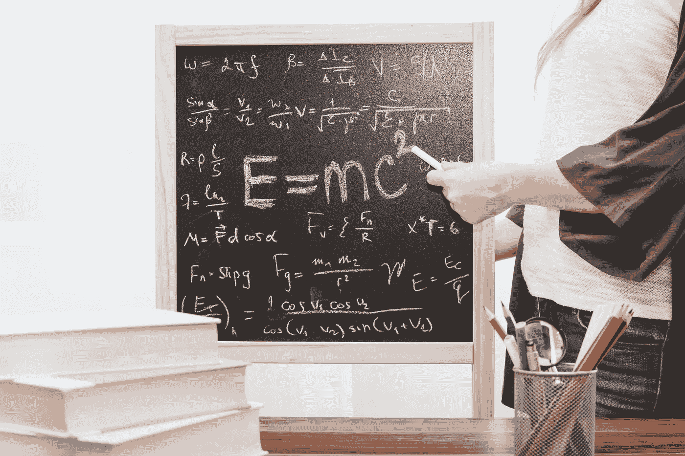

# 教学很难：如何训练小模型并超越大型对手

> 原文：[`towardsdatascience.com/teaching-is-hard-how-to-train-small-models-and-outperforming-large-counterparts-f131f9d463e1?source=collection_archive---------6-----------------------#2023-11-11`](https://towardsdatascience.com/teaching-is-hard-how-to-train-small-models-and-outperforming-large-counterparts-f131f9d463e1?source=collection_archive---------6-----------------------#2023-11-11)

## |模型蒸馏|人工智能|大型语言模型|

## 知识的提炼对于一个大模型来说是复杂的，但是一种新的方法展现了令人难以置信的性能。

 [Salvatore Raieli](https://salvatore-raieli.medium.com/?source=post_page-----f131f9d463e1--------------------------------)

·

[Follow](https://medium.com/m/signin?actionUrl=https%3A%2F%2Fmedium.com%2F_%2Fsubscribe%2Fuser%2Ff1a08d9452cd&operation=register&redirect=https%3A%2F%2Ftowardsdatascience.com%2Fteaching-is-hard-how-to-train-small-models-and-outperforming-large-counterparts-f131f9d463e1&user=Salvatore+Raieli&userId=f1a08d9452cd&source=post_page-f1a08d9452cd----f131f9d463e1---------------------post_header-----------) 发表在 [Towards Data Science](https://towardsdatascience.com/?source=post_page-----f131f9d463e1--------------------------------) ·12 分钟阅读·2023 年 11 月 11 日

--

[JESHOOTS.COM](https://unsplash.com/@jeshoots?utm_source=medium&utm_medium=referral) 的照片在 [Unsplash](https://unsplash.com/?utm_source=medium&utm_medium=referral)

[大语言模型](https://en.wikipedia.org/wiki/Large_language_model)（LLMs）和少样本学习表明我们可以使用这些模型来处理未见过的任务。然而，这些技能是有代价的：庞大的参数数量。这意味着你还需要专门的基础设施，并且将最先进的 LLMs 限制在少数公司和研究团队中。

+   我们真的需要为每个任务创建一个独特的模型吗？

+   是否可能创建能够在特定应用中替代它们的专门模型？

+   我们如何才能拥有一个与巨大的 LLM 竞争的小型模型，用于特定应用？我们是否一定需要大量数据？

在本文中，我回答了这些问题。

> “教育是人生成功的关键，教师在学生的生活中留下了深远的影响。” – 索罗门·奥尔蒂斯

# 与冠军匹配！
