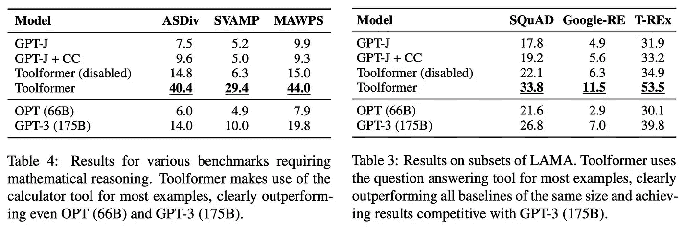
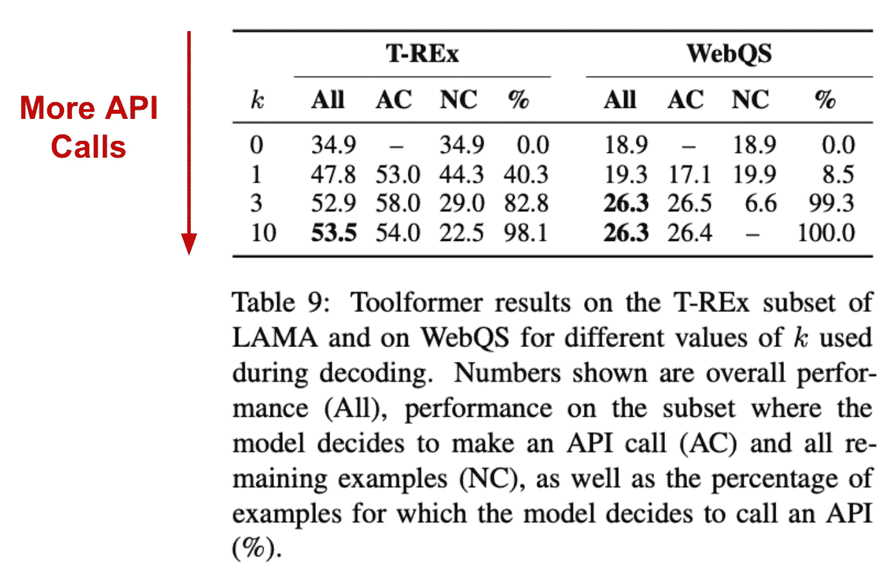

# 教授语言模型使用工具

> 原文：[`towardsdatascience.com/teaching-language-models-to-use-tools-7fd58916c66b`](https://towardsdatascience.com/teaching-language-models-to-use-tools-7fd58916c66b)

## 使用工具让我们作为人类更具能力。LLMs 是否也是如此？

 [Cameron R. Wolfe, Ph.D.](https://wolfecameron.medium.com/?source=post_page-----7fd58916c66b--------------------------------)

·发表于 [Towards Data Science](https://towardsdatascience.com/?source=post_page-----7fd58916c66b--------------------------------) ·阅读时间 17 分钟·2023 年 8 月 27 日

--

（照片由 [Barn Images](https://unsplash.com/@barnimages?utm_source=unsplash&utm_medium=referral&utm_content=creditCopyText) 提供，来自 [Unsplash](https://unsplash.com/photos/t5YUoHW6zRo?utm_source=unsplash&utm_medium=referral&utm_content=creditCopyText)）

随着我们对大语言模型（LLMs）了解的深入，这些模型变得越来越有趣。这些模型能够准确解决各种复杂任务。然而，与此同时，它们在某些我们人类认为基本的功能上却存在困难！例如，LLMs 常常犯算术错误，缺乏获取当前信息的能力，甚至难以理解时间的进程。鉴于这些局限性，我们可能会想，如何才能使 LLMs 更具能力？*LLMs 注定要永远受到这些局限的困扰吗？*

人类历史上的许多进步都由获得新的创新工具（例如 [印刷机](https://www.history.com/news/printing-press-renaissance) 或 [计算机](https://www.youtube.com/watch?v=L40B08nWoMk)）所推动。*相同的发现是否适用于 LLMs？* 在这篇概述中，我们将研究一个最新的研究方向，旨在教会 LLMs 如何使用外部工具，这些工具通过简单的文本到文本的 API 提供。通过使用这些工具，LLMs 可以将执行算术或查找当前信息等任务委派给专门的工具。然后，这些工具返回的信息可以被 LLM 在生成输出时用作上下文，从而产生更准确和有依据的响应。

（来自 [1] 和 ChatGPT Plus）

# 使 LLMs 更具能力

为 LLM 提供外部工具是一种可靠的方法，可以解决这些模型面临的一些限制。然而，LLM 不会自然地知道如何使用工具，这就提出了一个问题：*我们如何教会模型利用外部工具？* 在本节中，我们将探讨我们拥有的一些选项，并列举对构建 LLM 应用程序有用的各种工具。

## 不同类型的学习

LLM 的不同学习形式（作者创建）

教会 LLM 利用工具与学习如何解决其他任务没有什么不同。由于这些模型以几种不同的方式学习，我们将在这里讨论 LLM 的主要学习形式。本文之外，网上还有[详细解释](https://twitter.com/cwolferesearch/status/1635693551584522256?s=20)。

**预训练。** LLM 的第一个和最基本的学习形式是预训练。在预训练过程中，模型在大量未标记的文本数据上进行训练，使用[语言建模目标](https://cameronrwolfe.substack.com/i/85568430/language-modeling)。预训练过程从随机初始化开始，计算成本相当高。通常，由于[计算成本](https://www.mosaicml.com/blog/gpt-3-quality-for-500k)，预训练只执行一次——我们不希望频繁重复预训练过程！值得注意的是，预训练的计算成本解释了像 ChatGPT 这样的 LLM 中存在知识截止点的原因。这些模型在预训练期间学习[所有知识](https://twitter.com/cwolferesearch/status/1660744247123890179?s=20)，因此知识截止点仅与最近预训练期间存在的数据相关。

LLM 的微调方法（来自[11]）

**微调。** 在预训练之后，LLM 可以准确地执行下一个标记预测，但这并不总是意味着它们实际上有用。例如，如果我们玩一下[GPT-2](https://cameronrwolfe.substack.com/i/85568430/language-models-are-unsupervised-multitask-learners-gpt)的演示，只需 2 分钟，我们立刻会发现准确预测下一个标记可能会导致一些相当无聊和无用的输出！因此，我们通常在预训练之后对 LLM 进行微调，通常通过监督微调（SFT）或从人类反馈中进行强化学习（RLHF）；详情见上面的图片和[这里](https://cameronrwolfe.substack.com/i/93578656/refining-llm-behavior)。虽然这些技术的细节超出了本文的范围，但基本的思路是：

1.  筛选更多的训练数据（例如，针对我们要解决的任务的领域数据、正确对话的示例、人类对 LLM 输出的反馈等）。

1.  使用[强化学习](https://openai.com/research/openai-baselines-ppo)或带有（自我）监督目标的梯度下降对模型参数进行训练。

通过这样做，我们可以完成很多事情！例如，[使用 RLHF 对 LLM 进行微调](https://cameronrwolfe.substack.com/i/93578656/training-language-models-to-follow-instructions-with-human-feedback) [11] 已被证明可以使 LLM 更有趣、更准确、更有帮助。更进一步，Meta 最近的 LIMA 出版物显示，通过仅 1,000 个高质量对话示例进行 SFT，可以生成一个与 GPT-4 质量相媲美的模型 [12]。简单来说，微调将我们从一个普通的 LLM 提升到真正特别且有用的水平。

（来自 [7]）

**上下文学习。** 我们应当了解的最终学习形式是上下文学习；见上文。上下文学习不同于预训练和微调，它*并不会实际修改底层模型的参数*。相反，我们通过修改提示来教 LLM 更有效地解决问题！特别是，我们可以通过使用特定的提示技术重新表述提示，甚至将数据插入提示中以进行[少样本学习](https://cameronrwolfe.substack.com/i/117151147/few-shot-learning)。微调和上下文学习之间的区别如下所示。

（来自 [7]）

上下文学习是极其强大的，因为它允许我们使用单一模型解决各种不同的任务。我们可以将有用的数据插入到 LLM 的提示中，而不是微调模型或修改其底层参数。LLM 可以从这些数据中学习，更准确地解决任务，而无需修改模型本身！此外，我们可以使用预训练模型和微调模型进行上下文学习。要了解可以与 LLM 配合使用的提示技术，请查看下面的概述：

+   实用提示 [[link](https://cameronrwolfe.substack.com/p/practical-prompt-engineering-part)]

+   高级提示 [[link](https://cameronrwolfe.substack.com/p/advanced-prompt-engineering)]

+   思维链提示 [[link](https://cameronrwolfe.substack.com/p/chain-of-thought-prompting-for-llms)]

+   提示集合 [[link](https://cameronrwolfe.substack.com/p/prompt-ensembles-make-llms-more-reliable)]

## 对 LLM 有用的工具有哪些？

尽管将 LLM（大语言模型）与外部工具连接的想法很诱人，但我们可能会想：*哪些工具最有用？* 为了回答这个问题，我们应当关注 LLM 的常见局限性，例如：

+   缺乏访问最新信息 [2]

+   有产生幻觉的倾向（即，输出不正确的信息）

+   处理[数学表达式](https://cameronrwolfe.substack.com/i/121554239/program-of-thoughts-pot-prompting)的困难

+   对[低资源语言](https://cameronrwolfe.substack.com/p/many-languages-one-deep-learning)的理解不完全

+   无法理解时间的推移[8]

如果我们想解决这些问题，我们有几个选项。我们可以专注于通过[SFT 或 RLHF](https://cameronrwolfe.substack.com/i/93578656/refining-llm-behavior)对模型进行微调和完善——彻底微调模型以避免上述行为。实际上，大量资源已经投入到通过目标人类反馈来完善像[GPT-4](https://openai.com/research/gpt-4)这样的模型，这也取得了相当[令人印象深刻的结果](https://cameronrwolfe.substack.com/i/121554239/background-information)。然而，我们也可以选择将重点放在让模型采取间接但通常更可靠的方法，而不是在模型内部解决这些问题。特别是，我们可以教会模型如何使用外部工具来帮助回答问题！

**工具如何提供帮助？** 在解决问题时，LLM 通常会通过查询一个可以提供更多上下文的外部工具来获得帮助。值得注意的有用工具包括（但不限于）：

+   能够返回当前日期的日历应用

+   能够评估数学表达式的计算器

+   [向量数据库](https://cameronrwolfe.substack.com/i/118401596/knowledge-augmentation)用于存储（可能）相关但无法直接存储在提示中的大量信息。

+   将数据转换为不同语言的翻译模块

总的来说，工具在提供额外信息或上下文来帮助 LLM 解决问题时极为有用。超越这些简单的工具，我们甚至可以将 LLM 连接到外部代码解释器，使其能够编写和执行任意程序。结合支持代码的 LLM（例如，[Codex](https://cameronrwolfe.substack.com/p/specialized-llms-chatgpt-lamda-galactica) [10]），这种方法实际上可以非常强大！更多信息请见[这里](https://cameronrwolfe.substack.com/p/program-aided-language-models)。

## 工具非常受欢迎！

尽管本概述将主要关注最近研究的工具与 LLM 集成，但通过外部工具增强模型（如 GPT-4）已成为近期关注的主题。例如，OpenAI 最近发布了一个模型插件扩展，使这些强大的 LLM 能够利用大量外部工具；见下文。

ChatGPT Plus 插件商店中的热门应用（来自 ChatGPT Plus）

截至撰写时，GPT-4 有近 130 种不同的插件可用，这展示了将各种工具与强大的 LLM 集成的巨大兴趣。超越第三方插件，OpenAI 最近为 GPT-4 发布了代码解释器和互联网搜索工具。互联网搜索工具对于减轻 LLM 中的幻觉非常有用，因为模型提供的答案可以通过从互联网获取的相关、最新信息进行情境化。除了使 LLM 更具事实性和基础性外，代码解释器工具能够[处理大量代码和数据文件](https://news.ycombinator.com/item?id=36047187)并对这些数据进行准确分析，以提供有价值的见解。

**TL;DR：** 主要结论是，工具正在成为 LLM 的一个常见特性。除了 OpenAI 的产品外，我们甚至看到像 Bard 这样的模型正在增强[类似功能](https://blog.google/technology/ai/google-bard-updates-io-2023/)，而像 LangChain 这样的开源库可以用来轻松构建多种工具类功能供现有 LLM 使用。

# 教授 LLM 使用工具

（来自[1]）

在[1]中，作者探讨了一种名为 Toolformer 的方法，它*i)* 教授 LLM 如何利用外部工具，并且*ii)* 在过程中保持 LLM 的通用性质。这些工具通过一组简单的文本到文本的 API 提供给 LLM（即模型提供文本作为输入，API 返回文本输出）。有趣的是，我们在[1]中看到 LLM 可以完全端到端地学习如何利用这些工具。模型决定调用哪些 API，向这些 API 传递哪些参数，并且如何最佳地利用返回的信息，而无需任何硬编码的控制流。

> “语言模型可以学习控制各种工具，并自行选择何时、如何使用哪个工具。” *— 来源于[1]*

为了做到这一点，我们策划了一个训练数据集，展示了这些工具的正确使用。在[1]中，这个数据集是使用自监督启发式方法自动创建的——意味着不需要人工干预——只需为每个工具提供几个使用示例。然后，我们在这些数据上微调 LLM，使其学习每个工具的正确使用方法。结果是一个高性能的 LLM，它可以将简单但困难的子任务（如语言翻译、算术运算、访问当前信息等）委托给专门的外部工具，这些工具返回相关且准确的数据供 LLM 生成输出。

（来自[1]）

**使用了哪些工具？** 在[1]中，Toolformer 使用了以下固定的一组工具：

+   *问答工具：* 基于 Atlas [13]，一种针对回答简单、基于事实的问题进行微调的 LLM。

+   *计算器：* 用于数值运算的基本计算器。

+   *维基百科搜索工具:* 一个搜索引擎，给定搜索词返回来自维基百科的简短文本片段。

+   *翻译器:* 一个可以将任何语言的文本翻译成英文的语言翻译系统（但不能反向翻译！）。

+   *日历:* 一个在查询时只返回当前日期的工具。

这些工具都通过一个简单的文本到文本结构的 API 提供；见上文。要使用这些工具，LLM 必须学习* i)* 识别需要工具的场景，*ii)* 指定使用哪个工具，*iii)* 向工具的 API 提供相关的文本输入，以及*iv)* 使用从 API 返回的文本来制作响应。值得注意的是，这些 API 简单的文本到文本结构允许我们轻松地将工具使用示例直接插入到文本序列中；见下文。

对外部 API 的调用以文本格式呈现，并与现有文本序列内嵌在一起（来自[1]）

**相较于以前工作的改进。** 让 LLM 使用外部工具并不是一个新想法。例如，许多研究者尝试通过让 LLM 访问外部计算器来提高其在算术——特别是大数计算——方面的能力（见[4]的附录 B）。然而，主要问题是：*我们应该如何教 LLM 使用这样的工具？* 以前的方法严重依赖于人类标注的数据集。例如，LaMDA[3]使用外部搜索工具来减少幻觉；见下文。

(来自[3])

然而，我们在[3]中看到，教会 LaMDA 利用外部工具——在这个例子中是外部的[信息检索系统](https://cameronrwolfe.substack.com/i/118401596/knowledge-augmentation)——需要大量的人类标注数据。更具体地说，[3]中的作者让大量的众包工人手动编写对话，利用与 LLM 相同的搜索工具，从而提供了 LLM 应如何行为和回应的示例。相关出版物往往依赖于类似的人类中心方法[2]。创建这样的数据集困难、昂贵且耗时，这促使[1]中的作者开发了更高效的解决方案。

**自动学习使用工具。** 在[1]中，我们看到一个用于教 LLM 如何利用外部工具的数据集——为了简单起见，我们称之为“工具跟随数据集”——可以通过利用现有的、预训练的 LLM 的提示方法自动创建。我们从一个初始（正常）数据集开始，例如用于预训练的文本语料库。然后，我们提示一个预训练的 LLM 用外部 API 调用来增强这些数据。在这里，我们依赖于通用预训练 LLM 的上下文学习能力，来策划一组 API 调用，展示如何正确使用可用工具。下面展示了一个生成请求到问答工具 API 的示例提示。

（来自 [1]）

在我们用每个工具的示例用法扩充了数据集之后，我们需要执行过滤步骤。这一步骤是必要的，因为我们只希望在工具实际上对 LLM 有帮助时才使用外部工具！我们不应该在不需要时总是依赖外部工具——使用工具通常会有延迟（甚至是经济）成本。为了捕捉这个想法，我们可以这样做：

1.  使用工具测量 LLM 的性能（即，[交叉熵损失](https://pytorch.org/docs/stable/generated/torch.nn.CrossEntropyLoss.html)在 API 调用之后的标记上）。

1.  测量 LLM 在没有工具情况下的性能。

1.  丢弃那些使用工具未能使 LLM 的性能超越某个阈值的示例。

在这里，我们假设可以访问一个演示 LLM 应产生正确输出的数据集。通过这种方法，我们可以自动构建一个包含示例的数据集，说明何时以及如何利用工具来实际改善 LLM 的输出。在实践中，实际过程要复杂一些。具体来说，为了在没有工具的情况下测量 LLM 的性能，我们观察两个独立的情况——一个是完全不使用工具的情况，另一个是执行 API 调用但不提供响应的情况。这种方法确保了工具及其数据对 LLM 的有用性。

> “如果提供此调用的输入和输出使得预测未来的标记更容易，则 API 调用对[语言模型]是有帮助的”*— 来自 [1]*

此外，我们没有将 API 调用插入到文本序列中，而是将其作为前缀附加，这样可以避免 LLM 损失的波动。记住，这样的 API 调用在 LLM 的原始预训练语料库中不存在，这意味着直接将 API 调用插入文本序列可能会扭曲用于过滤的结果。*模型并不期望在数据中看到这样的 API 调用！* 此外，在测量性能时，我们为 API 调用空间上接近的标记分配更高的权重，确保 API 调用发生在所需的地方，而不是在生成输出时的随机时刻。

（来自 [1]）

[1]中使用的工具跟随数据集的完整构建过程如上所示。与以前的工作不同，这个过程不需要人工劳动。相反，我们利用 LLM 的上下文学习能力和一些巧妙的启发式方法来自动构建数据集。尽管这个过程并不完美（即，某些无用的 API 调用可能会避免过滤），但在实践中效果相当好！

**学习使用工具。** 一旦我们构建了数据集，教会 LLM 如何利用外部工具是很容易的——我们只需使用[标准语言建模目标](https://cameronrwolfe.substack.com/i/85568430/language-modeling)对模型进行微调。在[1]中，工具跟随数据集来源于预训练语料库。因此，尽管微调后的 LLM 能够利用外部工具，但它仍然是一个通用模型。此外，由于[1]中的筛选过程会去除那些不利于性能的 API 调用，LLM 会在隐含中学习何时以及如何使用每个工具以提升其输出。这种简单的方法取得了相当酷的结果！

## 工具是否有影响？

在[1]中分析的模型基于[GPT-J](https://huggingface.co/EleutherAI/gpt-j-6b) [5]，这是一个拥有 60 亿参数的语言模型，并且采用了[CCNet](https://github.com/facebookresearch/cc_net)作为训练数据集。Toolformer 与多个基准模型进行了比较，包括禁用 API 调用的 Toolformer 模型、原始的 GPT-J 模型、在 CCNet 上微调的 GPT-J 版本，以及其他一些 LLM，如[OPT](https://cameronrwolfe.substack.com/p/understanding-the-open-pre-trained-transformers-opt-library-193a29c14a15) [6]和[GPT-3](https://cameronrwolfe.substack.com/i/88082618/language-models-are-few-shot-learners) [7]。与研究少样本学习的先前工作不同，这些模型使用[零样本方法](https://cameronrwolfe.substack.com/i/117151147/zero-shot-learning)进行评估，这种方法只是简单地向模型描述任务而不提供任何示例，并且使用了[贪婪解码](https://twitter.com/cwolferesearch/status/1659608476455256078?s=20)策略。在 Toolformer 中，只要`<API>`（即 API 调用的起始标记）出现在模型的`k`个最可能标记之一中，就会利用工具。

Toolformer 在多个不同领域中进行了评估。在基于事实的数据集上，我们发现问答工具被大量利用，相比基准模型的准确率显著提高。同样，在数学推理数据集上，计算器工具也被发现非常有用；见下文。

（来自[1]）

在（多语言）问答基准上，模型的表现并不像预期那样令人印象深刻（即，Toolformer 在某些情况下不及 GPT-3 或 GPT-J 的表现）。然而，某些工具，如日历工具，被发现对提升 LLM 在时间推理等任务上的表现非常有用。有趣的是，作者还进行了一些分析，修改了 LLM 解码策略中 API 调用的概率。通过这项分析，我们了解到*更频繁地利用外部工具并不总是好事*——如果工具使用过于频繁，性能会下降；见下文。

（来自[1]）

这样的发现突显了[1]中使用的过滤策略的重要性。工具使用不仅有成本，而且可能会降低性能。LLM 必须学习在何种场景下调用工具最为重要。[1]中采取的方法明确地使 LLM 在仅在显著提升模型性能时才利用外部工具。

（摘自[1]）

**保持通用。** 除了上述下游评估，[1]中的作者在工具跟随数据集微调后，在预训练数据集的留出部分上评估了 Toolformer，发现模型在微调前后都达到可比的困惑度；如上所述。换句话说，*Toolformer 在学习如何利用外部工具时不会丧失作为通用语言模型的任何能力*，这意味着—与先前以任务特定方式接近工具跟随的工作不同[8]—该模型仍然是一个[基础模型](https://crfm.stanford.edu/)，能够解决各种不同的任务。

## 使用工具变得越来越简单

尽管[1]中提出的方法具有突破性并且信息量巨大，但它仍然需要一个广泛的微调过程。与大多数最近应用的 LLM 相比，这确实是一个麻烦！*我们是否可以利用仅通过提示的方法来教会 LLM 使用外部工具？* 最近围绕 GPT-4 的进展表明，这个问题可能通过提高 LLM 的[指令跟随能力](https://cameronrwolfe.substack.com/i/117151147/instruction-prompting)来解决。

（作者创建）

**GPT-4 插件工作流程。** 例如，GPT-4 可以通过[插件商店](https://openai.com/blog/chatgpt-plugins)访问各种工具。然而，模型并没有明确地针对商店中的每个插件进行微调。相反，它只是使用上下文学习。特别是，OpenAI 在提升 GPT-4 的[可控性](https://twitter.com/cwolferesearch/status/1645535868021805056?s=20)方面投入了大量资金，这使得模型能够非常详细地跟随指令和提示。因此，教会 GPT-4 如何使用插件只需要：

1.  描述插件目的的文本描述

1.  描述插件 API 的输入/输出格式的架构

使用这些信息，模型可以自行决定何时使用插件，进行格式正确的 API 调用，并将结果信息整合到对话中。这一切都是通过文本描述完成的，没有任何明确的微调，*这表明教会 LLM 利用外部工具可能会随着时间的推移变得更加容易*。要更详细地了解这一过程，我们可以查看 [开源插件实现](https://github.com/openai/chatgpt-retrieval-plugin) 或 [OpenAI 插件开发文档](https://platform.openai.com/docs/plugins/introduction/plugin-flow)。

# 结语

类似于人类在使用工具（例如，锤子、计算机、飞机等）后变得更好，LLMs 在获得一组可以提供有用信息或执行简单任务的简单 API 时也变得更有能力。*为什么我们要完全依赖 LLM 解决一切问题，而不是将困难的任务委派给更准确、更专业的工具？* 我们可以使用这种方法来缓解这些模型常常遇到的问题，例如输出中的不正确信息或缺乏时间推理能力。通过 Toolformer [1]，我们看到 LLM 可以通过对工具跟随示例的数据集进行微调来学习利用外部工具。但是，最近的趋势表明，仅通过上下文学习可能就能教会 LLM 使用外部工具。这个领域还有很多未被揭示的内容，观察这些主题和相关应用随时间的发展将会很有趣！

## 与我联系！

非常感谢你阅读这篇文章。我是 [Cameron R. Wolfe](https://cameronrwolfe.me/)，[Rebuy](https://www.rebuyengine.com/) 的人工智能总监。我研究深度学习的实证和理论基础。如果你喜欢这个概述，请订阅我的 [Deep (Learning) Focus 新闻通讯](https://cameronrwolfe.substack.com/)，在这里我通过从基础开始概述相关主题，帮助读者理解 AI 研究。你还可以在 [X](https://twitter.com/cwolferesearch) 和 [LinkedIn](https://www.linkedin.com/in/cameron-r-wolfe-ph-d-04744a238/) 上关注我，或者查看我在 Medium 上的 [其他文章](https://medium.com/@wolfecameron)！

## 参考文献

[1] Schick, Timo 等人. “Toolformer: 语言模型可以自我学习使用工具。” *arXiv 预印本 arXiv:2302.04761* (2023)。

[2] Komeili, Mojtaba, Kurt Shuster 和 Jason Weston. “互联网增强的对话生成。” *arXiv 预印本 arXiv:2107.07566* (2021)。

[3] Thoppilan, Romal 等人. “Lamda: 对话应用的语言模型。” *arXiv 预印本 arXiv:2201.08239* (2022)。

[4] Wei, Jason 等人. “思维链提示引发大型语言模型的推理。” *arXiv 预印本 arXiv:2201.11903* (2022)。

[5] Wang, Ben 和 Aran Komatsuzaki. “GPT-J-6B: 一种 60 亿参数的自回归语言模型。” (2021)。

[6] 张苏珊等，“Opt: 开放预训练变换器语言模型。” *arXiv 预印本 arXiv:2205.01068* (2022)。

[7] 布朗·汤姆等，“语言模型是少样本学习者。” *神经信息处理系统进展* 33 (2020): 1877–1901。

[8] 帕里西·亚伦、姚赵和诺亚·费德尔，“Talm: 工具增强语言模型。” *arXiv 预印本 arXiv:2205.12255* (2022)。

[9] 丁格拉·布万等，“时间感知语言模型作为时间知识库。” *计算语言学学会会刊* 10 (2022): 257–273。

[10] 陈马克等，“评估基于代码训练的大型语言模型。” *arXiv 预印本 arXiv:2107.03374* (2021)。

[11] 欧阳龙等，“训练语言模型以遵循人类反馈的指令。” *神经信息处理系统进展* 35 (2022): 27730–27744。

[12] 周春婷等，“Lima: 对齐的少即是多。” *arXiv 预印本 arXiv:2305.11206* (2023)。

[13] 伊扎卡德·戈蒂埃等，“Atlas: 带检索增强的语言模型的少样本学习。” *arXiv 预印本 arXiv* 2208 (2022)。
