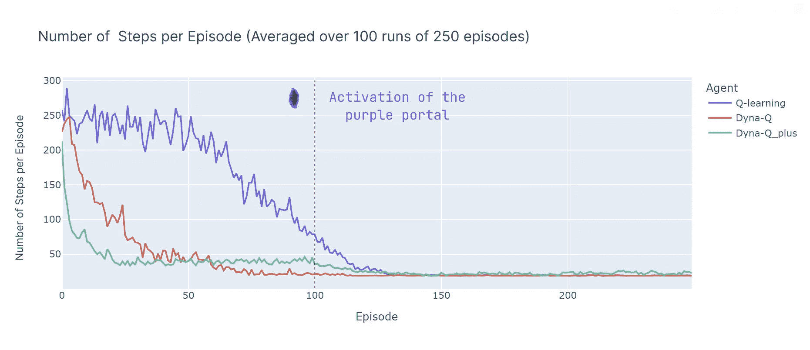

# 时间差学习及探索的重要性：图解指南

> 原文：[`towardsdatascience.com/temporal-difference-learning-and-the-importance-of-exploration-an-illustrated-guide-5f9c3371413a?source=collection_archive---------2-----------------------#2023-09-23`](https://towardsdatascience.com/temporal-difference-learning-and-the-importance-of-exploration-an-illustrated-guide-5f9c3371413a?source=collection_archive---------2-----------------------#2023-09-23)

## 在动态网格世界中比较无模型和有模型的强化学习方法

 [Ryan Pégoud](https://medium.com/@ryanpegoud?source=post_page-----5f9c3371413a--------------------------------)

·

[关注](https://medium.com/m/signin?actionUrl=https%3A%2F%2Fmedium.com%2F_%2Fsubscribe%2Fuser%2F27fba63b402e&operation=register&redirect=https%3A%2F%2Ftowardsdatascience.com%2Ftemporal-difference-learning-and-the-importance-of-exploration-an-illustrated-guide-5f9c3371413a&user=Ryan+P%C3%A9goud&userId=27fba63b402e&source=post_page-27fba63b402e----5f9c3371413a---------------------post_header-----------) 发表在 [Towards Data Science](https://towardsdatascience.com/?source=post_page-----5f9c3371413a--------------------------------) · 15 分钟阅读 · 2023 年 9 月 23 日

--

图片来源：[Saffu](https://unsplash.com/@saffu?utm_source=medium&utm_medium=referral) 供图于 [Unsplash](https://unsplash.com/?utm_source=medium&utm_medium=referral)

最近，**强化学习**（RL）算法因解决诸如**蛋白质折叠**、在**无人机竞速**中达到超人类水平，甚至在你喜欢的聊天机器人中**整合人类反馈**等研究问题而受到广泛关注。

的确，RL 为各种顺序决策问题提供了有用的解决方案。**时间差分学习**（TD 学习）方法是 RL 算法中的一个流行子集。TD 学习方法**结合**了**蒙特卡洛**和**动态规划**方法的关键方面，以加速学习而不需要完美的环境动态模型。

在这篇文章中，我们将比较不同类型的**TD 算法**在自定义网格世界中的表现。实验设计将展示**持续探索**的重要性以及被测试算法的**个体特征**：**Q-learning**、**Dyna-Q** 和 **Dyna-Q**+。

本文的概要包括：

+   环境描述

+   时间差分（TD）学习

+   无模型 TD 方法（Q-learning）和基于模型的 TD 方法（Dyna-Q 和 Dyna-Q+）

+   参数

+   性能比较

+   结论

*允许重现结果和图表的完整代码可以在这里找到：* [`github.com/RPegoud/Temporal-Difference-learning`](https://github.com/RPegoud/Temporal-Difference-learning)

# 环境

我们将在此实验中使用的环境是一个具有以下特征的网格世界：

+   网格是 12 x 8 单元格。

+   **代理**从网格的左下角开始，**目标**是到达位于右上角的宝藏（一个终端状态，奖励为 1）。

+   **蓝色传送门**是相连的，通过位于单元格**(10, 6)**的传送门**到达**单元格**(11, 0)**。代理在第一次过渡后不能再次使用该传送门。

+   **紫色传送门**仅在**100 个剧集后**出现，但能使代理更快到达宝藏。这鼓励持续探索环境。

+   **红色传送门**是**陷阱**（终端状态，奖励为 0），并结束剧集。

+   碰到墙壁会导致代理保持在同一状态。

网格世界不同组件的描述（由作者制作）

本实验旨在比较 Q-learning、Dyna-Q 和 Dyna-Q+ 代理在**变化环境**中的行为。的确，在**100 个剧集**之后，**最优策略**必定会发生变化，成功剧集中的最优步骤数将从**17**减少到**12**。

网格世界的表示，最优路径依赖于当前的剧集（由作者制作）

# 时间差分学习介绍：

时间差分学习是**蒙特卡洛**（MC）和**动态规划**（DP）方法的组合：

+   与 MC 方法类似，TD 方法可以从经验中学习**而不需要**环境动态模型。

+   与 DP 方法类似，TD 方法**在每一步后更新估计**，**基于其他学习到的估计**，而不是等待**结果**（这称为 *自举*）。

TD 方法的一个特点是，它们在**每个时间步**都更新其价值估计，而 MC 方法则等到回合结束。

确实，这两种方法有**不同的更新目标**。MC 方法旨在更新回报**Gt**，它仅在一个回合结束时可用。而 TD 方法则针对：

TD 方法的更新目标

其中**V**是**真实价值函数 Vπ**的**估计**。

因此，TD 方法**结合**了**MC**的**采样**（通过使用真实价值的估计）和**DP**的**自举**（通过基于进一步估计的估计更新 V）。

时间差分学习的最简单版本称为**TD(0)**或一步 TD，实际实现 TD(0)看起来像这样：

TD(0)算法的伪代码，摘自《强化学习导论》[4]

当从状态**S**转移到新状态**S’**时，TD(0)算法将计算**备份值**并相应地更新**V(S)**。这个备份值称为 TD 误差，即观察到的奖励**R**加上新状态**γV(St+1)**的折扣值与当前价值估计**V(S)**之间的差异：

TD 误差

总之，TD 方法具有若干优点：

+   它们不需要环境动态的完美模型*p*

+   它们以在线方式实现，在每个时间步后更新目标

+   如果α（*学习率*或*步长*）遵循随机逼近条件，TD(0)保证会在任何固定策略π下收敛（更多细节请参见[[4]](http://incompleteideas.net/book/RLbook2020.pdf)第 55 页*“追踪非平稳问题”*）

# 实现细节：

以下各节探讨了多个 TD 算法在网格世界中的主要特性和性能。

为了简化起见，所有模型使用了相同的参数：

+   **Epsilon (**ε) = 0.1：在ε-贪心策略中选择随机动作的概率

+   **Gamma (***γ*) = 0.9：应用于未来奖励或价值估计的折扣因子

+   **Aplha** (α) = 0.25：限制 Q 值更新的学习率

+   **Planning steps** = 100：对于 Dyna-Q 和 Dyna-Q+，每次直接交互执行的规划步骤数量

+   **Kappa (***κ***) = 0.001：对于 Dyna-Q+，在规划步骤中应用的奖励加权

每个算法的性能首先在单次运行 400 个回合的基础上进行展示（部分：**Q 学习**、**Dyna-Q**和**Dyna-Q+**），然后在“**总结与算法比较**”部分对 100 次运行 250 回合的数据进行平均。

# Q 学习

我们在这里实现的第一个算法是著名的 Q 学习（*Watkins*, 1989）：

Q 学习被称为**离策略**算法，因为其目标是直接逼近**最优值函数**，而不是代理遵循的策略*π*的值函数。

实际上，Q 学习仍然依赖于一个策略，通常称为‘*行为策略*’，以选择哪些状态-动作对被访问和更新。然而，Q 学习是离策略的，因为它基于**未来奖励的最佳估计**来更新其 Q 值，无论所选动作是否遵循当前策略*π*。

与之前的 TD 学习伪代码相比，有三个主要区别：

+   我们需要初始化所有状态和动作的 Q 函数，并且 Q(terminal)应为 0

+   动作是从基于 Q 值的策略中选择的（例如相对于 Q 值的ϵ-贪心策略）

+   更新的目标是动作值函数 Q 而非状态值函数 V

Q 学习算法的伪代码，摘自《强化学习导论》[4]

现在我们有了第一个算法读取用于测试，我们可以开始训练阶段。我们的代理将使用其**ε-贪心策略**在网格世界中导航，相对于 Q 值。该策略以**(1 - ε)**的概率选择**最高 Q 值**的动作，并以**ε**的概率选择**随机动作**。每次行动后，代理将**更新**其 Q 值估计。

我们可以使用热图可视化每个网格世界单元的估计**最大动作值** **Q(S, a)**的演变。这里代理器进行 400 个回合。由于每个回合只有一次更新，Q 值的演变较慢，大部分状态仍未映射：

训练过程中学习到的每个状态的 Q 值的热图表示（作者提供）

完成 400 个回合后，对每个单元总访问次数的分析为我们提供了代理平均路径的合理估计。如下面右侧图所示，代理似乎已收敛到一个**次优路径**，**避免了单元（4,4）**，并且始终**沿着下墙**行进。

（左）每个状态的最大动作值估计，（右）每个状态的访问次数（作者提供）

由于这种次优策略，代理在每回合达到最少**21 步**，遵循“总访问次数”图中勾画的路径。步骤数量的变化可归因于ε-贪心策略，该策略引入了 10%的随机动作概率。鉴于这一策略，沿下墙行进是一种限制随机动作带来的潜在干扰的不错策略。

训练最后 100 回合的步数（300–400）（作者提供）

总结来说，Q 学习代理如前所述收敛于**次优策略**。此外，Q 函数仍有一部分环境是**未被探索**的，这阻止了代理在第 100 集后出现紫色传送门时找到新的最佳路径。

这些性能限制可以归因于相对**较少的训练步骤**（400），这限制了与环境互动的可能性以及 ε-贪婪策略引发的探索。

**规划**，作为**基于模型**的强化学习方法的一个基本组成部分，特别有助于提高**样本效率**和**动作价值的估计**。Dyna-Q 和 Dyna-Q+ 是结合了规划步骤的 TD 算法的良好示例。

# Dyna-Q

Dyna-Q 算法（动态 Q 学习）是**基于模型的强化学习**和**TD 学习**的结合体。

基于模型的强化学习算法依赖于**环境模型**，将规划作为其**更新价值估计的主要方式**。相比之下，无模型算法依赖于直接学习。

> **“环境模型是代理可以用来预测环境如何对其动作做出响应的任何东西”** — 强化学习：导论。

在本文的范围内，模型可以被视为对转移动态 *p(s', r|s, a)* 的近似。这里，*p* 返回**一个单一的下一个状态和奖励对**，给定当前状态-动作对。

在**随机**的环境中，我们区分分布模型和样本模型，前者返回下一个状态和动作的分布，而后者返回从估计分布中抽样得到的单一对。

模型特别有助于模拟情节，因此通过用规划步骤替代现实世界的互动来训练代理，即与模拟环境的互动。

实施 Dyna-Q 算法的代理是**规划代理**的一部分，这些代理**结合了直接强化学习**和**模型学习**。它们使用与环境的直接互动来更新它们的价值函数（如 Q 学习所示），同时也学习环境的模型。在每次直接互动之后，它们还可以执行规划步骤，通过模拟互动来更新它们的价值函数。

## 一个快速的国际象棋示例

想象一下玩一局好的国际象棋。每次走一步棋后，你对手的反应让你评估**你的走棋质量**。这类似于收到正面或负面的奖励，这让你可以“更新”你的策略。如果你的走棋导致了失误，你可能不会再这样做，前提是棋盘的配置相同。到目前为止，这与**直接强化学习**是类似的。

现在，让我们加入**规划**。假设在你每次移动后，当对手思考时，你在脑海中回顾你的**每一次移动**以**重新评估它们的质量**。你可能会发现最初忽视的弱点，或发现某些移动比你想象的更好。这些思考还可能让你更新策略。这正是规划的意义，**在不与真实环境交互的情况下更新值函数**，而是**对环境的模型**。

计划、行动、模型学习和直接强化学习：一个规划代理的时间表（由作者制定）

因此，Dyna-Q 相比 Q 学习包含了一些额外的步骤：

在每次直接更新 Q 值后，模型会存储观察到的状态-动作对、奖励和下一个状态。这个步骤称为模型训练。

+   在模型训练后，Dyna-Q 执行*n*规划步骤：

+   从模型缓冲区中选择一个随机的状态-动作对（即这个状态-动作对是在直接交互中观察到的）

+   模型生成模拟的奖励和下一个状态

+   值函数通过模拟观察进行更新（*s, a, r, s’*）

Dyna-Q 算法的伪代码，摘自《强化学习简介》[4]

我们现在使用***n*=100**来复制 Dyna-Q 算法的学习过程。这意味着在每次与环境的直接交互后，我们使用模型执行 100 次规划步骤（即更新）。

下图热力图展示了 Dyna-Q 模型的快速收敛。事实上，算法只需约**10 个回合**即可找到**最优路径**。这是因为每一步会导致 Q 值的 101 次更新（而 Q 学习只更新 1 次）。

训练期间每个状态的学习 Q 值的热力图表示（由作者制作）

规划步骤的另一个好处是更好地估计网格中的动作值。由于间接更新针对的是存储在模型中的随机过渡，距离目标较远的状态也会被更新。

相比之下，Q 学习中的动作值会从目标点缓慢传播，导致网格的映射不完整。

（左）每个状态的最大动作值估计，（右）每个状态的访问次数（由作者制作）

使用 Dyna-Q，我们找到一个**最优路径**，允许在**17 步**内解决网格世界，如下图红条所示。尽管为了探索偶尔会有ε-贪婪行为的干扰，最佳表现仍然会定期达到。

最终，虽然 Dyna-Q 由于引入了规划，可能看起来比 Q-learning 更具说服力，但需要记住的是，规划带来了**权衡**，在**计算成本**和**现实世界探索**之间。

训练的最后 100 集（300–400）的步骤数（作者制作）

# Dyna-Q+

到目前为止，测试的算法没有一个能找到第 100 步之后出现的最优路径（紫色传送门）。实际上，这两个算法都迅速收敛到一个**在训练阶段结束前保持固定的最优解决方案**。这突显了**持续探索**在训练过程中的必要性。

Dyna-Q+与 Dyna-Q 大致相似，但在算法上增加了一个小变化。实际上，Dyna-Q+不断跟踪自每个状态-动作对在与环境的真实交互中尝试以来所经过的时间步数。

特别地，考虑一个奖励**r**的转移，该转移在*τ*时间步中没有被尝试。Dyna-Q+会进行规划，假设该转移的奖励为***r* + *κ* √*τ***，其中*κ*足够小（实验中为 0.001）。

这种奖励设计的变化鼓励智能体持续探索环境。它假设状态-动作对未被尝试的时间越长，这对的动态发生变化或模型不正确的可能性就越大。

Dyna-Q+算法的伪代码，摘自《强化学习导论》[4]

如下热图所示，与之前的算法相比，Dyna-Q+在更新方面更加活跃。在第 100 集之前，智能体探索了整个网格，找到了蓝色传送门和第一个最优路线。

网格其余部分的动作值在减少后再缓慢增加，因为左上角的状态-动作对在一段时间内没有被探索。

当紫色传送门在第 100 集出现时，智能体找到新的捷径，整个区域的值上升。在完成 400 集之前，智能体将不断更新每个状态-动作对的动作值，同时保持对网格的偶尔探索。

训练过程中每个状态的学习 Q 值的热图表示（作者制作）

多亏了对模型奖励的额外奖金，我们最终得到了**Q 函数的完整映射**（每个状态或单元都有一个动作值）。

结合持续探索，智能体能够找到出现的新最佳路线（即最优策略），同时保留以前的解决方案。

（左）每个状态的最大动作值估计，（右）每个状态的访问次数（作者制作）

然而，Dyna-Q+ 中的探索与利用权衡确实带来了成本。当状态-动作对在足够长时间内未被访问时，探索奖励会鼓励代理重新访问这些状态，这可能会**暂时降低其即时性能**。这种探索行为优先更新模型以改善长期决策。

这解释了为什么 Dyna-Q+ 有些回合可以长达 70 步，而 Q 学习和 Dyna-Q 最多为 35 步和 25 步。Dyna-Q+ 中较长的回合反映了代理愿意投入额外的步数进行探索，以获取更多关于环境的信息并完善其模型，即使这会导致短期性能下降。

相比之下，Dyna-Q+ 经常实现最佳性能（如下图中的绿色条形图所示），这是以前的算法未能达到的。

训练最后 100 回合的步数（300–400）（作者提供）

# 总结与算法比较

为了比较算法之间的关键差异，我们使用了两个指标（请注意，结果依赖于输入参数，为简化起见，所有模型的输入参数均相同）：

+   **每回合步数**：该指标描述了算法向最优解收敛的速度。它还描述了算法在收敛后的行为，特别是在探索方面。

+   **平均累计奖励**：指导致正奖励的回合百分比。

分析每回合的步数（见下图）揭示了基于模型和非基于模型的方法的几个方面：

+   **基于模型的效率**：在这个特定的网格世界中，基于模型的算法（Dyna-Q 和 Dyna-Q+）往往更具样本效率（这一特性在 RL 中也较为普遍）。这是因为它们可以利用环境的学习模型进行前瞻性规划，从而更快地收敛到接近最优或最优的解决方案。

+   **Q 学习收敛**：Q 学习虽然最终会收敛到接近最优解，但需要更多的回合（125）。需要强调的是，Q 学习每步仅执行 1 次更新，这与 Dyna-Q 和 Dyna-Q+ 执行的多次更新形成对比。

+   **多次更新**：Dyna-Q 和 Dyna-Q+ 每步执行 101 次更新，这有助于它们更快地收敛。然而，这种样本效率的权衡是计算成本（见下表的运行时间部分）。

+   **复杂环境**：在更复杂或随机的环境中，基于模型的方法的优势可能会减弱。模型可能引入错误或不准确，从而导致次优策略。因此，这种比较应被视为不同方法的优缺点概述，而不是直接的性能比较。

平均每集步骤数的比较（由作者制作）

现在我们引入平均累计奖励（ACR），它表示代理达到目标的集数百分比（因为达到目标的奖励为 1，而触发陷阱的奖励为 0），因此 ACR 计算方式为：

其中 *N* 是集数（250），K 是独立运行次数（100），R*n,k* 是运行 *k* 中第 *n* 集的累计奖励。

以下是所有算法性能的详细分析：

+   **Dyna-Q** 收敛迅速，达到最高的总体回报，ACR 为 87%。这意味着它在很大一部分集数中能够高效地学习并达到目标。

+   **Q-learning** 也达到了类似的性能水平，但需要更多的集数才能收敛，这解释了其稍低的 ACR，为 70%。

+   **Dyna-Q+** 能够迅速找到一个良好的策略，在仅经过 15 集后达到累计奖励 0.8。然而，奖励的变异性和探索性降低了其性能，直到第 100 步之后才开始改善，因为它发现了新的最优路径。然而，短期的探索会妨碍其性能，导致其 ACR 为 79%，低于 Dyna-Q，但高于 Q-learning。

平均每集累计奖励的比较（由作者制作）

# 结论

在本文中，我们介绍了时序差分学习的基本原理，并将 Q-learning、Dyna-Q 和 Dyna-Q+ 应用于自定义网格世界。这个网格世界的设计有助于强调持续探索的重要性，以发现和利用在变化环境中新的最优策略。通过每集步骤数和累计奖励的表现差异，展示了这些算法的优缺点。

总结来说，基于模型的方法（Dyna-Q、Dyna-Q+）相较于基于模型的方法（Q-learning）在样本效率上有优势，但计算效率较低。然而，在随机或更复杂的环境中，模型的不准确性可能会阻碍性能并导致次优策略。

## 参考文献：

[1] Demis Hassabis, [*AlphaFold 揭示了蛋白质宇宙的结构*](https://www.deepmind.com/blog/alphafold-reveals-the-structure-of-the-protein-universe) *(2022), DeepMind*

[2] Elia Kaufmann, Leonard Bauersfeld, Antonio Loquercio, Matthias Müller, Vladlen Koltun & Davide Scaramuzza, [*冠军级无人机竞速使用深度强化学习*](https://www.nature.com/articles/s41586-023-06419-4) *(2023),* Nature

[3] Nathan Lambert, Louis Castricato, Leandro von Werra, Alex Havrilla, [*从人类反馈中阐述强化学习（RLHF）*](https://huggingface.co/blog/rlhf), HuggingFace

[4] Sutton, R. S. 和 Barto, A. G. *.* [*强化学习：导论*](http://incompleteideas.net/book/the-book-2nd.html) *(2018),* 剑桥（马萨诸塞州）：麻省理工学院出版社。

[5] Christopher J. C. H. Watkins 和 Peter Dayan, [*Q-learning*](https://link.springer.com/article/10.1007/BF00992698) *(1992),* 《机器学习》，Springer Link
