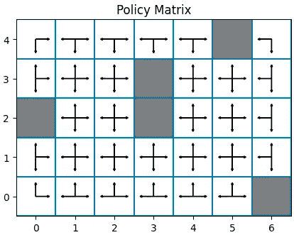

# Python 中的时序差分：第一个基于样本的强化学习算法

> 原文：[`towardsdatascience.com/temporal-differences-with-python-first-sample-based-reinforcement-learning-algorithm-54c11745a0ee`](https://towardsdatascience.com/temporal-differences-with-python-first-sample-based-reinforcement-learning-algorithm-54c11745a0ee)

## 使用 Python 编写并理解 TD(0)算法

[](https://eligijus-bujokas.medium.com/?source=post_page-----54c11745a0ee--------------------------------)[](https://towardsdatascience.com/?source=post_page-----54c11745a0ee--------------------------------) [Eligijus Bujokas](https://eligijus-bujokas.medium.com/?source=post_page-----54c11745a0ee--------------------------------)

·发表于 [Towards Data Science](https://towardsdatascience.com/?source=post_page-----54c11745a0ee--------------------------------) ·13 分钟阅读·2023 年 1 月 27 日

--


[Kurt Cotoaga](https://unsplash.com/@kydroon?utm_source=medium&utm_medium=referral)在[Unsplash](https://unsplash.com/?utm_source=medium&utm_medium=referral)上的照片

这是我之前文章的续集：

[](/first-steps-in-the-world-of-reinforcement-learning-using-python-b843b76538e3?source=post_page-----54c11745a0ee--------------------------------) ## Python 强化学习中的第一步

### Python 的原始实现，展示了如何在强化学习的基本世界之一中找到最佳位置……

towardsdatascience.com

在这篇文章中，我想让读者熟悉强化学习中的基于样本的算法逻辑（**RL**）。为此，我们将创建一个带有洞的网格世界（类似于缩略图中的那个），并让我们的代理在创建的世界中自由遍历。

希望在代理的旅程结束时，他能学会在世界上哪个地方是好的地方，哪些位置应该避免。为了帮助我们的代理学习，我们将使用著名的**TD(0)**算法。

在深入算法之前，让我们定义一下我们想要解决的目标。

在这篇文章中，我们将创建一个 5 行 7 列的网格世界，这意味着我们的代理将能够处于 35 个状态中的一个。移动规则如下：

+   代理不能离开网格世界的边界。

+   在每个时间步，代理只能向上、向下、向左或向右移动。

+   代理从我们网格世界的左上角开始。

+   如果代理达到目标或掉入洞里，游戏结束，代理会被返回到起始状态。

+   每次移动都会获得-1 的奖励。

+   掉入洞里会获得-10 的奖励。

+   达到目标会获得 10 的奖励。

我们代理的**终极目标是尽可能准确地评估它可能处于的每一个状态。换句话说，**我们代理希望根据给定的移动策略评估每个状态的价值。**

以下代码片段初始化了前一节中描述的环境：

```py
import numpy as np 

def init_policy(S: np.array, weight_dict: dict = {'right': 1}) -> dict:
    # Saving all the unique states to a vector 
    states = np.unique(S)

    # Getting the number of rows and columns of the S matrix
    n_row = S.shape[0]
    n_col = S.shape[1]

    # Dictionary to hold each action for a given state
    P = {}
    for s in states: 
        s_dict = {}

        # Checking which index is the current state in the S matrix 
        s_index = np.where(S == s)

        # If the state is in the top left corner, we can only move right and down
        if s_index == (0, 0):
            s_dict['right'] = 0.5 * weight_dict['right']
            s_dict['down'] = 1 - s_dict['right']

        # If the state is in the top right corner, we can only move left and down
        elif s_index == (0, n_col - 1):
            s_dict['left'] = 0.5
            s_dict['down'] = 0.5

        # If the state is in the bottom left corner, we can only move right and up
        elif s_index == (n_row - 1, 0):
            s_dict['right'] = 0.5 * weight_dict['right']
            s_dict['up'] = 1 - s_dict['right']

        # If the state is in the bottom right corner, we can only move left and up
        elif s_index == (n_row - 1, n_col - 1):
            s_dict['left'] = 0.5
            s_dict['up'] = 0.5

        # If the state is in the first row, we can only move left, right, and down
        elif s_index[0] == 0:
            s_dict['right'] = 0.333 * weight_dict['right']
            s_dict['left'] = (1 - s_dict['right']) / 2
            s_dict['down'] =  (1 - s_dict['right']) / 2

        # If the state is in the last row, we can only move left, right, and up
        elif s_index[0] == n_row - 1:
            s_dict['right'] = 0.333 * weight_dict['right']
            s_dict['left'] =  (1 - s_dict['right']) / 2
            s_dict['up'] = (1 - s_dict['right']) / 2

        # If the state is in the first column, we can only move up, down, and right
        elif s_index[1] == 0:
            s_dict['right'] = 0.333 * weight_dict['right']
            s_dict['up'] = (1 - s_dict['right']) / 2
            s_dict['down'] = (1 - s_dict['right']) / 2

        # If the state is in the last column, we can only move up, down, and left
        elif s_index[1] == n_col - 1:
            s_dict['up'] = 0.333
            s_dict['down'] = 0.333
            s_dict['left'] = 1 - s_dict['up'] - s_dict['down']

        # If the state is in the middle, we can move in all directions
        else:
            s_dict['right'] = 0.25 * weight_dict['right']
            s_dict['up'] = (1 - s_dict['right']) / 3
            s_dict['down'] = (1 - s_dict['right']) / 3
            s_dict['left'] = (1 - s_dict['right']) / 3

        # Saving the current states trasition probabilities
        P[s] = s_dict

    return P

def generate_holes(nrow: int, ncol: int, start_coords: list, hole_coords: list, nholes: int = 1) -> list:
    """
    Function that generates nholes in a gridworld 

    The holes cannot be: 
        - in the start state
        - in the goal state
    """
    # Generating the hole coordinates 
    # The hole cannot be in the start or goal state
    hole_coords = []
    for _ in range(nholes):

        hole_row = np.random.randint(0, nrow - 1)
        hole_col = np.random.randint(0, ncol - 1)

        while (hole_row, hole_col) in start_coords or (hole_row, hole_col) in hole_coords:
            hole_row = np.random.randint(0, nrow - 1)
            hole_col = np.random.randint(0, ncol - 1)

        # Appending to the hole coordinates list
        hole_coords.append((hole_row, hole_col))

    return hole_coords

def init_env(
        n_rows: int, 
        n_cols: int,
        step_reward: float = -1, 
        goal_reward: float = 10,
        hole_reward: float = -10,
        n_holes: int = 1,
        random_seed: int = 42, 
        policy_weights: dict = {'right': 1}
        ) -> np.array: 
    """
    Functionat that returns the initial environment: 
        S - the state matrix indexed by [row, col]
        V - the initial value matrix indexed by [row, col]
        R - the reward matrix indexed by [row, col]
        A - the action matrix indexed by [row, col]
        P - the probability dictionary where for each state, the keys are the actions and the values are the probabilities of the next state
    """
    # Setting the random seed
    np.random.seed(random_seed)

    # Initiating the S matrix 
    S = np.arange(0, n_rows * n_cols).reshape(n_rows, n_cols)

    # Creating the initial V matrix
    V = np.zeros((n_rows, n_cols))

    # The start state will be always the top left corner 
    # The goal state will be always the bottom right corner
    # We will generate a random holes that our agent can fall in
    # Any other state that is not the hole or the goal state will receive a step reward 
    goal_coord = (n_rows - 1, n_cols - 1)
    R = np.zeros((n_rows, n_cols))
    R.fill(step_reward)
    R[0, 0] = step_reward
    R[goal_coord] = goal_reward

    # Generating the hole coordinates 
    # The hole cannot be in the start or goal state
    hole_coords = generate_holes(n_rows, n_cols, [(0, 0)], [goal_coord], n_holes)

    # Setting the hole reward
    for hole_coord in hole_coords:
        R[hole_coord] = hole_reward

    # Initiating the policy 
    P = init_policy(S, weight_dict=policy_weights)

    return S, V, R, P, hole_coords, [goal_coord]
```

我们需要开始学习的对象是：

+   状态矩阵 S

+   值矩阵 V

+   奖励矩阵 R

+   策略字典 P

默认情况下，上述代码片段初始化了一个随机策略的世界。

**随机策略意味着我们的代理通过均匀概率分布选择从一个状态转移到另一个状态。**

让我们创建我们的世界，更详细地探索这些矩阵：

```py
S, V, R, P, hole_coords, goal_coard = init_env(5, 7, n_holes=4, random_seed=3)
```

以下代码片段用于绘制矩阵：

```py
def array_index_to_matplot_coords(i: int, j: int, n_cols: int) -> Tuple[int, int]:
    """
    Converts an array index to a matplot coordinate
    """
    x = j
    y = n_cols - i - 1
    return x, y

def plot_matrix(
    M: np.array, 
    goal_coords: list = [],
    hole_coords: list = [],
    img_width: int = 5, 
    img_height: int = 5, 
    title: str = None,
    ) -> None: 
    """
    Plots a matrix as an image.
    """
    height, width = M.shape

    fig = plt.figure(figsize=(img_width, img_width))
    ax = fig.add_subplot(111, aspect='equal')

    for x in range(height):
        for y in range(width):
            # By default, the (0, 0) coordinate in matplotlib is the bottom left corner,
            # so we need to invert the y coordinate to plot the matrix correctly
            matplot_x, matplot_y = array_index_to_matplot_coords(x, y, height)

            # If there is a tuple of (x, y) in the goal_coords list, we color the cell gray 
            if (x, y) in goal_coords:
                ax.add_patch(matplotlib.patches.Rectangle((matplot_x - 0.5, matplot_y - 0.5), 1, 1, facecolor='gray'))
            # If there is a tuple of (x, y) in the hole_coords list, we color the cell salmon
            elif (x, y) in hole_coords:
                ax.add_patch(matplotlib.patches.Rectangle((matplot_x - 0.5, matplot_y - 0.5), 1, 1, facecolor='salmon'))

            ax.annotate(str(M[x][y]), xy=(matplot_x, matplot_y), ha='center', va='center')

    offset = .5    
    ax.set_xlim(-offset, width - offset)
    ax.set_ylim(-offset, height - offset)

    ax.hlines(y=np.arange(height+1)- offset, xmin=-offset, xmax=width-offset)
    ax.vlines(x=np.arange(width+1) - offset, ymin=-offset, ymax=height-offset)

    plt.title(title)
    plt.show()

def plot_policy_matrix(P: dict, S:np.array, terminal_coords: list = [], img_width: int = 5, img_height: int = 5, title: str = None) -> None: 
    """ 
    Plots the policy matrix out of the dictionary provided; The dictionary values are used to draw the arrows 
    """
    height, width = S.shape

    fig = plt.figure(figsize=(img_width, img_width))
    ax = fig.add_subplot(111, aspect='equal')
    for x in range(height):
        for y in range(width):
            matplot_x, matplot_y = array_index_to_matplot_coords(x, y, height)

            # If there is a tuple of (x, y) in the goal_coords list, we color the cell gray 
            if (x, y) in terminal_coords:
                ax.add_patch(matplotlib.patches.Rectangle((matplot_x - 0.5, matplot_y - 0.5), 1, 1, facecolor='gray'))

            else:
                try:
                    # Adding the arrows to the plot
                    if 'up' in P[S[x, y]]:
                        plt.arrow(matplot_x, matplot_y, 0, 0.3, head_width = 0.05, head_length = 0.05)
                    if 'down' in P[S[x, y]]:
                        plt.arrow(matplot_x, matplot_y, 0, -0.3, head_width = 0.05, head_length = 0.05)
                    if 'left' in P[S[x, y]]:
                        plt.arrow(matplot_x, matplot_y, -0.3, 0, head_width = 0.05, head_length = 0.05)
                    if 'right' in P[S[x, y]]:
                        plt.arrow(matplot_x, matplot_y, 0.3, 0, head_width = 0.05, head_length = 0.05)
                except Exception as e:
                    print(f"Error: {e}")
                    print(f"Current x and y: {x}, {y}")

    offset = .5    
    ax.set_xlim(-offset, width - offset)
    ax.set_ylim(-offset, height - offset)

    ax.hlines(y=np.arange(height+1)- offset, xmin=-offset, xmax=width-offset)
    ax.vlines(x=np.arange(width+1) - offset, ymin=-offset, ymax=height-offset)

    plt.title(title)
```

首先让我们可视化状态矩阵：

```py
plot_matrix(S, goal_coords=goal_coard, hole_coords=hole_coords, title='State Matrix')
```


状态矩阵；作者拍摄的照片

红色状态表示洞的坐标——这些是我们的代理想要避免的状态。

灰色状态表示目标——这是我们的代理想要到达的地方。

我们的代理总是从状态 0 开始它的旅程。

奖励矩阵如下：

```py
plot_matrix(R, goal_coords=goal_coard, hole_coords=hole_coords, title='Reward Matrix')
```


奖励矩阵；作者拍摄的照片

转移到某个状态的奖励矩阵在上面可视化。

例如：

+   从状态 1 到 8 会获得-1 的奖励

+   从状态 9 到 10 会获得-10 的奖励

+   从状态 33 到 34 会获得 10 的奖励

依此类推。

我们的代理将遵循的策略是随机策略——进入每个状态的概率均等：

```py
plot_policy_matrix(P, S, terminal_coords=hole_coords + goal_coard, title='Policy Matrix')
```



策略矩阵；作者拍摄的照片

策略矩阵中的灰色状态表示终端状态：如果代理选择进入该状态，剧集将结束，代理将被重置到状态 0。

**TD(0)算法的目标是评估给定策略下每个状态的价值。**

换句话说，我们想要填充值矩阵的值：

```py
plot_matrix(V, goal_coords=goal_coard, hole_coords=hole_coords, title='Value Matrix')
```


初始值矩阵；作者拍摄的照片

**TD(0)**算法是**单步时序差分**算法的简称。为了开始建立直觉并广泛地说，在此算法中，我们的代理按照给定的策略执行一步，观察奖励，并在这种步骤后更新状态价值的估计。

从数学上讲，更新步骤如下：


TD(0) 更新方程

这里：

+   **s prime** — 我们的代理从当前状态 s 转移到的状态。

+   奖励 **r** 等于转移到 s prime 的奖励。

+   **Gamma** 是折扣率（大于 0，小于或等于 1）。

+   **Alpha** 是大小（大于 0，小于或等于 1）。

完整算法¹如下：


完整 TD(0)；作者照片

TD(0)算法是一种**预测**算法。在强化学习中，预测算法指的是一种尝试估计状态值的算法，同时**不**改变给定的策略（转移概率）。

这也是一种**自助**算法，因为我们使用当前的价值函数估计来估计下一个状态的价值函数。

因此，我们只关心状态值——智能体从当前状态移动的总期望累计奖励：


状态价值

现在让我们开始实现算法。

我们的智能体首先需要根据我们创建的策略进行移动：

```py
def select_move(s, S, P) -> int:
    """
    Given the current state, returns the coordinates of the next state based on the current policy 
    """
    # Getting the current state index 
    s_index = np.where(S == s)

    # Getting the current state policy
    s_policy = P[s]

    # Selecting the next action based on the current policy
    next_action = np.random.choice(list(s_policy.keys()), p=list(s_policy.values()))

    # Getting the next state coordinates based on the next action
    try:
        if next_action == 'up':
            next_state = S[s_index[0] - 1, s_index[1]][0]
        elif next_action == 'down':
            next_state = S[s_index[0] + 1, s_index[1]][0]
        elif next_action == 'left':
            next_state = S[s_index[0], s_index[1] - 1][0]
        elif next_action == 'right':
            next_state = S[s_index[0], s_index[1] + 1][0]
    except Exception as e: 
        print(f"Current state: {s}")
        print(f'Next action: {next_action}')
        print(f'Error: {e}')

    return next_state
```

当智能体处于状态 s 时，它只能前往策略矩阵字典中存在的状态。例如，状态 1 中的所有动作是：


状态 1 的所有可能动作

所有概率的总和等于 1，我们的智能体随机选择**右、左或下**（请参阅状态矩阵图以查看状态位置）。

上述动作是开始更新价值函数所需的全部。当智能体进行移动时，它转移到另一个状态并收集该状态的奖励。然后我们应用方程：


TD(0)更新方程

```py
def get_state_coords(s, S) -> tuple:
    """
    Returns the state coordinates given the state index
    """
    s_index = np.where(S == s)
    return s_index[0][0], s_index[1][0]

def update_value(s, s_prime, S, P, V, R, alpha: float = 0.1, gamma: float = 0.9) -> float: 
    """
    Updates the current value function based on the current policy
    """
    # Getting the CURRENT state's nrow and ncol index
    s_index_now = get_state_coords(s, S)

    # Getting the SELECTED state's nrow and ncol index
    s_index_prime = get_state_coords(s_prime, S)

    # Getting the reward by moving to the selected state 
    move_reward = R[s_index_prime[0], s_index_prime[1]]

    # Getting the current estimated value of the selected state 
    current_value = V[s_index_now[0], s_index_now[1]]

    # The next value 
    prime_value = V[s_index_prime[0], s_index_prime[1]]

    # Returning the TD(0) current state value 
    return current_value + alpha * (move_reward + gamma * prime_value - current_value)
```

最后一步是将所有内容封装到一个**while 循环**中，只有当我们的智能体转移到终止状态时才停止探索：

```py
def episode_exploration(S, P, V, R, terminal_state_coords: list, alpha: float = 0.1, gamma: float = 0.9) -> None: 
    """
    Agent exploration and value updating using TD(0) equation until a terminal state is reached
    """
    # The starting state is 0 
    s = 0 

    # Keeping track of the number of moves
    n_moves = 0

    # Getting the coordinates of the s 
    s_coords = get_state_coords(s, S)

    while s_coords not in terminal_state_coords:
        # Selecting the next state based on the current policy
        s_prime = select_move(s, S, P)

        # Updating the current state value 
        V[s_coords] = update_value(s, s_prime, S, P, V, R, alpha, gamma)

        # Updating the current state 
        s = s_prime

        # Incrementing the number of moves
        n_moves += 1

        # Getting teh new s coords
        s_coords = get_state_coords(s, S)

    return n_moves
```

我们现在拥有了实施完整 TD(0)算法所需的一切。

让我们定义 10000 次实验，让我们的智能体进行学习吧！

```py
# Defining the number of episodes to explore 
n_episodes = 10000

# We will plot the V matrix after each episode filling the same device plot to make an animation
number_of_walks = []
for _ in tqdm(range(n_episodes)):
    n = episode_exploration(S, P, V, R, terminal_state_coords=hole_coords + goal_coard, alpha=0.1, gamma=0.9)
    number_of_walks.append(n)
```

我们的智能体在终止之前所采取的动作数量：

```py
# Ploting the distribution of the number of moves 
plt.figure(figsize=(10, 5))
sns.kdeplot(number_of_walks, fill=True)
plt.title(f'Number of moves distribution | Mean: {np.mean(number_of_walks):.2f} | Std: {np.std(number_of_walks):.2f}')
plt.xlabel('Number of moves')
plt.ylabel('Frequency')
plt.show()
```


移动次数；作者绘图

平均而言，我们的智能体在碰到终止状态之前进行了 10 次移动。

最终评估的状态价值矩阵：


使用 TD(0)和随机策略评估的 V；作者绘图

正如我们所见，按照给定的策略，智能体开始旅程的状态非常糟糕。平均而言，从该状态开始，智能体仅获得-9.96 的奖励。然而，随着我们接近目标状态，价值会增加。

注意，目标状态和洞穴状态的值为 0，因为这些状态没有探索——每次智能体转移到这些状态，游戏就结束了。

如果我们选择了另一种策略会发生什么？例如，更频繁地选择“向右”方向：

```py
# Assiging a different policy
S, V, R, P, hole_coords, goal_coard = init_env(5, 7, n_holes=4, random_seed=3, policy_weights={'right': 1.5}) 

# Defining the number of episodes to explore 
n_episodes = 10000

# We will plot the V matrix after each episode filling the same device plot to make an animation
number_of_walks = []
for _ in tqdm(range(n_episodes)):
    n = episode_exploration(S, P, V, R, terminal_state_coords=hole_coords + goal_coard, alpha=0.1, gamma=0.9)
    number_of_walks.append(n)
```


不同策略下的移动次数


不同策略的价值矩阵

随机策略的状态价值矩阵总和为**-249.29**，而更高概率向右的策略总和为**-213.51**。

从这个意义上说，我们可以说更频繁地向右移动是一种更好的策略！

在这篇文章中，我介绍了 RL 中的第一个基于样本的算法——一步时序差分算法或 TD(0)。

这是一种预测算法，即仅用于评估给定策略的状态。改变策略会得到不同的状态价值结果。

祝大家学习愉快，编程快乐！

[1]

+   作者: **理查德·S·萨顿，安德鲁·G·巴托**

+   年份: **2018**

+   页码: **120**

+   书名: **强化学习：一种介绍**

+   URL:[**http://archive.ics.uci.edu/ml**](https://web.stanford.edu/class/psych209/Readings/SuttonBartoIPRLBook2ndEd.pdf)
