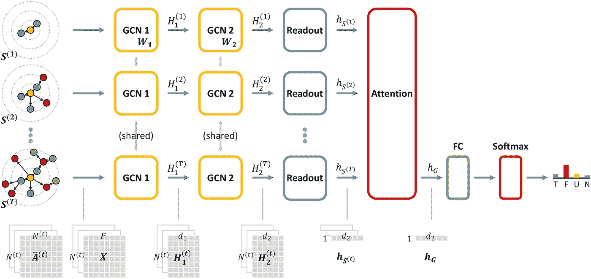

# 2023 年的时间图学习

> 原文：[`towardsdatascience.com/temporal-graph-learning-in-2023-d28d1640dbf2?source=collection_archive---------1-----------------------#2023-01-16`](https://towardsdatascience.com/temporal-graph-learning-in-2023-d28d1640dbf2?source=collection_archive---------1-----------------------#2023-01-16)

## 目前为止的故事

 [Shenyang(Andy) Huang](https://medium.com/@shenyanghuang1996?source=post_page-----d28d1640dbf2--------------------------------)

·

[关注](https://medium.com/m/signin?actionUrl=https%3A%2F%2Fmedium.com%2F_%2Fsubscribe%2Fuser%2F8aa224c5cedd&operation=register&redirect=https%3A%2F%2Ftowardsdatascience.com%2Ftemporal-graph-learning-in-2023-d28d1640dbf2&user=Shenyang%28Andy%29+Huang&userId=8aa224c5cedd&source=post_page-8aa224c5cedd----d28d1640dbf2---------------------post_header-----------) 发表在 [Towards Data Science](https://towardsdatascience.com/?source=post_page-----d28d1640dbf2--------------------------------) ·15 分钟阅读·2023 年 1 月 16 日

--

现实世界的网络，如社交网络、交通网络和引用网络，往往会随着时间演变，而**时间图学习（TGL）**领域旨在从这些不断演变的网络中提取、学习和预测。最近，TGL 在机器学习社区中受到越来越多的关注，相关论文数量激增，去年在 NeurIPS 2022 上举办了该领域的[首个研讨会](https://sites.google.com/view/tglworkshop2022/home)！

时间图中的演变。图片由作者提供。

*这篇文章由* [*Emanuele Rossi*](https://www.emanuelerossi.co.uk/), [*Michael Galkin*](https://migalkin.github.io/) *和* [*Kellin Pelrine*](https://scholar.google.com/citations?user=_s2HT_0AAAAJ&hl=en) *共同撰写。* *感谢* [*Farimah Poursafaei*](https://scholar.google.ca/citations?user=gZ7HEsMAAAAJ&hl=en) *提供的有益反馈。*

在这篇博客文章中，我们展示了 TGL 在 2022 年之前的主要进展，并讨论了有前景的未来方向。请注意，我们将“动态图”和“时序图”交替使用。如果你想学习或开始一个 TGL 项目，这篇文章将是一个很好的参考和起点。

请在评论区与我们分享您感兴趣的其他进展。

**目录：**

1.  时序图学习简介

1.  时序图网络的表达能力

1.  重新思考时序图中的评估

1.  时序知识图谱

1.  库和数据集

1.  利用时序图进行疾病建模

1.  时序图中的异常检测

1.  检测时序图中的虚假信息

1.  加入时序图学习社区

# 时序图学习简介

在本节中，我们简要介绍了文献中一些著名的 TGL 方法。学习连续时间动态图（CTDGs）的方法主要分为两类：时序图网络和游走聚合方法。有关 CTDGs 的详细信息，请参阅 [Kazemi 等](https://arxiv.org/pdf/1905.11485.pdf) 的这篇综述。

时序图网络 ([TGNs](https://arxiv.org/abs/2006.10637)) 将信息传递神经网络 ([MPNNs](https://dl.acm.org/doi/10.5555/3305381.3305512)) 推广到时序图。它们通过引入一个节点记忆来实现，该记忆表示节点在给定时间的状态，作为节点过去交互的压缩表示。每当两个节点参与交互时，它们会相互发送消息，这些消息然后用于更新它们的记忆。在计算节点嵌入时，会对节点的时序邻居进行额外的图聚合，使用该时刻的原始节点特征和记忆。以下是 TGN 计算的示意图。

对一批训练边缘的 TGN 计算。

图片来源：[Rossi 等](https://arxiv.org/abs/2006.10637)

TGN 是一个通用框架，它将以前的模型，如联合动态用户-项目嵌入 ([JODIE](https://snap.stanford.edu/jodie/)) 和时序图注意力 ([TGAT](https://openreview.net/forum?id=rJeW1yHYwH))，作为特例进行推广。有关 TGN 的更全面介绍，请参阅下面其中一位作者的博客文章。

 ## 时序图网络

### 一种用于动态图的新型神经网络架构。

[towardsdatascience.com

诸如 Causal Anonymous Walks ([CAW](http://snap.stanford.edu/caw/)) 这样的 Walk 聚合方法则依赖于（时间）随机游走。特别是，为了预测时间 *t* 上的一个链接 *(u, v)* 的存在，CAW 首先提取多个从 *u* 和 *v* 开始的随机游走，使得游走中的边的时间戳只能单调递减。这些游走首先通过用节点在游走中每个可能位置出现的次数向量替换每个节点标识符来进行匿名化。然后，使用 RNN 对每个游走进行编码，并通过自注意力或简单平均来聚合编码。

# 时间图网络的表达力。

关于在静态图上运行的图神经网络（GNNs）表达能力的研究已有大量工作。[Xu et al. 2019](https://openreview.net/pdf?id=ryGs6iA5Km) 首次通过将图神经网络（GNNs）与 Weisfeiler-Lehman (WL) 图同构测试关联起来，并展示了许多 GNNs 的能力不超过 1-WL 测试，从而描述了其区分能力。随后，出现了更具表达能力的模型，如 子图 GNNs，[图变换器](https://openreview.net/pdf?id=lMMaNf6oxKM%5C) 和 [高阶 GNNs](https://arxiv.org/pdf/1810.02244.pdf)，这些模型被设计得比 1-WL 测试更具表达力（下面是 [Michael Bronstein](https://michael-bronstein.medium.com/) 关于如何超越 WL 测试的精彩博客文章的链接）。

## Graph Neural Networks beyond Weisfeiler-Lehman and vanilla Message Passing

### 受物理启发的图上连续学习模型可以克服传统 GNNs 的局限性。

towardsdatascience.com

直到今年，关于 TGL 方法的表达力的研究仍然很少。第一个弥合这一差距的努力是由 [Ribeiro et al.](https://proceedings.mlr.press/v162/gao22e.html) 提出的，其关键思想是将现有的 TGL 方法分为 *时间-和-图* 和 *时间-然后-图* 框架。

将 TG 转换为时间-然后-图表示。

图片来源: [Ribeiro et al.](https://arxiv.org/abs/2103.07016)

1️）。在 *时间-和-图* 中，GNNs 用于在每个时间快照图上生成节点嵌入，从而形成节点嵌入的序列。

2️）。在 *时间-然后-图* 中，TG 中的每条边被转换为一个时间序列，该序列指示边存在的时间，从而将时间边折叠为静态图中的边特征。

已证明 *时间-然后-图* 表示可以从任何给定的 *时间-和-图* 表示中构建，从而证明 *时间-然后-图* 至少与 *时间-和-图* 一样具备表达力。通过在 *时间-然后-图* 中的静态表示，我们可以直接将静态图的 WL 测试表达框架应用于 TGL 方法。这样，只要使用 1-WL GNN 作为主干模型，*时间-然后-图* 就比 *时间-和-图* 更具表达力。

[Souza et al.](https://openreview.net/pdf?id=MwSXgQSxL5s) 也旨在为 TGL 方法建立 1-WL 表达框架。值得注意的是，他们将 CTDG 视为一系列时间戳多图，其中在给定时间 *t* 的多图 *G(t)* 是通过顺序应用所有早于 *t* 的事件来获得的。这里的多图意味着两个节点之间可以有多条边，而边的属性是时间戳信息。

现在，时间 WL 测试可以通过对从 CTDG 构建的多图应用 WL 测试来定义。因此，更具表达力的 TGN 方法必须在其时间邻域上是单射的（即将两个不同的多集节点哈希为不同的颜色），称为单射 MP-TGNs。[Souza et al.](https://openreview.net/pdf?id=MwSXgQSxL5s) 还分析了基于游走的 TGNs，如 [CAW](http://snap.stanford.edu/caw/)，并显示 MP-TGNs 和 CAW 之间并没有比彼此更具表达力（如上所示）。他们提出的 PINT 方法结合了这两类方法的优点，因此是最具表达力的。下面的示例显示了 MP-TGNs 无法区分的两个时间图。颜色表示节点标签，边的时间戳从 *t₁* 开始。

MP-TGNs 无法区分的时间图示例，例如直径、环长和循环数量。

图片来源：[Souza et al.](https://arxiv.org/abs/2209.15059)

# 重新思考时间图中的评估

在很大程度上，TGL 中的评估程序相对未被充分探索，并且受到静态图学习的重大影响。例如，对动态图上的链路预测任务（或动态链路预测）的评估通常涉及：1）。*固定的训练、测试拆分*，2）。*随机负边采样* 和 3）。*来自类似领域的小数据集*。这样的评估协议往往导致结果表中报告的指标已经达到 95% 以上，很难区分新模型是否带来了实际的好处，还是只是重新使用现有方法。

典型的时间链路预测结果表，报告了平均精度（AP）。即使基线模型也能达到 98%，我们真的在取得进展吗？

图片来源: [Souza 等](https://arxiv.org/abs/2209.15059)

[You 等](https://arxiv.org/abs/2208.07239) 讨论了当前 TGL 方法在离散时间动态图（DTDGs）中的模型设计、评估设置和训练策略的局限性。他们认为数据和模型的演变特性没有被考虑。在标准评估中，所有时间点按时间顺序划分为训练集、评估集和测试集。对于给定的数据集，这种划分是固定的。

他们指出，这种固定的划分意味着只有来自所选测试期的边会被评估，因此可能跨越训练、验证和测试期的长期行为将无法正确评估。此外，许多 TGL 方法在测试时是过时的，意味着模型表示在评估过程中没有得到更新。考虑一个示例交易图，如果前一天的信息可用，用户很可能希望利用这些信息来更新模型，以实现最佳性能。因此，提出了一种实时更新评估的方法，其中模型根据新观察到的数据进行微调，利用历史信息并预测未来的连接。

灰色/红色条分别表示 Wikipedia / MOOC 数据集中的重复/新颖边。时间图中的许多边随时间重复出现。

图片来源: [*Poursafaei 等*](https://arxiv.org/abs/2207.10128)

[近期工作](https://openreview.net/forum?id=1GVpwr2Tfdg)由两位作者研究了如何选择负边进行 CTDG 方法的评估，并引入了来自不同领域的更多数据集。在动态链接预测中，负边通常是从任意节点对中随机抽取的。然而，时间图中的许多边会随着时间的推移而重复（如上图所示）。考虑到现实世界图的稀疏性，大多数节点对不太可能形成边。因此，*随机* 负边可以被视为*容易*的负边。

TGL 方法的平均性能。使用更困难的负边显著影响模型性能。简单的基线 EdgeBank 的表现也出奇地好。

图片来源: [*Poursafaei 等*](https://arxiv.org/abs/2207.10128)

现在，什么可以被视为*困难*的负边？首先，我们介绍*历史*负边，即在训练集中出现但在当前测试步骤中缺失的边。我们还将*归纳*负边定义为在测试集中之前出现但在当前步骤中不存在的测试边。最后，我们提出了一个基线 EdgeBank，仅依靠记住过去的边（本质上是已见边的哈希表）。在上面的图中，我们看到，通过改变负边进行评估时，现有 TGL 方法在*历史*和*归纳*设置下的平均性能显著降低，与*标准*设置相比。EdgeBank 在*标准*设置下也是一个出乎意料的强大基线。有关详细信息，请参见下方作者之一的博客。

 [## 迈向更好的动态图链接预测

### 伴随博客文章，介绍了《迈向更好的动态链接预测》的评估，将在 NeurIPS 2022 数据集和…

medium.com](https://medium.com/@shenyanghuang1996/towards-better-link-prediction-in-dynamic-graphs-cdb8bb1e24e9?source=post_page-----d28d1640dbf2--------------------------------)

# 时间知识图谱

在知识图谱（KG）的领域中，时间设置与同质世界略有不同，即时间戳图快照并不常见。相反，一些（或所有）三元组具有一个（开始时间，结束时间）对属性，表示某个事实为真的时间范围。因此，三元组变成了*五元组*，或者在 Wikidata 中，时间属性成为 [*限定词*](https://www.wikidata.org/wiki/Help:Qualifiers) 的一部分，更一般的 [*声明*](https://www.wikidata.org/wiki/Help:Statements)（主三元组 + 多个键值限定词），声明形成所谓的 超关系 KGs*.*

例如，`(法国总统，职务持有者，尼古拉·萨科齐，2007，2012)` 是一个五元组，描述了尼古拉·萨科齐担任法国总统的时间段。或者，每个三元组也可以只有一个时间戳（形成四元组）。最常见的预测任务是给定时间属性评分头/尾预测，例如，`(法国总统，职务持有者，**???**，2007，2012)` —— 这可以被视为超关系链接预测的特例，其中限定词仅为日期时间文字。一个经典的时间 KG 补全模型是 [**TNTComplex**](https://arxiv.org/pdf/2004.04926.pdf)（ICLR 2020）。

[Krause et al.](https://arxiv.org/pdf/2207.09964.pdf) 已经迈出了弥合时间知识图谱与同质图之间差距的第一步。在这项工作中，作者提出了一个框架，以形式化知识图谱中的各种时间方面。即，他们将 **时间** 知识图谱定义为局部扩展，即边上具有时间戳的图，而 **动态** 知识图谱定义为全局扩展，即随着时间的推移通过添加或删除节点和边而改变拓扑的图。更进一步，这些基本类型的组合是存在的，例如，时间和动态知识图谱的组合被称为 **增量**。我们希望这项工作能为时间知识图谱的繁杂文献带来更多秩序和清晰度，社区也能遵循这个良好的分类法。下一步：为这些图类型最终确定一个适当的评估协议。

时间和动态知识图谱（及其组合）。

图片来源：[Krause et al.](https://arxiv.org/abs/2207.09964)

[Wang et al.](https://openreview.net/pdf?id=1LmgISIDZJ) 解决了在时间 + 动态图上进行少样本链接预测的任务，其中边具有时间戳**并且**新节点可能在后续时间步出现（*增量* *图*，如 Krause et al. 上述分类）。少样本场景使得任务更加具有挑战性——我们只能访问有限数量的训练和推理点（通常小于 5）来推理查询链接。在这里，作者提出了 **MetaTKGR**，这是一种基于元学习的方法，通过聚合一定 *delta t* 时间邻域内现有节点的特征来构建新节点的表示。时间戳之间的标量差异通过傅里叶变换进行向量化。

MetaTKGR 的组件。

图片来源：[Wang et al.](https://arxiv.org/abs/2210.08654)

# 库和数据集

过去几年中，缺乏大规模数据集和具有挑战性的任务一直阻碍着时间图学习领域的研究。幸运的是，来自不同领域的新数据集正在涌现。例如，[Poursafaei et al.](https://openreview.net/forum?id=1GVpwr2Tfdg) 引入了六个新的公开可用的 TG 数据集，涵盖了交通、政治、经济和接近领域。然而，该领域仍然缺乏一致的努力来将基准和评估标准化到高质量，就像 [OGB](https://ogb.stanford.edu/) 对静态图所做的那样。我们希望在 2023 年，我们能看到更多关注实际应用的标准化 TG 基准。

关于库，著名的一个是 [Pytorch Geometric Temporal](https://pytorch-geometric-temporal.readthedocs.io/en/latest/)，这是 [Pytorch Geometric](https://pytorch-geometric.readthedocs.io/en/latest/) 的时间图扩展。然而，Pytorch-Geometric Temporal 似乎只包含离散时间方法和数据集。一个包含连续时间方法的库将为社区带来很大价值。最近，[Zhou et al.](https://www.vldb.org/pvldb/vol15/p1572-zhou.pdf) 提出了 TGL，这是一个用于大规模离线时间图神经网络训练的统一框架。特别是在一台 4-GPU 机器上，TGL 可以在 1–10 小时内训练超过十亿条时间边的一轮。

我们列出了各种 TGL 库和数据集的链接如下。

+   通过 “[pip install dgb](https://complexdata.ml/docs/proj-tg/dgb/start)” 访问的 13 个处理过的 TG 数据集

+   [Pytorch Geometric Temporal](https://pytorch-geometric-temporal.readthedocs.io/en/latest/notes/installation.html)

+   [TGL library](https://github.com/amazon-science/tgl)

+   [Chartalist Dynamic Blockchain Transaction Network](https://github.com/cakcora/chartalist)

+   [Temporal knowledge graph forecasting benchmark](https://github.com/nec-research/TKG-Forecasting-Evaluation)

# 使用时间图进行疾病建模

在近期的 COVID-19 大流行中，流行病建模对理解疾病传播以及设计相应的干预策略至关重要。人际接触网络实际上是时间图。通过将接触图与经典的基于隔离的模型如 [SEIR](https://www.canada.ca/en/public-health/services/reports-publications/canada-communicable-disease-report-ccdr/monthly-issue/2020-46/issue-6-june-4-2020/predictive-modelling-covid-19-canada.html) 和 [SIR](http://networksciencebook.com/chapter/10#epidemic) 相结合，我们可以更准确地预测 COVID-19 感染曲线，并超越同质混合假设（所有个体之间的接触概率相等）。

[Chang et al.](https://www.nature.com/articles/s41586-020-2923-3) 从手机数据中推导出了时间移动网络，并将 9800 万人的小时移动从人口普查区块组（CBGs）映射到美国的特定兴趣点（POIs）。通过将小时接触网络与 CBG 层面的 SEIR 模型结合，他们能够准确拟合实际感染轨迹。特别是，模型显示一些‘超级传播者’POIs 如餐馆和健身中心占据了大多数感染。此外，不同种族和社会经济群体之间的流动差异导致这些群体之间的感染率不同。这项工作展示了利用大规模时间图进行疾病预测和制定干预策略的现实潜力。

除了人际接触网络，动态交通网络在 COVID-19 的传播中也扮演着重要角色。在[一项研究](https://appliednetsci.springeropen.com/articles/10.1007/s41109-021-00378-3)中，我们将每日航班网络纳入 SEIR 模型，以估计输入的 COVID-19 病例。通过纳入航班网络，可以实现对疫情爆发的早期检测并预测旅行限制的影响。更多细节请见作者的[博客文章](https://mila.quebec/en/article/flight-seir-incorporating-flight-data-to-improve-epidemiological-modelling-and-disease-outbreak-prevention/)。

尽管基于时间图的疾病模型在实践中取得了成功，但回答诸如“*接触网络结构如何影响疾病传播？*”和“*如何修改接触模式以减缓或阻止 COVID-19 的传播？*”等问题也很重要。[Holme 等](https://journals.aps.org/pre/abstract/10.1103/PhysRevE.94.022305)比较了在八个网络数据集中使用时间、静态和完全连接网络的爆发特征差异，并研究了不同网络结构对疾病传播的影响。他们展示了将时间网络转换为静态网络可能导致对疾病爆发规模和消失时间的严重低估或高估。

TGL 在流行病建模方面的下一步是什么？

首先，预测整个接触或流动网络的快照以应对短期挑战是一个关键问题。通过预测的结构，我们可以应用基于网络的 SEIR 模型来估计感染曲线。

其次，定义和理解互动模式对接触网络的影响对于政策制定和可解释性至关重要。分析图结构与感染曲线之间的相互作用可以帮助我们确定最有效的干预策略。

# 时间图中的异常检测

异常检测是分析时间图中的一个基本任务，它识别出与其他实体显著偏离的实体。例如，欺诈检测可以被建模为在交易网络中检测异常边缘，而交通事故识别可以被视为在交通网络中检测异常事件。

对于利用时间图网络的表示能力进行异常检测的兴趣日益增长。[蔡等人](https://arxiv.org/abs/2005.07427)设计了一个端到端结构化时间图神经网络模型，用于检测异常边，称为**StrGNN**。首先基于感兴趣的边提取一个包围子图，一个以该边为中心的 k-hop 子图，以减少计算复杂性。然后使用图卷积神经网络([GCN](https://openreview.net/forum?id=SJU4ayYgl))从子图中生成结构嵌入。接着使用门控递归单元([GRUs](https://aclanthology.org/D14-1179/))来捕捉时间信息。异常检测的挑战之一是缺乏标记样本。因此，[蔡等人](https://arxiv.org/abs/2005.07427)提出通过替换正常边中的一个节点来生成“上下文相关”的负边，并用这些负边来训练模型。

与无监督的、非 GNN 基础的异常检测方法，如[**SEDANSPOT**](https://dhivyaeswaran.github.io/papers/icdm18-sedanspot.pdf)和[**AnomRank**](https://www.cs.cmu.edu/~christos/PUBLICATIONS/kdd20-ANRank.pdf)相比，GNN 基础的方法可以轻松地结合任何给定的属性，并具有实现更强性能的潜力。然而，GNN 基础的方法面临两个重大挑战。

1). 首先，如何扩展到具有数百万条边和节点的动态图？这是一个开放性问题，既涉及到 GNN 模块在提取图特征时的挑战，也涉及到处理长期信息的时间模块，如 GRUs 和 transformers。

2️). 其次，如何为检测到的异常提供准确的解释？在实际应用中，检测到的异常通常会被验证，然后可能对这些检测到的实体采取惩罚措施。GNN 在动态图上的可解释性仍然是一个未解决的挑战。

LAD 检测到 2013 年是加拿大 MP 投票网络中的一个变化点，原因是政治党派之间的边的数量异常。

图片来源：[黄等人](https://arxiv.org/abs/2007.01229)

*变化点检测*任务旨在检测动态图中时间点的变化，其中图结构或分布显著偏离之前观察到的状态。这种变化可能归因于外部事件（如交通中断和 COVID-19 相关的航班限制），或仅仅是动态图的自然演变。作者之一的[近期工作](https://arxiv.org/abs/2007.01229)利用了每个图快照的拉普拉斯矩阵的特征值来嵌入图结构，同时应用滑动窗口来比较图结构在长短期内的变化。在上述内容中，提出的拉普拉斯异常检测 (**LAD**) 方法检测到了由于政治党派之间边缘增加而导致的加拿大国会议员（MP）投票网络中的变化。这与贾斯廷·特鲁多在 2013 年被选为自由党领导人的事件相吻合。

# 在时间图上检测虚假信息

**虚假信息**的传播模式和速度与真实信息不同 ([Vosoughi 等](https://www.science.org/doi/10.1126/science.aap9559))。已有大量研究在静态图中研究这些网络模式，而动态图方法尚未得到充分探索 ([Song 等](https://www.sciencedirect.com/science/article/abs/pii/S0306457321001965))。然而，在过去的一年里，使用 TGL 方法进行虚假信息检测和理解的数量有所增加。例如，[Zhang 等](https://link.springer.com/chapter/10.1007/978-3-030-72240-1_48) 开发了一种基于时间点过程的方法，而动态 GCN ([**DynGCN**](https://journals.plos.org/plosone/article?id=10.1371%2Fjournal.pone.0256039)) 和 [**DGNF**](https://www.sciencedirect.com/science/article/pii/S0925231222009158) 是基于动态 GNN 的方法。

下图展示了 DynGCN 的架构。他们以均匀时间间隔构建图快照，通过 GCN 层处理每个快照，然后结合这些表示并使用注意力机制学习快照的演变模式。这是一种相对简单的方法，比起上述一些方法如 [TGN](https://arxiv.org/abs/2006.10637) 或 [CAW](http://snap.stanford.edu/caw/)，它利用时间信息的方式更为简单，但在作者检查的数据集上，比之前的最先进技术在虚假信息检测方面表现更好。

DynGCN 使用具有共享权重的 GCN 层处理单个图快照，然后通过注意力机制结合这些表示以获取时间上的演变。

图片来源: [Choi 等](https://journals.plos.org/plosone/article?id=10.1371%2Fjournal.pone.0256039)

动态交互模式在虚假信息检测中被证明非常有用（[Plepi 等](https://aclanthology.org/2022.textgraphs-1.10/)）。随着 TGL 方法的显著进展，我们可以期待结合动态图的新型最先进的虚假信息检测方法。

# 加入时间图学习社区

2022 年，机器学习社区对时间图学习（TGL）的关注有所增加。首届[TGL 研讨会](https://sites.google.com/view/tglworkshop2022/home)于 NeurIPS 2022 上举办。会议的演讲和讨论会录像将很快在[NeurIPS 虚拟网站](https://neurips.cc/virtual/2022/workshop/49999)上提供。接受的论文可以在[研讨会网站](https://sites.google.com/view/tglworkshop2022/home)上找到。请关注 TGL 研讨会的新版本公告，并加入研讨会 Slack（网站上有最新链接）以便与社区互动。今年，我们还计划组织一个 TGL 阅读小组，如果你希望分享你的工作或参与组织阅读小组，请发送邮件至 shenyang.huang@mail.mcgill.ca。

图片来源：[NeurIPS 2022 时间图学习研讨会](https://sites.google.com/view/tglworkshop2022/home)的 logo。图片由作者提供。
