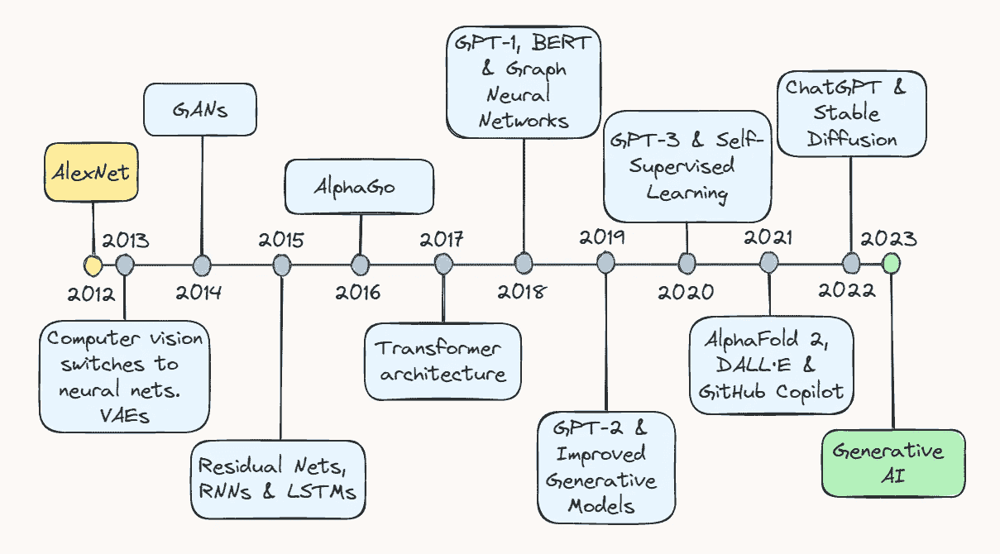

# 十年的 AI 回顾

> 原文：[`towardsdatascience.com/ten-years-of-ai-in-review-85decdb2a540?source=collection_archive---------0-----------------------#2023-05-23`](https://towardsdatascience.com/ten-years-of-ai-in-review-85decdb2a540?source=collection_archive---------0-----------------------#2023-05-23)

## 从图像分类到聊天机器人疗法

 [托马斯·A·多弗](https://thomasdorfer.medium.com/?source=post_page-----85decdb2a540--------------------------------)

·

[关注](https://medium.com/m/signin?actionUrl=https%3A%2F%2Fmedium.com%2F_%2Fsubscribe%2Fuser%2F7c54f9b62b90&operation=register&redirect=https%3A%2F%2Ftowardsdatascience.com%2Ften-years-of-ai-in-review-85decdb2a540&user=Thomas+A+Dorfer&userId=7c54f9b62b90&source=post_page-7c54f9b62b90----85decdb2a540---------------------post_header-----------) 发表在 [Towards Data Science](https://towardsdatascience.com/?source=post_page-----85decdb2a540--------------------------------) ·15 min read·2023 年 5 月 23 日

--

作者提供的图片。

过去十年对于人工智能（AI）领域而言，是一段激动人心且充满事件的旅程。对深度学习潜力的初步探索，已经转变为一个爆炸性增长的领域，这个领域如今涵盖了从电商中的推荐系统到自动驾驶汽车的目标检测，以及可以生成从逼真图像到连贯文本的生成模型。

在本文中，我们将回顾一些关键的突破，这些突破让我们走到了今天。无论你是经验丰富的 AI 从业者，还是对该领域的最新进展感兴趣，这篇文章将为你提供一个全面的概述，展示了 AI 如何成为家喻户晓的名字。

## 2013 年：AlexNet 和变分自编码器

2013 年被广泛认为是深度学习的“成长期”，这一期望是由计算机视觉领域的重大进展所引发的。根据最近对 Geoffrey Hinton 的[采访](https://venturebeat.com/ai/10-years-on-ai-pioneers-hinton-lecun-li-say-deep-learning-revolution-will-continue/)，到 2013 年*“几乎所有的计算机视觉研究都转向了神经网络”*。这一繁荣主要是由一年前在图像识别领域的一个相当令人惊讶的突破所推动的。
