# 张量量化：未被讲述的故事

> 原文：[`towardsdatascience.com/tensor-quantization-the-untold-story-d798c30e7646?source=collection_archive---------2-----------------------#2023-09-08`](https://towardsdatascience.com/tensor-quantization-the-untold-story-d798c30e7646?source=collection_archive---------2-----------------------#2023-09-08)

## 详细了解机器学习框架中量化的实现细节

 [Dhruv Matani](https://medium.com/@dhruvbird?source=post_page-----d798c30e7646--------------------------------)

·

[关注](https://medium.com/m/signin?actionUrl=https%3A%2F%2Fmedium.com%2F_%2Fsubscribe%2Fuser%2F63f5d5495279&operation=register&redirect=https%3A%2F%2Ftowardsdatascience.com%2Ftensor-quantization-the-untold-story-d798c30e7646&user=Dhruv+Matani&userId=63f5d5495279&source=post_page-63f5d5495279----d798c30e7646---------------------post_header-----------) 发表在 [Towards Data Science](https://towardsdatascience.com/?source=post_page-----d798c30e7646--------------------------------) ·8 分钟阅读·2023 年 9 月 8 日

--

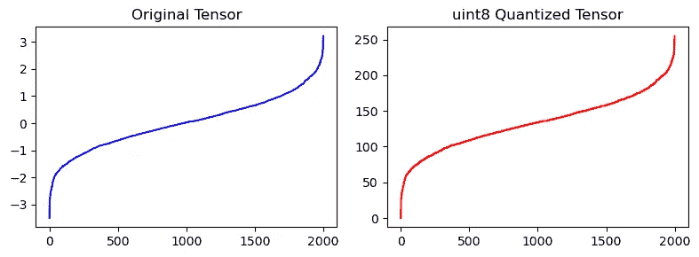

与 [Naresh Singh](https://medium.com/@brocolishbroxoli) 合著。

# 目录

+   介绍

+   量化中的尺度和零点这两个术语是什么意思？

+   量化方案的类型

+   量化尺度和零点示例

+   量化与激活归一化

+   结论

+   参考文献

# 介绍

在本文的剩余部分，我们将尝试通过具体示例回答以下问题。

1.  量化中的尺度和零点这两个术语是什么意思？

1.  不同的量化方案有哪些类型？

1.  如何计算不同量化方案的尺度和零点

1.  为什么零点对于量化很重要？

1.  归一化技术如何有利于量化

# 量化中的尺度和零点是什么意思？

**尺度：** 在量化浮点范围时，通常会将浮点范围[Fmin..Fmax]表示为量化范围[Qmin..Qmax]。在这种情况下，尺度是浮点范围和量化范围的比率。

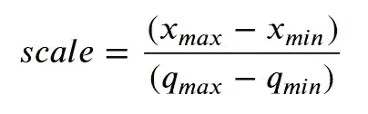

我们稍后将看到如何计算它的示例。

**零点：** 量化的零点是量化范围中浮点 0.0 的表示。具体来说，零点是一个量化值，它代表浮点值 0.0，满足所有实际用途。稍后我们将通过示例看到它是如何计算的，以及这种表示对我们为何具有实际意义。

接下来，让我们查看实际中使用的主要量化方案，并熟悉它们的相似之处和不同之处。

# 量化方案类型

在考虑用于模型压缩的量化类型时，有两种主要类型可以选择。

1.  **对称量化：** 在这种情况下，零点是零 —— 即浮点范围的 0.0 与量化范围中的 0 相同。通常，这种方法在运行时计算更高效，但如果浮点范围在浮点 0.0 周围不均匀分布，可能会导致较低的准确度。

1.  **仿射（或非对称）量化：** 这是具有非零值零点的量化方法。

但在深入细节之前，让我们尝试定义一下零点是什么意思。

# 量化尺度和零点示例

让我们从一个非常简单的例子开始，并逐步构建起来。

## 示例-1：对称 uint8 量化

假设我们希望将浮点范围[0.0 .. 1000.0]映射到量化范围[0 .. 255]。范围[0 .. 255]是一组可以适合无符号 8 位整数的值。

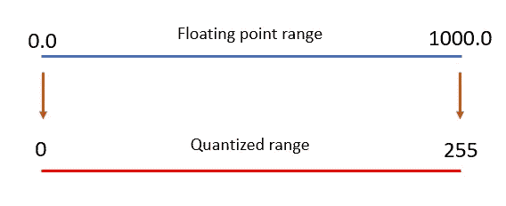

为了进行这种转换，我们希望重新调整浮点范围，使得以下条件成立：

浮点 0.0 = 量化 0

浮点 1000.0 = 量化 255

这被称为对称量化，因为浮点 0.0 被量化为 0。

因此，我们定义一个尺度，其等于

其中，

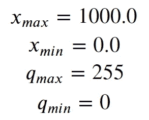

在这种情况下，尺度= 3.9215

要将浮点值转换为量化值，我们可以简单地将浮点值除以尺度。例如，浮点值 500.0 对应于量化值

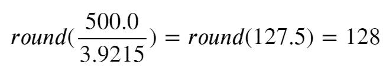

在这个简单的例子中，浮点范围的 0.0 恰好映射到量化范围中的 0。这被称为对称量化。让我们看看当情况不是这样时会发生什么。

## 示例-2：仿射 uint8 量化

假设我们希望将浮点范围[-20.0 .. 1000.0]映射到量化范围[0 .. 255]。

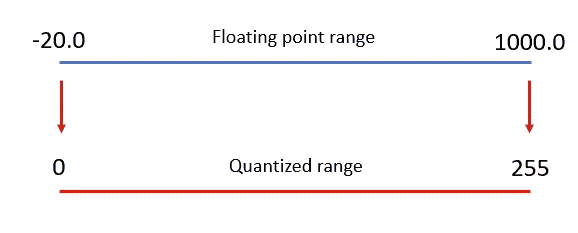

在这种情况下，由于我们的*xmin*不同，所以我们有一个不同的缩放因子。

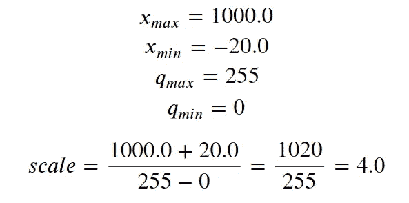

如果我们将缩放因子应用于 0.0，看看浮点数 0.0 在量化范围中是如何表示的

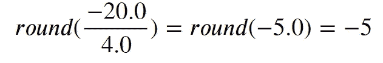

好吧，这似乎不太对，因为根据上面的图示，我们本来预期浮点值-20.0 映射到量化值 0。

这就是零点概念的所在。**零点作为偏差，用于移动缩放后的浮点值，并对应于表示浮点值 0.0 的量化范围中的值。** 在我们的案例中，零点是-20.0 的缩放浮点表示的负值，即-(-5) = 5。零点总是最小浮点值表示的负值，因为最小值总是负数或零。我们将在解释示例 4 的部分进一步了解为什么会这样。

每当我们量化一个值时，我们总是会将零点加到这个缩放值上，以获得有效量化范围中的实际量化值。如果我们希望量化值-20.0，我们将其计算为-20.0 的缩放值加上零点，即-5 + 5 = 0。因此，量化(-20.0, scale=4, zp=5) = 0。

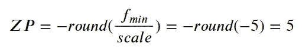

## 示例-3：仿射 int8 量化

如果我们的量化范围是带符号的 8 位整数而不是无符号的 8 位整数会发生什么？好吧，范围现在是[-128 .. 127]。

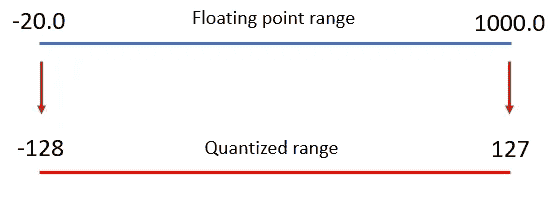

在这种情况下，浮点范围中的-20.0 映射到量化范围中的-128，而浮点范围中的 1000.0 映射到量化范围中的 127。

我们计算零点的方法是将量化范围视为[0 .. 255]，然后偏移-128，因此新范围中的零点是

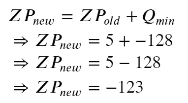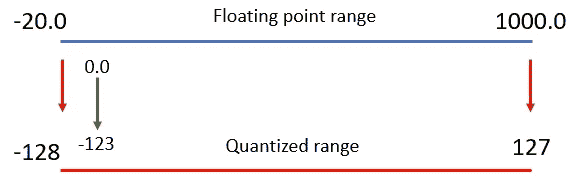

因此，新范围的零点是-123。

到目前为止，我们查看了浮点范围包括值 0.0 的示例。在下一组示例中，我们将查看当浮点范围不包括值 0.0 时会发生什么。

## 0.0 的重要性

为什么在浮点范围中表示浮点值 0.0 很重要？

当使用填充卷积时，我们期望边缘像素在最常见的情况下使用值 0.0 进行填充。因此，0.0 在浮点范围内的表示是很重要的。同样，如果值 X 将在网络中用于填充，你需要确保值 X 在浮点范围内被表示，并且量化是意识到这一点的。

## 示例-4：未讲述的故事 — 歪斜的浮点范围

现在，让我们来看一下如果 0.0 不在浮点范围内会发生什么。

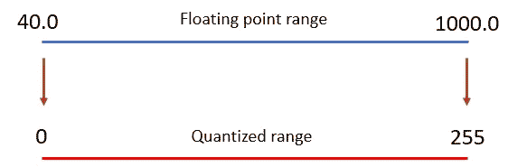

在这个示例中，我们试图将浮点范围[40.0 .. 1000.0]量化到量化范围[0 .. 255]。

由于我们无法在浮点范围内表示值 0.0，我们需要将范围的下限扩展到 0.0。

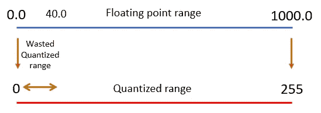

我们可以看到量化范围的某些部分被浪费了。为了确定浪费了多少，让我们计算浮点值 40.0 映射到的量化值。

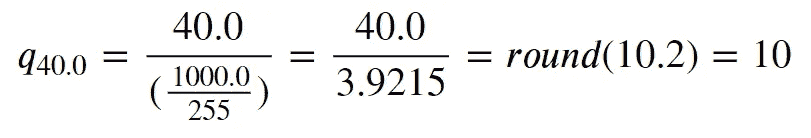

因此，我们在量化范围[0 .. 9]中浪费了约 3.92%的范围。这可能会显著影响量化后模型的准确性。

如果我们希望确保浮点范围内的值 0.0 可以在量化范围内表示，那么这种歪斜是必要的。

将值 0.0 包含在浮点范围中的另一个原因是有效地比较量化值以检查其是否在浮点范围内的 0.0 非常有价值。想想像 ReLU 这样的运算符，它将浮点范围内所有小于 0.0 的值剪裁为 0.0。

对我们来说，**使用与量化值相同的数据类型（有符号或无符号的 int8）** **表示零点是很重要的**。这使得我们可以快速而有效地进行这些比较。

接下来，让我们看看激活归一化如何帮助模型量化。我们将特别关注激活值的标准化如何使我们有效地使用整个量化范围。

# 量化与激活归一化

批量/层归一化将激活张量的均值调整为零，方差调整为单位，无论是按通道还是按层。

假设我们有一个浮点范围为[2000.0 .. 4000.0]的输入张量。这就是量化范围的样子。

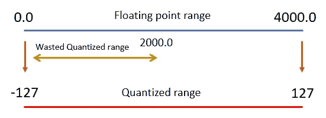

我们观察到量化范围[-127 .. -1]的一半没有使用。这是一个问题，因为我们只使用了可用的 8 位中的 7 位来量化整个浮点范围。这无疑会导致更高的量化误差和降低模型的准确性。为了解决这个问题，让我们对激活张量应用层归一化。

在对激活张量应用层归一化后，激活张量将具有[-2.0 .. 2.0]的浮点范围。这可以表示为带符号的 int8 范围[-128 .. 127]。为了确保分布的对称性，我们将量化范围限制为[-127 .. 127]。

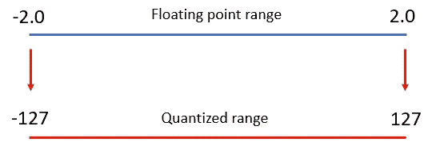

因此，归一化可以避免量化范围中的空洞或未使用的部分。

# 结论

我们了解了什么是仿射（非对称）量化和对称量化，它们的区别是什么。我们还学习了什么是尺度和零点，以及如何为这两种量化方案计算它们。

接下来，我们看到需要在浮点范围中包括浮点 0.0，并了解为什么以及如何在实践中做到这一点。这导致了一个缺点，即在量化范围内浪费了空间。

最后，我们看到了归一化如何通过将激活值带入固定范围并避免在量化范围内浪费空间来帮助量化。事实上，基于 0 均值的归一化可以帮助将仿射量化转换为对称量化，这可以在推理过程中加快速度。

本文中的所有图片均由作者创建。

# 参考文献

1.  [高效深度学习书籍，第二章：压缩技术简介](https://github.com/EfficientDL/book/raw/main/book/%5BEDL%5D%20Chapter%202%20-%20Compression%20Techniques.pdf)

1.  [Hugging Face：量化](https://huggingface.co/docs/optimum/concept_guides/quantization)

1.  [TensorRT：量化](https://docs.nvidia.com/deeplearning/tensorrt/tensorflow-quantization-toolkit/docs/docs/intro_to_quantization.html)

1.  [神经网络蒸馏：量化](https://intellabs.github.io/distiller/algo_quantization.html)

1.  [雷毛：量化](https://leimao.github.io/article/Neural-Networks-Quantization/)

1.  [量化浮点数](https://zeux.io/2010/12/14/quantizing-floats/)
