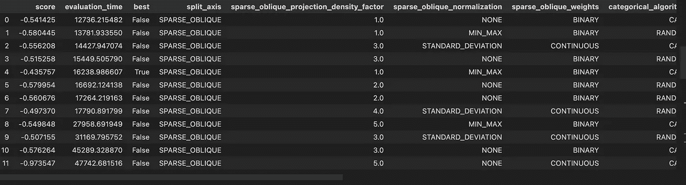
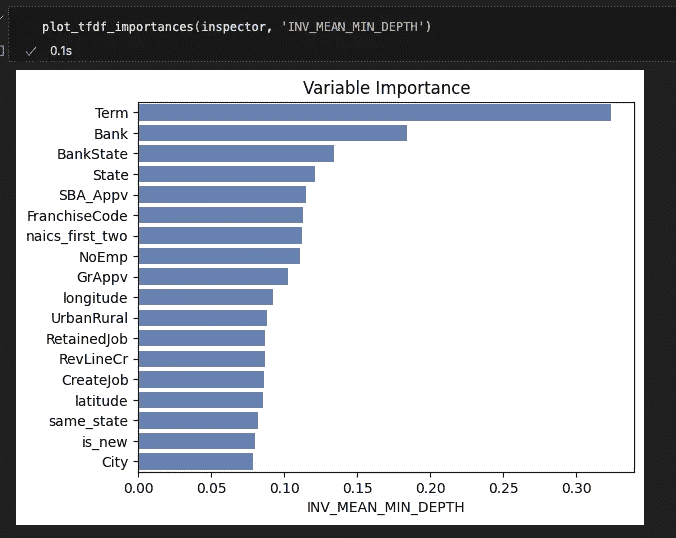
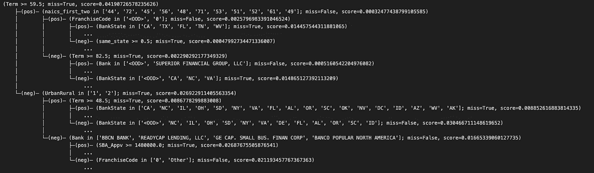
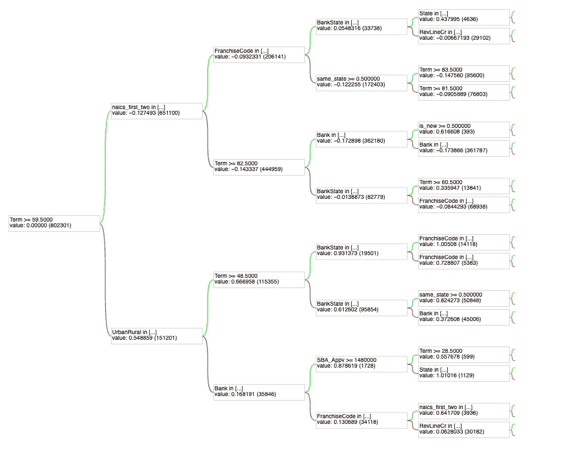

# TensorFlow Decision Forests：全面介绍

> 原文：[`towardsdatascience.com/tensorflow-decision-forests-a-comprehensive-introduction-3b6056a6d6b0`](https://towardsdatascience.com/tensorflow-decision-forests-a-comprehensive-introduction-3b6056a6d6b0)

## 使用 TensorFlow 训练、调整、评估、解释和服务基于树的模型

[](https://medium.com/@antonsruberts?source=post_page-----3b6056a6d6b0--------------------------------)[](https://towardsdatascience.com/?source=post_page-----3b6056a6d6b0--------------------------------) [Antons Tocilins-Ruberts](https://medium.com/@antonsruberts?source=post_page-----3b6056a6d6b0--------------------------------)

·发表于[Towards Data Science](https://towardsdatascience.com/?source=post_page-----3b6056a6d6b0--------------------------------) ·阅读时长 11 分钟·2023 年 4 月 14 日

--


图片由[Javier Allegue Barros](https://unsplash.com/pt-br/@soymeraki?utm_source=medium&utm_medium=referral)提供，来源于[Unsplash](https://unsplash.com/?utm_source=medium&utm_medium=referral)

# 介绍

两年前，TensorFlow (TF) 团队开源了一个用于训练基于树的模型的库，[TensorFlow Decision Forests (TFDF)](https://github-com.translate.goog/tensorflow/decision-forests?_x_tr_sl=en&_x_tr_tl=ru&_x_tr_hl=ru&_x_tr_pto=sc)。就在上个月，他们终于[宣布](https://blog.tensorflow.org/2023/02/updates-tensorflow-decision-forests-is-production-ready.html)该软件包已准备好投入生产，因此我决定更深入地了解一下。本文的目的是让你对这个软件包有更好的了解，并展示如何（有效地）使用它。下面你可以看到本文的结构，随意跳过你最感兴趣的部分。

1.  什么是 TFDF 以及为什么使用它？

1.  使用 TFDF 训练随机森林（RF）和梯度提升树（GBT）模型

1.  使用 TFDF 和 Optuna 进行超参数调整

1.  模型检查

1.  使用 TF Serving 服务 GBT 模型

# 设置

你可以在我的[仓库](https://github.com/aruberts/tutorials/tree/main/tfdf/notebooks)中找到所有代码，如果还没有，请务必给它加个星。在这篇文章中，我们将使用[美国小企业管理局数据集](https://www.kaggle.com/datasets/mirbektoktogaraev/should-this-loan-be-approved-or-denied)（CC BY-SA 4.0 许可）来训练几个贷款违约预测模型。模型将使用已经预处理的数据进行训练，但你可以在仓库中找到一个[笔记本](https://github.com/aruberts/tutorials/blob/main/tfdf/notebooks/data_preprocessing.ipynb)，描述了处理和特征工程步骤。如果你想直接复制我的代码，请确保遵循这些步骤。或者，使用这些代码作为起点，并根据你的数据集进行调整（这是我推荐的方法）。

安装 TensorFlow Decision Forests 非常简单，只需运行`pip install tensorflow_decision_forests`，通常这就可以了。虽然有一些在 M1 和 M2 Mac 上报告的[问题](https://github.com/tensorflow/decision-forests/issues/152)，但我个人在最新版本的 TFDF 上没有遇到问题。

# TensorFlow Decision Forest

## 什么是 TFDF？

TensorFlow Decision Forest 实际上是基于 Google 开发的 C++库 Yggdrasil Decision Forests。原始 C++算法旨在构建可扩展的决策树模型，以处理大数据集和高维特征空间。通过将这个库整合到更广泛的 TF 生态系统中，用户现在可以轻松地构建可扩展的 RF 和 GBT 模型，而无需学习另一种语言。

## 为什么使用它？

这个库相对于例如 XGBoost 或 LightGBM 的主要优势在于它与其他 TF 生态系统组件的紧密集成。对于已经在管道中使用其他 TensorFlow 模型或使用 TFX 的团队，它可能特别有趣。TFDF 可以很容易地与例如 NLP 模型集成，使多模态管道更加简单。此外，如果你使用 TF Serving 来服务模型，你也可能会考虑这个库，因为它原生支持（无需 ONNX 或其他跨包序列化方法）。最后，这个库提供了大量参数，你可以调整以接近 XGBoost、LightGBM 和许多其他梯度提升机（GBM）方法的模型。这意味着你在训练过程中无需在不同的 GBM 库之间切换，这对于代码维护来说是非常有利的。

# 模型训练

确保拉取[这个笔记本](https://github.com/aruberts/tutorials/blob/main/tfdf/notebooks/model_training.ipynb)，并按照下面的步骤操作，因为你在这里只能看到部分代码。

## 数据

正如设置部分所述，我将使用这个数据集的预处理版本。为了准备 TFDF，我们首先需要像往常一样用 pandas 读取数据，并决定哪些列将作为分类变量，哪些作为数值变量。

## 特征使用情况

为了确保项目结构良好并避免意外行为，通常建议为每个特征指定一个`FeatureUsage`，虽然这不是强制性的。幸运的是，这是一项简单的任务：你只需决定将每个特征分配给六种支持类型中的一种——`BOOLEAN`、`CATEGORICAL`、`CATEGORICAL_SET`、`DISCRETIZED_NUMERICAL`、`HASH`和`NUMERICAL`。其中一些类型还有额外的参数，因此确保了解更多信息 [这里](https://www.tensorflow.org/decision_forests/api_docs/python/tfdf/keras/FeatureSemantic)。

在这个示例中，我们将保持简单，只使用数值型和类别型数据类型，但不要犹豫尝试其他选项，特别是`DISCRETIZED_NUMERICAL`，因为它们可以显著加快训练过程（类似于 LightGBM）。正如下方所示，你需要将所选的数据类型提供给`semantic`参数，对于类别特征，我们还需要指定`min_vocab_frequency`参数以去除稀有值。

## 使用 TF 数据集读取数据

读取数据集的最简单方法是使用 TF 数据集。TFDF 提供了一个非常好的实用函数`pd_dataframe_to_tf_dataset`，使这一过程变得非常简单。

在上面的代码中，我们将 DataFrame 对象传递给函数，并提供以下参数：

+   标签列的名称

+   权重列的名称（在此情况下为 None）

+   批量大小（有助于加快数据读取速度）

生成的数据集已按照 TF 数据集的正确格式（批处理和预取）进行准备，可以用于训练/评估。当然，你也可以创建自己的读取数据集的方法，但必须特别注意输出格式。

## TFDF 默认参数

如果你按照所有先前的数据准备说明进行操作，训练模型非常简单。

从上面的代码可以看出，只需几行代码即可使用默认参数构建和训练 GBT 和 RF 模型。你只需指定所使用的特征、训练和验证数据集，然后就可以开始了。在使用 ROC 和 PR AUC 评估这两个模型时，我们可以看到其性能已经相当不错。

```py
# GBT with Default Parameters
PR AUC: 0.8367
ROC AUC: 0.9583

# RF with Default Parameters
PR AUC: 0.8102
ROC AUC: 0.9453
```

让我们看看这些结果是否可以通过超参数调整进一步改善。为了简化，我将专注于优化 GBT 模型，但这些方法也可以很容易地应用于 RF 模型。

# 超参数调整

有许多参数需要调整，每一个的详细解释可以在官方 Yggdrasil [文档](https://ydf.readthedocs.io/en/latest/hyper_parameters.html)中找到。TFDF 为你提供了一些内置的参数调整选项，但你也可以使用更标准的库，如[Optuna](https://github.com/optuna/optuna)或[Hyperpot](https://github.com/hyperopt/hyperopt)。以下是按从最少参与到最多参与的方式排列的方法列表。

1.  超参数模板

1.  使用预定义空间的超参数搜索

1.  使用自定义空间的超参数搜索

## 超参数模板

TFDF 提供了一个非常酷的功能，就是超参数模板的可用性。这些是[论文](https://arxiv.org/abs/2212.02934)中显示在各种数据集上表现最好的参数。两个可用的模板是——`better_default`和`benchmark_rank1`。如果你时间紧迫或对机器学习不太熟悉，这可能是一个不错的选择。指定这些参数只需一行代码。

从结果来看，我们可以看到使用`better_default`参数在 ROC 和 PR AUC 上都有了轻微的提升。而`benchmark_rank1`参数则表现较差。这就是为什么在部署模型之前正确评估结果模型很重要的原因。

```py
GBT with 'Better Default' Parameters
PR AUC: 0.8483
ROC AUC: 0.9593

GBT with 'Benchmark Rank 1' Parameters
PR AUC: 0.7869
ROC AUC: 0.9442
```

## 预定义搜索空间

TFDF 附带了一个名为`RandomSearch`的实用工具，它在许多可用参数之间执行随机网格搜索（类似于`sklearn`）。有一个选项可以手动指定这些参数（参见[示例](https://www.tensorflow.org/decision_forests/tutorials/automatic_tuning_colab#training_a_model_with_automated_hyper-parameter_tuning_and_manual_definition_of_the_hyper-parameters)），但也可以使用预定义的搜索空间。再次说明，如果你对机器学习不太熟悉，这可能是一个不错的选择，因为它不需要你手动设置这些参数。

> 警告：这个搜索花了我很长时间，因此我不得不在 12 次迭代后停止。一些被测试的参数（例如斜切分裂）需要较长时间来拟合。

你可以使用以下命令访问所有尝试过的组合。

```py
tuning_logs = tuned_model.make_inspector().tuning_logs()
```



超参数表。截图由作者提供。

在 12 次迭代后，最佳模型的表现稍逊于基线，因此使用这种调优方法时要谨慎。你可以尝试更改搜索空间，但此时你不妨使用另一个库。

```py
PR AUC: 0.8216
ROC AUC: 0.9418
```

## 自定义搜索空间（带自定义损失）

使用`RandomSearch`方法有一些显著的缺点：

+   仅提供随机网格搜索算法

+   没有选项可以定义你自己的损失函数进行优化

+   如果不使用`use_predefined_hps`标志，则需要提供完整的参数网格

由于这些原因，我强烈建议如果你有足够的知识来自己设置合理的搜索空间，最好使用外部优化库。下面你可以看到如何使用`optuna`进行调优。

这些参数中的大多数对于 GBT 来说都是相当标准的，但也有一些值得注意的参数。首先，我们可以将 `growing_strategy` 更改为 `BEST_FIRST_GLOBAL`（即叶子优先生长），这是 LightGBM 使用的策略。其次，我们可以使用 `BINARY_FOCAL_LOSS`，这种方法对于不平衡数据集表现更佳 ([source](https://paperswithcode.com/method/focal-loss))。第三，可以选择将 `split_axis` 参数更改为使用稀疏斜切分，这在 [这篇论文](https://arxiv.org/abs/1506.03410) 中显示效果相当好。最后，还可以使用 `honest` 参数构建 “[诚实树](https://arxiv.org/abs/1610.01271)”。

下面是使用最佳参数取得的结果。正如你所见，自定义搜索空间的调优迄今为止取得了最佳结果。

```py
GBT with Custom Tuned Parameters
PR AUC: 0.8666
ROC AUC: 0.9631
```

现在我们已经确定了超参数，让我们重新训练模型并继续进行检查。

# 模型检查

TFDF 提供了一个名为 `Inspector` 的实用工具来检查训练后的模型。这个对象有 3 个主要的用途，下面我将进行详细探讨：

1.  检查模型的属性，例如类型、树的数量或使用的特征

1.  获取特征重要性

1.  提取树结构

## 检查模型属性

inspector 类存储了各种属性，如果例如你加载了其他人的模型或有一段时间没有使用它，你可能想要探索这些属性。你可以打印出模型类型（GBT 或 RF）、模型的树的数量、训练目标以及用于训练模型的特征。检查树的数量特别有用，因为如果早期停止已触发，这个参数会比你设置的值小。

另一种选择是简单地运行 `manual_tuned.summary()` 以更详细地检查模型。

## 特征重要性

就像所有其他库一样，TFDF 提供了内置的特征重要性评分。对于 GBT，你可以访问 `NUM_NODES`、`SUM_SCORE`、`INV_MEAN_MIN_DEPTH`、`NUM_AS_ROOT` 方法进行解释。请注意，你还可以在训练过程中将 `compute_permutation_variable_importance` 参数设置为 `True`，这将添加一些额外的方法。缺点是模型训练时间会显著增加，因此请谨慎使用（最好是在数据样本上）。



重要性条形图。截图由作者提供。

对于我构建的模型，Term 变量一直被认为是最重要的特征，类别变量如 Bank、State 和 Bank State 紧随其后。我认为 TFDF 库最大的缺点之一是无法与 SHAP 配合使用。希望未来的版本能提供支持。

## 检查单独的树

有时我们需要查看单独的树，以便于解释性或模型验证。 TFDF 在 inspector 对象中提供了对训练过程中构建的所有树的简单访问。目前，让我们检查一下我们的 GBT 模型的第一棵树，因为它通常是最具信息性的。



树结构。作者截图。

正如你所见，当我们处理大型树时，使用打印语句检查它们可能不是很方便。这就是为什么 TFDF 还有一个树绘图工具——`tfdf.model_plotter.plot_model`。



第一棵 GBT 树（深度=4）。作者截图。

另外请注意，对于随机森林模型，你可以使用`dtreeviz`包，它会给你更具视觉吸引力的结果（[这里是如何使用它](https://www.tensorflow.org/decision_forests/tutorials/dtreeviz_colab#feature_space_partitioning_2)）。目前，这个包对 GBT 模型尚不支持。

# TF Serving

到目前为止，我们已经训练、调整和评估了模型。还有什么其他的呢？当然是服务模型！幸运的是，TFDF 得到了 TF Serving 的原生支持（从最新版本开始），所以这一部分也很简单。如果你已经有了最新的 TF Serving 实例，你只需在`model_base_path`参数中指向你保存的模型即可。你可以使用`save`方法保存 TFDF 模型。请注意，你应该将其保存到文件夹`1`，因为这是你模型的第一个版本。

```py
manual_tuned.save("../models/loan_default_model/1/")
```

对于那些没有使用 TF Serving 模型的人，你可以在 TF 团队的[这里](https://www.tensorflow.org/decision_forests/tensorflow_serving)找到一个很好的教程，我也写了这个[Colab 笔记本](https://colab.research.google.com/drive/13fSg7LXdewamRh-nRVRh1Dw_Fq_bo8C-?usp=sharing)，以防你在 M1 或 M2 Mac 上工作（目前不支持 TF Serving）。

本质上，你需要做的就是在本地安装 TF Serving 并使用正确的参数启动它。一旦下载了二进制文件，这里是启动服务器的命令：

```py
./tensorflow_model_server \
    --rest_api_port=8501 \
    --model_name=loan_default_model \
    --model_base_path=/path/models/loan_default_model/1
```

请注意，`model_base_path` 应该是绝对路径，而不是相对路径。TF Serving 服务器启动后，你可以开始向其发送请求。有两种预期的格式——`instances`和`inputs`。下面你可以看到后者格式的示例，但你可以在这个[教程](https://www.tensorflow.org/decision_forests/tensorflow_serving#:~:text=Finally%2C%20you%20can%20send%20a%20request%20to%20TF%20Serving%20using%20the%20Rest%20API.%20Two%20formats%20are%20available%3A%20predict%2Binstances%20API%20and%20predict%2Binputs%20API.%20Here%20is%20an%20example%20of%20each%20of%20them%3A)中查看到两者的示例。

```py
# Input data formatted correctly
data = {
    "Bank": ["Other"],
    "BankState": ["TN"],
    "City": ["Other"],
    "CreateJob": [12.0],
    "FranchiseCode": ["0"],
    "GrAppv": [14900000.0],
    "NoEmp": [28.0],
    "RetainedJob": [16.0],
    "RevLineCr": ["N"],
    "SBA_Appv": [14900000.0],
    "State": ["TN"],
    "Term": [240.0],
    "UrbanRural": ["0"],
    "is_new": [0.0],
    "latitude": [35.3468],
    "longitude": [-86.22],
    "naics_first_two": ["44"],
    "same_state": [1.0],
    "ApprovalFY": [1]
}
payload = {"inputs": data}

# Send the request
url = 'http://localhost:8501/v1/models/default_model:predict'
response = requests.post(url, json=payload)

# Print out the response
print(json.loads(response.text)['outputs'])
# Expected output: [[0.0138759678]]
```

如果你成功获得了响应（可能与我的不同）——恭喜你！你已经完成了本文的最后一步。现在，让我们回顾一下如果你遵循了所有这些章节，你完成了什么。

# 结论

总结来说，TFDF 是一个强大且可扩展的库，用于在 TensorFlow 中训练基于树的模型。TFDF 模型与 TensorFlow 生态系统的其他部分集成良好，因此如果你在使用 TFX，有其他 TF 模型在生产中，或在使用 TF Serving，你会发现这个库非常有用。

如果你已经完成了这些笔记本，你现在应该知道如何训练、调优、检查和服务 TFDF 模型。正如你所看到的，TFDF 模型高度可定制，因此如果你需要一个高性能的树模型库，可以试试看，并告诉我效果如何！

## 还不是 Medium 会员？

[](https://medium.com/@antonsruberts/membership?source=post_page-----3b6056a6d6b0--------------------------------) [## 使用我的推荐链接加入 Medium - Antons Tocilins-Ruberts

### 阅读 Antons Tocilins-Ruberts（以及 Medium 上成千上万的其他作者）撰写的每一个故事。您的会员费直接……

medium.com](https://medium.com/@antonsruberts/membership?source=post_page-----3b6056a6d6b0--------------------------------)
