# TensorFlow-GNN：图神经网络的端到端指南

> 原文：[`towardsdatascience.com/tensorflow-gnn-an-end-to-end-guide-for-graph-neural-networks-a66bfd237c8c`](https://towardsdatascience.com/tensorflow-gnn-an-end-to-end-guide-for-graph-neural-networks-a66bfd237c8c)


“Mapsterpiece”由 Heidi Malin 创作，已获许可使用

## 教程

## 如何使用自己的 Pandas/NetworkX 数据集进行图、节点和边预测

[](https://michael-malin.medium.com/?source=post_page-----a66bfd237c8c--------------------------------)[](https://towardsdatascience.com/?source=post_page-----a66bfd237c8c--------------------------------) [Michael Malin](https://michael-malin.medium.com/?source=post_page-----a66bfd237c8c--------------------------------)

·发表于[Towards Data Science](https://towardsdatascience.com/?source=post_page-----a66bfd237c8c--------------------------------) ·20 分钟阅读·2023 年 1 月 16 日

--

*特别感谢 DeepMind 的 Alvaro Sanchez Gonzalez 和 Google 的 Bryan Perozzi 及 Sami Abu-el-haija，他们在本教程中给予了帮助*

> 更新于 2023 年 04 月 22 日，修复了小问题并添加了 Graph Nets 方法

图数据无处不在。图研究仍处于起步阶段，图数据建模工具刚刚开始出现。**这使得如果你是希望脱颖而出的数据科学家，现在是最佳时机**。不幸的是，由于缺乏教程和支持，处于前沿可能很困难。本指南希望显著减轻这个痛点。

# 为什么选择 TensorFlow-GNN？

TF-GNN 是 Google 最近发布的用于图神经网络的 TensorFlow 库。虽然市场上还有其他 GNN 库，但由于 TF-GNN 在大规模图上的建模灵活性、分布式学习带来的性能优势和 Google 的支持，它很可能会成为行业标准。本指南假设你已经了解了这个库的优点，但请参阅[这篇论文](https://arxiv.org/abs/2207.03522)以获取更多信息和性能比较。此外，查看 TF-GNN 的[文档](https://github.com/tensorflow/gnn/blob/e096b647831b5472b9ad0deb006df22f422bdbec/tensorflow_gnn/docs/guide/overview.md)。如果你对 GNN 完全陌生，请查看[这本指南](https://distill.pub/2021/gnn-intro/)以获得概念理解。

# 缺点是什么？

由于该库当前处于 alpha 阶段，代码对建模所需的结构、输入形状和格式非常严格。这使得没有指南的情况下很难进行导航。不幸的是，目前没有关于使用 TF-GNN 的大量信息。我*能*找到的指南都集中在使用预构建 TensorFlow 数据集的相同上下文级预测用例上。截至写作时，没有一个完整的操作示例：

+   进行边或节点预测

+   从您自己的 Pandas 或 NetworkX 数据集开始

+   创建保留数据集

+   模型调优

+   解决您可能遇到的故障

在经过一个月的文档重读、反复试错编程和来自 Google/DeepMind 的 TensorFlow 开发人员的直接帮助后，我决定编写这个指南。

> “许多[小时]为我们带来了这些信息。”

# 本指南将涵盖：

首先，我们将非常简单地开始，以掌握构建模块。然后我们将转向一个更高级的示例——大学橄榄球会议预测。以下是将要涵盖的内容概要：

+   **TF-GNN 元素**

    - 构建模块

    - 从 Pandas 生成的图形张量

+   **数据设置**

    - 从 NetworkX 生成的图形张量

    - 特性工程

    - 创建测试拆分

    - 创建图形 TensorFlow 数据集

+   **构建模型**

    - 节点模型

    - 边模型

    - 上下文模型

+   **故障排除**

+   **参数调优**

# TF-GNN 元素

一个图形由节点和边组成。以下是一个简单图形的示例，显示了最近互相接触的人（节点）：

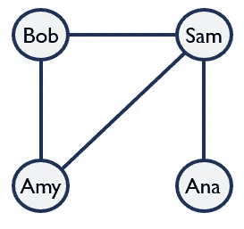

作者提供的示例图形

相同的图形也可以表示为节点和边表。我们还可以为这些节点和边添加特性。例如，我们可以添加“年龄”作为节点特性，并将“是否为朋友”作为边特性。

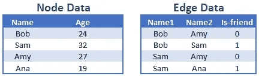

作者提供的示例节点和边数据

当我们向 TF-GNN 添加边时，我们需要按数字而非名称进行索引。我们可以这样做：

```py
node_df = node_df.reset_index()

merge_df = node_df.reset_index().set_index('Name').rename(
    columns={'index':'Name1_idx'})
edge_df = pd.merge(edge_df,merge_df['Name1_idx'],
                   how='left',left_on='Name1',right_index=True)

merge_df = merge_df.rename(columns={'Name1_idx':'Name2_idx'})
edge_df = pd.merge(edge_df,merge_df['Name2_idx'],
                   how='left',left_on='Name2',right_index=True)
```

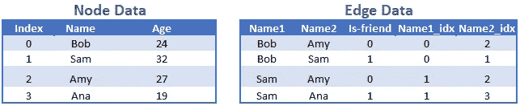

作者提供的带有数字索引的节点和边数据

最后，我们可能会得到图形的上下文值。例如，也许这个朋友小组在某次测试中的平均分为 84%。这对于这个单一图形示例意义不大。如果我们有其他朋友图形，我们或许可以基于学到的群体动态预测新朋友小组的分数。

## 从 pandas 生成的图形张量

通过这些元素，我们现在可以为我们的 GNN 构建基础：一个图形张量。

```py
import tensorflow_gnn as tfgnn

graph_tensor = tfgnn.GraphTensor.from_pieces(
    node_sets = {
        "People": tfgnn.NodeSet.from_fields(
            sizes = [len(node_df)],
            features ={
                'Age': np.array(node_df['Age'],
                                dtype='int32').reshape(len(node_df),1)})},
    edge_sets ={
        "Contact": tfgnn.EdgeSet.from_fields(
            sizes = [len(edge_df)],
            features = {
                'Is-friend': np.array(edge_df['Is-friend'],
                                      dtype='int32').reshape(len(edge_df),1)},
            adjacency = tfgnn.Adjacency.from_indices(
                source = ("People", np.array(edge_df['Name1_idx'], dtype='int32')),
                target = ("People", np.array(edge_df['Name2_idx'], dtype='int32'))))
  })
```

注意我们创建的特性如何适配到节点和边中。缩进结构使得添加额外的节点、边和特性变得简单。例如，我们可以轻松地为每个朋友观看的电影添加节点和边，并这次包含一个图形上下文值。

```py
graph_tensor = tfgnn.GraphTensor.from_pieces(
    context_spec = tfgnn.ContextSpec.from_field_specs(
        features_spec ={
            "score": [[0.84]]
        }),
    node_sets = {
        "People": tfgnn.NodeSet.from_fields(
            sizes = [len(node_df)],
            features ={
                'Age': np.array(node_df['Age'],
                                dtype='int32').reshape(len(node_df),1)}),
        "Movies": tfgnn.NodeSet.from_fields(
            sizes = [len(movie_df)],
            features ={
                'Name': np.array(movie_df['Name'],
                                 dtype='string').reshape(len(movie_df),1),
                'Length': np.array(movie_df['Length'],
                                   dtype='float32').reshape(len(movie_df),1)})},
    edge_sets ={
        "Contact": tfgnn.EdgeSet.from_fields(
            sizes = [len(edge_df)],
            features = {
                'Is-friend': np.array(edge_df['Is-friend'],
                                      dtype='int32').reshape(len(edge_df),1)},
            adjacency = tfgnn.Adjacency.from_indices(
                source = ("People", np.array(edge_df['Name1_idx'], dtype='int32')),
                target = ("People", np.array(edge_df['Name2_idx'], dtype='int32')))),
        'Watched': tfgnn.EdgeSet.from_fields(
            sizes = [len(watched_df)],
            features = {},
            adjacency = tfgnn.Adjacency.from_indices(
                source = ("People", np.array(watched_df['Name_idx'], dtype='int32')),
                target = ("Movies", np.array(watched_df['Movie_idx'], dtype='int32'))))
  })
```

注意：请非常小心你的数据类型和形状。任何偏差都会导致错误或训练问题。唯一支持的数据类型是‘int32’，‘float32’，和‘string’。如果遇到问题，请参阅本文末尾的故障排除部分。

你可能已经注意到，图张量是有方向的，具有源节点和目标节点。这对于萨姆看电影可能没问题，但通信是双向的。当萨姆与艾米交谈时，艾米也在与萨姆交谈。对于双向数据，你需要复制那些边（将源和目标反转），以指示数据流的两个方向。

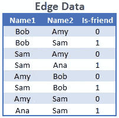

作者提供的示例双向数据

有了这个基础，我们现在准备过渡到在真实数据集上进行预测。

# 数据设置

训练数据是 2000 年秋季期间 IA 分区大学之间的美式足球比赛网络，如下所示

作者：M. Girvan 和 M. Newman。节点数据包括大学名称和他们所属的会议索引（例如，会议 8 = Pac 10）。边数据包括两个大学名称，表示它们之间进行了一场比赛。数据可以如下提取（参见 [Google Colab](https://colab.research.google.com/drive/1gNhC0YLc0aZeWwWh6QuSt2McbZMToY2S?usp=sharing) 以便跟进）：

```py
import urllib.request
import io
import zipfile
import networkx as nx

url = "http://www-personal.umich.edu/~mejn/netdata/football.zip"
sock = urllib.request.urlopen(url)  # open URL
s = io.BytesIO(sock.read())  # read into BytesIO "file"
sock.close()

zf = zipfile.ZipFile(s)  # zipfile object
txt = zf.read("football.txt").decode()  # read info file
gml = zf.read("football.gml").decode()  # read gml data
# throw away bogus first line with # from mejn files
gml = gml.split("\n")[1:]
G = nx.parse_gml(gml)  # parse gml data
print(txt)
```

## 从 NetworkX 导入图张量

我们的数据现在在 NetworkX 图中。让我们看看用节点按其所属会议着色的效果如何。

```py
cmap = {0:'#bd2309', 1:'#bbb12d',2:'#1480fa',3:'#14fa2f',4:'#faf214',
        5:'#2edfea',6:'#ea2ec4',7:'#ea2e40',8:'#577a4d',9:'#2e46c0',
        10:'#f59422',11:'#8086d9'}

colors = [cmap[G.nodes[n]['value']] for n in G.nodes()]
pos = nx.spring_layout(G, seed=1987)

nx.draw_networkx_edges(G, pos, alpha=0.2)
nx.draw_networkx_nodes(G, pos, nodelist=G.nodes(),
                       node_color=colors, node_size=100)
```

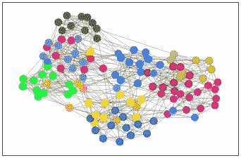

作者提供的大学美式足球网络

**对于我们的节点模型，我们将尝试预测一个学校所属的会议。对于我们的边模型，我们将尝试预测一场比赛是否是会议内的比赛。** 这两个预测将基于持出数据集进行评估。我们如何从 NetworkX 做到这一点？可以直接从图中构建图张量，使用这些函数来提取数据：

```py
node_data = G.nodes(data=True)
edge_data = G.edges(data=True)
```

问题是，我们仍然想做一些特征工程，但我们还没有持出数据集。基于这些原因，我强烈建议将你的图数据转换为 Pandas。之后，我们可以使用在第一个示例中展示的方法将数据插入图张量。

```py
node_df = pd.DataFrame.from_dict(dict(G.nodes(data=True)), orient='index')
node_df.index.name = 'school'
node_df.columns = ['conference']

edge_df = nx.to_pandas_edgelist(G)
```

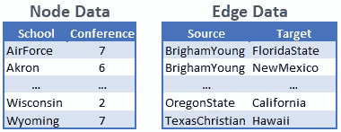

作者提供的大学美式足球节点和边数据

## 特征工程

使用基础图，一个模型可能能够基于网络确定两所大学是否在同一个会议中。但它如何知道具体是哪个会议呢？在没有任何节点或边数据的情况下，它如何学习会议之间的差异？为此任务，我们需要添加更多特征。

我们应该收集什么样的特征？我不是大学橄榄球方面的专家，但我想会议的组成是基于邻近性和排名的。本指南侧重于 TF-GNN，因此我将使用魔法添加这些新特征，但你可以在链接的 [Google Colab](https://colab.research.google.com/drive/1gNhC0YLc0aZeWwWh6QuSt2McbZMToY2S?usp=sharing) 中找到具体的代码。

对于节点，我们将添加纬度/经度以及前一年的（1999 年）排名、胜场和会议胜场。我们还将把会议列转换为 12 个虚拟变量列，以进行 softmax 预测。

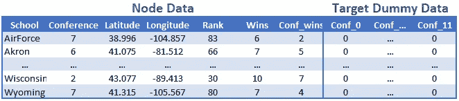

作者提供的最终节点数据集

对于边，我们将计算学校之间的距离，添加名称相似度评分（也许名称中包含相同州的学校更有可能在同一会议中），以及比赛是否为会议内比赛的目标值。

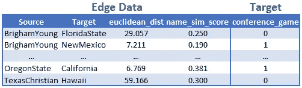

作者提供的最终边数据集

让我们用新的信息可视化我们的数据（橙色边表示会议比赛）。地理位置显然在会议选择中至少发挥了作用。

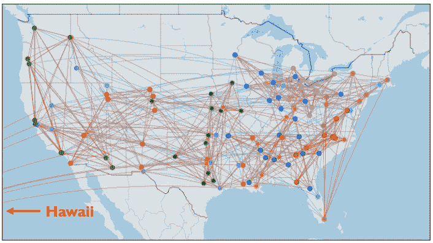

作者提供的美国地图上的大学数据

## 创建测试拆分

创建训练集是直接的；排除保留的节点和边的方式与你通常的做法相同。然而，保留数据与典型的机器学习应用有所不同。由于整体连接对于准确预测很重要，最终的预测需要基于整个图。一旦做出预测，结果可以过滤到保留数据中进行最终评估。我将在预测阶段更详细地展示这个过程；目前我创建拆分的方式如下：

```py
from sklearn.model_selection import train_test_split

node_train, node_test = train_test_split(node_df,test_size=0.15,random_state=42)
edge_train = edge_df.loc[~((edge_df['source'].isin(node_test.index)) | (edge_df['target'].isin(node_test.index)))]
edge_test = edge_df.loc[(edge_df['source'].isin(node_test.index)) | (edge_df['target'].isin(node_test.index))]
```

使用我们新的拆分，现在我们可以进行双向调整并添加边索引列。

```py
def bidirectional(edge_df):
    reverse_df = edge_df.rename(columns={'source':'target','target':'source'})
    reverse_df = reverse_df[edge_df.columns]
    reverse_df = pd.concat([edge_df, reverse_df], ignore_index=True, axis=0)
    return reverse_df

def create_adj_id(node_df,edge_df):
    node_df = node_df.reset_index().reset_index()
    edge_df = pd.merge(edge_df,node_df[['school','index']].rename(columns={"index":"source_id"}),
                       how='left',left_on='source',right_on='school').drop(columns=['school'])
    edge_df = pd.merge(edge_df,node_df[['school','index']].rename(columns={"index":"target_id"}),
                       how='left',left_on='target',right_on='school').drop(columns=['school'])

    edge_df.dropna(inplace=True)
    return node_df, edge_df

edge_full_adj = bidirectional(edge_df)
edge_train_adj = bidirectional(edge_train)

node_full_adj,edge_full_adj = create_adj_id(node_df,edge_full_adj)
node_train_adj,edge_train_adj = create_adj_id(node_train,edge_train_adj)
```

## 创建 TensorFlow 数据集

现在我们准备创建我们的图张量，我们将把它们转换成 TensorFlow 数据集。

```py
def create_graph_tensor(node_df,edge_df):
    graph_tensor = tfgnn.GraphTensor.from_pieces(
        node_sets = {
            "schools": tfgnn.NodeSet.from_fields(
                sizes = [len(node_df)],
                features ={
                    'Latitude': np.array(node_df['Latitude'], dtype='float32').reshape(len(node_df),1),
                    'Longitude': np.array(node_df['Longitude'], dtype='float32').reshape(len(node_df),1),
                    'Rank': np.array(node_df['Rank'], dtype='int32').reshape(len(node_df),1),
                    'Wins': np.array(node_df['Wins'], dtype='int32').reshape(len(node_df),1),
                    'Conf_wins': np.array(node_df['Conf_wins'], dtype='int32').reshape(len(node_df),1),
                    'conference': np.array(node_df.iloc[:,-12:], dtype='int32'),
                }),
        },
        edge_sets ={
            "games": tfgnn.EdgeSet.from_fields(
                sizes = [len(edge_df)],
                features = {
                    'name_sim_score': np.array(edge_df['name_sim_score'], dtype='float32').reshape(len(edge_df),1),
                    'euclidean_dist': np.array(edge_df['euclidean_dist'], dtype='float32').reshape(len(edge_df),1),
                    'conference_game': np.array(edge_df['conference_game'], dtype='int32').reshape(len(edge_df),1)
                },
                adjacency = tfgnn.Adjacency.from_indices(
                    source = ("schools", np.array(edge_df['source_id'], dtype='int32')),
                    target = ("schools", np.array(edge_df['target_id'], dtype='int32')),
                )),
        })
    return graph_tensor

full_tensor = create_graph_tensor(node_full_adj,edge_full_adj)
train_tensor = create_graph_tensor(node_train_adj,edge_train_adj)
```

在创建数据集之前，我们需要一个函数将图拆分为训练数据和我们将要预测的目标（如下所示的标签）。对于我们的节点预测问题，我们将“conference”作为我们的标签。我们还需要从数据集中删除“conference_game”特征，因为它会造成数据泄露问题（即作弊）。

```py
def node_batch_merge(graph):
    graph = graph.merge_batch_to_components()
    node_features = graph.node_sets['schools'].get_features_dict()
    edge_features = graph.edge_sets['games'].get_features_dict()

    label = node_features.pop('conference')
    _ = edge_features.pop('conference_game')

    new_graph = graph.replace_features(
        node_sets={'schools':node_features},
        edge_sets={'games':edge_features})
    return new_graph, label
```

我们将对边模型进行反向操作：删除“conference”特征并将“conference_game”拆分为目标（标签）。

```py
def edge_batch_merge(graph):
    graph = graph.merge_batch_to_components()
    node_features = graph.node_sets['schools'].get_features_dict()
    edge_features = graph.edge_sets['games'].get_features_dict()

    _ = node_features.pop('conference')
    label = edge_features.pop('conference_game')

    new_graph = graph.replace_features(
        node_sets={'schools':node_features},
        edge_sets={'games':edge_features})
    return new_graph, label
```

我们现在可以创建数据集，并通过上述函数进行映射。

```py
def create_dataset(graph,function):
    dataset = tf.data.Dataset.from_tensors(graph)
    dataset = dataset.batch(32)
    return dataset.map(function)

#Node Datasets
full_node_dataset = create_dataset(full_tensor,node_batch_merge)
train_node_dataset = create_dataset(train_tensor,node_batch_merge)

#Edge Datasets
full_edge_dataset = create_dataset(full_tensor,edge_batch_merge)
train_edge_dataset = create_dataset(train_tensor,edge_batch_merge)
```

这些程序的顺序非常重要：

1\. 我们从图张量创建数据集。

2\. 我们将数据集按批次拆分（了解一下批次大小）。

3\. 在映射函数中，我们将这些批次合并回一个图中。

4\. 根据需要拆分/删除特征。

如果你不严格按照此顺序操作，模型将无法训练（或无法正确训练）。

# 构建模型

我们已经有了数据集，现在是有趣的部分！首先，我们使用数据集规格定义输入。

```py
graph_spec = train_node_dataset.element_spec[0]
input_graph = tf.keras.layers.Input(type_spec=graph_spec)
```

现在我们需要初始化特征。我们将创建初始化节点和边的函数。然后，我们通过这些函数映射我们的特征。为了简化，我将为每个特征创建一个密集层。

```py
def set_initial_node_state(node_set, node_set_name):
    features = [
        tf.keras.layers.Dense(32,activation="relu")(node_set['Latitude']),
        tf.keras.layers.Dense(32,activation="relu")(node_set['Longitude']),
        tf.keras.layers.Dense(32,activation="relu")(node_set['Rank']),
        tf.keras.layers.Dense(32,activation="relu")(node_set['Wins']),
        tf.keras.layers.Dense(32,activation="relu")(node_set['Conf_wins'])
    ]
    return tf.keras.layers.Concatenate()(features)

def set_initial_edge_state(edge_set, edge_set_name):
    features = [
        tf.keras.layers.Dense(32,activation="relu")(edge_set['name_sim_score']),
        tf.keras.layers.Dense(32,activation="relu")(edge_set['euclidean_dist'])
    ]
    return tf.keras.layers.Concatenate()(features)

graph = tfgnn.keras.layers.MapFeatures(
    node_sets_fn=set_initial_node_state,
    edge_sets_fn=set_initial_edge_state
)(input_graph)
```

在之前的步骤中可以进行很多自定义。例如，我们可以为字符串特征创建词嵌入。我们可以通过对纬度/经度网格进行哈希处理而不是仅仅使用密集层来获得一些准确性。TensorFlow 为我们提供了许多选项。

几点说明：

+   如果你有多个节点或边，你需要添加 ‘if 语句’ 以将特征应用到正确的节点/边。

+   没有特征的节点或边也可以使用 ‘MakeEmptyFeature’ 函数进行初始化。

+   对于以节点为中心的问题，初始化边是可选的（阅读更多关于节点与边中心的内容）。

+   第一个节点必须至少有一个特征。如果没有特征，你可能需要在一个索引上创建一个嵌入（结果可能不会很好）。

```py
# Examples, do not use for this problem
def set_initial_node_state(node_set, node_set_name):
    if node_set_name == "node_1":
        return tf.keras.layers.Embedding(115,3)(node_set['id'])
    elif node_set_name == "node_2":
        return tfgnn.keras.layers.MakeEmptyFeature()(node_set)

graph = tfgnn.keras.layers.MapFeatures(
    node_sets_fn=set_initial_node_state)(input_graph)
```

在我们开发更新循环之前，我们需要一个额外的辅助函数。随着我们添加密集层，我们希望确保我们在使用 L2 正则化和/或 dropout（L1 也可以使用）。

```py
def dense_layer(self,units=64,l2_reg=0.1,dropout=0.25,activation='relu'):
    regularizer = tf.keras.regularizers.l2(l2_reg)
    return tf.keras.Sequential([
        tf.keras.layers.Dense(units,
                              kernel_regularizer=regularizer,
                              bias_regularizer=regularizer),
        tf.keras.layers.Dropout(dropout)])
```

## 节点模型

有许多模型架构，但图卷积网络迄今为止是最常见的（见其他方法 [这里](https://huggingface.co/blog/intro-graphml) ）。图卷积类似于计算机视觉问题中常用的卷积。主要区别在于图卷积处理的是你在图结构中找到的不规则数据。让我们跳入实际代码中。

```py
graph_updates = 3 # tunable parameter
for i in range(graph_updates):
    graph = tfgnn.keras.layers.GraphUpdate(
        node_sets = {
            'schools': tfgnn.keras.layers.NodeSetUpdate({
                'games': tfgnn.keras.layers.SimpleConv(
                    message_fn = dense_layer(32),
                    reduce_type="sum",
                    sender_edge_feature = tfgnn.HIDDEN_STATE,
                    receiver_tag=tfgnn.TARGET)},
                tfgnn.keras.layers.NextStateFromConcat(
                    dense_layer(64)))})(graph) #start here

    logits = tf.keras.layers.Dense(12,activation='softmax')(graph.node_sets["schools"][tfgnn.HIDDEN_STATE])

node_model = tf.keras.Model(input_graph, logits)
```

上面的代码可能有些令人困惑，因为 TensorFlow 堆叠的工作原理。请记住，‘#start here’ 标记的（图）实际上是前面代码的输入。在开始时，这个（图）等于我们之前映射的初始化特征。输入被送入 ‘GraphUpdate’ 函数，成为新的（图）。每次‘graph_updates’循环中，之前的 ‘GraphUpdate’ 成为新的 ‘GraphUpdate’ 的输入，同时还指定了一个通过 ‘NextStateFromConcat’ 函数的密集层。这个图示应该有助于解释：

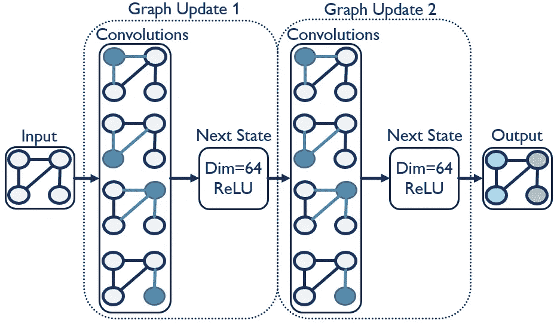

图卷积网络图，显示了作者进行的两次图更新

‘GraphUpdate’函数简单地更新指定的状态（节点、边或上下文），并添加一个下一个状态层。在这种情况下，我们只用‘NodeSetUpdate’更新节点状态，但当我们处理边模型时，我们将探索以边为中心的方法。通过这个节点更新，我们在边缘上应用了一个卷积层，使信息能够从邻近的节点和边缘传递到节点。图形更新的数量是一个可调节的参数，每次更新允许信息从更远的节点传播。例如，我们在案例中指定的三次更新允许信息从最多三节点远的地方传播。在图形更新后，最终的节点状态成为我们标记为‘logits’的预测头的输入。由于我们预测 12 个不同的会议，我们有一个包含 12 个单元的密集层，并使用 softmax 激活函数。现在我们可以编译模型。

```py
node_model.compile(
    tf.keras.optimizers.Adam(learning_rate=0.01),
    loss = 'categorical_crossentropy',
    metrics = ['categorical_accuracy']
)

node_model.summary()
```

最后，我们训练模型。我使用了一个回调函数来在验证数据集停止提高准确率时停止训练。这并不完美，因为我们必须使用完整数据集（如上所述）。这将导致我们的准确率包括数据泄漏。一个完美的解决方案是编写一个自定义评估函数，仅返回验证数据上的验证节点的准确率，以及训练数据上的训练节点的准确率。这需要大量工作（要讲解的话会成为一个教程），以便在最准确的停止点上更近一步。我选择保持简单，并接受一个略微不那么准确的模型。

```py
es = tf.keras.callbacks.EarlyStopping(
        monitor='val_loss',mode='min',verbose=1,
        patience=10,restore_best_weights=True)

node_model.fit(train_node_dataset.repeat(),
               validation_data=full_node_dataset,
               steps_per_epoch=10,
               epochs=1000,
               callbacks=[es])
```

现在来看一下我们使用 `node_model.predict(full_node_dataset)` 的效果，并通过魔法将结果打印在地图上（见[Google Colab](https://colab.research.google.com/drive/1gNhC0YLc0aZeWwWh6QuSt2McbZMToY2S?usp=sharing)）。

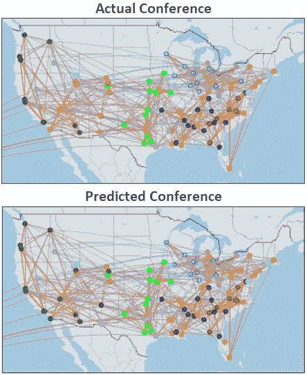

按作者的节点预测准确性比较

总体而言，我们的准确率达到了令人尊敬的 88%（见[Google Colab](https://colab.research.google.com/drive/1gNhC0YLc0aZeWwWh6QuSt2McbZMToY2S?usp=sharing)获取模型参数）。模型在山区州的表现似乎较差。深入分析后，我们发现了一些有趣的见解。例如，模型错误地预测犹他州属于 Pac 10 会议。然而，事实上，犹他州在第二年确实加入了 Pac 10。完全有可能模型准确地识别了应该如何进行，而约 12%的误差实际上是衡量在创建会议时的人为不一致性。另一种考虑方式是用社交网络中的朋友。如果网络预测两个人是朋友，而他们从未见过面，这个模型是错的还是他们实际上是好朋友？对于许多（或大多数）图形问题，这些“错误”实际上是你真正想要找到的。这些“错误”可以用于推荐购买的产品、观看的电影、应该联系的人等。

在这种情况下，假设数据是完美的，我们关注的是分类准确率。为了真正了解我们的表现如何，我们需要在持出数据上测试准确率。为此，我们将在完整数据集上进行预测，然后筛选到持出节点。

```py
def evaluate_node():
    ### Add raw prediction ####
    yhat = node_model.predict(full_node_dataset)
    yhat_df = node_full_adj.set_index('school').iloc[:,-12:].copy()
    yhat_df.iloc[:,:] = yhat

    ### Classify max of softmax output ###
    yhat_df = yhat_df.apply(lambda x: x == x.max(), axis=1).astype(int)

    ### Merge output back to single column ###
    yhat_df = yhat_df.dot(yhat_df.columns).to_frame().rename(columns={0:'conf_yhat'})
    yhat_df = yhat_df['conf_yhat'].str.replace('conf_', '').astype(int).to_frame()
    yhat_df['conf_actual'] = node_full_adj['conference']

    ### Filter down to test nodes ###
    yhat_df = yhat_df.loc[yhat_df.index.isin(params['testset'].index)]

    ### Calculate accuracy ###
    yhat_df['Accuracy'] = yhat_df['conf_yhat']==yhat_df['conf_actual']
    return yhat_df['Accuracy'].mean()
```

对于这个模型，准确率下降到约 72%（别惊慌，持出数据集上下降是预期的）。鉴于特征工程有限、仅有一年的数据和 12 个输出预测——这些结果是合理的。通过对下面地图的视觉检查（并与上面的完整地图进行比较），大多数错误看起来像是合理的猜测。

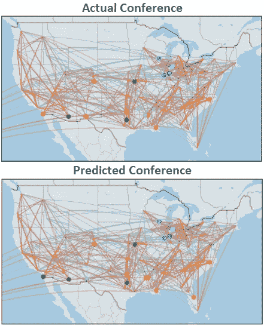

按作者比较节点持出预测准确率

## 边模型

现在我们将尝试预测某场比赛是否为会议内比赛。我们已经在上面定义了我们的边数据集，大多数步骤可以重复使用，仅有一个更改：

```py
### Change to train_edge_dataset ###
graph_spec = train_edge_dataset.element_spec[0]
input_graph = tf.keras.layers.Input(type_spec=graph_spec)
graph = tfgnn.keras.layers.MapFeatures(
    node_sets_fn=set_initial_node_state,
    edge_sets_fn=set_initial_edge_state
)(input_graph)
```

我们确实需要对图更新进行一些更改。首先，我们需要在‘GraphUpdate’函数中添加一个‘edge_sets’更新。保留‘node_sets’更新是可选的，但模型似乎在保留它时表现更好。接下来，我们将从 GCN 切换到 Graph Nets 方法。这种方法将边视为一等公民（即一种时髦的说法，表示它们将学习自己的权重，这正是我们所追求的）。最后，我们需要将‘logits’更新为一个单单位的 sigmoid 激活密集层，因为我们正在预测一个虚拟变量。

```py
graph_updates = 3
for i in range(graph_updates):
    graph = tfgnn.keras.layers.GraphUpdate(
        edge_sets = {'games': tfgnn.keras.layers.EdgeSetUpdate(
            next_state = tfgnn.keras.layers.NextStateFromConcat(
                dense_layer(64,activation='relu')))},
        node_sets = {
            'schools': tfgnn.keras.layers.NodeSetUpdate({
                'games': tfgnn.keras.layers.Pool(
                    tag=tfgnn.TARGET,
                    reduce_type="sum",
                    feature_name = tfgnn.HIDDEN_STATE)},
                tfgnn.keras.layers.NextStateFromConcat(
                    dense_layer(64)))})(graph)

    logits = tf.keras.layers.Dense(1,activation='sigmoid')(graph.edge_sets['games'][tfgnn.HIDDEN_STATE])

edge_model = tf.keras.Model(input_graph, logits)
```

这次我们使用‘binary_crossentropy’来编译模型。

```py
edge_model.compile(
    tf.keras.optimizers.Adam(learning_rate=0.01),
    loss = 'binary_crossentropy',
    metrics = ['Accuracy']
)

edge_model.summary()
```

我们使用与节点问题中定义的相同回调来拟合模型。

```py
edge_model.fit(train_edge_dataset.repeat(),
               validation_data=full_edge_dataset,
               steps_per_epoch=10,
               epochs=1000,
               callbacks=[es])

yhat = edge_model.predict(full_edge_dataset)
yhat_df = edge_full_adj.copy().set_index(['source','target'])
yhat_df['conf_game_yhat'] = yhat.round(0)
yhat_df = yhat_df.loc[yhat_df.index.isin(
    edge_test.set_index(['source','target']).index)]
yhat_df['loss'] = abs(yhat_df['conference_game'] - yhat_df['conf_game_yhat'])
loss = yhat_df['loss'].mean()
print("edge accuracy:",1 - loss)
```

在持出数据集上进行评估时，我们获得了 85%的准确率，而均值为 56%。模型完成了它的工作，我对这些结果感到满意。

## 上下文模型

这个特定的问题没有上下文值。我们可以假设我们将上面的图划分为每个会议的单独图。这些新图将显示会议中每个球队进行的每场比赛，并忽略所有其他比赛。然后我们可以为每个图提供会议排名的值。现在我们可以训练一个模型来进行上下文级别的预测。

首先，我们需要将上下文值添加到图中。

```py
graph_tensor = tfgnn.GraphTensor.from_pieces(
    context = tfgnn.Context.from_fields(
        features ={
            <context_feature>
        }),
    node_sets = {
        ...
```

接下来，我们需要创建一个新的数据集，将上下文映射到标签。

```py
def node_batch_merge(graph):
    graph = graph.merge_batch_to_components()
    context_features = graph.context.get_features_dict()
    label = context_features.pop('<context_feature>')
    new_graph = graph.replace_features(
        context=context_features)
    return new_graph, label
```

我们可以设置初始上下文状态。在这种情况下，我们正在预测这个特征，因此它将从训练数据中缺失。对于其他模型，上下文可能是一个可训练的特征，可以这样设置：

```py
def set_initial_context_state(context):
    return tf.keras.layers.Dense(32,activation="relu")(context['<context_feature>'])

graph = tfgnn.keras.layers.MapFeatures(
    context_fn=set_initial_context_state,
    node_sets_fn=set_initial_node_state,
    edge_sets_fn=set_initial_edge_state
)(input_graph)
```

再次，我们可以选择性地将上下文更新添加到‘GraphUpdate’（见下文）。我没有测试这种方法，所以可以随意尝试。

```py
graph = tfgnn.keras.layers.GraphUpdate(
    node_sets ={...},
    context = tfgnn.keras.layers.ContextUpdate({
        'schools': tfgnn.keras.layers.Pool(tfgnn.CONTEXT, "mean")},
        tfgnn.keras.layers.NextStateFromConcat(tf.keras.layers.Dense(128))))
```

最后，我们更新‘logits’以进行上下文预测。

```py
logits = tfgnn.keras.layers.Pool(tfgnn.CONTEXT, "mean",
                                 node_set_name="schools")(graph)
```

# 故障排除错误

在尝试理解上述代码时，我遇到了许多错误和训练效果不佳的模型。虽然我尽量保持内容的通用性以适用于多种不同的问题，但你在为数据进行调整时无疑会遇到错误。诀窍是识别错误的来源。我发现诊断错误的最佳方法是创建一个图形模式。

在我们的代码中，我们从数据集中提取了图形模式。然而，你也可以直接构建一个图形模式。对于我们的足球示例，图形模式如下所示：

```py
graph_spec = tfgnn.GraphTensorSpec.from_piece_specs(
    context_spec = tfgnn.ContextSpec.from_field_specs(
        features_spec ={
            #Added as an example for context problems
            #"conf_rank": tf.TensorSpec(shape=(None,1), dtype=tf.float32),
        }),
    node_sets_spec={
        'schools':
            tfgnn.NodeSetSpec.from_field_specs(
                features_spec={
                    'Latitude': tf.TensorSpec((None, 1), tf.float32),
                    'Longitude': tf.TensorSpec((None, 1), tf.float32),
                    'Rank': tf.TensorSpec((None, 1), tf.int32),
                    'Wins': tf.TensorSpec((None, 1), tf.int32),
                    'Conf_wins': tf.TensorSpec((None, 1), tf.int32),
                    'conference': tf.TensorSpec((None, 12), tf.int32)
                },
                sizes_spec=tf.TensorSpec((1,), tf.int32))
    },
    edge_sets_spec={
        'games':
            tfgnn.EdgeSetSpec.from_field_specs(
                features_spec={
                    'name_sim_score': tf.TensorSpec((None, 1), tf.float32),
                    'euclidean_dist': tf.TensorSpec((None, 1), tf.float32),
                    'conference_game': tf.TensorSpec((None, 1), tf.int32)
                },
                sizes_spec=tf.TensorSpec((1,), tf.int32),
                adjacency_spec=tfgnn.AdjacencySpec.from_incident_node_sets(
                    'schools', 'schools'))
    })
```

我们可以通过尝试构建和编译模型来测试‘graph_spec’是否至少有效。如果出现错误，可能是你的特征形状或‘set_initial_…’函数存在问题。如果成功，你可以验证你创建的模式是否与‘graph_tensor’兼容。

```py
graph_spec.is_compatible_with(full_tensor)
```

如果为假，你可以打印‘full_tensor.spec’和‘graph_spec’来比较每一部分，以确保形状和数据类型完全相同。你还可以直接从‘graph_spec’创建一个随机生成的图张量。

```py
random_graph = tfgnn.random_graph_tensor(graph_spec)
```

使用这个‘random_graph’你可以尝试训练一个模型。这应该有助于你确定错误是出在规范还是模型代码上。如果没有错误，你可以打印‘random_graph’的值，看看输出与‘graph_tensor’的比较情况。

```py
print("Nodes:",random_graph.node_sets['schools'].features)
print("Edges:",random_graph.edge_sets['games'].features)
print("Context:",random_graph.context.features)
```

这些步骤应该可以帮助你追踪大部分遇到的问题。

# 参数调优

我们已经成功修复了所有错误并训练了一个模型。现在我们希望调整超参数以获得一个准确的模型。我选择的调优工具是 Hyperopt 库，因为它易于使用且集成了贝叶斯优化。但首先，我们需要将上述建模代码转换为具有变量的类。

```py
class GCNN:
    def __init__(self,params):
        self.params = params

    def set_initial_node_state(self, node_set, node_set_name):
        features = [
            tf.keras.layers.Dense(self.params['feature_dim'],activation="relu")(node_set['Latitude']),
            tf.keras.layers.Dense(self.params['feature_dim'],activation="relu")(node_set['Longitude']),
            tf.keras.layers.Dense(self.params['feature_dim'],activation="relu")(node_set['Rank']),
            tf.keras.layers.Dense(self.params['feature_dim'],activation="relu")(node_set['Wins']),
            tf.keras.layers.Dense(self.params['feature_dim'],activation="relu")(node_set['Conf_wins'])
        ]
        return tf.keras.layers.Concatenate()(features)

    def set_initial_edge_state(self, edge_set, edge_set_name):
        features = [
            tf.keras.layers.Dense(self.params['feature_dim'],activation="relu")(edge_set['name_sim_score']),
            tf.keras.layers.Dense(self.params['feature_dim'],activation="relu")(edge_set['euclidean_dist'])
        ]
        return tf.keras.layers.Concatenate()(features)

    def dense_layer(self,units=64):
        regularizer = tf.keras.regularizers.l2(self.params['l2_reg'])
        return tf.keras.Sequential([
            tf.keras.layers.Dense(units,
                                  kernel_regularizer=regularizer,
                                  bias_regularizer=regularizer,
                                  activation='relu'),
            tf.keras.layers.Dropout(self.params['dropout'])])

    def build_model(self):
        input_graph = tf.keras.layers.Input(type_spec=self.params['trainset'].element_spec[0])
        graph = tfgnn.keras.layers.MapFeatures(
            node_sets_fn=self.set_initial_node_state,
            edge_sets_fn=self.set_initial_edge_state
        )(input_graph)

        if self.params['loss']=='categorical_crossentropy':
            for i in range(self.params['graph_updates']):
                graph = tfgnn.keras.layers.GraphUpdate(
                    node_sets = {
                        'schools': tfgnn.keras.layers.NodeSetUpdate({
                            'games': tfgnn.keras.layers.SimpleConv(
                                message_fn = self.dense_layer(self.params['message_dim']),
                                reduce_type="sum",
                                receiver_tag=tfgnn.TARGET)},
                            tfgnn.keras.layers.NextStateFromConcat(
                                self.dense_layer(self.params['next_state_dim'])))})(graph)
            logits = tf.keras.layers.Dense(12,activation='softmax')(graph.node_sets['schools'][tfgnn.HIDDEN_STATE])
        else:
            for i in range(self.params['graph_updates']):
                graph = tfgnn.keras.layers.GraphUpdate(
                    edge_sets = {'games': tfgnn.keras.layers.EdgeSetUpdate(
                        next_state = tfgnn.keras.layers.NextStateFromConcat(
                            self.dense_layer(self.params['next_state_dim'])))},
                    node_sets = {
                        'schools': tfgnn.keras.layers.NodeSetUpdate({
                            'games': tfgnn.keras.layers.SimpleConv(
                                message_fn = self.dense_layer(self.params['message_dim']),
                                reduce_type="sum",
                                receiver_tag=tfgnn.TARGET)},
                            tfgnn.keras.layers.NextStateFromConcat(
                                self.dense_layer(self.params['next_state_dim'])))})(graph)
            logits = tf.keras.layers.Dense(1,activation='sigmoid')(graph.edge_sets['games'][tfgnn.HIDDEN_STATE])
        return tf.keras.Model(input_graph, logits)

    def train_model(self,trial=True):
        model = self.build_model()

        model.compile(tf.keras.optimizers.Adam(learning_rate=self.params['learning_rate']),
                      loss=self.params['loss'],
                      metrics=['Accuracy'])

        callbacks = [tf.keras.callbacks.EarlyStopping(monitor='val_loss',
                                                      mode='min',
                                                      verbose=1,
                                                      patience=self.params['patience'],
                                                      restore_best_weights=True)]

        model.fit(self.params['trainset'].repeat(),
                  validation_data=self.params['full_dataset'],
                  steps_per_epoch=self.params['steps_per_epoch'],
                  epochs=self.params['epochs'],
                  verbose=0,
                  callbacks = callbacks)

        loss = self.evaluate_model(model,trial=trial)

        if trial == True:
            sys.stdout.flush()
            hypt_params = {
                'graph_updates':self.params['graph_updates'],
                'feature_dim':self.params['feature_dim'],
                'next_state_dim':self.params['next_state_dim'],
                'message_dim':self.params['message_dim'],
                'l2_reg':self.params['l2_reg'],
                'dropout':self.params['dropout'],
                'learning_rate':self.params['learning_rate']}
            print(hypt_params,'loss:',loss)
            return {'loss': loss, 'status': STATUS_OK}
        else:
            print('loss:',loss)
            return model

    def evaluate_model(self,model,trial=True):
        if self.params['loss'] == 'categorical_crossentropy':
            yhat = model.predict(full_node_dataset)
            yhat_df = node_full_adj.set_index('school').iloc[:,-12:].copy()
            yhat_df.iloc[:,:] = yhat
            yhat_df = yhat_df.apply(lambda x: x == x.max(), axis=1).astype(int)
            yhat_df = yhat_df.dot(yhat_df.columns).to_frame().rename(columns={0:'conf_yhat'})
            yhat_df = yhat_df['conf_yhat'].str.replace('conf_', '').astype(int).to_frame()
            yhat_df['conf_actual'] = node_full_adj.set_index('school')['conference']
            yhat_df = yhat_df.loc[yhat_df.index.isin(node_test.index)]
            yhat_df['Accuracy'] = yhat_df['conf_yhat']==yhat_df['conf_actual']
            loss = 1 - yhat_df['Accuracy'].mean()
        else:
            yhat = model.predict(full_edge_dataset)
            yhat_df = edge_full_adj.copy().set_index(['source','target'])
            yhat_df['conf_game_yhat'] = yhat.round(0)
            yhat_df = yhat_df.loc[yhat_df.index.isin(
                edge_test.set_index(['source','target']).index)]
            yhat_df['loss'] = abs(yhat_df['conference_game'] - yhat_df['conf_game_yhat'])
            loss = yhat_df['loss'].mean()
        return loss
```

现在我们定义我们的参数。对于调优参数，我们可以明确地定义值（例如，‘dropout’: 0.1），或像下面我所做的那样定义 Hyperopt 可以实验的空间。‘hp.choice’会在你指定的选项之间进行选择，而‘hp.uniform’会在两个值之间选择。H[yperopt 文档](http://hyperopt.github.io/hyperopt/getting-started/search_spaces/)中还有许多其他可用的选项。

```py
params = {
    ### Tuning parameters ###
    'graph_updates': hp.choice('graph_updates',[2,3,4]),
    'feature_dim': hp.choice('feature_dim',[16,32,64,128]),
    'message_dim': hp.choice('message_dim',[16,32,64,128]),
    'next_state_dim': hp.choice('next_state_dim',[16,32,64,128]),
    'l2_reg': hp.uniform('l2_reg',0.0,0.3),
    'dropout': hp.choice('dropout',[0,0.125,0.25,0.375,0.5]),
    'learning_rate': hp.uniform('learning_rate',0.0,0.1),

    ### Static parameters ###
    'loss': 'categorical_crossentropy',
    'epochs': 1000,
    'steps_per_epoch':10, ### This could also be a tuned parameter
    'patience':10,
    'trainset':train_node_dataset,
    'full_dataset':full_node_dataset
}
```

接下来，我们定义一个辅助函数，并将其与我们的参数一起插入到‘fmin’中。每次评估都是一个训练好的模型，因此根据你的硬件，这可能需要一段时间。如果速度对你来说太慢，可以考虑减少‘max_evals’的次数。我个人的经验法则是每个调优参数大约进行 15 次评估，因此我会明确地定义一些参数，以便根据评估次数的减少进行调整。

```py
from hyperopt import fmin, tpe, hp, STATUS_OK, Trials

def tune_model(params):
    return GCNN(params).train_model()

best = fmin(tune_model, params, algo=tpe.suggest, 
            max_evals=100, trials=Trials())
```

现在我们有了最佳的超参数，可以训练最终模型（注意：由于 TensorFlow 随机初始化其权重，你的准确度可能会略有不同）。

```py
### Perameters from my hyperopt run ###
best = {'graph_updates': 4,
        'feature_dim': 64,
        'next_state_dim': 32,
        'message_dim': 128,
        'l2_reg': 0.095,
        'dropout': 0,
        'learning_rate': 0.0025
}

node_params = params
for param, value in best.items():
    node_params[param] = value

node_model = GCNN(node_params).train_model(trial=False)
```

我们可以通过一些微小的调整来调优和训练我们的边缘模型：

```py
params['loss'] = 'binary_crossentropy'
params['trainset'] = train_edge_dataset
params['full_dataset'] = full_edge_dataset

best = fmin(tune_model, params, algo=tpe.suggest, 
            max_evals=100, trials=Trials())
```

```py
### Perameters from my hyperopt run ###
best = {'graph_updates': 4,
        'feature_dim': 64,
        'next_state_dim': 32,
        'message_dim': 128,
        'l2_reg': 0.095,
        'dropout': 0,
        'learning_rate': 0.0025
}

edge_params = params
for param, value in best.items():
    edge_params[param] = value

edge_model = GCNN(edge_params).train_model(trial=False)
```

# 最后的思考

GNN 研究仍处于初期阶段。新的建模方法很可能会被发现。由于 TF-GNN 仍处于 alpha 状态，未来可能会有一些代码变更。如果您发现我尚未修复的更改或错误，请在下方留言，我会尽力更新此指南。如果您不喜欢这篇文章，可以在评论中将我与您最喜欢的历史独裁者作类比。否则，鼓掌或友好的评论将不胜感激。

我希望这份指南能成为更多人进入这一领域并进行实验的起点。请考虑这是您参与下一波 AI 浪潮的机会！

# 关于我

我是一名资深数据科学家和兼职自由职业者，拥有超过 12 年的经验。我始终希望能与他人建立联系，请随时：

+   [在 LinkedIn 上与我连接](https://www.linkedin.com/in/michael-a-malin/)

+   [在 Twitter 上关注我](https://twitter.com/alaska_malin)

+   [访问我的网站：www.modelforge.ai](http://www.modelforge.ai)

+   [查看我的其他文章](https://michael-malin.medium.com/)

***如果您有任何问题，请随时在下面留言。***
