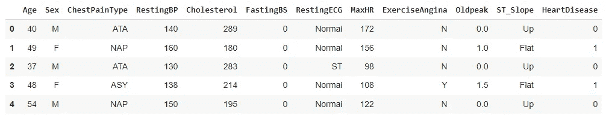
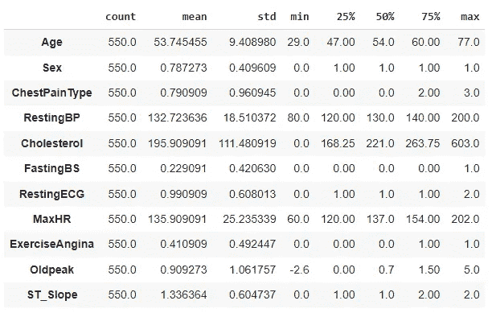

# 使用 GradientTape 进行 TensorFlow 模型训练

> 原文：[`towardsdatascience.com/tensorflow-model-training-using-gradienttape-f2093646ab13`](https://towardsdatascience.com/tensorflow-model-training-using-gradienttape-f2093646ab13)


照片由 [Sivani Bandaru](https://unsplash.com/@agni11?utm_source=medium&utm_medium=referral) 提供，发布在 [Unsplash](https://unsplash.com/?utm_source=medium&utm_medium=referral) 上。

## 使用 GradientTape 更新权重

[](https://rashida00.medium.com/?source=post_page-----f2093646ab13--------------------------------)[](https://towardsdatascience.com/?source=post_page-----f2093646ab13--------------------------------) [Rashida Nasrin Sucky](https://rashida00.medium.com/?source=post_page-----f2093646ab13--------------------------------)

·发布在 [Towards Data Science](https://towardsdatascience.com/?source=post_page-----f2093646ab13--------------------------------) ·7 分钟阅读·2023 年 10 月 17 日

--

TensorFlow 可以说是最受欢迎的深度学习库。我之前写了很多关于 TensorFlow 的教程，并且还在继续。TensorFlow 是一个组织良好且易于使用的包，你不需要过多担心模型开发和训练。大部分工作都由这个包本身处理。这可能就是它在业界如此受欢迎的原因。但与此同时，有时掌控幕后功能也很不错。它为你提供了大量的实验模型的能力。如果你是求职者，一些额外的知识可能会给你带来优势。

之前，我写了一篇文章介绍 如何开发自定义激活函数、层和损失函数。在这篇文章中，我们将看到如何手动训练模型并自行更新权重。但不用担心，你不需要重新记住微积分。TensorFlow 本身提供了 GradientTape() 方法来处理这部分内容。

如果 GradientTape() 对你来说完全陌生，请随时查看这个关于 GradientTape() 的练习，了解 GradientTape() 的工作原理：[TensorFlow 中的 GradientTape 介绍 — Regenerative (regenerativetoday.com)](https://regenerativetoday.com/introduction-to-gradienttape-in-tensorflow/)

## 数据准备

在这篇文章中，我们使用 GradientTape() 在 TensorFlow 中进行一个简单的分类算法。请从这个链接下载数据集：

[心力衰竭预测数据集 (kaggle.com)](https://www.kaggle.com/datasets/fedesoriano/heart-failure-prediction)

这个数据集具有开放数据库许可。

这些是必要的导入：

```py
import tensorflow as tf
from tensorflow.keras.models import Model
from tensorflow.keras.layers import Dense, Input
import numpy as np
import matplotlib.pyplot as plt
import matplotlib.ticker as mticker
import pandas as pd
from sklearn.model_selection import train_test_split
from sklearn.metrics import confusion_matrix
import itertools
from tqdm import tqdm
import tensorflow_datasets as tfds
```

使用数据集创建 DataFrame：

```py
import pandas as pd
df = pd.read_csv('heart.csv')
df
```

输出：



如上图所示，有多个列的数据类型是字符串。让我们检查数据集中所有列的数据类型：

```py
df.dtypes
```

输出：

```py
Age                 int64
Sex                object
ChestPainType      object
RestingBP           int64
Cholesterol         int64
FastingBS           int64
RestingECG         object
MaxHR               int64
ExerciseAngina     object
Oldpeak           float64
ST_Slope           object
HeartDisease        int64
dtype: object
```

既然你在这里，我可以假设你了解机器学习基础，并且已经学过数据类型需要为数值型才能用于 TensorFlow。

下面的代码会遍历列，如果列的数据类型是‘object’，则将其转换为数值数据。

```py
for col in df.columns:
  if df[col].dtype == 'object':
    df[col] = df[col].astype('category').cat.codes
```

所有列现在已变为数值型。定义训练特征和目标变量以继续模型开发：

```py
X = df.drop(columns = 'HeartDisease')
y = df['HeartDisease']
```

我们应该保留数据集的一部分来评估模型。因此，我们将在这里使用 train_test_split 方法：

```py
train, test = train_test_split(df, test_size=0.4)
```

在深入模型开发之前，还需要对数据进行缩放。我在这里使用的是标准缩放方法，需要均值和标准差。请记住，我们只需要训练数据的均值和标准差。为了缩放测试数据，需要再次使用训练数据的均值和标准差，因为我们不应向模型透露任何关于测试数据的信息。

我们将使用.describe()方法来查找训练数据每列的统计参数：

```py
train_stats = train.describe()
train_stats.pop('HeartDisease')
train_stats = train_stats.transpose()
```



我们现在有了缩放的参数。

需要在这里将训练数据和测试数据的目标变量分开：

```py
y_train = train.pop('HeartDisease')
y_test = test.pop('HeartDisease')
```

定义了以下函数来使用标准缩放公式对数据集的某一列进行缩放：

```py
def norm(x):
  return (x - train_stats['mean']) / train_stats['std']
```

使用函数‘norm’对训练数据和测试数据进行缩放：

```py
X_train_norm = norm(train)
X_test_norm = norm(test)
```

如果你检查 X_train_norm 和 X_test_norm，它们实际上是数组。这里将它们转换为张量：

```py
train_dataset = tf.data.Dataset.from_tensor_slices((X_train_norm.values, y_train.values))
test_dataset = tf.data.Dataset.from_tensor_slices((X_test_norm.values, y_test.values))
```

每批数据集通过洗牌处理，其中批次大小（batch_size）设置为 32：

```py
batch_size = 32
train_dataset = train_dataset.shuffle(buffer_size = len(train)).batch(batch_size).prefetch(1)
test_dataset = test_dataset.batch(batch_size=batch_size).prefetch(1)
```

## 模型开发

由于数据集非常简单，我们将使用一个简单的 TensorFlow 模型。模型定义为函数 base_model，添加了两个全连接的 64 神经元 Dense 层和一个输出层。在最后一行，调用函数 base_model 并将其保存在名为’model’的变量中。

```py
def base_model():
  inputs = tf.keras.layers.Input(shape = len(train.columns))
  x = tf.keras.layers.Dense(64, activation='LeakyReLU')(inputs)
  x = tf.keras.layers.Dense(64, activation='LeakyReLU')(x)
  outputs = tf.keras.layers.Dense(1, activation='sigmoid')(x)

  model = tf.keras.Model(inputs=inputs, outputs = outputs)
  return model

model = base_model()
```

我选择了 RMSprop 优化器和 BinaryCrossentropy()损失函数作为这个例子。请随意使用你选择的其他优化器。

```py
optimizer = tf.keras.optimizers.legacy.RMSprop(learning_rate=0.001)
loss_object = tf.keras.losses.BinaryCrossentropy()
```

## 模型训练

GradientTape 部分将在模型训练过程中发挥作用。在模型训练期间，我们需要微分来更新权重。下面的函数将使用 GradientTape 来计算梯度。首先，它使用模型计算输出，称为 logits。利用真实标签和预测标签，计算损失。

然后，计算梯度，获取损失对权重的偏导数，并将梯度应用于优化器：

```py
def gradient_calc(optimizer, loss_object, model, X, y):
  with tf.GradientTape() as tape:
    logits = model(X)
    loss = loss_object(y_true=y, y_pred=logits)

  gradients = tape.gradient(loss, model.trainable_weights)
  optimizer.apply_gradients(zip(gradients, model.trainable_weights))

  return logits, loss
```

下一个函数是训练网络一个 epoch。训练一个 epoch 包括：

在‘gradient_calc’函数中的梯度计算和应用过程，

保存损失并

在一个 epoch 之后，将真实标签更新为模型的预测标签。

```py
def training_one_epoch(train_data, optimizer, loss_object, model):
  losses = []
  for step, (x_batch, y_batch) in enumerate(train_data):
    logits, loss = gradient_calc(optimizer, loss_object, model, x_batch, y_batch)
    losses.append(loss)

    logits = tf.round(logits)
    logits = tf.cast(logits, 'int64')

    train_acc_metric.update_state(y_batch, logits)
  return losses
```

在开始模型训练之前，还需要一个函数，那就是用于验证损失的函数。这个函数相当直观。它使用真实标签和预测标签计算验证损失，将损失添加到损失列表中，最后将验证数据的真实标签更新为新计算的标签。

```py
def validation_loss():
  losses = []
  for val_x, val_y in test_dataset:
    val_logits = model(val_x)
    val_loss = loss_object(y_true = val_y, y_pred=val_logits)
    losses.append(val_loss)

    val_logits = tf.cast(tf.round(model(val_x)), 'int64')

    val_acc_metric.update_state(val_y, val_logits)
  return losses
```

对于这个模型，我决定使用准确率作为评估指标。对训练和验证调用 BinaryAccuracy()方法：

```py
train_acc_metric = tf.keras.metrics.BinaryAccuracy()
val_acc_metric = tf.keras.metrics.BinaryAccuracy()
```

现在是模型训练时间。我将训练这个模型 60 个 epoch。我们将循环遍历这些 epoch，

我们可以通过在每个 epoch 中调用‘training_one_epoch’函数来获取训练损失，通过调用‘validation_loss’函数来获取验证损失。这些函数会为每个 epoch 提供一个损失列表，因为它们会分别计算所有数据的损失。我们将所有损失取平均，以获得每个 epoch 的训练和验证的单一损失。

```py
epochs = 60
val_losses, train_losses = [], []

for epoch in range(epochs):
  print('Start of epoch %d' % (epoch,))

  train_loss = training_one_epoch(train_dataset, optimizer, loss_object, model)

  train_acc = train_acc_metric.result()
  val_loss = validation_loss()

  val_acc = val_acc_metric.result()

  train_losses_mean = np.mean(train_loss)
  val_losses_mean = np.mean(val_loss)

  val_losses.append(val_losses_mean)
  train_losses.append(train_losses_mean)

  print('\n Epcoh %s: Training loss: %.3f  Validation Loss: %.3f, Training Accuracy: %.3f, Validation Accuracy %.3f' % (epoch, float(train_losses_mean), float(val_losses_mean), float(train_acc), float(val_acc)))

  train_acc_metric.reset_states()
  val_acc_metric.reset_states()
```

下面是最后几个 epoch 的输出：

```py
Epcoh 56: Training loss: 0.204  Validation Loss: 0.333, Training Accuracy: 0.922, Validation Accuracy 0.872
Start of epoch 57

 Epcoh 57: Training loss: 0.219  Validation Loss: 0.350, Training Accuracy: 0.913, Validation Accuracy 0.878
Start of epoch 58

 Epcoh 58: Training loss: 0.203  Validation Loss: 0.335, Training Accuracy: 0.929, Validation Accuracy 0.872
Start of epoch 59

 Epcoh 59: Training loss: 0.205  Validation Loss: 0.349, Training Accuracy: 0.933, Validation Accuracy 0.875
```

在 60 个 epoch 之后，我们获得了训练数据 93.3%的准确率和验证数据 87.5%的准确率。请随意训练更多的 epoch 以检查是否能提高准确率。但请注意过拟合问题。

## 结论

在这篇文章中，我们通过一个示例学习了如何手动训练模型，而不是使用 model.compile()方法。这将帮助你更好地理解 TensorFlow 库本身以及模型训练在 TensorFlow 中的具体工作方式。

## 更多阅读

[如何在 TensorFlow 中定义自定义层、激活函数和损失函数 | Rashida Nasrin Sucky | 数据科学前沿 (medium.com)](https://medium.com/p/bdd7e78eb67)

[在 TensorFlow 和 Keras 中使用自编码器方法进行异常检测 | Rashida Nasrin Sucky | 2023 年 9 月 | 数据科学前沿 (medium.com)](https://medium.com/p/5600aca29c50)

[使用 Keras Tuner 进行 TensorFlow 模型的超参数调整 | Rashida Nasrin Sucky | 人工智能前沿 (medium.com)](https://medium.com/p/41978f53111)

[在 Keras 和 TensorFlow 中实现 Siamese 网络 | Rashida Nasrin Sucky | 数据科学前沿 (medium.com)](https://medium.com/p/aa327418e177)

[完整实现一个用于图像识别的迷你 VGG 网络 | Rashida Nasrin Sucky | 数据科学前沿 (medium.com)](https://medium.com/p/849299480356)
