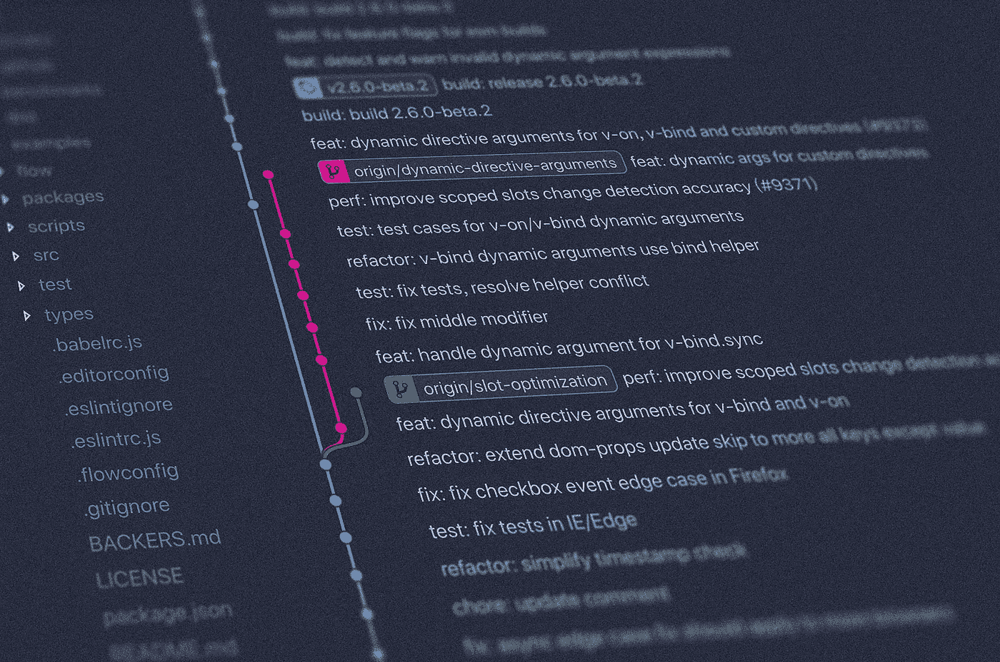
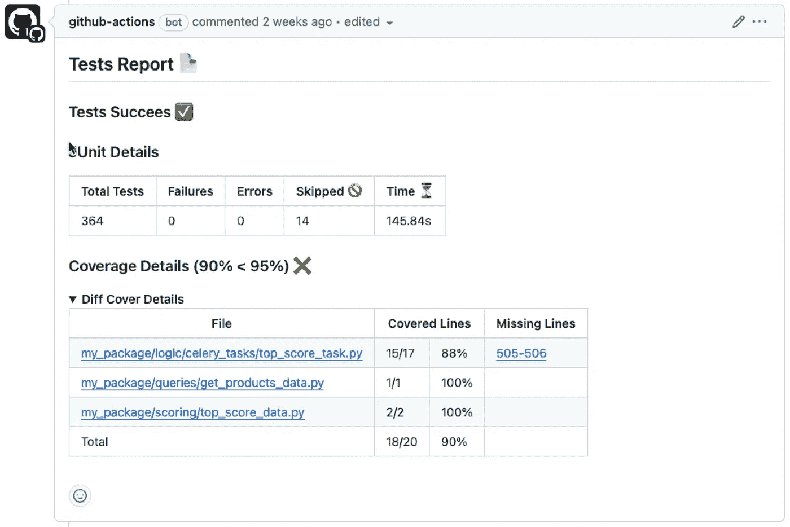
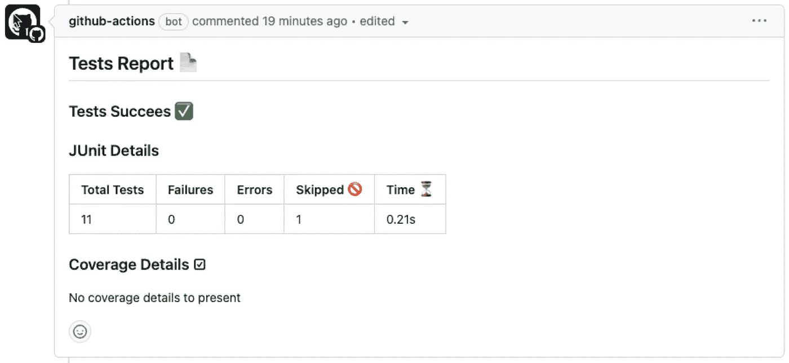

# 立即测试并覆盖你的代码！

> 原文：[`towardsdatascience.com/test-and-cover-your-code-today-e80c27d08dab?source=collection_archive---------9-----------------------#2023-12-21`](https://towardsdatascience.com/test-and-cover-your-code-today-e80c27d08dab?source=collection_archive---------9-----------------------#2023-12-21)



照片由 [Yancy Min](https://unsplash.com/@yancymin?utm_source=medium&utm_medium=referral) 提供，来自 [Unsplash](https://unsplash.com/?utm_source=medium&utm_medium=referral)

## 为你的代码库添加激励 GitHub Action 的实用指南

[](https://itay-bittan.medium.com/?source=post_page-----e80c27d08dab--------------------------------)[](https://towardsdatascience.com/?source=post_page-----e80c27d08dab--------------------------------) [Itay Bittan](https://itay-bittan.medium.com/?source=post_page-----e80c27d08dab--------------------------------)

·

[关注](https://medium.com/m/signin?actionUrl=https%3A%2F%2Fmedium.com%2F_%2Fsubscribe%2Fuser%2F43233e94ad28&operation=register&redirect=https%3A%2F%2Ftowardsdatascience.com%2Ftest-and-cover-your-code-today-e80c27d08dab&user=Itay+Bittan&userId=43233e94ad28&source=post_page-43233e94ad28----e80c27d08dab---------------------post_header-----------) 发表在 [Towards Data Science](https://towardsdatascience.com/?source=post_page-----e80c27d08dab--------------------------------) · 5 分钟阅读 · 2023 年 12 月 21 日 [](https://medium.com/m/signin?actionUrl=https%3A%2F%2Fmedium.com%2F_%2Fvote%2Ftowards-data-science%2Fe80c27d08dab&operation=register&redirect=https%3A%2F%2Ftowardsdatascience.com%2Ftest-and-cover-your-code-today-e80c27d08dab&user=Itay+Bittan&userId=43233e94ad28&source=-----e80c27d08dab---------------------clap_footer-----------)

--

[](https://medium.com/m/signin?actionUrl=https%3A%2F%2Fmedium.com%2F_%2Fbookmark%2Fp%2Fe80c27d08dab&operation=register&redirect=https%3A%2F%2Ftowardsdatascience.com%2Ftest-and-cover-your-code-today-e80c27d08dab&source=-----e80c27d08dab---------------------bookmark_footer-----------)

我先做一个坦白：作为一名软件工程师，我曾经讨厌并且避免编写测试多年。我遇到过许多尘封的项目——有些根本没有测试，有些有测试但从未在 CI/CD 管道中运行过，还有一些则包含了非常差的测试覆盖率。

一方面，我们应该编写测试有很多理由，但另一方面，也有更多的借口（或“理由”）让我们跳过这些测试。

在追求专业的过程中，我总是羡慕那些光鲜的 100% 测试覆盖率的开源仓库，并在日常的仓库中梦寐以求。四年前，在为此事苦恼时，我发现了 [diff-cover](https://github.com/Bachmann1234/diff_cover)，这是一个很棒的开源项目，使命简单——用测试覆盖 **自己的** 更改。以下是作者的描述：

> 差异覆盖率是由测试覆盖的新或修改的代码行的百分比。这为代码审查提供了一个清晰且可实现的标准：如果你修改了一行代码，那么这行代码应该被测试覆盖。代码覆盖率是每位开发者的责任！

简而言之，diff-cover 假设你正在使用 [Git](https://git-scm.com/) 并运行一个覆盖工具。使用 git 可以轻松获取 **你的** 修改行号，并将其与你最喜欢的覆盖工具的未覆盖行号进行比较。几乎所有的覆盖工具都能生成统一且通用的 XML 格式，无论你的代码语言是什么（Python、JavaScript 等）。

总结一下，我迄今为止在 CI 中进行的过程是：

1.  使用 [pytest](https://pypi.org/project/pytest/) 和 [pytest-cov](https://pypi.org/project/pytest-cov/) 包运行所有测试和覆盖工具：

```py
py.test -o junit_family=xunit2 --junitxml result.xml -xv --ff --cov-config=.coveragerc --cov=<my_package> --cov-report=xml --cov-report=term <tests_package>
```

（注意，它将创建 *coverage.xml* 和 *result.xml* 报告文件）。

2\. 运行 diff-cover 工具，使用 [diff-cover](https://pypi.org/project/diff-cover/) 包：

```py
diff-cover coverage.xml --compare-branch=origin/master
```

这将打印出类似以下的输出：

```py
-------------
Diff Coverage
Diff: origin/master...HEAD, staged and unstaged changes
-------------
my_package/connections/snowflake_client.py (100%)
my_package/logic/celery_tasks/top_score_task.py (100%)
my_package/queries/build_algorithm_studio_dataframes.py (100%)
-------------
Total:   16 lines
Missing: 0 lines
Coverage: 100%
-------------
```

从上面的输出中可以看出，我在 3 个不同的文件中进行了更改，每个文件都完全覆盖了（我不得不添加一些新的测试，而其他现有的测试已经覆盖了我所做的更改）。

看到每个 PR（拉取请求）上的差异覆盖报告使每个人都沉迷于达到 100%。我们想证明我们对自己的更改负责并且能够覆盖它们，而不是被视为失败者而获得低覆盖率。此外，作为副作用，我们在 PR 中经历了更小的、增量的更改，这也是另一种 [最佳实践](https://www.awesomecodereviews.com/best-practices/code-review-best-practices/#small)。这因为现在每个人在添加冗余代码行之前都会三思而后行。

经过几年的使用这种方法，我们看到我们仓库的整体覆盖率持续增加。因此，我们的生产稳定性也有所提升。

## 新的 GitHub Action

几个月前，我才华横溢的同事 [Asaf Gallea](https://medium.com/@asafgallea) 决定将这成功转化为一种更简单但更强大的 [新 GitHub Action](https://github.com/aGallea/tests-coverage-report)。该 Action 应用了与 diff-cover 相同的理念，并生成了一个友好的报告作为 Pull Request 中的评论，提供未覆盖行的链接，以防你遗漏了什么。新的行动还允许你设置最小覆盖率阈值（默认为 80%），否则 [状态检查](https://docs.github.com/en/pull-requests/collaborating-with-pull-requests/collaborating-on-repositories-with-code-quality-features/about-status-checks) 将会失败，你将无法合并你的更改：



测试覆盖率行动报告（作者提供的图片）

在上面的图片中，我们看到 GitHub Action 报告的示例。存在一个 95% 的最小阈值，在此 Pull Request 中更改了 20 行代码，其中 18 行被测试覆盖，两个行，505–506 行未被覆盖。由于我们仅对更改的文件实现了 90% 的覆盖率，状态检查失败，因此无法将其合并到主分支。

请注意，这份报告没有提及仓库的总覆盖率。它可能很低（60%），但任何新的更改必须通过 95% 的覆盖率测试，因此最终总覆盖率会增加。

## 在你的仓库中设置 tests-coverage-report 行动

就这样！现在让我们在 **你的** 仓库中通过几个步骤添加这个行动。我将假设这是一个 Python 项目，但你也可以将其添加到不同编程语言的项目中。

在仓库的根文件夹中，如果 `.github/workflows` 文件夹尚不存在，请创建它。现在，在 `workflows` 文件夹中创建一个名为 *test.yml* 的新文件，内容如下：

```py
# This workflow will install Python dependencies, run tests check the coverage

name: Test with coverage

on:
  pull_request:

jobs:
  test:

    runs-on: ubuntu-latest

    steps:
    - uses: actions/checkout@v3
    - uses: actions/setup-python@v3
      with:
        python-version: 3.10
    - name: Install Dependencies
      run: |
        python -m pip install --upgrade pip
        pip install pytest pytest-cov
    - name: Test with pytest
      run: py.test -o junit_family=xunit2 --junitxml result.xml -v --ff --cov=<my_package> --cov-report=xml --cov-report=term <my_tests>
    - name: Coverage Report
      if: always()
      uses: aGallea/tests-coverage-report@1.3.1
      with:
        min-coverage-percentage: '100'
        fail-under-coverage-percentage: 'true'
        cobertura-path: ./coverage.xml
        junit-path: ./result.xml
```

确保将上面的 *<my_package>* 和 *<my_tests>* 替换为你的包名和测试文件夹名称。

就这样！如果你打开一个新的 Pull Request 来添加这个文件，行动应该会自动触发，你将看到报告：



空的测试覆盖率行动报告（作者提供的图片）

请注意，由于包文件（源文件）没有变化，因此没有覆盖率细节可以展示。上面的图片取自[我的 Pull Request](https://github.com/itayB/serversion/pull/14)，当时我将测试覆盖率行动添加到我的一个公共仓库中。

# 总结

你刚刚完成了将改变你生活并使你成为更好开发者的第一个行动（双重含义）。我们的这一代人对点赞、鼓掌、好评和像我们这样的极客展示我们的专业性充满了依赖，甚至还希望通过 100% 覆盖率报告来展现。我们希望收到关于此行动的反馈、建议和功能请求，以提升你的测试体验和动力。
