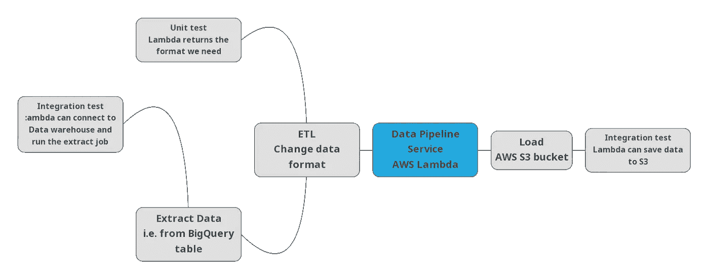
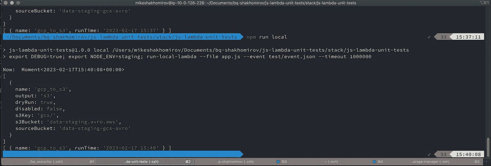
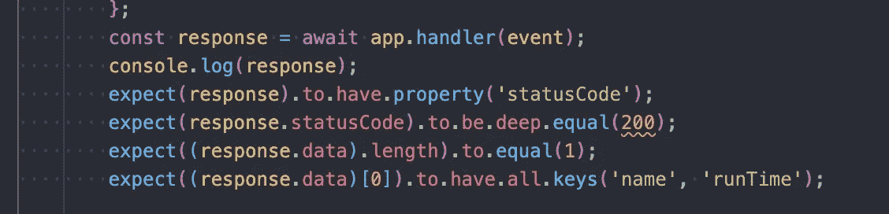
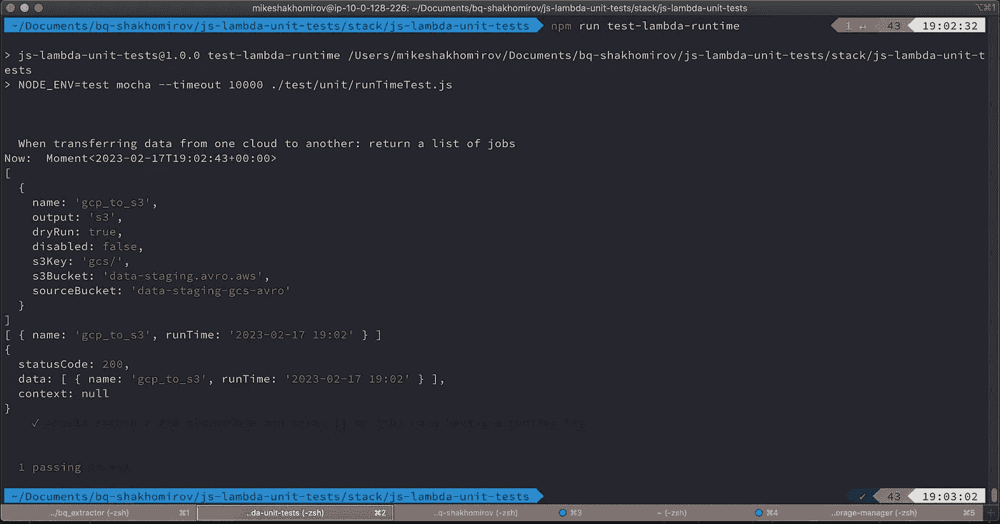
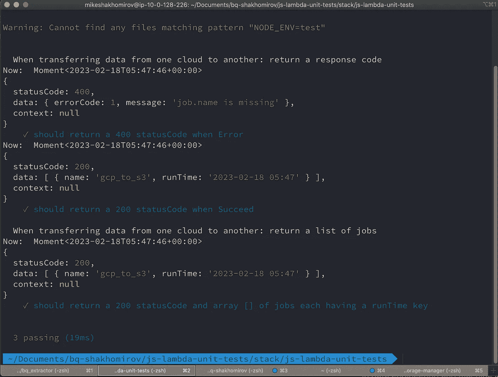

# 以有趣和简单的方式测试数据管道

> 原文：[`towardsdatascience.com/test-data-pipelines-the-fun-and-easy-way-d0f974a93a59`](https://towardsdatascience.com/test-data-pipelines-the-fun-and-easy-way-d0f974a93a59)

## 初学者指南：为什么单元测试和集成测试对你的数据平台如此重要

[](https://mshakhomirov.medium.com/?source=post_page-----d0f974a93a59--------------------------------)[](https://towardsdatascience.com/?source=post_page-----d0f974a93a59--------------------------------) [💡Mike Shakhomirov](https://mshakhomirov.medium.com/?source=post_page-----d0f974a93a59--------------------------------)

·发表于 [Towards Data Science](https://towardsdatascience.com/?source=post_page-----d0f974a93a59--------------------------------) ·阅读时间 10 分钟·2023 年 2 月 22 日

--


照片来自 [Simon Wilkes](https://unsplash.com/@simonfromengland?utm_source=medium&utm_medium=referral) 在 [Unsplash](https://unsplash.com/?utm_source=medium&utm_medium=referral)

这个故事适合那些希望学习如何编写代码以及如何运行 **测试、自动化 CI/CD 检查并在包括本地在内的任何环境中运行它们的人。**

**单元测试** 现在是机器学习工程师必备的技能。这在你的简历上看起来很棒，并且提高了就业的机会。

我是一个数据工程师，通常需要创建微服务 **来处理数据（ETL）。** 根据任务的不同，我们可能会做以下工作（不是详尽无遗的列表）：

+   从一个源提取数据并将其传递到另一个源。

+   在处理数据的过程中进行转换，例如：更改格式、个人信息遮蔽等。

+   将数据加载到其他地方，例如数据仓库解决方案。

在这些情况下，我们希望保证我们的数据服务按要求执行，并且随着我们进行更改，会运行自动化测试以确保逻辑一致性。

> 简化

我使用简单的原子设计来构建我构思中的数据管道的每个部分，并通过 AWS Lambda 或 Cloud Functions（Google Cloud Platform）进行部署。通过这种方式，我们可以轻松地进行编排，ML Ops 变得轻而易举。

# 测试类型

在单元测试中，代码行为通过微小的、独立的单元或单元测试进行测试。

我们想要测试的内容取决于我们的微服务逻辑和基础设施，但通常是这样的：

+   简单的 **单元测试** 用于函数逻辑，例如你微服务中的 `processEvent()` 函数。

    我们希望确保这个特定的函数在提供输入时始终返回预期的结果。

+   **集成测试**

    这将是我们需要测试服务如何与其他服务协同工作时的情况，即它发送请求并收到响应。

# 什么是好的单元测试？

+   它应该测试预期结果与实际结果。

+   应该描述脚本逻辑，以对应使用场景。

+   它应该是自动化的。

+   保持独立（测试不应相互进行设置或拆解）

+   应该易于实现。

+   保持可重复性：任何人都应该能够在任何环境中运行它。

+   一旦编写完成，它应该保留以备将来使用。

让我们设想一个简单的 **场景**，我们被要求创建一个数据管道，将数据从一个云平台转移到另一个云平台，例如从 GCP 转移到 AWS，并在过程中进行一些 ETL 操作：



服务架构及测试。图片由作者提供。

我们可以使用 AWS Lambda 或 Cloud Functions 创建一个简单的 **微服务** 来处理该管道。

这可以是任何管道，采用这种方式我们可以根据需要部署任意数量的数据管道。

[](/data-pipeline-design-patterns-100afa4b93e3?source=post_page-----d0f974a93a59--------------------------------) ## 数据管道设计模式

### 选择合适的架构示例

towardsdatascience.com

# 创建数据服务

这将是一个简单的原子设计，用于执行单一操作的无服务器微服务。

如果你是 Python 用户，不必担心，我有一个类似的故事，讲述如何用 **Python** 和 **AWS Lambda** 编写 **集成** 测试。不过，这个故事只是为了展示如何为你的数据管道执行测试。**

让我们创建我们的服务……

在命令行中运行：

```py
mkdir js-lambda-unit-tests
cd js-lambda-unit-tests
mkdir stack
cd stack
mkdir js-lambda-unit-tests
cd js-lambda-unit-tests
```

> *现在我们可以在代码编辑器中打开它并开始编码……*

# 我们的应用结构

```py
.
├── app.js
├── node_modules
├── package-lock.json
├── package.json
└── test
    ├── event.json
    └── unit
        ├── lambdaResponseTest.js
        └── runTimeTest.js
```

让我们创建我们的 `app.js`

```py
exports.handler = async(event) => {

    try {
        const jobs = event.jobs;
        const successfullJobs = await processEvent(jobs);

        return {
            'statusCode': 200,
            'data': successfullJobs },
            'context': context ? context.succeed() : null,
        ;

    } catch (e) {
        console.log(e);
        return {
            'statusCode': 400,
            'data': e 
            'context': context ? context.done() : null,
        };
    }
};
```

简单，对吧？我们正在学习编码。让我们从简单的事情开始，之后总是可以添加许多其他有用的功能。

要 *初始化* 你的应用，你可以运行 `npm init` 或简单地复制我的 package.json 文件，然后运行 `npm install` 命令。

这些是我们将要使用的包：

```py
...
"author": "Mike Shakhomirov mike.shakhomirov@gmail.com",
  "license": "ISC",
"devDependencies": {
    "aws-sdk": "2.804.0",
    "run-local-lambda": "1.1.1",
    "eslint": "⁷.20.0",
    "eslint-plugin-classes": "⁰.1.1",
    "eslint-plugin-promise": "⁴.3.1",
    "mocha": "⁷.1.1",
    "chai": "⁴.2.0"
  },
  "dependencies": {
    "moment": "².24.0"
  }
...
```

再次，这很简单，对吧？实际上，我们只会使用必要的内容继续前进。

+   `aws-sdk`添加到开发依赖中，这样它就不会进入我们的 Lambda 包 zip。AW 服务默认使用此包，在其`runtime`中没有必要单独安装。

+   `eslint` 相关包适用于开发，不需要解释原因。

> *这使你的代码看起来既漂亮又一致。*

+   `run-local-lambda` 只是一个用于本地演示目的的 Lambda 运行替代方案。

+   `mocha` 和 `chai` 是我们最终需要的测试工具。

# 添加一个事件以触发服务

我们的数据工程任务将来自于触发我们服务的`event`。这个事件可以由另一个数据服务触发，例如 orchestrator Lambda 或 AWS Cloudwatch，以便按计划运行。

让我们创建 `./test/event.js` 即：

```py
{   "configOverride": false,
    "jobs": [

        {
            "name": "gcp_to_s3",
            "output": "s3",
            "dryRun": true,
            "disabled": false,
            "s3Key": "gcs/",
            "s3Bucket": "data-staging.avro.aws",
            "sourceBucket": "data-staging-gcs-avro"
        }
]
}
```

在这个示例中，我们定义了一个作业配置，以将数据从一个云服务迁移到另一个，即从 Google Cloud Storage 到 AWS S3。这是数据工程中几乎每天都要执行的简单任务。我们还提供 `configOverride` 参数，以告诉我们的服务是否使用自定义事件或配置文件中定义的事件。例如，它可以是需要每天、每小时等运行的任务。

# 添加 processEvent() 函数

现在让我们添加 `processEvent()` 函数。它将对事件数据做一些简单的处理，即返回当前 `DATE`

```py
const processEvent = async(jobs) => {
    const now = moment.utc();
    const jobList = [];
    for (const job of jobs) {
        const jobTime = now.format('YYYY-MM-DD HH:mm');
        jobList.push({
            name: job.name,
            runTime: jobTime,
        })
    }
    return jobList;
};
```

现在让我们将这段代码添加到 `app.js`：

```py
const moment = require('moment');

exports.handler = async(event, context) => {

    console.log('Now: ', moment());
    try {
        const jobs = event.jobs;
        const successfullJobs = await processEvent(jobs);

        return {
            'statusCode': 200,
            'data': successfullJobs,
            'result': context.succeed() 
        };

    } catch (e) {
        console.log(e);
        return {
            'statusCode': 400,
            'data': e,
            'result': context.done() 
        };
    }
};

const processEvent = async(jobs) => {
    const now = moment.utc();
    console.log(jobs);
    const jobList = [];
    for (const job of jobs) {
        const jobTime = now.format('YYYY-MM-DD HH:mm');
        jobList.push({
            name: job.name,
            runTime: jobTime,
        })
        console.log(jobList);
    }
    return jobList;
};
```

最后，让我们在 `package.json` 文件中添加一个新脚本，以便使用来自 `./test/event.json` 的事件运行 `run-local-lambda`：

```py
...
  "scripts": {
    "local": "export DEBUG=true; export NODE_ENV=staging; run-local-lambda --file app.js --event test/event.json --timeout 1000000",
    "test": "test"
  },
...
```

现在我们可以在命令行中运行 `npm run local` 来本地测试 Lambda：



图片由作者提供。

所以我们看到它在本地运行时工作正常并返回了一些内容。

> 这真是个好消息，但我们如何进行 `unit-test`？

# 使用 Mocha 和 Chai 对我们的数据服务进行单元测试


首先，为什么使用 `mocha` 和 `chai`？

**Mocha** 是一个出色的测试框架，我们可以递归地运行测试文件夹中的所有测试，即 `npm run test` 将运行 `test1.js`、`test2.js`、...、`testN.js`。它实现了以下功能：

+   使用任何断言库（这就是我们将使用 Chai 的地方）

+   异步测试

+   测试覆盖率报告

**Chai** 是一个 NodeJS 的断言库，可以与 Mocha 配合使用，以在我们的测试中提出断言。



图片由作者提供。

让我们添加几个单元测试。一个将测试 Lambda 是否返回带有 `runTime` 的结果，另一个将检查 Lambda 是否返回具有正确状态码的响应。

让我们创建 `stack/js-lambda-unit-tests/test/unit/runTimeTest.js`：

```py
const chai = require('chai');
const expect = chai.expect;

const app = require('../../app');

describe('When transferring data from one cloud to another: return a list of jobs', () => {
    before(async() => {

    });

    beforeEach(async() => {

    });

    after(async() => {

    });

    afterEach(async() => {

    });

    it('should return a 200 statusCode and array [] of jobs each having a runTime key', async() => {
        const event = { 'configOverride': true,
            'jobs': [
                {
                    'name': 'gcp_to_s3',
                    'output': 's3',
                    'dryRun': true,
                    'disabled': false,
                    's3Key': 'gcs/',
                    's3Bucket': 'data-staging.avro.aws',
                    'sourceBucket': 'data-staging-gcs-avro',
                },
            ],
        };
        const response = await app.handler(event);
        console.log(response);
        expect(response).to.have.property('statusCode');
        expect(response.statusCode).to.be.deep.equal(200);
        expect((response.data).length).to.equal(1);
        expect((response.data)[0]).to.have.all.keys('name', 'runTime');

    });

});
```

现在让我们将这个单元测试添加到 `package.json` 的脚本中，因为有时我们可能只需要运行一个测试：

```py
...
"scripts": {
    "local": "export DEBUG=true; export NODE_ENV=staging; run-local-lambda --file app.js --event test/event.json --timeout 1",
    "test-lambda-runtime": "NODE_ENV=test mocha --timeout 10000 ./test/unit/runTimeTest.js",
...
```

现在如果我们在命令行中运行 `npm run test-lambda-runtime`



图片由作者提供。

现在让我们添加第二个测试，但这次我们希望给我们的 lambda 添加新行为，即：

> 它在出错时必须返回状态 `400`。

为了模拟错误，我们将提供一个缺少作业 `name` 的事件。我们的 `./test/unit/lambdaResponseTest.js` 应该是这样的：

```py
const chai = require('chai');
const expect = chai.expect;

const app = require('../../app');

describe('When transferring data from one cloud to another: return a response code', () => {
    before(async() => {

    });

    beforeEach(async() => {

    });

    after(async() => {

    });

    afterEach(async() => {

    });

    it('should return a 400 statusCode when Error', async() => {
        const event = { 'configOverride': true,
            'jobs': [
                {
                    'name_missing': 'gcp_to_s3',
                    'output': 's3',
                    'dryRun': true,
                    'disabled': false,
                    's3Key': 'gcs/',
                    's3Bucket': 'data-staging.avro.aws',
                    'sourceBucket': 'data-staging-gcs-avro',
                },
            ],
        };
        const response = await app.handler(event);
        console.log(response);
        expect(response).to.have.property('statusCode');
        expect(response.statusCode).to.be.deep.equal(400);

    });

    it('should return a 200 statusCode when Succeed', async() => {
        const event = { 'configOverride': true,
            'jobs': [
                {
                    'name': 'gcp_to_s3',
                    'output': 's3',
                    'dryRun': true,
                    'disabled': false,
                    's3Key': 'gcs/',
                    's3Bucket': 'data-staging.avro.aws',
                    'sourceBucket': 'data-staging-gcs-avro',
                },
            ],
        };
        const response = await app.handler(event);
        console.log(response);
        expect(response).to.have.property('statusCode');
        expect(response.statusCode).to.be.deep.equal(200);

    });

});
```

让我们在 `app.js` 中添加错误处理：

```py
// in lambda.handler add this:

...
        if (successfullJobs.errorCode) {
            throw successfullJobs;
        }
...
// in processEvent() add this:
...
            if (typeof job.name === 'undefined') {
                throw { errorCode: 1, message: 'job.name is missing' };
            }

...
```

所以最终的 `app.js` 应该是这样的：

```py
/* eslint-disable no-throw-literal */
const moment = require('moment');

exports.handler = async(event, context) => {

    console.log('Now: ', moment());
    try {
        const jobs = event.jobs;
        const successfullJobs = await processEvent(jobs);

        if (successfullJobs.errorCode) {
            throw successfullJobs;
        }
        console.log(successfullJobs);

        return {
            'statusCode': 200,
            'data': successfullJobs,
            'context': context ? context.succeed() : null,
        };

    } catch (e) {
        return {
            'statusCode': 400,
            'data': e,
            'context': context ? context.done() : null,

        };

    }
};

const processEvent = async(jobs) => {
    const now = moment.utc();
    console.log(jobs);
    const jobList = [];
    for (const job of jobs) {

        try {
            if (typeof job.name === 'undefined') {
                throw { errorCode: 1, message: 'job.name is missing' };
            }
            const jobTime = now.format('YYYY-MM-DD HH:mm');
            jobList.push({
                name: job.name,
                runTime: jobTime,
            });

        } catch (error) {
            return error;
        }

    }
    return jobList;
};
```

现在让我们将 `package.json` 脚本更改为以下内容：

```py
...
"scripts": {
    "local": "export DEBUG=true; export NODE_ENV=staging; run-local-lambda --file app.js --event test/event.json --timeout 1",
    "test-lambda-runtime": "NODE_ENV=test mocha --timeout 10000 ./test/unit/runTimeTest.js",
    "test-lambda-response": "NODE_ENV=test mocha --timeout 10000 ./test/unit/lambdaResponseTest.js",
    "test-unit": "NODE_ENV=test mocha NODE_ENV=test --exit --recursive ./test/unit",
    "test-integration": "NODE_ENV=test mocha --delay --exit --require ./test/fixtures/bigquery-integration-bootstrap.js --timeout 100000 ./test/integration/multiCategoryArchiveTest.js"
  },
```

```

你可能注意到了一个新的脚本，用于递归运行 `./test/unit` 文件夹中的命令。 `npm run test-unit` 将运行所有测试：



图片由作者提供。

你可能注意到 `package.json` 中有一个集成测试脚本。有关集成测试的更多信息可以在这里找到：

[](https://mydataschool.com/blog/data-platform-unit-and-integration-tests-explained/?source=post_page-----d0f974a93a59--------------------------------) [## 数据平台单元测试和集成测试解释

### 如何进行这个练习以及如何将其应用于我们的数据管道？这是我在非常初期时问自己的一个好问题……

mydataschool.com](https://mydataschool.com/blog/data-platform-unit-and-integration-tests-explained/?source=post_page-----d0f974a93a59--------------------------------)

集成测试是指测试我们的应用程序如何与其他东西互动，即另一个服务或 API。

# 结论

在数据工程和机器学习中，测试常常用于确保新代码更改不会引入意外修改，并帮助描述数据平台的基本核心功能。

对于任何机器学习工程师来说，这是一个必备技能。习惯于阅读测试可能会让人不舒服，但你会受益于今天开始培养这项技能。

在每份简历上看起来都很棒，并且任何编程语言的理念都是相同的。确保你将**Pytest**、Mocha、Chai、Sinon 及类似 Mock 的工具添加到你的测试工具中。

# Github 仓库

[`github.com/mshakhomirov/js-lambda-unit-tests.git`](https://github.com/mshakhomirov/js-lambda-unit-tests.git)

# 推荐阅读

1.  [`mochajs.org/`](https://mochajs.org/)

1.  [`www.chaijs.com/api/bdd/`](https://www.chaijs.com/api/bdd/)

1.  [`stackoverflow.com/questions/52019039/how-to-test-aws-lambda-handler-locally-using-nodejs`](https://stackoverflow.com/questions/52019039/how-to-test-aws-lambda-handler-locally-using-nodejs)

1.  [`stackoverflow.com/questions/54846513/lambda-trigger-callback-vs-context-done`](https://stackoverflow.com/questions/54846513/lambda-trigger-callback-vs-context-done)

1.  [`opensourceforgeeks.blogspot.com/2019/03/writing-unit-tests-for-aws-lambda-in.html`](http://opensourceforgeeks.blogspot.com/2019/03/writing-unit-tests-for-aws-lambda-in.html)

1.  [`dashbird.io/blog/test-javascript-lambda-functions/`](https://dashbird.io/blog/test-javascript-lambda-functions/)

1.  [`docs.aws.amazon.com/lambda/latest/dg/nodejs-context.html`](https://docs.aws.amazon.com/lambda/latest/dg/nodejs-context.html)

1.  [`www.google.com/search?client=firefox-b-d&q=aws+lambda+test+TypeError%3A+context.done+is+not+a+function`](https://www.google.com/search?client=firefox-b-d&q=aws+lambda+test+TypeError%3A+context.done+is+not+a+function)
