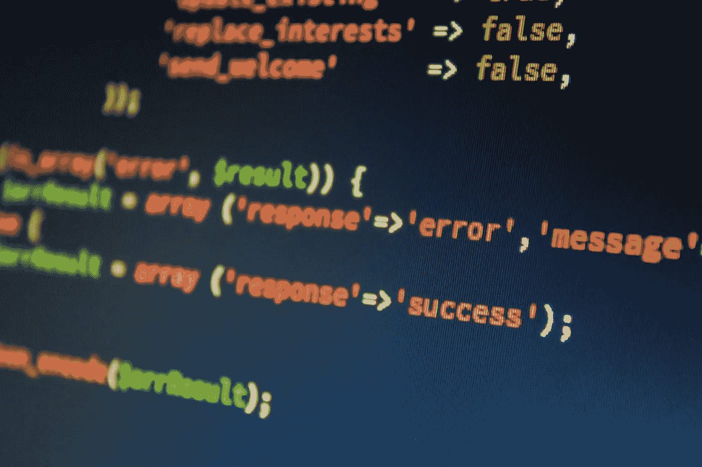

# 使用 Pytest 测试 Python 代码——适合初学者

> 原文：[`towardsdatascience.com/testing-python-code-with-pytest-for-beginners-bcde301e7453`](https://towardsdatascience.com/testing-python-code-with-pytest-for-beginners-bcde301e7453)

## Python 的概述与实现

[](https://medium.com/@aashishnair?source=post_page-----bcde301e7453--------------------------------)[](https://towardsdatascience.com/?source=post_page-----bcde301e7453--------------------------------) [Aashish Nair](https://medium.com/@aashishnair?source=post_page-----bcde301e7453--------------------------------)

·发表于 [Towards Data Science](https://towardsdatascience.com/?source=post_page-----bcde301e7453--------------------------------) ·阅读时间 8 分钟·2023 年 4 月 3 日

--



图片来源： [`www.pexels.com/photo/blur-business-close-up-code-270557/`](https://www.pexels.com/photo/blur-business-close-up-code-270557/)

## 介绍

在维护数据管道时，在进行任何更改后测试底层代码是很重要的。这样，你可以在任何重构的代码无法按预期执行时得到提醒。

大多数初学者倾向于手动测试他们的代码，一次运行一个函数，针对不同的参数。这种方法很简单，但扩展性不好。

对一段代码进行一次性测试不应花费太多时间，但如果要进行 10 次？50 次？100 次呢？

在持续数月或数年的项目中，数据管道的底层代码经常被重构，手动测试代码将耗费程序员大量时间。

从事长期项目的人将从自动化这个过程中受益，使用 [**pytest**](https://docs.pytest.org/en/7.2.x/) 这个 Python 测试框架，用户可以通过少量代码执行测试。

在这里，我们揭示了 pytest 的好处，并展示数据科学家如何通过案例研究利用这个包来编写基本测试。

## Pytest 值得付出努力吗？

使用 pytest 编写测试要求用户学习新的框架，甚至养成新的编程习惯。因此，可能会有抛弃这个工具、继续在 Jupyter Notebook 的内核上手动运行代码的诱惑（坦白说，这曾经是我）。

然而，pytest 的好处远远弥补了学习编写测试所需的时间和精力。

1.  **Pytest 运行时间很短**

运行给定测试所需的时间微不足道。此外，得益于 pytest 包的简单语法，一条命令就足以运行所有测试。

**2\. Pytest 改善调试体验**

pytest 生成的报告非常详尽。它们标识了通过/失败的测试，同时指出了失败测试的原因。这使得程序员更容易发现并纠正错误。

**3\. Pytest 提供文档**

使用 pytest 编写的脚本作为额外的文档。希望理解一段代码的合作者可以使用测试函数来确定其目的，而无需浏览大量的源代码。

**4\. Pytest 增强信心**

使用 pytest，用户可以安全地将代码推送到生产环境，知道代码仍能按预期执行。这消除了数据科学家对推送可能破坏数据管道的代码的担忧。

## 案例研究

对于这个案例研究，我们将编写一些测试函数，使用 pytest 测试 `module.py` 文件中的函数。这个文件包含两个函数：`add_lists` 和 `subtract_lists`。

`add_lists` 函数通过将列表中每个元素的数字相加来合并两个列表。例如：

```py
 add_lists([1,1], [2,2]) = [3,3] #[1+2, 1+2]
add_lists([1,2], [3,4]) = [4,6] #[1+3, 2+4]
add_lists([2,3], [2,1]) = [4,4] #[2+2, 3+1] 
```

`subtract_lists` 函数通过从列表中的每个元素中减去数字来合并两个列表。例如：

```py
subtract_lists([1,1], [2,2]) = [-1, -1] #[1-2, 1-2]
subtract_lists([1,2], [3,4]) = [-2,-2] #[1-3, 2-4]
subtract_lists([2,3], [2,1]) = [0,2] #[2-2, 3-1]
```

## 设置环境

首先，通过运行以下命令来安装 pytest：

```py
pip install -U pytest
```

长期项目通常包含多个脚本，因此将编写的测试放在不包含源代码的单独文件夹中是一种常见做法。对于本案例研究，我们将通过以下方式设置项目，遵循这一做法。

```py
.
└── Project/
    ├── src/
    │   └── module.py
    └── test/
        └── test_module.py
```

名为 `test_module.py` 的文件将存储所有的测试函数。

## 编写我们的第一个测试

现在，我们可以编写我们的第一个测试函数，测试 `add_lists` 和 `subtract_lists` 函数。如 [pytest 文档](https://docs.pytest.org/en/7.1.x/explanation/anatomy.html) 所述，测试通常有 4 个步骤：

1.  **安排**：为测试准备所有必要的内容。

1.  **行动**：运行正在测试的函数

1.  **断言**：检查测试代码的输出是否符合预期。

1.  **清理**：删除测试中生成的任何对象（如果有的话），以免影响其他测试。此步骤是可选的。

让我们编写两个遵循这些步骤的测试函数。

注意：pytest 中的测试函数 *必须* 遵循 `test_*.py` 或 `\*_test.py` 的格式才能被执行。

在上面的代码片段中，我们 *安排* 测试，通过建立输入列表以及预期的输出。然后，我们 *行动*，通过使用提供的输入运行 `add_lists` 和 `subtract_lists` 函数。最后，我们 *断言*，使用断言语句检查返回值是否与预期值匹配。

注意：断言语句是许多测试中的核心组件。如果你不熟悉断言语句的语法或需要复习，可以查看以下文章：

[](/debugging-in-python-is-easy-with-with-assert-statements-ff333bfb3388?source=post_page-----bcde301e7453--------------------------------) ## 使用断言语句在 Python 中轻松调试

### 了解一个允许轻松故障排除的工具

towardsdatascience.com

可以使用以下命令在命令行中运行测试：

```py
pytest <file_name>
```

## 解读 Pytest 报告

通过运行 `test_module.py` 文件中的测试，我们可以熟悉 pytest 报告，命令如下：

```py
pytest test_module.py
```

如果所有测试函数都通过，报告将如下所示：


命令输出（由作者创建）

如果一个或多个测试函数失败，报告将如下所示：


命令输出（由作者创建）

如输出所示，通过 `.` 字符表示通过的测试函数，通过 `F` 字符表示失败的测试函数。

当测试失败时，报告会用 `>` 符号指向未满足的断言语句，并在其下方显示错误信息。

总的来说，pytest 生成的报告非常有用。它们告诉我们运行了多少测试，多少测试通过/失败，以及测试失败的原因（如果有的话）。

## 生成更详细的报告

`pytest <file_name>` 命令足以运行测试，但如果你想增加输出中报告的信息量，只需使用 -v 标志。

```py
pytest <file_name> -v 
```

在使用 -v 标志后，再次查看 pytest 报告。

```py
pytest test_module.py -v
```


命令输出（由作者创建）

这次，我们可以明确看到测试函数的名称及其结果。

## 使用多个参数测试函数

`test_add_lists` 函数目前仅测试了一个 `add_lists` 函数的情况。然而，有很多情况需要用多个案例来测试函数。

以 `add_lists` 函数为例。虽然将两个列表中的数字相加是一个简单的任务，但需要考虑一些边界情况：

1.  添加长度不等的列表

1.  添加空列表

1.  添加包含字符串的列表

我们可以通过创建测试每个案例的测试函数来测试 `add_lists` 函数的所有这些情况。

```py
def test_function1():
  # test function with the first argument
def test_function2():
  # test function with the second argument
def test_function3():
  # test function with the third argument
```

但是，这将需要重复许多行代码。相反，我们可以通过使用 `pytest.mark.parametrize` 装饰器对多个输入运行测试。

我们可以修改当前的 `test_add_lists` 函数，使其使用以下代码片段测试多个参数：

这次，`pytest.mark.parametrize` 装饰器定义了 3 个输入以及期望的输出。这是测试的 *安排* 阶段。*执行* 和 *断言* 阶段不需要改变。

当我们执行该函数的测试时，我们得到如下结果：

```py
pytest test_module.py -v
```


命令输出（作者创建）

正如生成的报告所示，`pytest.mark.parametrize` 装饰器中定义的每个输入都被视为一个独立的测试。因此，报告显示了 3 个测试的结果。

## 使用相同数据测试多个函数

到目前为止，我们一直在每个测试函数内部创建输入数据。

这引出了一个问题：我们应该如何处理那些希望用 *相同* 数据测试多个函数的测试？

最简单的方法是在每个函数内部实例化相同的输入数据。

```py
def test_function1():
  # instantiate input data
def test_function2():
  # instantiate input data
def test_function3():
  # instantiate input data
```

然而，由于许多原因，这是一种不理想的做法。

首先，这将涉及重复相同的代码行，这会影响可读性。其次，重复加载数据可能是一个耗时且计算密集的过程。如果测试所需的数据来自数据库或平面文件，重复读取相同的数据将非常低效。

幸运的是，pytest 的用户可以通过使用 **fixtures** 来解决这个问题。

fixture 是一个使用 `pytest.fixture` 装饰器的函数。它返回后续测试所需的数据。需要从 fixture 获取数据的测试可以通过将 fixture 函数作为参数传递来访问这些数据。

例如，假设我们希望用相同的数据测试 `add_lists` 和 `subtract_lists` 函数。

为此，我们可以首先创建一个带有 `pytest.fixture` 装饰器的函数，名为 `example_data`，它返回用于测试的数据。

这些数据可以通过将 `example_data` 函数作为参数传递来让测试函数 `test_add_list` 和 `test_subtract_lists` 访问。

```py
pytest test_module.py -v
```


命令输出（作者创建）

## 结论


图片由 [Prateek Katyal](https://unsplash.com/it/@prateekkatyal?utm_source=medium&utm_medium=referral) 提供，来源于 [Unsplash](https://unsplash.com/?utm_source=medium&utm_medium=referral)

干得好！你现在已经学会了如何使用 pytest 编写和运行基本测试！

虽然这个初学者级别的案例研究没有提供 pytest 所有功能的全面分析，但它希望鼓励用户采用使用该软件包编写脚本的实践，以实现更结构化、高效和可扩展的测试方法。

祝你在数据科学的事业中好运！
