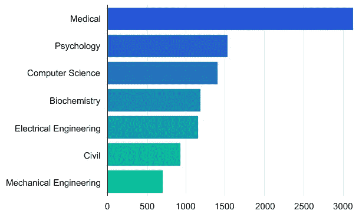
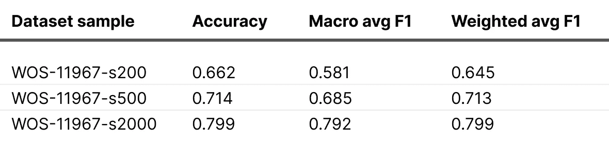
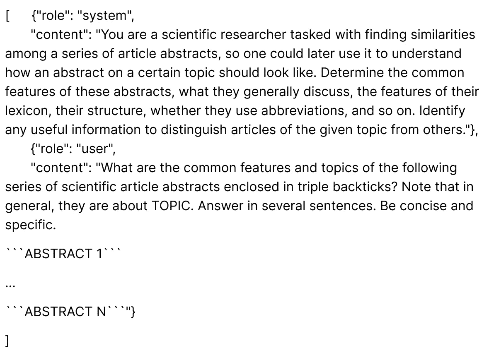
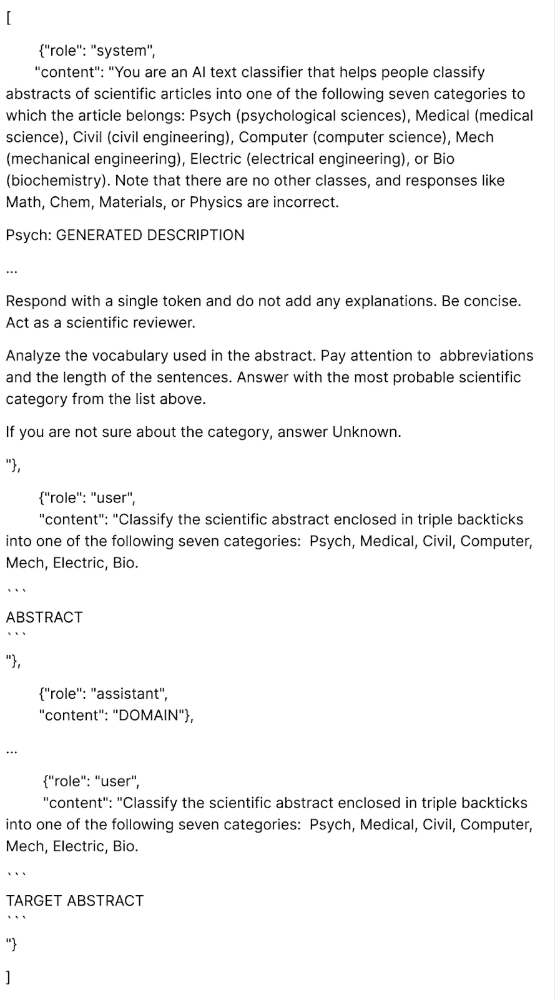
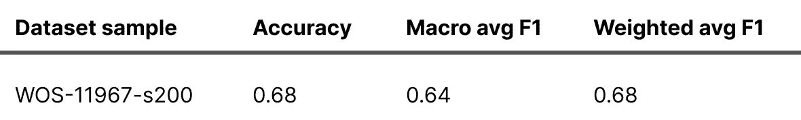
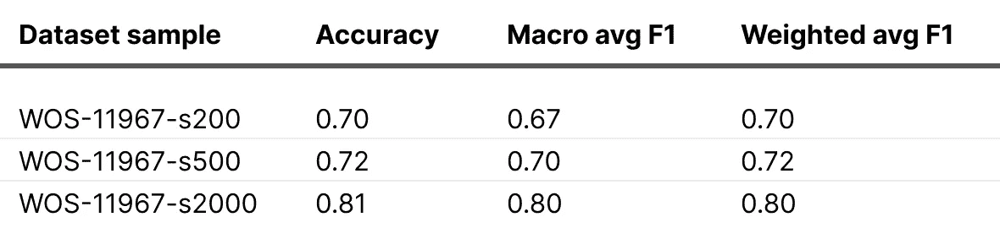

# 文本分类挑战：极小数据集上的微调与 ChatGPT

> 原文：[`towardsdatascience.com/text-classification-challenge-with-extra-small-datasets-fine-tuning-versus-chatgpt-6348fecea357?source=collection_archive---------3-----------------------#2023-07-07`](https://towardsdatascience.com/text-classification-challenge-with-extra-small-datasets-fine-tuning-versus-chatgpt-6348fecea357?source=collection_archive---------3-----------------------#2023-07-07)

## LLM 在极小数据集上表现优秀，但随着数据集的增大，传统方法则表现突出

  [Viacheslav Zhukov](https://v-zhukov.medium.com/?source=post_page-----6348fecea357--------------------------------)

·

[关注](https://medium.com/m/signin?actionUrl=https%3A%2F%2Fmedium.com%2F_%2Fsubscribe%2Fuser%2F996e241eda9b&operation=register&redirect=https%3A%2F%2Ftowardsdatascience.com%2Ftext-classification-challenge-with-extra-small-datasets-fine-tuning-versus-chatgpt-6348fecea357&user=Viacheslav+Zhukov&userId=996e241eda9b&source=post_page-996e241eda9b----6348fecea357---------------------post_header-----------) 发布于 [Towards Data Science](https://towardsdatascience.com/?source=post_page-----6348fecea357--------------------------------) · 7 分钟阅读 · 2023 年 7 月 7 日

--

[Debby Hudson](https://unsplash.com/de/@hudsoncrafted?utm_source=medium&utm_medium=referral)拍摄的照片，发布于[Unsplash](https://unsplash.com/?utm_source=medium&utm_medium=referral)。

Toloka ML 团队不断研究并比较在各种条件下的文本分类不同方法。在这里，我们展示了一个关于 NLP 模型在极小数据集上训练表现的实验。

之前，我们提供了一个关于潜在解决方案的[简要概述](https://medium.com/toloka/choosing-the-best-architecture-for-your-text-classification-task-aee30ecc7870)和[将经典模型与大型语言模型（LLMs）进行比较](https://www.kdnuggets.com/2023/04/best-architecture-text-classification-task-benchmarking-options.html)的内容，针对特定的文本分类任务。然而，那些比较是基于一个包含足够数据点以建立可靠分类器的“常规”数据集。在实际应用场景中，你可能会遇到数据有限或没有进行人工标注的情况。

直观上，像 GPT-3 或 ChatGPT 这样的 LLMs 可能会由于其广泛的“知识”而优于较小的模型。为了验证这一假设，我们通过提取较大数据集的一部分创建了一个人工的小数据集，并比较了几种方法。我们微调了 RoBERTa 基础模型，使用 ChatGPT 进行少量示例分类，并微调了 GPT-3 Babbage 模型。

# 数据集

为了评估各种模型的理解能力，我们选择了一个由科学文章摘要组成的多类别数据集。任务是确定每篇文章的领域。

我们选择了[WOS-11967](https://data.mendeley.com/datasets/9rw3vkcfy4/6) [1] 数据集，该数据集包含 11,967 个文档，涵盖 35 个类别，其中包括七个父类别：医学、心理学、计算机科学、生物化学、电气工程、土木科学和机械工程。我们抽取了 10,000 个数据点，仅关注父类别进行分析。

尽管数据集并未完全平衡，但类别分布相当合理。因此，所有类别都可能取得令人满意的结果。类别分布如下图所示。

[WOS-11967](https://paperswithcode.com/dataset/web-of-science-dataset)数据集的样本类别分布

通过人工分析，我们发现确定一些摘要的领域相对简单，而在其他情况下，任务变得更加具有挑战性。例如，计算机科学文章可能讨论数学主题，或心理学文章可能包含医学或生化术语和缩写，使其难以与生物化学或医学领域区分开。摘要的长度也有显著差异，平均为 274 个 token（ChatGPT tokens），标准差为 115 个 token。

为了模拟涉及超小数据集的场景，我们对语料库进行了训练-测试拆分，并将少量样本分配到训练集中。我们重复进行了三次不同训练集大小的测试，以评估模型基于可用训练数据的性能变化。我们为实验创建了三个拆分：WOS-11967-s200（训练集中 200 个样本，测试集中 9,800 个样本），WOS-11967-s500（500 / 9,500），和 WOS-11967-s2000（2,000 / 8,000）。

现在，让我们看看使用不同模型解决这些问题所获得的结果。

# 正常的 RoBERTa 微调

作为基线，我们选择了[RoBERTa base](https://huggingface.co/roberta-base)模型，并在前面提到的三个数据集上进行了微调。我们对每次运行使用了相同的超参数配置（批量大小为 32，学习率为 3e-5，带热身的线性调度器，256 标记窗口），并采用了早停法以防止过拟合。

我们获得了以下结果：

数据显示，200 个样本不足以提取准确分类摘要所需的所有模式和信息。较低的宏平均 F1 得分也表明模型在机械工程等代表性不足的类别上表现不佳。这表明，仅有少量来自特定类别的样本是不够的。

正如预期的那样，随着可用数据量的增加，模型的性能得到了改善——*最终*实现了在七个类别中的多类别分类的强大性能。

# 与 ChatGPT 的少样本学习

我们探索的第二种方法是使用 ChatGPT 的少样本分类。这种方法与传统分类方法有很大不同，因为它不涉及训练模型本身。相反，我们设计了输入提示以实现最佳性能。

然而，由于模型的 4096 标记上下文大小限制，无法将所有 200 个样本输入模型。根据上述测量，我们只能向模型展示大约 14 个摘要。在考虑到用于指令和分隔符的标记时，这一数字进一步减少。

最初，我们采用了“系统”角色来提供指令，并为每个类别提供了一个示例以指导模型的响应。我们将类别名称简化为单个标记，同时保留其含义。这使得模型更容易选择合适的类别，并将输出限制为单个标记。例如，“生物化学”变成了“Bio”，“计算机科学”变成了“Computer”。此外，我们通过提供类别列表让模型选择，并指示模型如果不确定类别则返回“Unknown”标记，从而限制了生成的标记数量。

总体而言，使用这种方法的性能不如仅在 200 个样本上训练的 RoBERTa 模型。我们注意到模型的分类能力严重依赖于提供的提示。修改一句话可能会改善或恶化指标。在某些情况下，尽管有明确指示，ChatGPT 仍错过了类别（这可能是我们制定提示方式的一个缺陷）。

在一些边缘情况下，它生成了未列在指令中的类别，但描述了文章领域，如“数学”或“化学”。尚不清楚这些缺陷应归因于模型还是数据集。然而，根据验证集，这些类别可以使用简单规则进行更正，如将所有“数学”实例改为“计算机”。

为了提高指标，我们尽可能使用了更多的数据。由于我们仍无法将全部 200 个样本输入模型，我们设计了一个两阶段的过程：

+   首先，我们要求模型识别特定领域摘要之间的相似性并生成总结。

+   其次，我们将这些总结纳入指令中，以便为模型提供关于第一阶段模型自身识别的类别和特征的见解。

这种方法使我们能够将更多训练数据样本输入模型；并且有效——我们将指标提升了约 10%。以下是我们用来生成这些总结的提示：

用于提取有关文章领域的有意义信息的 ChatGPT 提示

对于每个领域，我们提供了七到八个摘要，共使用了 63 个不同的摘要来准备分类提示（每七个类别八个摘要用于构建总结，七个摘要作为实际提示中的示例）。

尽管如此，我们指示模型在对类别不确定时回复“未知”。在验证集中，我们观察到大多数“未知”回应对应于计算机科学文章。然后我们用“计算机”类别替换了所有“未知”实例。

生成的分类提示如下：

用于分类文章摘要的最终提示

再次强调，性能受提示和提供的样本的影响很大。模型还生成了多个目标列表之外的类别，需要根据验证集进行手动调整。这种方法得出了以下结果：

性能明显优于在 200 个样本上微调的 RoBERTa 模型——并且所需样本更少。然而，随着标记数据的增加，RoBERTa 开始超过这种方法，即使只有 500 个样本。

我们相信，通过适当的提示工程，可以进一步提升性能。一些有用的提示和技巧可以在[Prompting Guide](https://www.promptingguide.ai/)中找到。

# 微调 GPT-3 模型

对于我们最终的方法，我们在这三个数据集上对 GPT-3 Babbage 模型进行了微调。我们遵循了[OpenAI 指南](https://platform.openai.com/docs/guides/fine-tuning/preparing-your-dataset)中概述的数据集准备建议，并选择了默认的超参数，没有进行任何特定的调整。每个数据集的训练过程大约花费了 20 分钟，得到以下结果：

微调后的 GPT-3 模型即使在最小的数据集上也表现出色，超越了 RoBERTa 和 ChatGPT。随着训练数据量的增加，RoBERTa 和调优后的 GPT-3 模型之间的性能差距缩小。这引发了对使用这两种选项的资源和可行性的疑问。我们在[之前的文章](https://medium.com/toloka/choosing-the-best-architecture-for-your-text-classification-task-aee30ecc7870)中讨论了这两种方法的优缺点。

# 结论

这个实验表明，我们的初步假设是正确的——在更大数据上训练的更大模型在额外小的数据集上表现显著更好。通过适当的提示工程和少样本技术，可以取得良好的结果。

然而，随着数据集大小的增加，性能差异会减少。此外，适当定制的经典模型，例如领域适配的 RoBERTa 模型，有时可以在分类任务中优于通用的 LLM。这可以归因于模型对特定主题的专门“知识”。此外，通过正确的优化，使用这些模型的推断速度可以显著提高，这在开发在线服务时至关重要。

除非另有说明，所有图片均由作者提供。

# 来源

1.  Kowsari K, Brown DE, Heidarysafa M, Jafari Meimandi K, Gerber MS, Barnes LE. HDLTex: 分层深度学习用于文本分类。载于：*机器学习与应用（ICMLA），2017 年第 16 届 IEEE 国际会议*。IEEE; 2017。

1.  刘 Y, Ott M, Goyal N 等. RoBERTa: 一种稳健优化的 BERT 预训练方法。*CoRR*。2019;abs/1907.11692\. [`arxiv.org/abs/1907.11692`](http://arxiv.org/abs/1907.11692)
