# 使用 Transformer 编码器进行文本分类

> 原文：[`towardsdatascience.com/text-classification-with-transformer-encoders-1dcaa50dabae`](https://towardsdatascience.com/text-classification-with-transformer-encoders-1dcaa50dabae)

## 使用 Transformer 编码器进行文本分类的逐步说明

[](https://medium.com/@marcellusruben?source=post_page-----1dcaa50dabae--------------------------------)[](https://towardsdatascience.com/?source=post_page-----1dcaa50dabae--------------------------------) [Ruben Winastwan](https://medium.com/@marcellusruben?source=post_page-----1dcaa50dabae--------------------------------)

·发表于 [Towards Data Science](https://towardsdatascience.com/?source=post_page-----1dcaa50dabae--------------------------------) ·阅读时间 15 分钟·2023 年 8 月 11 日

--


[Mel Poole](https://unsplash.com/@melpoole?utm_source=unsplash&utm_medium=referral&utm_content=creditCopyText) 的照片，来自[Unsplash](https://unsplash.com/photos/lBsvzgYnzPU?utm_source=unsplash&utm_medium=referral&utm_content=creditCopyText)

毋庸置疑，Transformer 是深度学习领域最重要的突破之一。该模型的编码器-解码器架构在跨领域应用中证明了其强大功能。

最初，Transformer 仅用于语言建模任务，如机器翻译、文本生成、文本分类、问答等。然而，最近 Transformer 也被用于计算机视觉任务，如图像分类、物体检测和语义分割。

鉴于其受欢迎程度以及存在许多基于 Transformer 的复杂模型，如 BERT、Vision-Transformer、Swin-Transformer 和 GPT 家族，我们必须深入了解 Transformer 架构的内部工作原理。

在本文中，我们将仅分析 Transformer 的编码器部分，该部分主要用于分类目的。具体来说，我们将使用 Transformer 编码器来分类文本。事不宜迟，让我们首先查看一下我们将在本文中使用的数据集。

# 关于数据集

我们将使用的数据集是电子邮件数据集。您可以通过这个 [**链接**](https://www.kaggle.com/datasets/team-ai/spam-text-message-classification?resource=download) 在 Kaggle 上下载此数据集。该数据集的许可证为 CC0：公共领域，这意味着您可以自由使用和分发此数据集。

```py
import math
import torch
import torch.nn as nn
import torchtext
import pandas as pd
from sklearn.model_selection import train_test_split
from torch.utils.data import DataLoader
from tqdm import tqdm
from torchtext.data.utils import get_tokenizer
from torchtext.vocab import build_vocab_from_iterator

device = torch.device("cuda" if torch.cuda.is_available() else "cpu")

df = pd.read_csv('spam_ham.csv')
df_train, df_test = train_test_split(df, test_size=0.2, random_state=42)
print(df_train.head())

# Output
'''
     Category                                            Message
1978     spam  Reply to win £100 weekly! Where will the 2006 ...
3989      ham  Hello. Sort of out in town already. That . So ...
3935      ham   How come guoyang go n tell her? Then u told her?
4078      ham  Hey sathya till now we dint meet not even a si...
4086     spam  Orange brings you ringtones from all time Char...
'''
```

任务非常简单：这是一个二分类问题，给定一封电子邮件的文本，我们的 Transformer 编码器模型需要预测该文本是否为垃圾邮件。

接下来，我们创建一个从标签到其索引的映射，例如 *‘ham’* 将是 0，而 *‘spam’* 将是 1。

```py
labels = df_train["Category"].unique()
num_labels = len(labels)
label2id, id2label = dict(), dict()
for i, label in enumerate(labels):
    label2id[label] = i
    id2label[i] = label

print(id2label)
print(label2id)

# Output
'''
{0: 'spam', 1: 'ham'}
{'spam': 0, 'ham': 1}
'''
```

现在让我们了解 Transformer 编码器模型的整体工作流程。

# Transformer 编码器如何工作

要理解 Transformer 编码器如何工作，我们从过程的最开始部分开始，即数据预处理。

正如你所知道的，我们将在本文中处理文本数据，而 Transformer 无法处理原始文本。因此，我们首先要做的就是将文本转换为机器可读的格式，这可以通过标记化过程来实现。

## 标记化

标记化是将输入文本拆分为标记的过程。一个标记可以由一个字符、一个单词或一个子词组成，这取决于使用的标记化器类型。在这篇文章中，我们将使用单词级标记化，这意味着每个标记代表一个单词。

```py
# Load tokenizer
tokenizer = get_tokenizer('basic_english')

text = 'this is text'
print(tokenizer(text))

# Output
'''
[this, is, text]
'''
```

接下来，每个标记将根据所谓的词汇表映射到其整数表示。

词汇表基本上是字符、单词或子词及其整数映射的集合。由于我们在单词级别进行标记化，因此我们的词汇表将是单词及其整数映射的集合。

让我们基于训练数据集建立一个词汇表：

```py
# Initialize training data iterator
class TextIter(torch.utils.data.Dataset):

  def __init__(self, input_data):
      self.text = input_data['Message'].values.tolist()
  def __len__(self):
      return len(self.text)
  def __getitem__(self, idx):
      return self.text[idx]

# Build vocabulary
def yield_tokens(data_iter):
    for text in data_iter:
        yield tokenizer(text)

data_iter = TextIter(df_train)
vocab = build_vocab_from_iterator(yield_tokens(data_iter), specials=["<pad>", "<unk>"])
vocab.set_default_index(vocab["<unk>"])
print(vocab.get_stoi())

# Output
'''
{'<pad>':0, '<unk>':1,..., 'ny-usa': 7449, ...}
'''
```

如上面的代码片段所示，我们训练数据中的每个单词在词汇表中都有其独特的整数。如果你注意到，我们还将两个特殊标记 ***<unk>*** 和 ***<pad>*** 添加到词汇表中。***<pad>*** 标记对于后续的批量训练非常有用，以确保每个训练数据批次具有相同的序列长度。

与此同时，***<unk>*** 标记对处理词汇表外的单词非常有用。每当我们遇到一个词汇表中没有的单词时，它将被分配为 ***<unk>*** 标记。

```py
text_unk = 'this is jkjkj' # jkjkj is an unknown word in our vocab
seq_unk = [vocab[word] for word in tokenizer(text_unk)]

print(tokenizer(text_unk))
print(seq_unk)

# Output
'''
['this', 'is', 'jkjkj']
[49, 15, 1]
''' 
```

现在让我们创建一个玩具示例，贯穿整个文章。

```py
# We will use this example throughout the article
text = 'this is text' 
seq = [vocab[word] for word in tokenizer(text)]

print(tokenizer(text))
print(seq)

# Output
'''
['this', 'is', 'text']
[49, 15, 81]
'''
```

## 嵌入层

每个标记的整数表示就是我们传递给 Transformer 编码器模型第一层的输入，这一层是嵌入层。该层将每个整数转换为我们预先设置维度的向量。

```py
class Embeddings(nn.Module):
    def __init__(self, d_model, vocab_size):
        super(Embeddings, self).__init__()
        self.emb = nn.Embedding(vocab_size, d_model)
        self.d_model = d_model

    def forward(self, x):
        return self.emb(x) * math.sqrt(self.d_model)
```

每个向量的维度通常对应于我们为 Transformer 模型选择的隐藏层大小。例如，BERT-base 模型的隐藏层大小为 768。

在以下示例中，我们序列中的每个标记 (*[‘this’, ‘is’, ‘text’]*) 将被转换为 4D 向量嵌入。

```py
hidden_size = 4

input_data = torch.LongTensor(seq).unsqueeze(0)
emb_model = Embeddings(hidden_size, len(vocab))
token_emb = emb_model(input_data) 
print(f'Size of token embedding: {token_emb.size()}')

# Output
'''
Size of token embedding: torch.Size([1, 3, 4]) [batch, no. seq token, dim]
'''
```

嵌入层的输出是一个 `[batch, sequence_length, embedding_dim]` 的张量。

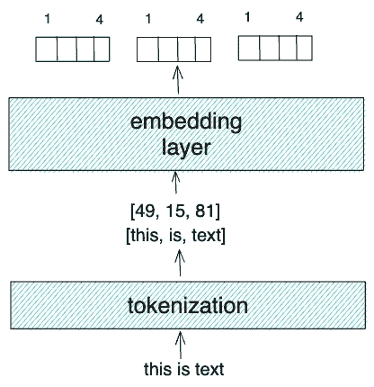

作者提供的图片

## 位置编码

到目前为止，我们已经获得了序列中每个标记的嵌入，但这些嵌入并没有顺序感。同时，我们知道在任何文本和语言中，词语的顺序对捕捉句子的语义意义至关重要。

为了捕捉输入序列的顺序，Transformer 应用了一种叫做位置编码的方法。我们可以使用多种方式来应用位置编码，但它应满足以下条件：

+   编码应该对序列中的每个标记都是唯一的。

+   任意两个相邻标记之间的**delta**值或距离应该是一致的，并且与序列长度无关。

+   编码应该是确定性的。

+   并且它在我们处理更长序列时也应表现出良好的泛化能力。

在原始 Transformer 论文中，作者提出了一种利用正弦和余弦波组合的位置信息编码方法。这种方法满足了所有提到的条件，使模型能够有效地捕捉标记的顺序。

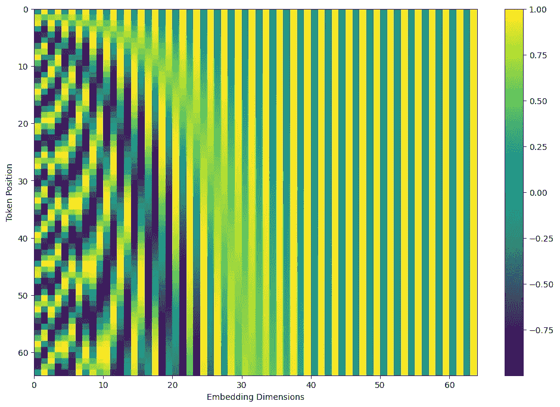

作者提供的图像

```py
class PositionalEncoding(nn.Module):
    def __init__(self, d_model, vocab_size=5000, dropout=0.1):
        super().__init__()
        self.dropout = nn.Dropout(p=dropout)

        pe = torch.zeros(vocab_size, d_model)
        position = torch.arange(0, vocab_size, dtype=torch.float).unsqueeze(1)
        div_term = torch.exp(
            torch.arange(0, d_model, 2).float()
            * (-math.log(10000.0) / d_model)
        )

        pe[:, 0::2] = torch.sin(position * div_term)
        pe[:, 1::2] = torch.cos(position * div_term)
        pe = pe.unsqueeze(0)
        self.register_buffer("pe", pe)

    def forward(self, x):
        x = x + self.pe[:, : x.size(1), :]
        return self.dropout(x)
```

位置编码应该具有与标记嵌入相同的维度，以便我们可以将位置编码添加到标记嵌入中。此外，位置编码是固定的，这意味着在训练过程中没有可更新的可学习参数。

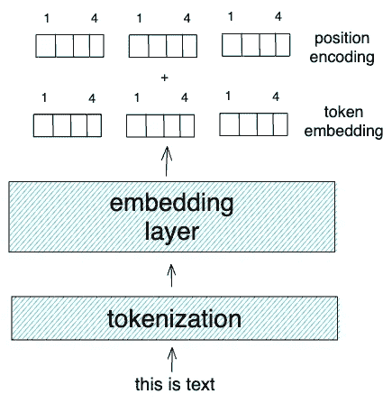

作者提供的图像

```py
pe_model = PositionalEncoding(d_model=4, vocab_size=len(vocab))
output_pe = pe_model(token_emb)

print(f'Size of output embedding: {output_pe.size()}')

# Output
'''
Size of output embedding: torch.Size([1, 3, 4]) [batch, no. seq token, dim]
'''
```

从标记嵌入和位置编码的加法中得到的输出嵌入将成为下一步骤的输入，即 Transformer 编码器堆栈。

## 自注意力

Transformer 编码器堆栈由几个部分组成，如下图所示：

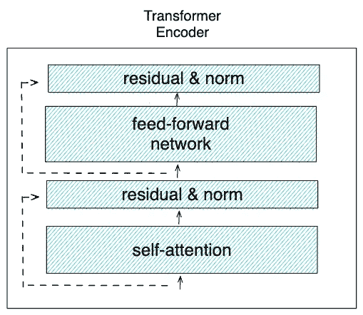

作者提供的图像

首先，我们的输入嵌入将进入所谓的自注意力层。这一层是 Transformer 语言模型能够区分每个词的上下文和整个序列/句子的语义意义的主要因素。

自注意力层将使用不同的线性层将输入嵌入投影到查询、键和值向量中。查询、键和值是我们通常在检索系统或推荐系统中找到的术语。

例如，假设你想在 Netflix 上观看特定的电影。查询将是你在搜索栏中输入的电影标题；键将是 Netflix 目录中每部电影的描述；值将是基于你之前在搜索栏中输入的电影标题的电影推荐结果。

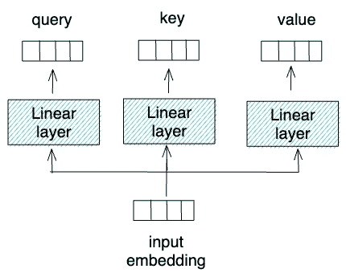

作者提供的图像

正如上面的可视化所示，查询、键和值都来自同一来源。这就是为什么这种注意力机制被称为自注意力。

如果你使用完整的 Transformer 架构（包括解码器部分）来进行像机器翻译这样的自回归任务，那么还会有另一个称为交叉注意力的注意力机制，其中查询来自解码器，而键和值来自编码器堆栈。然而，由于我们只使用编码器堆栈，所以在本文中不会讨论交叉注意力机制。

在获取查询、键和值之后，我们就可以执行自注意力机制了。

首先，我们将查询与键进行相乘（也称为点积操作）。

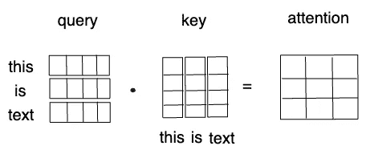

作者提供的图片

我们从点积操作中得到的是一个方形的注意力矩阵，其尺寸在两个维度上都等于序列中输入标记的数量。该矩阵指示了每个标记应该给序列中其他标记的注意力或相关性。

接下来，我们使用线性层的维度对注意力矩阵进行归一化，以在训练过程中获得稳定的梯度。然后，我们使用 Softmax 函数对矩阵进行归一化，使矩阵中每一行的值都为正且总和为 1。

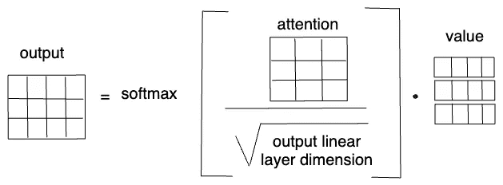

作者提供的图片

自注意力机制的最后一步是值与我们的归一化注意力矩阵之间的另一个点积。这将给我们一个大小为`[batch, no_of_sequence, hidden_size_dim]`的最终输出。

```py
class SingleHeadAttention(nn.Module):
    def __init__(self, d_model, d_head_size):
        super().__init__()
        self.lin_key = nn.Linear(d_model, d_head_size, bias=False)
        self.lin_query = nn.Linear(d_model, d_head_size, bias=False)
        self.lin_value = nn.Linear(d_model, d_head_size, bias=False)
        self.d_model = d_model

    def forward(self, x):
        query = self.lin_query(x)
        key = self.lin_key(x)
        value = self.lin_value(x)

        scores = torch.matmul(query, key.transpose(-2, -1)) / math.sqrt(self.d_model)
        p_attn = scores.softmax(dim=-1)
        x = torch.matmul(p_attn, value)

        return x
```

## 多头注意力

然而，Transformer 模型不仅仅使用一个自注意力块，或通常称为“头”。它使用多头注意力，其中多个单自注意力并行进行。小的区别在于，我们需要将每个单头注意力中的三个线性层的输出除以我们使用的头的总数。这确保了多头注意力的计算时间与单自注意力相当。

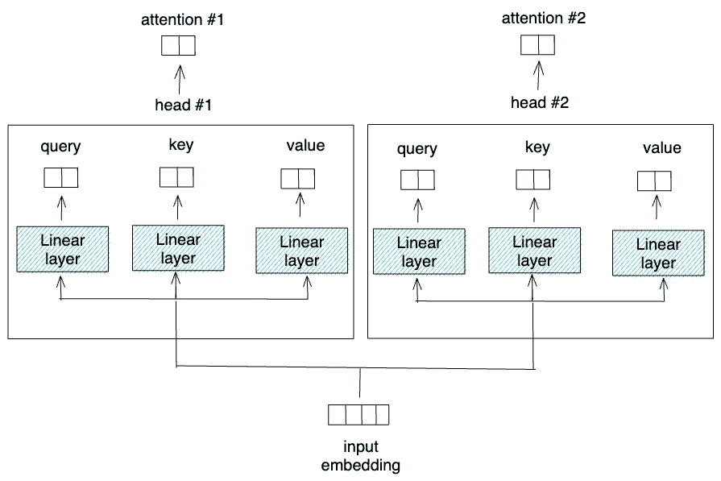

作者提供的图片

最后，我们需要将每个自注意力层的输出连接起来，然后将其投影到一个额外的线性层中。

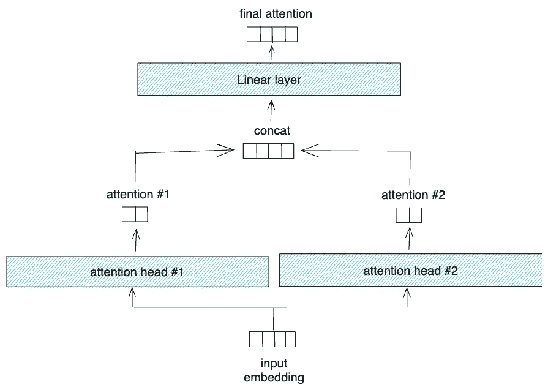

作者提供的图片

```py
class MultiHeadAttention(nn.Module):
    def __init__(self, h, d_model, dropout=0.1):
        super().__init__()
        assert d_model % h == 0
        d_k = d_model // h
        self.multi_head = nn.ModuleList([SingleHeadAttention(d_model, d_k) for _ in range(h)])
        self.lin_agg = nn.Linear(d_model, d_model)

    def forward(self, x):
        x = torch.cat([head(x) for head in self.multi_head], dim=-1)
        return self.lin_agg(x)
```

就这样。这个多头注意力层的输出张量与输入的维度相同。

```py
mult_att = MultiHeadAttention(h=2, d_model=4)
output_mult_att = mult_att(output_pe)
print(f'Size of output embedding after multi-head attention: {output_mult_att.size()}')

# Output
'''
Size of output embedding after multi-head attention: torch.Size([1, 3, 4])
'''
```

## 归一化层和残差连接

如果我们查看 Transformer 编码器块的架构，我们需要将多头注意力的输出与多头注意力的输入（也称为残差连接）相加，然后对其进行归一化。

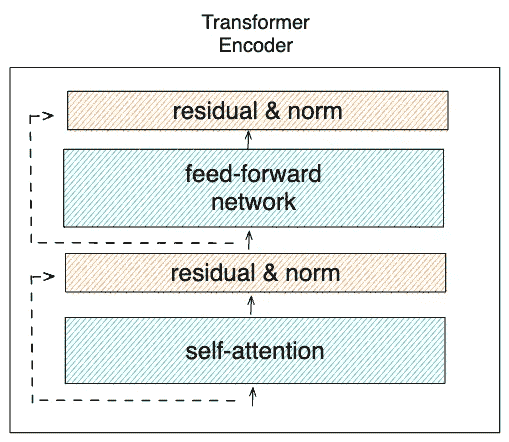

作者提供的图片

这两个操作的原因是为了使 Transformer 模型在训练过程中能够更快收敛，并且它们还可以帮助模型更准确地进行预测。

```py
class LayerNorm(nn.Module):
    def __init__(self, d_model, eps=1e-6):
        super(LayerNorm, self).__init__()
        self.a_2 = nn.Parameter(torch.ones(d_model))
        self.b_2 = nn.Parameter(torch.zeros(d_model))
        self.eps = eps

    def forward(self, x):
        mean = x.mean(-1, keepdim=True)
        std = x.std(-1, keepdim=True)
        return self.a_2 * (x - mean) / (std + self.eps) + self.b_2

class ResidualConnection(nn.Module):
    def __init__(self, d_model, dropout=0.1):
        super().__init__()
        self.norm = LayerNorm(d_model)
        self.dropout = nn.Dropout(dropout)

    def forward(self, x1, x2):
        return self.dropout(self.norm(x1 + x2))
```

再次强调，残差连接和归一化层后的输出张量维度将与多头注意力层的输出张量维度相同。

```py
res_conn_1 = ResidualConnection(d_model=4)
output_res_conn_1 = res_conn_1(output_pe, output_mult_att)

print(f'Size of output embedding after residual connection: {output_res_conn_1.size()}')

# Output
'''
Size of output embedding after residual connection: torch.Size([1, 3, 4])
''' 
```

## 前馈层

残差连接和归一化层的输出将成为前馈层的输入。这个层只是一个普通的线性层，如下所示：

```py
class FeedForward(nn.Module):
    def __init__(self, d_model, d_ff, dropout=0.1):
        super().__init__()
        self.w_1 = nn.Linear(d_model, d_ff)
        self.w_2 = nn.Linear(d_ff, d_model)
        self.dropout = nn.Dropout(dropout)

    def forward(self, x):
        return self.w_2(self.dropout(self.w_1(x).relu()))
```

这一层也不会改变我们张量的维度。

```py
ff = FeedForward(d_model=4, d_ff=12)
output_ff = ff(output_res_conn_1)

print(f'Size of output embedding after feed-forward network: {output_ff.size()}')

# Output
'''
Size of output embedding after feed-forward network: torch.Size([1, 3, 4])
''' 
```

在前馈层之后，我们需要应用第二个残差连接，将前馈层的输出与前馈层的输入相加。加法之后，我们使用上面描述的归一化层对张量进行归一化。

```py
res_conn_2 = ResidualConnection(d_model=4)
output_res_conn_2 = res_conn_2(output_res_conn_1, output_ff)

print(f'Size of output embedding after second residual: {output_res_conn_2.size()}')

# Output
'''
Size of output embedding after second residual: torch.Size([1, 3, 4])
'''
```

## Transformer 编码器堆栈

从多头自注意力层到前馈层之后的归一化层的过程对应一个单独的 Transformer 编码器堆栈。

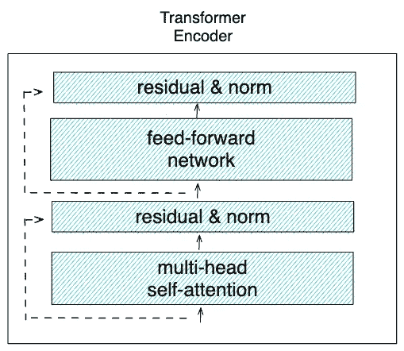

作者提供的图片

现在我们可以将上述所有过程封装在一个名为 `SingleEncoder()` 的类中：

```py
class SingleEncoder(nn.Module):
    def __init__(self, d_model, self_attn, feed_forward, dropout):
        super().__init__()
        self.self_attn = self_attn
        self.feed_forward = feed_forward
        self.res_1 = ResidualConnection(d_model, dropout)
        self.res_2 = ResidualConnection(d_model, dropout)

        self.d_model = d_model

    def forward(self, x):
        x_attn = self.self_attn(x)
        x_res_1 = self.res_1(x, x_attn)
        x_ff = self.feed_forward(x_res_1)
        x_res_2 = self.res_2(x_res_1, x_ff)

        return x_res_2
```

在实际应用中，我们通常使用多个 Transformer 编码器，而不是仅使用一个。例如，BERT-base 模型使用了 12 个 Transformer 编码器堆栈。

```py
class EncoderBlocks(nn.Module):
    def __init__(self, layer, N):
        super().__init__()
        self.layers = nn.ModuleList([layer for _ in range(N)])
        self.norm = LayerNorm(layer.d_model)

    def forward(self, x):
        for layer in self.layers:
            x = layer(x)
        return self.norm(x)
```

使用上述 `EncoderBlocks()`，我们可以根据需要初始化多个 Transformer 编码器堆栈。

# 模型训练

现在我们知道了 Transformer 编码器的内部结构，接下来让我们使用它来训练数据以进行文本分类。

## 模型定义

在本文中，我们将使用六个 Transformer 编码器堆栈。隐藏层大小为 300，多头自注意力层中将有四个不同的头。你可以根据自己的需要调整这些值。

```py
class TransformerEncoderModel(nn.Module):
    def __init__(self, vocab_size, d_model, nhead, d_ff, N,
                dropout=0.1):
        super().__init__()
        assert d_model % nhead == 0, "nheads must divide evenly into d_model"

        self.emb = Embeddings(d_model, vocab_size)
        self.pos_encoder = PositionalEncoding(d_model=d_model, vocab_size=vocab_size)

        attn = MultiHeadAttention(nhead, d_model)
        ff = FeedForward(d_model, d_ff, dropout)
        self.transformer_encoder = EncoderBlocks(SingleEncoder(d_model, attn, ff, dropout), N)
        self.classifier = nn.Linear(d_model, 2)
        self.d_model = d_model

    def forward(self, x):
        x = self.emb(x) * math.sqrt(self.d_model)
        x = self.pos_encoder(x)
        x = self.transformer_encoder(x)
        x = x.mean(dim=1)
        x = self.classifier(x)
        return x

model = TransformerEncoderModel(len(vocab), d_model=300, nhead=4, d_ff=50, 
                                    N=6, dropout=0.1).to(device)
```

如果你注意到，我们在最后一个 Transformer 编码器堆栈的输出上添加了一个额外的线性层。这个线性层将作为分类器。由于我们只有两个不同的类别（垃圾邮件/正常邮件），因此这个线性层的输出将是二。

另外，我们需要解决的一个重要问题是，最终堆栈的输出将是`[batch, no_of_sequence, hidden_size]`，而我们的最终线性层期望的输入是`[batch, hidden_size]`。我们可以采用几种方法来使堆栈的输出与线性层的输入匹配。

例如，BERT 只使用了一个特殊的称为 ***[CLS]*** 的标记，该标记在 Transformer 架构中的位置编码步骤之前插入到序列中。在这里，我们没有这个特殊的 ***[CLS]*** 标记。因此，我们改为在最后一个编码器堆栈之后对所有输出嵌入值进行平均。

## 数据加载器

接下来，我们需要为训练数据创建一个数据加载器，以便在训练过程中将数据分批输入到模型中。

```py
class TextDataset(torch.utils.data.Dataset):

  def __init__(self, input_data):        
      self.text = input_data['Message'].values.tolist()
      self.label = [int(label2id[i]) for i in input_data['Category'].values.tolist()]

  def __len__(self):
      return len(self.label)

  def get_sequence_token(self, idx):
      sequence = [vocab[word] for word in tokenizer(self.text[idx])]
      len_seq = len(sequence)
      return sequence, len_seq

  def get_labels(self, idx):
      return self.label[idx]

  def __getitem__(self, idx):
      sequence, len_seq = self.get_sequence_token(idx)
      label = self.get_labels(idx)
      return sequence, label, len_seq

def collate_fn(batch):

    sequences, labels, lengths = zip(*batch)
    max_len = max(lengths)

    for i in range(len(batch)):
        if len(sequences[i]) != max_len:
          for j in range(len(sequences[i]),max_len):
            sequences[i].append(0)

    return torch.tensor(sequences, dtype=torch.long), torch.tensor(labels, dtype=torch.long)
```

除了 dataloader 类，我们还需要创建上述的辅助函数 `collate_fn()`。这个函数是必不可少的，因为为了将训练数据按批次提供，每个批次需要具有相同的维度。

由于我们处理的是具有不同句子长度的文本数据，因此每个批次的维度不一定相同。在 `collate_fn` 中，我们首先获取批次中序列的最大长度，然后向较短的序列中添加一堆***<pad>***标记，直到其长度等于批次中最长序列的长度。

另一种你可以使用的方法是通过定义最大标记数。接下来，如果句子的标记数超过最大值，可以截断句子；如果标记数少于最大值，则可以添加一堆***<pad>***标记。

## 训练循环

现在我们已经定义了模型架构和数据加载器类，那么我们可以开始训练模型了。

```py
def train(model, dataset, epochs, lr, bs):

    criterion = nn.CrossEntropyLoss()
    optimizer = torch.optim.Adam((p for p in model.parameters() 
      if p.requires_grad), lr=lr)
    train_dataset = TextDataset(dataset)
    train_dataloader = DataLoader(train_dataset, num_workers=1, batch_size=bs, collate_fn=collate_fn, shuffle=True)

    # Training loop
    for epoch in range(epochs):
        total_loss_train = 0
        total_acc_train = 0   
        for train_sequence, train_label in tqdm(train_dataloader):

            # Model prediction
            predictions = model(train_sequence.to(device))
            labels = train_label.to(device)
            loss = criterion(predictions, labels)

            # Calculate accuracy and loss per batch
            correct = predictions.argmax(axis=1) == labels
            acc = correct.sum().item() / correct.size(0)
            total_acc_train += correct.sum().item()
            total_loss_train += loss.item()

            # Backprop
            loss.backward()
            torch.nn.utils.clip_grad_norm_(model.parameters(), 0.5)
            optimizer.step()

        print(f'Epochs: {epoch + 1} | Loss: {total_loss_train / len(train_dataset): .3f} | Accuracy: {total_acc_train / len(train_dataset): .3f}')

epochs = 15
lr = 1e-4
batch_size = 4
train(model, df_train, epochs, lr, batch_size)
```

你将得到类似这样的输出：

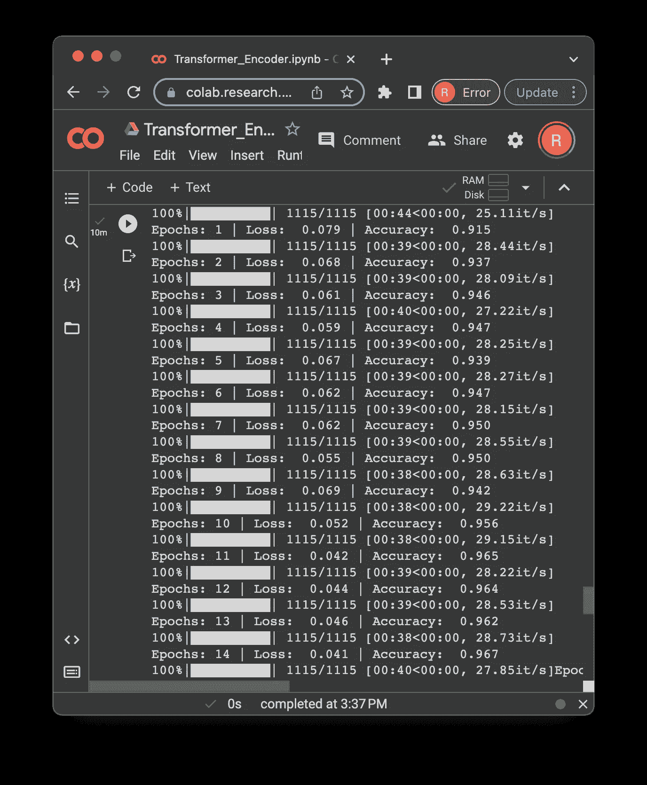

图片由作者提供

# 模型预测

在我们训练模型之后，我们可以自然地使用它来预测测试集中的未见数据。为此，我们首先需要创建一个函数，封装数据预处理步骤和模型预测步骤。

```py
def predict(text):
  sequence = torch.tensor([vocab[word] for word in tokenizer(text)], dtype=torch.long).unsqueeze(0)
  output = model(sequence.to(device))
  prediction = id2label[output.argmax(axis=1).item()]

  return prediction
```

现在，如果我们想预测测试集中的文本，可以直接调用上述函数：

```py
idx = 24
text = df_test['Message'].values.tolist()[idx]
gt = df_test['Category'].values.tolist()[idx]
prediction = predict(text)

print(f'Text: {text}')
print(f'Ground Truth: {gt}')
print(f'Prediction: {prediction}')

# Output
'''
Text: This is the 2nd time we have tried 2 contact u. U have won the £750 Pound prize. 2 claim is easy, call 087187272008 NOW1! Only 10p per minute. BT-national-rate.
Ground Truth: spam
Prediction: spam
''' 
```

```py
idx = 35
text = df_test['Message'].values.tolist()[idx]
gt = df_test['Category'].values.tolist()[idx]
prediction = predict(text)

print(f'Text: {text}')
print(f'Ground Truth: {gt}')
print(f'Prediction: {prediction}')

# Output
'''
Text: Morning only i can ok.
Ground Truth: ham
Prediction: ham
'''
```

# 结论

在这篇文章中，我们讨论了利用 Transformer 的编码器部分来分类文本的逐步过程。如你所知，许多大型语言模型使用 Transformer 的编码器部分。例如，BERT 由于其 Transformer 编码器架构结合了大量的训练数据，在许多语言任务中取得了最先进的表现。

我希望这篇文章能帮助你入门 Transformer 架构。像往常一样，你可以通过 [**这个笔记本**](https://github.com/marcellusruben/medium-resources/blob/main/Text_Classification_Transformer_Encoders/Transformer_Encoder.ipynb) 查找本文实现的代码。
