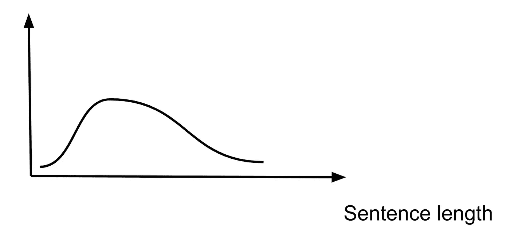

# 使用 NLP 进行文本纠正

> 原文：[`towardsdatascience.com/text-correction-using-nlp-b68c7233b86`](https://towardsdatascience.com/text-correction-using-nlp-b68c7233b86)

## **检测和纠正常见错误：问题与方法**

[](https://jagota-arun.medium.com/?source=post_page-----b68c7233b86--------------------------------)[](https://towardsdatascience.com/?source=post_page-----b68c7233b86--------------------------------) [Arun Jagota](https://jagota-arun.medium.com/?source=post_page-----b68c7233b86--------------------------------)

·发布在 [Towards Data Science](https://towardsdatascience.com/?source=post_page-----b68c7233b86--------------------------------) ·19 分钟阅读·2023 年 1 月 13 日

--


图片由 [Lorenzo Cafaro](https://pixabay.com/users/3844328-3844328/?utm_source=link-attribution&utm_medium=referral&utm_campaign=image&utm_content=1870721) 提供，来源于 [Pixabay](https://pixabay.com/)

任何写作的人都会不时漏掉一个逗号。或者在某种语境下使用错误的介词。或者拼写错误。或者措辞尴尬。或者使用过于复杂或过长的句子。或者段落过长。或者过于冗长。

对于除了最短的写作之外的所有文本，也许以上所有内容以及更多。

我曾经有一个学生在他写的每一篇文章中都缺少了像*a*或*the*这样的冠词。我阅读了他数百页的内容，却没有找到一个冠词。

我曾经并且仍然不断地犯这些错误。即使是在我的短文如电子邮件中。

对于内容较为复杂的文本，如整本书籍或甚至短篇博客，文本问题自然会更多。这就是我们需要校对编辑的原因，他们的职责包括校对和编辑内容。

这也是为什么基于 NLP 的工具如 Grammarly 越来越受欢迎的原因。这些工具可以在几分钟内帮助人们在短文本如电子邮件中发现并纠正这些错误。对于较长的文本，它们可能会发现更多错误，这当然意味着修正这些错误会花费更多时间。

有关 Grammarly 的更多信息，请参见 [10]。

无论如何，作家无法与这些工具在提高高质量写作产量方面竞争。我还要补充一点，这样可以减少眼睛的疲劳。

这让我想起了以下的事情。很久很久以前，我写了一篇博士论文。数百页。那是一个痛苦的过程。如果没有像 Grammarly 这样的工具，我现在不会重复这个过程。

**前言**

在这篇文章中，我们首先描述并解释人们在写作时倾向于犯的各种错误。我们将仅限于基本错误，例如缺少逗号、缺少冠词或使用错误的介词。（在这篇文章中，我们用“错误”这个术语时比较宽松。我们实际上是指“改进建议”。）

随后，我们将集思广益，使用自然语言处理技术检测这些问题，并提供解决方案。

我们选择将这篇文章的范围限制在基本错误的原因有几个。首先，它们非常常见。其次，一些统计自然语言处理的基本方法，再加上一些特征工程，适用于这些错误的检测和纠正。

因此，在这个过程中，读者还将获得在有用且真实的环境中对统计自然语言处理基本方法的坚实基础。

相比之下，检测并提供针对更复杂问题的纠正建议，如措辞尴尬或以更简洁、更易读的方式重新表达，需要更先进的自然语言处理技术。在另一篇文章[11]中，我们也建模了*上下文*，超出了这篇文章所涵盖的基本问题。这仍然没有涵盖措辞尴尬或更简洁、更具信息性的表达，因为这些都是更复杂的话题。

**文本中的基本错误**

这里是我们将涵盖的内容，并附有实际示例。

+   缺少逗号。

+   缺少冠词。

+   忘记在“It's”中使用撇号。

+   *使用单数而非复数，或反之亦然。*

+   在不应该使用连字符的地方使用了连字符，或反之亦然。

+   大小写问题：*未在应大写字母的地方大写；* 在应全大写的地方没有全大写。例如，*fyi*。

+   *使用错误的介词，或在不需要时使用介词。*

接下来，我们将对这些错误进行第二次讨论，探讨统计自然语言处理的基本解决方案。这一讨论将涉及使用哪些训练集、提取哪些特征，以及使用哪些统计模型。

我们甚至不会尝试解决上述以斜体标出的那些问题。这些问题需要更先进的自然语言处理方法，即那些能建模上下文的方法。

**缺少逗号**

我犯的最常见的错误是缺少逗号。考虑一下：

```py
Regardless there is no way …
Clearly the writer meant …
```

在每种情况下，第一个单词后面都应该立即跟一个逗号。

**大小写问题**

有时会忘记在句子的开头单词中大写第一个字母，或在指代自己时大写‘i’。例如：

```py
the most frequent error i make is …
```

这会给人留下不好的印象。

同样，

```py
An fyi in case you are interested.
```

更好的表达方式是：

```py
An FYI in case you are interested.
```

还有许多其他情况，其中全大写字母的形式更为适合。例如*pdf*、*gpx*、*cdc*、*nlp*、*ai*等。

**缺少冠词**

遗漏冠词也很常见。如：

```py
… within matter of minutes …           ⇒ 
… within a matter of minutes …

… capitalize first letter in word …    ⇒ 
… capitalize the first letter in the word …
```

⇒之前的文本是原文。⇒之后的文本是正确的写法。我们将在整篇文章中使用这种约定来展示示例。

另一个我经常犯的错误是省略了*Its*中的撇号。实际上，我在本节开始的*Its*上犯了这个错误！

**错误使用连字符**

我经常犯这样的错误。以下是来自一个不错的帖子中的一些例子[2]。

在这个阶段，我只是展示这些例子。稍后当我们查看方法时，我们会引入一些[2]中的额外点。它们将帮助我们设计正确的特征或决定我们应该使用统计 NLP 中的哪种方法。

```py
He’s an all star runner     ⇒ 
He’s an all-star runner

Chocolate covered truffles  ⇒ 
Chocolate-covered truffles
```

以及这些。

```py
My co-worker has a four-year old child. ⇒ 
My co-worker has a four-year-old child

We sat on the plane for deicing for an hour. ⇒ 
We sat on the plane for de-icing for an hour.
```

让我们看看一些相反方向的例子。在这些例子中，我们不应使用连字符。

```py
This car is a finely-tuned machine. ⇒ 
This car is a finely tuned machine.

She attends Ohio-State University.  ⇒ 
She attends Ohio State University.

Heart-broken                        ⇒ 
Heartbroken
```

**介词使用错误**

我经常犯涉及介词的错误。特别是，我使用了错误的介词。例如，我经常使用*by*而应使用*with*。

如果我没有使用 Grammarly，我甚至不会知道自己在做这些事。即使在审阅我的文本之后也是如此。

以下是我想分享的第一个例子。它不是特定于介词的，但确实说明了我想表达的观点。

在写上述句子时，我写成了

```py
And were I to not be using Grammarly, …
```

Grammarly 建议我去掉*to*和*be*。

```py
And were I not using Grammarly
```

更容易阅读。

哦，实际上，我刚意识到在上述几行中还有两个额外的错误。现在已经修正。以下是包含错误的版本。

```py
Below is the first example I want share.
Its Grammarly that …
```

在第一句中，我在*want*和*share*之间漏掉了*to*。在第二句中，*Its*应该是*It’s*或*It is*。

还有一件事。

我刚意识到，在写了*Oh, in fact*之后……我又引入了一些额外的错误！

好吧，我就停在这里，否则我可能会无限循环，生成带有错误的新文本来解释我在前一版本中犯的错误！

好吧，让我们看看其他例子。

```py
She ran in the bedroom from the living room.
```

很明显，作者在这个上下文中指的是*into*。 （如果“*from the living room*”被遗漏，可能就不那么明确了。）

以下是来自[1]的例子。

```py
Is that the best song you ever heard of?
```

*of*是不需要的。

我之前提到过，我经常使用*by*而应使用*with*。这里有一个例子。

```py
For linear classification problems one can use linear neurons. 
For classification problems that are not linearly separable, 
replace linear by sigmoidal.
```

在上述例子中，*linear by sigmoidal*应为*linear with sigmoidal*。

**解决方案**

如果我们能够访问像 ChatGPT 这样的巨大语言模型[3]并能够按需或批量运行，我们可能就不需要像下面这样一点一点地进行。

我们假设读者没有这样的访问权限。此外，我们假设读者对了解这些用例相关的方法感兴趣，并可能想从头开始实现它们。

正如感兴趣的读者稍后将看到的，这篇帖子中讨论的方法将非常容易从头开始实现。

使用预先构建的大模型不会提供任何这样的见解。也就是说，如果可以获得大型语言模型，尝试一下是个好主意。体验它的行为。观察它能够解决哪些问题。在本文的背景下，评估其解决方案在什么方面优于我们的？

好的，回到我们具体建议的讨论。首先，我们将讨论用于训练的数据集。一个明智选择的数据集足以满足我们所有的用例。

接下来，我们将讨论一些来自统计自然语言处理的“基础构建块”方法。我们将从几个初步用例开始开发这些方法。然后我们将讨论这些相同的方法如何适用于我们在本文早些时候描述的许多其他用例，尽管需要不同的预处理或提取的特征。

也就是说，本文早些时候详细描述的一些用例，我们将不会尝试讨论解决方案。这是因为这些用例似乎需要考虑上下文的更高级方法，即复杂的语言模型。我们将在未来的文章中讨论这些。

**训练数据**

我们在本文中讨论的所有用例所需的模型原则上可以从一个数据集中学习。一个质量合理的文本文档语料库。

比如维基百科。事实上，人们可以将维基百科的整个文本下载到自己的计算机上。参见[4]。

对于一些问题，即使手动复制几页维基百科或从一些合理质量的网页中复制内容，也足以进行快速的初步训练和评估。

**简单计数方法**

考虑尝试检测过长的句子或段落。

我们将以如下方式训练这些检测方法。首先，我们将文本中的每个文档标记化为段落，然后将每个段落标记化为句子，最后将每个句子标记化为词语。

可以使用 NLTK 将段落标记化为句子。参见[5]。

将文档分解为段落，再将段落分解为句子本身也是相当有趣的自然语言处理问题。我们将在另一篇文章中涵盖这些方法。这里我们的重点在其他地方。

现在我们可以分别构建句子和段落中的单词数模型。利用这些模型，我们可以标记异常长的句子或异常长的段落。

**长度分布的参数模型**

我们在这个主题上想要补充的主要内容是，正态分布并不是建模句子或段落长度的一个好选择。

正态分布是对称的，尾部延伸至负无穷大和正无穷大。相比之下，句子长度更可能按以下方式分布。单词句子虽然存在，但相对较少。随着长度的增加，这种长度的句子会变得更常见。随着句子长度的进一步增加，这种长度的句子会变得不那么常见，呈指数级减少。

读者可以通过快速上下滚动这篇文章并目测各种句子的长度来测试这一推理。读者会发现一些两词句子。大多数句子包含五到十个词。读者不会找到包含三十个词的句子。这些句子太长了。

好的，我们回到我们想要表征的分布。它应该是这样的。



泊松分布比正态分布更适合这种形状。见[6]。

泊松分布有一个参数，即一个可调节的旋钮，可以进一步微调形状。这个参数可以从数据中进行调节。

另见[7]，这是一篇专注于文本中句子长度分布建模的论文。正如文中讨论的那样，对数正态分布也值得考虑。

**长度分布的非参数模型**

假设我们的语料库包含大量句子。我们可以避免对分布形式做任何假设。它应该是泊松分布？还是帕累托分布？还是对数正态分布？或者其他什么？

从数据中经验性地估计。这就是说，基本上只是对各种句子长度创建一个直方图。它会像这样。

```py
Num Words           1   2   3   …   8 … 30
Number of Sentences 2   4   10  … 500 … 0
```

这表明我们语料库中有 10 个三词句和 500 个八词句。

直方图可能需要一些平滑处理，包括插值和外推。

为了说明插值的必要性，请考虑以下场景。在我们的语料库中，假设有一个 50 词的句子出现，但没有 45 词的句子。（不用在意 40 词的句子怎么来的。）我们不想说 45 词的句子出现的概率为零。虽然很小，但不是零。

好的，我们回到直方图的讨论。

一个经过适当平滑的直方图可以用来为新句子打分，以评估其长度的异常程度。一个异常长的句子应该得分很低。

平滑的直方图包含了这种评分所需的所有信息。我们可以称之为“*P*值或百分位评分”。例如，如果我们语料库中的 99%的句子不超过二十个词，那么一个 21 词的句子的*P*值不超过 0.01，即 1%。这可以表示为百分位单位的评分。*1*将意味着非常低的评分。

为了保持以上段落的描述足够简单，我们忽略了如*右*尾*P*值与*双*尾*P*值的细节。在实际操作中，这并不太重要，除非评分阈值基于*P*值的截止点。实际操作中，通常并不是这样。相反，它们是基于我们认为截止点应该在何处来校准的。也就是说，我们询问人们认为哪些句子太长，并从这些反馈中得出评分截止点。

**涉及特定令牌分布的方法**

考虑一下我们在文章中描述的涉及连字符的问题。即是否应该在某些相邻的词之间加连字符？如果不加连字符，是否应该有空格，还是将词融合在一起？

让我们从重复之前看到的例子开始，以更好地理解问题的本质。

```py
He’s an all star runner     ⇒ 
He’s an all-star runner

Chocolate covered truffles  ⇒ 
Chocolate-covered truffles

My co-worker has a four-year old child. ⇒ 
My co-worker has a four-year-old child

We sat on the plane for deicing for an hour. ⇒ 
We sat on the plane for de-icing for an hour.

This car is a finely-tuned machine. ⇒ 
This car is a finely tuned machine.
She attends Ohio-State University. ⇒ 
She attends Ohio State University.
Heart-broken ⇒ Heartbroken.
```

作为第一次尝试，即使在没有建模上下文的情况下，我们也能够在检测可疑连字符方面做到相当不错，并提供合理的替代方案。

显然，我们不需要完美的精度或完美的召回率。只需足够让用户找到价值。我们可以始终进行迭代和改进。

我们想指出，我们应该更加关注检测的精度，而不是提出的替代方案的质量。这是因为对于相邻的词，只有三种可能性——加连字符、使用空格或将词粘合在一起。所以如果检测到的连字符确实很差，即使展示其他两种方案也能为用户提供价值。

因此，我们将按以下方式建模该问题。首先，让我们考虑一个发现有连字符的词，例如*heart-broken*。当我们在训练过程中遇到这个词时，我们将进行如下操作。

我们将创建一个去掉连字符的新词。在我们的例子中，它将是*heartbroken*。每次在文本中遇到*heart-broken*时，我们会将*heartbroken* → *heart-broken*的实例添加到一个映射中。在 Python 伪代码中，它会像这样：

```py
style_map[‘heartbroken’][‘heart-broken’] += 1
```

当我们在语料库中遇到*heartbroken*（而不是*heart-broken*）时，我们会进行如下操作：

```py
style_map[‘heartbroken’][‘heartbroken’] += 1
```

所以一旦训练完成，*style_map*[‘*heartbroken*’]将会有两个版本*heart-broken*和*heartbroken*的分布。

因此，如果 *P*(*heartbroken*|*heartbroken*) 远高于 *P*(*heart*-*broken*|*heartbroken*)，我们会倾向于将*heart-broken*标记为可疑，并建议使用*heartbroken*作为改进建议。

如果在评分过程中，单词表示为*heart-broken*，那么我们会首先去掉连字符，就像我们在训练过程中所做的一样。如果结果键与最可能的重写不匹配，我们会将该实例标记为可疑。在我们的例子中，这将发生，因为*heartbroken*的最可能重写是*heartbroken*本身。但是文本中却是*heart-broken*。

现在让我们考虑一下如何在训练语料库中建模相邻的词。不加连字符。例如*boat house*。它的表达更好是*boat house*、*boathouse*还是*boat-house*？

为了覆盖这种情况，我们只需要一些额外的逻辑，如下所示。

以两个相邻的词*boat house*为例，我们将衍生出一个新词*boathouse*，将这两个词融合在一起，并将*boat house*作为键添加到*boathouse*中。如下所示。

```py
style_map[‘boathouse’][‘boat house’] += 1
```

我们会期望在语料库中*boathouse*的出现频率远高于*boat house*。也就是说，*P*(*boathouse*|*boathouse*)将远大于*P*(*boat house*|*boathouse*)。

**连字符建模中的概化**

所谓概化，是指学习涉及连字符的规则，这些规则超出了我们在训练数据中遇到的具体实例。

继续阅读，以查看在这种情况下的具体概化类型。

**涉及特定前缀的概化**

从训练语料库中，我们可能会观察到单词*very*后面从未跟随连字符。因此

```py
A very-happy dog
```

是不正确的。应该是*very happy*。

这个例子，或者更一般地说，这个规则，来自[2]。

我们能否从数据本身学习到这个规则？

是的。这里是方法。

我们将使用第二个映射，称为*hyphenation_prefix_map*。这个映射的键将是前缀。每次我们在训练语料库中看到这个前缀后面紧跟连字符时，我们将把值“1”的计数加一。每次我们在训练语料库中看到这个前缀后面没有连字符时，我们将把值“0”的计数加一。

上述段落中的逻辑伪代码如下：

```py
if the current word w is immediately followed by a hyphen:
  hyphenation_prefix_map[w][1] += 1
else:
  hyphenation_prefix_map[w][0] += 1
```

现在让我们展示当我们在评分文本中看到*very-happy*时的处理方法。假设我们从语料库中学到

*P*(下一个字符是-|当前单词是*very*)

是零，或者几乎为零。我们会将*very-happy*标记为可疑，并建议去掉连字符。

还要注意，这个解决方案还涵盖了在[2]中进一步描述的规则。

```py
Hyphenate all words beginning with the prefixes self-, ex-, and all-
```

以下是示例，也来自[2]。

```py
She is now self-employed.
My ex-classmate took my notes.
We are going to an all-inclusive resort.
```

实际上，我们的数据驱动学习将比 100%遵循这个规则做得更好。让我们详细说明一下。

有些以*self*开头的单词没有连字符。例如，*selfish*。

所以我们的模型将学习到通用规则

```py
if word starts with self
  self is followed by a hyphen
```

以及像*selfish*这样的例外，只要它们出现在训练语料库中。

需要稍微调整一下，以确保规则“*selfish* stays *selfish*”能够触发，而不是通用规则。这很简单，但我们将把它留给读者作为练习。

**涉及数字的概化**

请考虑来自[2]的这些示例。

```py
My co-worker has a four-year-old child.
Their child is four years old.
```

第一个连字符用法是正确的。*four-year old*的连字符用法则不正确。第二句话中缺少连字符的用法也是正确的。

假设术语*four-year-old*在训练语料库中出现频繁。扩展我们之前描述的方法以处理三个相邻的词素，我们可以检测到*four-year old*实际上应该是*four-year-old*。

那么，如果我们要评分的文本包含术语*hundred year old*呢？假设这个确切的术语在训练语料库中没有出现。我们希望能够将其标记为可疑，并建议作者考虑将其重新表述为*hundred-year-old*。

这是另一个概化的例子。

显然，我们希望能够从实际出现的实例中学习模式 <*number*>-*year*-*old*。

如果我们在语料库中看到实例 *1-year-old*、*2-year-old*、*one-year-old*、*two-year-old* 等，从这些实例中我们可以合理推测模式为 <*number*>-*year*-*old*。

我们将高层次地概述一种解决此问题的方法。我们将在下面进行说明。

考虑语料库中的实例 *2-year-old*。如前所述，我们将更新 *stylemap* 对于键 *2yearold*。此外，我们还将进行以下操作。我们将使用命名实体识别器将 *2* 识别为数字，可能是一个结合了基于词典和正则表达式的方法的简单工具。

请参见 [8]，获取关于 NLP 中命名实体识别的详细帖子，涵盖了这一层次的场景以及更复杂的场景。

我们可以表达结果为键 <*num*>-*year*-*old*。我们像以前一样更新这个键。也就是说，

```py
style_map[<num>-year-old][<num>-year-old] += 1
```

现在让我们看看当我们在文本中看到 *100 year-old* 时需要做什么。首先，我们去掉连字符，查找 *100yearold* 在 *style_map* 中。假设它不存在。然后我们将 *100* 识别为 <*num*> 并尝试在 *style_map* 中查找 <*num*>*yearold*。它作为键存在。接下来，我们找到具有最高概率且差距足够大的样式。在我们的例子中，它将是 <*num*>-*year*-*old*。接着，我们用 *100* 替换 <*num*>。最后，我们提供结果 *100-year-old* 作为建议的重表达。

接下来，考虑以下示例，亦来自 [2]。

```py
There are fifty-seven kids in that grade.
```

用 *fifty seven* 替换 *fifty-seven* 将是不正确的。

我们可以从数据中自动学习这一模式。为此，我们希望在命名实体中引入进一步的区别：*拼写出的数字* 与 *书写出的数字*。*Five* 是 *拼写出的数字*。*5* 是 *书写出的数字*。凭借这一区别，我们可以学习到规则是

```py
if two adjacent tokens are spelled out numbers with a space in between them
  insert a hyphen between the two
```

这种方法可以进一步完善，以涵盖如下所示的示例，也来自 [2]。

```py
They need two-thirds of the vote to win.
```

*two thirds* 将是不正确的。

**单词大小写**

这种方法也适用于某些单词大小写的场景。例如 *fyi* 更好地表示为 *FYI*。我们只需以不同的方式预处理标记。如下所示。

```py
FYI ⇒ fyi ⇒ style_map[fyi][FYI] += 1
```

也就是说，当我们在语料库中遇到 *FYI* 时，首先我们将其全部小写，然后再添加一个 *FYI* 的实例，以便与 *fyi* 关联。

一旦训练完成，假设语料库足够干净且丰富，*P*(*FYI*|*fyi*) 应该远大于 *P*(*fyi*|*fyi*)。因此，如果我们在被评分的文本中遇到 *fyi*，我们将建议将其替换为 *FYI*。

**其中的撇号**

假设语料库中特定句子的第一个词是 *Its*。它实际上应该是 *It’s*。

我们如何建模以检测此类错误并推荐特定的修正？

相同的方法在这里也适用，只是预处理稍有不同。

考虑语料库中*It’s*的出现。我们将进行以下操作。

```py
It’s ⇒ its ⇒ style_map[its][It’s] += 1
```

也就是说，我们去掉撇号得到*Its*。然后，我们再添加一个*It’s*与*Its*相关联。

请注意，在这种情况下，我们没有将*It’s*小写，只是去掉了撇号。这是因为我们希望保留*I*t’s 中的*i*为大写。

一旦训练完成，假设语料库足够干净且丰富，*P*(*It’s*|*Its*)应该比*P*(*Its*|*Its*)大得多。因此，如果我们遇到*its*作为句子中的第一个词被评分，我们将首先将其转换为*Its*，然后建议将这个*Its*替换为*It’s*。

实际上，如果我们将*Its*视为句子的第一个词，我们应该建议将其替换为*It’s*或*It is*。我们可以扩展我们的模型以直接学习提供第二个建议。我们将把这个问题留给读者作为练习。

**缺失的逗号**

考虑我们之前看到的示例。

```py
Regardless there is no way …
Clearly the writer meant …
```

在每种情况下，句子的第一个词后面应该有一个逗号。

下面，我们将深入探讨如何在这种场景中检测缺失的逗号。我们将仅关注这些场景，特别是那些在句子的*第一个*词或两个（或三个）词后面应该跟随逗号的情况。

在更微妙的情况下，例如在句子中间的位置，检测逗号会更复杂。我们将在未来的帖子中解决这个问题。

我们将使用之前在其他用例中使用的相同方法。不同的是，我们将仅应用于句子开头的词。

对于训练语料库中每个以句子开头的词，我们将跟踪其后是否跟随逗号的频率。在训练后，我们可以以我们之前描述的方式检测缺失的逗号。

**这与关联规则的关系**

我们在这篇文章中讨论的主要方法可以看作是挖掘关联规则的一个实例。

从这个角度看，我们使用的各种映射数据结构编码了特定形式的关联规则。

```py
IF X THEN Y
```

我们使用的概率推断，用于检测特定规则是否应该触发，称为在挖掘关联规则中的*confidence*。它的形式是*P*(*Y*|*X*)。

在关联规则挖掘中，另一个常用的替代方法叫做*lift*。有关关联规则和 lift 的更多信息，请参见[9]。

**总结**

在这篇文章中，我们讨论了在文本写作过程中检测和纠正问题的话题。这个用例具有巨大价值，从改善正在写作的电子邮件，到帮助作者在撰写较长文章时提高写作质量。

这就是 Grammarly 如此受欢迎的原因。

在这篇文章中，我们列举了以下类型的常见错误及其示例。

+   缺少逗号。

+   缺少冠词。

+   在*It’s*中遗漏撇号。

+   使用单数形式而不是复数形式，或反之亦然。

+   使用连字符时不该用，或反之亦然。

+   大小写问题。应大写的字母未大写。应全大写的单词未全大写。例如，*fyi*

+   使用错误的介词，或在不需要时使用介词。

在每种情况下，我们都通过实际例子描述了问题。通常会出现细微的差别。

接下来，我们对这些问题进行了第二次审视，讨论了统计自然语言处理的方法，这些方法有助于检测和解决这些问题。我们讨论了训练数据、特征工程以及适用于这些用例的一些特定统计模型。

**参考文献**

1.  [“Of” 与 “For”：区别和正确的语法使用 | YourDictionary](https://grammar.yourdictionary.com/vs/of-vs-for-differences-and-proper-grammar-use.html)

1.  [何时使用连字符：eContent Pro](https://www.econtentpro.com/blog/when-to-use-a-hyphen/8)

1.  [ChatGPT：优化对话的语言模型](https://openai.com/blog/chatgpt/)

1.  [维基百科：数据库下载](https://en.wikipedia.org/wiki/Wikipedia:Database_download)

1.  [NLTK 分词：带有示例的单词和句子分词器](https://www.guru99.com/tokenize-words-sentences-nltk.html)

1.  [泊松分布 — 维基百科](https://en.wikipedia.org/wiki/Poisson_distribution)

1.  [关于书面散文中句子长度的分布表示](https://www.jstor.org/stable/2345142)

1.  自然语言处理中的命名实体识别。真实世界的应用案例、模型、方法……

1.  [关联规则学习 — 维基百科](https://en.wikipedia.org/wiki/Association_rule_learning)

1.  [Grammarly](https://app.grammarly.com/)

1.  [基于自然语言处理的上下文文本纠正，Arun Jagota，Towards Data Science，Medium](https://jagota-arun.medium.com/contextual-text-correction-using-nlp-81a1363c5fc3)
