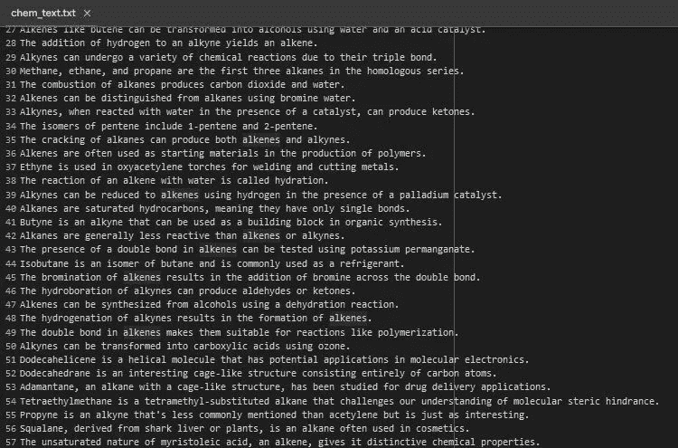

# 自动化化学实体识别：创建你的 ChemNER 模型

> 原文：[`towardsdatascience.com/text-mining-for-chemists-a-diy-guide-to-chemical-compound-labeling-ea3145e24dc4`](https://towardsdatascience.com/text-mining-for-chemists-a-diy-guide-to-chemical-compound-labeling-ea3145e24dc4)

[](https://victormurcia-53351.medium.com/?source=post_page-----ea3145e24dc4--------------------------------)[](https://towardsdatascience.com/?source=post_page-----ea3145e24dc4--------------------------------) [Victor Murcia](https://victormurcia-53351.medium.com/?source=post_page-----ea3145e24dc4--------------------------------)

·发表于[Towards Data Science](https://towardsdatascience.com/?source=post_page-----ea3145e24dc4--------------------------------) ·15 分钟阅读·2023 年 11 月 16 日

--


照片由[Aakash Dhage](https://unsplash.com/@aakashdhage?utm_content=creditCopyText&utm_medium=referral&utm_source=unsplash)拍摄，来源于[Unsplash](https://unsplash.com/photos/a-group-of-gold-and-silver-spheres-uV5n4TrFs8M?utm_content=creditCopyText&utm_medium=referral&utm_source=unsplash)

我一直对化学有浓厚的兴趣，它在塑造我的学术和职业旅程中发挥了重要作用。作为一个具有化学背景的数据专业人员，我发现有许多方法可以将我的科学和研究技能如创造力、好奇心、耐心、敏锐观察和分析应用于数据项目。在这篇文章中，我将引导你开发一个我称之为 ChemNER 的简单命名实体识别（NER）模型。这个模型可以识别文本中的化学化合物，并将它们分类为烷烃、烯烃、炔烃、醇、醛、酮或羧酸等类别。

## TL;DR

如果你只是想玩玩 ChemNER 模型和/或使用我制作的 Streamlit 应用，你可以通过以下链接访问它们：

***HuggingFace 链接：*** [`huggingface.co/victormurcia/en_chemner`](https://huggingface.co/victormurcia/en_chemner)

***Streamlit 应用***: [ChemNER 链接](https://chemner-5i7mrvyelw79tzasxwy96x.streamlit.app/)

# 介绍

NER 方法通常可以分为以下三类：

+   基于词典：定义类别和术语的字典

+   基于规则：定义每个类别对应的术语规则

+   基于机器学习（ML）：让模型从训练语料库中学习命名规则

这些方法各有其优缺点，并且一如既往，复杂而精细的模型并不总是最佳方案。

在这种情况下，基于词汇表的方法在范围上会有限，因为对于我们感兴趣的每一类化合物，我们都需要手动定义该类别中的所有化合物。换句话说，为了使这种方法全面，你需要手动输入每个化合物类别的所有化合物。

机器学习方法可能是最强大的选择，然而，注释数据集可能非常繁琐（剧透：我会训练一个模型，但我想展示整个过程以供学习）。那么，我们不妨从一些预定义的命名规则开始？

化学命名法有一套完善且明确的规则，使你能够轻松确定分子中存在的功能团。这些规则由国际纯粹与应用化学联合会（IUPAC）制定，可以通过[IUPAC 蓝皮书](https://iupac.org/what-we-do/books/bluebook/)、各种网站或任何有机化学教科书轻松获取。例如，烃是仅由碳和氢原子组成的化合物。烃主要有三类，分别是烷烃、烯烃和炔烃，可以根据其化学结构中是否包含单键、双键或三键来识别。下面我展示了三个化学化合物（乙烷、乙烯和乙炔）的例子。


乙烷、乙烯和乙炔。图片作者提供。

对我们来说，重要的是名字的结尾（即后缀），因为这将使我们能够区分化学化合物。例如，烷烃由后缀* -ane* 标识，烯烃由后缀* -ene* 标识，炔烃由后缀* -yne* 标识。每类化学化合物如醇、酮、醛、羧酸等都有独特的命名方案，这些方案将作为该项目的基础。

# **建立规则**

现在我们有了一些背景知识来理解发生了什么，我将展示如何使用 Spacy 在 Python 中实现基于规则的方法。我将从处理烃开始，稍后会添加其他类别。为此，我们首先将使用 Spacy 加载一个空白的英语模型，并将‘实体规则器’组件添加到我们的管道中：

```py
# Load a blank English model
nlp = spacy.blank("en")

#Create the EntityRuler
ruler = nlp.add_pipe("entity_ruler")
```

接下来，我们将建立定义每一类的规则/模式，并将其添加到规则组件中：

```py
# Define patterns
patterns = [
    {"label": "ALKANE", "pattern": [{"TEXT": {"REGEX": ".*ane$"}}]},
    {"label": "ALKENE", "pattern": [{"TEXT": {"REGEX": ".*ene$"}}]},
    {"label": "ALKYNE", "pattern": [{"TEXT": {"REGEX": ".*yne$"}}]}
]

ruler.add_patterns(patterns)
```

就这样！现在让我们创建一些文本以供模型使用，看看效果如何！

```py
text = "Ethane,  propene, and butyne are all examples of hydrocarbons."

doc = nlp(text)

#extract entities
for ent in doc.ents:
    print (ent.text, ent.start_char, ent.end_char, ent.label_)
```

结果如下：

```py
Ethane 0 6 ALKANE
propene 9 16 ALKENE
butyne 22 28 ALKYNE
```

非常好！然而，你可能已经注意到这个初始方法有两个直接的局限性：

1.  当前的正则表达式无法检测化合物的复数形式。

1.  仅基于后缀的分类会导致很多错误标记的实体。

尽管化学化合物通常被视为不可数名词（想想像 air 或 music 这样的词），但在某些情况下，复数形式仍然可以使用。例如，如果你处理的是一组乙烷分子，有人可能会将其称为一组乙烷。因此，第一个问题可以通过将我们的正则表达式修改为以下形式来轻松解决：

```py
# Define patterns
patterns = [
    {"label": "ALKANE", "pattern": [{"TEXT": {"REGEX": ".*anes?$"}}]},
    {"label": "ALKENE", "pattern": [{"TEXT": {"REGEX": ".*enes?$"}}]},
    {"label": "ALKYNE", "pattern": [{"TEXT": {"REGEX": ".*ynes?$"}}]},
]
```

现在，实体规则器将识别单数和复数形式。然而，第二点仍然存在。例如，如果文本中出现像 arcane、humane、thane、lane 和 mundane 这样的词，它们会被错误标记为烷烃。

尽管还有其他规则可以实施以增强这种方法，但它们会需要相当多的额外工作。因此，我考虑了三种方法来处理我们的限制：

1.  构建一个语料库，以训练用于此应用程序的基于机器学习的命名实体识别模型

1.  使用命名实体链接（NEL）来帮助纠正模型输出中出现的标注错误

1.  对像 SciBERT 或 PubMedBERT 这样的变换器模型在自定义数据集上进行微调

对于这篇文章，我将仅涵盖前两种方法。然而，如果有兴趣，我将在未来的文章中展示如何完成微调过程。

# 创建数据集

创建语料库有多种不同的方法。生成这个语料库的快速而简单的方法是让 chatGPT 创建包含我想从文本中提取的各种类别的化合物的句子集。之所以这样做效果很好，是因为这种方法允许我策划和调整我的数据集，这使得后续的标注过程变得更容易。我的提示是：

```py
Give me a set of 50 unique sentences each dealing with unique alkanes
```

然后，我对我感兴趣的其他类别（即，烯烃、炔烃、醇、酮、醛和羧酸）重复了那个提示。由于我有 7 个类别，我最终得到了 350 个句子组成的语料库。理想情况下，这个语料库会更大，但这是一个很好的开始，因为我主要想说明这是一个概念验证。再者，通常可以根据需要添加更多数据来提高性能。我将我的句子保存到一个名为 chem_text.txt 的文档中。



为 ChemNER 制作的语料库的截图。图片由作者提供

作为最后一步，我会使用句子分词器将文档中的每个句子分开。

```py
doc = nlp(chem_text)

corpus = []

for sent in doc.sents:
    corpus.append(sent.text.strip())
```

现在我已经制作了这个语料库，我们需要开始对其进行标注。有几种方法可以做到这一点。例如，我们可以使用像[Prodigy](https://prodi.gy/)这样的注释工具（它非常棒，如果你做任何类型的自然语言处理，应该使用它），或者我们可以使用之前的基于规则的方法来帮助我们进行初步标注。现在，由于我不是在标注一个庞大的数据集，我会使用模型方法。

```py
DATA = []

#iterate over the corpus again
for sentence in corpus:
    doc = nlp(sentence)

    #remember, entities needs to be a dictionary in index 1 of the list, so it needs to be an empty list
    entities = []

    #extract entities
    for ent in doc.ents:

        #appending to entities in the correct format
        entities.append([ent.start_char, ent.end_char, ent.label_])

    DATA.append([sentence, {"entities": entities}])
```

为了包含我感兴趣的所有类别，规则需要更新为以下内容：

```py
# Define patterns
patterns = [
    {"label": "ALKANE", "pattern": [{"TEXT": {"REGEX": ".*anes?$"}}]},
    {"label": "ALKENE", "pattern": [{"TEXT": {"REGEX": ".*enes?$"}}]},
    {"label": "ALKYNE", "pattern": [{"TEXT": {"REGEX": ".*ynes?$"}}]},
    {"label": "ALCOHOL", "pattern": [{"TEXT": {"REGEX": ".*ols?$"}}]},
    {"label": "ALDEHYDE", "pattern": [{"TEXT": {"REGEX": ".*(al|als|aldehyde|aldehydes)$"}}]},
    {"label": "KETONE", "pattern": [{"TEXT": {"REGEX": ".*ones?$"}}]},
    {"label": "C_ACID", "pattern": [{"TEXT": {"REGEX": r"\b\w+ic\b"}}, {"TEXT": {"IN": ["acid", "acids"]}}]}
]
```

运行基于规则的方法的结果使我们可以快速标注我们的数据集，如下所示。


ChemNER 的标注语料库。图片由作者提供。

我们已经接近将语料库分为训练集和测试集，但在继续之前，我们需要验证标注的质量。检查数据集时，我注意到出现了之前提到的错误标注问题。数据集中出现了“essential”、“crystals”、“potential”、“materials”等词语，这些词被标注为醛类，这突显了基于规则的方法的局限性。我使用下面的方法手动移除了这些标签，并重新处理了语料库上的标注：

```py
# List of words to be ignored
ignore_set = {"essential", "crystals", "potential","materials","bioorthogonal","terminal","chemicals",
              "spiral","natural","positional","structural","special","yne","chemical","positional",
              "terminal","hormone","functional","animal","agricultural","typical","floral","pharmaceuticals",
              "medical","central","recreational"}  # Convert ignore list to set

DATA = []

# Iterate over the corpus
for sentence in corpus:
    doc = nlp(sentence)

    entities = []

    # Extract entities
    for ent in doc.ents:
        # Check if entity is not in the ignore set
        if ent.text.lower() not in ignore_set:
            # Appending to entities in the correct format
            entities.append([ent.start_char, ent.end_char, ent.label_])

    DATA.append([sentence, {"entities": entities}])
```

现在我们已经准备好创建训练集和测试集。这可以通过 scikit-learn 中的 train_test_split 函数轻松完成。我使用了标准的 80:20 训练:测试划分。

```py
# Split the data
train_data, valid_data = train_test_split(DATA, test_size=0.2, random_state=42)
```

# 训练模型

我们的训练数据已经准备好，我们可以开始训练模型。为了训练模型，我使用了默认的 Spacy NER 训练参数，如 Adam 优化器和 0.001 的学习率。训练在 Google Colab 的 CPU 上花费了一个多小时，如果使用 GPU，则时间会大大缩短。训练结果如下所示：


ChemNER 模型的训练结果。图片由作者提供。

上述图表显示了该模型在训练过程中 F1 得分、准确率、召回率和整体得分的趋势都在上升，这很好。与 NER 组件相关的 NER 损失总体上趋向于最小值。该模型的最终性能得分为 0.97，看起来很有前景。

然而，Tok2Vec 损失在大约第 300 个 Epoch 时明显上升，这可能是由于学习率过高、梯度消失/爆炸导致数值不稳定或过拟合等问题。Tok2Vec 损失表示模型中负责将令牌转换为向量的 token-to-vector 部分的有效性。如果我们选择，可以有多种方式来处理这个问题，但现在，我会继续进行。

# 测试模型

让我们从简单的测试开始。我将输入几句话，看看它的分类效果如何。结果如下所示：


ChemNER 模型的初步测试。图片由作者提供。

很棒！它提取了所有相关实体，并且全部标注正确！这就是机器学习方法的酷炫之处。与其我们显式编写规则，不如算法在训练过程中自我学习。虽然这很酷，但现在我们来对模型施加更多压力。

# 查询维基百科（压力测试）

我想对我的模型进行更多的压力测试，因此我认为快速且简单的方法是将整个维基百科文章输入模型，看看它的表现。我将编写一个简单的程序，通过 Python 的 wikipedia-api 包来实现：

```py
import wikipediaapi

# Define your user agent
user_agent = "MyApp/1.0 (your@email)"

# Initialize Wikipedia API and spaCy
wiki_wiki = wikipediaapi.Wikipedia(user_agent,'en')

# Function to get Wikipedia article
def get_wikipedia_article(page_title):
    page = wiki_wiki.page(page_title)
    return page.text if page.exists() else None

# Function to perform NER on text
def perform_ner(text):
    doc = nlp(text)
    return [(ent.text, ent.label_) for ent in doc.ents]
```

接下来，我将查找有关苯的维基百科文章：

```py
# Query Wikipedia for an article
article_title = "Benzene"  # Replace with your desired article title
article_content = get_wikipedia_article(article_title)
```

这样产生的结果是：


苯维基百科文章查询的截图。

很棒！现在我们已经验证了查询工作正常，让我们运行 ChemNER 模型。ChemNER 模型从苯的文章中提取了总共 444 个实体。这些实体的提取时间不到一秒。我将结果放入数据框中，并在下面的计数图中可视化标签计数：


ChemNER 对苯维基百科文章的结果。图片由作者提供。

该文章中最常见的类别是烯烃，这很有意义，因为苯对应的正是这一化合物类别。我觉得有点意外的是，这篇文章中包含了每个类别的实体。

这很有趣，不过，通过快速检查数据框中提取的实体的前几行，我们可以看到模型存在一些问题。‘chemical’ 和 ‘hexagonal’ 被标注为醛，而‘one’ 被标注为酮。这些显然不是化学化合物，不应被分类为此。我手动识别了每个实体是否正确，并确定提取的准确率为 70.3%。尽管所有提取的实体根据模型学到的规则都被标注为‘正确’，但模型尚未真正理解词汇的上下文。


ChemNER 对苯的文章中正确和错误标注的实体比较。图片由作者提供。

不过我注意到一个有趣的地方，即正确标注的实体全都是化学化合物。换句话说，如果我们能确定一个实体是否是化学化合物，那么我们可以显著提高该应用程序的标注性能。

目前，我们可以采取几种途径。其中一种途径是回到语料库中生成更多的数据，以便为我们的模型提供学习示例。另一种途径是使用命名实体链接（NEL）来帮助纠正标注。由于后者耗时较少，我决定选择这个选项。

# 使用 PubChem 进行 NEL

ChemNER 模型在对化学物质进行标记时表现非常出色，只要实体是化学化合物。为了更好地告知模型，我将通过他们的 API 连接到[PubChem](https://pubchem.ncbi.nlm.nih.gov/docs/pug-rest)并进行化学化合物的查询。这里的想法是，对化学化合物的查询会返回信息，而对非化学化合物的查询会返回空结果。我可以利用这些查询结果来提升应用的标记性能。

作为展示示例，我们先查询苯。以下代码可以用来查询 PubChem API。

```py
def get_compound_info(compound_name):
    base_url = "https://pubchem.ncbi.nlm.nih.gov/rest/pug/compound/name"
    response = requests.get(f"{base_url}/{compound_name}/JSON")
    if response.status_code == 200:
        return response.json()
    else:
        return None
compound_name = "benzene"
compound_info = get_compound_info(compound_name)
```

该查询的结果如下所示。


通过 PubMed API 查询苯的结果。图像来源：作者。

从这个查询中我们获得了大量关于苯的信息，后续可以使用。但现在，唯一重要的是查询返回了结果。另一方面，如果我使用相同的方法查询非化学化合物，如‘humans’或‘giraffe’，那么查询结果将是‘None’。


在 PubMed API 上查询非化学化合物。图像来源：作者。

我可以利用这一点来辅助我的应用程序。查询速度相当快，不过，为了加快处理速度，我将从数据框中删除任何重复的实体，以便只查询唯一的术语。此外，PubChem API 似乎假设我们是在查询单一化学化合物，因此像 cinammaldehydes 这样的词会返回空查询。可以通过去掉任何复数形式的终结‘s’来轻松解决此问题。我使用了以下代码在数据框中创建了一个名为‘Chemical Compound’的新列，这样我就可以根据查询结果将每个实体分类为化学化合物或非化学化合物。


这效果相当不错！不过，我在这样做时注意到的一件事是，类标签本身会导致空查询。换句话说，如果我查询 PubChem 的烷烃、烯烃、炔烃等，我会得到一个空查询，因为这些本身不是具体的化合物，而是化合物的类别。在这方面有一些细微的差别。我决定要让这些化合物类别被识别为化学实体，因为类标签可以独立地用于没有具体化合物的句子中（例如，烷烃常见于石化应用）。为了解决这个问题，我简单地添加了一个例程来检查实体列中的条目是否是我们类标签的单数或复数变体，如果实体与标签匹配，则将 Chemical Compound 列中的值设置为 1，否则为 0。

```py
# List of specific chemical compound types
chemical_compounds = ['alkane', 'alkene', 'alkyne', 'ketone', 'aldehyde', 'alcohol', 'carboxylic acid']

# Function to update 'Chemical Compound' column
def update_chemical_compound(row):
    entity = row['Entity'].lower()
    if any(compound in entity for compound in chemical_compounds + [c + 's' for c in chemical_compounds]):
        return 1
    return row['Correct']

# Apply the function to each row
df_unique['Chemical Compound'] = df_unique.apply(update_chemical_compound, axis=1)
```

很棒！现在我可以将这些结果合并到包含所有 444 个结果的原始数据框中。

```py
df_merged = pd.merge(df_ents2, df_unique[['Entity', 'Chemical Compound']], on='Entity', how='left')
```


使用 PubChem API 检查实体是否为化学化合物后的实体数据框。图片来源：作者。

接下来，我将删除任何与化学化合物不对应的行。

```py
# Dropping rows where 'Chemical Compound' is 0
df_filtered = df_merged[df_merged['Chemical Compound'] != 0]
```


去除非化学化合物实体后的数据框。图片来源：作者。

现在让我们看看它的表现如何！


ChemNER 在通过 PubChem 执行 NEL 后的结果。图片来源：作者。

非常好！所有提取的实体现在都被正确标注。通过将我们的 NER 模型与 PubChem 的 NEL 结合使用，我们现在不仅能够从文本中提取实体，还能够消歧义结果，从而大大提高我们的标注准确性。

# 将模型部署到 HuggingFace

作为一个小奖励，我认为将我展示的所有这些例程部署到 HuggingFace 上会很酷，这样我就可以在 Streamlit 应用中展示它。你可以在 HuggingFace 找到这个模型：[`huggingface.co/victormurcia/en_chemner`](https://huggingface.co/victormurcia/en_chemner)。下面展示了推断 API 的结果，看起来相当不错：


ChemNER 在 HuggingFace 推断 API 中的实际应用。图片来源：作者。

如果你使用了它或者有任何建议，请告诉我！我计划未来扩展模型，还有其他功能我想要探索。

# 使用 Streamlit 应用连接一切

现在模型已经部署，我可以在 Streamlit 应用中使用它。这个应用允许用户链接到维基百科文章或输入原始文本，然后由 ChemNER 模型处理。此过程的输出将是一个可下载的数据框，包含提取和标注的实体、显示每个标签在提供的文本中计数的计数图，以及文本的完全注释版本。你可以在这里找到 Streamlit 应用：[`chemner-5i7mrvyelw79tzasxwy96x.streamlit.app/`](https://chemner-5i7mrvyelw79tzasxwy96x.streamlit.app/)


ChemNER Streamlit 应用的截图。图片来源：作者。

举个例子，我将使用应用对以下关于苯的维基百科文章进行查询。结果是文章的注释版本，如下所示，其中每个类别都有独特的颜色编码。


ChemNER 注释的文本。图片来源：作者。

输出也是一个数据框，你可以下载为 .csv 文件，包含实体及其相应的标签，以及一个显示计数的计数图


来自 Streamlit 应用的输出。图片来源：作者。

# 结论

希望你觉得这篇文章有信息量，并且对你构建自己的 NLP 应用有所帮助。我计划继续在这个模型和应用上做一些工作，因为我认为还有一些有趣的内容我想进一步探索。例如，经过一些测试，我注意到模型提取出的某些实体被 PubChem 方法归类为化学化合物，但实际上它们并不是有机化合物。例如，‘pm’这个词被提取为一个实体，并被标记为醛。PubChem 搜索返回了一个非空的查询，因为‘pm’（更准确地说是 Pm）是元素铽的化学符号。这个模型并不完美，但我希望它能展示出你可以在不需要 LLM 的情况下获得一个相当强大的工具。

一如既往，感谢你的阅读！
