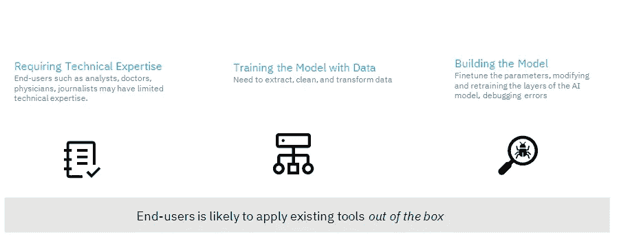

# 文本模式提取：比较 GPT-3 与人机协作工具

> 原文：[`towardsdatascience.com/text-pattern-extraction-comparing-gpt-3-human-in-the-loop-tool-f2380fd13cf1?source=collection_archive---------3-----------------------#2023-01-26`](https://towardsdatascience.com/text-pattern-extraction-comparing-gpt-3-human-in-the-loop-tool-f2380fd13cf1?source=collection_archive---------3-----------------------#2023-01-26)

## 初步实验和比较 LLMs 与人机协作工具在文本模式提取方面的结果

 [Maeda Hanafi](https://maeda-han.medium.com/?source=post_page-----f2380fd13cf1--------------------------------)

·

[关注](https://medium.com/m/signin?actionUrl=https%3A%2F%2Fmedium.com%2F_%2Fsubscribe%2Fuser%2Fa5bd797bb02&operation=register&redirect=https%3A%2F%2Ftowardsdatascience.com%2Ftext-pattern-extraction-comparing-gpt-3-human-in-the-loop-tool-f2380fd13cf1&user=Maeda+Hanafi&userId=a5bd797bb02&source=post_page-a5bd797bb02----f2380fd13cf1---------------------post_header-----------) 发表在 [Towards Data Science](https://towardsdatascience.com/?source=post_page-----f2380fd13cf1--------------------------------) ·10 分钟阅读·2023 年 1 月 26 日

--

由 [Aaron Burden](https://unsplash.com/@aaronburden?utm_source=unsplash&utm_medium=referral&utm_content=creditCopyText) 拍摄，发布于 [Unsplash](https://unsplash.com/photos/nDeo4F3Zq28?utm_source=unsplash&utm_medium=referral&utm_content=creditCopyText)

近年来，人工智能在多个工业应用中引起了广泛关注。最终用户如医生、分析师和记者希望为他们的特定用例构建 AI 模型。

然而，构建 AI 模型的工作流程需要技术专长，而终端用户可能不具备这些技能：

+   准备数据，例如提取、清理和转换训练数据。

+   训练 AI 模型，包括微调参数和重新训练模型的层。

动机：使终端用户能够构建 AI 模型。图片来源：作者。

终端用户可能会直接使用现有工具 ***开箱即用***。有几种工具可以供终端用户开箱即用地构建 AI 模型。

最近，一类工具称为“人类在环”（HITL）工具，旨在降低终端用户构建 AI 模型的门槛。“人类在环”将人类知识融入模型构建过程。这是…
