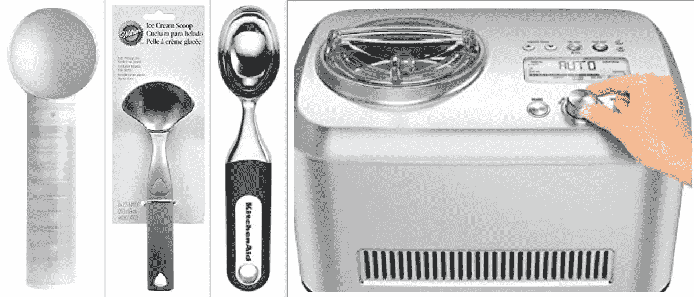
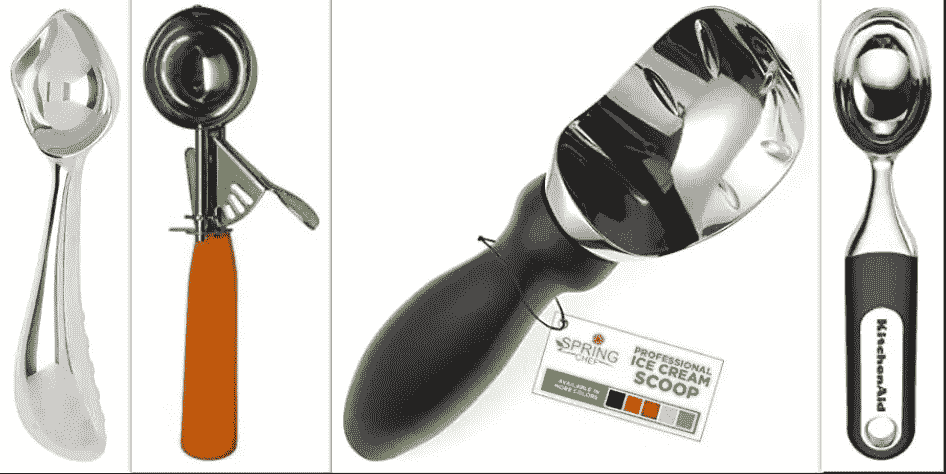

# 文本搜索与向量搜索：更好地结合？

> 原文：[`towardsdatascience.com/text-search-vs-vector-search-better-together-3bd48eb6132a?source=collection_archive---------2-----------------------#2023-02-16`](https://towardsdatascience.com/text-search-vs-vector-search-better-together-3bd48eb6132a?source=collection_archive---------2-----------------------#2023-02-16)

## 了解如何使用 OpenSearch 设置混合搜索系统，以便您可以同时受益于文本搜索和向量搜索的优势

[](https://medium.com/@noamschwartz1?source=post_page-----3bd48eb6132a--------------------------------)[](https://towardsdatascience.com/?source=post_page-----3bd48eb6132a--------------------------------) [Noam Schwartz](https://medium.com/@noamschwartz1?source=post_page-----3bd48eb6132a--------------------------------)

·

[关注](https://medium.com/m/signin?actionUrl=https%3A%2F%2Fmedium.com%2F_%2Fsubscribe%2Fuser%2F77ffd6350db9&operation=register&redirect=https%3A%2F%2Ftowardsdatascience.com%2Ftext-search-vs-vector-search-better-together-3bd48eb6132a&user=Noam+Schwartz&userId=77ffd6350db9&source=post_page-77ffd6350db9----3bd48eb6132a---------------------post_header-----------) 发表在 [数据科学前沿](https://towardsdatascience.com/?source=post_page-----3bd48eb6132a--------------------------------) ·8 分钟阅读·2023 年 2 月 16 日[](https://medium.com/m/signin?actionUrl=https%3A%2F%2Fmedium.com%2F_%2Fvote%2Ftowards-data-science%2F3bd48eb6132a&operation=register&redirect=https%3A%2F%2Ftowardsdatascience.com%2Ftext-search-vs-vector-search-better-together-3bd48eb6132a&user=Noam+Schwartz&userId=77ffd6350db9&source=-----3bd48eb6132a---------------------clap_footer-----------)

--

[](https://medium.com/m/signin?actionUrl=https%3A%2F%2Fmedium.com%2F_%2Fbookmark%2Fp%2F3bd48eb6132a&operation=register&redirect=https%3A%2F%2Ftowardsdatascience.com%2Ftext-search-vs-vector-search-better-together-3bd48eb6132a&source=-----3bd48eb6132a---------------------bookmark_footer-----------)

图片由 [Aarón Blanco Tejedor](https://unsplash.com/@innernature?utm_source=medium&utm_medium=referral) 提供，来源于 [Unsplash](https://unsplash.com/?utm_source=medium&utm_medium=referral)

文本数据库在许多业务工作负载中扮演着关键角色，特别是在电子商务中，客户依赖产品描述和评论来做出明智的购买决定。向量搜索，利用文本嵌入来找到语义相似的文档，是另一个强大的工具。然而，由于对将其实施到现有工作流程的复杂性的担忧，一些企业可能会对尝试向量搜索持保留态度。但是，如果我告诉你这可以很容易地完成并且带来显著的好处呢？

在这篇博客文章中，我将展示如何轻松创建一个结合文本和向量搜索的混合设置。这个设置将给你最全面和准确的搜索结果。我将使用 OpenSearch 作为搜索引擎，并使用 Hugging Face 的 [Sentence Transformers](https://huggingface.co/sentence-transformers/all-MiniLM-L6-v2) 来生成嵌入。我为这个任务选择的数据集是“XMarket”数据集（更详细的描述见 [这里](https://arxiv.org/pdf/2109.05929.pdf)），在索引过程中，我们将标题字段嵌入到向量表示中。

# **准备数据集**

首先，我们将使用 Sentence Transformers 来索引我们的文档。这个库有预训练的模型，可以生成句子或段落的嵌入。这些嵌入作为文本的独特指纹。在索引过程中，我将标题字段转换为向量表示，并将其在 OpenSearch 中索引。你可以通过简单地导入模型并编码任何文本字段来实现这一点。

可以通过编写以下两行来导入模型：

```py
from sentence_transformers import SentenceTransformer 

model = SentenceTransformer('sentence-transformers/all-MiniLM-L6-v2') 

embedding = model.encode(text_field)
```

就这么简单！

我们将通过传递以下映射来创建一个名为“products”的索引：

```py
{ 
   "products":{ 
      "mappings":{ 
         "properties":{ 
            "asin":{ 
               "type":"keyword" 
            }, 
            "description_vector":{ 
               "type":"knn_vector", 
               "dimension":384 
            }, 
            "item_image":{ 
               "type":"keyword" 
            }, 
            "text_field":{ 
               "type":"text", 
               "fields":{ 
                  "keyword_field":{ 
                     "type":"keyword" 
                  } 
               }, 
               "analyzer":"standard" 
            } 
         } 
      } 
   } 
} 
```

*asin — 从产品元数据中获取的文档唯一 ID。*

*description_vector — 这是我们存储编码后的产品标题字段的地方。*

*item_image- 这是产品的图片网址*

*text_field — 这是产品的标题*

请注意，我们使用的是标准的 OpenSearch 分析器，它会将字段中的每个单词标记为单个关键词。OpenSearch 使用这些关键词来进行 Okapi BM25 算法。我还将标题字段保存了两次；一次是其原始格式，一次是向量表示。

然后，我将使用该模型来编码标题字段，并创建将批量上传到 OpenSearch 的文档：

```py
def store_index(index_name: str, data: np.array, metadata: list, os_client: OpenSearch): 
    documents = [] 
    for index_num, vector in enumerate(data): 
        metadata_line = metadata[index_num] 
        text_field = metadata_line["title"] 
        embedding = model.encode(text_field) 
        norm_text_vector_np = normalize_data(embedding) 
        document = { 
            "_index": index_name, 
            "_id": index_num, 
            "asin": metadata_line["asin"], 
            "description_vector": norm_text_vector_np.tolist(), 
            "item_image": metadata_line["imgUrl"], 
            "text_field": text_field 
        } 
        documents.append(document) 
        if index_num % 1000 == 0 or index_num == len(data): 
            helpers.bulk(os_client, documents, request_timeout=1800) 
            documents = [] 
            print(f"bulk {index_num} indexed successfully") 
            os_client.indices.refresh(INDEX_NAME) 

    os_client.indices.refresh(INDEX_NAME) 
```

# **混合搜索实现**

计划是创建一个客户端，该客户端将从用户那里获取输入，使用 Sentence Transformers 模型生成嵌入，并执行我们的混合搜索。用户还会被要求提供一个提升级别，即他们希望给予文本搜索或向量搜索的相对重要性。这样，用户可以选择优先考虑一种搜索类型。例如，如果用户希望他的查询的语义意义比描述中的简单文本出现更重要，他可以给向量搜索更高的提升等级。

# **搜索**

我们将首先使用 OpenSearch 的搜索方法在索引上进行文本搜索。此方法接受一个查询字符串，并返回与查询匹配的文档列表。OpenSearch 通过利用 Okapi BM25 作为排名算法来获取文本搜索结果。使用 OpenSearch 进行文本搜索是通过发送以下请求体进行的：

```py
bm25_query = {
    "size": 20,
    "query": {
        "match": {
            "text_field": query
        }
    },
    "_source": ["asin", "text_field", "item_image"],
}
```

其中 *textual_query* 是用户输入的文本。为了使我的结果以干净的方式返回，我添加了“_source”，以便 OpenSearch 仅返回我感兴趣的特定字段。

由于文本和向量搜索的排名分数算法不同，我们需要将分数调整到相同的尺度，以便结合结果。为此，我们将对每个文档的文本搜索分数进行归一化。最大 BM25 分数是针对特定查询在集合中分配给文档的最高分数。它表示文档与查询的最大相关性。最大 BM25 分数的值取决于 BM25 公式的参数，例如平均文档长度、术语频率和逆文档频率。因此，我取了 OpenSearch 为每个查询收到的最大分数，并将每个结果分数除以它，得到 0 到 1 之间的分数。以下函数演示了我们的归一化算法：

```py
def normalize_bm25_formula(score, max_score):
    return score / max_score
```

接下来，我们将使用向量搜索方法进行向量搜索。此方法接受一个嵌入列表，并返回与这些嵌入在语义上相似的文档列表。

对 OpenSearch 的搜索查询如下所示：

```py
cpu_request_body = {
    "size": 20,
    "query": {
        "script_score": {
            "query": {
                "match_all": {}
            },
            "script": {
                "source": "knn_score",
                "lang": "knn",
                "params": {
                    "field": "description_vector",
                    "query_value": get_vector_sentence_transformers(query).tolist(),
                    "space_type": "cosinesimil"
                }
            }
        }
    },
    "_source": ["asin", "text_field", "item_image"],
}
```

其中 get_vector_sentence_transformers 将文本发送到 *model.encode(text_input)*，该方法返回文本的向量表示。还要注意，您的 topK 结果越高，结果越准确，但这也会增加延迟。

# **插值结果并应用提升**


由 [Amol Tyagi](https://unsplash.com/@amoltyagi2?utm_source=medium&utm_medium=referral) 提供的照片，来源于 [Unsplash](https://unsplash.com/?utm_source=medium&utm_medium=referral)

现在我们需要将两个搜索结果结合起来。为此，我们将对结果进行插值处理，使得在两个搜索中都出现的每个文档在混合结果列表中排名更高。这样，我们可以利用文本和向量搜索的优势，获得最全面的结果。

以下函数用于插值关键词搜索和向量搜索的结果。它返回一个字典，包含两个命中的结果集之间的共同元素及每个文档的分数。如果文档只出现在一个搜索结果中，则我们将其分配为检索到的最低分数。

```py
def interpolate_results(vector_hits, bm25_hits):
    # gather all product ids
    bm25_ids_list = []
    vector_ids_list = []
    for hit in bm25_hits:
        bm25_ids_list.append(hit["_source"]["asin"])
    for hit in vector_hits:
        vector_ids_list.append(hit["_source"]["asin"])
    # find common product ids
    common_results = set(bm25_ids_list) & set(vector_ids_list)
    results_dictionary = dict((key, []) for key in common_results)
    for common_result in common_results:
        for index, vector_hit in enumerate(vector_hits):
            if vector_hit["_source"]["asin"] == common_result:
                results_dictionary[common_result].append(vector_hit["_score"])
        for index, BM_hit in enumerate(bm25_hits):
            if BM_hit["_source"]["asin"] == common_result:
                results_dictionary[common_result].append(BM_hit["_score"])
    min_value = get_min_score(common_results, results_dictionary)
    # assign minimum value scores for all unique results
    for vector_hit in vector_hits:
        if vector_hit["_source"]["asin"] not in common_results:
            new_scored_element_id = vector_hit["_source"]["asin"]
            results_dictionary[new_scored_element_id] = [min_value]
    for BM_hit in bm25_hits:
        if BM_hit["_source"]["asin"] not in common_results:
            new_scored_element_id = BM_hit["_source"]["asin"]
            results_dictionary[new_scored_element_id] = [min_value]

    return results_dictionary
```

最终我们将得到一个以文档 ID 为键，以分数数组为值的字典。数组中的第一个元素是向量搜索分数，第二个元素是文本搜索归一化分数。

最后，我们对搜索结果应用提升。我们将遍历结果的分数，将第一个元素乘以向量提升水平，第二个元素乘以文本提升水平。

```py
def apply_boost(combined_results, vector_boost_level, bm25_boost_level):
    for element in combined_results:
        if len(combined_results[element]) == 1:
            combined_results[element] = combined_results[element][0] * vector_boost_level + \
                                        combined_results[element][0] * bm25_boost_level
        else:
            combined_results[element] = combined_results[element][0] * vector_boost_level + \
                                        combined_results[element][1] * bm25_boost_level
    #sort the results based on the new scores
    sorted_results = [k for k, v in sorted(combined_results.items(), key=lambda item: item[1], reverse=True)]
    return sorted_results
```

现在是时候看看我们有什么了！这就是完整的工作流程：


作者制作的 GIF

我搜索了一个句子“冰淇淋勺”，为向量搜索和文本搜索分别设置了 0.5 的提升，这就是我在前几个结果中得到的：

向量搜索返回 —


来自 XMarket 数据集的图片

文本搜索返回 —



来自 XMarket 数据集的图片

混合搜索返回 —



来自 XMarket 数据集的图片

在这个例子中，我们使用文本和向量搜索来搜索“冰淇淋勺”。文本搜索返回包含关键词“an”、“ice”、“cream”和“scoop”的文档。文本搜索排名第四的结果是一个冰淇淋机，它显然不是一个勺子。它排名如此靠前的原因是其标题“Breville BCI600XL Smart Scoop Ice Cream Maker”包含了句子中的三个关键词：“Scoop”、“Ice”、“Cream”，因此在 BM25 中的评分很高，尽管它与我们的搜索不匹配。而向量搜索则返回语义上与查询相似的结果，无论关键词是否出现在文档中。它知道“scoop”出现在“ice cream”之前意味着匹配度较低。因此，我们得到了一个更全面的结果集，其中包含了比单纯提到“冰淇淋勺”的文档更多的信息。

很明显，如果你只使用一种搜索方式，你将错过有价值的结果或显示不准确的结果，从而使客户感到沮丧。当利用两者的优势时，我们会得到更准确的结果。所以，我相信我们的答案是，"更好地结合"已经证明是正确的。

但等等，更好的可以变得**更好**吗？改善搜索体验的一种方法是利用 OpenSearch 中的 APU 力量（联想处理单元）。通过使用 [Searchium.ai](https://www.searchium.ai/) 的插件在 APU 上进行向量搜索，我们可以利用先进的算法和处理能力来进一步[改善延迟并显著降低成本](https://betterprogramming.pub/tired-of-troubleshooting-idle-search-resources-use-opensearch-benchmark-for-performance-tuning-d4277c9f724)（例如，$0.23 对比 $8.76），同时仍然获得[类似的结果](https://www.youtube.com/watch?v=AqbRTT5Z7h0)。

我们可以[安装插件](https://www.youtube.com/watch?v=7p08K-Ul1O0)、[将索引上传到 APU](https://www.youtube.com/watch?v=RfoeZKmJcTY&t=3s)，并通过发送略微修改过的请求体进行搜索：

```py
apu_request_body = {
    "size": 20,
    "query": {
        "gsi_knn": {
            "field": "description_vector",
            "vector": get_vector_sentence_transformers(query).tolist(),
        }
    },
    "_source": ["asin", "text_field", "item_image"],
} 
```

其他所有步骤都是相同的！

总结一下，通过结合使用 OpenSearch 和 Sentence Transformers 的文本与向量搜索，企业可以轻松改善搜索结果。而通过利用 APU，企业可以将搜索结果提升到一个新的水平，同时降低基础设施成本。不要让复杂性的问题阻碍你。试一试，看看它能带来哪些好处。祝搜索愉快！

完整的代码可以在[这里](https://github.com/Searchium-ai/hybrid-search)找到。

特别感谢[Yaniv Vaknin](https://medium.com/@yaniv.vaknin) 和[Daphna Idelson](https://www.linkedin.com/in/daphnaidelson/)的所有帮助！
