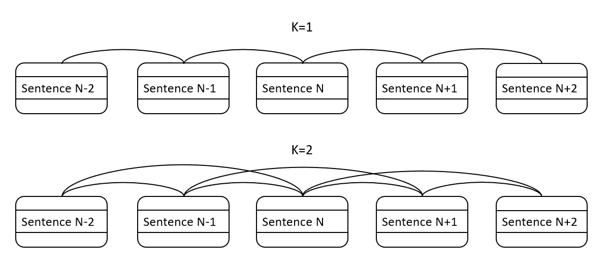
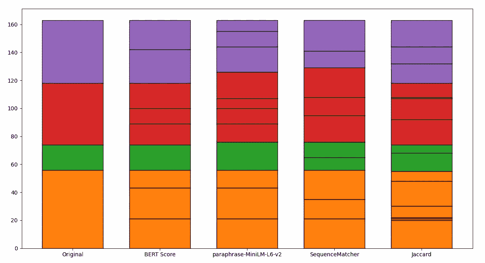

# **文本切分正确实施**：为您的个人 LLM 打下坚实的基础

> 原文：[`towardsdatascience.com/text-tiling-done-right-building-solid-foundations-for-your-personal-llm-e70947779ac1?source=collection_archive---------3-----------------------#2023-06-04`](https://towardsdatascience.com/text-tiling-done-right-building-solid-foundations-for-your-personal-llm-e70947779ac1?source=collection_archive---------3-----------------------#2023-06-04)

## 如何从头开始使用语义和词汇相似性构建文本切分模型

 [Massimiliano Costacurta](https://medium.com/@massi.costacurta?source=post_page-----e70947779ac1--------------------------------)

·

[关注](https://medium.com/m/signin?actionUrl=https%3A%2F%2Fmedium.com%2F_%2Fsubscribe%2Fuser%2F233cb43234c3&operation=register&redirect=https%3A%2F%2Ftowardsdatascience.com%2Ftext-tiling-done-right-building-solid-foundations-for-your-personal-llm-e70947779ac1&user=Massimiliano+Costacurta&userId=233cb43234c3&source=post_page-233cb43234c3----e70947779ac1---------------------post_header-----------) 发表于 [Towards Data Science](https://towardsdatascience.com/?source=post_page-----e70947779ac1--------------------------------) · 11 分钟阅读 · 2023 年 6 月 4 日

--

图片由 [Gary Butterfield](https://unsplash.com/@garybpt?utm_source=medium&utm_medium=referral) 提供，来自 [Unsplash](https://unsplash.com/?utm_source=medium&utm_medium=referral)

现在似乎每个人都在尝试获得自己的大型语言模型（LLM），并调整其以适应他们的私人文档集。隐私因素在这里起着重要作用，进一步推动了对更多私人 GPT 模型的需求。然而，创建个人聊天机器人的过程并不简单，你基本上有两个主要选项来实现这一目标。

首先，你可以从头开始构建一个定制的问题-答案数据集，并用它来微调你的 LLM。但说实话，由于高成本和显著的时间投入，这对大多数人来说并不是一个可行的选项。另一种更具成本效益的方法是动态生成上下文。这是通过基于用户查询从文档中检索相关部分来完成的，借助嵌入技术。尽管有很多教程解释如何做这件事，但很少有人强调适当地切分或“切块”文档的重要性。

这之所以至关重要，是因为如果你的文档切分不准确，你的上下文可能会出现偏差，从而导致你的 LLM 给出的答案完全偏离主题，或者更糟的是，生成虚假的信息——在机器学习中，这种现象通常被称为“幻觉”。这就是文本切分艺术发挥作用的地方。这一过程的核心在于将文档拆分成连贯且有意义的块，以便于精确、相关的上下文检索。这样做，你很可能会提高 LLM 的整体表现，使其更擅长理解查询并提供准确的回应。

现在，可能会让你感到惊讶（就像我一样惊讶）的是，在 Python 编程的世界里，文本切分的选项并不多。我们主要的工具是[nltk.tokenize.texttiling](https://www.nltk.org/_modules/nltk/tokenize/texttiling.html)，但这个工具的文档并不完善。意识到这一点的缺乏和改进的潜力，我决定开始开发自己的文本切分模型，利用自然语言处理（NLP）和变换器提供的革命性技术。

# 文本切分模型的评估机制

每当我开始开发一个新模型时，我总是尝试以最终目标为出发点，然后从那里向后工作。在这种情况下，我们的“终点”是评估模型的输出。如果没有评估手段，我们就无法衡量性能，因此无法进行改进。因此，在尝试开发模型之前，创建一个评估机制是至关重要的。然而，评估文本切分面临独特的挑战，因为它涉及到文档中出现的主题。这给我们带来了两个主要难题：

1.  我们没有带有对应切分的数据集。

1.  即使我们有这样的数据集，由于按主题划分文档高度主观，利用起来也会异常困难。

为了应对这些问题，我们将采取一种简单的方法：创建一个合成文档。这个文档将是各种文档的拼接，确保我们知道原始文档之间的确切阈值。这些阈值应由我们的模型识别。在这篇文章中，我将用一个文档作为示例（可以在[这里](https://github.com/massi82/texttiling/blob/master/doc.txt)找到）。不过，这种方法也可以用于组装大量文档进行全面的模型测试。这个复合文档是由以下 Medium 文章拼接而成的（对于这些文章的作者，算是免费推广，稍后可以感谢我😀）：

[3 个生成型 AI 的令人不快的后果](https://medium.com/@brandeismarshall/3-unsavory-consequences-of-generative-ai-2b9f5c29f52b?source=post_page-----e70947779ac1--------------------------------) [## 生成型 AI 的 3 个令人不快的后果

### ‘快速行动，打破常规’的标准操作程序正处于极速运转中。各行各业都在…

[平均合同价值在 SaaS](https://medium.com/@brandeismarshall/3-unsavory-consequences-of-generative-ai-2b9f5c29f52b?source=post_page-----e70947779ac1--------------------------------) [## 平均合同价值在 SaaS

### 平均合同价值是 SaaS 中的一个重要指标。如果它在上升并趋向右侧，这表明客户…

[平均合同价值在 SaaS](https://blossomstreetventures.medium.com/average-contract-value-in-saas-a7f0d02ca350?source=post_page-----e70947779ac1--------------------------------) [## 我们治疗压力、焦虑和抑郁的方法完全错了

### 心理健康问题的最佳疗法显而易见，但很少被开处方

[我们治疗压力、焦虑和抑郁的方法完全错了](https://medium.com/wise-well/were-treating-stress-anxiety-and-depression-all-wrong-809566f1b73b?source=post_page-----e70947779ac1--------------------------------) [## 你的副业不如在大公司工作

### 尽管你获得了所有的自由，但在自己工作时你错过了许多东西

[你在大公司工作的体验远不如你副业的效果](https://medium.com/illumination/your-side-hustle-sucks-compared-to-working-for-a-big-company-49664f1ef73?source=post_page-----e70947779ac1--------------------------------)

现在我们已经建立了评估模型的方法，我们需要定义如何衡量其效能。首先考虑我们的合成文档，其中有预先知道的明确阈值。在我们的例子中，这些阈值为：（0, 56, 74, 118, 163）。这意味着第一篇文章在 56 句话后结束，第二篇在 74 句话后结束，以此类推。我们的模型将根据它在每篇文章中识别的子主题，输出一个类似但更详细的阈值列表。一个示例输出可能是：（0, 26, 54, 67, 74, 90, 112, 120, 130, 163）。

那么，我们如何评估模型的有效性？我能设计出的最合乎逻辑的方法是计算原始向量与模型输出之间的“编辑距离”。这个过程如下：

1.  确定模型输出中所有接近真实阈值的数字（排除第一个和最后一个）。使用上面的例子，我们将得到（54, 74, 120）。

1.  如果数字少于真实阈值，则用‘None’填补空白（在我们的例子中不会发生）。

1.  计算每个相应阈值之间的距离，遇到‘None’时用原始向量的最大值代替。在我们的例子中，这将生成（2, 0, 2）。

1.  将这些距离求和，并通过将其除以原始向量的最大阈值乘以向量的长度来标准化。这提供了一个从 0 到 1 的距离，可以通过计算：1-距离来轻松转换为分数。在我们的例子中：1-4/163 → 1-0.0245 → **0.975**

1.  （可选）根据阈值总数对分数施加惩罚。这是为了惩罚生成过多阈值的模型。尽管这些阈值在统计上可能接近真实值，但它们不一定有意义。

这里是实现上述步骤中描述的评分计算的`code`。

这个函数目前远未完美。具体来说，它倾向于产生偏向 1 的值。然而，它足以用于比较我们模型生成的结果。如果你有任何改进其实现的建议，我非常乐意在评论中听取。

# 生成句子相似度分数

现在我们已经建立了评估模型性能的方法，我们可以开始考虑如何提取阈值。我们模型的基本概念相当简单：文档的块本质上是具有某种相似性水平的句子簇。换句话说，位于同一块中的句子对应该产生较高的相似度分数，而来自不同块的句子对应该产生较低的分数。无论我们决定使用哪种聚类方法，我们都可以安全地说，我们需要一种句子相似度度量。在自然语言处理（NLP）中，最常见的两种相似度度量形式是词汇（基于词汇比较）和语义（基于意义，更技术性地基于嵌入）。在我们的模型中，我们将测试不同类型的相似度分数，并比较它们在测试文档上的表现。具体而言，我们将利用以下模型/算法：

+   [BERT 分数](https://huggingface.co/spaces/evaluate-metric/bertscore)（语义）

+   [paraphrase-MiniLM-L6-v2](https://huggingface.co/sentence-transformers/paraphrase-MiniLM-L6-v2)（语义）

+   [SequenceMatcher](https://docs.python.org/3/library/difflib.html)（词汇）

+   [Jaccard 相似度](https://en.wikipedia.org/wiki/Jaccard_index)（词汇）

计算相似度分数的函数本质上是一个大型的“IF-ELSE”代码块，根据用户选择的输入模型在不同方法之间切换。

为了性能优化，该函数接受两个句子列表作为输入，并返回相应的相似度度量列表。

接下来，我们需要决定实际要计算哪些相似度分数。一个方法是通过比较每个句子与所有其他句子的对比来计算逐对相似度。这种方法虽然全面，但不仅效率低下且难以扩展，而且也不理想。我们所寻求的簇将由连续的句子组成，这意味着我们不希望识别文档中相距较远的句子之间的联系——实际上，我们的目标是避免这种情况！在另一端，我们可以考虑仅计算给定句子与其后面句子之间的相似度。虽然合理地假设相邻句子具有相同的意义，但这种方法也存在风险。考虑“填充句子”——那些用于修饰文本但不传达任何特定意义或对上下文没有贡献的句子。例子包括“我会尝试不同的说法”或“但是我跑题了”（出现在我们的测试文档中！）。这样的句子可能会产生人为的阈值，我们肯定想要避免这种情况。

因此，我们将采用一种混合方法，只计算每个句子与接下来的 K 个句子的相似度（是的，K 是一个超参数）。如下面的图示所示，一旦设置了 K 参数，每个句子将连接到 2*K 个句子——K 个前面的句子和 K 个后面的句子。

作者提供的图片。

生成这种相似度分数的代码封装在函数`create_similarity_graph`中：

正如函数名称所示，这个函数构建的是一个图，其中节点代表句子，相似性分数作为边的权重。输出格式如下：

（句子 1，句子 2，相似度比 1）

（句子 1，句子 3，相似度比 2）

…

（句子 1，句子 K，相似度比 K-1）

（句子 2，句子 3，相似度比 K）

…

确实，这本质上是一个形式为（父节点，子节点，边权重）的图。还需要注意第 27 行的系数`math.exp(-l/2)`，它会乘以相似性分数。我们使用这个系数来适应“距离效应”——即两个句子之间的相似性应随着它们的距离增加而减少。

# 基于图的文本分割

有了我们的相似度分数，下一步是找到有效的方式对其进行聚类。当前数据的图结构暗示了选择合适算法的方向。虽然有许多图聚类的选项，但我特别偏爱[Louvain 社区检测方法](https://networkx.org/documentation/stable/reference/algorithms/generated/networkx.algorithms.community.louvain.louvain_communities.html)，主要是因为它在 Python 中的实现简单且能够高效处理大规模数据。

在算法的上下文中，“社区”指的是一个节点密集互连的簇，同时与其他社区的节点连接稀疏。将这个概念转化到我们的文档分块任务中，这些“社区”就是我们寻求的块。每个块或社区是一个高度相关的句子簇，形成文档中的一个连贯主题或子主题。

鉴于上述图结构，提取社区仅需几行代码。

虽然 Louvain 算法在寻找图中的社区方面表现出色，但重要的是要记住，这些社区在文档分块的上下文中可能并不总是对应于连贯的句子序列。这是因为该算法本身并不意识到它处理的是一个文本文档，其中句子的顺序和连续性很重要。

在社区检测过程中，Louvain 算法可能会生成包含非连续句子的聚类。例如，它可能会生成一个类似（1，2，3，4，6，7）的聚类，遗漏了句子 5。虽然这个聚类可能在内部相似性上仍然很高，但它并未在文档中形成一个逻辑上的块，因为从句子 4 到句子 6 有一个“间隙”或“跳跃”。在将基于图的聚类应用于文档分块时，这是一个关键点。我们的期望是找到连贯、不间断的文本段落——即代表相关内容连续块的块。

为了解决这个问题，我在代码中加入了一个后处理步骤，特别是在第 46 行调用 `compact_clusters` 函数。由于我没有找到任何现成的算法来执行此任务（如果你知道一个，我很乐意了解），我设计了一个基于以下步骤的简单算法：

1.  对于每一对聚类，识别它们之间的重叠范围。考虑到聚类 a=(1, 2, 3, 6, 7, 8) 和 b=(4, 5, 9, 10, 11)，重叠范围将是 (4, 5, 6, 7, 8)。

1.  确定消除重叠所需的最少移动次数。在我们的示例中，我们可以将 (6, 7, 8) 从聚类 ‘a’ 转移到 ‘b’，或者将 (4, 5) 从聚类 ‘b’ 移动到 ‘a’。最优选择是后者，因为需要的移动次数更少。如果出现平局，可以做出随机决策。

1.  根据此调整重新配置聚类。调整后，我们将得到 a = (1, 2, 3, 4, 5, 6, 7, 8) 和 b = (9, 10, 11)。

这种方法确保了我们生成的最终瓦片不仅在内部是一致的，而且在原始文档序列的上下文中也是有意义的。

这是函数的实现：

# 汇总

现在我们已经构建了所有必要的函数，编写一个确定目标文档瓦片的脚本是很简单的任务。只需几行代码：

如前所述，我们仅测试了四种模型，但集成更多模型只需通过添加新的 ‘elif’ 部分来修改 `get_similarity_scores` 函数。鉴于我们问题的性质，构建计算瓦片的可视化表示也是很有启发性的。这种图形描述提供了一个立即了解我们算法相对于原始文档表现的方式。这是我使用的绘图函数：

以下是结果图：

图片来源于作者。

第一条柱状图展示了原始文档，分割成四篇不同的文章。可以明显看出，BERT Score 的表现非常出色，完美匹配了所有三个主要阈值，而 paraphrase-MiniLM-L6-v2 在三个阈值中有两个未能匹配（第二个几乎匹配，第三个则偏差较大）。值得注意的是，这两个语义模型在文章中识别出了非常相似的子主题，暗示了可以使用集成方法来确定实际应用中的准确阈值。令人惊讶的是，词汇模型的表现并不差，尽管 Jaccard 引入了一些与文档结构不相关的虚假阈值。

总结一下，以下是四种测试算法的得分：

+   BERT Score: **0.9950**

+   paraphrase-MiniLM-L6-v2: **0.9321**

+   SequenceMatcher: **0.9208**

+   Jaccard: **0.9830**

# 收获与下一步

根据我们涉及目标文档的简短测试，很明显，提出的文档标题方法展示了显著的前景。正如我们预期的那样，由于语义方法能够捕捉文本中更深层次的上下文关系，因此在这个特定任务中相比词汇方法具有优势。本文中解释的工作代码的代码库可在[此处](https://github.com/massi82/texttiling)找到。可能的改进领域包括：

1.  **评分函数的优化**：当前的标题评分函数表现出对值 1 的偏倚。解决这一偏倚，使评分函数更加平衡，将提高结果的可靠性，并提供对模型性能的更准确评估。

1.  **探索额外的模型**：本研究中我们只测试了四种模型。测试更多的模型，特别是不同类型的语义模型，可能会揭示新的见解，并进一步提高性能。这也可以包括尝试结合多个模型优点的集成方法。

1.  **跨多个文档的验证**：我们的测试仅涉及一个文档。对各种文档进行性能评估将使我们更清楚其稳健性和普遍性。不同类型的文本、体裁或主题可能会影响标题生成过程的表现。

1.  **子主题识别的提升**：尽管我们的模型能够识别文章中的子主题，但仍有改进的空间。可以使用集成方法或其他高级策略来提高子主题确定的准确性，确保衍生的标题反映出文档的细致结构。

你喜欢这篇文章吗？如果你对人工智能、自然语言处理、机器学习和数据分析在解决实际问题中的应用感兴趣，你可能也会喜欢我的其他作品。我的目标是创作能够展示这些变革性技术在实际场景中的可操作性文章。如果这也是你的兴趣，关注我在 Medium 上的最新作品吧！
