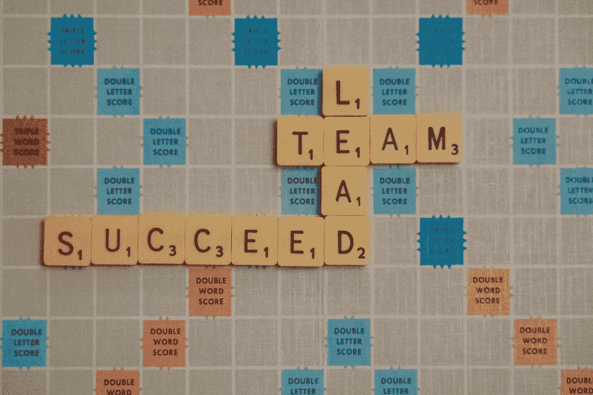

# 每位数据领导者成功所需的 3 项核心技术技能

> 原文：[`towardsdatascience.com/the-3-essential-technical-skills-every-data-leader-needs-to-be-successful-a1800c644469`](https://towardsdatascience.com/the-3-essential-technical-skills-every-data-leader-needs-to-be-successful-a1800c644469)

## 赋能数据领导者掌握关键技术技能，以推动业务洞察

 [Hanzala Qureshi](https://hanzalaqureshi.medium.com/?source=post_page-----a1800c644469--------------------------------)

·发布于 [Towards Data Science](https://towardsdatascience.com/?source=post_page-----a1800c644469--------------------------------) ·4 min read·2023 年 6 月 19 日

--

图片由 [Nick Fewings](https://unsplash.com/@jannerboy62?utm_source=medium&utm_medium=referral) 提供，来源于 [Unsplash](https://unsplash.com/?utm_source=medium&utm_medium=referral)

根据[Gartner](https://www.bloomberg.com/professional/blog/study-defines-cdo-reason-role-responsibilities-2017/)的调查，CDO 的平均任期仅为 2.4 年。这一令人震惊的发现突显了数据领导者面临的挑战，并强调了为他们提供实现持久成功所需的核心技术技能的重要性。

尽管作为数据领导者，软技能的关注度非常高，但不幸的是，在早期阶段，技术技能的缺乏有时会导致知识不足，从而导致任期较短。

今天，让我们深入探讨三大关键技术知识领域，赋能数据领导者应对数据分析的复杂性，推动创新，并最终在其组织中产生持久影响。

## 1\. 解释和传达架构的能力

架构知识对数据领导者的成功至关重要。

你需要处理的首要任务之一是确保为组织提供数据的平台稳健可靠。然而，缺乏架构知识的领导者往往难以理解和表达其重要性。

数据架构是一项技术技能，应与沟通这一软技能结合，以便将信息传达给技术和非技术利益相关者。这还包括分析和解释各种数据架构组件，如数据库、数据仓库、数据湖和数据管道。

有效的架构沟通促进了协作和决策。

*你应该能够提出/回答的示例问题：*

+   我们的客户-facing 系统是什么？

+   我们多久从中提取一次信息？

+   组织中的所有数据存储在哪里？

+   通常的数据流是什么样的？

+   捕获数据后我们能多快分析它？

+   哪些数据支持我们的 AI / ML 模型？

+   我们目前如何管理这些数据/应该如何管理这些数据？

+   数据质量如何？

+   我们的约定数据定义是什么？

## 2\. 从用例定义数据价值

如果数据没有提供价值，它就是负担，而不是资产。

作为数据领导者，你应该能够透过繁杂和噪音，准确找出最终解决业务问题的数据。数据领导者还必须具备评估组织战略目标和需求的能力，并将其转化为可操作的数据驱动用例。

这一技能需要对业务领域和现有数据资产有深入了解。

*你应该能够提出/回答的示例问题：*

+   我们的关键数据资产是什么？

+   数据资产如何转化为产品？

+   数据质量不足如何影响最终业务用例？

+   我们用这些数据解决了哪些业务用例？

+   如何利用这些数据生成收入和降低风险？

+   CFO / CRO / CxO 的优先事项是什么，我的数据功能如何支持这些优先事项？

## 3\. 理解数据资产中的复杂性和冗余

简化数据资产，提升效率。

除了收入生成机会，还应关注成本效率。成功的组织很快就会超越其 IT 和数据资产。数据领导者必须了解他们的数据资产以及可以改进或简化的领域。发现冗余可以帮助你简化操作、优化存储和提高数据质量。

这一技能带来简化、高效且现代的数据资产，推动有价值的洞察和业务成果。

*你应该能够提出/回答的示例问题：*

+   有多少数据源或存储区域是冗余的？

+   组织中有哪些数据孤岛，这些数据孤岛的影响是什么？

+   如果某些操作数据存储被停用，成本效率会如何变化？

+   如何减少复杂性以简化数据治理和质量？

+   哪些业务流程依赖于数据资产中的复杂部分？

## 结论

软技能仍然至关重要；你必须能够与同事谈判，与不同受众沟通，简化复杂主题等。然而，你还必须具备技术技能，以赢得团队和领导的信任。

实施数据质量（DQ）是工作中最困难的部分之一。如果你想向你的领导团队推销 DQ 并实施其核心方面，[请查看我的免费终极数据质量手册](http://hanzalaqureshi.gumroad.com/l/cfijx)。*通过领取你的副本，你还将成为我们教育社区的一部分，通过我们的邮件列表获得有价值的见解和更新。*

 [## 终极数据质量手册 - 免费！

### 介绍《终极数据质量手册：完善数据的最佳实践》。在今天这个数据驱动的世界里……

hanzalaqureshi.gumroad.com](https://hanzalaqureshi.gumroad.com/l/cfijx?layout=profile&source=post_page-----a1800c644469--------------------------------)

如果你还没有订阅 Medium，可以考虑[使用我的推荐链接订阅。它比 Netflix 便宜，并且显然更值得你的时间。](https://hanzalaqureshi.medium.com/membership) 如果你使用我的链接，我会获得少量佣金，而你将获得 Medium 上的无限故事，双赢。
