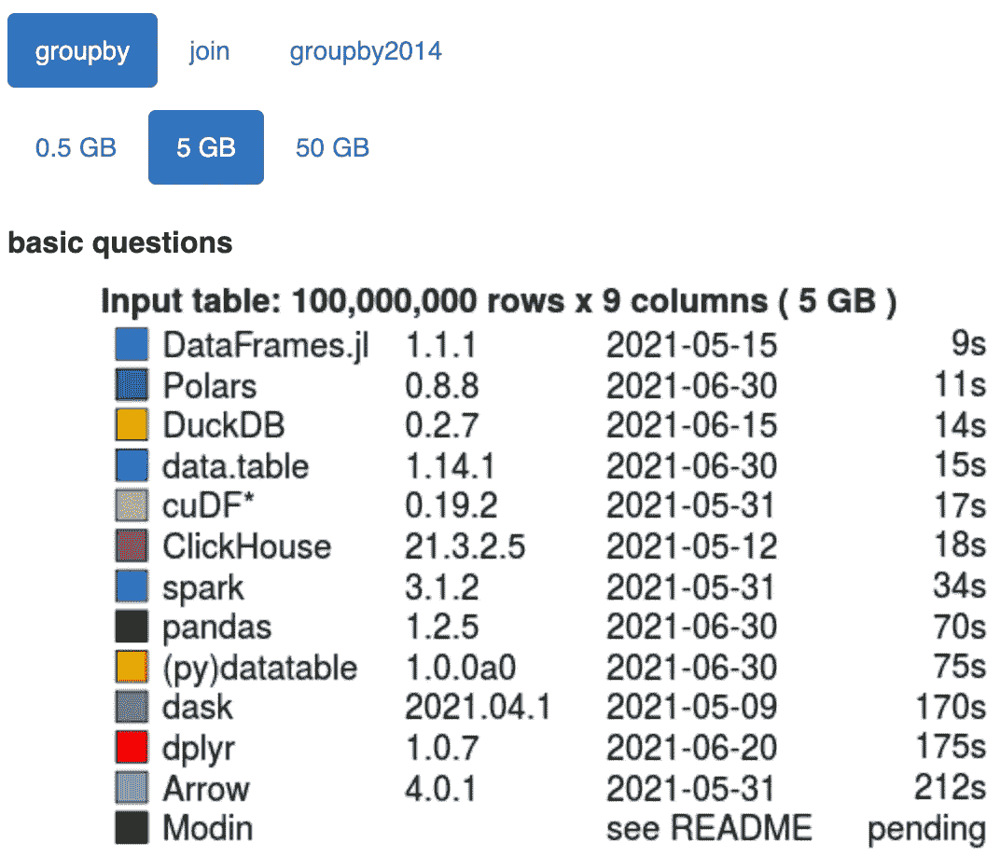
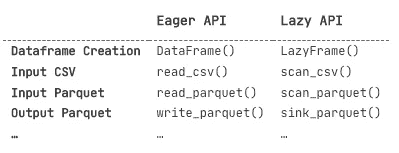

# 我永久切换从 Pandas 到 Polars 的 3 个理由

> 原文：[`towardsdatascience.com/the-3-reasons-why-i-have-permanently-switched-from-pandas-to-polars-b41d013a787b`](https://towardsdatascience.com/the-3-reasons-why-i-have-permanently-switched-from-pandas-to-polars-b41d013a787b)

## 我来是为了速度，但我留在这里是为了语法

[](https://medium.com/@benfeifke?source=post_page-----b41d013a787b--------------------------------)[](https://towardsdatascience.com/?source=post_page-----b41d013a787b--------------------------------) [Ben Feifke](https://medium.com/@benfeifke?source=post_page-----b41d013a787b--------------------------------)

·发表于 [Towards Data Science](https://towardsdatascience.com/?source=post_page-----b41d013a787b--------------------------------) ·阅读时间 10 分钟·2023 年 3 月 28 日

--


[照片](https://unsplash.com/photos/qQWV91TTBrE)由 [Hans-Jurgen Mager](https://unsplash.com/@hansjurgen007) 供稿，刊登在 [Unsplash](https://unsplash.com/)

在撰写这篇文章时，我已经在数据科学领域工作了六年。而在这六年中，`[Pandas](https://pandas.pydata.org/)` 一直是我所有工作的基础：探索性数据分析、影响分析、数据验证、模型实验等。我的职业生涯是建立在`Pandas`之上的！

不用说，我曾经在`Pandas`中有过严重的[锁定](https://en.wikipedia.org/wiki/Vendor_lock-in)。

也就是说，直到我发现了`[Polars](https://github.com/pola-rs/polars)`，这个新的“极其快速的 DataFrame 库”。

在这篇文章中，我将解释：

1.  `Polars` 是什么，以及是什么让它如此快速；

1.  我永久切换从`Pandas`到`Polars`的 3 个理由；

    - `.list` 命名空间；

    - `.scan_parquet()` 和 `.sink_parquet()`；

    - 面向数据的编程。

# 介绍 Polars：你可能从未听说过的最快 Python 数据框库。

也许你听说过`Polars`，也许你没有！无论如何，它正在慢慢改变 Python 的数据处理领域，就从这里的 [Towards Data Science](https://towardsdatascience.com/) 开始：

+   [Leonie Monigatti](https://medium.com/@iamleonie) 最近写了一篇 Pandas 与 Polars 的全面时间比较。

+   [Wei-Meng Lee](https://weimenglee.medium.com/) 已于去年夏天发布了 入门指南。

+   [Carl M. Kadie](https://medium.com/@carlmkadie) 几个月前在 [一个关于](https://medium.com/towards-data-science/understand-polars-lack-of-indexes-526ea75e413) `[Pandas](https://medium.com/towards-data-science/understand-polars-lack-of-indexes-526ea75e413)` [和](https://medium.com/towards-data-science/understand-polars-lack-of-indexes-526ea75e413) `[Polars](https://medium.com/towards-data-science/understand-polars-lack-of-indexes-526ea75e413)` [的最大表面差异之一](https://medium.com/towards-data-science/understand-polars-lack-of-indexes-526ea75e413) 中写道 `[Polars](https://medium.com/towards-data-science/understand-polars-lack-of-indexes-526ea75e413)`[没有索引](https://medium.com/towards-data-science/understand-polars-lack-of-indexes-526ea75e413)。

那么，是什么让 `Polars` 如此快速？来自 `[Polars](https://pola-rs.github.io/polars-book/user-guide/#introduction)` [用户指南](https://pola-rs.github.io/polars-book/user-guide/#introduction)：

> `Polars` 完全用 `[Rust](https://www.rust-lang.org/)` 编写（没有运行时开销！），并使用 `[Arrow](https://arrow.apache.org/)` – 作为其基础的 [原生 arrow2](https://github.com/jorgecarleitao/arrow2) `[Rust](https://github.com/jorgecarleitao/arrow2)` [实现](https://github.com/jorgecarleitao/arrow2)……
> 
> `Polars` 是用 Rust 编写的，这使它具备了 C/C++ 的性能，并且能够完全控制查询引擎中的性能关键部分……
> 
> …与像 dask 这样的工具不同，dask 试图并行化现有的单线程库如 NumPy 和 Pandas，而 Polars 从零开始编写，专为 DataFrame 上的查询并行化设计。

就是这样。`Polars` 不仅仅是一个用于缓解 `Pandas` 单线程特性的框架，像 `[dask](https://docs.dask.org/en/stable/)` 或 `[modin](https://modin.readthedocs.io/en/latest/#)`；相反，它是对 Python 数据框的全面改造，包含了作为基础的高度优化的 [Apache Arrow](http://arrow.apache.org) 列存储内存格式，还有其自身的查询优化引擎。而速度方面的结果令人惊叹（根据 [h2oai 的数据基准测试](https://h2oai.github.io/db-benchmark/)）：



图片来源于 [h2oai 的数据基准工具](https://h2oai.github.io/db-benchmark/)。

对于一个 5GB 的数据框进行 groupby 操作时，`Polars` 比 `Pandas` 快 6 倍以上！

仅仅是这速度就足以引起任何人的兴趣。但正如你将在本文其余部分看到的，速度吸引了我，但真正让我爱上的是其语法。

# 我为什么永久切换到 Polars 的 3 个理由

## 1\. `.list` 命名空间

想象一下在`Pandas`中的以下场景：你有一个包含家庭及其信息的数据集，其中包括家庭成员的所有成员列表：

```py
import pandas as pd
df = pd.DataFrame({
    "last_name": ["Johnson", "Jackson", "Smithson"],
    "members": [["John", "Ron", "Con"], ["Jack", "Rack"], ["Smith", "Pith", "With", "Lith"]],
    "city_of_residence": ["Boston", "New York City", "Dallas"]
})
print(df)

>>>>   last_name                    members city_of_residence
     0   Johnson           [John, Ron, Con]            Boston
     1   Jackson               [Jack, Rack]     New York City
     2  Smithson  [Smith, Pith, With, Lith]            Dallas
```

对于你的分析，你想从`members`列表的第一个元素创建一个新列。你该怎么做？搜索`Pandas` API 会让你迷失，但简单的 stack overflow 搜索会告诉你答案！

提取`Pandas`列中列表元素的主要方法是使用`.str`命名空间（[stackoverflow ref1](https://stackoverflow.com/questions/69409763/Pandas-index-the-first-element-of-each-list-in-a-dataframe-column-of-lists), [stackoverflow ref2](https://stackoverflow.com/questions/45983017/extracting-an-element-of-a-list-in-a-Pandas-column)），像这样：

```py
df["family_leader"] = df["members"].str[0]
print(df)

>>>>   last_name                    members city_of_residence family_leader
     0   Johnson           [John, Ron, Con]            Boston          John
     1   Jackson               [Jack, Rack]     New York City          Jack
     2  Smithson  [Smith, Pith, With, Lith]            Dallas         Smith
```

如果你像我一样，你可能会想，“为什么我必须使用`.str`命名空间来处理`list`数据类型？”。

不幸的是，`Pandas`的`.str`命名空间不能完成所有可能需要的`list`操作；例如，有些操作需要代价高昂的`.apply`。而在`Polars`中，这不是问题。通过符合 Apache Arrow 的列式数据格式，`Polars`具有所有标准数据类型，并有适当的命名空间来处理所有这些类型——包括`list`：

```py
import polars as pl
df = pl.DataFrame({
    "last_name": ["Johnson", "Jackson", "Smithson"],
    "members": [["John", "Ron", "Con"], ["Jack", "Rack"], ["Smith", "Pith", "With", "Lith"]],
    "city_of_residence": ["Boston", "New York City", "Dallas"]
})
df = df.with_columns([
    pl.col("members").list.get(0).alias("family_leader")])
print(df)

>>>> ┌───────────┬─────────────────────────────┬───────────────────┬───────────────┐
     │ last_name ┆ members                     ┆ city_of_residence ┆ family_leader │
     │ ---       ┆ ---                         ┆ ---               ┆ ---           │
     │ str       ┆ list[str]                   ┆ str               ┆ str           │
     ╞═══════════╪═════════════════════════════╪═══════════════════╪═══════════════╡
     │ Johnson   ┆ ["John", "Ron", "Con"]      ┆ Boston            ┆ John          │
     │ Jackson   ┆ ["Jack", "Rack"]            ┆ New York City     ┆ Jack          │
     │ Smithson  ┆ ["Smith", "Pith", … "Lith"] ┆ Dallas            ┆ Smith         │
     └───────────┴─────────────────────────────┴───────────────────┴───────────────┘
```

没错：`Polars`对数据类型非常明确，甚至在每次打印数据框时都会告诉你每一列的数据类型！

但这还不是全部。`Pandas`的 API 不仅需要使用一个数据类型的命名空间来处理另一个数据类型，而且 API 变得非常臃肿，往往有许多种方法来做同一件事。这可能会令人困惑，尤其是对新手而言。考虑以下代码片段：

```py
import pandas as pd

df = pd.DataFrame({
    "a": [1, 1, 1],
    "b": [4, 5, 6]
})

column_name_indexer = ["a"]
boolean_mask_indexer = df["b"]==5
slice_indexer = slice(1, 3)

for o in [column_name_indexer, boolean_mask_indexer, slice_indexer]:
    print(df[o])
```

在这个代码片段中，相同的`Pandas`语法`df[...]`可以执行三种不同的操作：检索数据框的一列，在数据框上执行基于行的布尔掩码，以及按索引检索数据框的切片。

另一个令人困扰的例子是，要处理`dict`列时，使用`Pandas`通常需要执行一个代价高昂的`apply()`函数；而`Polars`则有一个`struct`数据类型，可以直接处理`dict`列！

在`Pandas`中，你不能完成所有你想做的事情，对于可以做的事情，有时有多种方式来完成。与此相比，`Polars`可以做所有事情，数据类型明确，通常只有一种方法来做同一件事。

## 2\. `.scan_parquet()` 和 `.sink_parquet()`

`Polars`最棒的地方之一是它提供了两个 API：一个急切的 API 和一个延迟的 API。

急切的 API 会像`Pandas`一样在内存中运行所有命令。

然而，延迟 API 只有在明确要求响应时（例如，通过`.collect()`语句）才会执行所有操作，有点像`dask`。而且，一旦被要求响应，`Polars`会依赖其查询优化引擎，以最快的时间提供结果。

考虑以下代码片段，比较`Polars`的急切`DataFrame`与其延迟对应物`LazyFrame`的语法：

```py
import polars as pl
eager_df = pl.DataFrame({
    "a": [1, 2, 3],
    "b": [4, 5, 6]
})
lazy_df = pl.LazyFrame({
    "a": [1, 2, 3],
    "b": [4, 5, 6]
})
```

语法非常相似！实际上，急切 API 和延迟 API 之间唯一的主要区别在于数据框的创建、读取和写入，这使得在两者之间切换变得非常容易：



作者表

这就引出了`.scan_parquet()`和`.sink_parquet()`。

[通过使用](https://pola-rs.github.io/polars-book/user-guide/lazy-api/streaming.html)`[.scan_parquet()](https://pola-rs.github.io/polars-book/user-guide/lazy-api/streaming.html)` [作为数据输入函数，](https://pola-rs.github.io/polars-book/user-guide/lazy-api/streaming.html)`[LazyFrame](https://pola-rs.github.io/polars-book/user-guide/lazy-api/streaming.html)` [作为数据框，和](https://pola-rs.github.io/polars-book/user-guide/lazy-api/streaming.html)`[.sink_parquet()](https://pola-rs.github.io/polars-book/user-guide/lazy-api/streaming.html)` [作为数据输出函数，你可以处理超出内存的数据集！](https://pola-rs.github.io/polars-book/user-guide/lazy-api/streaming.html) 这真的很酷，尤其是当你把它与`Pandas`的创始人 Wes McKinney 在 2017 年发布的[“Apache Arrow 和‘我讨厌 Pandas 的 10 件事’”](https://wesmckinney.com/blog/apache-arrow-pandas-internals/)中关于`Pandas`内存占用的说法进行比较时：

> “我的 Pandas 使用规则是，你的 RAM 应该是数据集大小的 5 到 10 倍。”

## 3. 数据导向编程

`Pandas`将数据框视为对象，支持[面向对象编程](https://en.wikipedia.org/wiki/Object-oriented_programming)；但`Polars`将数据框视为数据表，支持数据导向编程。

让我解释一下。

使用数据框时，我们大多数时候要做的是运行查询或转换；我们要添加列，按两个变量进行透视，聚合，分组，等等。即使当我们想将数据集分为训练集和测试集以训练和评估机器学习模型时，这些本质上也是类似 SQL 的查询表达式。

这是真的——使用`Pandas`，你可以对数据进行大多数你想要的转换、操作和查询。然而，让人沮丧的是，有些转换和查询只能在多个表达式或查询中完成。与 SQL 或 Spark 等其他查询和数据处理语言不同，`Pandas`中的许多查询需要多个连续的、独立的赋值表达式，这可能使事情变得复杂。考虑以下代码片段，我们创建了一个包含人员及其年龄的数据框，并且我们想要查看每个十年中有多少人：

```py
import pandas as pd
df = (
    pd.DataFrame({
        "name": ["George", "Polly", "Golly", "Dolly"],
        "age": [3, 4, 13, 44]
    })
)
df["decade"] = (df["age"] / 10).astype(int) * 10
decade_counts = (
    df
    .groupby("decade")
    ["name"]
    .agg("count")
)
print(decade_counts)

>>>> decade
     0     2
     10    1
     40    1
```

这无可避免——我们必须在三个赋值表达式中完成查询。为了将其缩减为两个表达式，我们本可以使用不常见的`[.assign()](https://pandas.pydata.org/pandas-docs/stable/reference/api/pandas.DataFrame.assign.html)`操作符来代替`df["decade"] = ...`操作，但仅此而已！这可能在这里看起来不是大问题，但当你发现自己需要七、八、九个连续的赋值表达式来完成任务时，情况可能会变得有点难以阅读和维护。

在`Polars`中，这个查询可以被干净地写成一个表达式：

```py
import polars as pl
decade_counts = (
    pl.DataFrame({
        "name": ["George", "Polly", "Golly", "Dolly"],
        "age": [3, 4, 13, 44]
    })
    .with_columns([
        ((pl.col("age") / 10).cast(pl.Int32) * 10).alias("decade")
    ])
    .groupby("decade")
    .agg(
        pl.col("name").count().alias("count")
    )
)
print(decade_counts)
>>>> ┌────────┬───────┐
     │ decade ┆ count │
     │ ---    ┆ ---   │
     │ i32    ┆ u32   │
     ╞════════╪═══════╡
     │ 0      ┆ 2     │
     │ 10     ┆ 1     │
     │ 40     ┆ 1     │
     └────────┴───────┘
```

真的很顺畅。

你可能会读到这些内容后，心里想着“为什么我还要在一个表达式中做所有事情呢？”。确实，也许你不需要。毕竟，许多数据管道使用中间查询，将中间结果保存到表中，并查询这些中间表以获得最终结果，甚至用于监控数据质量。

但像 SQL、Spark 或其他非`Pandas`的数据处理语言一样，`Polars`给予你 100%的灵活性来在你希望的地方拆分查询，以最大化可读性，而`Pandas`则强制你根据其 API 的限制拆分查询。这不仅对代码可读性是一个巨大的好处，而且对开发的便利性也是如此！

更进一步，作为额外的好处，如果你使用`Polars`的惰性 API，你可以在任何地方将查询拆分为任意多的部分，而整个过程最终会在后台被优化成一个查询。

# 结论

我在这篇文章中讨论的只是`Polars`相对于`Pandas`的优越性的一个缩影；`Polars`中仍有许多功能继承自 SQL、Spark 和其他数据处理语言（例如`[pipe()](https://pola-rs.github.io/polars/py-polars/html/reference/dataframe/api/polars.DataFrame.pipe.html#polars.DataFrame.pipe)`、`[when()](https://pola-rs.github.io/polars/py-polars/html/reference/expressions/api/polars.when.html#polars.when)`和`[filter()](https://pola-rs.github.io/polars/py-polars/html/reference/dataframe/api/polars.DataFrame.filter.html#polars.DataFrame.filter)`，仅举几例）。

尽管现在`Polars`是我在 Python 中进行数据处理和分析的首选库，我仍然使用`Pandas`来处理一些特定的用例，比如[为报告和演示文稿中的数据框进行样式设置](https://pandas.pydata.org/pandas-docs/stable/user_guide/style.html)或与电子表格进行沟通。也就是说，我完全预计`Polars`会随着时间的推移逐步取代`Pandas`。

## 接下来是什么？

当

开始使用新工具是困难的，尤其是当它是一个新的 dataframe 库时，这对我们作为数据科学家来说至关重要！我通过参加[Liam Brannigan](https://www.linkedin.com/in/liam-brannigan-9080b214a/)的 Udemy 课程[“使用 Polars 进行数据分析”](https://www.udemy.com/course/data-analysis-with-polars/)，并且强烈推荐这个课程——它涵盖了`Polars`的所有基础知识，并且让我过渡得非常顺利（我推荐这个课程并没有获得任何推荐奖金；我只是觉得它非常好！）。

作为另一种选择，尽管 Polars 通常被学习为 Pandas 的直接替代品，但由于两者之间语法差异较大，从 Pandas 过渡到 Polars 可能会有些奇怪。因为 Polars 更类似于 SQL 而不是 Pandas，所以通过将 Polars 与 SQL 进行比较来学习 Polars 可能是一条更简单的路径，这正是我在后面的文章中所做的，[“Polars 查询的结构：Polars 与 SQL 的语法比较”](https://medium.com/towards-data-science/anatomy-of-a-polars-query-a-syntax-comparison-of-polars-vs-sql-a0035ac8a4fa)

[](/anatomy-of-a-polars-query-a-syntax-comparison-of-polars-vs-sql-a0035ac8a4fa?source=post_page-----b41d013a787b--------------------------------) ## Polars 查询的结构：Polars 与 SQL 的语法比较

### 从 Pandas 过渡到 Polars 的简单方法——先在 SQL 上停留一下。

towardsdatascience.com

## 致谢

特别感谢[Liam Brannigan](https://www.linkedin.com/in/liam-brannigan-9080b214a/)的`Polars`课程，没有它我不确定自己是否能顺利过渡到`Polars`。当然，也要感谢[Richie Vink](https://www.linkedin.com/in/ritchievink/)，`Polars`的创始人！你不仅创建了一个很棒的库，还迅速回应了我在 LinkedIn 和 Github 上关于`Polars`的问题和评论——你不仅创造了一个了不起的工具，还建立了一个友好的社区。还有你，读者——感谢你的阅读；祝你数据处理愉快 :)

# 联系方式

*喜欢你所读到的内容吗？随时与我联系：*

**联系我**：[*我的网站*](https://benfeifke.com/) *|* [*预约电话*](https://calendly.com/benfeifke)

**社交媒体**：[*LinkedIn*](https://www.linkedin.com/in/benjamin-feifke/) *|* [*Twitter*](https://twitter.com/benfeifke) *|* [*Instagram*](https://www.instagram.com/benfeifke/) *|* [*YouTube*](https://www.youtube.com/channel/UClsmEGubpjn_oY9N7sjrIbg)

**支持**：[*请给我买杯咖啡!*](https://buymeacoffee.com/benfeifke)

*查看我网站上的博客文章* [*我的网站*](https://benfeifke.com/posts/why-are-the-most-common-verbs-irregular-20220904/)*！*
