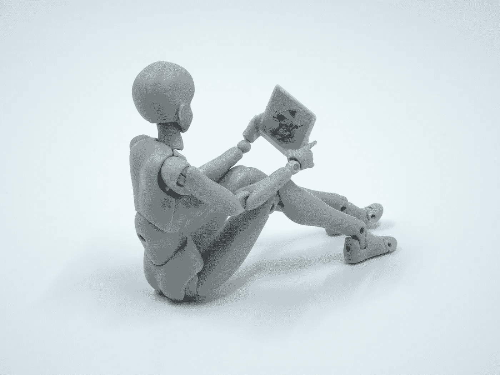

# 数据讲故事中的 4D：将科学变成艺术

> 原文：[`towardsdatascience.com/the-4ds-in-data-storytelling-making-art-out-of-science-c4998ed7875e?source=collection_archive---------7-----------------------#2023-10-03`](https://towardsdatascience.com/the-4ds-in-data-storytelling-making-art-out-of-science-c4998ed7875e?source=collection_archive---------7-----------------------#2023-10-03)

图片由 [Melanie Deziel](https://unsplash.com/@storyfuel?utm_source=medium&utm_medium=referral) 提供，来源于 [Unsplash](https://unsplash.com/?utm_source=medium&utm_medium=referral)

## 是的，它远不止数据可视化

 [Zijing Zhu, PhD](https://zzhu17.medium.com/?source=post_page-----c4998ed7875e--------------------------------)

·

[关注](https://medium.com/m/signin?actionUrl=https%3A%2F%2Fmedium.com%2F_%2Fsubscribe%2Fuser%2F7d83c09fb5d4&operation=register&redirect=https%3A%2F%2Ftowardsdatascience.com%2Fthe-4ds-in-data-storytelling-making-art-out-of-science-c4998ed7875e&user=Zijing+Zhu%2C+PhD&userId=7d83c09fb5d4&source=post_page-7d83c09fb5d4----c4998ed7875e---------------------post_header-----------) 发表在 [Towards Data Science](https://towardsdatascience.com/?source=post_page-----c4998ed7875e--------------------------------) ·14 分钟阅读·2023 年 10 月 3 日

--

数据无处不在。任何经过一些培训的人，如今借助 AI 的帮助，都可以从数据中生成一些科学洞察，并构建华丽的数据可视化。然而，解释和推销数字和图表背后的含义是一门艺术。当 ChatGPT 和生成性 AI 登上前台时，关于被 AI 替代的许多担忧也随之而来。凭借明确的指示，AI 可以帮助我们生成代码、创建可视化，甚至构建包含有用洞察的高效模型，但它们难以基于这些洞察编织出引人入胜且可信的故事。它们可以做科学，但艺术是人类独有的技能，至少目前如此。

图片由 [Brett Jordan](https://unsplash.com/@brett_jordan?utm_source=medium&utm_medium=referral) 提供，来源于 [Unsplash](https://unsplash.com/?utm_source=medium&utm_medium=referral)

根据受众的不同，这些数据故事对于建立合作信任或影响商业决策至关重要。数据科学家的工作如果没有讲故事的能力，仅仅是数字占卜而已。在这篇文章中，我想分享一个**4D 框架**，以帮助数据科学家破解数据讲故事的过程，提高数据洞察的效率和影响力，并附加一个实用的额外部分…
