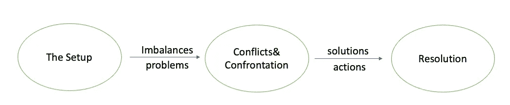

# 数据故事讲述中的 4D：将科学变为艺术

> 原文：[`towardsdatascience.com/the-4ds-in-data-storytelling-making-art-out-of-science-c4998ed7875e`](https://towardsdatascience.com/the-4ds-in-data-storytelling-making-art-out-of-science-c4998ed7875e)

图片来源：[Melanie Deziel](https://unsplash.com/@storyfuel?utm_source=medium&utm_medium=referral) 在 [Unsplash](https://unsplash.com/?utm_source=medium&utm_medium=referral)

## 是的，这远远超出了数据可视化的范围

 [Zijing Zhu, PhD](https://zzhu17.medium.com/?source=post_page-----c4998ed7875e--------------------------------)

·发表于 [Towards Data Science](https://towardsdatascience.com/?source=post_page-----c4998ed7875e--------------------------------) ·14 分钟阅读·2023 年 10 月 3 日

--

数据无处不在。任何具备一定训练的人，如今借助 AI 的帮助，都可以从数据中生成一些科学洞察，并构建华丽的数据可视化。然而，解释和传达数字和图表背后的含义是一门艺术。当 ChatGPT 和生成型 AI 登上前台时，许多关于被 AI 取代的担忧浮现。通过明确的指令，AI 可以帮助我们生成代码、可视化，甚至构建包含有用洞察的高效模型，但它们在基于这些洞察编写引人入胜的可信且令人难忘的故事方面却力不从心。它们可以做科学，但艺术是人类独有的技能，至少目前是这样。

图片来源：[Brett Jordan](https://unsplash.com/@brett_jordan?utm_source=medium&utm_medium=referral) 在 [Unsplash](https://unsplash.com/?utm_source=medium&utm_medium=referral)

根据受众的不同，这些数据故事在建立信任、促进合作或影响业务决策方面至关重要。没有故事讲述的数据科学家的工作仅仅是数字占卜。本文将分享一个**4D 框架**，帮助数据科学家破解数据故事讲述过程，提高数据洞察的效率和影响力，并在最后附上实际建议的额外部分。

# 定义

讲故事的第一步是定义故事。什么才是故事？虽然虚构作家可能会给出更全面的答案，但本质上，故事是传达一系列事件的叙述，包括背景设置、角色和情节。为了使故事有趣，它必须吸引人、引人入胜、娱乐性强或具有信息性。数据讲故事的过程始于定义一个故事，通过建立**相关的背景**、**引人注目的角色**和**迷人的情节**来保持观众的兴趣。

## **背景**

当你从数据中发现有趣的结果时，你需要在传递发现之前为接收者设置一个相关的背景。故事的背景为后续的沟通建立了上下文。我们首先需要了解这次沟通的**媒介**是什么。是演示文稿还是书面报告？是深度技术会议还是高层结果评审？这将指导你的故事朝不同的方向发展。

然后，我们需要定义故事中的**什么和为什么**。背景是什么？所有参与沟通的人需要达成一致。问题是什么？我们为什么要进行这次沟通？

此外，这次沟通的**行动点**是什么？假设每个人都同意你的故事，下一步是什么？

在展开你的故事之前设置背景是至关重要的。这有助于你更有条理和高效地准备整个沟通，并帮助观众与你的故事产生共鸣，使他们与你处于同一页面上。

## 角色

照片由 [Kenny Eliason](https://unsplash.com/@neonbrand?utm_source=medium&utm_medium=referral) 提供，来源于 [Unsplash](https://unsplash.com/?utm_source=medium&utm_medium=referral)

角色是故事的灵魂。一个好的数据故事应该把你和观众都融入故事中。这里有两个方面：**观众是谁，** 和 **他们与你的关系是什么**？不幸的是，没有一种灵丹妙药能让所有类型的观众与你和你的故事产生共鸣。不同的观众有不同的痛点，这使得有必要相应地调整你的信息。在准备故事时，问自己这些问题：

+   观众是谁？他们在技术上强大还是以业务为驱动？他们的日程是否很忙？他们只关心总体概述，还是关注细节？他们如何从这次沟通中受益？

+   他们与你的关系是什么？他们是需要你建立信任和信誉的新对象吗？还是你们已经建立了关系？你需要他们的合作，还是在给他们结果？你需要他们做出决定或采取行动吗？

这些问题将帮助你导航准备工作。请注意，有时你可能对观众做出了错误的假设。例如，你认为他们不关心细节，但实际上，他们对你的详细思路非常感兴趣。因此，与大家进行事前沟通以对齐期望是至关重要的。或者，你也可以准备备用幻灯片或证据，以防后续问题进入次轨道。

## 情节

情节是故事的脊梁。考虑传统的三幕剧结构，这是一个广泛使用的框架，用于组织和呈现文学、戏剧和电影中的叙述。这种结构将故事分为三个不同的幕，每一幕都有其独特的目的和事件顺序：

image by author

我们可以在讲述数据故事时使用相同的框架。在我们数据故事的第一幕中，我们可以简要介绍背景和环境，以确保每个人都了解背景。然后，在第二幕中，我们深入探讨数据和发现，介绍你的观众关心的挑战或试图解决的问题。在这里，你会转向沟通的重点。可能是识别出一个令人惊讶的趋势或一个重要的发现。立刻，你展示一个突破，解决这些挑战，也许发现一个隐藏的模式，重新塑造大家的视角。第三幕是关于解决方案的，我们提出解决方案和行动点。最后，花一点时间考虑我们数据故事的广泛影响，让观众带走难忘的收获或所需的行动。沟通的逻辑和流程将定义观众如何接收和反应这些信息。一个难忘的故事情节起伏跌宕，观众对这些故事产生共鸣，因为它们帮助他们解决他们面临的痛点。

# 展示

现在我们有了结构框架，我们需要搞清楚如何在骨架上构建内容。数据故事包含叙述和视觉支持，如幻灯片或图表。在本节中，我将主要关注如何选择与数据故事匹配的数据可视化，以及使用哪些工具来帮助更好地传达信息。

照片由[Daria Nepriakhina 🇺🇦](https://unsplash.com/@epicantus?utm_source=medium&utm_medium=referral)拍摄，来自[Unsplash](https://unsplash.com/?utm_source=medium&utm_medium=referral)

## 不同的情节

在可视化类型中有许多选择来表达观点。根据情况，我们可以选择折线图、柱状图、散点图、饼图、表格或只是文本。以下是一些实际中的常见用例：

+   **折线图：** 折线图有助于展示一个或多个变量随时间的变化，使其成为可视化数据趋势和模式的绝佳选择。折线图可以用来显示一个城市在一年的温度变化。这使观众可以轻松识别任何季节性模式或温度趋势。

+   **饼图：** 饼图是展示数据集或变量组成部分或比例的有用工具。当你想强调不同组件的相对大小时，它们特别有效。例如，饼图常用于描绘家庭每月支出的分布，包括租金、公用事业费、食品杂货和娱乐等项目。这提供了资金分配的清晰视觉表示。

+   **条形图：** 条形图非常适合用于比较类别之间的值。饼图也能显示比较，但我们可以在条形图中添加时间范围，将比较扩展到时间维度。例如，我们可以使用条形图显示过去五年不同产品的销售情况。此外，条形图也广泛用于显示数据分布的直方图。

+   **散点图：** 散点图有助于分析两个连续变量之间的关系和相关性。它可以帮助识别数据中的模式、集群或异常值。例如，如果你想确定某一产品的销售额和价格变化是否存在相关性，散点图可以可视化这两个变量之间的关系。

+   **表格：** 表格是呈现详细数据的有价值工具。当观众需要获取特定数据点时，它们尤其有效。需要注意的是，表格通常显示一个数据维度，要么是横截面数据，要么是时间序列数据。横截面表格展示跨主题的值比较，而时间序列表格展示一个主题在时间上的值比较。包含主题和时间范围的面板表格可能过于详细，不适合口头呈现，但在书面形式中常用作有力的支持证据或进行更深入的分析。虽然表格可以用于显示时间序列比较，但折线图通常更有效。因此，我们更多地使用表格来处理横截面数据。

+   **文本：** 将文本视为可视化并不常见，但它可以是传达信息的最有效方式之一。它可以是一个突出关键统计数据的句子。像下面这样的文本信息可以立即吸引观众的注意。

image by author

可以在图表中添加文本以提供背景、注释或解释。这有助于更好地呈现信息。

## 不同的可视化工具：

我们可以使用许多可视化工具来生成理想的图表。我们有专业工具如 Tableau 和 PowerBI，流行的 Python 包如 Plotly，以及用户友好的 Excel。无论使用哪种工具，主要目的是正确有效地传达信息，而不是展示你能写出多么复杂的代码或生成多么华丽的图表。如果你对 Excel 更为熟悉，那就不要浪费时间去弄清楚 Python 的语法。

另一个要考虑的因素是你是否需要共享可视化以及如何共享。是静态图表或截图，还是需要与接收者进行互动？此外，这个图表是一次性展示，还是需要在数据更新时定期重新生成？如果需要重新生成图表，设置模板或编写模块化代码以节省未来的时间是有帮助的。

# 清理冗余

**少即是多**，除非你在撰写研究论文或纪录片，需要为几乎每一句话提供大量的证据。一旦你有了故事线和支持的可视化效果，下一步就是考虑如何去除不必要的细节，以便观众能更容易地跟随你的故事而不会分心。

图片来源：[Prateek Katyal](https://unsplash.com/@prateekkatyal?utm_source=medium&utm_medium=referral) 在 [Unsplash](https://unsplash.com/?utm_source=medium&utm_medium=referral)

## 探索性 vs 解释性

虽然可能需要几周的时间来发现洞察或创建模型，但展示整个思考过程是不必要的，除非观众特别要求。专注于观众最关心的内容。以商业为导向的观众关心你的发现如何有利于他们的业务 KPI，而技术观众关心你为什么以这种方式处理问题，以及你的模型表现如何。根据时间和格式，根据观众的需求调整故事的长度。

## 去除多余内容

对于特定的幻灯片或图表，考虑去除冗余内容。思考主要信息是什么，哪些是多余的细节。当你展示的信息较少时，观众更容易把握主要信息。爱德华·塔夫提（Dr. Edward Tufte）提出了一个公式来量化图表中的冗余：

图片由作者提供

理想的数据墨水比率应为 **1**，即每一滴墨水都应支持你所讲述的故事。否则，你需要去除所谓的 ***图表垃圾***。常见的图表垃圾包括：

+   网格线，你可以标注所选的数据点；

+   冗余的坐标轴，尤其是当数据点已被标记时；

+   图表区域中的不必要的标注或标记；

+   分散注意力的图像或图标。

这是简化前后的示例：

作者提供的图片

请注意，简化并不等于去除重复。多次强调主要信息以加深观众的印象是必要的。此外，记住你的观众可能不如你对数据熟悉，因此你可能需要通过重复来更多地构建和强调背景。

# 直接

尽管观众的注意力最终不在你的控制之下，但有一些好的实践可以帮助抓住观众的注意力，从而帮助你正确高效地传达信息。这样，你更有可能影响商业决策，获得未来的支持，建立信任和信誉等。一般来说，你可以**消除干扰**、**突出主要信息**和**调整和结构化交付**来帮助引导观众的注意力。**我们在上一部分讨论了通过简化来消除干扰。让我们在这一部分关注后两者。

## 突出主要信息

在构建数据故事时，我们有主要信息和支持证据或比较，以帮助更好地表达观点。在这种情况下，我们需要突出主要信息，以便观众不会在信息的海洋中迷失。当确定主要信息时，从你发现的内容开始，然后问自己哪些发现会引起观众的兴趣，你希望观众如何使用这些信息。通过消除观众可能已经同意的点来关注影响。之后，我们可以通过预注意属性来引导观众的注意力。这些属性包括：

+   大小。增加主要信息或关键统计数据的大小；

+   颜色。注意不要在一页或一张幻灯片上使用太多颜色。保持相同的颜色调色板。有时，调整透明度也会有效。我们通常不需要彩虹；

+   通过使用不同的字体、加粗、斜体或下划线来突出显示；

+   添加特殊符号，如箭头或文本注释以帮助解释；

+   如果你使用 PowerPoint 进行演示，请使用动画逐步展示你的故事；

+   根据情境，我们可以添加互动图表，以根据观众的反馈和评论显示不同的信息。

## 调整和结构化交付

你已经弄清楚了要向观众展示的内容。现在是时候找出一个结构，以逻辑顺序传达信息，让观众容易接受。我们需要考虑**水平流程**和**垂直流程**。

[Maksym Tymchyk 🇺🇦](https://unsplash.com/@maksym_tymchyk?utm_source=medium&utm_medium=referral) 在 [Unsplash](https://unsplash.com/?utm_source=medium&utm_medium=referral) 上的照片

我们在“定义”部分提到的三幕结构帮助我们将故事的逻辑横向流动逐步展示。常见的叙事流程有：

+   **按时间顺序：** 按事件的时间顺序展示，并连接其影响；

+   **从大到小：** 首先展示高层次的大图，然后再将其拆解为更多的细节，并提供更多的支持证据；

+   **概念性：** 按逻辑顺序展示，比如 IF -> THEN -> So；

+   **按组别：** 首先展示整体情况，然后再深入到每个感兴趣的组别；

通常，无论你最终遵循哪种横向流程，我们都应该始终保持“总结 — > 细节 — > 总结”的格式。开始时向观众提供一个大纲，在过程中与观众的痛点相连接，并以行动点结束。采取行动是数据讲故事的影响所在。

保持故事中的合理纵向流动也至关重要。幻灯片中的纵向流动是在标题和数据视觉准确突出相同观点的不同细节层次时实现的。在商业演示中，确保每张幻灯片传达清晰的信息，数据和视觉效果支持幻灯片标题，并清晰展示见解。

# 附加部分

现在你已经学习了一个实用的框架来构建故事，那么在沟通过程中有哪些良好的做法可以帮助你更好地传达信息呢？以下是一些有用的建议：

## 保持自信

你可能没有观众那么有经验或技术高超，但记住，没有人比你自己更了解你的工作。你是你数据故事唯一的专家。

## 征求反馈

在沟通之前、期间和之后征求反馈。你可以事先了解观众的期望。然后，和其他人练习，询问他们是否理解了你希望传达的信息。在演讲过程中，设置一定的中断点，询问观众是否有任何问题，是否都跟上了。演讲结束后，跟进行动点、演讲中未回答的问题，并询问观众对未来沟通的反馈。

## 观察和练习

观察他人在不同场景中如何传达信息。观察经验丰富的同事有效地展示技术发现，经理如何说服利益相关者延长项目时间，或产品负责人如何在发布日挑选产品特性。这不仅限于你的工作环境，也可以来自日常生活，比如当你被销售人员接触，或者观看最新的苹果开发者大会（WWDC）等。

最重要的是，不要忘记总结学习内容并付诸实践。与自己或他人进行彩排，了解整个故事的呈现时间，以及你是否通过这个故事讲解得清楚。

## 练习向非技术观众进行技术演讲

数据科学家向非技术观众展示黑箱模型预测是很常见的。在讲述故事之前，弄清楚他们需要什么。平衡技术证据与令人兴奋的结果。为了向非技术观众解释必要的技术术语，我发现保持高层次的讲解、给出相关的例子并始终与结果联系起来是有益的。不要忘记在继续之前检查你的观众是否理解了内容。

## 注意时间

尊重观众的时间非常重要，要将你的数据故事限制在约定的时间内。为了准确知道需要包含多少信息，你应该提前进行排练。然而，演讲过程中总会发生意外，比如话题偏离或要求更多细节。在这种情况下，除了始终在结尾留出缓冲时间外，你还需要在观众要求过多细节或话题偏离时保持警觉。你可以说：“为了节省时间，我们可以离线讨论这个问题”或“由于我们只有 X 分钟了，让我们转到下一个话题。”你还可以请一个时间记录员帮助你跟踪时间，同时专注于内容。你绝不希望因为时间不足而不得不缩短故事。

我最近读了一本由摩根·豪瑟尔（Morgan Housel）所著的[***《财富心理学》***](https://www.amazon.com/Psychology-Money-Timeless-lessons-happiness/dp/0857197681)的书。在其中一章，摩根说：

> 但故事无疑是经济中最强大的力量。它们是使经济的有形部分运转的燃料，或者是限制我们能力的刹车。

如果你考虑一下股市的波动性以及经济预期如何通过[自我实现的预言](https://www.britannica.com/topic/self-fulfilling-prophecy)实际影响未来经济，你会明白当每个人都相信一个故事时，这个故事的力量有多大。**数据让我们更可信，但故事让我们更难忘。** 我们的数据科学家需要让观众记住我们，信任我们，并且相信我们，这样他们才会愿意采取行动。数据讲故事超越了科学，它是一种艺术。然而，这并不意味着我们不能通过观察和实践来提高这一技能。尝试使用 4D 框架**“定义、展示、简化和引导”**来进行下次沟通。不要忘记在下方评论你在使用这个框架时看到的不同之处或你对数据讲故事的其他建议。

图片由[埃蒂安·吉拉尔代](https://unsplash.com/@etiennegirardet?utm_source=medium&utm_medium=referral)拍摄，来源于[Unsplash](https://unsplash.com/?utm_source=medium&utm_medium=referral)

感谢阅读。如果你喜欢这篇文章，请不要忘记：

+   ***查看我最近关于*** ***数据科学中的持续学习*** ***；*** ***我遵循的七个原则，成为更好的数据科学家*** ***；*** ***我如何成为数据科学家*** ***；***

+   ***查看我的*** [***其他文章***](https://zzhu17.medium.com/my-blog-posts-gallery-ac6e01fe5cc3) ***，涉及如*** [***数据科学面试准备***](https://zzhu17.medium.com/list/data-science-interview-preparation-bfb0986a61a3) ***；*** ***因果推断*** ***；***

+   [***订阅***](https://zzhu17.medium.com/subscribe) ***我的邮件列表；***

+   [***注册成为 Medium 会员***](https://zzhu17.medium.com/membership) ***；***

+   ***或者关注我在*** [***YouTube***](https://youtube.com/channel/UCMs6go1pvY5OOy1DXVtMo5A) ***上的内容，了解*** [***我如何从在 Medium 上写作中受益***](https://youtu.be/oFDl0-SKAL8) ***，或者观看如何在工作中作为内向者茁壮成长：***

+   ***或者观看我关于创意写作课程的故事：***

参考资料：

[1] [*用数据讲故事：面向商业专业人士的数据可视化指南*](https://www.amazon.com/Storytelling-Data-Visualization-Business-Professionals/dp/1119002257) *作者：Cole Nussbaumer Knaflic*
