# 变换器的 A 到 Z：你需要知道的一切

> 原文：[`towardsdatascience.com/the-a-z-of-transformers-everything-you-need-to-know-c9f214c619ac`](https://towardsdatascience.com/the-a-z-of-transformers-everything-you-need-to-know-c9f214c619ac)

## 你需要了解的关于变换器的一切，以及如何实现它们

[](https://medium.com/@francoisporcher?source=post_page-----c9f214c619ac--------------------------------)[](https://towardsdatascience.com/?source=post_page-----c9f214c619ac--------------------------------) [François Porcher](https://medium.com/@francoisporcher?source=post_page-----c9f214c619ac--------------------------------)

·发表在[Towards Data Science](https://towardsdatascience.com/?source=post_page-----c9f214c619ac--------------------------------) ·16 分钟阅读·2023 年 10 月 25 日

--


图片作者

# 为什么还要另写一篇关于变换器的教程？

你可能已经听说过变换器，每个人都在谈论它，那么为什么还要再写一篇关于它的文章呢？

我是一名研究员，这要求我对我使用的工具有非常深入的理解（因为如果你不理解它们，你怎么能识别它们的问题以及如何改进它们，对吧？）。

当我深入探索变换器的世界时，我发现自己埋在一堆资源下。尽管如此，尽管阅读了这么多，我仍然对架构有一个大致的了解，并留下了一连串悬而未决的问题。

在本指南中，我旨在弥补这种知识差距。一个将给你提供对变换器的强直觉、对架构的深入探讨以及从零开始实现的指南。

我强烈建议你关注[Github](https://github.com/FrancoisPorcher/awesome-ai-tutorials/tree/main/NLP/007%20-%20Transformers%20From%20Scratch)上的代码：

[](https://github.com/FrancoisPorcher/awesome-ai-tutorials/tree/main/NLP/007%20-%20Transformers%20From%20Scratch?source=post_page-----c9f214c619ac--------------------------------) [## awesome-ai-tutorials/NLP/007 - Transformers From Scratch at main ·…

### 最佳 AI 教程合集，让你成为数据科学的专家！ - awesome-ai-tutorials/NLP/007 - Transformers…

github.com](https://github.com/FrancoisPorcher/awesome-ai-tutorials/tree/main/NLP/007%20-%20Transformers%20From%20Scratch?source=post_page-----c9f214c619ac--------------------------------)

享受吧！🤗

# 首先一点历史：

许多人将注意力机制的概念归功于 Google Brain 团队的著名论文“Attention is All You Need”。然而，**这只是部分事实**。

注意力机制的根源可以追溯到一篇早期的论文，题为“[Neural Machine Translation by Jointly Learning to Align and Translate](https://arxiv.org/abs/1409.0473)”，由 Dzmitry Bahdanau、KyungHyun Cho 和 Yoshua Bengio 撰写。

Bahdanau 的主要挑战是解决循环神经网络（RNN）的局限性。具体来说，在使用 RNN 将长句编码为向量时，**关键的信息经常丢失。**

从翻译练习中汲取的经验——在翻译时经常会重新审视源句——Bahdanau 的目标是为 RNN 中的隐藏状态分配权重。这种方法取得了**令人印象深刻的结果**，如下图所示。

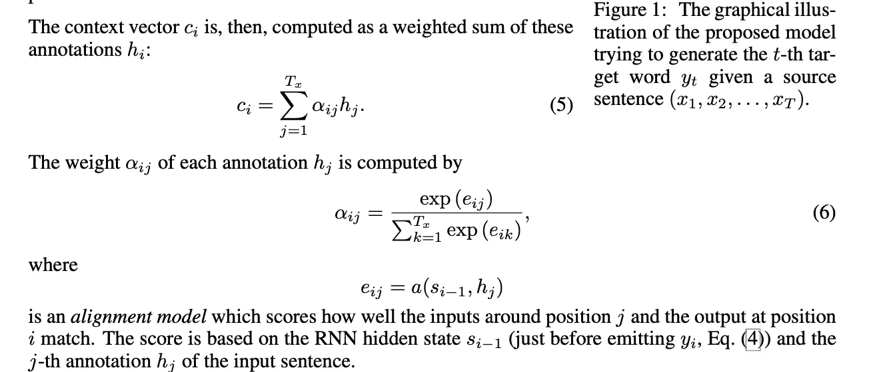

图片来源于[Neural machine translation by jointly learning to align and translate](https://arxiv.org/pdf/1409.0473.pdf)

然而，Bahdanau 并不是唯一一个解决这个问题的人。借鉴了他的开创性工作，Google Brain 团队提出了一个大胆的想法：

> “为什么不去掉一切，只专注于注意力机制呢？”

他们认为，成功的主要驱动因素不是 RNN，而是注意力机制。

这种信念最终在他们的论文中得到了体现，这篇论文恰如其分地命名为“Attention is All You Need”。

很吸引人，对吧？

# Transformer 架构

## 1\. 首先，嵌入

这个图表示了 Transformer 架构。不要担心如果你一开始不理解任何东西，我们会涵盖所有内容。

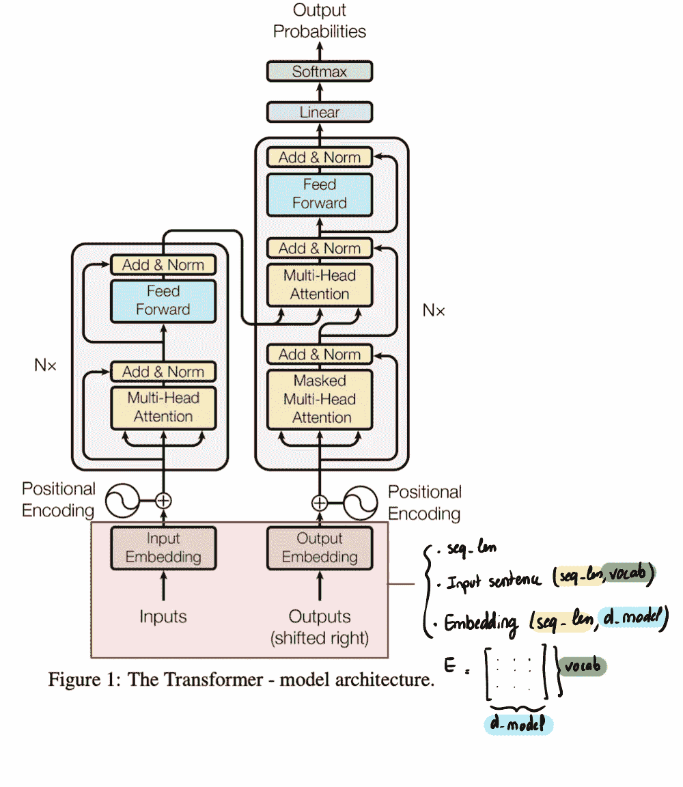

嵌入，文章中的图片经过作者修改

从文本到向量——嵌入过程：假设我们的输入是一个单词序列，比如“猫喝牛奶”。这个序列的长度称为`seq_len`。我们立即要做的就是将这些单词转换成模型可以理解的形式，具体来说，就是向量。这就是 Embedder 的作用。

每个词都会经历一个变换，成为一个向量。这个变换过程被称为“嵌入”。这些向量或“嵌入”的大小为`d_model = 512`。

那么，这个 Embedder 到底是什么呢？从本质上讲，Embedder 是一个线性映射（矩阵），用`E`表示。你可以将其视为一个大小为`(d_model, vocab_size)`的矩阵，其中`vocab_size`是我们词汇表的大小。

在嵌入过程之后，我们得到一组大小为`d_model`的向量。理解这种格式至关重要，因为这是一个反复出现的主题——你会在编码器输入、编码器输出等各个阶段看到它。

让我们编写这一部分代码：

```py
class Embeddings(nn.Module):
    def __init__(self, d_model, vocab):
        super(Embeddings, self).__init__()
        self.lut = nn.Embedding(vocab, d_model)
        self.d_model = d_model

    def forward(self, x):
        return self.lut(x) * math.sqrt(self.d_model)
```

注：我们乘以*d_model*是为了归一化（稍后解释）

注 2：我个人想知道我们是否使用了预训练的嵌入器，或者至少从一个预训练的嵌入器开始并进行微调。**但不，嵌入完全是从头学习的，并且是随机初始化的。**

# 位置编码

为什么我们需要位置编码？

在我们当前的设置中，我们拥有一个表示单词的向量列表。如果按原样输入到变换器模型中，有一个 **关键要素缺失：单词的顺序。** 自然语言中的单词往往从其位置中获取意义。“John loves Mary”和“Mary loves John”表达的情感不同。为了确保我们的模型捕捉到这种顺序，我们引入了位置编码。

现在，你可能会想，“为什么不简单地对第一个词加 +1，对第二个词加 +2，以此类推呢？”这种方法有几个挑战：

1.  **多维度性：** 每个令牌在 512 维度中表示。简单的增量无法捕捉这个复杂的空间。

1.  **归一化问题：** 理想情况下，我们希望值在 -1 和 1 之间。因此，直接添加大数值（例如，长文本中的 +2000）会带来问题。

1.  **序列长度依赖性：** 直接增量的使用不是尺度无关的。对于长文本，其中位置可能是 +5000，这个数字并 **不能真正反映令牌在其关联句子中的相对位置**。而且 **一个词的意义更依赖于它在句子中的相对位置，而非在文本中的绝对位置。**

如果你学习过数学，圆形坐标的概念 — **特别是正弦和余弦函数** — 应该与你的直觉相契合。这些函数提供了一种独特的方式来编码位置，以满足我们的需求。

给定我们大小为 `(seq_len, d_model)` 的矩阵，我们的目标是添加另一个相同大小的矩阵，即位置编码。

这是核心概念：

1.  对于每个令牌，作者建议提供一对维度（2k）的 **正弦** 坐标和 (2k+1) 的 **余弦** 坐标。

1.  如果我们固定令牌位置，并移动维度，我们可以看到正弦/余弦频率的下降

1.  如果我们查看文本中较远的令牌，这种现象会更迅速地发生（频率增加）

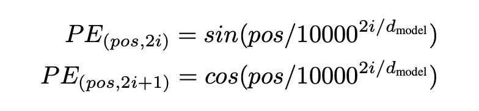

文章中的图片

这在以下图中得到了总结（但不必太费脑筋）。关键点是位置编码是一个数学函数，它允许变换器保持对句子中令牌顺序的理解。这是一个非常活跃的研究领域。

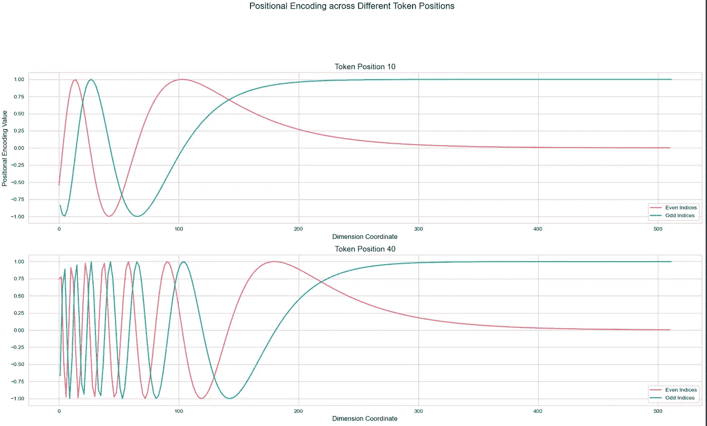

位置嵌入，作者提供的图片

```py
class PositionalEncoding(nn.Module):
    "Implement the PE function."

    def __init__(self, d_model, dropout, max_len=5000):
        super(PositionalEncoding, self).__init__()
        self.dropout = nn.Dropout(p=dropout)

        # Compute the positional encodings once in log space.
        pe = torch.zeros(max_len, d_model)
        position = torch.arange(0, max_len).unsqueeze(1)
        div_term = torch.exp(
            torch.arange(0, d_model, 2) * -(math.log(10000.0) / d_model)
        )
        pe[:, 0::2] = torch.sin(position * div_term)
        pe[:, 1::2] = torch.cos(position * div_term)
        pe = pe.unsqueeze(0)
        self.register_buffer("pe", pe)

    def forward(self, x):
        x = x + self.pe[:, : x.size(1)].requires_grad_(False)
        return self.dropout(x)
```

# 注意力机制（单头）

让我们深入了解谷歌论文的核心概念：注意力机制

## 高级直觉：

从本质上讲，注意力机制是 **向量/令牌之间的通信机制**。它允许模型在生成输出时专注于输入的特定部分。可以把它看作是对输入数据的某些部分进行聚焦的“聚光灯”。这个“聚光灯”可以在更相关的部分更亮（给予更多关注），在不太相关的部分更暗。

对于一个句子，注意力有助于确定单词之间的关系。某些单词在句子中在意义或功能上紧密相关，而其他单词则不然。**注意力机制量化了这些关系。**

## 示例：

考虑句子：“She gave him her book.”

如果我们关注单词“her”，注意力机制可能会确定：

+   它与“book”有很强的联系，因为“her”表示对“book”的所有权。

+   它与“She”有中等的联系，因为“She”和“her”可能指的是同一个实体。

+   它与其他词如“gave”或“him”的联系较弱。

## 深入了解注意力机制

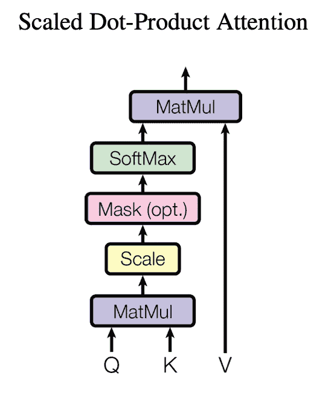

缩放点积注意力，图片来源于[文章](https://arxiv.org/pdf/1706.03762.pdf)

**对于每个标记，我们生成三个向量：**

1.  **Query (Q)：**

**直觉**：将查询视为一个标记提出的“**问题**”。它代表当前的单词，并尝试找出序列中哪些部分与其相关。

**2\. Key (K)：**

**直觉**：可以将键视为序列中每个单词的“**标识符**”。当查询“提问”时，键通过确定**序列中每个单词与查询的相关性**来“回答”。

**3\. Value (V)：**

**直觉**：一旦确定了每个单词（通过其键）与查询的相关性，我们需要从这些单词中获取实际的信息或内容来辅助当前标记。这就是值的作用。**它代表了每个单词的内容。**

## Q、K、V 是如何生成的？

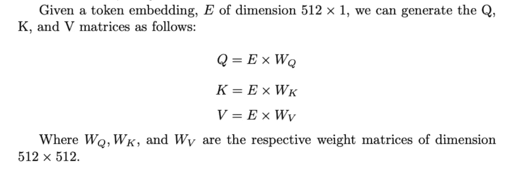

Q、K、V 生成，作者提供的图像

查询与键之间的相似性是点积（测量两个向量之间的相似性），除以该随机变量的标准差，以便一切标准化。

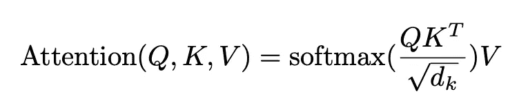

注意力公式，图片来源于[文章](https://arxiv.org/pdf/1706.03762.pdf)

让我们通过一个示例来说明：

设想我们有一个查询，并且想要计算与 K 和 V 的注意力结果：

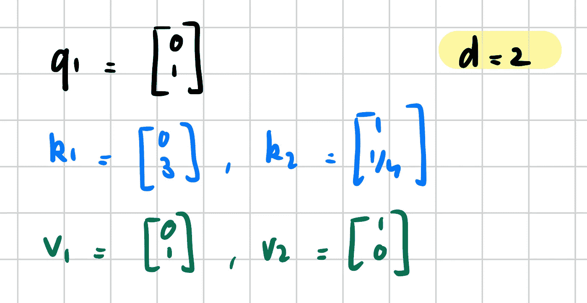

Q、K、V，作者提供的图像

现在让我们计算 q1 和键之间的相似性：

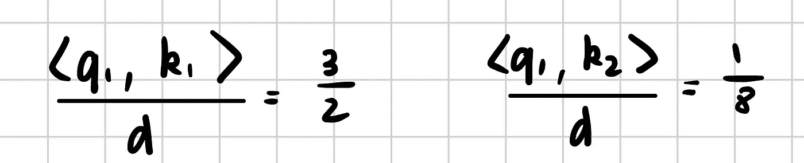

点积，作者提供的图像

虽然数字 3/2 和 1/8 看起来相对接近，但 softmax 函数的指数特性会放大它们之间的差异。

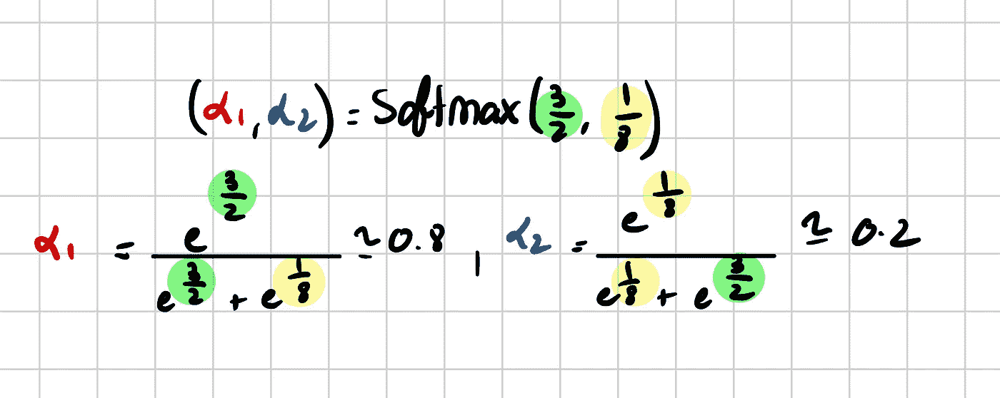

注意力权重，作者提供的图像

这个差异表明 q1 与 k1 的联系比与 k2 的联系更为显著。

现在让我们看看注意力的结果，它是值的加权（注意力权重）组合。

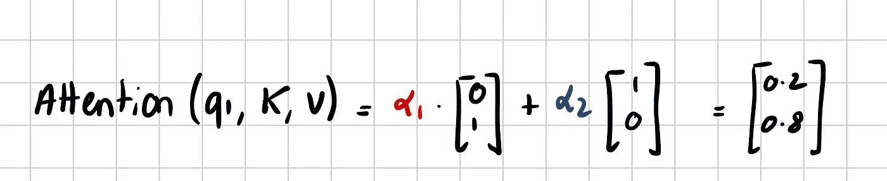

注意力，作者提供的图像

太棒了！对每个标记（q1 到 qn）重复这个操作会得到一个*n*个向量的集合。

实际上，这个操作被矢量化为矩阵乘法，以提高效率。

让我们来编写代码：

```py
def attention(query, key, value, mask=None, dropout=None):
    "Compute 'Scaled Dot Product Attention'"
    d_k = query.size(-1)
    scores = torch.matmul(query, key.transpose(-2, -1)) / math.sqrt(d_k)
    if mask is not None:
        scores = scores.masked_fill(mask == 0, -1e9)
    p_attn = scores.softmax(dim=-1)
    if dropout is not None:
        p_attn = dropout(p_attn)
    return torch.matmul(p_attn, value), p_attn
```

# 多头注意力

单头注意力有什么问题？

使用单头注意力方法时，每个标记只能提出 **一个查询。** 这通常意味着它只能与另一个标记建立强关系，因为 softmax 倾向于 **重度加权一个值，同时将其他值压缩到接近零。** 然而，当你考虑语言和句子结构时，**一个单词通常与多个其他单词有关，而不仅仅是一个。**

为了解决这一限制，我们引入了 **多头注意力**。核心思想是什么？让我们允许每个标记同时提出多个问题（查询），通过并行进行‘h’次注意力过程。原始 Transformer 使用了 8 个头。

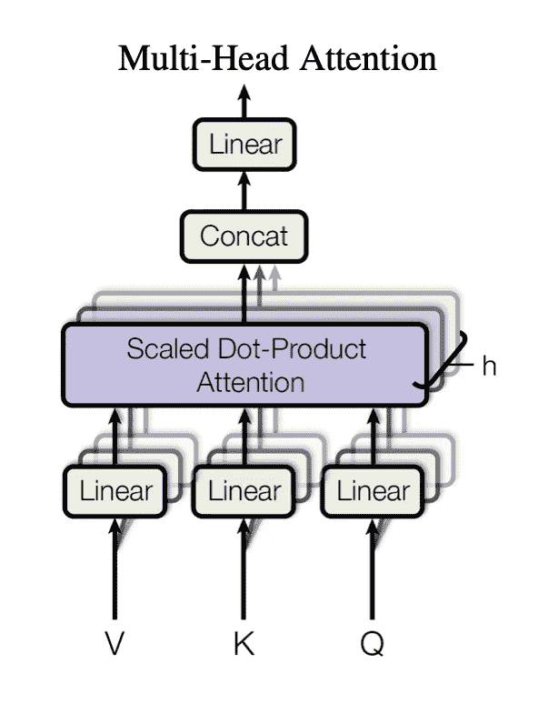

多头注意力，图像来自[文章](https://arxiv.org/pdf/1706.03762.pdf)

一旦我们得到 8 个头的结果，就将它们连接成一个矩阵。

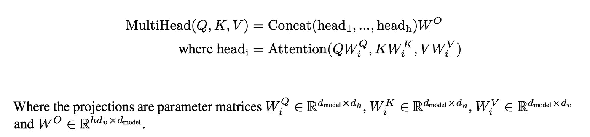

多头注意力，图像来自[文章](https://arxiv.org/pdf/1706.03762.pdf)

这段代码也很简单，我们只需注意维度：

```py
class MultiHeadedAttention(nn.Module):
    def __init__(self, h, d_model, dropout=0.1):
        "Take in model size and number of heads."
        super(MultiHeadedAttention, self).__init__()
        assert d_model % h == 0
        # We assume d_v always equals d_k
        self.d_k = d_model // h
        self.h = h
        self.linears = clones(nn.Linear(d_model, d_model), 4)
        self.attn = None
        self.dropout = nn.Dropout(p=dropout)

    def forward(self, query, key, value, mask=None):
        "Implements Figure 2"
        if mask is not None:
            # Same mask applied to all h heads.
            mask = mask.unsqueeze(1)
        nbatches = query.size(0)

        # 1) Do all the linear projections in batch from d_model => h x d_k
        query, key, value = [
            lin(x).view(nbatches, -1, self.h, self.d_k).transpose(1, 2)
            for lin, x in zip(self.linears, (query, key, value))
        ]

        # 2) Apply attention on all the projected vectors in batch.
        x, self.attn = attention(query, key, value, mask=mask, dropout=self.dropout)

        # 3) "Concat" using a view and apply a final linear.
        x = x.transpose(1, 2).contiguous().view(nbatches, -1, self.h * self.d_k)
        del query
        del key
        del value
        return self.linears-1
```

现在你应该开始理解为什么 Transformers 如此强大，它们充分利用了并行性。

# 组装 Transformer 的各个部分

从高层次来看，Transformer 是由三个元素组成的：**编码器**、**解码器**和**生成器**

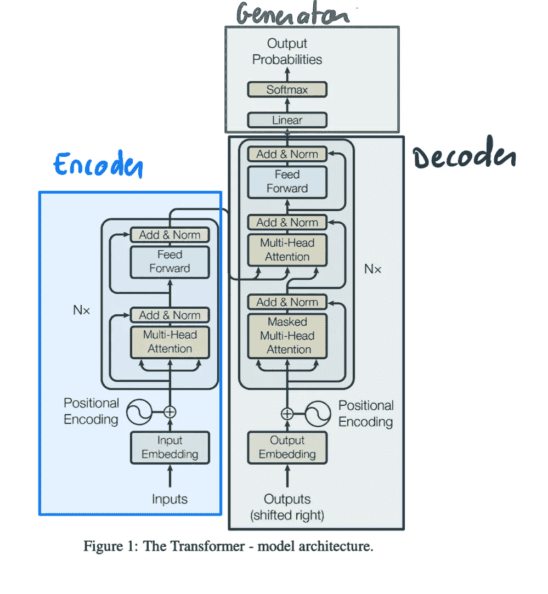

Endoder、Decoder、Generator，图像来自文章，作者修改

**1\. 编码器**

+   目的：将输入序列转换为一个新的序列（通常维度较小），以捕捉原始数据的精髓。

+   注意：如果你听说过 **BERT** 模型，它只使用 Transformer 的编码部分。

**2\. 解码器**

+   目的：使用编码器编码的序列生成输出序列。

+   注意：Transformer 中的解码器不同于典型自编码器的解码器。在 Transformer 中，**解码器不仅查看编码后的输出，还考虑了它迄今为止生成的标记。**

**3\. 生成器**

+   目的：将向量转换为标记。它通过将向量投影到词汇表的大小，然后使用 softmax 函数选择最可能的标记来实现。

让我们来编写代码：

```py
class EncoderDecoder(nn.Module):
    """
    A standard Encoder-Decoder architecture. Base for this and many
    other models.
    """

    def __init__(self, encoder, decoder, src_embed, tgt_embed, generator):
        super(EncoderDecoder, self).__init__()
        self.encoder = encoder
        self.decoder = decoder
        self.src_embed = src_embed
        self.tgt_embed = tgt_embed
        self.generator = generator

    def forward(self, src, tgt, src_mask, tgt_mask):
        "Take in and process masked src and target sequences."
        return self.decode(self.encode(src, src_mask), src_mask, tgt, tgt_mask)

    def encode(self, src, src_mask):
        return self.encoder(self.src_embed(src), src_mask)

    def decode(self, memory, src_mask, tgt, tgt_mask):
        return self.decoder(self.tgt_embed(tgt), memory, src_mask, tgt_mask)

class Generator(nn.Module):
    "Define standard linear + softmax generation step."

    def __init__(self, d_model, vocab):
        super(Generator, self).__init__()
        self.proj = nn.Linear(d_model, vocab)

    def forward(self, x):
        return log_softmax(self.proj(x), dim=-1)
```

这里有一个备注：“src”指的是输入序列，“target”指的是正在生成的序列。请记住，我们以自回归的方式生成输出，一个标记一个标记，因此我们需要跟踪目标序列。

## 堆叠编码器

Transformer 的编码器不仅仅是一层。它实际上是一个由 *N* 层组成的堆栈。具体来说：

+   原始 Transformer 模型中的编码器由 *N=6* 个相同的层组成。

在编码器层中，我们可以看到有两个 Sublayer 块非常相似（（1）和（2））：**残差连接后跟层归一化**。

+   **块（1）自注意力机制**：帮助编码器在生成编码表示时关注输入中的不同词汇。

+   **块（2）前馈神经网络**：一个小型神经网络独立应用于每个位置。

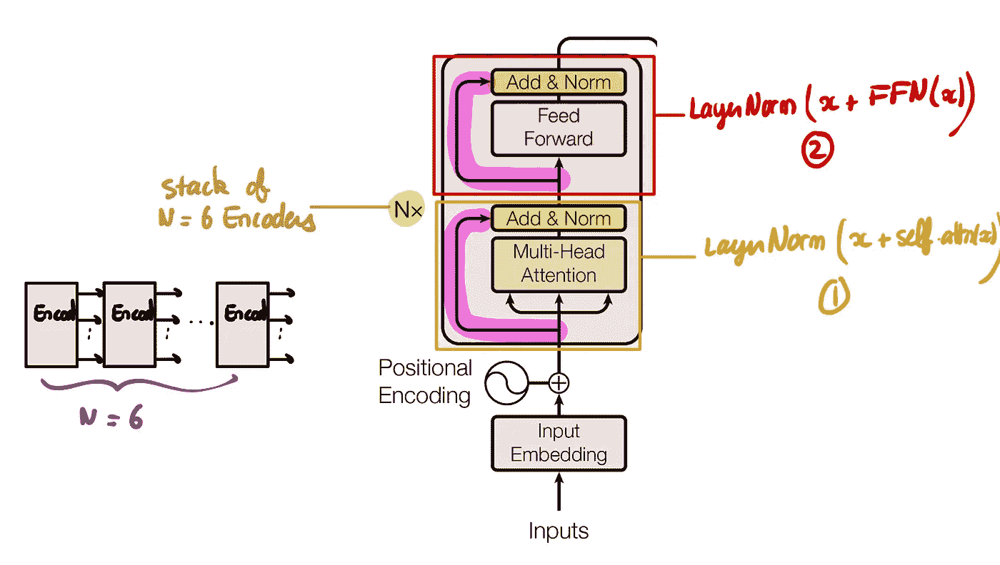

编码器层，残差连接和层归一化，图片来自文章，作者修改

现在让我们编写这个：

首先是 SublayerConnection：

我们遵循通用架构，可以将“sublayer”更改为“self-attention”或“FFN”。

```py
class SublayerConnection(nn.Module):
    """
    A residual connection followed by a layer norm.
    Note for code simplicity the norm is first as opposed to last.
    """

    def __init__(self, size, dropout):
        super(SublayerConnection, self).__init__()
        self.norm = nn.LayerNorm(size)  # Use PyTorch's LayerNorm
        self.dropout = nn.Dropout(dropout)

    def forward(self, x, sublayer):
        "Apply residual connection to any sublayer with the same size."
        return x + self.dropout(sublayer(self.norm(x)))
```

现在我们可以定义完整的编码器层：

```py
class EncoderLayer(nn.Module):
    "Encoder is made up of self-attn and feed forward (defined below)"

    def __init__(self, size, self_attn, feed_forward, dropout):
        super(EncoderLayer, self).__init__()
        self.self_attn = self_attn
        self.feed_forward = feed_forward
        self.sublayer = clones(SublayerConnection(size, dropout), 2)
        self.size = size

    def forward(self, x, mask):
        # self attention, block 1
        x = self.sublayer0)
        # feed forward, block 2
        x = self.sublayer1
        return x
```

编码器层已准备好，现在将它们链接在一起形成完整的编码器：

```py
def clones(module, N):
    "Produce N identical layers."
    return nn.ModuleList([copy.deepcopy(module) for _ in range(N)])

class Encoder(nn.Module):
    "Core encoder is a stack of N layers"

    def __init__(self, layer, N):
        super(Encoder, self).__init__()
        self.layers = clones(layer, N)
        self.norm = nn.LayerNorm(layer.size)

    def forward(self, x, mask):
        "Pass the input (and mask) through each layer in turn."
        for layer in self.layers:
            x = layer(x, mask)
        return self.norm(x)
```

# 解码器

解码器与编码器一样，由多个相同的层堆叠而成。这些层的数量在原始 Transformer 模型中通常为 6。

解码器与编码器有什么不同？

添加了第三个 SubLayer 与编码器进行交互：这是**交叉注意力**。

+   SubLayer (1) 与编码器相同。这是**自注意力**机制，意味着我们从输入到解码器的标记中生成一切（Q、K、V）。

+   SubLayer (2) 是新的通信机制：**交叉注意力**。之所以这样称呼，是因为我们使用**（1）的输出生成查询**，并使用**编码器的输出生成键和值（K，V）**。换句话说，为了生成一个句子，我们必须同时查看解码器到目前为止生成的内容（自注意力）和编码器最初要求的内容（交叉注意力）。

+   SubLayer (3) 与编码器中的相同。

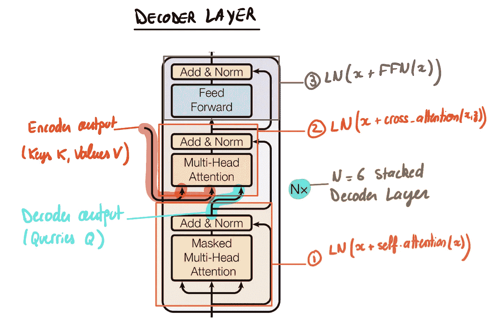

解码器层，自注意力，交叉注意力，图片来自文章，作者修改

现在让我们编写 DecoderLayer 的代码。如果你理解了 EncoderLayer 中的机制，这应该很简单。

```py
class DecoderLayer(nn.Module):
    "Decoder is made of self-attn, src-attn, and feed forward (defined below)"

    def __init__(self, size, self_attn, src_attn, feed_forward, dropout):
        super(DecoderLayer, self).__init__()
        self.size = size
        self.self_attn = self_attn
        self.src_attn = src_attn
        self.feed_forward = feed_forward
        self.sublayer = clones(SublayerConnection(size, dropout), 3)

    def forward(self, x, memory, src_mask, tgt_mask):
        "Follow Figure 1 (right) for connections."
        m = memory
        x = self.sublayer0)
        # New sublayer (cross attention)
        x = self.sublayer1)
        return self.sublayer2
```

现在我们可以将 N=6 的 DecoderLayers 链接起来形成解码器：

```py
class Decoder(nn.Module):
    "Generic N layer decoder with masking."

    def __init__(self, layer, N):
        super(Decoder, self).__init__()
        self.layers = clones(layer, N)
        self.norm = nn.LayerNorm(layer.size)

    def forward(self, x, memory, src_mask, tgt_mask):
        for layer in self.layers:
            x = layer(x, memory, src_mask, tgt_mask)
        return self.norm(x)
```

到目前为止，你已经了解了 Transformer 的 90%。还有一些细节：

# Transformer 模型详细信息

## 填充：

+   在典型的 Transformer 中，序列有一个最大长度（例如，“max_len=5000”）。这定义了**模型可以处理的最长序列**。

+   然而，现实世界的句子长度可以有所不同。为了处理较短的句子，我们使用填充。

+   填充是添加特殊的“填充标记”，以使批量中的所有序列长度相同。

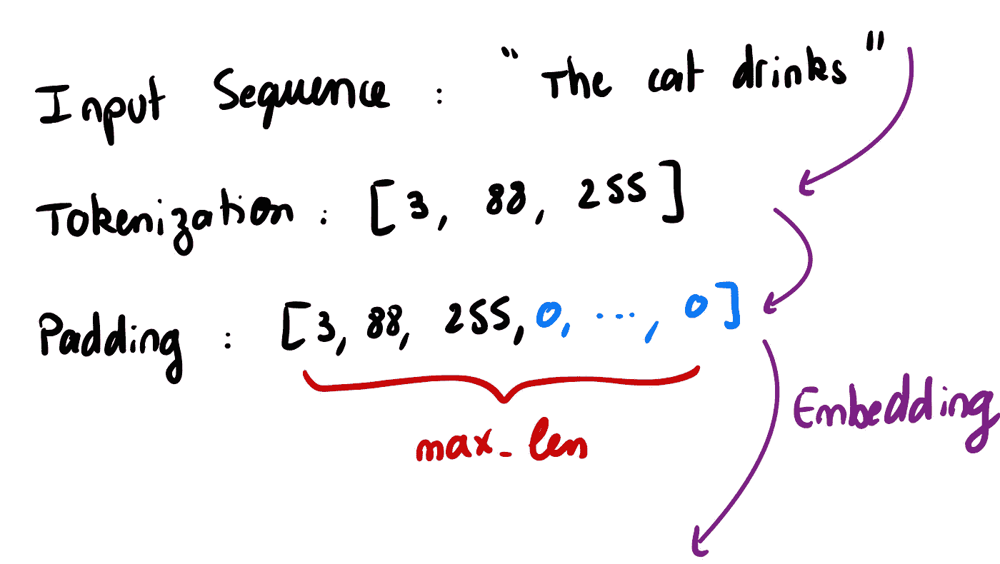

填充，图片由作者提供

## 掩码

掩码确保在注意力计算期间，某些标记被忽略。

有两种掩码场景：

+   **src_masking**：由于我们已向序列中添加了填充标记，我们不希望模型关注这些无意义的标记。因此，我们将它们掩蔽掉。

+   **tgt_masking** 或 **前瞻/因果掩码**：在解码器中，生成标记时，每个标记应仅受之前标记的影响，而不受未来标记的影响。例如，在生成句子的第 5 个词时，它不应了解第 6 个词。这确保了标记的顺序生成。

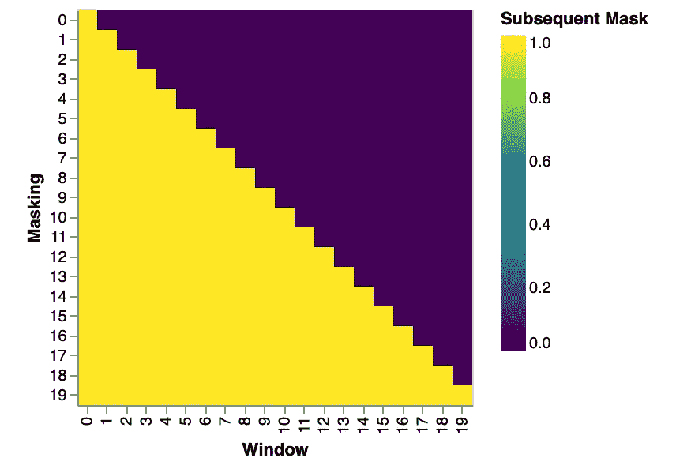

因果掩码/前瞻掩码，图片来源作者

然后我们使用这个掩码来添加负无穷大，以使相应的标记被忽略。这个例子应该能澄清一些问题：

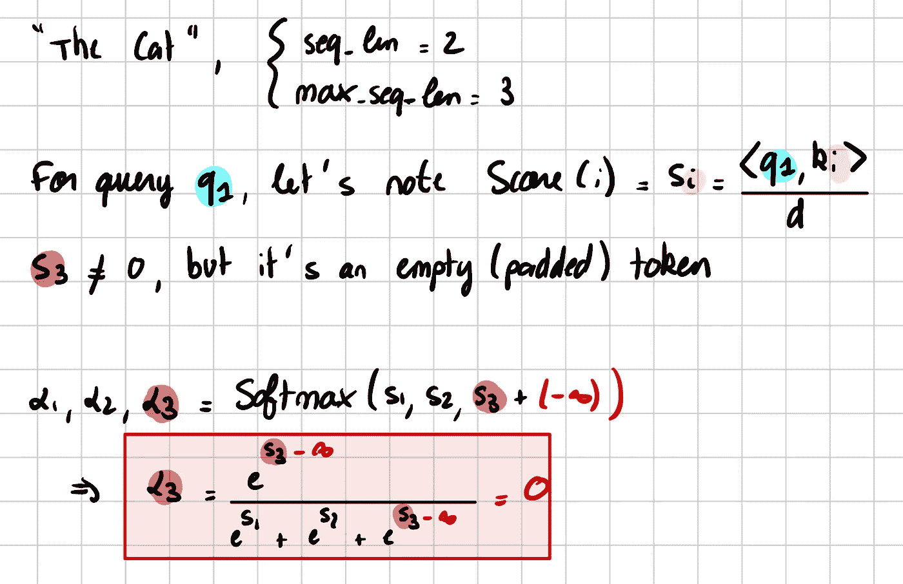

掩码，这是一个在 softmax 中的技巧，图片来源作者

## FFN：前馈网络

+   Transformer 图中的“前馈”层有些误导。它不仅仅是一个操作，而是一个操作序列。

+   FFN 由两个线性层组成。有趣的是，输入数据，可能为维度 `d_model=512`，首先被转换为更高维度 `d_ff=2048`，然后再映射回其原始维度（`d_model=512`）。

+   这可以被可视化为数据在操作中间被“扩展”，然后再“压缩”回其原始大小。

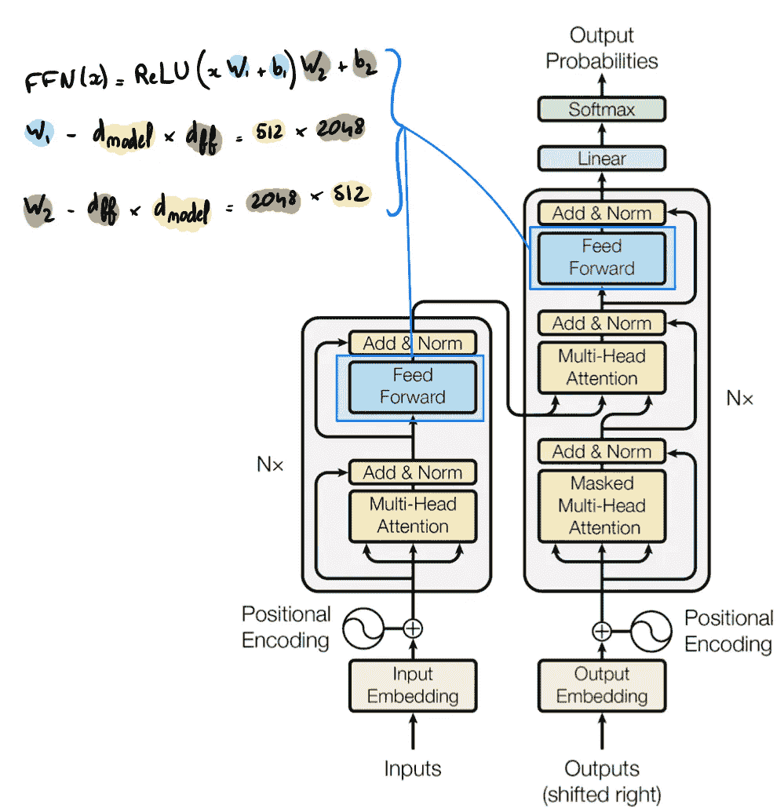

图片来自文章，已由作者修改

这很容易编码：

```py
class PositionwiseFeedForward(nn.Module):
    "Implements FFN equation."

    def __init__(self, d_model, d_ff, dropout=0.1):
        super(PositionwiseFeedForward, self).__init__()
        self.w_1 = nn.Linear(d_model, d_ff)
        self.w_2 = nn.Linear(d_ff, d_model)
        self.dropout = nn.Dropout(dropout)

    def forward(self, x):
        return self.w_2(self.dropout(self.w_1(x).relu()))
```

# 结论

Transformer 模型的无与伦比的成功和受欢迎程度可以归因于几个关键因素：

1.  **灵活性**：Transformers 可以处理任何序列的向量。这些向量可以是词的嵌入。通过将图像转换为不同的补丁，并将补丁展开为向量，可以轻松地将其转化为计算机视觉。甚至在音频中，我们可以将音频拆分为不同的片段并进行向量化。

1.  **通用性**：Transformer 由于最小的归纳偏差，**能够**捕捉数据中的复杂和微妙的模式，从而使其能够**更好地学习和泛化**。

1.  **速度与效率**：利用 GPU 的巨大计算能力，Transformers 设计为**并行处理**。

感谢阅读！在你离开之前：

你可以使用我的 Transformer GitHub 仓库运行实验。

欲获取更多精彩教程，请查看我的 [AI 教程合集](https://github.com/FrancoisPorcher/awesome-ai-tutorials) 在 GitHub 上

[## GitHub — FrancoisPorcher/awesome-ai-tutorials: The best collection of AI tutorials to make you a…](https://github.com/FrancoisPorcher/awesome-ai-tutorials?source=post_page-----c9f214c619ac--------------------------------)

### 最佳的 AI 教程合集，让你成为数据科学领域的高手！— GitHub …

[github.com](https://github.com/FrancoisPorcher/awesome-ai-tutorials?source=post_page-----c9f214c619ac--------------------------------)

*你应该订阅我的文章到你的收件箱。* [***在这里订阅。***](https://medium.com/@francoisporcher/subscribe)

*如果你想访问 Medium 上的优质文章，只需每月 $5 订阅会员。如果你注册* [***通过我的链接***](https://medium.com/@francoisporcher/membership)*，你在不增加额外费用的情况下，用你的一部分费用支持我。*

> 如果你觉得这篇文章有洞察力且有益，请考虑关注我并留下掌声以获取更多深入内容！你的支持帮助我继续制作有助于我们集体理解的内容。

# 参考资料

+   [Attention is all you need](https://arxiv.org/pdf/1706.03762.pdf)

+   [注释 Transformer](https://nlp.seas.harvard.edu/annotated-transformer/)（大部分代码灵感来自他们的博客文章）

+   [Andrej Karpathy 斯坦福讲座](https://www.youtube.com/watch?v=L4DC7e6g2iI)

## 进一步探索

即使有全面的指南，仍有许多与 Transformers 相关的其他领域。这里有一些你可能想探索的想法：

+   **位置编码：** 已经取得了显著的改进，你可能想了解“相对位置编码”和“旋转位置嵌入（RoPE）”

+   **层归一化**，以及与批归一化、组归一化的区别

+   **残差连接**及其对梯度平滑的影响

+   对 BERT 的改进（Roberta、ELECTRA、Camembert）

+   **将大模型蒸馏为小模型**

+   Transformers 在其他领域的应用（主要是视觉和音频）

+   Transformers 与图神经网络之间的联系
