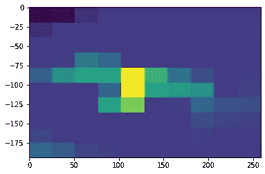

# 散点图的致命弱点

> 原文：[`towardsdatascience.com/the-achilles-heel-of-scatter-plots-f5e0a40b5548`](https://towardsdatascience.com/the-achilles-heel-of-scatter-plots-f5e0a40b5548)

## 使用散点图的替代方法可视化具有隐藏趋势的大型数据集

 [Nicholas Lewis](https://nrlewis929.medium.com/?source=post_page-----f5e0a40b5548--------------------------------)

·发表于 [Towards Data Science](https://towardsdatascience.com/?source=post_page-----f5e0a40b5548--------------------------------) ·5 min read·2023 年 2 月 5 日

--

图片由 [Luke Chesser](https://unsplash.com/@lukechesser?utm_source=medium&utm_medium=referral) 提供，来自 [Unsplash](https://unsplash.com/?utm_source=medium&utm_medium=referral)

想一想这个说法：任何时候你有 x 和 y 数据，最简单和最有用的可视化方式就是散点图。

这是真的吗？假的？大部分是真的？在什么情况下它不实用甚至令人困惑？你的图表是否传达了你试图沟通的故事或信息，没有任何歧义？这些是在制作数据可视化时你需要问的一些问题。

在这篇文章中，我想向你展示我学到的一个非常棒的小技巧。作为数据科学家，你很可能不断处理大量数据，而可视化成为传达你的发现的关键。虽然散点图非常适合展示趋势和相关性，但实际上，数据越多，异常值也会越多。在散点图中，每一个点的表示都是平等的；异常值和那些对趋势有贡献的点显示得一样清楚，如果数据足够多，它们可能会完全遮蔽重要数据。

作为数据科学家，你可能会认为第一个清理数据的选项是通过一些机器学习算法过滤所有数据，并绘制结果而不是原始数据。虽然这确实有用，但并不利于高效的数据探索。不仅如此，了解你拥有的数据对于选择合适的机器学习模型也很重要。数据是聚类的，还是有某种趋势线？它是什么类型的聚类？

让我们从一个例子开始，这样我们就能真正看到我想表达的观点。你可以在我的 [Github](https://github.com/nrlewis929/hist2d_plots) 上找到原始数据和代码。从 `data.csv` 中获取数据并加载到数据框中。你注意到了什么？它有 x 和 y 列，因此我们最初的可视化想法通常是“使用散点图。”让我们看看那会是什么样子。

原始数据的散点图。图由作者绘制。

现在你可能会想“这看起来没用，继续吧。”考虑到机器学习中的数据探索，这会是一个有用的特征或特征组合吗？你会想到使用聚类算法吗？我最初的想法是这只是无相关性或无分组的无用数据。这是因为散点图并不总是最好的 2 维数据集可视化方式！我相信你现在已经发现这里隐藏着某种秘密的相关性。如果你能够以某种方式突出显示趋势，而不进行任何类型的过滤，会怎么样？

首先，我希望你注意数据集的大小。473,111 个数据点相当大，你可能见过更大的。即使有 0.1% 的异常值，那也接近 500 个异常数据点，这些数据点占据了几个像素。然而，如果你有 100 个接近在一起的数据点，它们的像素会重叠。也许你可以把这个图放大到更大的屏幕上，但这是一种处理常见问题的不可行的方法。

我们要做的是将散点图切割成网格，然后计算每个网格中的数据点数量。接着，我们可以将每个网格中的数据点计数映射到灰度值或点的大小。大致会像这样：

将散点图转换为网格数据的处理流程。图像由作者提供。

听起来工作量很大，但有一种非常方便的图表可以做到这一点。我们将使用来自 `matplotlib` 的 `hist2d`，并从 10x10 网格开始。

数据的 2-D 直方图绘图，展示了一个更有趣的图景。图由作者绘制。

很棒！我们已经看到了数据中发生了更清晰的有趣现象。也许这足以描绘出正在发生的情况……但在我们的案例中，可能还有更多。我们可以通过增加箱子的数量来查看趋势是否变得更加清晰。让我们试试 100 个：

2-D 直方图绘图，具有更多的箱子，展示了更完整的图景。图由作者绘制。

这是一幅更清晰的图像……字面上的意思。它可能看起来像是一个带有实际图片的制造示例，但你会惊讶于你会发现使用这种技巧的频率。你是否试图绘制某个行业中数百家公司股票价格的时间序列，并且很难看出是否存在趋势？或者太阳辐射趋势呢？一天的阳光可以变化很大，但年复一年，我们将逐渐了解什么是正常的，什么是异常的。所有这些非常现实的世界趋势如果用常规的散点图或折线图来表示，会显得非常混乱，但如果对大型数据集使用分箱方法，就会变得非常清晰和有趣。

在总结之前，简单提醒一下：当你的网格大小接近无限时，你会回到一个无用的图表中，在这个图表中噪声与趋势同样显著，就像我们在散点图中看到的一样。当你使用这种方法时，务必尝试几种不同的网格大小。我知道还有一些其他方法可以实现相同的效果，但我主要想介绍这个方法，让你跳出总是使用散点图的思维框架。

我希望你觉得这和我一样有用。现在你知道了这个技巧，我相信你会找到很多机会来使用它，而且你应该能够制作出更令人印象深刻的图表，呈现出更清晰的图像。我很想听听你用于更清晰数据可视化的技巧，如果你发现其他的使用案例也可以告诉我。和往常一样，欢迎通过[LinkedIn](https://www.linkedin.com/in/nicholas-lewis-0366146b/)联系我，或者查看我在[其他文章](https://nrlewis929.medium.com/)中关于案例研究和有用技巧的内容。如果你想在自己的机器上运行这些代码，或者上传自己的图片生成图表，可以查看我的[Github](https://github.com/nrlewis929/hist2d_plots)库。
