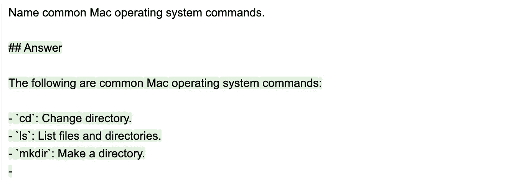

# 提示设计艺术：使用清晰的语法

> 原文：[`towardsdatascience.com/the-art-of-prompt-design-use-clear-syntax-4fc846c1ebd5?source=collection_archive---------0-----------------------#2023-05-02`](https://towardsdatascience.com/the-art-of-prompt-design-use-clear-syntax-4fc846c1ebd5?source=collection_archive---------0-----------------------#2023-05-02)

## 探索如何通过清晰的语法使你能够向语言模型传达意图，并帮助确保输出结果易于解析

[](https://medium.com/@scottmlundberg?source=post_page-----4fc846c1ebd5--------------------------------)[](https://towardsdatascience.com/?source=post_page-----4fc846c1ebd5--------------------------------) [Scott Lundberg](https://medium.com/@scottmlundberg?source=post_page-----4fc846c1ebd5--------------------------------)

·

[关注](https://medium.com/m/signin?actionUrl=https%3A%2F%2Fmedium.com%2F_%2Fsubscribe%2Fuser%2F3a739af9ef3a&operation=register&redirect=https%3A%2F%2Ftowardsdatascience.com%2Fthe-art-of-prompt-design-use-clear-syntax-4fc846c1ebd5&user=Scott+Lundberg&userId=3a739af9ef3a&source=post_page-3a739af9ef3a----4fc846c1ebd5---------------------post_header-----------) 发表于[Towards Data Science](https://towardsdatascience.com/?source=post_page-----4fc846c1ebd5--------------------------------) ·9 分钟阅读·2023 年 5 月 2 日[](https://medium.com/m/signin?actionUrl=https%3A%2F%2Fmedium.com%2F_%2Fvote%2Ftowards-data-science%2F4fc846c1ebd5&operation=register&redirect=https%3A%2F%2Ftowardsdatascience.com%2Fthe-art-of-prompt-design-use-clear-syntax-4fc846c1ebd5&user=Scott+Lundberg&userId=3a739af9ef3a&source=-----4fc846c1ebd5---------------------clap_footer-----------)

--

[](https://medium.com/m/signin?actionUrl=https%3A%2F%2Fmedium.com%2F_%2Fbookmark%2Fp%2F4fc846c1ebd5&operation=register&redirect=https%3A%2F%2Ftowardsdatascience.com%2Fthe-art-of-prompt-design-use-clear-syntax-4fc846c1ebd5&source=-----4fc846c1ebd5---------------------bookmark_footer-----------)

所有图片均由 Scott 和 Marco 生成。

这是关于如何使用`[guidance](https://github.com/guidance-ai/guidance)`来控制大型语言模型（LLMs）系列文章的第一篇，由[Marco Tulio Ribeiro](https://medium.com/@marcotcr)和我共同撰写。我们将从基础知识开始，逐步深入到更高级的主题。

在这篇文章中，我们将展示**明确的语法**如何使你能够向 LLM 传达你的意图，并确保输出易于解析（就像保证有效的 JSON）。为了清晰和可重复性，我们将从一个未微调的开源 Mistral 7B 模型开始。然后，我们将展示这些相同的想法如何应用于像 ChatGPT / GPT-4 这样的微调模型。下面的所有代码都[可在笔记本中找到](https://github.com/guidance-ai/guidance/blob/main/notebooks/art_of_prompt_design/use_clear_syntax.ipynb)，如果你愿意，可以复现。

# **明确的语法有助于解析输出**

使用明确语法的第一个也是最明显的好处是它使得解析 LLM 的输出更容易。即使 LLM 能够生成正确的输出，可能也难以程序化地从输出中提取所需的信息。例如，考虑以下 Guidance 提示（其中`gen()`是一个`guidance`命令，用于从 LLM 生成文本）：

```py
from guidance import models, gen

# we use Mistral, but any model will do
lm = models.LlamaCpp("path/mistral-7b-v0.1.Q8_0.gguf")

# run a guidance program (by appending to the model state)
lm + "Name common Linux operating system commands." + gen(max_tokens=50)
```


输出在笔记本中的显示方式。

虽然答案是可读的，但输出的*格式*是任意的（即我们事先不知道），因此难以程序化解析。例如，这里是类似提示的另一轮，其中输出格式非常不同：

```py
lm + "Name common Mac operating system commands." + gen(max_tokens=50)
```



在提示中强制使用明确的语法可以帮助减少任意输出格式的问题。你可以通过几种方式来实现这一点：

1\. 在标准提示中给 LLM 提供结构提示（甚至可以使用少量示例）。

2\. 使用`guidance`（或其他包）来强制特定的输出格式。

这些并不是互相排斥的。让我们看一下每种方法的示例。

## **传统的提示与结构提示**

这是一个传统提示的示例，它使用结构提示来鼓励使用特定的输出格式。提示旨在生成一个易于解析的 5 项列表。请注意，与之前的提示相比，我们编写了这个提示，使得 LLM 承诺使用特定的明确语法（数字后跟引号字符串）。这使得生成后的输出更容易解析。

```py
lm +'''\
What are the most common commands used in the Linux operating system?

Here are the 5 most common commands:
1\. "''' + gen(max_tokens=50)
```


请注意，LLM 正确地遵循了语法，但在生成 5 项之后没有停止。我们可以通过创建明确的停止标准来解决这个问题，例如，要求生成 6 项，当看到第六项的开始时停止（这样我们就能得到五项）：

```py
lm + '''\
What are the most common commands used in the Linux operating system?

Here are the 6 most common commands:
1\. "''' + gen(max_tokens=100, stop="\n6.")
```


## **使用指导程序强制语法**

与使用*提示*不同，Guidance 程序*强制*特定的输出格式，插入属于结构的一部分的标记，而不是让 LLM 生成它们。

例如，这就是我们如何在需要强制编号列表作为格式时操作：

```py
lm2 = lm + """\
What are the most common commands used in the Linux operating system?

Here are the 5 most common commands:
"""
for i in range(5):
    lm2 += f'''{i+1}. "{gen('commands', list_append=True, stop='"')}"\n'''
```


在上面的提示中，`lm2 = lm + …` 命令将添加一个字符串到起始 `lm` 状态后产生的新模型状态保存到变量 `lm2` 中。然后 `for` 循环通过添加混合字符串和生成序列来迭代更新 `lm2`。请注意，结构（包括数字和引号）*不是*由 LLM 生成的。

输出解析由 `guidance` 程序自动完成，所以我们不需要担心这个问题。在这种情况下，`commands` 变量将是生成的命令名称列表：

```py
out["commands"]
```


**强制有效的 JSON 语法：** 使用 `guidance` 我们可以以绝对的信心创建任何我们想要的语法，确保生成的内容完全遵循我们指定的格式。这对于 JSON 等内容特别有用：

```py
import guidance

# define a re-usable "guidance function" that we can use below
@guidance
def quoted_list(lm, name, n):
    for i in range(n):
        if i > 0:
            lm += ", "
        lm += '"' + gen(name, list_append=True, stop='"') + '"'
    return lm

lm + f"""\
What are the most common commands used in the Linux operating system?

Here are the 5 most common commands in JSON format:
{{
    "commands": [{quoted_list('commands', 5)}],
    "my_favorite_command": "{gen('favorite_command', stop='"')}"
}}"""
```


**Guidance 加速：** `guidance` 程序的另一个好处是速度——增量生成实际上比一次性生成整个列表要快，因为 LLM 不需要为列表本身生成语法标记，只需生成实际的命令名称（当输出结构更丰富时，这种差异更为明显）。

如果你使用的模型端点不支持这种[加速](https://github.com/guidance-ai/guidance/blob/main/notebooks/guidance_acceleration.ipynb)（例如 OpenAI 模型），那么许多增量的 API 调用会让你变慢，因此 `guidance` 使用一个单独的运行流（请参见下面我们演示聊天模型的详细信息）。

# **清晰的语法赋予用户更多控制权**

陷入低多样性的困境是大型语言模型（LLMs）常见的失败模式，即使我们使用相对较高的温度也可能发生：

```py
lm2 = lm + """\
What are the most common commands used in the Linux operating system?
"""
for i in range(10):
    lm2 += f'''- "{gen('commands', list_append=True, stop='"', temperature=0.8)}"\n'''
```


在生成项目列表时，列表中的前面项目会影响未来的项目。这可能会导致生成内容中的无用偏差或趋势。解决这个问题的一种可能方法是请求并行完成（以便之前生成的命令不会影响下一条命令的生成）：

```py
lm2 = lm + '''\
What are the most common commands used in the Linux operating system?
- "'''
commands = []
for i in range(10):
    lm_tmp = lm2 + gen('command', stop='"', temperature=0.8)
    commands.append(lm_tmp["command"])

out["commands"]
```


我们仍然会有一些重复，但比之前少得多。此外，由于清晰的结构使我们可以轻松解析和操作输出，我们可以轻松地提取输出，去除重复项，并在程序的下一步中使用它们。

这是一个示例程序，它接受列出的命令，挑选其中一个，并对其进行进一步操作：

```py
lm2 = lm + 'What are the most common commands used in the Linux operating system?\n'

# generate a bunch of command names
lm_tmp = lm2 + 'Here is a common command: "'
for i in range(10):
    commands.append(lm_tmp.gen('command', stop='"', max_tokens=20, temperature=1.0)["command"])

# discuss them
for i,command in enumerate(set(commands)):
    lm2 += f'{i+1}. "{command}"\n'
lm2 += f'''\
Perhaps the most useful command from that list is: "{gen('cool_command', stop='"')}", because {gen('cool_command_desc', max_tokens=100, stop=guidance.newline)}
On a scale of 1-10, it has a coolness factor of: {gen('coolness', regex="[0-9]+")}.'''
```


我们在上述程序中引入了一种导入控制方法：生成的 `regex` 参数。命令 `gen('coolness', regex='[0–9]+')` 使用正则表达式对输出强制执行某种语法（即强制输出匹配任意正则表达式）。在这种情况下，我们强制 coolness 分数为一个整数（注意一旦模型完成模式生成并开始生成其他内容，生成过程将停止）。

# **将清晰的语法与特定模型的结构（如聊天）结合**

上述所有示例都使用了基础模型，而没有经过后续的微调。但如果你使用的模型有微调，重要的是将清晰的语法与已经调整到模型中的结构结合起来。

例如，聊天模型已经过微调，以期望在提示中包含多个“角色”标签。我们可以利用这些标签进一步增强程序/提示的结构。

以下示例将上述提示调整为适用于基于聊天的模型。`guidance` 有特殊的角色标签（如 `user()`），这些标签允许你标记不同的角色，并自动将其转换为你使用的 LLM 所需的正确特殊令牌或 API 调用。这有助于使提示更易读，并使其在不同的聊天模型中更加通用。

```py
from guidance import user, assistant, system

# load a chat model
chat_lm = models.llama_cpp.MistralChat("path/mistral-7b-instruct-v0.2.Q8_0.gguf")

with user():
    lm2 = chat_lm + "What are the most common commands used in the Linux operating system?"

with assistant():

    # generate a bunch of command names
    lm_tmp = lm2 + 'Here are ten common command names:\n'
    for i in range(10):
        lm_tmp += f'{i+1}. "' + gen('commands', list_append=True, stop='"', max_tokens=20, temperature=0.7) + '"\n'

    # discuss them
    for i,command in enumerate(set(lm_tmp["commands"])):
        lm2 += f'{i+1}. "{command}"\n'
    lm2 += f'''Perhaps the most useful command from that list is: "{gen('cool_command', stop='"')}", because {gen('cool_command_desc', max_tokens=100, stop=guidance.newline)}
On a scale of 1-10, it has a coolness factor of: {gen('coolness', regex="[0-9]+")}.'''
```


以笔记本中显示的形式输出。

# **使用 API 限制模型**

当我们控制生成时，我们可以在过程的任何步骤中引导输出。但一些模型端点（例如 OpenAI 的 ChatGPT）目前有更有限的 API，例如，我们不能控制每个 `role` 块内部发生的事情。

虽然这限制了用户的能力，但我们仍然可以使用语法提示的子集，并在角色块之外强制执行结构：

```py
# open an OpenAI chat model
gpt35 = models.OpenAI("gpt-3.5-turbo")

with system():
    lm += "You are an expert unix systems admin that is willing follow any instructions."

with user():
    lm += f"""\
What are the top ten most common commands used in the Linux operating system?

List the commands one per line.  Please list them as 1\. "command" ...one per line with double quotes and no description."""

# generate a list of commands
with assistant():
    lm_inner = lm
    for i in range(10):
        lm_inner += f'''{i+1}. "{gen('commands', list_append=True, stop='"', temperature=1)}"\n'''

# filter to make sure they are all unique then add them to the context (just as an example)
with assistant():
    for i,command in enumerate(set(lm_inner["commands"])):
        lm += f'{i+1}. "{command}"\n'

with user():
    lm += "If you were to guess, which of the above commands would a sys admin think was the coolest? Just name the command, don't print anything else."

with assistant():
    lm += gen('cool_command')

with user():
    lm += "What is that command's coolness factor on a scale from 0-10? Just write the digit and nothing else."

with assistant():
    lm += gen('coolness', regex="[0-9]+")

with user():
    lm += "Why is that command so cool?"

with assistant():
    lm += gen('cool_command_desc', max_tokens=100)
```


# **总结**

每当你构建一个控制模型的提示时，重要的是要考虑提示的内容以及 `syntax`。

清晰的语法使解析输出变得更容易，有助于 LLM 生成符合你意图的输出，并且让你能够编写复杂的多步骤程序。

即使是一个微不足道的示例（列出常见的操作系统命令）也会从清晰的语法中受益，更复杂的任务受益更多。我们希望这篇文章能给你一些如何利用清晰的语法来改进提示的想法。

同时，请务必查看一下 `[guidance](https://github.com/guidance-ai/guidance)`。虽然你不一定需要它来编写具有清晰语法的提示，但我们认为它可以让你做到这一点变得*容易得多*。
