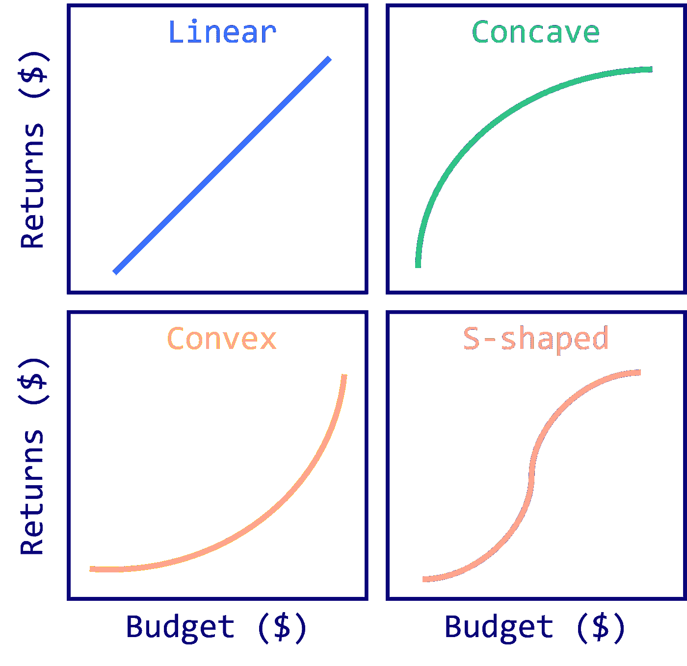
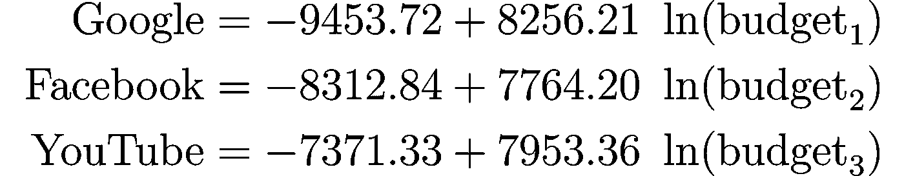
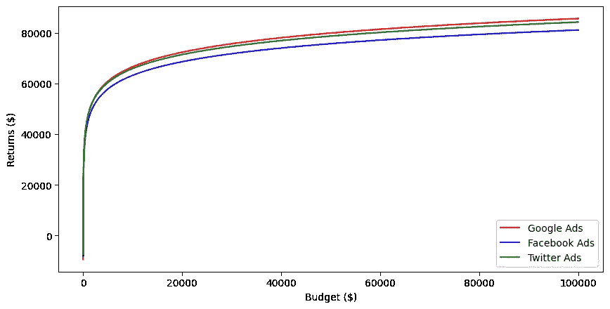
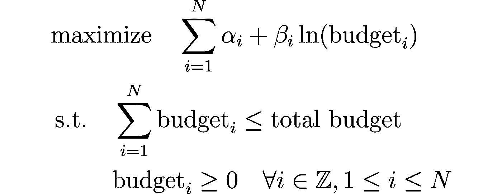
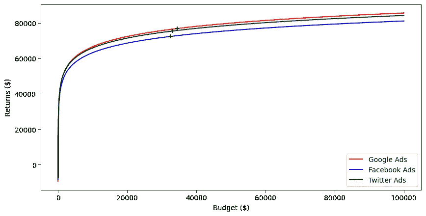
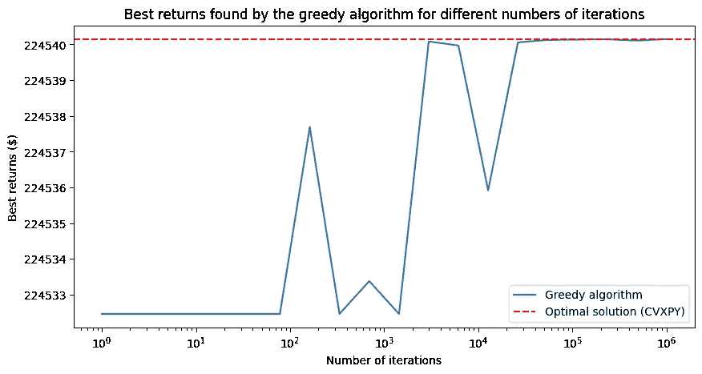

# 使用非线性编程优化您的营销预算

> 原文：[`towardsdatascience.com/the-art-of-spending-optimizing-your-marketing-budget-with-nonlinear-optimization-6c8a39afb3c2`](https://towardsdatascience.com/the-art-of-spending-optimizing-your-marketing-budget-with-nonlinear-optimization-6c8a39afb3c2)

## 介绍 CVXPY，以最大化营销投资回报率

[](https://medium.com/@mlabonne?source=post_page-----6c8a39afb3c2--------------------------------)[](https://towardsdatascience.com/?source=post_page-----6c8a39afb3c2--------------------------------) [Maxime Labonne](https://medium.com/@mlabonne?source=post_page-----6c8a39afb3c2--------------------------------)

·发表于 [Towards Data Science](https://towardsdatascience.com/?source=post_page-----6c8a39afb3c2--------------------------------) ·阅读时长 9 分钟·2023 年 5 月 22 日

--


图片由作者提供

在数字营销时代，企业面临着在多个渠道上分配营销预算以最大化销售的挑战。

然而，随着他们扩大覆盖范围，这些公司不可避免地面临 **收益递减** 的问题——这一现象指的是在营销渠道上额外投资会带来逐渐减少的转化增加。这正是营销预算分配概念发挥作用的地方，为整个过程增加了另一层复杂性。

在本文中，我们将探索非线性规划的潜力，特别是锥优化（或锥编程），作为营销预算分配的工具。通过使用这一高级数学技术，我们旨在优化在各个平台上的营销预算分配，以提取最大的价值和最高的投资回报率（ROI）。

代码可以在 [GitHub](https://github.com/mlabonne/linear-programming-course/blob/main/4_Maximize_Your_Marketing_ROI_with_Nonlinear_Optimization.ipynb) 和 [Google Colab](https://colab.research.google.com/drive/1V7z8giemuTk92s_JMxIyr1Clr2TwY7xl?usp=sharing) 上找到。

# **💰 营销预算分配**

营销预算分配是任何广告活动的关键方面，要求企业在不同渠道上战略性地分配资源。目标是最大化营销工作的效果，并实现最高的投资回报率（ROI）。为了解决这一挑战，我们需要考虑三个关键组件：

1.  **归因**：我们如何将转化事件与特定活动关联？

1.  **绩效估算**：我们如何根据分配的预算预测活动的绩效？

1.  **优化**：我们如何在各种活动中分配预算以最大化 ROI？

# **🔗 1\. 归因：将转换连接到活动**

归因是确定哪些活动负责转化客户的过程。一些渠道，如 Facebook 或 AdWords，可以直接宣称转换。然而，有多种归因模型需要考虑，包括：

+   首次接触

+   最后接触

+   多次接触

+   时间衰减

+   基于位置

归因系统也并非没有问题，主要有两个挑战：

+   **滞后**：测量广告表现并准确归因转换所需的时间

+   **归因窗口**：使用短窗口与长窗口之间的权衡，以归因转换

例如，DoorDash 使用了几天的最后接触归因系统。他们面临的问题是需要等待几天才能测量广告的表现，这对于其市场的快速变化而言过于漫长。

# **🔮 2\. 性能估算：预测活动成功**

性能估算涉及创建一个模型，该模型可以根据预算分配预测营销活动的成功。在这里，成功可以通过各种关键绩效指标（KPI）来定义，例如：

+   潜在客户

+   每个潜在客户的成本（CPL）

+   客户终身价值（CLV）

+   客户获取成本（CAC）

传统上，线性模型用于性能估算。然而，它们假设营销渠道**不会出现递减收益**，这通常并非如此。为了获得非平凡的解决方案，线性模型通常包含多个约束，并通过线性规划（LP）求解。

实际上，市场营销组合建模中的响应曲线通常显示出不同的形状，例如：

+   线性（少见）

+   凹形（常见，表示递减收益）

+   凸形（少见）

+   S 形（少见）



图片由作者提供

这些形状反映了营销支出的**递减收益**或不同预算水平下不同渠道的效果差异。例如，将更多的钱投入到一个渠道可能会在初期产生更高的回报（凸形），但在某一点后，每增加一美元可能会产生越来越少的增量效果（变为凹形），最终形成 S 形曲线。

为了捕捉营销预算分配问题的内在非线性，需要更复杂的方法。这就是非线性规划，特别是锥形优化的作用所在。

# **🔄 3\. 优化：使用 CVXPY 进行非线性优化**

非线性规划，也称为非线性优化，是一种用于解决优化问题的方法，其中**目标函数、约束条件**或两者都是**非线性**的。简单来说，它是找到一个系统的最佳解决方案（最大化或最小化）的过程，该系统由一组非线性方程控制。

在这个例子中，我们将使用自然对数来建模每个营销渠道的回报（响应曲线），具体如下：


前两个步骤的归因和性能估计近似每个渠道的αᵢ和βᵢ值。让我们以三个渠道为例：



这些值中观察到的噪声在营销预算分配问题中是典型的。注意到α值是**负的**；这可以解释为与新的营销渠道接触的初始成本。

我们可以使用 matplotlib 绘制每个营销渠道的响应曲线。

```py
import matplotlib.pyplot as plt
import numpy as np
np.random.seed(0)

TOTAL_BUDGET = 100_000

# Alpha and beta constants
alphas = np.array([-9453.72, -8312.84, -7371.33])
betas = np.array([8256.21, 7764.20, 7953.36])

# Linearly spaced numbers
x = np.linspace(1, TOTAL_BUDGET, TOTAL_BUDGET)

# Plot the response curves
fig = plt.figure(figsize=(10, 5), dpi=300)
plt.plot(x, alphas[0] + betas[0] * np.log(x), color='red', label='Google Ads')
plt.plot(x, alphas[1] + betas[1] * np.log(x), color='blue', label='Facebook Ads')
plt.plot(x, alphas[2] + betas[2] * np.log(x), color='green', label='Twitter Ads')
plt.xlabel('Budget ($)')
plt.ylabel('Returns ($)') 
plt.legend()
plt.show()
```



如何找到每个响应曲线的最佳值？最简单的解决方案是贪心算法，它随机抽样值并评估结果。我们的优化问题可以描述如下：



以下函数有 1,000 次迭代的预算来寻找最佳分配。

```py
def greedy_optimization(TOTAL_BUDGET, alphas, betas, num_iterations=1_000):
    # Initialize the budget allocation and the best objective value
    google_budget = facebook_budget = twitter_budget = TOTAL_BUDGET / 3
    obj = alphas[0] + betas[0] * np.log(google_budget) + alphas[1] + betas[1] * np.log(facebook_budget) + alphas[2] + betas[2] * np.log(twitter_budget)

    for _ in range(num_iterations):
        # Generate a new random allocation
        random_allocation = np.random.dirichlet(np.ones(3)) * TOTAL_BUDGET
        google_budget_new, facebook_budget_new, twitter_budget_new = random_allocation

        # Calculate the new objective value
        new_obj = alphas[0] + betas[0] * np.log(google_budget_new) + alphas[1] + betas[1] * np.log(facebook_budget_new) + alphas[2] + betas[2] * np.log(twitter_budget_new)

        # If the new allocation improves the objective value, keep it
        if new_obj > obj:
            google_budget, facebook_budget, twitter_budget = google_budget_new, facebook_budget_new, twitter_budget_new
            obj = new_obj

    # Return the best allocation and the corresponding objective value
    return (google_budget, facebook_budget, twitter_budget), objp
```

让我们运行它并查看它找到的近似解：

```py
# Run the greedy optimization
(best_google, best_facebook, best_twitter), obj = greedy_optimization(TOTAL_BUDGET, alphas, betas)

# Print the result
print('='*59 + '\n' + ' '*24 + 'Solution' + ' '*24 + '\n' + '='*59)
print(f'Returns = ${round(obj):,}\n')
print('Marketing allocation:')
print(f' - Google Ads   = ${round(best_google):,}')
print(f' - Facebook Ads = ${round(best_facebook):,}')
print(f' - Twitter Ads  = ${round(best_twitter):,}')
```

```py
===========================================================
                        Solution                        
===========================================================
Returns = $224,534

Marketing allocation:
 - Google Ads   = $35,476
 - Facebook Ads = $31,722
 - Twitter Ads  = $32,802
```

在进行计算后，我们发现我们的总回报是$224,533。你可能会想，我们是否可以通过进一步调整模型或进行更多迭代来改进它。

这种保证正是非线性编程的救援所在：它可以输出**最佳可能解**，也称为最优解。除了这一巨大优势外，它的运行速度也更快。

为了使用非线性编程解决营销预算分配问题，我们将使用[**CVXPY**](https://www.cvxpy.org/)库，该库支持圆锥优化，得益于像[ECOS](https://github.com/embotech/ecos)、[MOSEK](https://www.mosek.com/)（内点法）和[SCS](https://github.com/cvxgrp/scs)（一阶方法）等专门的求解器。在这个例子中，我们将使用开源的 ECOS 求解器来找到最佳解。

让我们设置优化问题：

+   我们的决策**变量**是每个渠道的（正）预算。

+   我们的**约束条件**是所有预算的总和不得超过总预算。

+   我们的**目标**是最大化总回报，即各个渠道回报的总和。

```py
import cvxpy as cp

# Variables
google   = cp.Variable(pos=True)
facebook = cp.Variable(pos=True)
twitter  = cp.Variable(pos=True)

# Constraint
constraint = [google + facebook + twitter <= TOTAL_BUDGET]

# Objective
obj = cp.Maximize(alphas[0] + betas[0] * cp.log(google)
                + alphas[1] + betas[1] * cp.log(facebook)
                + alphas[2] + betas[2] * cp.log(twitter))
```

最后，我们调用 ECOS 求解器来找到最佳预算分配并显示结果。

```py
# Solve
prob = cp.Problem(obj, constraint)
prob.solve(solver='ECOS', verbose=False)

# Print solution
print('='*59 + '\n' + ' '*24 + 'Solution' + ' '*24 + '\n' + '='*59)
print(f'Status = {prob.status}')
print(f'Returns = ${round(prob.value):,}\n')
print('Marketing allocation:')
print(f' - Google Ads   = ${round(google.value):,}')
print(f' - Facebook Ads = ${round(facebook.value):,}')
print(f' - Twitter Ads  = ${round(twitter.value):,}')
```

```py
===========================================================
                        Solution                        
===========================================================
Status = optimal
Returns = $224,540

Marketing allocation:
 - Google Ads   = $34,439
 - Facebook Ads = $32,386
 - Twitter Ads  = $33,175
```

求解器找到的最佳分配是 Google Ads $34,439，Facebook Ads $32,386，YouTube $33,175，总回报为$224,540！这比贪心算法返回的**多$7**（$224,533）。

请记住，这种分配最大化了基于我们响应曲线的回报：正确建模这些曲线对于有效优化预算至关重要。

让我们将这个最佳分配可视化到之前的响应曲线之上。

```py
# Plot the functions and the results
fig = plt.figure(figsize=(10, 5), dpi=300)

plt.plot(x, alphas[0] + betas[0] * np.log(x), color='red', label='Google Ads')
plt.plot(x, alphas[1] + betas[1] * np.log(x), color='blue', label='Facebook Ads')
plt.plot(x, alphas[2] + betas[2] * np.log(x), color='green', label='Twitter Ads')

# Plot optimal points
plt.scatter([google.value, facebook.value, twitter.value],
            [alphas[0] + betas[0] * np.log(google.value),
             alphas[1] + betas[1] * np.log(facebook.value),
             alphas[2] + betas[2] * np.log(twitter.value)],
            marker="+", color='black', zorder=10)

plt.xlabel('Budget ($)')
plt.ylabel('Returns ($)') 
plt.legend()
plt.show()
```



但它**真的最优**吗？我们可以通过对贪心算法进行不同迭代次数的快速检验来检查。这将展示这两种方法之间的差异。

让我们对 1 到 1,000,000 之间的 20 个不同的迭代次数进行测试。

```py
# List to store the best objective value for each number of iterations
best_obj_list = []

# Range of number of iterations to test
num_iterations_range = np.logspace(0, 6, 20).astype(int)

# Run the greedy algorithm for each number of iterations and store the best objective value
for num_iterations in num_iterations_range:
    _, best_obj = greedy_optimization(TOTAL_BUDGET, alphas, betas, num_iterations)
    best_obj_list.append(best_obj)
```

现在我们可以使用 matplotlib 绘制结果列表，并将其与最优解进行比较：

```py
# Plot the results
plt.figure(figsize=(10, 5), dpi=300)
plt.ticklabel_format(useOffset=False)
plt.plot(num_iterations_range, best_obj_list, label='Greedy algorithm')
plt.axhline(y=prob.value, color='r', linestyle='--', label='Optimal solution (CVXPY)')
plt.xlabel('Number of iterations')
plt.xticks(num_iterations_range)
plt.xscale("log")
plt.ylabel('Best returns ($)')
plt.title('Best returns found by the greedy algorithm for different numbers of iterations')
plt.legend()
plt.show()
```



我们观察到，贪心算法在进行大量迭代时表现相对较好。然而，尽管进行了 100 万次尝试，它仍未能找到最优分配，最优回报为 224,540.1500 美元。它能达到的最佳非四舍五入值为 224,540.1489 美元。

除此之外，两种方法在**计算速度**方面存在显著差异。非线性编程模型在短短 22.3 毫秒内找到了最优解。而贪心算法则花费了 30 秒进行 100 万次迭代，找到一个几乎最优的解。

当我们将问题扩展到**多个营销渠道**时，这种差异变得尤为重要。使用 CVXPY 的非线性编程保持了其速度和精确度，使其成为处理复杂、高维营销预算分配问题的高效工具。

# **结论**

非线性编程为解决营销预算分配问题提供了一种强大的方法。通过使用**非线性函数**来建模每个营销渠道的收益递减，并利用 CVXPY 库，我们可以找到最大化销售的资源最优分配。

随着营销环境的不断发展和渠道数量的增加，像非线性编程这样的优化技术可以帮助企业做出更好的数据驱动决策，优化其营销投资。虽然本文提供了一个起点，但还有许多更先进的技术和模型可以探索。继续学习和尝试，找到最适合你业务的方法。

如果你想了解更多，欢迎在 Twitter 上关注我 [@maximelabonne](https://twitter.com/maximelabonne)。祝优化愉快！

# **参考文献**

如果你想了解更多关于营销预算分配的信息，我推荐以下资源：

+   Park 等人，[多个数字媒体渠道的广告预算分配的非线性优化模型](https://scholarspace.manoa.hawaii.edu/server/api/core/bitstreams/ea6310e7-8ef8-4335-9625-b82b11042797/content)（2022 年）：基于收益递减的优秀方法，启发了本文。

+   Zhao 等人，[营销预算分配的统一框架](https://arxiv.org/pdf/1902.01128.pdf)（2019 年）：基于对数响应曲线的引人入胜的架构，目前在阿里巴巴生产中使用。

+   Katsov, [使用深度学习进行跨渠道营销支出优化](https://blog.griddynamics.com/cross-channel-marketing-spend-optimization-deep-learning/)（2019 年）：关于一种有趣的基于 LSTM 的方法的博客文章，无需凸优化。

# 相关文章

[](/introduction-to-linear-programming-in-python-9261e7eb44b?source=post_page-----6c8a39afb3c2--------------------------------) ## Python 中的线性规划介绍

### 使用 Google OR-Tools 的数学优化指南

towardsdatascience.com [](/integer-programming-vs-linear-programming-in-python-f1be5bb4e60e?source=post_page-----6c8a39afb3c2--------------------------------) ## Python 中的整数规划与线性规划

### 识别和解决任何优化问题的指南

towardsdatascience.com
