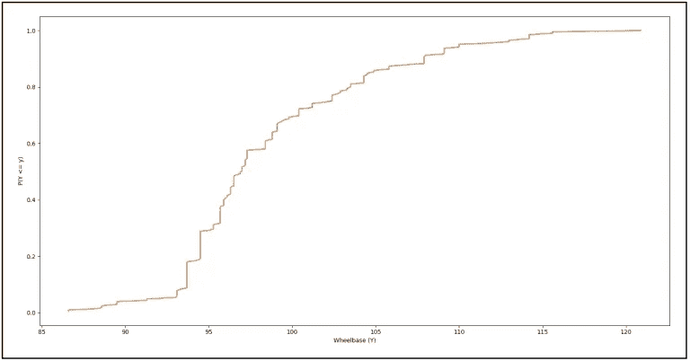
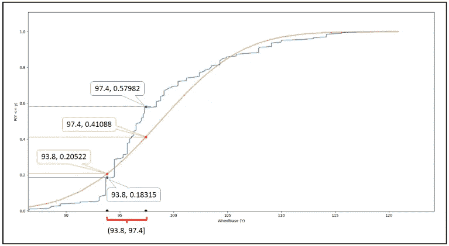
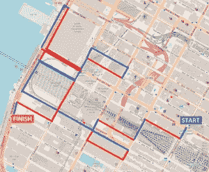

# 《有志统计学家的随机变量入门》

> 原文：[`towardsdatascience.com/the-aspiring-statisticans-introduction-to-random-variables-7b26a057a89a`](https://towardsdatascience.com/the-aspiring-statisticans-introduction-to-random-variables-7b26a057a89a)

[Pixabay](https://pixabay.com/photos/candy-sweets-sugar-confectionery-1924595/) ([许可证](https://pixabay.com/service/terms/))

## 当宇宙大喊“惊喜！”时，它从不厌倦。

 [Sachin Date](https://timeseriesreasoning.medium.com/?source=post_page-----7b26a057a89a--------------------------------)

·发表于 [Towards Data Science](https://towardsdatascience.com/?source=post_page-----7b26a057a89a--------------------------------) ·31 分钟阅读·2023 年 5 月 12 日

--

在这篇文章中，我们将踏上一次沉思的旅程，穿越机遇之地。我们将学习关于**随机游走**、**离散**和**连续随机变量**以及它们的**概率分布**。我们将理解为何给连续随机变量的值分配概率是没有意义的。在这个过程中，我们将揭示**概率密度**的含义。我们将学习**随机过程**的形成及其与**时间序列模型**的关系。最后，我们将通过简短的讨论结束我们的旅程，探讨随机变量如何构成所有回归模型的基础。

# 关于实验、结果和样本空间

我们经历变化——不可预测的、随机的变化，没有任何可观察的模式或理由。它让我们感到惊讶，令人沮丧，打乱我们最精心策划的计划。

我们在早晨的闹钟声中睡过头，我们被困在交通拥堵中，我们迟到了会议。结果发现会议被推迟，因为召集会议的人也被困在了交通中。

但随机性并不总是恶魔。还记得当分心的咖啡师多倒了几毫米咖啡的时候吗？你抗议了吗？我们已经学会了安静地享受大自然的小小意外。

我们追求可预测性、确定性和稳定性。但这些都是无法找到的。我们的感官和大脑并没有进化到能随时知道一切。我们经历随机变异，因为我们并非全知全能。另一方面，上帝可能用不到骰子。但即便如此，这也是有争议的。

我们学会了利用随机性。游戏中有赢有输是通过掷硬币决定的。一枚硬币的翻转决定了[一匹珍贵马匹](https://en.wikipedia.org/wiki/Secretariat_(horse))的归属。而[正是一次硬币翻转](https://www.oregonencyclopedia.org/articles/portland_penny/#.ZF9Kjc5BzV8)给了俄勒冈州的波特兰市这个名字。

从更宏大的尺度来看，随机数驱动着加密大部分互联网数据的[TLS 协议](https://en.wikipedia.org/wiki/Transport_Layer_Security)。

从更宏大的尺度来看，我们的太阳每[大约 11 年左右](https://en.wikipedia.org/wiki/Stellar_magnetic_field#Periodic_field_reversal)就会翻转一次磁场。这里的“左右”意味着太阳不想准确告诉我们下一次翻转的时间。

你起床的时间、早晨杯中的咖啡量、你喝下它的次数、你一生中掷出的所有硬币的结果以及我们太阳翻转磁场所需的年数——这些都是随机数。随机值是通过某些活动（如掷硬币）产生的。在统计学中，这种活动被称为**实验**。

当你进行实验时，你期望一个**结果**，通常是几种可能结果中的一种。当你掷一枚硬币时，你期望它落在正面或反面。但是，如果它卡在泥土边缘或者滚进了排水沟呢？如果你在珠穆朗玛峰上掷硬币，风可能会把硬币吹走。如果你在[国际空间站](https://www.youtube.com/watch?v=9qcRVljN2SE)内掷硬币……嗯，你明白了。你是否应该忽略这些结果？这取决于你为什么要掷硬币。如果你的行动方案取决于硬币落在正面还是反面，你不关心其他任何结果，你会希望设计实验以确保得到正面或反面。需要记住的一点是，实验的设计决定了结果。作为实验者，你必须设计实验以只产生对你有意义的结果。

我们只对正面和反面感兴趣。因此，让我们在一个空房间的平整地面上掷硬币。地板上没有黏稠的泥土，也没有排水沟或格栅。这个受控实验的可能结果是{正面，反面}。这是实验的**样本空间**。它是所有对你有意义的可能结果的集合，用字母**S**表示。如果你观察到除了正面或反面以外的任何结果，你必须将其视为未发生过，并重新进行实验。你也可以重新设计实验，将意外结果纳入样本空间。或者，你可以简单地宣布失败然后去钓鱼。

如果实验产生了 N 种可能结果中的一种，那么样本空间**S**是{s_1, s_2, s_3,…,s_N}。**S**的大小，用|**S**|表示，是 N。

当你进行实验时，**S**中的每个结果都是可能的。当**S**={正面，反面}时，两种结果的发生概率分别记为 P(正面)和 P(反面)。在一般情况下，第 k 个结果的发生概率记为 P(s_k)。

在我们的受控实验中，硬币必须落地为正面或反面。没有第三种结果。这两种结果也是**互斥**的。如果硬币已经是正面，它不可能同时是反面。

所以硬币落地为“正面或反面”的概率是：

P(正面 ∪ 反面) = P(正面) + P(反面) — P(正面 **∩** 反面) = P(正面) + P(反面) = 1.0

这就像是在说，当你抛掷一枚硬币时，它落地的结果要么是正面，要么是反面，概率是 100%。在精心安排的实验的受控环境中，这种说法从不为假。逻辑学家称之为**重言式**。这可能听起来是个琐碎的声明，但对实验者来说非常实用。在你设计了*只产生互斥结果*的实验之后，你应该验证样本空间中所有结果的概率总和是否为 1.0。如果不是，那么你的实验设计存在问题。简单来说，你需要重新设计实验。

样本空间中所有结果的概率总和是完美的 1.0（即 100%）（图像来源：作者）

# 采取行动：在岛上随机漫步

之前我们谈到过根据实验结果采取一些行动。让我们进一步探讨。如果你是曼哈顿的游客，想要进行自助游，一般来说，可以通过拿一本旅游指南书或下载一个应用程序并按照其指示行事来实现。

但是如果你让硬币引导你在曼哈顿游览呢？下面是一个假设的“硬币操作”探索的运作方式：

假设我们从 W 34th St. & 8th Ave 的角落开始，正好在 Penn Station 外面。然后我们抛一枚硬币——也许不是一枚真正的硬币，而是一个由掷币应用程序生成的伪硬币。如果结果是正面，我们向右转，否则向左转。不管怎样，我们一直沿街走，直到遇到下一个 3 叉路口或 4 叉路口，然后再次抛硬币并重复这个过程。如果我们遇到死胡同，我们只需回到之前的交叉口。我们所经过的路径被称为**随机漫步**。

在曼哈顿的随机漫步。左转标记为蓝色。右转标记为红色。（图像来源：作者）（地图底图版权 [OpenStreetMap](https://www.openstreetmap.org/copyright) 依据 OpenStreetMap [许可证](https://www.openstreetmap.org/copyright)）

在随机游走过程中，你会根据硬币是否显示正面或反面来选择右转或左转。我们将右转或左转的动作称为一个 **事件**。让我们创建一个新集合 **E**，其中包含这些 **事件**。**E** = {右转，左转}。

注意，右转或左转的动作完全是随机的。我们将用一个 **随机变量** 来表示这个动作，我们用**加粗**的大写字母 **X** 来表示。

换句话说，我们定义随机变量 **X** 来包含我们在硬币翻转后所采取的动作。因此，**X** 将根据 **S**={正面，反面} 中的结果假设 **E**={右转，左转} 中的两个值之一。注意 **X** 是如何将 **S** 中的值映射到 **E** 中的。结果到事件。

正面 → 右转

反面 → 左转

这样的映射让我们想起了什么？它们让我们想起了一个函数。**X** 是一个函数！所以让我们将其写成函数形式如下：

**X**（正面）= 右转

**X**（反面）= 左转

你也可以用以下集合符号写 **X**，它有额外的好处，让你看起来非常聪明：

**X**:**S** → **E**

无论如何，所有这些都表示 **X** 是一个函数，它将集合 **S** 中的值映射到集合 **E** 中的值。

随机变量 **X** 将结果映射到事件（作者提供的图像）

让我们回顾一下：**随机变量是一个函数**，它将随机结果集合 **S** 中的值映射到你感兴趣的事件集合 **E** 中。由于 **X** 是一个函数，它有一个定义域和一个值域。**X** 的定义域是样本空间 **S** 中的结果。**X** 的值域是 **E** 中的事件。

随机变量有三种类型：**离散**，**连续**，和 **混合**。**X** 恰好是第一种。因此，让我们仔细看看离散类别。

# 离散随机变量及其属性

随机变量 **X** 是驱动我们在曼哈顿随机游走的引擎。我们应当注意到 **X** 的以下属性：

1.  **X** 假设为**离散值**“右转”和“左转”（与温度这样的连续值相对）。因此，**X** 是一个 **离散随机变量**。

1.  你不能说右转比左转更大或更小。你不能对 **X** 取的两个值施加任何顺序。相反，你必须将它们视为相等。我们称这类随机变量，其范围包含无法排序的值为 **名义随机变量**。

1.  由于每个结果 s_k 在 **S** 中都有一个关联的概率 P(s_k)，每个事件 x_i 在 **E** 中也都有一个关联的概率 P(**X**=x_i)。

1.  P(**X=**x_i) 被称为 **概率质量函数** (**PMF**) 。PMF 为随机变量的每个可能值分配一个概率，即事件集合 **E** 中的每个值。

1.  所有**E**中的 x_i 的概率总和为 1.0。这里没有惊喜。根据随机游走实验的设计，一旦你的硬币落在正面或反面，你将要么左转要么右转。**E**中没有其他可以随意选择的动作或事件。硬币完全和绝对地指引你的行动。你对这个问题没有个人意见，没有[**自由意志**](https://en.wikipedia.org/wiki/Free_will)。但如果你想要自由意志怎么办？我们很快会讨论这个有趣的情况。现在，没有自由意志意味着 P(**X**=左转) + P(**X**=右转) = 1.0。

## 随机变量作为‘满射’函数

在随机游走实验中，**X**恰好将**S**中的每个值映射到**E**中的唯一值。正面映射到右转，反面映射到左转。集合论家称这样的函数为**一一对应**和**满射**。**一一对应**函数允许你将**E**中的某个值完全不映射到**S**中的任何东西。但你必须将它映射到**S**中的*恰好一个*值。这就是一一对应函数的工作原理。

一个**满射函数**要求你将**E**中的*每一个*值映射到**S**中的至少一个值。即使**E**中的多个值映射到**S**中的同一个值也无所谓。满射性要求的是**E**中的所有值都必须被映射。

结合一一对应和满射的属性意味着**S**中的*每一个*值都被映射到**E**中的*恰好一个*值，反之亦然。**S**和**E**最终具有相同数量的值。这是**X**的一个特征，但它不必是所有随机变量的特征。

随机变量不需要是一一对应的函数。但**随机变量需要是满射函数**。如果一个随机变量*不是*满射函数，会怎样呢？在这种情况下，它的范围**E**将包含一些与其定义域**S**中的任何结果都没有关联的事件。假设你在处理一个**X**，它的定义域**S**是{正面, 反面}，范围**E**是{右转, 左转, *走进迎面而来的交通*}。如果你的行动总是由一个硬币抛掷的结果来指导，告诉你在交叉路口左转或右转，那么你什么时候会故意走进迎面而来的交通呢？显然，永远不会。

现在，如果你在想，“为什么我的游走总是要听从一个愚蠢的硬币呢？难道我没有权利行使我的[自由意志](https://en.wikipedia.org/wiki/Free_will)吗？”是的，你有。你刚刚要求的是另一个随机变量。为了帮助你行使自由意志，我们将定义一个新的变量**Y**，其定义域**S**是{正面, 反面, *练习自由意志*}，范围**E**是{右转, 左转, 做些事情（不是愚蠢的）}。

**Y**（正面）= 右转

**Y**（反面）= 左转

**Y**（练习自由意志）= 做些事情（不是愚蠢的）

再次强调，**E**中的所有内容都被映射到**S**中的某些东西，使得**Y**成为一个满射函数。当你设计随机变量时，你实际上不能避免将它们设计成满射函数。

## 一个更复杂的例子：右转次数计数

如前所述，随机变量不一定是一对一的函数。实际上，许多随机变量是多对一的函数。让我们看一个例子。

在你在曼哈顿的硬币控制的漫步中，如果你想跟踪你在任何 4 次转弯序列中右转的次数，你可以定义一个随机变量**W**来保存这个值。在你进行的任何 4 次转弯序列中，**W**将包含你右转的次数。**W**的值域是**E**={0, 1, 2, 3, 4}，而**W**的定义域是一个包含所有可能的长度为 4 的正面和反面的序列的样本空间**S**。

**S** = {“HHHH”，“HHHT”，“HHTH”，“HHTT”，“HTHH”，“HTHT”，“HTTH”，“HTTT”，“THHH”，“THHT”，“THTH”，“THTT”，“TTHH”，“TTHT”，“TTTH”，“TTTT”}

在**S**中，我们也可以用右转替换 H，用左转替换 T。如果这样做，**S**的性质不会改变，但我们将保留 H 和 T，以便记住是硬币投掷驱动了**W**。

如前所述，**W**将**S**中的值映射到**E**中的值，但这次映射是多对一的：

随机变量**W**是一个多对一的映射函数（图片来源：作者）

随机变量**W**与**X**共享所有特性，除了一个。让我们回顾一下这些特性：

1.  **W**是一个离散随机变量。

1.  每个**E**={0, 1, 2, 3, 4}中的 w_k 都有一个概率 P(w_k)。

1.  在**W**的概率质量函数中的所有概率 P(**W**=w_k)必须总和为 1.0。如果不是这样，那么**W**的定义可能存在问题。你应该重新检查一下它的定义。

1.  现在，这里是**X**和**W**之间的区别：与**X**不同，**W**的值**E**={0, 1, 2, 3, 4} *可以*被排序。你右转 0 次小于你右转 1 次，小于右转 2 次，依此类推。这使得**W**成为一个**序数随机变量**。回忆一下，**X**是一个**名义**随机变量。

# 概率质量函数

让我们讨论一下随机变量每个值的概率。我们将构建随机变量的**概率质量函数**。我们从**X**开始。回忆一下，**X**的定义域是样本空间**S**={正面，反面}。**X**的值域是事件空间**E**={右转，左转}。右转映射到{正面}在{正面，反面}中的子集。左转映射到子集{反面}。因此，{右转}发生的概率是{正面}子集的大小与样本空间**S**的大小之比。{正面}的大小表示为|{正面}|，显然为 1，而{正面，反面}的大小表示为|{正面，反面}| = |**S**|，为 2。因此，我们有：

P(**X**=右转) = |{正面}| / |**S**| = 1 / 2 = 0.5

类似地，P(**X**=左转) = |{反面}| / |**S**| = 1 / 2 = 0.5

**X**的 PMF 中所有概率的总和等于 1.0。

**X**的 PMF（图像由作者提供）

**W**的 PMF 稍微有趣一些。回忆一下，**W**是在 4 次掷硬币的任何序列中右转的次数。**W**的范围是集合**E**={0,1,2,3,4}。我们将通过构建一个表来计算概率 P(**W**=w_k)。我们的表将有 4 列。第一列将包含**E**中的四个值，即{0,1,2,3,4}。第二列将包含映射到这些四个值的**S**中的结果。例如，如果**W**=1，你在 4 次掷硬币的任何序列中做出了一次右转。结果为**I**1 的**S**中产生了正好一次右转的结果是{HTTT, THTT, TTHT, TTTH}。第三列将包含**I**的大小，第四列将包含概率 P(**W**=w_k)。

这是表格：

与**W**值相关的概率表（图像由作者提供）

让我们验证一下，概率 P(**W**=w_k)对于 k=0,1,2,3,4 的总和是否为 1.0：

1/16 + 4/16 + 6/16 + 4/16 + 1/16 = 16/16 = 1.0

这是**W**的 PMF 图的样子：

**W**的 PMF（图像由作者提供）

**X**和**W**的构建很简单。它们的样本空间很小，范围也小。为了计算它们的 PMFs，我们将映射到随机变量每个值的**S**中的结果计数相加。然后，我们将每个和除以样本空间的大小，如下所示：

P(**W**=w_k) = |**I**_w_k|/|**S**|

让我们来看其中一个概率。在 4 次转弯中做出 2 次右转的概率是 6/16 = 0.375 或 37.5%。这个概率究竟是什么意思？它的实际生活解释是什么？这里有一种解释方法：

每年有数百万游客访问曼哈顿。到达曼哈顿后，假设他们都迫不及待地想要进行一次岛上的步行游览。每个人从城市的 3 路或 4 路交叉口的角落开始他们的游览。在那里，他们从口袋里拿出一个公平的硬币并抛掷。根据它是正面还是反面，他们在交叉口处向右或向左转弯，然后前往下一个交叉口，再次抛掷硬币。他们将这个过程重复四次。当他们都满足了自己的步行欲望后，一个全知的存在统计了所有包含恰好 2 次右转的游览次数，并将这个数字除以总游览次数（或人数）。得到的结果将是*大约*0.375。

# 累积分布函数

一旦你知道了**W**的 PMF，你还可以回答诸如在 4 次转弯的序列中，大多数转弯是否为右转？或者如果你不喜欢右转，最多只有 1 次右转？为了回答这些可能在某些情况下无关紧要但在一般情况下有用的问题，我们需要构建一个叫做**累积分布函数**（**CDF**）的新函数。**W**的 CDF 将返回**W**的值*至多为 k*的概率，其中 k=0,1,2,3 或 4。

如果你知道 PMF，构建 CDF 有一个简单的方法：

**W**=k 的 CDF 是 k=0,1,2,…,k 的概率之和。搞定！

CDF 用大写字母 F 表示。

**W**的累积分布函数（图像由作者提供）

让我们使用**W**的 PMF 来计算 CDF：

F(**W**=0) = P(**W** <= 0) = P(**W**=0) = 1/16

F(**W**=1) = P(**W** <= 1) = P(**W**=0) + P(**W**=1) = 1/16 + 4/16 = 5/16

F(**W**=2) = P(**W** <= 2) = P(**W**=0) + P(**W**=1) + P(**W**=2) = 1/16 + 4/16 + 6/16 = 11/16

F(**W**=3) = P(**W** <= 3) = P(**W**=0) + P(**W**=1) + P(**W**=2) + P(**W**=3) = 1/16 + 4/16 + 6/16 + 4/16 = 15/16

F(**W**=4) = P(**W** <= 4) = P(**W**=0) + P(**W**=1) + P(**W**=2) + P(**W**=3) + P(**W**=4) = 1/16 + 4/16 + 6/16 + 4/16 + 1/16 = 16/16 = 1.0

F(**W**=5) = P(**W** <= 5) = P(**W**=0) + P(**W**=1) + P(**W**=2) + P(**W**=3) + P(**W**=4) + P(**W**=5) = 1/16 + 4/16 + 6/16 + 4/16 + 1/16 + 0/16 = 16/16 = 1.0

这里是**W**的 CDF 的六个值：

F(**W**=0) = 1/16

F(**W**=1) = 5/16

F(**W**=2) = 11/16

F(**W**=3) = 15/16

F(**W**=4) = 16/16

F(**W**=5) 和 P(任何其他大于 4 的值) = 16/16

你可能还想知道 F(.)是否在**W**介于 0 和 1、1 和 2 等之间定义，即**W**的分数值。从某种意义上说，计算此类值的 CDF 是毫无意义的。1.5、2.6、3.1415926 等值不属于**W**的范围。但我们仍然可以计算**F**对于这些虚构的中间值。因此，根据定义，F(.)的定义域可以具有分数（实数）值，对应的概率也是有意义的。让我们计算 F(**W**=1.5)：

F(**W**=1.5) = P(**W** <= 1.5) = P(**W**=0) + P(**W**=1) + P(1 < **W** <= 1.5) = 1/16 + 4/16 + 0 = 5/16

我们可以类似地计算 1, 2)区间内每一个无限个实数的 F(.)。对于每一个数值，CDF 将返回概率 5/16。因此，F(.)的图形将是一条从 k=1 到 k=2 的直线，之后它将跃升到 F(**W**=2)=11/16。

如果你为每个 k 绘制 F(**W**=k)，你会发现如下的阶梯图：

![**W**的 CDF（图像由作者提供）使用 CDF，你可以计算在 4 次转弯的序列中采取大多数右转的概率，如下所示：P(k >2) = 1 — P(k <= 2) = 1 — F(**W**=2) = 1–11/16 = 5/16 在一个包含 4 次转动的序列中，最多取 1 次右转的概率是：P(k <= 1) = F(**W**=1)。同样是 5/16。看到用 CDF 计算这种概率有多简单了吗？对于大型样本空间，我们用于计算 PMF（然后计算 CDF）的表格方法显然不够实际。例如，如果 **W** 表示在 10 次硬币导向的左转和右转序列中右转的次数，你必须处理 **S** 中 2¹⁰=1024 种不同的结果。对于 20 次硬币导向的转动，你将处理超过一百万种结果。在处理大型复杂样本空间时，你必须运用适当的数学公式。例如，如果随机变量 **Z** 表示在 N 次硬币导向的左/右转中你向右转的次数，其中 N 可以是任意大的，**Z** 的定义域是一个包含 2^N 个独特 N 长度的左转和右转序列的样本空间。**Z** 的取值范围是 **E**={0,1,2,3,…,N}。**S** 中包含恰好 k 次右转的序列数由以下组合公式给出：

从 N 个结果中选择 k 个相似结果的方式数（作者提供的图片）

**Z** 取值 k 的概率是 **I** 的大小与 **S** 的大小之比：

在 N 次硬币导向的转动序列中取 k 次右转的概率（作者提供的图片）

对于每个 k=0,1,2,…N 的值，如果你绘制相应的概率 P(**Z**=k)，你会得到一个钟形曲线，如果 N 是偶数，则峰值在 k=N/2 处；如果 N 是奇数，则峰值在 k=(N-1)/2 和 k=[(N-1)/2 + 1] 处。要理解为什么它在这些值处达到峰值，我们可以依据硬币的公平性来解释：

当你的硬币是公平的时，在 N 次翻转的序列中，正面朝上的预期次数是 N/2。因此，期望你向右转的次数也是 N/2。所以，你可以预期在所有其他右转次数的概率中， N/2 次右转的概率是最高的。这解释了 PMF 在接近 N/2 处的单峰。下面的图显示了当 N=60 时 **Z** 的 PMF。

**Z** 的 PMF（作者提供的图片）

如果你沿 Y 轴往上看，你会发现大多数**Z**值的概率是极其微小的。这主要是因为 P(**Z**=k)公式中的分母有阶乘。当 k 很小的时候，k!很小，但(N-k)!很大，加上 2^N，它们一起使得分母极其庞大。这使得 k 小值时的概率非常微小。当 k 很大时，k!极其庞大，这次它主导了分母，再次把大值 k 的概率压得很低。在 60 次试验中，如果你希望右转次数少于 20 次或多于 40 次，那是不可能的。

**Z**的 CDF 是 F(**Z** = k) = P(**Z** <= k) = P(**Z**=0) + P(**Z**=1) + … + P(**Z**=k)。

我们按如下方式计算这个总和：

**Z**的 CDF（图片由作者提供）

# 连续随机变量

现在我们来看看随机领域中的另一种生物：**连续随机变量**。为了理解它，我们将查看 205 辆汽车的轴距长度：

205 辆汽车的轴距（数据来源：[UCI 机器学习数据集库](https://archive-beta.ics.uci.edu/dataset/10/automobile)，使用(CC BY 4.0)许可证）（图片由作者提供）

这看似是一个无聊的例子，但它完美地说明了**连续随机变量**的普遍性。

我们的样本空间是 205 辆汽车的集合。我们将给每辆车一个唯一的 ID，从 1 到 205。因此，**S**={1,2,3,…,205}。不要把这些标识符看作数字。每个 ID 仅仅是数据集中某辆特定车辆的代理。我们将在这个样本空间中定义一个随机变量**Y**，将每个车辆标识符**S**映射到其轴距（以英寸为单位）。问题是，**Y**的范围是什么？

要回答这个问题，我们必须看一下“距离”的本质。轴距是指车辆前后轴之间的距离。你测量它的准确度受限于你的测量工具的精度以及你可能应用的任何刻意舍入。对于一辆两厢本田车，你可能将轴距测量为 86.57754 英寸，然后舍入到 86.6 英寸。如果你将其舍入到三位小数，那将是 86.578 英寸，四位小数——86.5775 英寸，依此类推。如果有两辆车的轴距分别为 86.57754 和 86.57755 英寸，你可以设想有第三辆、第四辆，甚至任意数量的车，其轴距介于这两个数值之间。不论这两个数字多么接近，总会有一个数字在它们之间。关键是轴距是一个具有无限理论精度的实数。因此，**Y**的范围是**正实数**的集合。

这引出了描述**连续随机变量**的以下方法：

范围是实数集（记作**ℝ**）的随机变量，或**ℝ**内的任何连续区间被称为**连续随机变量**。

因此，**Y**是一个将**S**映射到**ℝ**的子集的函数。它是**ℝ**的哪个子集呢？由于我们在讨论距离，这个子集是所有正实数的集合，记作**ℝ**>0。我们将戴上“看起来聪明”的帽子，并用集合符号表示**Y**如下：

**Y** : **S** → **ℝ**>0

如果**Y**是离散随机变量，它的范围将是有限的。在这个范围上定义的概率质量函数会为范围内的每个值分配一个概率。你只需确保所有概率加起来等于 1.0。然而，**Y**是连续的，其范围是**ℝ**>0，这是一个[不可数的无限集](https://en.wikipedia.org/wiki/Uncountable_set)，它比“仅仅”无限集还要大。任何尝试在这个集合上构造概率质量函数的努力注定会失败。概率将永远加起来是无穷大！

但肯定的是，每个轴距都有一个概率测度。即使在我们 205 辆车的样本中，我们也看到一些轴距比其他轴距出现得更频繁。轴距的频率分布很容易说明这一点：

车轮轴距的频率分布（图像由作者提供）

假设你需要根据这个数据集猜测随机选择的车辆的轴距。在甚至不查看车辆的情况下，你会希望将其轴距猜测在包含最多轴距测量值的范围内。这个范围是 93.8 到 97.4 英寸，它包含 81 个测量值，所以你会对 81 / 205，即大约 40%的时间猜对。如果你想做出更精确的猜测，你可以将区间大小从 3.6 减少到 1.8 英寸，并根据修正后的频率分布进行猜测，如下所示：

车轮轴距的频率分布（图像由作者提供）

通过将区间大小缩小 50%，我们将区间（93.8, 97.4]分成两个区间（93.8, 95.6]和（95.6, 97.4]。你现在可以将你的猜测“上调”到（95.6, 97.4]，并在 54/205，即大约 26%的时间内猜对。这些计算使我们相信，对于连续随机变量，概率至少在值的区间上是有意义的。让我们进一步探讨这个问题。

# 累积分布函数，重温

请记住，我们的 205 辆车的数据集只是从理论上（不可数）无限的汽车及其相应的实际车轮基数中抽取的小样本。在这个数据集中，如（93.8, 97.4]这样的区间中，理论上（不可数）存在无限多个车轮基数测量值。连续随机变量**Y**可以取这些值中的任何一个，而无法知道**Y**取某个特定值的概率。但我们可能找到了一种巧妙的解决办法。

只要我们避免单独的**Y**值，而是计算**Y**在某个值范围内的概率，我们就能得到一个相当不错的概率估计。这就是关于连续随机变量需要记住的关键——**概率的估计仅在值的范围内才有意义**。

一个有用的范围是（-∞, y]。随之而来的概率 P(**Y** <= y)再次引导我们到**累积分布函数**（CDF）中。回忆一下，离散随机变量的 CDF 是一个阶梯函数。这个阶梯函数在每个随机变量的值处是不连续的。但由于**Y**是一个连续随机变量，它的 CDF 不是阶梯函数。相反，它的 CDF 是**Y**的一个连续函数。那么这个 CDF 的形状可能是什么样的呢？猜测其形状的一种方法是将**Y**视为一个离散变量。也就是说，我们计算数据集中每个 y 值的 P(**Y** <= y)的概率。为了方便计算**Y**的 P(**Y** <= y)概率，我们将数据排序，使其看起来像这样：86.6, 86.6, 88.4, 88.6, 88.6, 89.5, …, 115.6, 115.6, 120.9。接下来，我们按照以下方式计算概率：

P(**Y** <= 86.6) = 2/205 = 0.0097561

P(**Y** <= 88.4) = 3/205 = 0.01463415

P(**Y** <= 86.6) = 5/205 = 0.02439024

…

…

…

P(**Y** <= 120.9) = 205/205 = 1.0

事实上，我们可以做得更好。我们将在**Y**的相邻值之间进行插值。例如，我们假设在 88.4 和 88.6 之间存在一个神秘的数据点 x，并将概率 P(**Y** <= x) = 4/205 = 0.0195122 分配给两个 86.6 值中的第一个。这种（有些笨拙的平滑技术）确实通过在曲线中添加额外的步骤来平滑 CDF。不管怎样，这就是我们劳动成果的样子：

**Y**的经验 CDF（图像来源于作者）

再次强调，**Y**是一个连续随机变量。**Y**的真实累积分布函数（CDF）是**Y**的一个连续函数，其形状可能看起来*有点像*我们构建的阶梯近似函数。不过，真实的 CDF 也可能与阶梯函数完全不同。这完全依赖于我们默默做出的一个关键假设。我们假设我们的 205 辆车的样本能很好地代表总体的特征。如果我们的样本未能做到这一点，那么关于 CDF 的真实形状的一切假设都不成立。

话虽如此，**Y** 的经验累积分布函数确实有点像正态分布变量的累积分布函数。那么我们来直观地测试一下这个猜测。在我们的数据样本中，平均车轴长度为 98.75659 英寸，标准差为 6.02176 英寸。在经验累积分布函数上，如果我们叠加一个均值为 98.75659、标准差为 6.02176 的正态分布连续随机变量的累积分布函数，看起来是这样的：

正态分布随机变量的累积分布函数叠加在**Y**的经验累积分布函数上（作者提供的图像）

视觉上，**Y** 的经验累积分布函数（CDF）似乎以某种程度上拟合了正态变量的累积分布函数。但在车轴长度谱的低区域和中间区域，这种拟合显然不是很好。如果我们使用拟合的正态累积分布函数来估计任何量，这种累积分布函数与数据的不良拟合将导致系统性偏差进入概率估计中。

那么我们要进行什么样的估计呢？一个有用的估计是车轴长度落在某个区间 (a, b] 内的概率。这只是 CDF 在区间两端返回的值之间的差异。

P(a < **Y** <= b) = P(**Y** <= b) — P(**Y** <= a) = F(**Y**=b) — F(**Y**=a)

让我们计算区间 (93.8, 97.4] 的概率。记得我们是如何通过频率分布图计算出这个概率为 40%的吗？让我们看看使用经验累积分布函数及其对正态累积分布函数曲线的近似，这个概率是多少。

我们将从设置 a 和 b 开始：

a = 93.8, b = 97.4

在下图中，我们用红色的括号标记了 CDF 曲线 X 轴上的区间 (93.8, 97.4]。我们还将在两个图上标出以下点，从 Y 轴读取累积分布函数值 F(**Y**=y)：

在蓝色图上：

(a, F(**Y**=a)) = (93.8, F(**Y**=93.8)) = (93.8, 0.18315)

(b, F(**Y**=b)) = (97.4, F(**Y**=97.4)) = (97.4, 0.57982)

在橙色图上：

(a, F(**Y**=a)) = (93.8, F(**Y**=93.8)) = (93.8, 0.20522)

(b, F(**Y**=b)) = (97.4, F(**Y**=97.4)) = (97.4, 0.41088)

(作者提供的图像)

在任一图上，车轴长度落在区间 (93.8, 97.4] 的概率是：

P(93.8 < **Y** <= 97.4) = F(**Y**=97.4) — F(**Y**=93.8)

如果我们从蓝色经验 CDF 中提取 F(.) 的值，我们得到车轮基距在区间 (93.8, 97.4] 内的概率为 (0.57982–0.18315) = 0.39667（或约 40%）。这与我们使用频率直方图得到的 40%估计值相符。对于这些估计值一致不会感到惊讶。这两个估计值都是从相同的数据样本使用两种不同的方法计算得出的。但如果我们使用理想化的正态 CDF 计算 P(93.8 < **Y** <= 97.4)，我们得到的值是 (0.41088–0.20522) = .20566（或约 21%）。这个值几乎是经验值的一半。如果你查看理想化 CDF 在曲线中间部分与经验版本的偏差，这种向下偏差是可以预期的。

# 概率密度函数

我们使用的区间大小是 3.6 英寸。你可以将它压缩到一个仍然大于零的任意小长度。CDF 仍然会给你一个有效的车轮基距位于这个超小区间内的概率估计。

例如，如果你想找到车轮基距在以 93.8 英寸为起点，长度为.000001 英寸的区间内的概率。所以你设置 y=93.8 和 δy = .000001，然后计算 F(**Y**=y+δy) — F(**Y**=y)。使用标准正态分布 CDF，你可以这样计算这个概率：

P(93.8 < **Y** <= 93.800001) = 0.20522269383945058–0.20522264662597367 = 4.721347690583855e-08

这是一个非常小的数字。但仍然是有限的正概率。如果你进一步压缩这个区间，与之相关的概率将会进一步减少。如果你想探索在 93.8 处的概率性质呢？为此，你必须切换到不同的度量。这个度量就是**概率密度**，它由函数 f(.)表示。计算时，你将区间内的发生概率除以区间的长度：

概率在有限区间内的密度（图片由作者提供）

但是如果概率在 (y, y + δy] 区间内*不*均匀分布怎么办？这难道不会降低**Y**=y 处密度估计的准确性吗？当我们将直方图图的箱体大小从 3.6 英寸缩小到 1.8 英寸时，正遇到了这种情况。当我们缩小箱体大小时，直方图的 X 轴上的每个区间都缩小了一半。区间 (93.8, 97.4] 被拆分成两个区间 (93.8, 95.6] 和 (95.6, 97.4]。在父区间 (93.8, 97.4] 内有 81 个车轮基距测量值。但这 81 个测量值并没有按大约 1:1 的比例均匀拆分到两个子区间中。相反，27 个测量值进入了 (93.8, 95.6]，而剩余的 54 个进入了 (95.6, 97.4]。这揭示了父区间 (93.8, 97.4] 内的概率并不均匀。

如果我们假设在区间(93.8, 95.6]内概率是均匀分布的，我们可以使用经验 CDF 来计算**概率密度**在 93.8 英寸处的*估计值*。我们将δy 设置为 3.6 英寸，并按如下方式计算密度：

f(**Y**=93.8) = [ F(**Y**=93.8+3.6) — F(**Y**=93.8) ] / 3.6 = (0.57982–0.18315) / 3.6 = 0.11019

但我们知道在这个区间内概率并不是均匀的。因此，如果我们将δy 缩小到 1.8 英寸，我们预计 93.8 处的密度估计会发生变化。结果确实如此：

f(**Y**=93.8) = [ F(**Y**=93.8+1.8) — F(**Y**=93.8) ] / 1.8 = (0.31587–0.18315) / 1.8 = 0.07373

如果我们进一步将δy 缩小到 0.9 英寸，我们发现估计值再次发生变化：

f(**Y**=93.8) = [ F(**Y**=93.8+0.9) — F(**Y**=93.8) ] / 0.9 = (0.28948–0.18315) / 0.9 = 0.11814

如果我们继续缩小δy，**Y**=93.8 的概率密度估计值将不断变化。它可能会趋向于一个稳定值，或者可能会在没有明显模式的情况下波动。哪种行为取决于我们的样本数据集的“表现良好”程度——它是否能代表总体。无论密度估计是否波动或趋于收敛，它都不会是**Y**=93.8 的真实值。那么**Y**=93.8 处的真实概率密度值是什么呢？真实值，或者统计学家喜欢称之为**渐近**值，是当间隔δy 缩小到一个无限小的大小时。如果这让你所有的微积分爱好者眼睛发光，你不会失望的。**Y**=93.8 处的真实概率密度值由以下极限给出：

Y=93.8 英寸处的概率密度（图像作者提供）

从微积分中，我们知道上述极限是**Y**在 y = 93.8 处的 CDF 的导数。

一般而言，连续随机变量**Y**的概率密度是其 CDF 的导数：

Y=y 处的概率密度（图像作者提供）

要使用上述 PDF 公式，你需要知道连续随机变量的 CDF。对于**Y**，我们展示了如何用均值为 98.75659 和标准差为 6.02176 的正态分布随机变量来近似其经验 CDF。如果你对这个正态 CDF 进行微分，你会得到其 PDF，这就是我们熟悉的经典钟形曲线：

N(μ=98.75659, σ²=36.26159)分布的连续随机变量的 PDF（图像作者提供）

反之，如果你知道 PDF f(**Y**)，你可以通过积分 f(**Y**)得到 CDF：

通过积分 Y 的 PDF 得到 Y 的 CDF（图像作者提供）

如果到现在你感到有些轻微的不安，你并不孤单。那么我们稍微停下来一下。我们一直在轻松地讨论导数和积分，同时随意地在**Y**（假设**Y**是离散变量）的经验累积分布函数（CDF）和它的一些连续近似（假设**Y**是连续变量）之间切换。因此，在这些隐含的假设未被打破之前，让我们先擦清楚眼镜。我们使用的经验 CDF 只是一个工作道具——一个帮助我们说明如何计算 CDF 以及如何从“差分”中获得 PDF 的辅助工具。经验 CDF 在每一步都是不连续的。因此，它实际上是不可导的。但在某些时候，我们必须勇敢地将尽可能好的曲线拟合到经验数据上，这条曲线是连续且可导的，其中的导数和积分是有意义的。我们第一次尝试拟合这样的曲线是使用正态分布变量的 CDF。我们发现它拟合得并不是很好。充其量，它是一个不错的一阶近似，我们可能能够找到其他更合适的曲线。

# 接下来怎么办？

除了我们所看到的基本概念外，还有很多关于随机变量的知识。例如，通过使用函数，你可以将不同的随机变量组合起来以创建新的随机变量。新变量的属性——其均值、方差、概率质量函数或概率密度函数、累积分布函数可能与单个变量的属性大相径庭。形成线性回归模型基础的一个组合是**随机变量的线性组合**，如**W** = a**X** + b**Y** + c**Z**。线性组合具有一些特殊的性质。例如，**W**的均值只是‘a’乘以**X**的均值，加上‘b’乘以**Y**的均值，再加上‘c’乘以**Z**的均值。另一个有趣的组合是通过结合离散随机变量和连续随机变量得到的。这种新产生的变量称为**混合随机变量**。混合随机变量用于形成**混合分布**和**混合模型**。

实际上，回归模型的研究本质上是随机变量的研究。回归模型中的因变量——**y**变量——是由某种概率分布支配的随机变量。回归变量——**X**变量——也是随机变量，每个变量的波动由各自的分布决定。一个常见的**X**示例是**虚拟回归变量**——一个可以是 0 或 1 的变量。虚拟变量是**伯努利随机变量**，其概率质量函数如下：

伯努利分布随机变量的概率质量函数（图片由作者提供）

或者一般来说，概率质量函数如下：

伯努利分布随机变量的概率质量函数（图片来源：作者）

当你抛掷一个（有偏或无偏的）硬币时，硬币正面或反面的出现是伯努利随机变量的完美例子。

## 随机过程

在结束之前，让我们向**随机过程**打个快招呼。如果你排列几个随机变量，你得到的就是一个**随机过程**。这将我们带回到曼哈顿的硬币驱动的漫游。

曼哈顿的随机游走（图片来源：作者）（地图背景由[OpenStreetMap](https://www.openstreetmap.org/copyright)提供）

随机游走是由一系列硬币抛掷产生的。我们可以将其视为一系列 N 个伯努利随机变量的结果。这使得随机游走成为一个**伯努利过程**。实际的步行因此是这一过程的具体**实现**。

所有时间序列数据都是随机过程。如果数据集中包含 N 个时间索引观测值 y_1 到 y_N，每个观测值 y_i 都是一个随机变量。例如，在随机游走中，每个 y_t 都是一个伯努利随机变量。作为时间序列的一部分，y_t 显然排成一个序列，使整个时间序列数据集成为一个伯努利过程的单一**观测实例**。

在介绍随机变量的部分我们先到此为止。将这篇文章视为你的基点，一个你可以从中开始探索其他随机变量、其属性和应用的地方。

我将留给你一张图片和一个随机变量的想法。图片是美丽的 M2 球状星团。这个想法是定义一个随机变量，其值为图片中任意 10 mm x 10 mm 区域内的星星数量。这个变量的概率密度函数可能是什么样的呢？

[球状星团 M2](https://commons.wikimedia.org/wiki/File:Messier2_-_HST_-_Potw1913a.jpg)（图片来源：ESA/Hubble，授权方式为[CC BY 4.0](https://creativecommons.org/licenses/by/4.0/deed.en)）

# 引用和版权

## 数据集

汽车数据集下载自[UC Irvine 机器学习库](https://archive-beta.ics.uci.edu/dataset/10/automobile)，使用[创意共享署名 4.0 国际](https://creativecommons.org/licenses/by/4.0/legalcode)（CC BY 4.0）许可证。

## 图片

本文中的所有图片版权归[Sachin Date](https://www.linkedin.com/in/sachindate/)所有，授权方式为[CC-BY-NC-SA](https://creativecommons.org/licenses/by-nc-sa/4.0/)，除非图片下方提及了不同的来源和版权。

*如果你喜欢这篇文章，请关注[***Sachin Date***](https://timeseriesreasoning.medium.com)，获取有关回归、时间序列分析和预测的技巧、教程和编程建议。*
