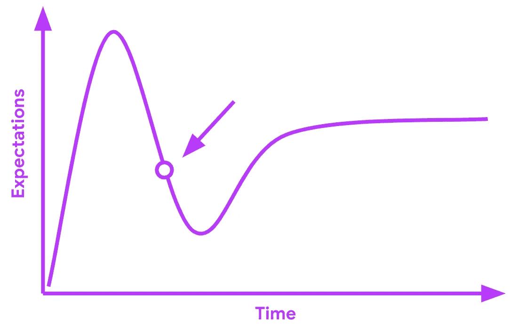
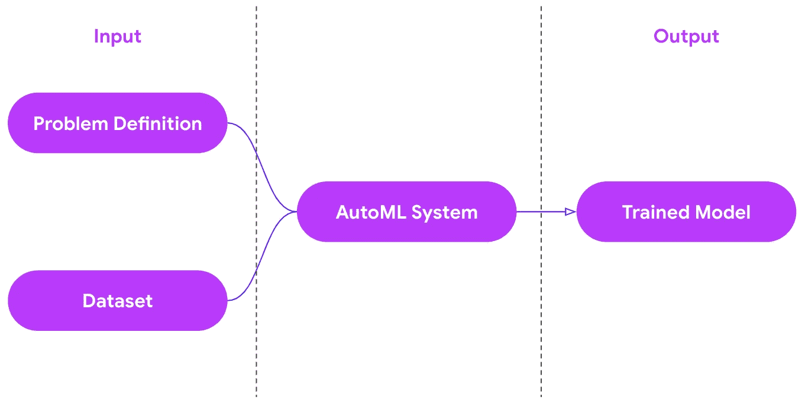

# AutoML 的困境

> 原文：[`towardsdatascience.com/the-automl-dilemma-57b217263646?source=collection_archive---------4-----------------------#2023-09-16`](https://towardsdatascience.com/the-automl-dilemma-57b217263646?source=collection_archive---------4-----------------------#2023-09-16)

## 基础设施工程师的观点

 [Haifeng Jin](https://haifengjin.com/?source=post_page-----57b217263646--------------------------------)

·

[关注](https://medium.com/m/signin?actionUrl=https%3A%2F%2Fmedium.com%2F_%2Fsubscribe%2Fuser%2F663f924902d1&operation=register&redirect=https%3A%2F%2Ftowardsdatascience.com%2Fthe-automl-dilemma-57b217263646&user=Haifeng+Jin&userId=663f924902d1&source=post_page-663f924902d1----57b217263646---------------------post_header-----------) 发表在[Towards Data Science](https://towardsdatascience.com/?source=post_page-----57b217263646--------------------------------) · 8 分钟阅读·2023 年 9 月 16 日

--

图片由[Fabrizio Conti](https://unsplash.com/@conti_photos?utm_source=medium&utm_medium=referral)拍摄，发布在[Unsplash](https://unsplash.com/?utm_source=medium&utm_medium=referral)

近年来，AutoML 一直是一个热门话题。尽管其炒作声势浩大，甚至有取代人类机器学习专家的雄心，但由于长期未见广泛应用，对 AutoML 的期望正在迅速下降，这严格遵循 Gartner 曲线。

AutoML 在 Gartner 曲线上的表现（作者提供的图像）

在此时，我们需要了解 AutoML 的现状，并找出未来的发展方向。我是一名开发了两个 AutoML 库的 软件工程师，[AutoKeras](https://autokeras.com/) 和 [KerasTuner](https://keras.io/keras_tuner/)。在这篇文章中，我将帮助你回顾 AutoML 的概念以及阻碍 AutoML 广泛应用的缺失部分。

# 什么是 AutoML？

想象一下，一个机器学习知识有限的人面临一个实际的图像分类问题。他们可以清楚地定义问题并有训练数据可用。在这种情况下，AutoML 可以帮助构建一个训练好的机器学习模型。

从输入和输出的角度来看，AutoML 做了以下工作。

从输入和输出的角度来看 AutoML（作者图片）

它接受问题定义和训练数据，并输出一个准备部署的训练好的机器学习模型。例如，如果给定一个图像分类任务，它接受训练图像数据集作为输入，并输出一个训练好的图像分类模型。

AutoML 尝试自动化的步骤可能包括数据预处理、特征工程、模型选择、超参数调整、神经架构搜索、模型训练、在测试数据上的推断和数据后处理。

总而言之，自动化机器学习（AutoML）试图**弥合**各种新颖**机器学习模型**和训练技术与它们可以解决的**实际问题**之间的差距，提供**端到端解决方案**以自动化方式进行。

# AutoML 是如何工作的？

对于给定的任务和数据集，AutoML 系统会高效地尝试一系列相关方法或模型，并为你挑选出最佳的模型。

你可以把它看作是一个包含以下步骤的 for 循环：

+   生成模型配置。

+   创建并训练具有配置的模型。

+   对验证数据评估模型。

+   从评估结果中学习以改进配置。

AutoML 系统中的智能代理生成配置，并通过学习评估结果逐步改进。

许多算法可以作为智能代理使用，例如贝叶斯优化或强化学习。然而，在智能代理的核心，它所做的主要是**函数近似**和**函数最大化**。让我们逐一了解它们。

+   **函数近似**。智能代理试图学习模型配置与模型性能之间的关系。用数学语言来说，它试图学习一个函数 **y=f(x)**，其中**x** 是模型配置，**y** 是模型的性能。

+   **函数最大化**。智能代理的最终目标是找到具有最佳模型性能的模型配置。换句话说，我们想找到**x**，使**f(x)** 的值最大化，即**argmax f(x)**。

# AutoML 的影响

正如你所想象的那样，如果 AutoML 被广泛采用，其影响将是巨大的。它可以显著提高机器学习从业者的生产力。他们不再需要花费大量时间来微调模型配置的细节。他们可能只需要仔细定义任务并手动约束搜索空间，以更快地获得结果。

## AutoML 今天能做什么？

当前 AutoML 的应用相当有限，主要集中在以下两个方面。

+   **快速尝试**。一些机器学习工程师可能希望快速尝试他们的任务和数据集上的机器学习。他们可以将 AutoML 作为起点。如果他们取得了相对良好的结果，可以进一步手动开发机器学习解决方案。

+   **机器学习教育**。刚开始学习机器学习的学生可能会使用 AutoML 来了解机器学习能做什么。他们不需要触及机器学习解决方案的所有细节，而是获得对整个过程的快速概览。

## AutoML 未来能做什么？

对于 AutoML 未来的期望远高于目前的能力。我们将其总结为三个主要目标如下。

+   **对于机器学习专家：** 提高数据科学家和机器学习工程师的生产力。

+   **对于领域专家：** 领域专家，如医疗医生或机械工程师，可以轻松地将 AutoML 应用于他们的问题。

+   **对于生产工程师：** 发现的解决方案可以轻松部署到生产环境中。

# AutoML 的问题

我们已经了解了我们现在的位置以及 AutoML 的未来发展方向。问题是我们如何达到那里。我们将今天面临的问题总结为三类。当这些问题得到解决时，AutoML 将实现广泛应用。

## 问题 1：缺乏商业激励

**建模是微不足道的**，相比于开发一个可用的机器学习解决方案，这可能包括但不限于数据收集、清洗、验证、模型部署和监控。对于任何能够负担得起雇佣人员完成所有这些步骤的公司而言，雇佣机器学习专家进行建模的成本开销是微不足道的。当他们能够在不增加太多成本开销的情况下建立一支专家团队时，他们不会费心去尝试新的技术，如 AutoML。

所以，人们只会在其他所有步骤的成本降到最低时才开始使用 AutoML。也就是当雇佣人员进行建模的成本变得显著时。现在，让我们看看我们的路线图。

**许多步骤可以自动化。** 我们应该对随着云服务的发展，开发机器学习解决方案中的许多步骤能够被自动化持乐观态度，比如数据验证、监控和服务。然而，有一个关键步骤是永远无法自动化的，那就是数据标注。除非机器能够自我学习，否则人类将始终需要为机器准备数据。

**数据标注可能会成为开发机器学习解决方案的主要成本**。如果我们能减少数据标注的成本，那么他们将有商业动机使用 AutoML 来消除建模成本，这将是开发机器学习解决方案的唯一成本。

**长期解决方案**：不幸的是，减少数据标注成本的终极解决方案今天并不存在。我们将依赖未来在“小数据学习”方面的研究突破。一种可能的途径是投资于迁移学习。

然而，人们对迁移学习不感兴趣，因为在这个主题上很难发表论文。有关更多详细信息，你可以观看这个视频，[*为什么大多数机器学习研究是无用的*](https://www.youtube.com/watch?v=Bi7f1JSSlh8)。

**短期解决方案**：在短期内，我们可以使用小数据对预训练的大模型进行微调，这是一种简单的迁移学习和小数据学习的方法。

**总而言之**，由于大多数机器学习解决方案的开发步骤已经通过云服务自动化，而 AutoML 可以使用预训练模型从较小的数据集中学习，以减少数据标注成本，企业将有商业动机应用 AutoML 来降低其机器学习建模成本。

## 问题 2：缺乏可维护性

**所有深度学习模型都不可靠**。模型的行为有时是不可预测的。很难理解模型为何给出特定的输出。

**工程师维护模型**。如今，我们需要工程师在模型出现问题时进行诊断和修复。公司与工程师沟通，处理他们想要更改的深度学习模型的任何事宜。

**AutoML 系统比工程师更难以交互**。如今，你只能将其作为一种一次性的方法来创建深度学习模型，通过提前给 AutoML 系统提供一系列明确定义的数学目标。如果在实践中遇到问题，它将无法帮助你解决。

**长期解决方案**：我们需要在 HCI（人机交互）领域进行更多研究。我们需要一种更直观的方式来定义目标，以使 AutoML 创建的模型更可靠。我们还需要更好的方法来与 AutoML 系统互动，以便在不花费过多资源重新搜索所有不同模型的情况下，更新模型以满足新需求或修复任何问题。

**短期解决方案**：支持更多的目标类型，例如 FLOPS 和参数数量，以限制模型大小和推理时间，以及加权混淆矩阵以处理不平衡数据。当模型出现问题时，人们可以向 AutoML 系统添加相关目标，以生成新模型。

## 问题 3：缺乏基础设施支持

在开发 AutoML 系统时，我们发现一些深度学习框架中需要的功能现在还不存在。没有这些功能，AutoML 系统的能力是有限的。它们总结如下。

**第一，具有灵活统一 API 的最先进模型。** 为了构建一个有效的 AutoML 系统，我们需要一个大规模的最先进模型池来组装最终解决方案。模型池需要定期更新和良好维护。此外，调用模型的 API 需要高度灵活和统一，以便我们可以从 AutoML 系统中以编程方式调用它们。它们作为构建端到端 ML 解决方案的构件。

为了解决这个问题，我们开发了 [KerasCV](https://keras.io/keras_cv/) 和 [KerasNLP](https://keras.io/keras_nlp/)，这两个基于 Keras 的领域特定库，分别用于计算机视觉和自然语言处理任务。它们将最先进的模型封装成简单、清晰且灵活的 API，满足 AutoML 系统的要求。

**第二，模型的自动硬件分配。** AutoML 系统可能需要在多台机器上的多个 GPU 之间构建和训练大型模型。AutoML 系统应能够在任何给定的计算资源上运行，这要求它动态决定如何为给定硬件分配模型（模型并行性）或训练数据（数据并行性）。

令人惊讶且不幸的是，目前没有任何深度学习框架能够自动将模型分布到多个 GPU 上。你需要明确指定每个张量的 GPU 分配。当硬件环境发生变化时，例如 GPU 数量减少，你的模型代码可能会失效。

我尚未看到对此问题的明确解决方案。我们必须给深度学习框架一些时间来发展。总有一天，模型定义代码将与张量硬件位置代码相互独立。

**第三，模型的部署简易性。** 任何由 AutoML 系统生成的模型可能需要在部署前在云服务、终端设备等下游环境中进行部署。假设你仍然需要雇佣工程师在部署之前针对特定硬件重新实现模型，而这在今天的情况下最为常见。为什么不直接让同一位工程师一开始就实现模型，而不是使用 AutoML 系统呢？

目前有人正在研究这个部署问题。例如，[Modular](https://www.modular.com/) 创建了一个统一的格式来支持所有模型，并将所有主要硬件供应商和深度学习框架集成到这种表示中。当模型使用深度学习框架实现时，可以将其导出到该格式，并在支持该格式的硬件上进行部署。

# 结论

针对我们讨论的所有问题，我对长期来看**AutoML**仍然充满信心。我相信这些问题最终会得到解决，因为自动化和效率是深度学习发展的未来。尽管**AutoML**今天尚未被广泛采用，但只要**ML**革命继续下去，它就会被广泛应用。
