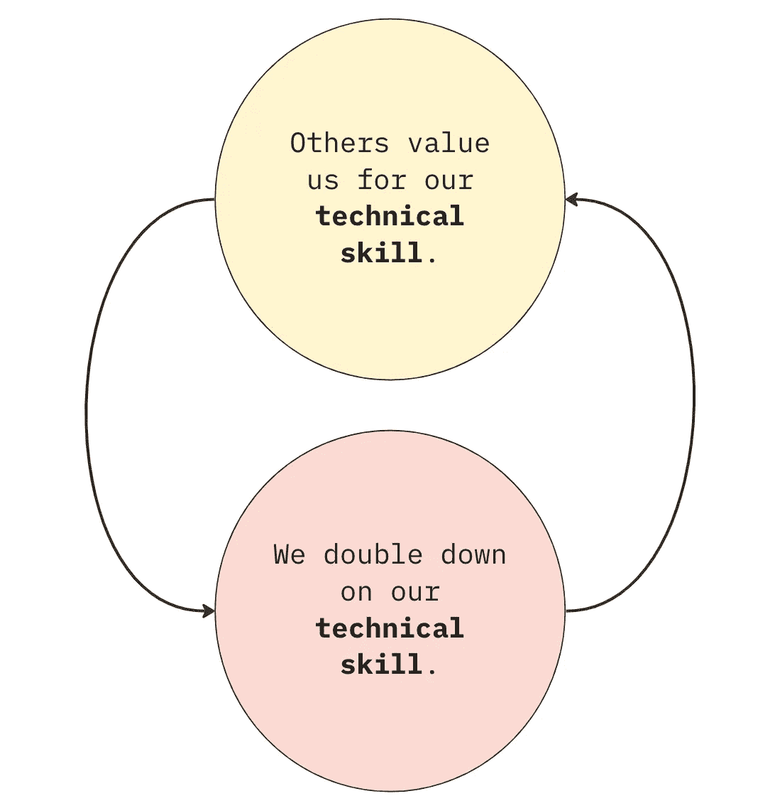

# 破坏分析的坏循环

> 原文：[`towardsdatascience.com/the-bad-loop-ruining-analytics-121791334b?source=collection_archive---------17-----------------------#2023-01-16`](https://towardsdatascience.com/the-bad-loop-ruining-analytics-121791334b?source=collection_archive---------17-----------------------#2023-01-16)

## 意见

## 对技术工作的过度重视如何对分析造成灾难性影响

 [罗伯特·易](https://ryi.medium.com/?source=post_page-----121791334b--------------------------------)

·

[关注](https://medium.com/m/signin?actionUrl=https%3A%2F%2Fmedium.com%2F_%2Fsubscribe%2Fuser%2F8ac2da8b0742&operation=register&redirect=https%3A%2F%2Ftowardsdatascience.com%2Fthe-bad-loop-ruining-analytics-121791334b&user=Robert+Yi&userId=8ac2da8b0742&source=post_page-8ac2da8b0742----121791334b---------------------post_header-----------) 发表在 [数据科学进展](https://towardsdatascience.com/?source=post_page-----121791334b--------------------------------) · 6 分钟阅读 · 2023 年 1 月 16 日 

--

图片由作者提供。

反馈循环是强大的东西。正反馈可以产生 [高度杠杆效应](https://www.youtube.com/watch?v=xbiDrzTd8fE)，而负反馈则可以 [抑制变化](https://en.wikipedia.org/wiki/Lotka%E2%80%93Volterra_equations)。此外，这些模式对干扰可能 [极其](https://en.wikipedia.org/wiki/Chernobyl_disaster) [抵抗](https://en.wikipedia.org/wiki/Cycle_of_poverty)。如果你不解决根本的驱动机制，反馈循环将继续存在。毕竟，你不能 [向太阳泼水](https://www.wtamu.edu/~cbaird/sq/2015/06/30/how-large-would-a-bucket-of-water-have-to-be-to-put-out-the-sun/#:~:text=No%20amount%20of%20water%20thrown,are%20examples%20of%20chemical%20combustion.)。

为什么总是谈论反馈循环？嗯，我怀疑有一个**负反馈循环负责分析中的所有问题**。就像其他反馈循环一样，这个循环很难打破。

我想你们都*感受*到了这种影响——我们的影响力从未像它应该的那样高。我们很少被视为思想伙伴。我们做了出色的技术工作，但几乎没有引起重要人士的关注。当然，我们在制定战略决策时有一席之地，但仅仅是作为 SQL 技术员。而且这不是因为没有尝试。我们构建了自助服务系统，我们举行了办公时间，我们创建了复杂的课程以提升我们的同行，但这些举措从未带来持久的变化。

那么这个循环是什么？其实很简单：**我们所做的一切都过度强调技术工作，设定了我们只做技术工作的期望**。我们对扩大影响力的最佳努力因此被削弱。接下来，我将讨论这个循环，证明它的普遍性，并最终分享我为什么认为工具在解决这个问题上至关重要。

*像往常一样，如果你在寻找偏见，我是* [*Hyperquery*](https://hyperquery.ai/?utm_source=medium&utm_medium=organic-content&utm_campaign=2023-01-13-bad-loop-medium)*的首席产品官，我们正在押注于更好的工具如何解决这种问题，但我会保持客观——我保证。*

# 核心的坏反馈循环

初看起来，似乎有不少不同的反馈循环把我们困在这片无人区。我将介绍其中的一些，以便与你们产生一些共鸣，但我稍后会辩称它们都源于相同的根本反馈循环。但首先，让我们来看看这些常见的破碎模式：

+   **“分析就是关于*速度*”**。过去几年里，这一直是关于分析的一个[常见](https://benn.substack.com/p/method-for-measuring-analytical-work)的[叙述](https://hbr.org/2018/12/what-great-data-analysts-do-and-why-every-organization-needs-them)。但是，如果你主要通过工作速度来衡量价值，你就得变得更快，这意味着减少解释时间，考虑业务影响。你的工作范围缩小，迫使你进入一个[反应性支持角色](https://www.winwithdata.io/p/the-analyst-isnt-your-bitch)。

+   **仪表盘过度使用**。每当我们制作新的仪表盘时，一方面，我们为业务其他部分提供了更大的自助服务能力。但如果我们过于依赖仪表盘作为主要的沟通媒介，我们就在延续一种*数据显而易见*的神话——即我们不需要解释。显然，我们需要制作仪表盘，但我们*过于频繁*地默认使用它们。我们本能地将利益相关者指向仪表盘，而不是理解他们的问题。他们在错误的方式上变得更有权力，他们对我们价值的逐渐狭隘理解将我们固定在数据策展的角色中。

+   **我们跳跃到查询的速度太快**。我们都做过这种事：你在与高管开会时，为了提供快速的价值，你开始进行[少数派报告](https://www.youtube.com/watch?v=33Raqx9sFbo)，进行现场编码。这种做法有其时机和场合，但我们过于急于采取这种方法，而应该*思考*——从我们已经进行的大量实验和深入研究中总结和提炼。我们未能提供*杠杆*价值，而是寻求对我们炫目的（确实无与伦比！）技术能力的认可。这静静地成为了别人对我们期望的价值。

+   **我们的工具过于技术化**。我们的工具是钉在棺材上的最后一根钉子。它们是为技术工作而设计的，以牺牲简单、清晰的传递为代价，提供这些功能。技术能力被置于所有事物之上。我们当然喜欢这样。这迎合了我们每个人心中[渴望成为黑客](https://www.winwithdata.io/p/the-sql-ide-should-die)的心理。但你的 SQL 查询和笔记本传达了你应该避免的那种[简化表现](https://www.winwithdata.io/p/the-sql-ide-should-die)——它们是以代码为先的，所以你被视作以代码为先。我们尝试通过在更易分享的工具中撰写工作来打破这种局面，但我们对自己规则的遵守往往较低。毕竟，[为什么要使用大量工具，当少量工具就能搞定](https://www.youtube.com/watch?v=_K-L9uhsBLM)？

常见的线索开始浮现。行业叙事、数十年的商业智能文化、我们的工具，甚至是我们自身的傲慢，都将我们推向一个我们的价值被降级为拉取数据的世界。而谴责我们的基本反馈循环是：**我们通过技术技能来展示和评价自己，因此他人也通过技术技能来评价我们**。

图片来自作者。

就这样。*这就是*压迫我们的病理现象。其实很简单：我们渴望影响力，却在追求一种被视作交易技能的卓越表现——我们的 SQL 技能。我们渴望在数据之外有所影响，但我们的目光却只盯着数据。这可能是我们至今仍未证明[分析主管](https://benn.substack.com/p/the-missing-analytics-executive)价值的原因。或者为什么你还会看到分析总监为其他高管编写 SQL。或者为什么我们的工作是被动的，不管我们做什么似乎都无法摆脱这种循环。

技术工作当然是分析中的必要部分。你不能在没有提取和分析数据的情况下分享见解。我不是说我们应该*停止*——这显然是不可能的。但我们倾向于过度关注工作中的技术方面，以至于忘记了分析不仅仅是一个技术领域。分析是通过数据提供价值。“通过数据”部分确实是技术性的。然而，[“提供价值”并不是](https://www.winwithdata.io/p/alignment-pedantry)。而后者才是真正产生杠杆效应的地方。

# 工具问题：你不能没有 YouTube 成为 YouTube 明星。

说到这些，我想引起大家对这一因果计算中一个被低估的杠杆的关注：**我们的工具**。我通常不认为工具是*至关重要*的。人员和过程是任何成功数据项目的命脉。打破我们技术困境的首要基础要求是[思维方式的转变](https://wrongbutuseful.substack.com/p/elbows-of-data)。

但有时工具确实*至关重要*。毕竟，你不能没有 YouTube 成为 YouTube 明星。而且我们无法忽视的是，我们的影响力受到可用工具的限制。我们的工具——IDE、Jupyter notebook、BI 工具——在很大程度上是技术性的（意料之中）。就像我们一样，我们的工具也专注于**创造**，而在这个过程中让我们陷入坏的循环。

我的主要论点是：正确的工具可以打破不良循环。例如，正确的工具可以打破我上面列出的循环：

+   **打破“速度”循环：** 我们的工具不应赋予我们更快地提取和分析数据的能力。它们应当赋予我们将上下文添加到工作中，并同样轻松快速地传递*知识*而非*数据*。

+   **打破仪表板过度使用的循环：** 我们的工具应该推动我们分享可以与上下文并置的可视化，而不是推动我们创建更多的仪表板。

+   **推动对齐，而不是垃圾搜索：** 促使我们朝着对齐和影响的方向前进，而不是首先进行查询。*文字应该始终是首位，因为业务目标应该始终是首位。* SQL 或 Python 可以在之后跟进。

+   **根本上不是以创造为先，而是以影响为先。** 我们需要专注于核心：文字的传递和解释。因此，基本的原始要求应该是文字及其相关的生态系统。

我们需要一个能推动我们超越技术工作的工具——一个基于我们价值不仅来自于我们推送的代码，而是来自于我们创造的见解的信念的工具。我们正经历一个[亨利·福特时刻](https://www.winwithdata.io/p/the-sql-ide-should-die/comment/11447297)，我们需要停止对更快马匹的渴望。最终，我们需要一个新颖的界面，能够让我们轻松地制作出提升我们的分析，而不是更多让我们更深入技术领域的工具。虽然我不能确定它会是什么样子，但我有我的[怀疑](https://hyperquery.ai/?utm_source=internal-blog&utm_medium=organic-content&utm_campaign=2023-01-13-bad-loop-medium)，显然现在正是变革的时机。

# 最后的评论

反应性、帮助台分析、被忽视的建议——这些问题指向一个*系统性*问题：我们陷入了一个负反馈循环中。再多的水也无法扑灭这场火。是时候积极对抗我们被[极客诱惑](https://xkcd.com/356/)的倾向，并在此过程中认真重新考虑我们的工具。
