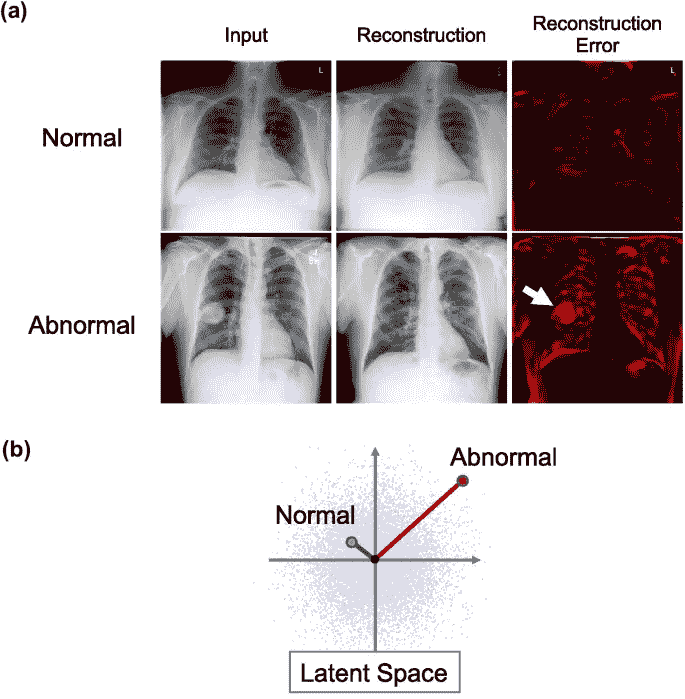
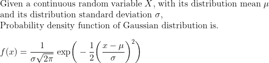
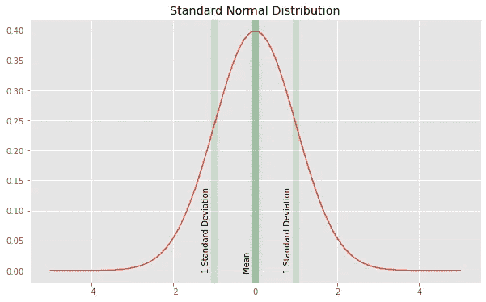
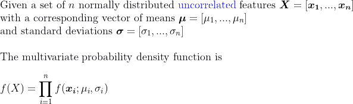
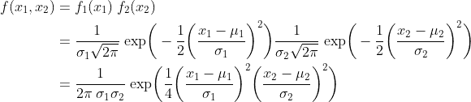
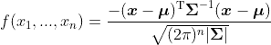
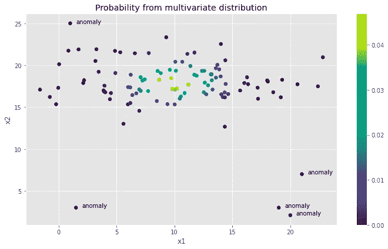
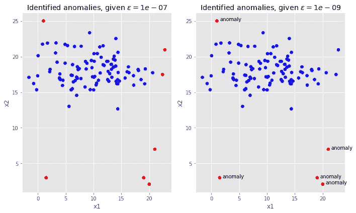
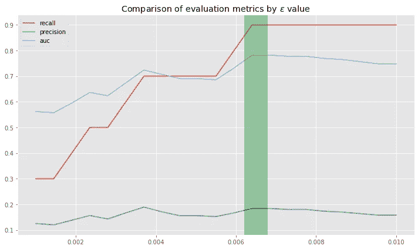
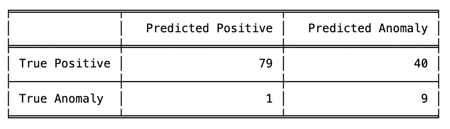

# 多变量高斯分布下的异常检测基础

> 原文：[`towardsdatascience.com/the-basics-of-anomaly-detection-65aff59949b7?source=collection_archive---------2-----------------------#2023-07-05`](https://towardsdatascience.com/the-basics-of-anomaly-detection-65aff59949b7?source=collection_archive---------2-----------------------#2023-07-05)

## 异常检测概述、多变量高斯分布的回顾以及在 Python 中实现基本异常检测算法的两个示例

 [Viyaleta Apgar](https://viyaleta.medium.com/?source=post_page-----65aff59949b7--------------------------------)

·

[关注](https://medium.com/m/signin?actionUrl=https%3A%2F%2Fmedium.com%2F_%2Fsubscribe%2Fuser%2Fccae8864d5a4&operation=register&redirect=https%3A%2F%2Ftowardsdatascience.com%2Fthe-basics-of-anomaly-detection-65aff59949b7&user=Viyaleta+Apgar&userId=ccae8864d5a4&source=post_page-ccae8864d5a4----65aff59949b7---------------------post_header-----------) 发表在 [Towards Data Science](https://towardsdatascience.com/?source=post_page-----65aff59949b7--------------------------------) · 11 min read · 2023 年 7 月 5 日

--

我们与生俱来的模式识别能力使我们能够在填补空白或预测未来事件时运用这一技能。然而，有时会发生不符合我们期望的情况，超出了我们对模式的认知。这些情况被称为异常。如果我们尝试预测某些事物，我们可能希望将异常数据排除在训练数据之外。或者我们可能希望识别异常以改善我们的生活。在这两种情况下，异常检测技术都能在大多数行业和学科领域中发挥作用。

本文将引导你了解异常检测的基础知识以及统计异常检测模型的实现。

# 什么是异常检测？

一般而言，异常检测是指识别异常现象的过程。异常检测的目标是识别那些与我们的期望不符的事件、发生情况、数据点或结果。因此，实施异常检测的关键是理解预期事件的基本模式。如果我们知道预期的模式，我们可以用它来映射前所未见的数据点；如果我们的映射不成功，而我们的新数据点落在预期模式之外，那么很可能我们发现了异常。

通常有三种类型的异常情况。第一种类型包括相对于整个数据集被认为异常的单独实例（例如，一辆汽车在高速公路上以非常低的速度行驶，相比于所有高速公路交通，这种情况被认为是异常的）。第二种类型包括在特定背景下的异常实例（例如，相比于所有信用卡交易，看似正常的信用卡交易在特定个人的消费模式中却是异常的）。第三种异常类型是集体性的——即使每个实例本身都符合一定的期望，一组实例也可能被认为是异常的（例如，一次单独的欺诈性信用卡交易在亚马逊上可能不显得特别，但在短时间内连续发生的一组交易则很可疑）[1]。

异常检测技术分为三类：

1.  **监督检测**需要数据集中有正标签和异常标签。可以应用诸如神经网络或提升森林等监督学习算法，将数据点分类为预期类别/异常类别。不幸的是，异常数据集往往非常不平衡，通常没有足够的训练样本来使上采样或下采样技术帮助监督学习。

1.  **半监督检测**处理部分标记的数据。半监督技术假设输入数据仅包含正实例，并且输入数据遵循预期模式。这些技术试图学习正案例的分布，以便能够生成正实例。在测试过程中，算法将评估异常实例可能是由模型生成的概率，并使用这一概率来预测异常情况。[2]

1.  **无监督检测**使用完全未标记的数据来创建期望的边界，任何落在此边界之外的都被认为是异常的。

异常检测技术可以应用于任何数据，数据格式会影响哪个算法最为有效。数据类型包括 **序列**（时间序列、链表、语言、声音）、**表格**（例如，发动机传感器数据）、**图像**（例如，X 光图像）和 **图**（例如，工作流或过程）。

胸部 X 光图像中的异常检测示例 [[4]](https://doi.org/10.1007/s10278-020-00413-2)

由于问题和技术的多样性，异常检测实际上是数据科学的一个广泛领域，应用范围广泛。其应用包括：欺诈检测、网络安全应用、销售或交易数据分析、稀有疾病识别、制造过程监控、外星行星搜索、机器学习预处理等。因此，获得强大且高效的算法有可能在许多领域产生重大影响。

让我们看看可以用来检测异常的最基本算法。

# 用于异常检测的高斯分布

基本的异常检测技术之一利用高斯（即正态）分布的力量来识别异常值。

高斯分布由卡尔·弗里德里希·高斯发现，它建模了许多自然现象，因此是建模数据集特征的热门选择。该分布的概率密度函数是一个以算术平均数为中心的钟形曲线，曲线的宽度由数据集的方差定义。大多数情况都在中心附近，概率密度函数的两端有两个拉长的尾部。实例越稀有——距离中心越远——它成为异常值的可能性就越大。 Eureka!——我们可以利用这个概念来建模数据集中的异常。

概率密度函数，定义为 f(x)，测量数据集中某个结果 x 的概率。正式地，

假设我们的数据集只有一个特征，并且该特征遵循正态分布，那么我们可以使用上述的 f(x) 来建模我们的异常检测算法。然后我们可以设置一个阈值 epsilon 来决定一个情况是否异常。Epsilon 应根据启发式方法设置，其值将依赖于使用场景和对异常的敏感度。

描述正态分布的图 [[5]](https://github.com/viyaleta/Anomaly-Detection/blob/main/Examples/1%20Anomaly%20Detection%20with%20Guassian%20Distribution.ipynb)

在正态分布中，2.5% 的实例发生在均值下方两个标准差处。因此，如果我们将阈值设置为 0.054，那么在我们的数据集中，大约 2.5% 的事件将被分类为异常（均值下方两个标准差的 CDF 为 2.5，而 -2 的 PDF 为 0.054）。较低的阈值将导致分类的异常更少，而较高的阈值则敏感度较低。

在实际应用中，可能会存在一个权衡，因为一些正例可能会低于阈值，而一些异常值可能会隐藏在阈值之上。理解使用案例并测试不同的 epsilon 值是必要的，然后确定最适合的值。

单特征的例子很简单——如果我们有多个特征怎么办？如果我们的特征完全独立，我们实际上可以取特征概率密度函数的乘积来分类异常。

对于两个不相关特征的情况，这变成

本质上，特征概率的乘积可以确保如果至少有一个特征存在异常值，我们可以检测到异常（假设我们的 epsilon 足够高）；如果我们的实例在多个特征中表现出异常值，我们的概率将更小（因为我们的总概率值是各个分数的乘积），从而更有可能将一个值识别为异常。

然而，*我们不能假设我们的特征是独立的*。这就是多变量概率密度函数发挥作用的地方。在多变量情况下，我们构建一个协方差矩阵（用 Σ 表示）以捕捉特征之间的关系。然后，我们可以利用协方差矩阵来避免“重复计算”特征关系（这是一种非常初步的表述实际发生的情况）。多变量分布概率密度函数的公式如下，[这些来自杜克大学的幻灯片](https://www2.stat.duke.edu/courses/Spring12/sta104.1/Lectures/Lec22.pdf)很好地推导了这个公式。

在这里，x 是一个输入向量，μ 是特征均值的向量，Σ 是特征之间的协方差矩阵。

为了简化我们的工作，我们可以使用 scipy 库来实现这个函数：scipy.stats.multivariate_normal 以特征均值和标准差向量作为输入，并且具有一个 .pdf 方法用于根据一组点返回概率密度。

让我们在实际示例中尝试这个实现。

# 两特征模型在 Python 中的实现

首先，让我们观察一个具有两个特征的示例，这将使我们能够在欧几里得空间中可视化异常点。对于这个示例，我生成了两个特征，分别从正态分布中抽取了 100 个样本（这些是正样本）。我计算了特征均值和标准差，并利用 scipy.stats 库中的分布信息拟合了一个多变量正态模型。**值得注意的是：**我仅用正样本拟合了我的模型。在实际数据中，我们需要清理数据集，以确保特征符合正态分布，并且没有异常值或奇异值——这将提高模型定位异常的能力（尤其是有助于确保特征的正态分布要求）。最后，我向数据集中添加了 5 个异常样本，并使用 .pdf 方法报告概率。

下图的散点图展示了结果：x1 特征绘制在 x 轴上，x2 特征绘制在 y 轴上，异常点已标注，颜色表示来自多变量概率密度函数的概率。

展示正样本和异常点的散点图 [[5]](https://github.com/viyaleta/Anomaly-Detection/blob/main/Examples/1%20Anomaly%20Detection%20with%20Guassian%20Distribution.ipynb)

一旦我们将阈值设置得*足够低*，我们将能够区分异常值和期望值。下面的两个图表比较了 1x10^-7 和 1x10^-9 的 epsilon 值。1x10^-9 的 epsilon 值往往能更好地捕捉我们预期的异常值，而 1x10^-7 则将一些正样本识别为异常值。

在较高和较低 epsilon 值下识别的异常点的散点图比较 [[5]](https://github.com/viyaleta/Anomaly-Detection/blob/main/Examples/1%20Anomaly%20Detection%20with%20Guassian%20Distribution.ipynb)

在这个示例中，很容易识别出 epsilon，因为我们可以直观地描绘和识别异常点并分析结果。让我们看看在具有更多特征的示例中情况如何变化。

# 使用 Python 实现多变量模型

在这个示例中，我将使用 [葡萄酒数据集](http://odds.cs.stonybrook.edu/wine-dataset/) 来自 ODDS 库 [3]。该数据集包含 13 个数值特征和 129 个实例。特征捕捉了有关葡萄酒的信息，原始数据集用于基于葡萄酒分析的分类任务。为了进行异常检测，将目标类别中的一个类进行了下采样，并作为异常点呈现。总共有 10 个异常点，129 个实例中约有 8%。我们处理的是一个相当干净的数据集，没有缺失值。

我们首先必须确保我们的特征符合高斯分布。尽可能的话，我们应当去除异常值，并使用归一化策略对分布进行归一化。在这个数据集中，4 个特征已经符合正态分布（酒精、灰分、灰分的碱度和非黄酮酚）而 4 个特征可以通过取对数来进行归一化（总酚、前花青素、颜色强度和色调）。虽然对剩余特征存在更好的策略，但为了这个练习的目的，我仅仅从我们的训练数据集中删除了它们。最后，我通过排除所有包含至少一个特征值超出或低于均值 2 个标准差的行来去除异常值。其余代码与上述示例相同。

与上节中的两个特征示例不同，现在不再可行在二维平面上可视化结果，但我们可以使用混淆矩阵指标（包括召回率和精确度）以及 ROC 曲线下面积来帮助我们找到适用于用例的正确 epsilon。

由于通常存在精确度与召回率之间的权衡，epsilon 的设置取决于我们用例的敏感度要求。在这个例子中，我寻找一个可以最大化曲线下面积的 epsilon 值。一些用例可能要求尽可能多地找到异常（以包括正值为代价），而其他用例可能只在绝对确定的情况下检测异常（以遗漏一些异常为代价）。我为几个不同的 epsilon 值计算了评估指标。

按 epsilon 值的评估指标线图比较 [[5]](https://github.com/viyaleta/Anomaly-Detection/blob/main/Examples/1%20Anomaly%20Detection%20with%20Guassian%20Distribution.ipynb)

随着 epsilon 的增加，召回率提高。尽管在提出的 epsilon 值范围内精确度相对较低，但通常在 0.0035 和 0.0065 左右达到峰值。AUC 尝试在精确度和召回率之间取得平衡，并在 0.0065 附近达到峰值。让我们来看看混淆矩阵。

描述混淆矩阵的表格 [[5]](https://github.com/viyaleta/Anomaly-Detection/blob/main/Examples/1%20Anomaly%20Detection%20with%20Guassian%20Distribution.ipynb)

我们的模型在发现所有异常点方面表现相当出色，只漏掉了一个。考虑到我排除了三分之一的特征，这个结果非常棒。不幸的是，我们的模型还将 40 个正实例标记为异常，这意味着如果我们使用这个模型进行异常检测，我们必须手动检查一半的正实例，以确认它们是否确实异常。

为了改进该模型，我们可以进一步工程化剩余特征，并找到可能对异常值稍微不那么敏感的 epsilon 值。这个问题的其余部分是简单的，留给读者作为练习（iykyk）。你可以在[这里找到源代码](https://github.com/viyaleta/Anomaly-Detection/blob/main/Examples/1%20Anomaly%20Detection%20with%20Guassian%20Distribution.ipynb)。

# 高斯异常检测的潜在缺陷

多变量高斯分布是异常检测的一个很好的模型——它简单、快速且易于执行。然而，它的缺点可能会阻碍它在众多使用案例中的应用。

**第一**，多变量分布可能产生相当低的概率密度值。通常，这对现代计算机来说不是问题。但有时这些值可能会低到计算机无法有效处理的程度。

**第二**，我们必须确保我们的特征遵循正态分布。如果投入时间和精力进行适当的特征工程和数据处理，这可能不会是一个大问题，但投入的努力是有风险的，因为我们无法在工作完成之前知道回报。

**第三**，该模型无法处理分类特征。如果我们的数据集中包含分类特征，我们必须为每种分类特征的组合创建一个单独的模型（这可能会成为一项繁重的工作）。

**最后**，该模型假设所有特征具有同等重要性，并且特征之间没有复杂的关系。处理此问题的一种选择是从头开始实现多变量分布概率密度函数，并包括一些参数来帮助处理特征重要性。为了处理特征关系问题，我们可以进行进一步的特征工程，创建新特征，但这个过程可能会很困难、耗时且有风险（就回报而言）。

尽管如此，使用多变量高斯分布进行异常检测是解决表格数据异常检测问题的一个很好的第一步。它可以用于设定基准，或作为捕捉数据集中异常的完美工具，并为我们提供了一种直观理解异常检测的方法。

感谢阅读！在不久的将来，我希望能做一个关于异常检测的完整系列，如果你对这个话题感兴趣，请继续关注。

## 来源：

1.  [`www.kaggle.com/code/matheusfacure/semi-supervised-anomaly-detection-survey`](https://www.kaggle.com/code/matheusfacure/semi-supervised-anomaly-detection-survey)

1.  [`ai.googleblog.com/2023/02/unsupervised-and-semi-supervised.html`](https://ai.googleblog.com/2023/02/unsupervised-and-semi-supervised.html)

1.  Saket Sathe 和 Charu C. Aggarwal。 [LODES: Local Density meets Spectral Outlier Detection.](http://saketsathe.net/papers/lodes.pdf) SIAM 数据挖掘会议，2016 年。

1.  Nakao, T., Hanaoka, S., Nomura, Y. *等*。《胸部放射图中的无监督深度异常检测》。*J Digit Imaging* **34**，418–427（2021）。 [`doi.org/10.1007/s10278-020-00413-2`](https://doi.org/10.1007/s10278-020-00413-2)

1.  [`github.com/viyaleta/Anomaly-Detection/blob/main/Examples/1%20Anomaly%20Detection%20with%20Guassian%20Distribution.ipynb`](https://github.com/viyaleta/Anomaly-Detection/blob/main/Examples/1%20Anomaly%20Detection%20with%20Guassian%20Distribution.ipynb)

数学排版由 [Codecogs 在线 LaTeX 编辑器](https://latex.codecogs.com/eqneditor/editor.php) 提供。

带有示例的 Jupyter Notebook [可以在这里找到](https://github.com/viyaleta/Anomaly-Detection/blob/main/Examples/1%20Anomaly%20Detection%20with%20Guassian%20Distribution.ipynb)。
