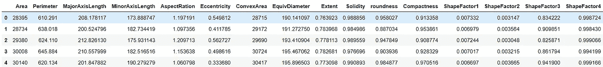
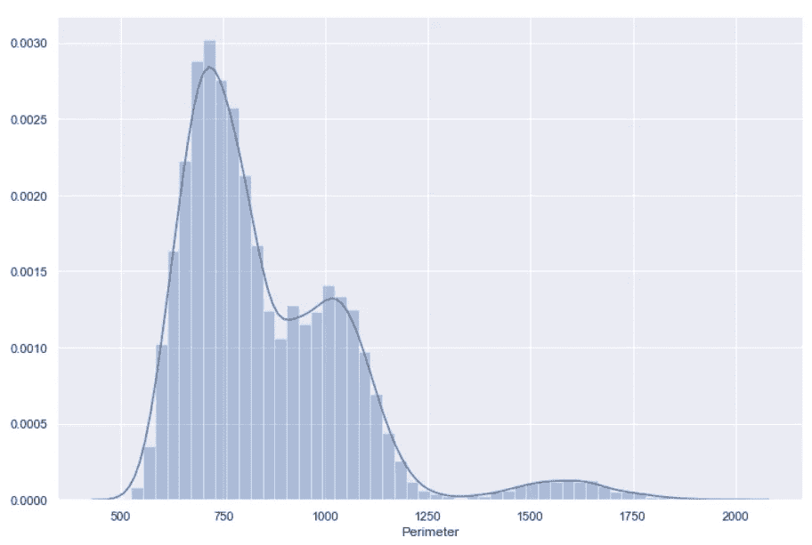
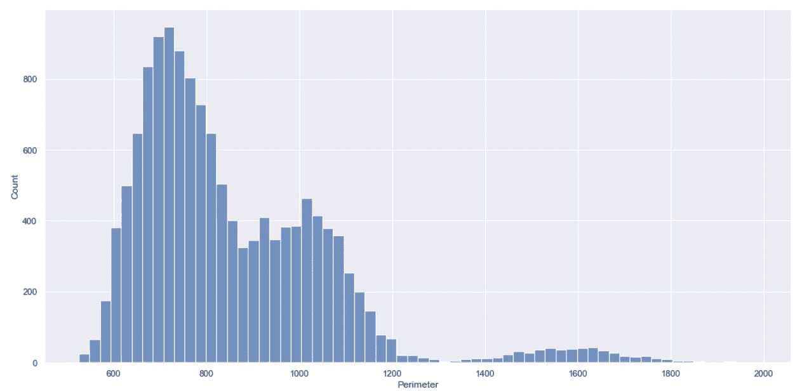
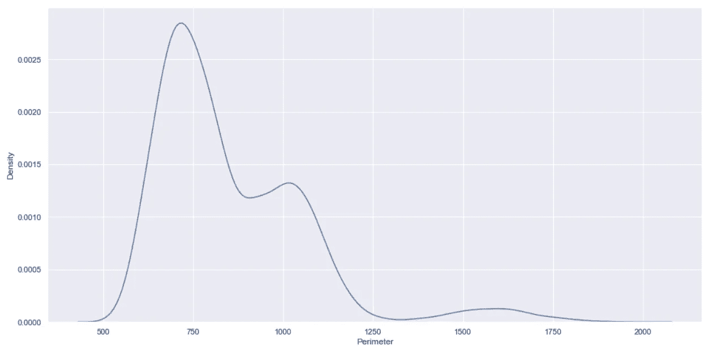
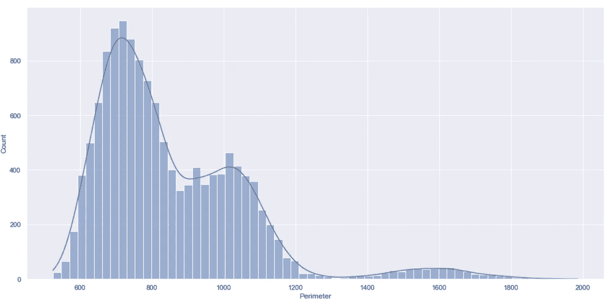
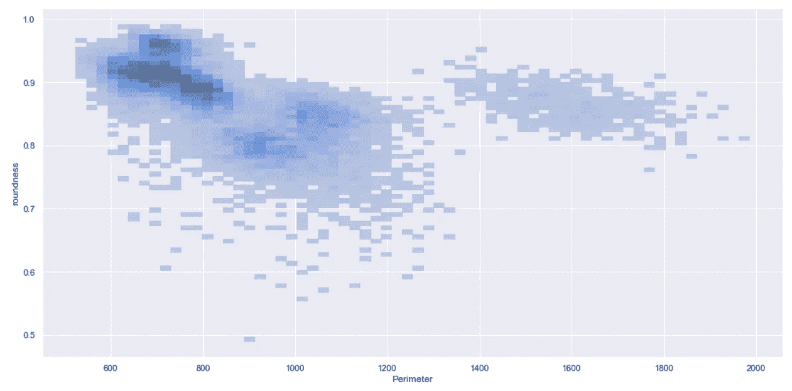
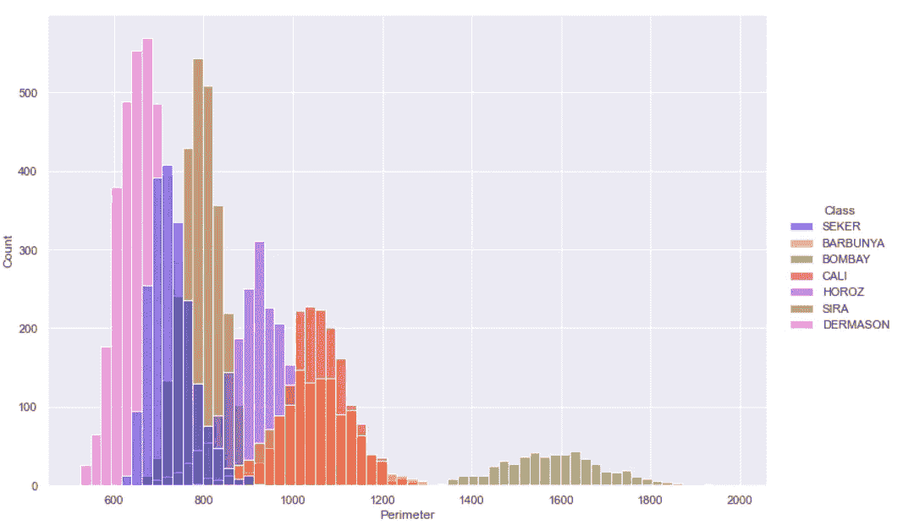
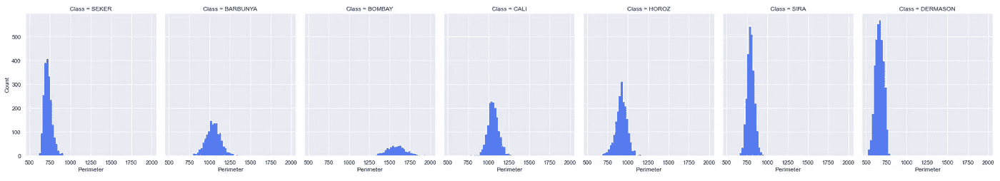

# 1 最佳替代 Seaborn Distplot 的 Python 库

> 原文：[`towardsdatascience.com/the-best-alternative-to-seaborn-distplot-in-python-ea95391e6d29`](https://towardsdatascience.com/the-best-alternative-to-seaborn-distplot-in-python-ea95391e6d29)

## 数据科学

## Seaborn Distplot 已被弃用——让我们探索它的替代品

[](https://medium.com/@17.rsuraj?source=post_page-----ea95391e6d29--------------------------------)[](https://towardsdatascience.com/?source=post_page-----ea95391e6d29--------------------------------) [Suraj Gurav](https://medium.com/@17.rsuraj?source=post_page-----ea95391e6d29--------------------------------)

·发表于 [Towards Data Science](https://towardsdatascience.com/?source=post_page-----ea95391e6d29--------------------------------) ·8 分钟阅读·2023 年 6 月 14 日

--


图片来源：[Bon Vivant](https://unsplash.com/fr/@bonvivant?utm_source=unsplash&utm_medium=referral&utm_content=creditCopyText) 于 [Unsplash](https://unsplash.com/photos/FcS257Cw9es?utm_source=unsplash&utm_medium=referral&utm_content=creditCopyText)

Seaborn 是 Python 中一个著名的数据可视化库。

由于它建立在 matplotlib 之上，并且与 pandas 数据结构完美兼容，因此在 Python 中处理数据时非常方便，因为它将数据转化为有洞察力的可视化图表。它有助于专注于所需的信息并更快地掌握结果。

然而，每个库都会随着时间的推移而发展，Seaborn 也是如此。

当我在项目中使用 Seaborn 创建分布图时，遇到了函数弃用的警告，如下所示。


图片来源：作者

所以，我开始寻找替代品，并今天分享我的发现。

在这篇简短的文章中，你将了解为什么 Seaborn 弃用了出色的函数`distplot()`，目前的最佳替代方案是什么，以及如何使用它创建与`distplot()`相同的图表。

这里是内容的预览——

***·*** ***Seaborn 中的 Distplot*** ***·*** ***为什么 Seaborn Distplot 被弃用？*** ***·*** ***Seaborn Distplot()的替代方案有哪些？*** ***∘*** ***Seaborn 中的 displot()*** ***·*** ***displot()在 seaborn 中的使用场景*** ***∘*** ***双变量分布*** ***∘*** ***数据子集的图表***

我选择了令人惊叹的例子来使这篇文章有趣，并使用了来自 UCI 机器学习库的 Dry Beans 数据集，该数据集在 CC BY 4.0 许可下提供。



Dry Beans 数据集 | 图片来源：作者

让我们深入了解吧！

在查看替代方案之前，首先了解一下 `distplot()` 函数及其用途。

# Seaborn 中的 Distplot

`Distplot()` 是 Seaborn 库中的一个多功能函数，广泛用于单变量数据分析。它帮助你在同一可视化中创建直方图和核密度估计（KDE）图。

> 什么是单变量数据分析？

它用于一次探索单个变量的特征和分布，而不考虑其与数据集中其他变量的关系。

回到 `distplot()`，它由直方图和 KDE 图组成。

`Distplot()` 中的直方图显示了落入不同桶（即箱）的数据点的频率或计数。

整个数据点序列或列表被分箱成不同大小的桶。可视化图形只是一个条形图，其中 X 轴通常是桶或箱，Y 轴表示桶中的数据点数量。

这样的图有助于你了解数据如何在数值范围内分布。

而 KDE 图则通过分析基础概率分布函数来帮助你可视化变量的分布。简单来说，它帮助你理解在不同的桶或箱中观察数据点的可能性。

使用 KDE 图，你可以了解数据分布的形状、峰值及其扩展范围。

例如，我们可以对“Perimeter”这一列使用 `distplot()` 函数。

```py
import pandas as pd
import seaborn as sns

df = pd.read_excel("Dry_Bean_Dataset.xlsx")

sns.distplot(df["Perimeter"])
```



Seaborn distplot() | 作者提供的图片

如上图所示，条形图表示直方图，而平滑的线条表示 KDE 图。

正如我提到的，`distplot()` 在已经创建的直方图上创建了一个 KDE 图，这就是为什么在 Y 轴上你可以看到概率密度值的原因。

**不要混淆概率与概率密度！**

你需要将概率密度乘以曲线下的面积，以从每个概率密度值中获得概率。

这样的 KDE 值只能用于不同桶之间的相对比较。

现在，让我们理解一下为什么将来不应该使用它。

# 为什么 Seaborn 的 Distplot 被废弃了？

`Distplot()` 是 Seaborn 库中最早添加的几个函数之一，因此其函数定义与后续添加的其他函数有显著不同。

这是根据 [Seaborn 官方文档](https://seaborn.pydata.org/generated/seaborn.distplot.html) 的 `distplot()` 函数定义。

```py
seaborn.distplot(a=None, bins=None, hist=True, kde=True, rug=False,
fit=None, hist_kws=None, kde_kws=None, rug_kws=None, fit_kws=None,
color=None, vertical=False, norm_hist=False, axlabel=None, label=None,
ax=None, x=None)
```

[迈克尔·瓦斯科姆](https://gist.github.com/mwaskom) 精确地解释了——`distplot()` API 既没有用于选择 DataFrame 列的 x、y 参数，也没有条件 `hue` 映射。

所以，当 Seaborn 开发者在更新 Seaborn v0.11.0 中的分布模块时，他们发现没有比废弃 `distplot()` 更好的方法来使其与其他分布图函数保持一致。

结果是 Seaborn 的`distplot()`在 Seaborn v0.11.0 中已被弃用。

调用这个函数并不会真正阻止你创建图，但它会发出一个弃用警告，如我之前提到的。

这就是为什么我开始探索其他替代方案。

# Seaborn Distplot()的替代方案是什么？

[Seaborn 文档](https://seaborn.pydata.org/generated/seaborn.distplot.html)建议了两个替代方案——`displot()`和`histplot()`。但我个人发现`displot()`是一个多功能的解决方案。

让我展示一下与已弃用的`distplot()`相比，它有多相似或不同。

## Seaborn 中的 displot()

这是一个适用于所有类型（单变量和双变量）分布图的一站式解决方案。你需要做的就是传递一个 DataFrame 和你想查看分布的列名。

所以，要获得类似上面的分布图，你可以使用以下代码来处理‘Perimeter’列。

```py
sns.displot(df, x="Perimeter")
```



使用 seaborn displot()的直方图 | 图片作者

它简单地创建一个与已弃用的`distplot()`函数创建的直方图相同的直方图。你可以使用函数`histplot()`获取这种类型的图，它是已弃用函数的另一个替代方案。

那么 KDE 图呢？

你也可以使用`displot()`函数获取 KDE 图。这时，`**kind**`参数就会发挥作用。你可以将`**kde**`赋值给`kind`参数，以获取如下所示的 Kernel Density Estimate 图。

```py
sns.displot(df, x="Perimeter", kind='kde')
```



使用 Seaborn displot()的 KDE 图 | 图片作者

到目前为止，一切都很好！

但你可能会有一个问题——`displot()`函数如何创建一个类似于`distplot`的图，其中 KDE 绘制在直方图的顶部？

答案是——`**kde**`参数。

正如你所见，默认情况下`displot()`创建一个直方图。因此，要在直方图上方创建 KDE 图，你可以将`**kde**`参数设置为`**True**`，如下所示。

```py
sns.displot(df, x="Perimeter", kde=True)
```



Seaborn 使用 displot()的直方图和 kde 图 | 图片作者

使`displot`函数与`distplot`不同的真正原因是上面图表的 Y 轴。

在已弃用的函数`distplot()`中，Y 轴表示概率密度，而在函数`displot()`中，Y 轴表示计数，即每个箱子的数据显示点数量。

Y 轴上的计数可以直接帮助你理解哪个箱子或值的范围包含最多/最少的数据点，而这在概率密度情况下并非如此。

好吧，`displot()`函数的灵活性不仅仅止于此。让我展示一下你可以用这个函数做什么，这在`distplot()`中是比较困难的。

# seaborn 中 displot()的使用案例

函数`displot()`具有大量的参数，你可以调整这些参数来创建各种图形。

```py
seaborn.displot(data=None, *, x=None, y=None, hue=None, row=None, col=None, 
                weights=None, kind='hist', rug=False, rug_kws=None,
                log_scale=None, legend=True, palette=None, hue_order=None,
                hue_norm=None, color=None, col_wrap=None, row_order=None,
                col_order=None, height=5, aspect=1, facet_kws=None, **kwargs)
```

你可以在上述定义中看到，`kind` 参数默认设置为 `‘hist’`，这解释了为什么 `displot()` 在未指定 `kind` 参数时创建直方图。

我不会详细讲解这些参数，但我必须提到一些有趣的参数。

## 双变量分布

`displot()` 函数能够从 DataFrame 获取输入以及从该 DataFrame 中获取 X-Y 轴变量，使其在你想获得双变量分布，即两个变量的分布时非常有用。

例如，假设你想获取当考虑两个变量 Perimeter 和圆度时的数据点分布。你只需在 X 和 Y 参数中提到这些变量名称，如下所示。

```py
sns.displot(df, x="Perimeter", y="roundness")
```



使用 Seaborn displot() 的双变量分布 | 图片作者

上述图表清楚地呈现出最大的数据点数量集中在 Perimeter 在 600 到 800 之间且圆度大于 0.85 的暗色区域。

这样你可以为所有数值列获得这种类型的双变量分布。

那么，分类列呢？

在数据集中，你可以看到有一个分类列 — Class，它表示不同的豆类。你可以使用这个变量来创建数据的子集，这些子集可以通过 `displot` 轻松绘制。

## 数据子集的图表

使用 `displot()` 函数时，你无需单独创建 DataFrame 的子集。你只需使用 `**hue**` 参数来为数据的每个子集创建直方图或 KDE 图。

让我们看看它的实际效果 —

```py
sns.displot(df, x="Perimeter", hue='Class')
```



使用 Seaborn displot() 创建数据子集的直方图 | 图片作者

这就是你如何为数据的每个子集查看不同直方图的方法。

如果你希望在不同的子图上获取这些不同的直方图，那么你应该使用 `col` 参数，而不是 `hue` 参数，如下所示。

```py
sns.displot(df, x="Perimeter", col='Class')
```



使用 Seaborn displot() 的子图 | 图片作者

这样，`displot()` 将根据你的不同子集创建相应数量的子图。

你可以根据项目需要探索 `displot()` 中的其他参数。

希望你觉得这篇文章有用。每个数据分析库随着时间的发展而不断演变。因此，一些函数会被弃用，取而代之的是改进后的函数，它们提供更好、更简单的用户体验。

尽管 Seaborn 中的 `distplot()` 已被弃用，但它并没有完全退出市场。你仍然可以使用它，但最好切换到更好的函数—`displot`，以获得不同的分布图。

> 有兴趣阅读更多在 Medium 上的故事吗？

💡 考虑 [**成为 Medium 会员**](https://medium.com/@17.rsuraj/membership) **以无限访问** Medium 上的故事和每日有趣的 Medium 通讯。我将获得你费用的一小部分，但对你没有额外费用。

💡 一定要[**注册并加入 100+其他人**](https://medium.com/@17.rsuraj/subscribe)，以便不再错过关于数据科学指南、技巧和最佳实践的文章，包括 SQL 和 Python。

感谢阅读！

数据集：[干豆数据集](https://archive.ics.uci.edu/dataset/602/dry+bean+dataset)

引用：Dry Bean Dataset. (2020). UCI 机器学习库。 [`doi.org/10.24432/C50S4B`](https://doi.org/10.24432/C50S4B)。

许可证：[CC BY 4.0](https://creativecommons.org/licenses/by/4.0/legalcode)
