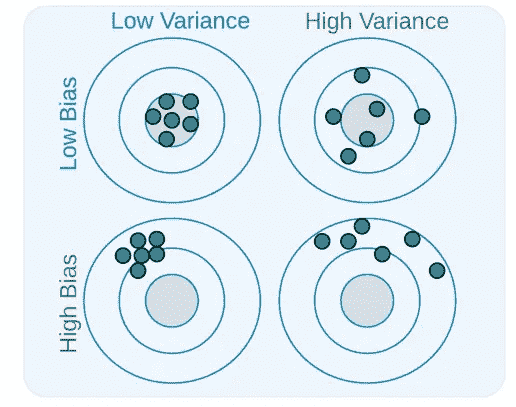
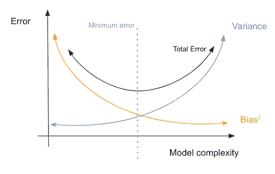
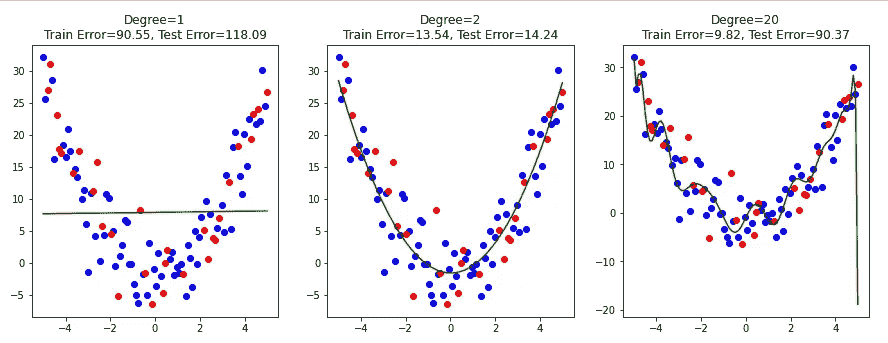

# 偏差-方差权衡

> 原文：[`towardsdatascience.com/the-bias-variance-tradeoff-cf18d3ec54f9?source=collection_archive---------6-----------------------#2023-02-23`](https://towardsdatascience.com/the-bias-variance-tradeoff-cf18d3ec54f9?source=collection_archive---------6-----------------------#2023-02-23)

## *理解这一著名概念及其对机器学习模型的影响*

 [Alexandre Rosseto Lemos](https://alexandrerossetolemos.medium.com/?source=post_page-----cf18d3ec54f9--------------------------------)

·

[查看](https://medium.com/m/signin?actionUrl=https%3A%2F%2Fmedium.com%2F_%2Fsubscribe%2Fuser%2Fde43cc058e79&operation=register&redirect=https%3A%2F%2Ftowardsdatascience.com%2Fthe-bias-variance-tradeoff-cf18d3ec54f9&user=Alexandre+Rosseto+Lemos&userId=de43cc058e79&source=post_page-de43cc058e79----cf18d3ec54f9---------------------post_header-----------) 发表在 [数据科学的前沿](https://towardsdatascience.com/?source=post_page-----cf18d3ec54f9--------------------------------) ·5 分钟阅读·2023 年 2 月 23 日

--

图片由 [Piret Ilver](https://unsplash.com/@saltsup?utm_source=medium&utm_medium=referral) 提供，来源于 [Unsplash](https://unsplash.com/?utm_source=medium&utm_medium=referral)

偏差-方差权衡是数据科学领域中的一个基础且广泛讨论的概念。理解偏差-方差权衡对于开发准确和可靠的机器学习模型至关重要，因为它可以帮助我们优化模型性能，避免如欠拟合和过拟合等常见问题。

在定义偏差-方差权衡之前，需要先分别定义偏差和方差。

# 偏差与方差

图片来源：[PEIWEN HE](https://unsplash.com/@peiwenhe?utm_source=medium&utm_medium=referral) 在 [Unsplash](https://unsplash.com/?utm_source=medium&utm_medium=referral)

## 偏差

偏差指的是通过使用简化模型来逼近实际问题而引入的错误。具有高偏差的模型无法捕捉数据的真实复杂性，容易发生欠拟合，导致在训练数据和测试数据上表现不佳。偏差通过目标变量的期望值或真实值与模型预测值之间的差异来表示。

## 方差

方差是指模型对训练数据中小的波动的敏感性引入的错误。具有高方差的模型倾向于对训练数据过拟合，从而在新的、未见过的数据上表现不佳。方差通过模型对不同训练集的预测结果的变异程度来表示。

理解偏差-方差权衡对于开发准确可靠的机器学习模型至关重要。它有助于优化模型性能并避免诸如欠拟合和过拟合等常见陷阱。通过像下图这样的靶心图来可视化偏差和方差的概念是一种有效的方法。

来源：[V. Gudivada, A. Apon & J. Ding, 2017](https://www.researchgate.net/publication/318432363_Data_Quality_Considerations_for_Big_Data_and_Machine_Learning_Going_Beyond_Data_Cleaning_and_Transformations)

图示展示了方差和偏差的关系：

+   一个具有高偏差和高方差的模型会产生大量错误，并且结果非常不一致。

+   一个具有高方差和低偏差的模型往往更准确，但结果会有很大的变动。

+   一个具有高偏差和低方差的模型会产生许多错误预测，但结果非常一致。

+   最后，一个具有低偏差和低方差的模型能做出良好的预测，并且结果一致。

从图中可以直观地看到，所有模型应该具有低偏差和低方差，因为这种组合会产生最佳结果。然而，这就是偏差-方差权衡出现的地方。

## 权衡

图片来源：[Possessed Photography](https://unsplash.com/@possessedphotography?utm_source=medium&utm_medium=referral) 在 [Unsplash](https://unsplash.com/?utm_source=medium&utm_medium=referral)

偏差-方差权衡出现的原因是增加模型的复杂性可以减少偏差，但会增加方差。另一方面，降低复杂性可以减少方差，但会增加偏差。目标是找到偏差和方差之间的最佳平衡，从而在新的、未见过的数据上实现最佳的泛化性能。

这直接与所使用模型的复杂性有关，如下图所示。

偏差-方差权衡和误差关系（图像由作者提供）

图表显示了模型复杂性如何与偏差和方差的值相关。低复杂度的模型可能过于简单，无法理解训练数据中的模式，这种现象称为***欠拟合***。因此，它在测试数据上无法做出良好的预测，导致高偏差。

另一方面，具有过多自由度的模型可能导致所谓的***过拟合***，即模型在训练数据上表现优秀，但在测试数据上的性能显著下降。这是因为模型对训练数据过于适应，丧失了泛化能力，当需要解释从未见过的数据样本时，无法得到良好的结果。

随着模型复杂性的增加，偏差减少（模型对训练数据的拟合更好），但方差增加（模型对训练数据的敏感度更高）。最佳的权衡点出现在误差最小的位置，在这种情况下，是在适中的复杂度水平。

为了帮助理解，我们来看一个实际的例子，说明偏差-方差权衡的概念。

## 例子

[Steve Johnson](https://unsplash.com/@steve_j?utm_source=medium&utm_medium=referral) 的照片，来源于 [Unsplash](https://unsplash.com/?utm_source=medium&utm_medium=referral)

为了说明偏差-方差权衡在机器学习模型中的影响，让我们看看具有不同复杂度水平的模型在相同数据集上的训练和测试表现。

对于这个例子，将生成一个输入 `X` 和输出 `y` 之间具有二次关系的随机数据集。然后，我们将数据分成训练集和测试集，并拟合三个不同度数的多项式回归模型（1、2 和 20）。我们将结果模型与训练数据和测试数据一起绘制，并计算训练集和测试集的均方误差。

结果图显示了不同多项式回归模型的偏差-方差权衡：

不同度数模型得到的结果（图像由作者提供）。

模型的度数为 1 时过于简单，具有高偏差和低方差，导致欠拟合，并在训练数据和测试数据上都出现高误差。模型的度数为 20 时过于复杂，具有低偏差和高方差，导致过拟合，在训练数据上误差低，但在测试数据上误差高。模型的度数为 2 时在偏差和方差之间有一个良好的平衡，结果是测试误差最低。

这个例子演示了找到机器学习模型的合适复杂度水平的重要性，以平衡偏差和方差，并在新的、未见过的数据上实现良好的泛化性能。

希望这篇文章能够帮助你理解偏差-方差权衡，以及在开发机器学习模型时如何考虑它。

任何评论和建议都非常欢迎。

随时通过我的 LinkedIn 联系我，并查看我的 GitHub。

[Linkedin](https://www.linkedin.com/in/alexandre-rosseto-lemos/)

[GitHub](https://github.com/alerlemos)
