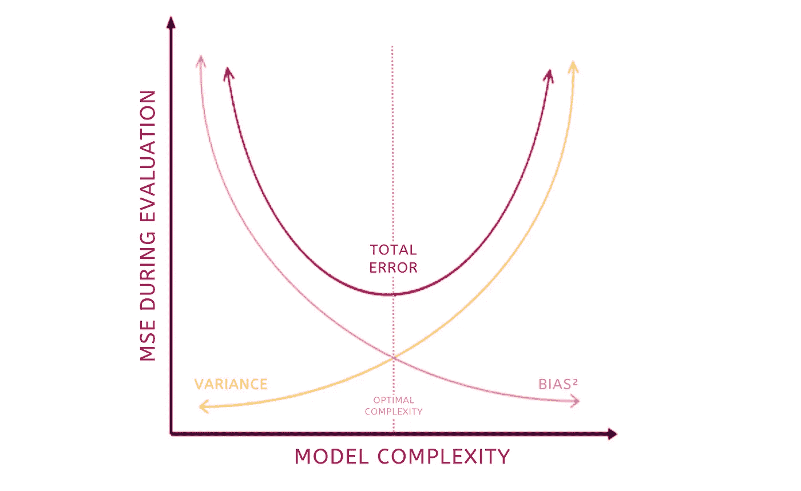
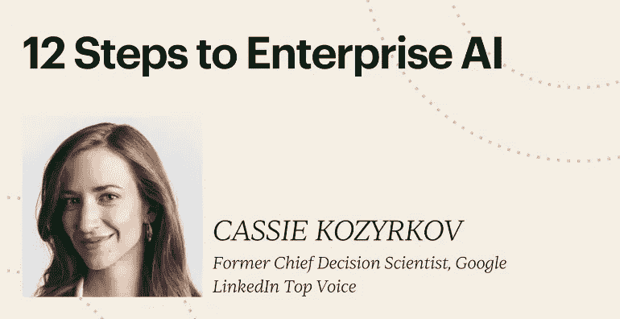

# 偏差-方差权衡，解析

> 原文：[`towardsdatascience.com/the-bias-variance-tradeoff-explained-2d1311c2b7c2`](https://towardsdatascience.com/the-bias-variance-tradeoff-explained-2d1311c2b7c2)

## 颠覆性的揭示者

## 偏差-方差权衡，第三部分，共 3 部分

 [Cassie Kozyrkov](https://kozyrkov.medium.com/?source=post_page-----2d1311c2b7c2--------------------------------)

·发布于 [Towards Data Science](https://towardsdatascience.com/?source=post_page-----2d1311c2b7c2--------------------------------) ·4 分钟阅读·2023 年 2 月 15 日

--

我们在这一系列的[第一部分](http://bit.ly/quaesita_bivar1)和[第二部分](http://bit.ly/quaesita_bivar2)中涵盖了许多内容。[第一部分](http://bit.ly/quaesita_bivar1)是开胃菜，我们讨论了理解偏差-方差权衡旅程中需要了解的一些基础知识。[第二部分](http://bit.ly/quaesita_bivar2)是我们丰盛的主菜，我们深入探讨了过拟合、欠拟合和正则化等概念。

吃蔬菜是个好主意，因此在继续之前，最好去阅读那些早期的文章，因为第三部分是甜点：你通过遵循逻辑所获得的总结。

我们的总结将一目了然。图像由作者提供。

# 偏差-方差权衡一目了然

偏差-方差权衡的核心是：

+   当你在[训练阶段](http://bit.ly/quaesita_mrbean)获得一个出色的 [模型性能评分](http://bit.ly/mfml_039)时，你不能确定你是否在[过拟合](http://bit.ly/mfml_049)或[欠拟合](http://bit.ly/mfml_050)，或者只是表现最佳。

+   训练性能和实际性能（[你关心的那个](http://bit.ly/quaesita_parrot)）并不相同。

+   训练性能是关于模型在其学习的旧数据上的表现，而你真正关心的是当你输入全新数据时，模型的表现如何。

+   当你**增加复杂性**以提高**过拟合**而不改善实际性能时，当你将模型应用于[验证集](http://bit.ly/quaesita_idiot)时会发生什么？（或者如果你像冠军一样使用[四分法](http://bit.ly/quaesita_history2)，可以应用于[调试集](http://bit.ly/mfml_062)）。你会看到标准差（方差的平方根）增长的速度超过了偏差的缩小速度。你在训练中使事情变得更好，但在整体上却变得更糟！

+   当你**减少复杂性**以提高你的**欠拟合**而不改善真实表现时，当你将模型应用到你的[验证集](http://bit.ly/quaesita_12steps)（或调试集）时会发生什么？你会看到偏差比标准差缩小得更多。你在训练中让事情变得更好，但在一般情况下变得更糟！

+   **黄金模型**就是你不能在不比标准差更多地损害偏差的情况下改善偏差，反之亦然。那就是你应该停下的地方。你已经把事情做好了！

这张图是一个卡通草图，对于挑剔的数学家来说不够通用，但它传达了要点。由作者创建。

长话短说：偏差-方差权衡是一个有用的方式来思考调整正则化[超参数](http://bit.ly/mfml_063)（这是一个复杂的词，意为*“在拟合模型之前必须选择的设置”*）。最重要的是，有办法找到复杂度的最佳点！这涉及在你改变正则化设置时观察调试数据集中的均方误差（MSE）。但如果你不打算这样做，你可能最好忘掉你刚刚读到的一切，记住这点：

> 不要试图作弊。你无法超越你的信息能买到的最佳模型。

不要试图作弊。如果你的信息不完美，那么你对任务的建模能力是有上限的。你可以在你的*训练*集上做得“更好”，但在（适当大小的）[测试集](http://bit.ly/mfml_071)或现实世界中做不到。

所以，停止认真对待训练性能结果，学会像成年人一样*验证和测试*。（我甚至为你写了一个简单的[以 Mr. Bean 为主角的解释](http://bit.ly/quaesita_mrbean)，这样你就没有借口了。）

> 如果你理解数据拆分的重要性，你可以忘掉整个讨论。

说实话，那些理解[数据拆分](http://bit.ly/quaesita_sydd)重要性的人（以及模型的真正考验是其在*未见过的数据*上的表现）大多数可以忽略这整个讨论，继续过自己的生活。

换句话说，除非你打算调整正则化模型，否则如果你的[逐步流程](http://bit.ly/mfml_12steps)在应用 ML/AI 方面是稳固的，著名的偏差-方差权衡你不需要了解太多。只需避免本指南中的[AI 白痴](http://bit.ly/quaesita_idiot)的不良行为，你就会没事的。

 ## 如何成为一个 AI 白痴

### 7 种严重搞砸你的机器学习项目的方法

towardsdatascience.com

# 感谢阅读！怎么样来个课程？

如果你在这里玩得开心，并且在寻找一个设计来取悦 AI 初学者和专家的有趣领导力课程，[这是我为你准备的小东西](https://bit.ly/funaicourse)：

课程链接：[`bit.ly/funaicourse`](https://bit.ly/funaicourse)

想要提升决策技能而不是提升你的 AI 能力？你可以通过 [这个链接](https://bit.ly/decisioncourse) 从我这里学习决策智能课程。

 [## 你生活的方向盘——决策智能视频教程 | LinkedIn Learning…

### 决策能力是你能学到的最宝贵的技能。你的人生归结为两件事：你的生活质量…

bit.ly](https://bit.ly/decisioncourse?source=post_page-----2d1311c2b7c2--------------------------------)

*附言：你有没有试过在 Medium 上多次点击拍手按钮看看会发生什么？* ❤️

# 喜欢这位作者？与 Cassie Kozyrkov 连接

让我们成为朋友吧！你可以在 [Twitter](https://twitter.com/quaesita)、[YouTube](https://www.youtube.com/channel/UCbOX--VOebPe-MMRkatFRxw)、[Substack](http://decision.substack.com) 和 [LinkedIn](https://www.linkedin.com/in/kozyrkov/) 上找到我。想让我在你的活动上发言？请使用 [这个表单](http://bit.ly/makecassietalk) 与我联系。

 [## 加入 Medium

### 阅读 Cassie Kozyrkov 的每一个故事（以及 Medium 上其他成千上万的作者的故事）。你的会员费用直接支持…

kozyrkov.medium.com](https://kozyrkov.medium.com/membership?source=post_page-----2d1311c2b7c2--------------------------------)
