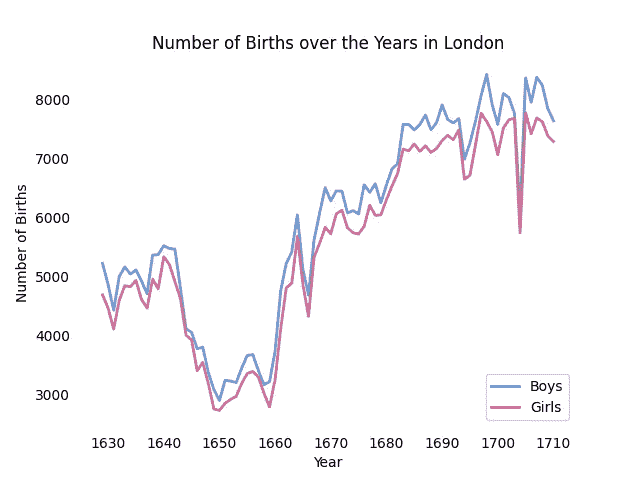
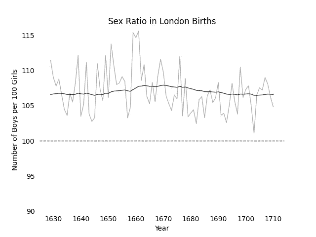
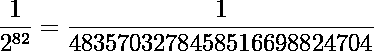
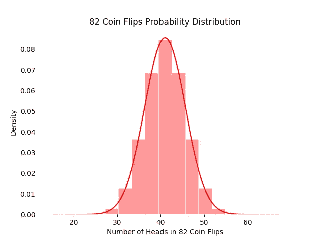
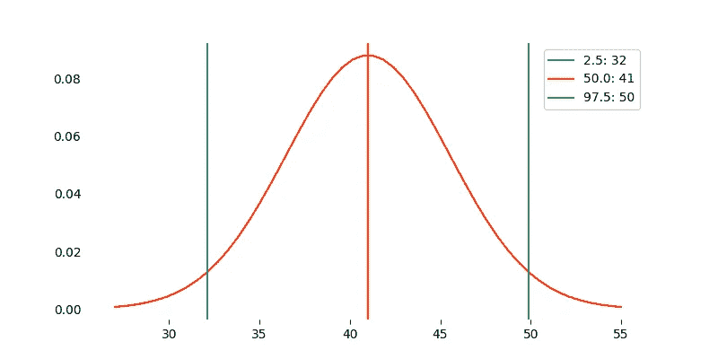
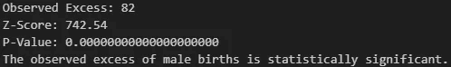

# 数据科学的诞生：历史上首次假设检验与 Python 见解

> 原文：[`towardsdatascience.com/the-birth-of-data-science-historys-first-hypothesis-test-python-insights-4745dccaf6d`](https://towardsdatascience.com/the-birth-of-data-science-historys-first-hypothesis-test-python-insights-4745dccaf6d)

## 深入了解每位数据科学家都需要掌握的 Python 驱动的见解

 [Riccardo Andreoni](https://medium.com/@riccardo.andreoni?source=post_page-----4745dccaf6d--------------------------------)

·发布于[Towards Data Science](https://towardsdatascience.com/?source=post_page-----4745dccaf6d--------------------------------) ·7 分钟阅读·2023 年 9 月 8 日

--

对图片选择感到困惑？通过阅读文章发现原因！图片来源：[pixabay.com](https://pixabay.com/photos/macaroons-pastry-sweets-colorful-1975545/).

在 18 世纪伦敦精致的氛围中，一位开创性的个体开始了一项任务，这将永远改变我们对数据和统计学的理解。[约翰·阿布斯诺特](https://en.wikipedia.org/wiki/John_Arbuthnot)，一位杰出的苏格兰医生和数学家，踏上了一段非凡的旅程，驱动他的则是对出生记录复杂性的无法抑制的好奇心。他未曾意识到，他的好奇心将为统计学的革命奠定基础。

> 男孩出生是否比女孩多？

这是 18 世纪让约翰·阿布斯诺特感兴趣的直接问题。他想了解为什么似乎出生的男婴比女婴多。他的好奇心促使他分析了多年来来自伦敦的大量出生记录。实质上，他试图弄清楚这种模式是否自然或随机，或者是否存在更深层次的解释来说明男性和女性出生数量的差异。

# 数据收集

阿布斯诺特的数据收集工作非常卓越。在 1629 年至 1710 年的几十年间，他收集了伦敦的出生数据。这些记录提供了丰富且可靠的数据来源，涵盖了相当大一部分人口。

阿布斯诺特对收集这些历史出生数据的奉献为他后来的分析奠定了基础。这些广泛的记录为他提供了调查出生性别比例趋势的机会，为他开创性的统计分析奠定了基础。

# 零假设

阿布斯诺特对出生性别比例的自然研究是他研究的核心。他假设在人口中，男性出生与女性出生的比例应该大致相等。换句话说，他认为长期来看，性别之间不应存在显著偏倚。

这一假设基于“自然”平衡男女后代数量的观点，如果这种平衡被打破，可能对物种的生存和延续产生更广泛的影响。阿布斯诺特的工作是对现代人口性别比例理解和偏离预期比例研究的先驱。

阿布斯诺特对这一自然假设的好奇心使他踏上了以数据驱动的旅程，最终完成了他著名的分析和开创性的可视化工作，我们将在本文中进一步探讨。

# 统计分析与可视化

既然我们已经深入了解了约翰·阿布斯诺特（John Arbuthnot）杰出的数据收集工作，现在让我们关注他在 18 世纪如何进行统计分析和数据可视化。我们还将探索如何使用现代 Python 模拟来重现他的工作。本文中提到的所有代码可以在我的[GitHub](https://github.com/andreoniriccardo/articles)库中自由访问：

[## GitHub - andreoniriccardo/articles

### 通过在 GitHub 上创建账户，参与 andreoniriccardo/articles 的开发。

github.com](https://github.com/andreoniriccardo/articles?source=post_page-----4745dccaf6d--------------------------------) 

作者提供的图片

阿布斯诺特的开创性贡献之一是他巧妙地使用了数据可视化。在没有现代统计软件的情况下，他创建了一个时间序列图，生动地表现了男性出生数量超过女性的年度情况。这种可视化帮助他揭示了数据中的模式和趋势。

作者提供的图片

从图表中可以看到，阿布斯诺特在水平轴上表示每一年，在垂直轴上表示每年的男性出生超出女性出生的数量。图表类似于过山车，起伏反映了出生性别比例的年度波动。

阿布斯诺特对这幅图的解释至关重要。他注意到，尽管有起伏的波动，但没有明显的长期趋势。换句话说，虽然男性和女性出生比例每年有所变化，但它似乎始终高于他认为的预期或自然的 1:1 性别比例（虚线）。这一时期的平均值为每 100 个女孩出生 107 个男孩，最高达到每 100 个女孩出生 116 个男孩。

为了更详细地理解这一点，考虑一下如果男性和女性出生数量相等，每年的过剩应为零。任何偏离零的情况都表明一种性别的过剩。

在现代背景下，我们可以使用 Python 重现阿布斯诺特的分析。通过绘制相同的数据并应用统计技术，我们可以验证他的发现，并展示今天数据可视化和分析工具的强大功能。绘制上面图表的代码如下：

# 阿布斯诺特的见解和遗产

阿布斯诺特的开创性实验标志着假设检验的诞生。除了定义自然假设的出生比例相等外，他还进行了统计假设检验，计算了我们现在称之为 p 值（使用符号检验），将其解释为统计显著性的度量，并大胆地拒绝了零假设。

他最初的假设很简单：如果零假设成立，即男性和女性出生的数量相等，那么这种明显的男性出生过剩必须不仅仅是巧合。他计算出这种情况纯属偶然的概率是极其微小的。为了说明这一点，可以考虑这个类比。我们可以将性别比例的结果等同于连续 82 次掷硬币，每次都得到正面。发生这种事件的概率极其小，82 次连续得到正面的概率为 1/2⁸²。这个极其微小的数字表明零假设——男孩和女孩的出生数量相等——是不可信的。

阿布斯诺特不仅揭示了他发现的统计不可能性，还进一步探索。他提出了一种潜在的力量在起作用，导致男性出生的过剩。他假设这种力量旨在抵消男性观察到的更高死亡率，暗示了一种“天意”的存在。这一可能的解释在[现代理论](https://en.wikipedia.org/wiki/Human_sex_ratio)中已被否定。

阿布斯诺特的研究，像任何科学努力一样，也不是没有缺陷。他的数据可能存在计数错误，而且他的分析仅限于英国国教徒的洗礼。然而，尽管存在这些局限性，他的核心发现经受住了时间的考验。今天，普遍接受的“自然”性别比例大约是每 100 个女孩出生 105 个男孩，这验证了阿布斯诺特的基本见解。

# 现代解释：Python 模拟

在本节中，我们将利用现代统计工具的能力重新审视 Arbuthnot 的假设并对其进行检验。通过 Python 模拟，我们将探讨观察到的男性出生过剩是否确实是偶然的结果，还是有更深层的原因。所有代码都可以在我的 [GitHub 仓库](https://github.com/andreoniriccardo/articles) 中找到：

[## GitHub - andreoniriccardo/articles](https://github.com/andreoniriccardo/articles?source=post_page-----4745dccaf6d--------------------------------)

### 通过在 GitHub 上创建一个账户来为 andreoniriccardo/articles 的开发做贡献。

[github.com](https://github.com/andreoniriccardo/articles?source=post_page-----4745dccaf6d--------------------------------)

如果男孩与女孩的出生比例恰好为 50:50，我们可以将这一过程看作是一次公平的掷硬币。通过几行代码，我们可以模拟掷 82 枚硬币（如同 Arbuthnot 考虑的年份数）几百万次的过程：

由于无处不在的 [中心极限定理](https://en.wikipedia.org/wiki/Central_limit_theorem)，我们可以自信地说，结果分布遵循正态分布：

作者提供的图片。

我们可以清楚地看到，如预期的那样，在 82 次掷币中，预期值为 41 次正面，获得超过 60 次正面/反面的概率是微不足道的。

我们可以进一步突出一些百分位。我选择绘制 97.5 和 2.5 百分位，因为它们代表了在显著性水平为 5% 的双尾假设检验中的接受限度。

作者提供的图片。

任何超过 50 或低于 32 的结果都被认为是统计学上显著的证据，以拒绝零假设。

最后，借助于 [scipy](https://scipy.org/) 库，我们可以进行正式的 z 检验：

输出是：

# 结论

在重新审视 John Arbuthnot 令人瞩目的 18 世纪数据分析时，我们不仅向一位统计学先驱致敬，还挖掘了现代数据科学的根源。Arbuthnot 的显著性检验照亮了假设检验和统计推断在我们解读数据底层意义中的持久重要性。未来的数据科学家们，请记住；Arbuthnot 的开创精神提醒我们，即使在过去，统计洞察也为未来铺平了道路，使数据驱动的发现继续塑造我们对世界的理解。

如果你喜欢这个故事，考虑关注我以便获得我即将发布的项目和文章的通知！

这里是我过去的一些项目：

[## 从头开始使用 Numpy 构建深度神经网络](https://towardsdatascience.com/building-a-deep-neural-network-from-scratch-using-numpy-4f28a1df157a?source=post_page-----4745dccaf6d--------------------------------)

### 利用遗传算法和 Google Maps API 探索欧洲 50 个最受欢迎城市的魅力，开启高效的旅行体验…

[## 从头开始使用 Numpy 构建深度神经网络](https://towardsdatascience.com/building-a-deep-neural-network-from-scratch-using-numpy-4f28a1df157a?source=post_page-----4745dccaf6d--------------------------------) [## 欧罗巴旅行优化：遗传算法和 Google Maps API 解决旅行推销员问题](https://towardsdatascience.com/euro-trip-optimization-genetic-algorithms-and-google-maps-python-api-solve-the-traveling-salesman-4ad8e1548207?source=post_page-----4745dccaf6d--------------------------------)

### 现代深度学习库是强大的工具，但它们可能使从业者对神经网络的…视而不见。

[## 欧罗巴旅行优化：遗传算法和 Google Maps API 解决旅行推销员问题](https://towardsdatascience.com/euro-trip-optimization-genetic-algorithms-and-google-maps-python-api-solve-the-traveling-salesman-4ad8e1548207?source=post_page-----4745dccaf6d--------------------------------)

# 参考资料

+   [Arbuthnot 的数据描述了 1629-1710 年间伦敦男性和女性的洗礼（出生）](https://www.openintro.org/data/index.php?data=arbuthnot)

+   J. Arbuthnot, ‘论神圣天意的辩护…’，《哲学学报》第 27 期（1710 年），186-190 页。

+   [统计假设检验](https://en.wikipedia.org/wiki/Statistical_hypothesis_testing)

+   [统计数据的艺术：如何从数据中学习](https://www.goodreads.com/en/book/show/43722897)
