# Decent 机器上的 Pump & Dump 浓缩咖啡配置的诞生

> 原文：[`towardsdatascience.com/the-birth-of-the-pump-dump-espresso-profile-on-the-decent-9f8a438f1151?source=collection_archive---------22-----------------------#2023-01-24`](https://towardsdatascience.com/the-birth-of-the-pump-dump-espresso-profile-on-the-decent-9f8a438f1151?source=collection_archive---------22-----------------------#2023-01-24)

## 咖啡数据科学

## 低流量的挑战

 [Robert McKeon Aloe](https://rmckeon.medium.com/?source=post_page-----9f8a438f1151--------------------------------)

·

[关注](https://medium.com/m/signin?actionUrl=https%3A%2F%2Fmedium.com%2F_%2Fsubscribe%2Fuser%2Fae592466d35f&operation=register&redirect=https%3A%2F%2Ftowardsdatascience.com%2Fthe-birth-of-the-pump-dump-espresso-profile-on-the-decent-9f8a438f1151&user=Robert+McKeon+Aloe&userId=ae592466d35f&source=post_page-ae592466d35f----9f8a438f1151---------------------post_header-----------) 发表在[Towards Data Science](https://towardsdatascience.com/?source=post_page-----9f8a438f1151--------------------------------) ·5 分钟阅读·2023 年 1 月 24 日

--

我在使用 Decent Espresso Machine 时的一个挫折是[水分配器](https://medium.com/@rmckeon/water-distribution-for-espresso-cd361bc0734)。它导致低流量、高温度情况下的萃取偏向左侧，这对 staccato 浓缩咖啡特别具有挑战性。因此，我决定改进我的配置，以便再次制作 staccato 咖啡。

# 使用过的咖啡

我不想浪费大量咖啡，所以我的调查从使用过的咖啡开始。

> 我能否将水均匀地推送到 staccato 咖啡的底层？

我用 Fellow Shimy 筛选了干的、用过的咖啡渣，并用底部 6 克细磨和顶部 13 克粗磨制作了 staccato shots。

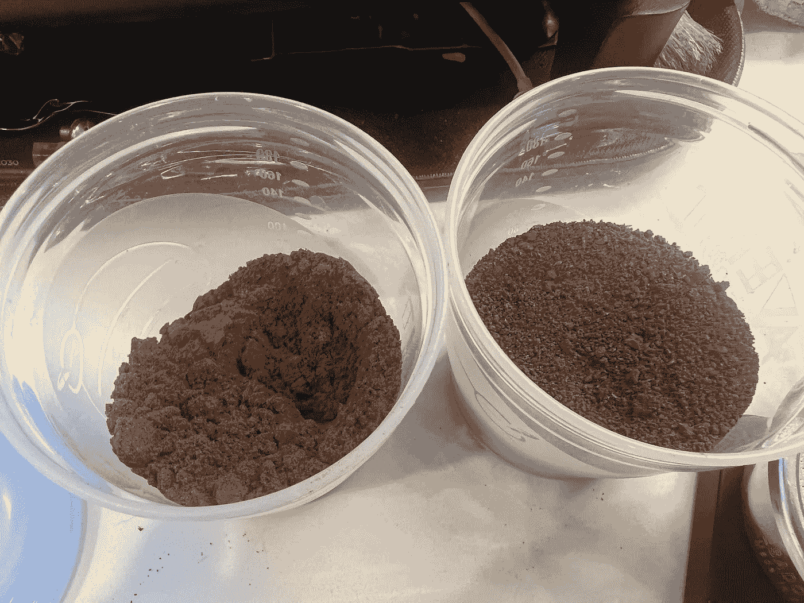

第一次测试运行了我的 Vaporexpress 配置文件 4 秒。咖啡被蒸了，但触摸时不湿。

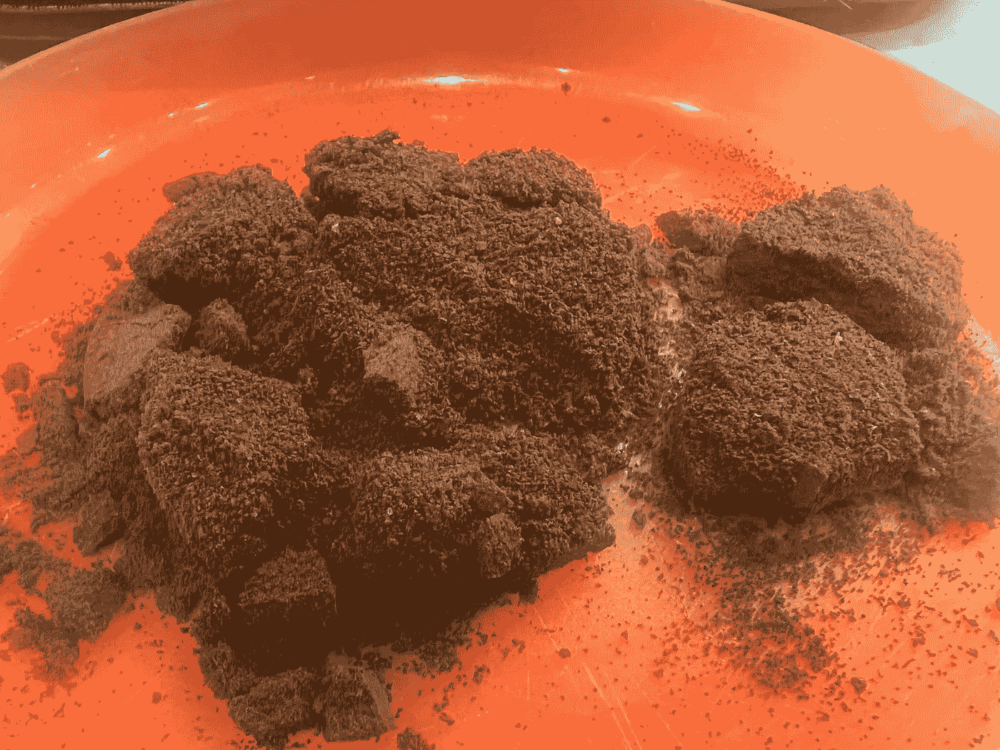

我拿着这咖啡重新制作了相同的 shot，但我运行了 9 秒。然而，它速度很快，咖啡出来时非常湿。我怀疑是因为咖啡已经被蒸过。

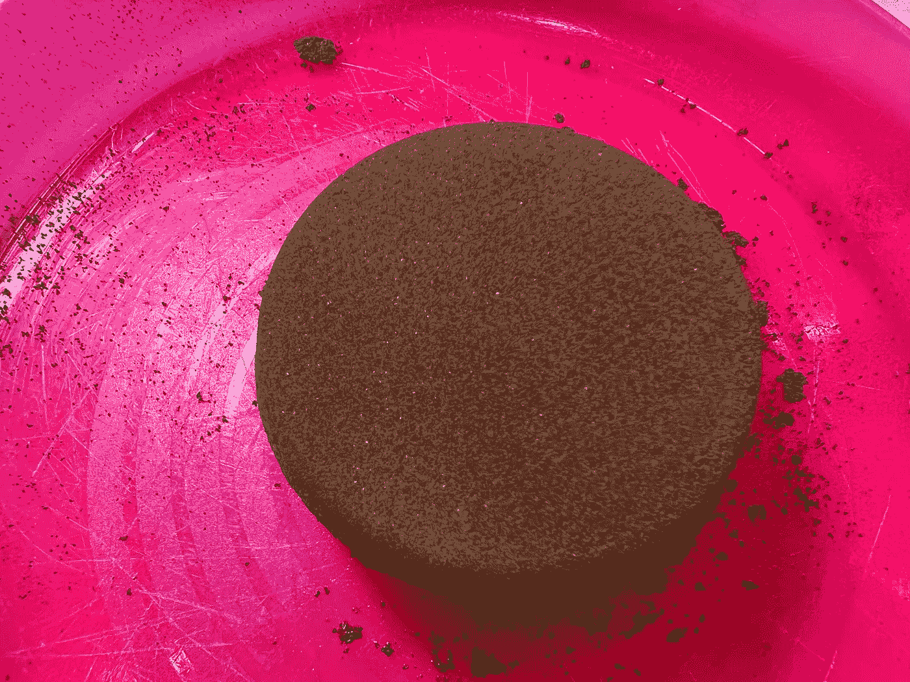

我用干的、用过的咖啡渣重新进行了 6.5 秒的测试，但结果与第一次测试相同。

我接着进行了 10 秒，但有一侧出现了通道。

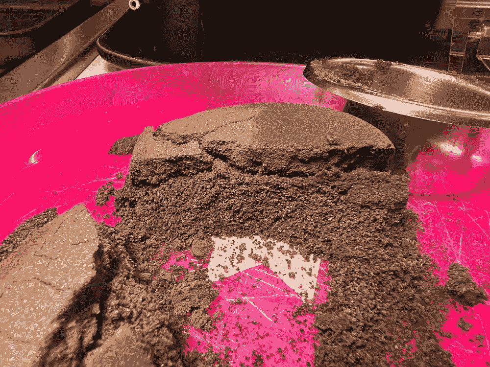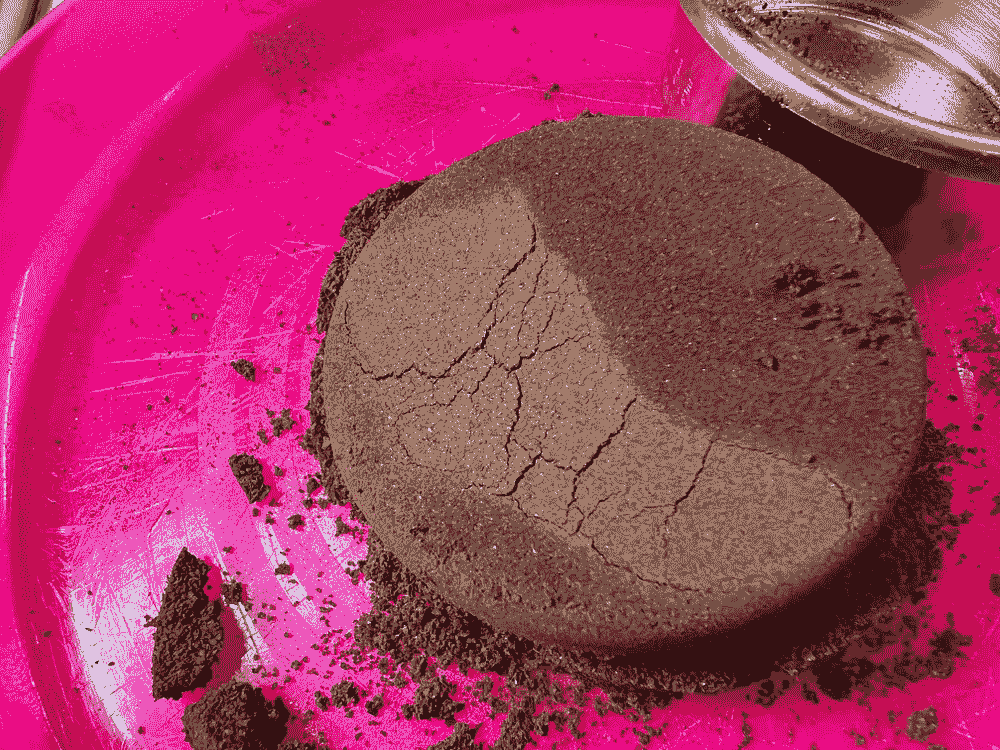

然后我尝试了一个双重双重和一些延长的预浸泡。

# 无流量

我查看了蒸汽 PI 然后没有流量（0 ml/s 流量）。我考虑将其作为脉冲动作进行。结果很有趣，似乎更均匀。

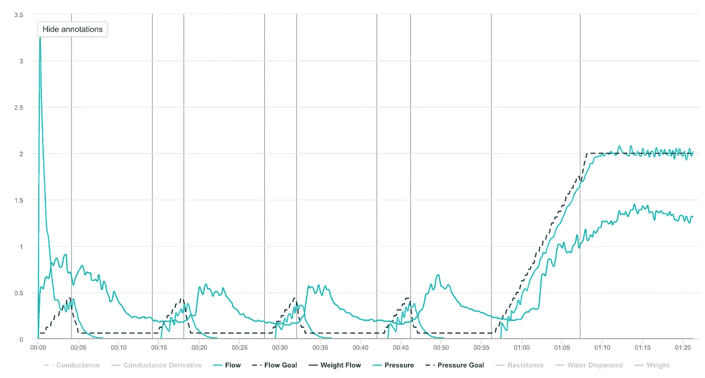

压力没有下降，我询问了 DE Diaspora。我被告知尝试将压力设置为 0 bar，这样可以排出水。

我用真正的咖啡迭代了几次，并将排水时间缩短至 5 秒。我不知道在蒸汽预浸泡期间的最佳泵送和排水次数。

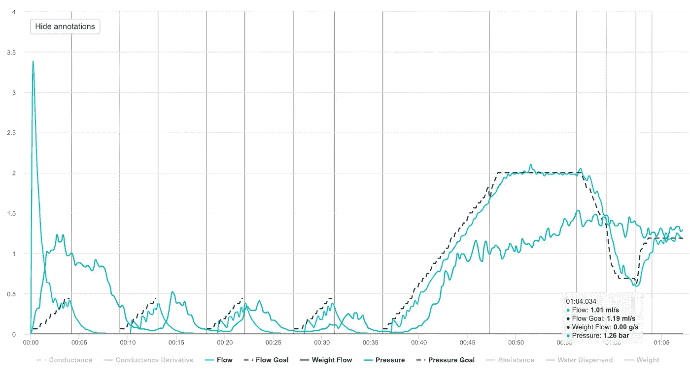

然后我将结束的斜坡改为两个斜坡，中间有一个排水。

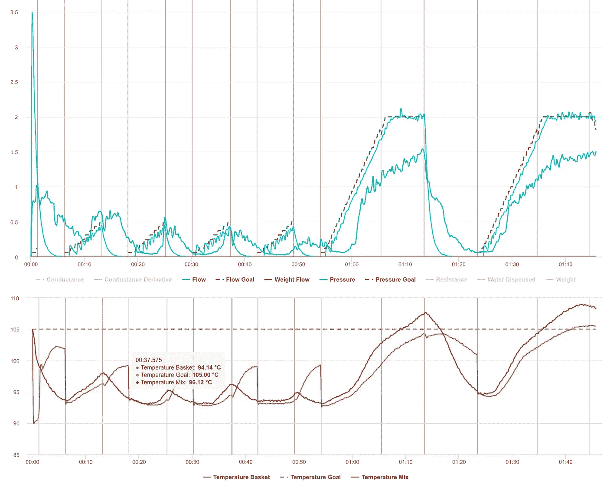

我还明确测量了废水，以了解用了多少水。我惊讶地发现水的 TDS 只有 0.05%，这意味着废水中咖啡含量非常少。

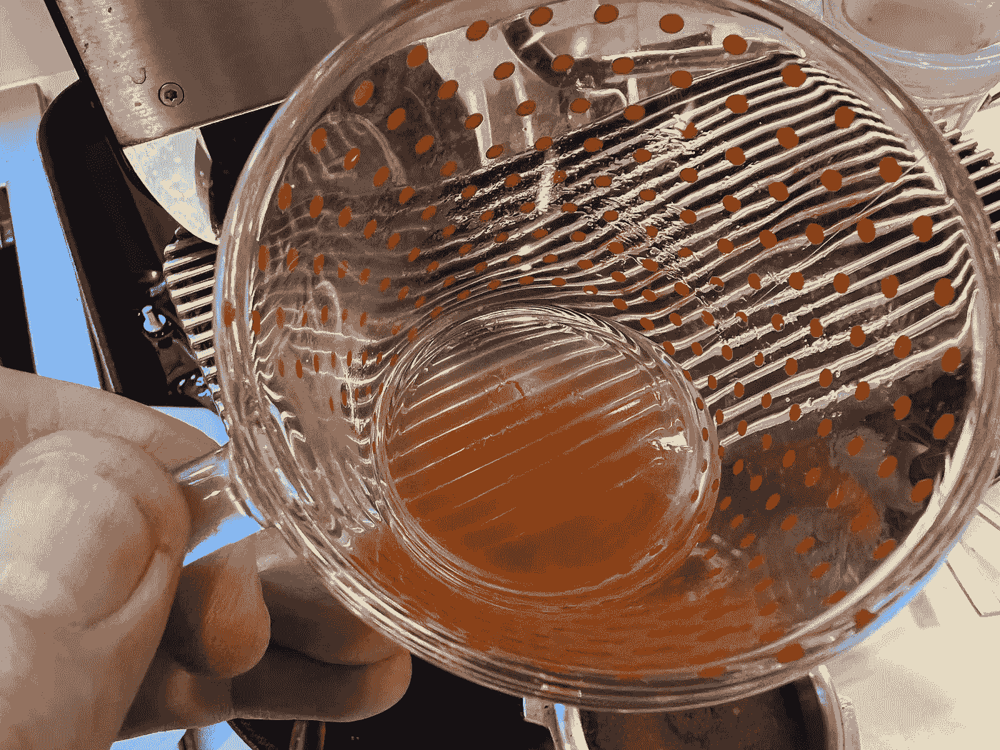

我使用了 DE 的输入估算和这些测量数据来估算因蒸汽损失了多少水。

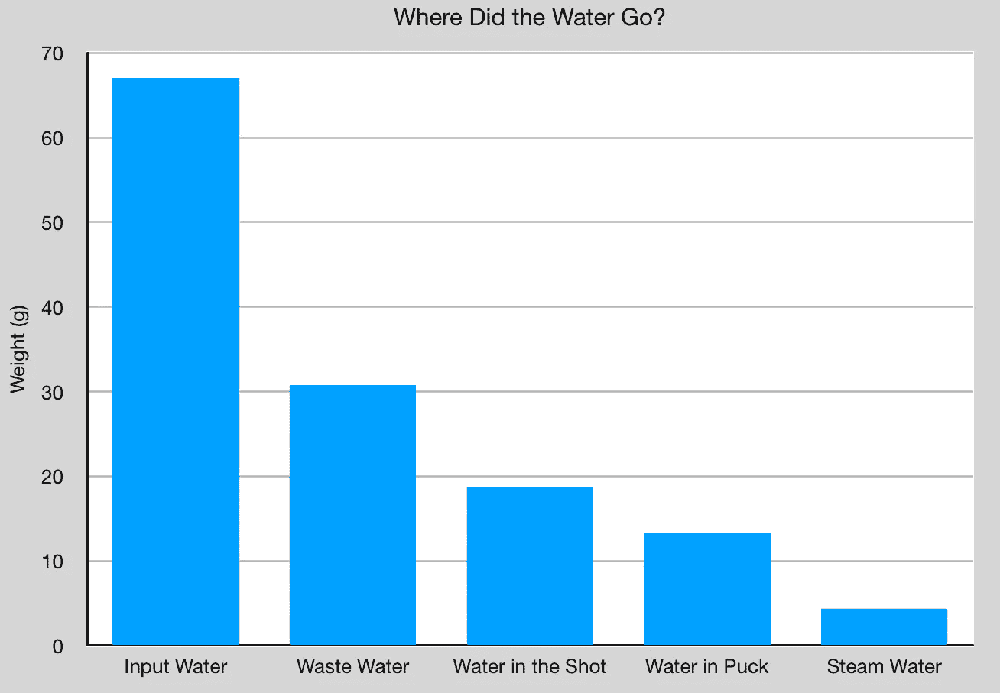

# 设备/技术

浓缩咖啡机: 优质浓缩咖啡机

咖啡研磨机: [Niche Zero](https://youtu.be/2F_0bPW7ZPw)

咖啡: [自家烘焙咖啡](https://rmckeon.medium.com/coffee-roasting-splash-page-780b0c3242ea), 中度（第一次爆裂+1 分钟）

备料: Staccato 压实

[过滤篮](https://rmckeon.medium.com/espresso-baskets-and-related-topics-splash-page-ff10f690a738): Wafo Classic

其他设备: Atago TDS 计, Acaia Pyxis 秤

# 性能指标

我使用了两组指标来评估技术之间的差异：最终评分和咖啡提取。

[**最终评分**](https://towardsdatascience.com/@rmckeon/coffee-data-sheet-d95fd241e7f6)是基于 7 个指标（Sharp、Rich、Syrup、Sweet、Sour、Bitter 和 Aftertaste）的评分卡的平均值。这些评分当然是主观的，但它们是根据我的口味进行校准的，并帮助我改进我的咖啡制作。这些评分有一些变化。我的目标是每个指标的一致性，但有时颗粒度很难把握。

**溶解固体总量（TDS）**是使用折射计测量的，这个数字与咖啡的输出重量和输入重量结合，用于确定杯中提取的咖啡百分比，称为**提取率（EY）**。

**强度半径（IR）**被定义为 TDS 与 EY 的控制图上原点的半径，因此 IR = sqrt( TDS² + EY²)。这个指标有助于在输出产量或冲泡比例之间标准化咖啡制作表现。

# 可行性数据

在这些拍摄中，味道有了显著的提升，TDS/EY/IR 也有所改进。这一档案还需要更多的工作，但这些结果给了我很大的希望。

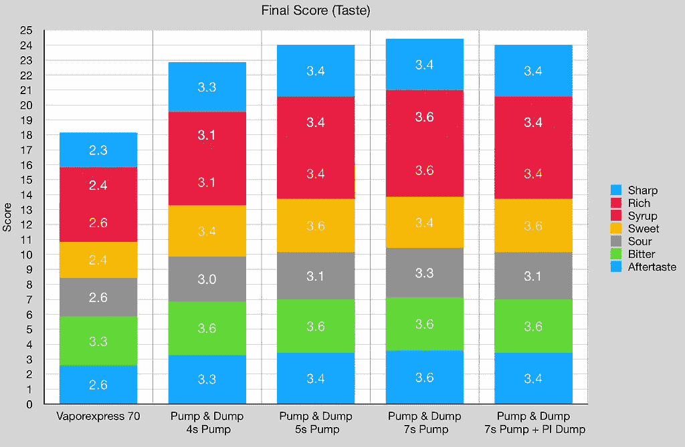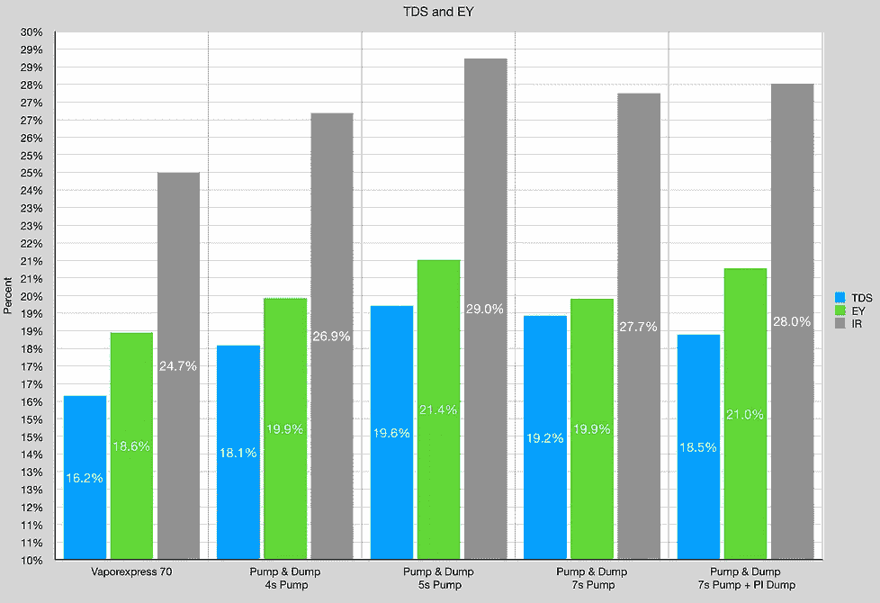

# 理论

我对蒸汽的理论是，蒸汽将可溶物推向咖啡饼底部。因此，当咖啡饼顶部的水排出时，水中几乎没有可溶物。由于蒸汽的作用，可溶物会卡在咖啡饼的更深处。这就是为什么多次泵与倾倒不会将可溶物从咖啡中去除到废水中的原因。

我完全意识到这个档案看起来非常疯狂，特别是因为它与典型的 9 bar 浓缩咖啡非常不同。这个档案的压力甚至没有达到 2 bar，但提取效率简直疯狂。这个档案让我对达到 Kim Express 的表现甚至更高的表现充满希望。

> 未来充满希望，泵与倾倒！

如果你愿意，可以关注我的 [Twitter](https://mobile.twitter.com/espressofun)、[YouTube](https://m.youtube.com/channel/UClgcmAtBMTmVVGANjtntXTw) 和 [Instagram](https://www.instagram.com/espressofun/)，我会在这些平台上发布不同机器的意式浓缩咖啡制作视频和咖啡相关的内容。你也可以在 [LinkedIn](https://www.linkedin.com/in/dr-robert-mckeon-aloe-01581595) 找到我。你还可以关注我的 [Medium](https://towardsdatascience.com/@rmckeon/follow) 和 [订阅](https://rmckeon.medium.com/subscribe)。

# [我的进一步阅读](https://rmckeon.medium.com/story-collection-splash-page-e15025710347)：

[我的书](https://www.kickstarter.com/projects/espressofun/engineering-better-espresso-data-driven-coffee)

[我的链接](https://rmckeon.medium.com/my-links-5de9eb69c26b)

[浓缩咖啡文章合集](https://rmckeon.medium.com/a-collection-of-espresso-articles-de8a3abf9917?postPublishedType=repub)

[工作和学校故事合集](https://rmckeon.medium.com/a-collection-of-work-and-school-stories-6b7ca5a58318)
