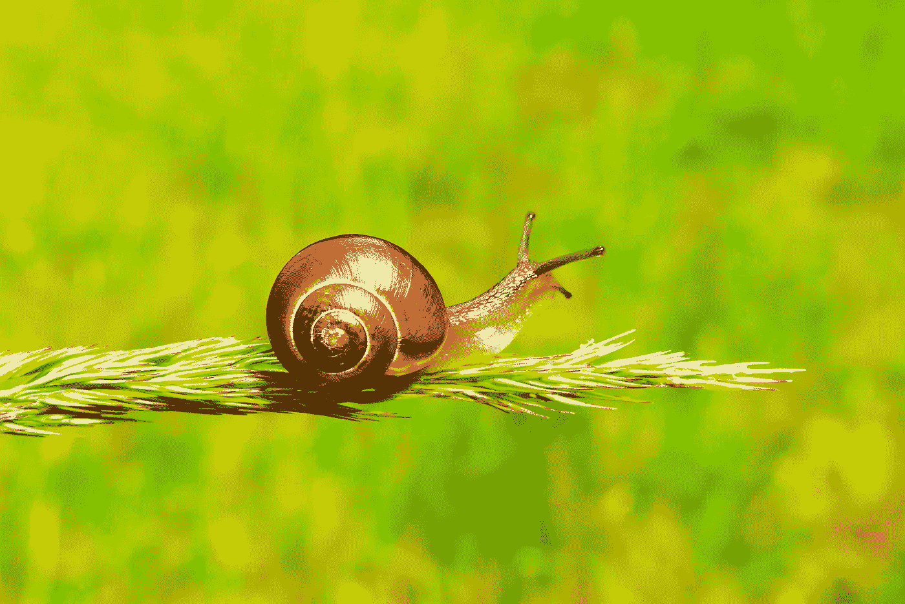

# 捕捉-重捕方法

> 原文：[`towardsdatascience.com/the-capture-recapture-method-dc9985b928da?source=collection_archive---------3-----------------------#2023-09-13`](https://towardsdatascience.com/the-capture-recapture-method-dc9985b928da?source=collection_archive---------3-----------------------#2023-09-13)

## 在不进行完全统计的情况下估算人群大小

 [Dorian Drost](https://medium.com/@doriandrost?source=post_page-----dc9985b928da--------------------------------)

·

[关注](https://medium.com/m/signin?actionUrl=https%3A%2F%2Fmedium.com%2F_%2Fsubscribe%2Fuser%2F1d49ea537d1c&operation=register&redirect=https%3A%2F%2Ftowardsdatascience.com%2Fthe-capture-recapture-method-dc9985b928da&user=Dorian+Drost&userId=1d49ea537d1c&source=post_page-1d49ea537d1c----dc9985b928da---------------------post_header-----------) 发表在[Towards Data Science](https://towardsdatascience.com/?source=post_page-----dc9985b928da--------------------------------) ·7 min read·2023 年 9 月 13 日

--

当你捕捉我们的个体时，确保不要伤害它们，因为你还需要将它们放回去。照片由[Anne Nygård](https://unsplash.com/@polarmermaid?utm_source=medium&utm_medium=referral)拍摄，来自[Unsplash](https://unsplash.com/?utm_source=medium&utm_medium=referral)

在这篇文章中，我想介绍一种统计方法来估算一个人群的大小而无需完全统计，这种方法被称为*捕捉-重捕方法*。该方法源于生物学领域，但也可以应用于许多其他领域和场景，对数据科学家及相关职业可能具有重要意义。

我将首先在生物学示例中演示这一过程，然后再谈论其统计背景和使用所需的属性。之后，我将介绍一些不同领域的示例，以展示捕捉-重捕方法在不同场景中的能力。

# 我花园里有多少只蜗牛？

许多人不喜欢蜗牛，但我仍然认为它们很可爱。让我们在不伤害它们的情况下计算它们的数量。照片来自 [Krzysztof Niewolny](https://unsplash.com/@epan5?utm_source=medium&utm_medium=referral) 在 [Unsplash](https://unsplash.com/?utm_source=medium&utm_medium=referral)

假设我想知道我花园里有多少只蜗牛。我可以尝试统计它们的数量，但我怎么知道何时完成？即使我找不到更多蜗牛，我也不能确定没有剩下的蜗牛。相反，我可以使用另一种方法。

在第一天，我花半小时收集和计算蜗牛。此外，我在每只蜗牛上涂上一个油漆点，然后再放回我的花园。假设我收集了 21 只蜗牛。我能否估算我花园里蜗牛的总数？不，还不能（除了必须至少有 21 只蜗牛），但我还没完成。

一天后，我再次到我的花园开始计算蜗牛，时间为半小时。我发现的一些蜗牛已经在壳上有油漆点，即我昨天已经找到了它们，而其他蜗牛没有（即我昨天没有找到那个特定的蜗牛）。假设我那天计算了 28 只蜗牛，其中 9 只已经标记了油漆点。现在我可以估算蜗牛的总数。让我们来算一下。

在第二天，我发现的蜗牛中有 9/28 的比例是前一天已经找到的。这个比例应该等于我在第一天发现的蜗牛数与总蜗牛数的比例，即 21/N = 9/28，其中 N 是蜗牛的总数。我可以重新计算得到蜗牛总数 N = (21*28)/9 = 65。

为什么会这样？在第二天，某个比例的个体（比如 p%）具有某种属性（即被标记）。如果我从总体中随机抽样，我期望样本中 p% 也具有该属性。这是非常直观的：如果你从你所在城市的人口中随机抽样，你也会期望样本中的性别比例反映总体中的性别比例，对吧？然而，在第二天我们知道了这个比例 p，而在第一天我们不知道（当第一天画蜗牛时，我们不知道已经捕获了多少蜗牛），所以在第一天我们标记了 p% 的所有蜗牛。现在很容易从中推导出总蜗牛数：如果我标记了 21 只蜗牛，而我现在知道这占总体的 9/28=32%，那么总共有大约 65 只蜗牛（21 只大约是 65 的 32%）。

# 捕捉重获的条件

在使用捕捉-再捕捉方法之前，请确保满足所需的条件。照片由[崇镇·赵](https://unsplash.com/@mbuff?utm_source=medium&utm_medium=referral)拍摄，来自[Unsplash](https://unsplash.com/?utm_source=medium&utm_medium=referral)

除了计算花园中蜗牛的数量，还有许多其他场景可以应用上述方法。正如你所想，两个采样步骤之间的间隔不一定要是一天，并且标记的方式也不一定要以字面上的标记个体来进行。你还可以仅仅保持一个你在第一次采样中抽取的个体的列表，只要你能轻松确定在第二次迭代中发现的个体是否已经在列表上。然而，为了使捕捉-再捕捉方法适用，必须满足以下一些条件：

+   在两个数据收集点上，人口必须相同。特别是，这要求在两个时间点之间没有个体被添加或移除。

+   在两个数据收集点上，都必须从分布中随机且独立地抽取。即每个个体被捕获的可能性必须相同。特别是，是否被标记不应影响在其他场合被抽取的可能性。

+   每次抽取的个体数量必须足够大，以产生有意义的重叠。你可以很容易地想象，从你的本地图书馆中随机抽取 100 本书，而图书数量达到数百万，这样的抽取根本没有重叠，因此对你的估计没有帮助。

# 示例用例

亮点：医学是一个经常使用捕捉-再捕捉方法变体的领域。照片由[克谢尼娅·雅科夫列娃](https://unsplash.com/@ksyfffka07?utm_source=medium&utm_medium=referral)拍摄，来自[Unsplash](https://unsplash.com/?utm_source=medium&utm_medium=referral)

现在我们已经理解了捕捉-再捕捉方法，让我们看看一些使用它的例子。它在我们想要确定一个人口的规模但无法完全计数时特别有用。然而，不同的场景可能会有不同的方法先决条件的陷阱需要考虑。

## 计算派对上的宾客数量

在你参加的下一次聚会上，你可以花五分钟标记一些个体（无论是通过字面标记还是保持一个名单），然后几分钟后再次随机抽取一些个体。然而，要确保你真的随机且独立地抽取。也就是说，你应该从各个地方捕捉人群，不要对认识或不认识的人有偏见。此外，确保两个数据收集点之间的距离不要太大，否则你的估计可能会因为人们在这段时间离开聚会而产生偏差。

## 从两个独立列表中进行捕捉

捕捉-重捕法的一种变体不在不同时间点进行重捕，而是使用两个独立的数据源（这些数据源来自相同的分布）及其重叠部分。这样，该方法通常用于医学场景中，因此我们来看一个例子，估算一种疾病的流行程度。

假设我有一份来自医院的患者名单，列出了 142 名患有某种疾病的人员，还有一份来自国家卫生服务的名单，列出了 442 名患有该疾病的人员。假设 71 个人出现在这两个名单上。那么我们可以使用上述公式得到我们的结果（142*442）/71 = 884。即估计有 884 人患有这种疾病。

对于这种变体，最重要的是这两个列表确实是独立的。即，一个个体属于一个列表的可能性不应因该个体是否属于另一个列表而有所不同，反之亦然。

## 估算潜在客户的数量

假设你有一个网站来销售你令人惊叹的新产品。某一天你捕捉了网站上所有访客的数据（例如，通过跟踪他们的 IP），几天后你再次进行相同的捕捉。通过两天之间的重叠部分，你可以估算你的产品的潜在客户数量。然而，你应该意识到这种情况可能容易违反一个重要的假设，即两次捕捉的独立性。特别是，可以认为第一次访问网站可能会增加再次访问网站的可能性。

# 总结

我们现在已经看到了一些捕捉-重捕法的示例，该方法允许我们在不完全计数的情况下估算一个种群的规模。该方法要求从种群中抽取两个独立的样本（可以在不同的时间点或来自不同的来源），并利用它们的重叠部分来估计种群的大小。这种方法可以在多种领域中使用，特别是当对种群的全面观察不可行时。

# 进一步阅读

关于在花园里计数蜗牛的例子，我改编自以下书籍：

+   Kit Yates (2019). 《生命与死亡的数学：为什么数学（几乎）是所有的一切》。*Quercus Editions Ltd, London.*

关于在医学领域使用的捕捉-重捕法的概述可以在这里找到：

+   Ramos, P. L., Sousa, I., Santana, R., Morgan, W. H., Gordon, K., Crewe, J., … & Macedo, A. F. (2020). 捕捉-重捕方法及其在眼科和视觉科学中的可能性综述。*眼科流行病学*，*27*(4)，310–324。

*喜欢这篇文章吗？* [*关注我*](https://medium.com/@doriandrost) *以便收到我未来的帖子通知。*
