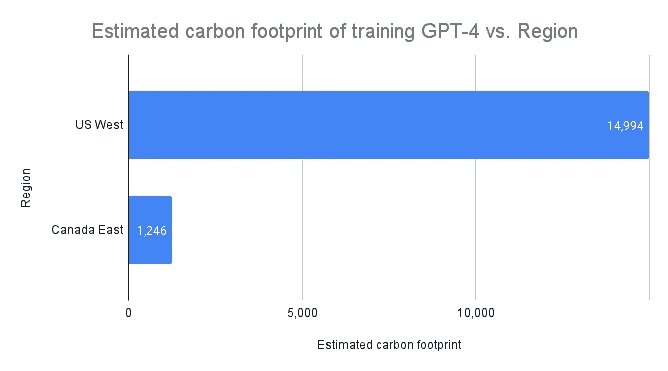
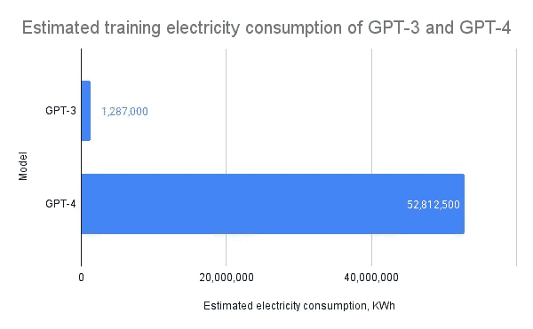

# GPT-4 的碳足迹

> 原文：[`towardsdatascience.com/the-carbon-footprint-of-gpt-4-d6c676eb21ae`](https://towardsdatascience.com/the-carbon-footprint-of-gpt-4-d6c676eb21ae)

## 最近泄露的数据使我们第一次能够估算训练 OpenAI 的 GPT-4 的碳排放

 [Kasper Groes Albin Ludvigsen](https://kaspergroesludvigsen.medium.com/?source=post_page-----d6c676eb21ae--------------------------------)

·发布于 [Towards Data Science](https://towardsdatascience.com/?source=post_page-----d6c676eb21ae--------------------------------) ·阅读时间 7 分钟·2023 年 7 月 18 日

--

照片由 Taylor Vick 提供，来源于 Unsplash

随着最近的新闻警告我们全球平均温度持续上升 [1]，我们需要提醒自己，大多数人类活动都有碳足迹，这对全球变暖和其他气候变化有贡献。这对于数字技术尤其是 AI 也是如此。本文作为一个提醒，估算了训练 OpenAI 的大型语言模型 GPT-4 的碳排放。

为了进行这些估算，我们需要了解：

1.  训练 GPT-4 使用了多少电力

1.  电力的碳强度，即生成 1 千瓦时电力的碳足迹

让我们直接进入主题。

 [## 使用我的推荐链接加入 Medium - Kasper Groes Albin Ludvigsen

### 作为 Medium 会员，您的一部分会员费用将分配给您阅读的作者，并且您可以完全访问所有故事……

[kaspergroesludvigsen.medium.com](https://kaspergroesludvigsen.medium.com/membership?source=post_page-----d6c676eb21ae--------------------------------)

# GPT-4 的电力消耗

首先让我们估算 GPT-4 的能耗。根据未经验证的信息泄露，GPT-4 在大约 25,000 个 Nvidia A100 GPU 上训练了 90-100 天 [2]。

假设这些 GPU 安装在 Nvidia HGX 服务器中，每台服务器可以容纳 8 个 GPU，这意味着需要 25,000 / 8 = 3,125 台服务器。

估算电力消耗的一种方法是考虑 Nvidia HGX 服务器的热设计功率 (TDP)。TDP 以瓦特为单位，表示硬件在最大*理论*负载下的功耗 [11]，即实际功耗可能有所不同。

不幸的是，Nvidia 并没有披露这些信息，因此我们改为使用类似 Nvidia DGX 服务器的 TDP，6.5 kW [3]。因此，如果一台 Nvidia DGX 服务器以满功率运行 1 小时，它将根据 TDP 消耗 6.5 KWh。

记住，估计训练 GPT-4 需要 90–100 天。这是 90 或 100 * 24 = 2,160 到 2,600 小时每台服务器。如果我们假设服务器始终以满功率运行，我们可以将小时数乘以 6.5 kW，因此在训练期间，每台服务器可能消耗了 14,040 到 16,900 KWh 的电力。

我们将其乘以 3,125 台服务器所需的 25,000 GPU：3,125 * 14,040 到 16,900 KWh = 43,875,000 到 52,812,500 KWh。

在计算计算机硬件的能耗时，通常需要将硬件的能耗乘以硬件运行的数据中心的所谓能效比（PUE）（参见例如 [4]）。PUE 是一个描述计算机数据中心使用能源效率的比率。假设 GPT-4 是在微软 Azure 数据中心进行训练的，因为 OpenAI 与微软有合作关系。微软 Azure 数据中心的平均 PUE 为 1.18 [7]，但请注意，这在不同数据中心之间可能有所不同。

因此，我们将 43,875,000 到 52,812,500 KWh 的硬件电力消耗乘以 1.18。这样我们得到 51,772,500 到 62,318,750 KWh。即训练 GPT-4 可能使用了 51,772,500 到 62,318,750 KWh 的电力。

这结束了我们对 GPT-4 训练能耗的估计。现在让我们估算训练 GPT-4 的碳足迹。

 ## ChatGPT 的电力消耗

### ChatGPT 可能消耗了相当于 2023 年 1 月 175,000 人的电力。

towardsdatascience.com

# GPT-4 的碳足迹

上述估计 GPT-4 的训练电力消耗在 51,772,500 和 62,318,750 KWh 之间。

要将其转换为碳足迹，我们需要将其乘以用于提供计算电力的电力的碳强度。

我想强调的是，我们不知道电力的生成方式，因此不知道其碳强度，但我们可以做一些假设。

假设 GPT-4 是在 Azure 数据中心进行训练的，因为 OpenAI 与微软有合作关系。根据研究人员的说法，美国最低碳强度的 Azure 数据中心位于加利福尼亚州的 West US [5]。该数据中心的碳足迹为 240.6 gCO2e/KWh，这意味着在该地区生成 1 KWh 的电力平均会排放 240.6 克 CO2e。

因此，如果模型是在加利福尼亚州的“普通”电网电力上进行训练的，我们可以估算 GPT-4 的碳足迹在 12,456 和 14,994 公吨 CO2e 之间。

如果 OpenAI 在加拿大东部地区的数据中心训练 GPT-4，该地区的碳强度仅为 20 gCO2e/KWh，是所有 Azure 地区中最低的，那么碳足迹将为 1,035 到 1,246 公吨 CO2e。下图 1 显示了这一差异。

图 1：如果 GPT-4 是在 Azure 云区域加拿大东部进行训练的，其训练碳足迹将比原来小 13 倍。

# 讨论

本文估计，训练 GPT-4 可能排放了超过 15 公吨的 CO2e。这相当于 938 名美国人的年排放量[8]。或者占全球排放量的 0.0000375%，假设全球年排放量为 400 亿吨[9]。虽然这可能不算多，但与硬件制造排放和为大规模用户群体服务模型的碳足迹相比，就显得微不足道了。这一点我在我的文章中有提到过，*无处不在的生成性 AI 的环境影响* 和 *ChatGPT 的电力消耗**.*

上述内容中，我估计 GPT-4 的电力消耗在 51,772,500 到 62,318,750 KWh 之间。相比之下，估计训练 GPT-3 的电力消耗为 1,287,000 KWh[6]，如图 2 所示。因此，如果这里的估算是正确的，那么训练 GPT-4 所需的电力可能是训练 GPT-3 所需电力的 40 至 48 倍，尽管 GPT-4 的总参数数量大约是 GPT-3 的 10 倍。显然，训练模型所需的电力还受到许多其他因素的影响，而不仅仅是模型的参数数量，但这提醒我们，不能仅凭类似模型的能耗来推测其他模型的能耗。

图 2：比较训练 GPT-3 和 GPT-4 的估计电力消耗

上述结果表明，Azure 云区域之间的碳排放可能相差 13 倍。这清楚地显示了在绿色能源地区训练模型的巨大环境效益 —— 这是我在这里也提到的：

 [## 如何估算和减少机器学习模型的碳足迹]

### 有两种简单的方法来估算机器学习模型的碳足迹，并提供了 17 个减少碳足迹的想法。

towardsdatascience.com

此外，请注意，这里获得的结果基于关于用于训练 GPT-4 的 GPU 数量的未验证信息。因此——以及因为对 PUE、硬件利用率和碳强度等假设——这里获得的结果应被视为有根据的猜测。如果这些未验证的信息被证实为真实，我相信这里提供的数字大致是正确的，但请质疑我的假设。

# 结论

本文估算训练 GPT-4 消耗了 51,772,500 到 62,318,750 千瓦时的电力，并排放了 12,456 到 14,994 公吨 CO2e（如果在加利福尼亚州训练）和 1,035 到 1,246 公吨 CO2e（如果在加拿大东部训练）。

尽管这些数字可能看起来很小，但与 AI 模型生命周期其他阶段的环境影响（例如部署阶段）相比，它们显得微不足道。

这里提供的碳足迹估算可以供有兴趣计算 AI 全球总碳足迹的组织或个人使用。

另一个有趣的发现是，估算结果清楚地显示了考虑到模型训练云区域电力碳强度的环境效益。在比较 GPT-4 和 GPT-3 的电力消耗时，我们还发现它们的电力消耗差异远大于它们的大小差异。

 ## 生成式 AI 的普遍环境影响

### 如果数十亿人开始每天使用生成式 AI 技术，我们的环境可能会发生什么变化？

[towardsdatascience.com

就这些！希望你喜欢这个故事。让我知道你的想法！

通过注册 Medium 会员[此处](https://kaspergroesludvigsen.medium.com/membership)来获得 Medium 的福利并支持我的写作。

关注我以获取更多有关 AI 和可持续性的内容，并[订阅](https://kaspergroesludvigsen.medium.com/subscribe)以在我发布时通过电子邮件接收我的故事。

我有时也会写有关时间序列预测的文章。

也可以在[LinkedIn](https://www.linkedin.com/in/kaspergroesludvigsen)上随时联系我。

# 参考文献

[1] [`edition.cnn.com/2023/07/05/world/hottest-day-world-climate-el-nino-intl/index.html`](https://edition.cnn.com/2023/07/05/world/hottest-day-world-climate-el-nino-intl/index.html)

[2] [`archive.md/2RQ8X`](https://archive.md/2RQ8X)

[3] [`www.nvidia.com/content/dam/en-zz/Solutions/Data-Center/nvidia-dgx-a100-datasheet.pdf`](https://www.nvidia.com/content/dam/en-zz/Solutions/Data-Center/nvidia-dgx-a100-datasheet.pdf)

[4] [`arxiv.org/abs/2211.02001`](https://arxiv.org/abs/2211.02001)

[5] [`github.com/mlco2/impact/blob/master/data/impact.csv`](https://github.com/mlco2/impact/blob/master/data/impact.csv) – MIT 许可证 – “在此特此免费授予任何个人” [10]

[6] [`arxiv.org/ftp/arxiv/papers/2204/2204.05149.pdf`](https://arxiv.org/ftp/arxiv/papers/2204/2204.05149.pdf)

[7] [`azure.microsoft.com/en-us/blog/how-microsoft-measures-datacenter-water-and-energy-use-to-improve-azure-cloud-sustainability/`](https://azure.microsoft.com/en-us/blog/how-microsoft-measures-datacenter-water-and-energy-use-to-improve-azure-cloud-sustainability/)

[8] https://www.forbes.com/sites/robtoews/2020/06/17/deep-learnings-climate-change-problem/

[9] https://www.iea.org/reports/co2-emissions-in-2022

[10] https://github.com/mlco2/impact/blob/master/LICENSE

[11] https://www.intel.com/content/www/us/en/support/articles/000055611/processors.html
