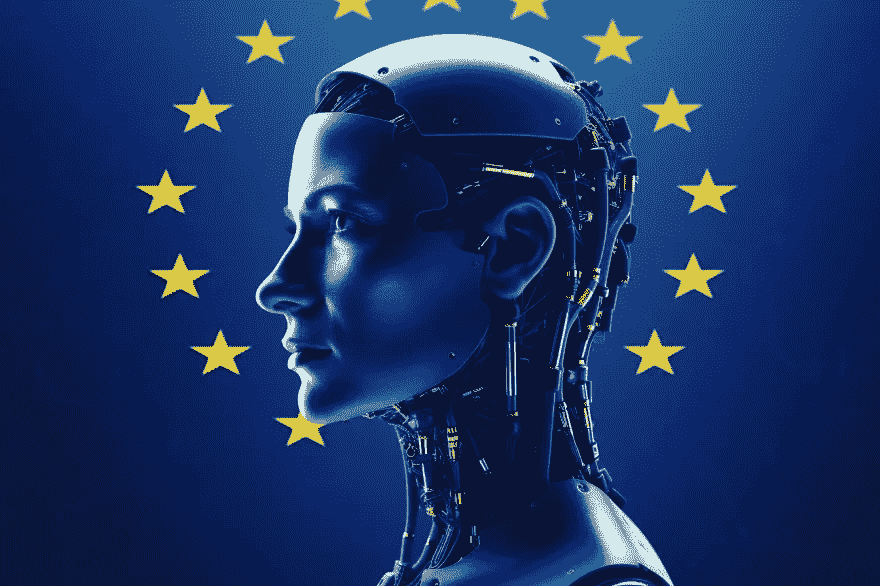

# 反对人工智能监管的理由毫无意义

> 原文：[`towardsdatascience.com/the-case-against-ai-regulation-makes-no-sense-a6b5a9ca2b28`](https://towardsdatascience.com/the-case-against-ai-regulation-makes-no-sense-a6b5a9ca2b28)

## 意见

## 欧洲正在走在正确的道路上——世界其他地区应该效仿

 [Adrien Book](https://adrien-book.medium.com/?source=post_page-----a6b5a9ca2b28--------------------------------)

·发布在 [Towards Data Science](https://towardsdatascience.com/?source=post_page-----a6b5a9ca2b28--------------------------------) ·阅读时间 9 分钟·2023 年 8 月 12 日

--

由作者通过 MidJourney 创建

自从 OpenAI 在 2022 年底推出 ChatGPT 以来，世界一直在热议生成式人工智能及其可能创造的[未来](https://www.thepourquoipas.com/post/top-9-ways-chatgpt-will-accelerate-society-s-collapse)。资本主义的拥趸们认为这项技术是[一种净积极因素](https://a16z.com/2023/06/06/ai-will-save-the-world/)；数字世界的逻辑延续，它促成了无数财富的创造…… [只为少数人](https://www.salon.com/2013/05/12/jaron_lanier_the_internet_destroyed_the_middle_class/)。与此同时，怀疑者回顾 80 年代的最佳科幻作品，并[担忧](https://www.thepourquoipas.com/post/why-are-men-so-scared-of-ai)我们可能正在创造自己的[HAL](https://en.wikipedia.org/wiki/HAL_9000) / [SHODAN](https://en.wikipedia.org/wiki/SHODAN) / [Ultron](https://en.wikipedia.org/wiki/Ultron) / [SkyNet](https://en.wikipedia.org/wiki/Skynet_(Terminator)) / [GLaDOS](https://en.wikipedia.org/wiki/GLaDOS)。

这些只是声音响亮的少数人。大多数人面对生成式人工智能提供的可能性时，理解这项技术仅仅是一个工具，没有自己的思想。责任在于用户去“*做好事*”。如果这不可能，因为“*好*”本质上是主观的……那么*民主*政府需要介入并进行监管。

如何（以及是否）实施这一点[仍在激烈讨论](https://www.theverge.com/2023/6/30/23779611/eu-ai-act-open-letter-artificial-intelligence-regulation-renault-siemens)。欧盟是第一个推出*提议*的[《人工智能法》](https://www.europarl.europa.eu/news/en/headlines/society/20230601STO93804/eu-ai-act-first-regulation-on-artificial-intelligence)的。虽然这只是一个不完美的初稿，但它具有管理高度颠覆性技术的真实尝试的优势，而不是让科技亿万富翁来决定。以下是提议法律的概要，以及这种监管的利弊。

# 欧盟《人工智能法》包含哪些内容。

[《人工智能法》](https://www.europarl.europa.eu/news/en/headlines/society/20230601STO93804/eu-ai-act-first-regulation-on-artificial-intelligence)将风险置于讨论的核心：“*新规则根据人工智能的风险水平为提供者和用户设立了义务。尽管许多人工智能系统的风险很小，但仍需进行评估。*”

+   AI 产生“*不可接受*”风险（行为操控、实时和远程生物识别、社会评分……）的情况将被**禁止**。

+   高风险人工智能系统（涉及执法、教育、移民……）“*在投入市场前和在整个生命周期中都将进行评估*”。

+   限制风险的人工智能系统需要“*遵守最低透明度要求，以便用户做出明智的决定。*”

在提议的法规中，生成性人工智能得到了特别提及。使用该技术的公司将需要：

+   公开人工智能生成的内容。

+   设计保障措施以防止生成非法内容。

+   发布用于培训的版权数据的摘要。

如果这看起来满足实际需求同时又不至于过于宽泛，听从你的直觉。未能遵守规定的公司可能面临高达年营业额 6%的罚款，并被禁止在欧盟运营。该地区预计占全球人工智能市场的 20%到 25%，该市场预计在 10 年内将[价值超过 1.3 万亿美元](https://www.bloomberg.com/news/articles/2023-06-01/chatgpt-to-fuel-1-3-trillion-ai-market-by-2032-bi-report-says)……这就是为什么科技公司可能会[说他们会离开……但永远不会](https://www.bbc.com/news/technology-65708114)。该法律预计将在 2024 年左右通过。

# 为什么生成性人工智能不应受到监管。

关于[科技亿万富翁表示](https://www.theverge.com/2023/5/30/23742005/ai-risk-warning-22-word-statement-google-deepmind-openai) [他们希望人工智能受到监管](https://time.com/6280372/sam-altman-chatgpt-regulate-ai/)的说法已有很多讨论。让我们澄清一点：这只是一个幌子，纯粹是公关策略。[他们并不真正想要监管，如果真的有，他们希望按自己的条件来](https://www.bloomberg.com/news/articles/2023-06-27/big-tech-companies-fight-ai-regulation-in-europe-ask-us-lawmakers-for-oversight?)。以下是他们及其小分队在过去几个月提出的一些最佳论据。

## 扼杀创新与进步

有人认为，[法规将减缓人工智能的进展和突破](https://www.vox.com/the-highlight/23621198/artificial-intelligence-chatgpt-openai-existential-risk-china-ai-safety-technology)。不允许公司进行测试和学习将会[使它们在国际上竞争力下降](https://www.theverge.com/2023/6/30/23779611/eu-ai-act-open-letter-artificial-intelligence-regulation-renault-siemens)。然而，我们还没有看到确凿的证据证明这一点。即使有，问题仍然存在：*无限制的创新是否对整个社会有利*？利润不是一切。也许欧盟在创造新的独角兽和亿万富翁方面会落后于中国和美国。如果[我们仍然拥有社会保障、免费医疗、育儿假和每年 6 周的假期](https://snippetsofparis.com/benefits-france/)，这是否真的那么糟糕？如果因为法规的原因导致一个百万富翁无法成为亿万富翁，那也无所谓。

非国际竞争力的论点对于当前讨论更具相关性：法规可能为新公司设置进入壁垒（高成本、标准或对开发者或用户的要求），从而增强现有企业的优势。欧盟在[实施 GDPR](https://www.computerweekly.com/opinion/GDPR-like-a-lot-of-regulation-will-mostly-benefit-the-big-incumbents)时已经看到过这种情况。法规需要为非常小的公司留出实验空间，[这一点已经在欧盟层面讨论过](https://digital-strategy.ec.europa.eu/en/policies/regulatory-framework-ai)。如果它们这么小，鉴于 AI 的指数级力量，中小企业能造成多大伤害呢？

## 复杂且具有挑战性的实施

与改变世界的技术相关的法规通常可能过于模糊或宽泛，难以适用于不同的司法管辖区。这使得它们在不同领域的实施和执行变得困难。特别是在考虑到该领域缺乏明确标准时，这一点尤为明显。毕竟，什么是风险和伦理，除了[文化相对主义](https://www.simplypsychology.org/cultural-relativism.html)之外，还能是什么呢？

这使得平衡国际标准和主权成为一个特别棘手的话题。人工智能跨越国界运作，其监管需要国际合作与协调。考虑到不同的法律框架和文化差异，这可能会很复杂。这就是*他们*会说的。

然而，呼吁全球统一监管的声音却很少。人工智能（在许多方面）并不等同于原子弹，无论灾难论者[如何呼吁“新 START”方法](https://www.vox.com/future-perfect/2023/7/3/23779794/artificial-intelligence-regulation-ai-risk-congress-sam-altman-chatgpt-openai)。欧盟将有自己的法律，[其他世界大国也将如此](https://www.technologyreview.com/2023/05/31/1073743/china-generative-ai-quick-regulation/?)。我们唯一能要求的，是围绕技术带来的风险达成共识，并有限度地合作以覆盖区域法律中的盲点。

## 过度监管和意外后果的潜力

此外，我们知道[监管往往无法跟上技术的快速变化](https://www.brookings.edu/articles/the-three-challenges-of-ai-regulation/)。人工智能是一个迅速发展的领域，新的技术和应用不断出现。新挑战、风险和机会不断出现，我们需要保持足够的敏捷性/灵活性来应对这些变化。跟上技术进步并监管尖端技术对管理机构来说可能具有挑战性……但这从未阻止过任何人，世界依然存在。

同时，政府必须确保新兴产业（不被视为人工智能）不会被现有法规的范围所涵盖，导致意外后果。例如，我们不希望因为碳捕捉系统使用类似生成性人工智能的技术来推荐清理区域，而使生态环境遭受损害。

避免过度的官僚主义和繁文缛节非常重要……但这并不是无所作为的理由。欧盟提出的基于风险的治理方案是应对这些挑战的良好答案。风险的定义足够全面，适用于所有人，同时允许在人工智能的性质发生变化时进行调整。

事实上，监管人工智能的真正风险很少……而好处却很多。

# 为什么生成性人工智能需要监管

有许多理由需要监管生成性人工智能，特别是从对弱势或无助人群的风险角度来看。当你从未遭受过歧视时，[自动化和大规模歧视](https://rm.coe.int/discrimination-artificial-intelligence-and-algorithmic-decision-making/1680925d73)可能很容易被忽视……看看你，科技兄弟们。

## 确保人工智能的伦理使用

首先（而且显而易见），需要规制以将现有的数字法律应用并适应 AI 技术。这意味着要保护[用户的隐私](https://www.brookings.edu/articles/how-privacy-legislation-can-help-address-ai/)（[以及他们的数据](https://www.forbes.com/sites/forbestechcouncil/2021/08/04/three-years-on-from-gdpr-and-ccpa-how-has-data-protection-modernized/)）。AI 公司在处理数据密集型算法时应投资于强大的网络安全能力……并放弃一些收入，因为用户数据不应出售给第三方。这是一个美国公司[似乎固有地](https://www.nytimes.com/wirecutter/blog/state-of-privacy-laws-in-us/) [且故意误解](https://penntoday.upenn.edu/news/asc-americans-dont-understand-what-companies-can-do-their-personal-data)的概念，如果没有规制的话。

正如 AI 法案中提到的，科技公司还必须消除处理敏感话题的算法中的潜在偏见和歧视。这意味着 A) 确保没有被故意注入的偏见，B) 确保去除自然发生的偏见，以避免大规模再现。这是[不可谈判的](https://eur-lex.europa.eu/legal-content/EN/TXT/?uri=CELEX%3A52021PC0206)，如果需要[规制碰撞测试](https://www.bloomberg.com/news/articles/2023-06-27/europe-to-open-artificial-intelligence-crash-test-centers?)，也无妨。

从哲学上讲，规制可以帮助在生成式 AI 的用户、开发者和利益相关者之间培养信任、透明度和问责制。通过让所有参与者披露 AI 输出的来源、目的和局限性，我们将能够做出更好的选择……并信任他人的选择。社会的结构需要这个。

## 维护人权和安全

除了“基础知识”之外，[规制需要保护广大人群](https://hbr.org/2021/09/ai-regulation-is-coming)免受与 AI 相关的安全风险，这些风险有很多。

大多数风险将与人类有关。恶意行为者可以利用生成式 AI 来[传播虚假信息](https://www.rand.org/pubs/perspectives/PEA1043-1.html)或[创建深度伪造](https://thumos.uk/generative-ai-and-deepfakes/)。[这很容易做到](https://www.thepourquoipas.com/post/30-fake-stories-created-with-chatgpt-what-i-learned)，而且公司似乎无法自己阻止——主要是因为他们不愿意（而非不能）标记 AI 生成的内容。我们的[下一次选举](https://news.bloomberglaw.com/artificial-intelligence/regulate-deepfake-ads-election-agency-told-again-after-deadlock)可能取决于规制的实施……而[(主要是年轻的)女性在全球范围内可能会问为什么我们不早点做](https://www.bbc.com/news/entertainment-arts-65854112)。

我们还需要避免让人类利用生成式人工智能对其他人造成身体伤害：有报道称，人工智能可以用来描述[制造脏弹](https://outrider.org/nuclear-weapons/articles/could-chatbot-teach-you-how-build-dirty-bomb)的最佳方法。在这里，如果一个公司无法尽其所能地防止这种情况，我看不到我们继续允许它以现有形式存在的理由。

所有这些还不包括[人工智能驱动的战争](https://www.brookings.edu/articles/applying-arms-control-frameworks-to-autonomous-weapons/)和[自主武器](https://www.scientificamerican.com/article/ai-influenced-weapons-need-better-regulation/)，它们的创造[必须尽一切可能避免](https://www.weforum.org/agenda/2021/06/the-accelerating-development-of-weapons-powered-by-artificial-risk-is-a-risk-to-humanity/)。然而，这种情景极其灾难性，我们常常用它来掩盖人工智能的许多其他问题。为什么要集中注意数据隐私呢，当终结者就在眼前，不是吗？不要让悲观者分散你对非常乏味但却非常真实的事实的注意：如果没有强有力的人工智能监管来解决上述问题，社会可能会死于千刀万剐，而不是单一的武器打击。

这就是为什么我们必须确保公司同意创建符合人类价值观和道德的系统。说起来容易做起来难，但有一个愿景是一个好的开始。

## 减轻社会和经济影响

有些重要话题《人工智能法案》（或任何其他提议的法规）并没有完全涵盖。这些问题将在未来几年进一步评估，但其本质使得在不进行过度监管的情况下进行监管变得困难，但这并不减少其必要性。

首先，需要规则来[公平补偿那些数据被使用](https://www.theverge.com/2023/7/9/23788741/sarah-silverman-openai-meta-chatgpt-llama-copyright-infringement-chatbots-artificial-intelligence-ai?)以[训练将给少数人带来巨额财富的算法](https://www.wired.com/story/stack-overflow-will-charge-ai-giants-for-training-data/)。没有这一点，我们只是重复过去的错误，让深刻的经济鸿沟变得更加深刻。这将是困难的；[目前几乎没有法律先例来说明今天发生的事情](https://www.theverge.com/23444685/generative-ai-copyright-infringement-legal-fair-use-training-data)。

还必须解决生成式人工智能导致的[职位流失和失业](https://www.weforum.org/agenda/2023/05/jobs-lost-created-ai-gpt/)。大多数职位预计会受到人工智能的影响，且随着自动化的提高，失业率通常也会增加。根据[BanklessTimes.com 的一份报告](https://www.banklesstimes.com/news/2022/11/29/ai-could-displace-800-million-jobs-by-2030/)，到 2030 年，人工智能可能会取代 8 亿个工作岗位（占全球劳动力的 30%）。

对于一些人来说，这可能是在宏观经济层面上的问题（“[*AI 也可能通过自动化某些工作方面来改变职位角色并创造新的职位，同时允许人类专注于更具创意或增值的任务*](https://www.linkedin.com/pulse/role-artificial-intelligence-job-displacement-anuja-jain)”，他们会这样说），但对其他人来说，却是数十年的绝望。[我们需要一个针对被 AI 替代和自动化的人的监管计划](https://www.theguardian.com/commentisfree/2023/may/22/ai-jobs-policies)（培训，UBI 等）。

最终，持续保护全球经济免受 AI 驱动的经济垄断将是非常重要的。[网络效应意味着现在几乎不可能赶上互联网巨头](https://techcrunch.com/2023/06/02/competition-concerns-in-the-age-of-ai/?guccounter=1&guce_referrer=aHR0cHM6Ly93d3cuZ29vZ2xlLmNvbS8&guce_referrer_sig=AQAAAFKYT7V-fGnU5lVmHu4IgpEp_byMaj8vl9_yL_Qab6hLlQMLb14KPCFGPN5s51U1caeI1vINV4YrjjzkHGy0Qwxj5WPhMH2xZbLFjsgM46OgwP4BsV0pHs65itH7f2DcNy6JJ1sF9viHH8XLcwrzPJPQum0xxVwH7pgzcI1fcTJX)，因为缺乏数据或计算能力。反垄断法已经被搁置了几十年，这种情况不能再继续下去。在这种情况下，监管不会让我们变得不具竞争力，*反而可能使经济更加具备竞争力*。

监管游戏才刚刚开始。展望未来，政府需要合作以建立广泛的框架，同时促进和鼓励知识共享和跨学科合作。

这些框架需要具备适应性和协作性，否则将无法跟上 AI 的最新发展。定期的审查和更新将是关键，敏捷实验也同样重要。

最终，公众参与和包容性的决策制定将决定任何出台的规则的成败。我们需要在监管讨论中涉及各种利益相关者，同时让公众参与 AI 政策决策。这是为了我们/他们，清晰传达这一点将帮助政府对抗科技公司的游说。

监管的道路漫长：目前，[没有任何基础 LLM 符合 EU AI 法规](https://the-decoder.com/no-foundational-llm-currently-complies-with-eu-ai-act/)。与此同时，[中国的监管集中在内容控制](https://www.ft.com/content/1938b7b6-baf9-46bb-9eb7-70e9d32f4af0?) 而非风险，进一步加强了党对言论自由的控制。

监管游戏才刚刚开始。不过……我们已经开始了，这才是关键所在。

# 还有一件事

*请通过留言支持我的写作。我喜欢阅读留言！除了那些恶意的，它们让我伤心。另外，通过订阅我的通讯来避免错过我的任何写作* [*在 Medium 上*](https://adrien-book.medium.com/subscribe)*，或者* [*在我的博客上*](https://www.thepourquoipas.com/)*。*

[*这篇文章*](https://www.wearedevelopers.com/magazine/eu-ai-regulation-artificial-intelligence-regulations) *最初为* [*wearedevelopers.com*](https://www.wearedevelopers.com/)*编写的，欧洲开发者专注的招聘平台。*
