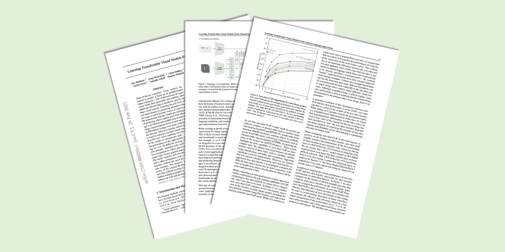

# CLIP 基础模型

> 原文：[`towardsdatascience.com/the-clip-foundation-model-7770858b487d?source=collection_archive---------3-----------------------#2023-08-26`](https://towardsdatascience.com/the-clip-foundation-model-7770858b487d?source=collection_archive---------3-----------------------#2023-08-26)

## [🚀Sascha 的论文俱乐部](https://towardsdatascience.com/tagged/saschas-paper-club)

## 《从自然语言监督中学习可转移的视觉模型》，作者 A. Radford 等。

 [Sascha Kirch](https://medium.com/@SaschaKirch?source=post_page-----7770858b487d--------------------------------)

·

[关注](https://medium.com/m/signin?actionUrl=https%3A%2F%2Fmedium.com%2F_%2Fsubscribe%2Fuser%2F5c38dace9d5e&operation=register&redirect=https%3A%2F%2Ftowardsdatascience.com%2Fthe-clip-foundation-model-7770858b487d&user=Sascha+Kirch&userId=5c38dace9d5e&source=post_page-5c38dace9d5e----7770858b487d---------------------post_header-----------) 发表在 [Towards Data Science](https://towardsdatascience.com/?source=post_page-----7770858b487d--------------------------------) ·8 分钟阅读·2023 年 8 月 26 日

--

在本文中，我们将深入探讨 CLIP（**C**ontrastive **L**anguage-**I**mage **P**re-Training）背后的论文。我们将提取关键概念并将其拆解，以便于理解。此外，图像和数据图表也会进行注释，以澄清疑问。

图片来源于 [出版物](https://arxiv.org/abs/2103.00020)，作者 [Sascha Kirch](https://medium.com/@SaschaKirch)

> **论文：** [从自然语言监督中学习可转移的视觉模型](https://arxiv.org/abs/2103.00020)，Alec Radford 等，2021 年 2 月 26 日
> 
> **资源：** [GitHub](https://github.com/OpenAI/CLIP) — [博客文章](https://openai.com/research/clip) — [Hugging Face](https://huggingface.co/docs/transformers/model_doc/clip)
> 
> **类别：** 多模态深度学习、计算机视觉、自然语言处理、基础模型、表示学习
> 
> [**其他讲解**](https://medium.com/@SaschaKirch/list/paper-walkthroughs-by-sascha-kirch-89c7847da8e2)**：**
> 
> [BYOL] — [[深度任何东西](https://medium.com/towards-data-science/depth-anything-a-foundation-model-for-monocular-depth-estimation-8a7920b5c9cc?sk=fc6197edd68e6137c3396c83e50f65cb)] — [GLIP] — [随意分割] — [DINO] — [DDPM]

# 大纲

1.  背景与概述

1.  方法

1.  实验

1.  进一步阅读与资源

# 背景与概述

CLIP（**C**ontrastive **L**anguage-**I**mage **P**re-Training）是一个多模态模型，学习自然语言与图像之间的对应关系。它在 4 亿对文本-图像上进行训练…
