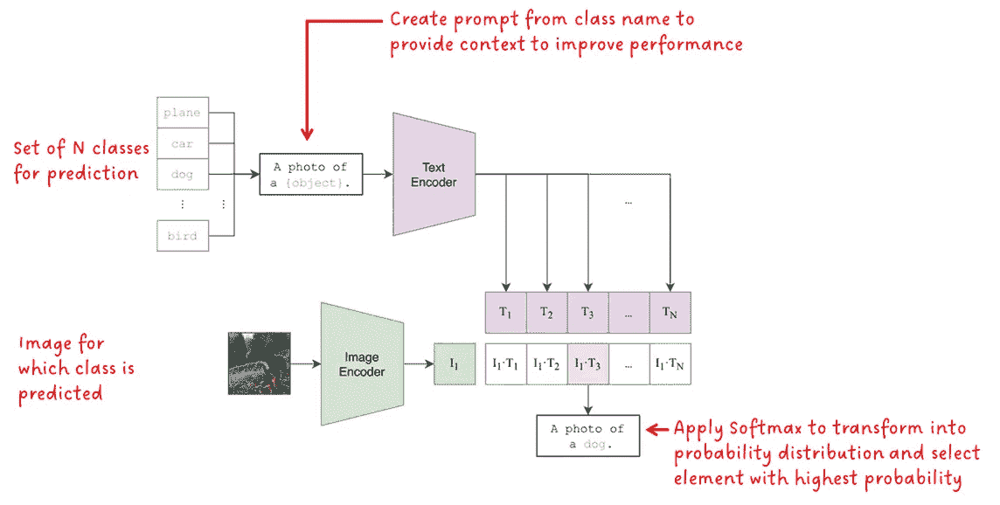
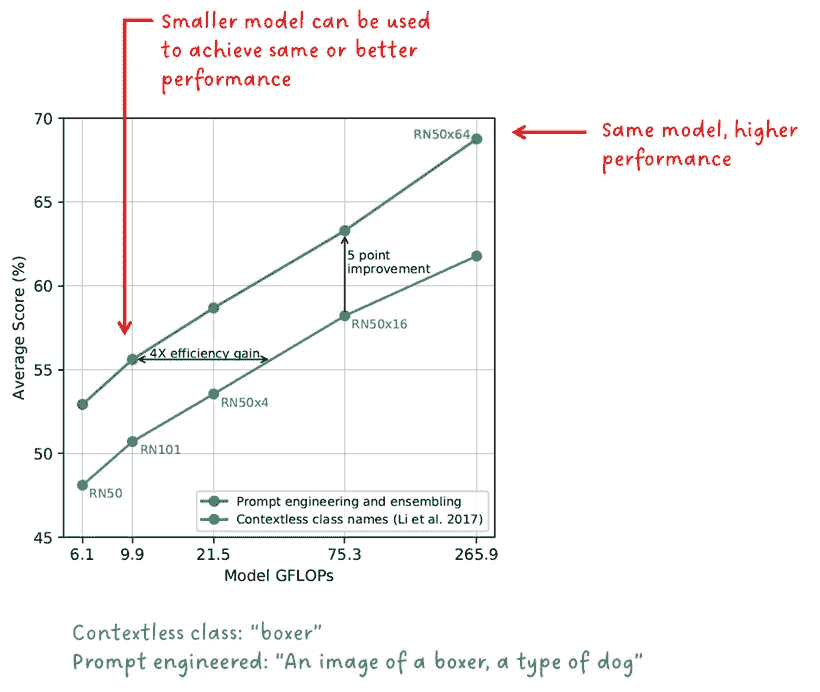

# CLIP 基础模型

> 原文：[`towardsdatascience.com/the-clip-foundation-model-7770858b487d`](https://towardsdatascience.com/the-clip-foundation-model-7770858b487d)

## [🚀Sascha 的论文俱乐部](https://towardsdatascience.com/tagged/saschas-paper-club)

## **从自然语言监督中学习可转移的视觉模型** 作者：A. Radford 等

 [Sascha Kirch](https://medium.com/@SaschaKirch?source=post_page-----7770858b487d--------------------------------)

·发表于[Towards Data Science](https://towardsdatascience.com/?source=post_page-----7770858b487d--------------------------------) ·阅读时间 8 分钟·2023 年 8 月 26 日

--

在这篇文章中，我们将深入探讨 CLIP（**C**ontrastive **L**anguage-**I**mage **P**re-Training）背后的论文。我们将提取关键概念并将其分解，以便于理解。此外，图片和数据图表也会进行注释，以澄清疑问。

图片由[Sascha Kirch](https://medium.com/@SaschaKirch)基于[出版物](https://arxiv.org/abs/2103.00020)创建

> **论文：** [从自然语言监督中学习可转移的视觉模型](https://arxiv.org/abs/2103.00020)，Alec Radford 等，2021 年 2 月 26 日
> 
> **资源：** [GitHub](https://github.com/OpenAI/CLIP) — [博客文章](https://openai.com/research/clip) — [Hugging Face](https://huggingface.co/docs/transformers/model_doc/clip)
> 
> **类别：** 多模态深度学习，计算机视觉，自然语言处理，基础模型，表征学习
> 
> [**其他论文解读**](https://medium.com/@SaschaKirch/list/paper-walkthroughs-by-sascha-kirch-89c7847da8e2)**：**
> 
> [BYOL] — [[Depth Anything](https://medium.com/towards-data-science/depth-anything-a-foundation-model-for-monocular-depth-estimation-8a7920b5c9cc?sk=fc6197edd68e6137c3396c83e50f65cb)] — [GLIP] — [Segment Anything] — [DINO] — [DDPM]

# 大纲

1.  背景与背景

1.  方法

1.  实验

1.  进一步阅读与资源

# 背景与背景

CLIP（**对比** **语**言-**图**像 **预**训练）是一个多模态模型，学习自然语言与图像之间的对应关系。它在互联网上收集的 4 亿对文本-图像数据上进行训练。正如我们在本文后面将深入探讨的，CLIP 具有强大的零样本性能，这意味着它在与训练时不同的下游任务上表现良好，而无需进行任何微调。

CLIP 的目标是：

1.  将自然语言处理（如 GPT 系列、[T5](https://arxiv.org/pdf/1910.10683.pdf) 和 [BERT](https://arxiv.org/abs/1810.04805)）中已知的大规模预训练技术的成功应用于计算机视觉。

1.  通过使用自然语言而不是固定的类标签，实现灵活的零样本能力。

为什么这很重要呢？首先，许多计算机视觉模型是基于众包标注的数据集进行训练的。这些数据集通常包含数十万的样本。一些例外情况是在千万级别的样本数量。可以想象，这是一个非常耗时和昂贵的过程。另一方面，自然语言模型的数据集通常大几个数量级，并且从互联网上抓取。其次，如果一个目标检测模型已经在某些类别上进行训练，而你想添加一个额外的类别，你需要在数据中标注这个新类别并重新训练模型。

CLIP 结合自然语言和图像特征的能力，加上其零样本性能，已经导致许多其他流行基础模型的广泛采用，例如[UnCLIP](https://arxiv.org/abs/2204.06125)、[EVA](https://arxiv.org/abs/2211.07636)、[SAM](https://arxiv.org/abs/2304.02643)、[稳定扩散](https://arxiv.org/abs/2204.06125)、[GLIDE](https://arxiv.org/abs/2112.10741)或[VQGAN-CLIP](https://arxiv.org/abs/2204.08583)等。

# 方法

现在让我们深入探讨 CLIP 的方法。下面的图 1 展示了 CLIP 的架构以及其训练过程。

图 1 — CLIP 的架构和训练过程。[图片来源](https://arxiv.org/abs/2103.00020) + [Sascha Kirch](https://medium.com/@SaschaKirch)的注释

模型架构由两个编码器模型组成，每个模态一个。对于文本编码器使用了一个变换器，而图像编码器则使用了[ViT (Vision Transformer)](https://arxiv.org/abs/2010.11929)或某个版本的 ResNet。一个针对每个模态的学习线性变换将特征转换为匹配大小的嵌入向量。最后，计算对立模态的每对嵌入向量之间的余弦相似度，并通过一个学习到的温度标量进行缩放。在训练过程中，匹配对之间的余弦相似度被最大化，而不正确对的相似度被最小化，因此框架名称中使用了“对比”一词。

除了大数据集之外，还有一些对成功至关重要的细节。首先，对比学习方法强烈依赖于批次大小 N。提供的负样本越多，学习信号越强。CLIP 的训练批次大小为 32,768，这相当大。其次，CLIP 并不是学习精确的措辞匹配，而是一个更简单的代理任务，只需学习整体文本，也称为词袋（BoW）。

> **有趣的事实：** 使用 ResNet50x64 作为图像编码器的 CLIP 版本在 592 台 V100 GPU 上训练了 18 天，而使用 ViT 模型的版本则在 256 台 V100 GPU 上训练了 12 天。换句话说，**在单个 GPU 上分别超过 29 年**和**超过 8 年**（忽略使用不同批次大小的事实）。

一旦模型训练完成，它可以用于对图像进行对象分类。问题是：如何使用一个没有被训练来分类图像或输入类别标签而是文本提示的模型进行分类？图 2\. 显示了如何操作：

图 2 — CLIP 的图像分类架构。[图片来源](https://arxiv.org/abs/2103.00020) + [Sascha Kirch](https://medium.com/@SaschaKirch) 的注释

类别标签可以视为由单个词形成的文本提示。为了告知模型可用于分类任务的类别，一组 N 个类别被输入到模型中。这相比于在固定标签集上训练的分类模型具有巨大优势。我们现在可以输入 3 个类别或 100 个类别；这由我们决定。正如我们后面将看到的，为了提高 CLIP 的性能，类别标签会被转化为提示，以提供更多上下文。每个提示随后被输入到文本编码器中，并转换为嵌入向量。

输入图像被输入到图像编码器中，以获取嵌入向量。

然后计算每对文本和图像嵌入向量的余弦相似度。对获得的相似度值应用 Softmax 以形成概率分布。最后，选择概率最高的值作为最终预测。

[萨沙·基尔赫](https://medium.com/@SaschaKirch?source=post_page-----7770858b487d--------------------------------)

## 由萨沙·基尔赫（Sascha Kirch）撰写的论文讲解

[查看列表](https://medium.com/@SaschaKirch/list/paper-walkthroughs-by-sascha-kirch-89c7847da8e2?source=post_page-----7770858b487d--------------------------------) 7 篇故事

# 实验与消融研究

CLIP 论文展示了大量的实验和消融研究。这里我们将介绍五个我认为对理解 CLIP 成功至关重要的实验。首先是从 CLIP 作者提出的关键发现，然后我们将深入探讨细节：

1.  **训练效率：** CLIP 在零样本迁移方面比我们的图像描述基线更有效

1.  **文本输入格式：** 提示工程和集成方法提升了零样本性能

1.  **零样本性能：** 零样本 CLIP 与完全监督基线具有竞争力

1.  **少样本性能：** 零样本 CLIP 超越了少样本线性探针

1.  **分布偏移：** 零样本 CLIP 对分布偏移比标准 ImageNet 模型更为鲁棒

## 训练效率

在训练过程中，图像编码器和文本编码器是共同训练的，意味着有一个单一的训练目标并同时进行。CLIP 不仅执行对比学习方案，而且文本提示作为一个整体与给定图像进行比较，因此词序并不重要。这仅仅是一个“词袋”。短语“my name is Sascha”与“Sascha name is my”会产生相同的嵌入。

预测一组词而非准确的词及其在短语中的位置是一个更简单的代理目标。下图 3 显示了在 ImageNet 上零样本准确率与初始变换器模型训练以预测精确词、训练以预测词袋的初始变换器模型以及使用词袋进行对比学习的 CLIP 模型的训练样本数量之间的关系。

> “CLIP 在零样本迁移方面比我们的图像描述基线更有效” — CLIP 作者

图 3 — 零样本效率。 [图像来源](https://arxiv.org/abs/2103.00020) + [萨沙·基尔赫](https://medium.com/@SaschaKirch) 的注释

## 文本输入格式

正如我们在图 2 中看到的，为了进行对象分类，类别标签被转换为文本提示。当然，这不是偶然的，因为 CLIP 对单词是完全适应的。这样做是为了利用语言的描述性，并提供上下文以解决可能的歧义。以“boxer”这个词为例，它可能是某种犬类或某种运动员。CLIP 的作者展示了文本提示的格式非常重要，它可以提升性能并提高效率。

> “提示工程和集成提升了零样本性能” — CLIP 作者

图 4— 提示工程和集成与无上下文类别名称。 [图片来源](https://arxiv.org/abs/2103.00020) + [Sascha Kirch](https://medium.com/@SaschaKirch) 注释

 [## 订阅 Sascha Kirch 的更新 🚀

### 订阅 Sascha Kirch 的更新 🚀 想了解更多深度学习内容或保持最新动态……

medium.com](https://medium.com/@SaschaKirch/subscribe?source=post_page-----7770858b487d--------------------------------)

## **零样本性能**

在另一个实验中，作者将 CLIP 的零样本图像分类性能与专门在比较数据集上训练的模型进行了比较。

> “零样本 CLIP 与完全监督基线具有竞争力” — CLIP 作者

图 5— 零样本 CLIP vs. 监督基线。 [图片来源](https://arxiv.org/abs/2103.00020) + 作者注释

## **少样本性能**

尽管零样本预测器没有在下游任务上进行微调，但少样本检测器则进行了微调。作者对多个公开的预训练模型进行了实验，并将它们在 20 个不同数据集上的少样本性能与零样本和少样本 CLIP 进行了比较。少样本模型在每个类别的 1、2、4、8 和 16 个示例上进行了微调。

有趣的是，零样本 CLIP 的表现大致与 4 样本 CLIP 相当。

如果将 CLIP 与其他模型进行比较，必须考虑到所比较的公开模型（即 [BiT](https://arxiv.org/abs/1912.11370)、[SimCLR](https://arxiv.org/abs/2006.10029) 和 ResNet）是在不同且较小的数据集上进行预训练的，而不是 CLIP 模型。

> “零样本 CLIP 优于少样本线性探针” — CLIP 作者

图 6— 少样本性能。 [图片来源](https://arxiv.org/abs/2103.00020) + [Sascha Kirch](https://medium.com/@SaschaKirch) 注释

## **分布转移**

一般来说，模型对分布变化的鲁棒性指的是它在不同数据分布的数据上表现得与在训练数据分布上的表现一样好。理想情况下，它的表现应当一样好。但在现实中，其性能会下降。

零-shot CLIP 的鲁棒性已与 ResNet101 ImageNet 模型进行了比较。这两种模型在 ImageNet 的自然分布变化上进行了评估，如图 7 所示。

> “零-shot CLIP 对分布变化的鲁棒性远超标准 ImageNet 模型” — CLIP 作者

图 7 — 分布变化。 [图像来源](https://arxiv.org/abs/2103.00020) + [Sascha Kirch](https://medium.com/@SaschaKirch)的注释

# 进一步阅读与资源

正如本文开头所提到的，CLIP 已被广泛应用于大量项目中。

以下是使用 CLIP 的论文列表：

1.  [[UnCLIP] 使用 CLIP 潜在变量进行分层文本条件图像生成](https://arxiv.org/abs/2204.06125)

1.  [[EVA] 探索大规模遮蔽视觉表示学习的极限](https://arxiv.org/abs/2211.07636)

1.  [[SAM] 分割任意内容](https://arxiv.org/abs/2304.02643)

1.  [[稳定扩散] 使用潜在扩散模型进行高分辨率图像合成](http://arxiv.org/abs/2112.10752)

1.  [[GLIDE](https://arxiv.org/abs/2112.10741)] 朝着文本引导的扩散模型进行逼真的图像生成和编辑

1.  [[VQGAN-CLIP] 使用自然语言指导的开放领域图像生成和编辑](https://arxiv.org/abs/2204.08583)

如果你想深入了解实现并自行测试，以下是一些库列表：

+   [OpenAI 官方库](https://github.com/openai/CLIP)

+   [Python 笔记本以便操作 CLIP](https://github.com/openai/CLIP/blob/main/notebooks/Interacting_with_CLIP.ipynb)

+   [OpenCLIP：CLIP 的开源实现](https://github.com/mlfoundations/open_clip)
