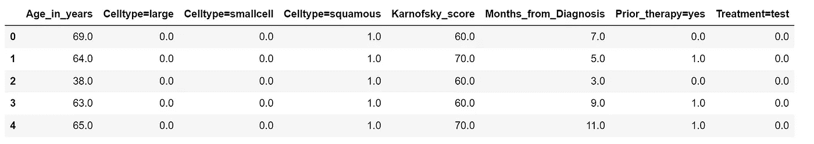

# Python 中的生存分析完全介绍

> 原文：[`towardsdatascience.com/the-complete-introduction-to-survival-analysis-in-python-7523e17737e6`](https://towardsdatascience.com/the-complete-introduction-to-survival-analysis-in-python-7523e17737e6)

## 了解生存分析、其在行业中的应用以及如何在 Python 中应用它

[](https://medium.com/@marcopeixeiro?source=post_page-----7523e17737e6--------------------------------)[](https://towardsdatascience.com/?source=post_page-----7523e17737e6--------------------------------) [Marco Peixeiro](https://medium.com/@marcopeixeiro?source=post_page-----7523e17737e6--------------------------------)

·发表于[Towards Data Science](https://towardsdatascience.com/?source=post_page-----7523e17737e6--------------------------------) ·13 min 阅读·2023 年 5 月 9 日

--


图片由[Ricky Kharawala](https://unsplash.com/@sweetmangostudios?utm_source=medium&utm_medium=referral)提供，来自[Unsplash](https://unsplash.com/?utm_source=medium&utm_medium=referral)

生存分析是一个迷人的领域，但在数据科学从业者中很少被使用或提及，至少在我的经验中是这样。虽然它主要用于医疗保健行业，但生存分析也可以应用于各种领域。

本文的目标是让你发现生存分析及其在你所在行业中的潜在应用。

在本文中，我们首先定义生存分析，并阐述其在不同领域的应用动机。然后，我们将了解如何实现生存分析的不同算法，并学习如何评估它们。

让我们开始吧！

# 什么是生存分析？

生存分析是统计学的一个分支，测量事件发生的预期持续时间。这个名称来自临床研究，因为我们对患者的生存感兴趣，换句话说，就是延长生存时间。

生存分析根据应用领域的不同可以有许多不同的名称。在工程学中，我们称之为*可靠性分析*，在经济学中称为*持续时间分析*。时间到事件分析也是另一个常见的名称。

## 回归还是分类？

既然生存分析测量事件发生的时间长度，这意味着它是一种回归类型。

然而，生存分析的输出不是一个连续的数字。

相反，我们的目标是生成**生存函数**或**风险函数**。

生存函数表示事件未发生的概率与时间的函数关系。

另一方面，风险函数表示事件在某个时间点发生的概率。

当我们实现不同的生存分析模型时，我们将更详细地查看这些函数。

# 什么时候使用生存分析？

现在我们了解到生存分析测量的是事件发生的时间，我们可以看到这并不专属于医疗保健领域。

实际上，生存分析可以在我们需要*在*事件发生之前采取行动的任何时候使用。

以员工流失问题为例。假设我们有以下数据集。

```py
 +--------+----------------+-------------------+----------------+----------+
| Salary | Years employed | Nb. of promotions | Direct manager | Has left |
+--------+----------------+-------------------+----------------+----------+
|  75000 |              2 |                 1 | John Doe       |        0 |
| 105000 |              4 |                 2 | Jane Doe       |        0 |
|  40000 |              2 |                 0 | John Doe       |        1 |
+--------+----------------+-------------------+----------------+----------+
```

直观地，我们将其框定为一个二分类问题，其中员工要么留在公司，要么离开。

如果我们的模型预测员工会留下，他们会待多久？如果模型预测员工会离开，他们会在多久之前离开？作为一个分类问题，要么我们不知道这些问题的答案，要么我们需要一个固定的时间段。例如，我们的数据标记为员工在 6 个月内离职。

将员工流失视为生存分析问题，我们可以将员工留在公司的概率作为时间的函数。这样，我们可以在员工实际离职之前采取行动。此外，我们可以分析我们的特征，并确定每个特征如何影响员工的离职时间。

现在，这只是一个例子，但生存分析可以应用于更多的情况，比如：

+   设备在多久之前需要维护？

+   客户在多久之前会偿还债务？

+   软件故障在多久之前会得到解决？

+   客户在多久之前会进行下一次购买？

家庭作业的核心信息是，当我们不仅对事件发生感兴趣，而且对事件发生前的时间持续性感兴趣时，我们应该使用生存分析。

# 生存分析中的数据

由于生存分析关心的是事件的发生及其发生前的时间持续性，我们的数据必须包含这些信息。

让我们重新查看员工流失的样本数据集。

```py
+--------+----------------+-------------------+----------------+----------+
| Salary | Years employed | Nb. of promotions | Direct manager | Has left |
+--------+----------------+-------------------+----------------+----------+
|  75000 |              2 |                 1 | John Doe       |        0 |
| 105000 |              4 |                 2 | Jane Doe       |        0 |
|  40000 |              2 |                 0 | John Doe       |        1 |
+--------+----------------+-------------------+----------------+----------+
```

在这里，我们可以看到我们拥有进行生存分析所需的信息：我们有雇佣年限以及员工是否离开。

当然，我们还有关于尚未离职员工的数据。

这就是我们所说的**删失数据**。对于两个员工，我们不知道他们何时会离开公司，或者他们是否会离开。

不过，我们不会等到所有员工离职后再采取行动，因此生存分析特别设计用于处理删失数据。

## 删失数据的类型

删失数据有三种类型：

1.  右删失

1.  左删失

1.  间隔删失

让我们看看每种类型。

**右删失数据**

对于右删失数据，我们知道每个受试者的起始点，但并非每个人的事件都被观察到，如下所示。


右删失数据：我们知道起始点，但不知道事件是否发生在每个受试者身上。图片来源：作者。

在上图中，受试者 A 离开了公司。对于受试者 B，在实验期间，他们留在公司。然而，我们不能知道他们是否在之后离开。因此，这是右删失的。

受试者 C 是另一个右删失数据的例子，其中某人简单地离开了实验。这可能发生在临床试验中，当某人仍然活着但离开试验时，我们就失去了对他们的跟踪。

**左删失数据**

要理解左删失数据，我们可以考虑感染病毒的例子。

在这里，左删失数据意味着我们不知道个人何时被感染，但我们知道他们有病毒。


左删失数据：我们不知道事件发生的时间，但后来观察到它。图片来源：作者。

在上图中，事件发生在我们观察之前，但我们无法知道确切时间。不过，这种类型的数据仍然可以用于生存分析。

**区间删失数据**

最后，区间删失数据是指事件发生在两个观察时刻之间，但我们不知道确切的时间。


区间删失数据：事件发生在两个观察点之间。图片来源：作者。

为了理解这一点，假设你去看医生并测试病毒。在第一次访问时，结果是阴性，你没有感染。

然后，下一周，你回到医生那里并测试病毒。现在，测试结果是阳性，这意味着你在两次访问之间的某个时候被感染了，但我们不知道确切的时间。

# 应用生存分析

现在我们对生存分析有了总体理解，包括其应用以及可以处理的数据类型，让我们用一个例子实际应用生存分析。

这里，我们使用的是 1980 年的退伍军人管理局肺癌试验数据集（Kalbfleisch, J.D., Prentice, R.L.：《失败时间数据的统计分析》。John Wiley & Sons, Inc. (2002)）。数据集可以公开下载。

这个数据集包含 137 名患者的数据，具有变量，并且是右删失的。这意味着在研究过程中，并不是所有患者都去世了。

这里，这个实验有两个主要目标：

1.  不同的治疗方法能否改善生存时间？

1.  我们能否预测患者的生存时间？

为了回答第一个问题，让我们实现我们的第一个生存分析方法：Kaplan-Meier 估计器。

## 实施 Kaplan-Meier 估计器

Kaplan-Meier 估计器是一种非参数统计方法，用于估计生存函数，它在处理右删失数据时效果良好。

正如我们很快会看到的，Kaplan-Meier 估计器将生成一个生存函数，表现为一系列下降的水平阶梯，如同楼梯一样。给定足够的样本，这个函数将接近真实的生存函数。

Kaplan-Meier 估计器的主要假设是，被删失的数据与未删失的数据具有相同的生存概率。因此，如果有人离开实验，我们将假设他们的生存概率与那些留在实验中并被观察到的人的生存概率相同。

为了实现这一点，我们将使用*scikit-survival* Python 包。这是一个包含数据集和常见生存分析模型的库。

首先，让我们读取数据。

```py
from sksurv.datasets import load_veterans_lung_cancer

X, y = load_veterans_lung_cancer()
```

很好！现在，我们可以导入 Kaplan-Meier 估计器并生成生存曲线。为此，我们需要传入两个参数：患者的状态（去世或未去世）和事件的时间（从研究开始到观察的天数）。

```py
from sksurv.nonparametric import kaplan_meier_estimator

time, survival_prob = kaplan_meier_estimator(y['Status'], y'Survival_in_days
```

然后，我们可以绘制生存函数。

```py
fig, ax = plt.subplots()
ax.step(time, survival_prob, where='post')
ax.set_ylabel('Probability of survival')
ax.set_xlabel('Time')

plt.tight_layout()
```

![

Kaplan-Meier 估计器在退伍军人管理局肺癌试验数据集上的生存函数。注意曲线如何如预期般是一个系列下降的水平阶梯。图片由作者提供。

从上面的图形中，我们可以看到生存函数确实是一系列如预期的下降水平阶梯。当研究开始时，大多数患者仍然活着，因此生存概率很高。然后，曲线迅速下降，意味着大多数患者在研究的前 400 天内去世。

现在，可以为不同的患者组生成生存函数。例如，在数据集中，进行了两种不同的治疗。了解某种治疗是否提高了生存机会将是有趣的。

让我们自己看看！我们将数据分为两组，根据治疗类型生成生存函数。然后，我们绘制它。

```py
for treatment_type in ('standard', 'test'):
    mask_treatment = X['Treatment'] == treatment_type

    time, survival_prob = kaplan_meier_estimator(
        y['Status'][mask_treatment],
        y['Survival_in_days'][mask_treatment]
    )

    plt.step(time, survival_prob, where='post', label=f'{treatment_type}')

plt.ylabel('Probability of survival')
plt.xlabel('Time')
plt.legend(loc='best')
plt.tight_layout()
```


两种不同治疗类型的生存函数。图片由作者提供。

从上面的图形来看，实验治疗似乎产生了比标准治疗更持久的生存曲线。

但是这种差异重要吗？

为了回答这个问题，我们使用**logrank 检验**。这是一个统计检验，用于确定两个生存曲线是否显著不同。在这里，零假设声明两条曲线没有显著差异。

使用*scikit-survival*，我们可以运行检验并输出 p 值。

```py
from sksurv.compare import compare_survival

group_indicator = X.loc[:, 'Treatment']
groups = group_indicator.unique()

chi2, pvalue= compare_survival(y, group_indicator)

print(pvalue)
```

这会输出一个 0.93 的 p 值。由于它不小于 0.05，我们不能拒绝零假设，并得出结论，生存曲线没有显著差异。因此，治疗类型没有帮助患者活得更久。

# 带协变量的生存分析

Kaplan-Meier 估计器是一个很好的起点，但由于它是一个非参数模型，无法考虑数据集中的任何特征。因此，我们将注意力转向可以考虑特征来估计生存函数的模型。

首先，让我们对数据进行独热编码，以便特征可以被使用。

```py
from sksurv.preprocessing import OneHotEncoder

X_num = OneHotEncoder().fit_transform(X)
```



编码后的特征。图片由作者提供。

太好了！现在，我们可以应用考虑协变量的模型来评估生存情况。在这里，我们使用 Cox 比例风险模型。

## Cox 比例风险模型

Cox 比例风险模型是评估不同因素对生存影响的模型之一。这样，我们可以确定哪些因素可以改善生存，哪些因素减少生存机会。

在这里，模型实际上估计了风险函数。换句话说，它计算了在某一点发生事件的概率。这与生存函数相反，生存函数估计在某一点事件不发生的概率。


可视化风险和生存函数。风险函数随着时间增加，而生存函数随着时间减少。图片由 Marta Sestelo 提供，来源于 [《生存分析简短课程》](https://bookdown.org/sestelo/sa_financial/intro-functions.html)。

从上图可以看出，生存函数随着时间减少，而风险函数随着时间增加。当然，一旦我们有了一个函数，我们可以轻松计算另一个函数。

因此，Cox 模型是一个表达为风险函数的模型：


Cox 比例风险方程。图片由作者提供。

在这里，*h* 代表风险（事件发生的概率），协变量由 *x* 表示。然后，系数 *b* 可以用来解释每个协变量的影响：

+   如果 b = 0，那么该特征没有影响

+   如果 b > 0，那么这些特征增加了风险（因此生存率下降）

+   如果 b < 0，那么该特征会降低风险（因此生存率增加）

该模型的一个重要假设是风险是成比例的，并且这种比例与时间无关。因此，如果在某个初始时间点，A 主体的死亡风险是 B 主体的两倍，那么这种比例保持不变，无论时间如何变化。

## 应用 Cox 比例风险模型

现在我们理解了 Cox 模型，让我们在数据集上应用它。

我们只需初始化模型并在数据上进行拟合。

```py
from sksurv.linear_model import CoxPHSurvivalAnalysis

estimator = CoxPHSurvivalAnalysis()
estimator.fit(X_num, y)
```

然后，对于未见患者的数据，模型可以为每个患者生成生存函数。注意使用 *predict_survival_function* 方法来获得生存函数，而不是风险函数。

```py
# Create a set of 4 synthetic patients

X_test = pd.DataFrame.from_dict({
    1: [65, 0, 0, 1, 60, 1, 0, 1],
    2: [65, 0, 0, 1, 60, 1, 0, 0],
    3: [65, 0, 1, 0, 60, 1, 0, 0],
    4: [65, 0, 1, 0, 60, 1, 0, 1]},
     columns=X_num.columns, orient='index')

# Estimate the survival functions
pred_surv = estimator.predict_survival_function(X_test)

# Plot the survival function for each new patient
time_points = np.arange(1, 1000)

for i, surv_func in enumerate(pred_surv):
    plt.step(time_points, surv_func(time_points), where='post', label=f'Sample {i+1}')

plt.ylabel('Probability of survival')
plt.xlabel('Time')
plt.legend(loc='best')
plt.tight_layout()
```


每个新患者的 Cox 比例风险模型的生存函数。图片由作者提供。

从上图中，我们可以看到模型为每个患者生成了一个独特的生存函数。我们可以看到，对于样本 4，生存时间减少最快，而样本 2 减少最慢。

# 评估生存分析模型

所以，我们从我们的 Cox 比例风险模型中获得了预测并得到了生存曲线。但是我们怎么知道这些预测是否有效呢？

生存分析中的常见评估指标是 **一致性指数** 或 **c-index** 和时间依赖的 ROC AUC。让我们更详细地探讨这两者。

## 一致性指数（c-index）

生存模型将预测危险概率。因此，具有较高危险概率的样本应具有较短的生存时间。

然后，为了计算 c-index，我们取一对样本并查找以下内容：

+   如果对中的两个样本被截尾，则该对样本被忽略（对 c-index 无影响）

+   如果具有更高预测危险的样本比对中其他样本的生存时间更短，那么它就是一个一致对（c-index 增加）

+   如果具有更高预测危险的样本比对中其他样本的生存时间更长，那么该对样本是不同意对（c-index 减少）。

然后，为了解释 c-index，我们使用与分类中 ROC AUC 相同的逻辑：

+   0.5 是一个随机模型

+   1.0 是一个完美模型

+   0 是一个每次都错的模型

因此，你希望你的 c-index 至少大于 0.5，并且越接近 1 越好。

## 使用 c-index 评估我们的 Cox 模型

现在，让我们计算我们 Cox 模型的 c-index。

```py
from sksurv.metrics import concordance_index_censored

estimator.score(X_num, y)
```

这返回一个 0.74 的 c-index，意味着我们的模型比随机模型表现更好，这是一个好兆头。

## 时间依赖的 ROC AUC

如果你曾处理过分类问题，你可能遇到过 ROC AUC 作为评估指标。你基本上是通过测量 ROC 曲线下的面积来评估模型性能。再次强调，你希望该面积大于 0.5，并尽可能接近 1。

现在，在生存分析中，我们有一个连续的结果，意味着 ROC 随时间变化，这与二元分类不同。例如，一个客户可以按时还信用卡，但随后在未来某个时点开始违约。

因此，使用时间依赖的 ROC AUC 对于评估模型在时间 *t* 发生事件的能力是有用的。

## 使用动态 ROC AUC 评估我们的 Cox 模型。

使用 scikit-survival，让我们通过时间依赖的 ROC AUC 来评估我们的 Cox 模型。

```py
from sklearn.model_selection import train_test_split

# Split into train/test 
X_train, X_test, y_train, y_test = train_test_split(X_num, y, test_size=0.2, stratify=y['Status'], random_state=42)

# Fit the model on the training set
cph = CoxPHSurvivalAnalysis()
cph.fit(X_train, y_train)

# Plot the time-depdendent ROC and calculate AUC
from sksurv.metrics import cumulative_dynamic_auc

time_interval = np.arange(8, 184, 7)

cph_risk_scores = cph.predict(X_test)
cph_auc, cph_mean_auc = cumulative_dynamic_auc(y_train, y_test, cph_risk_scores, time_interval)

fig, ax = plt.subplots()

ax.plot(time_interval, cph_auc, marker='o')
ax.axhline(cph_mean_auc, ls='--')
ax.set_xlabel('Days after enrollment')
ax.set_ylabel('Time-dependent AUC')

plt.grid(True)
plt.tight_layout()
```


我们 Cox 模型的时间依赖 ROC AUC。平均 AUC 为 0.85。图片由作者提供。

如上图所示，我们的模型性能随时间变化。我们看到其最佳性能在 75 到 125 天之间。因此，我们的模型在中期预测效果最好。

从这里开始，我们可以开发其他生存模型，以查看它们在短期或长期内预测事件的表现如何，从而补充 Cox 模型。

# 结论

恭喜你完成了这篇文章！信息量很大，尤其是如果你对生存分析完全陌生的话。

希望你学到了新的东西，并且我激发了你去探索生存分析领域，并将其应用于你的项目！

让我们在[LinkedIn](https://www.linkedin.com/in/marco-peixeiro/)上保持联系！

干杯 🍻

# 支持我

喜欢我的工作吗？通过[Buy me a coffee](http://buymeacoffee.com/dswm)来支持我，这是一种简单的方式来鼓励我，同时我也能享受一杯咖啡！如果你愿意，请点击下面的按钮 👇


